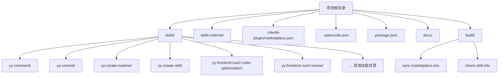
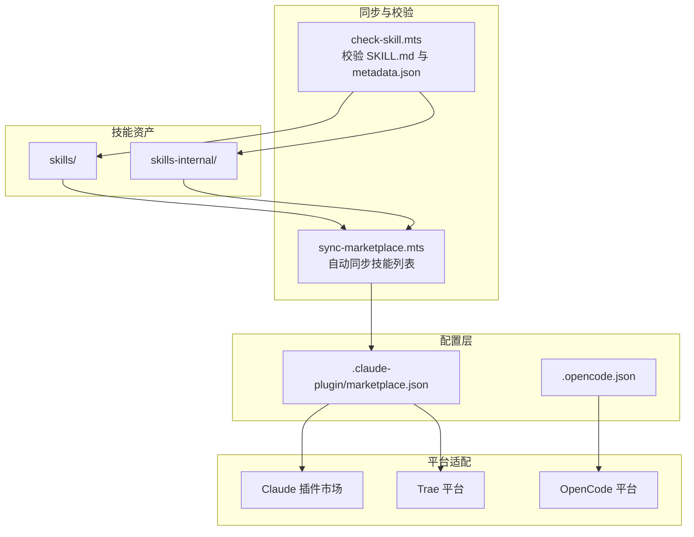
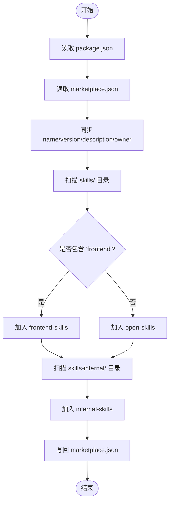
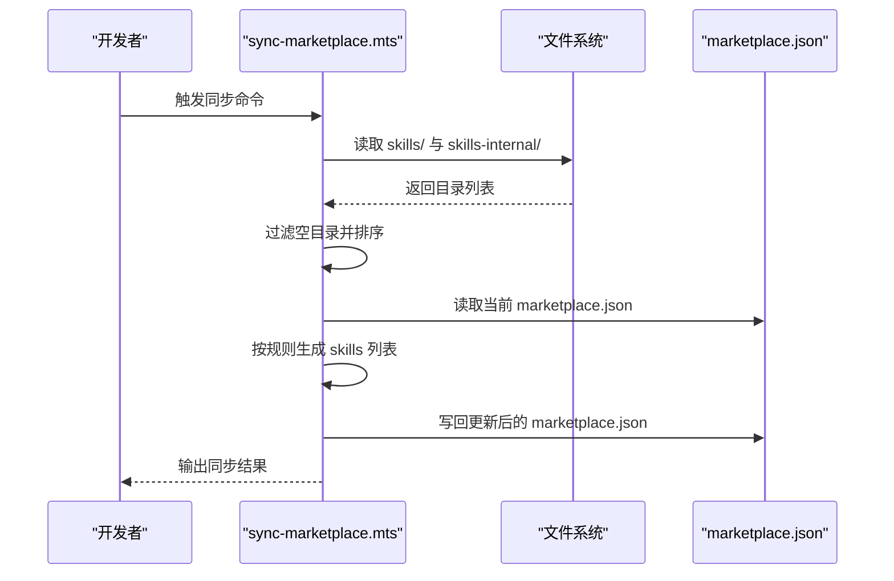
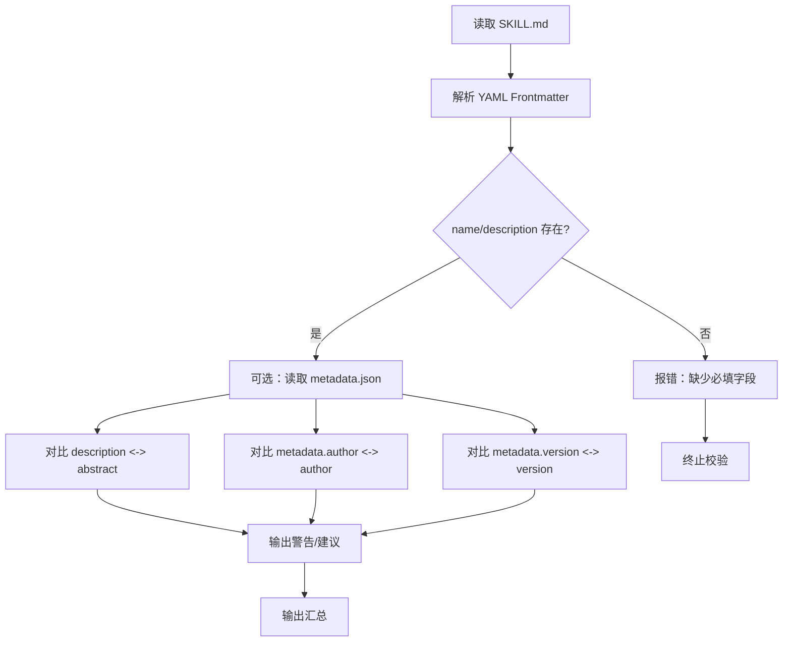
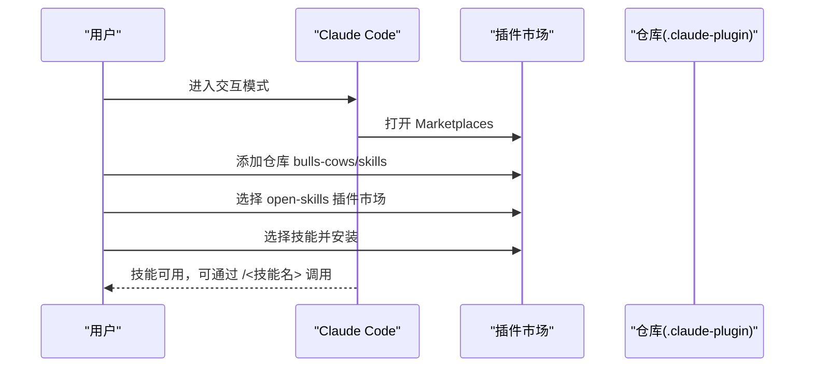
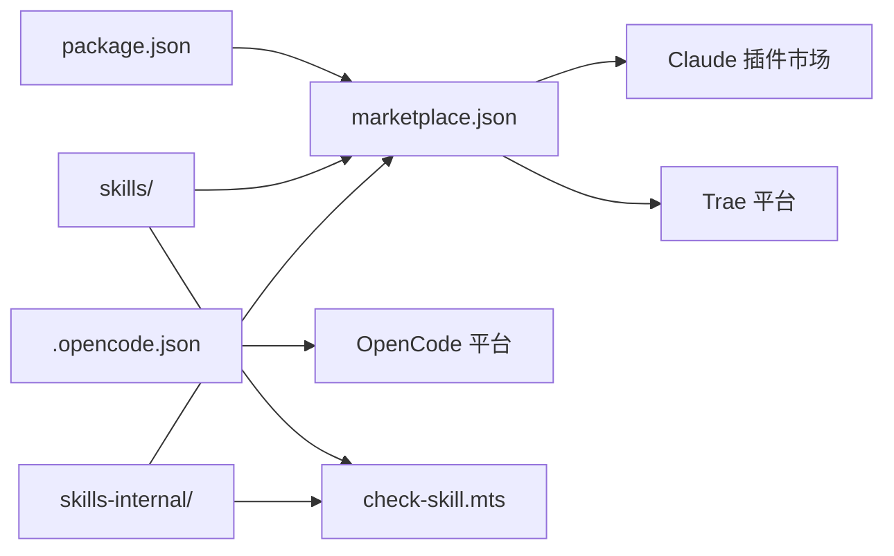

# 市场集成

<cite>
**本文引用的文件**
- [.claude-plugin/marketplace.json](file://.claude-plugin/marketplace.json)
- [.opencode.json](file://.opencode.json)
- [package.json](file://package.json)
- [docs/STRUCTURE.md](file://docs/STRUCTURE.md)
- [docs/CONFIG_RULE.md](file://docs/CONFIG_RULE.md)
- [docs/CLAUDE_CODE_SKILL.md](file://docs/CLAUDE_CODE_SKILL.md)
- [build/sync-marketplace.mts](file://build/sync-marketplace.mts)
- [build/check-skill.mts](file://build/check-skill.mts)
- [skills/yy-comment/SKILL.md](file://skills/yy-comment/SKILL.md)
- [skills/yy-commit/SKILL.md](file://skills/yy-commit/SKILL.md)
- [skills/yy-create-readme/SKILL.md](file://skills/yy-create-readme/SKILL.md)
- [skills/yy-create-skill/SKILL.md](file://skills/yy-create-skill/SKILL.md)
- [skills/yy-create-skill/examples/input.md](file://skills/yy-create-skill/examples/input.md)
- [skills/yy-create-skill/examples/output.md](file://skills/yy-create-skill/examples/output.md)
- [skills/yy-frontend-vue2-code-optimization/metadata.json](file://skills/yy-frontend-vue2-code-optimization/metadata.json)
- [skills/yy-frontend-vue3-review/metadata.json](file://skills/yy-frontend-vue3-review/metadata.json)
- [docs/DEVELOP.md](file://docs/DEVELOP.md)
- [docs/RECOMMEND_SKILLS.md](file://docs/RECOMMEND_SKILLS.md)
</cite>

## 目录
1. [简介](#简介)
2. [项目结构](#项目结构)
3. [核心组件](#核心组件)
4. [架构总览](#架构总览)
5. [详细组件分析](#详细组件分析)
6. [依赖关系分析](#依赖关系分析)
7. [性能考量](#性能考量)
8. [故障排查指南](#故障排查指南)
9. [结论](#结论)
10. [附录](#附录)

## 简介
本文件面向市场运营与平台集成工程师，系统化阐述多平台技能市场的支持能力与集成方法，重点覆盖以下方面：
- 多平台市场支持：Claude 插件市场、OpenCode 平台、Trae 平台等的接入要点与差异
- marketplace.json 配置文件结构与参数语义：技能分组、分类标签、元数据管理
- 自动同步机制：技能发现、变更检测与批量更新流程
- 最佳实践：技能分类策略、元数据优化、搜索可见性提升
- 平台特殊要求与限制：格式规范、大小限制、审核标准
- 市场推广与用户反馈：推广渠道与反馈收集方法
- 运营流程：技能发布、更新、下架的完整操作指引

## 项目结构
该项目采用“技能即资产”的组织方式，核心目录与文件如下：
- skills/：公共技能集合，按功能域划分子目录
- skills-internal/：内部技能集合，用于仓库维护与治理
- .claude-plugin/marketplace.json：Claude 插件市场配置，定义插件与技能分组
- .opencode.json：OpenCode 平台配置入口
- package.json：项目元信息与构建脚本，包含 marketplace 同步与校验脚本
- docs/：文档与规范，包括项目结构、配置规则、安装指南等
- build/：构建与运维脚本，包含 marketplace 同步与技能校验

**图示来源**
- [docs/STRUCTURE.md:1-10](file://docs/STRUCTURE.md#L1-L10)
- [.claude-plugin/marketplace.json:1-65](file://.claude-plugin/marketplace.json#L1-L65)
- [.opencode.json:1-14](file://.opencode.json#L1-L14)
- [package.json:1-46](file://package.json#L1-L46)

**章节来源**
- [docs/STRUCTURE.md:1-10](file://docs/STRUCTURE.md#L1-L10)
- [.claude-plugin/marketplace.json:1-65](file://.claude-plugin/marketplace.json#L1-L65)
- [.opencode.json:1-14](file://.opencode.json#L1-L14)
- [package.json:1-46](file://package.json#L1-L46)

## 核心组件
- marketplace.json：定义市场名称、拥有者、元数据与插件分组，以及各插件所包含的技能路径列表
- 同步脚本 sync-marketplace.mts：自动扫描 skills 与 skills-internal 目录，按规则生成/更新 marketplace.json
- 校验脚本 check-skill.mts：校验 SKILL.md 与 metadata.json 的一致性与规范性
- 平台配置文件：.opencode.json 用于 OpenCode 平台；Claude 安装与使用参考文档
- 技能文档与元数据：SKILL.md 与 metadata.json，支撑搜索可见性与分类标签

**章节来源**
- [.claude-plugin/marketplace.json:1-65](file://.claude-plugin/marketplace.json#L1-L65)
- [build/sync-marketplace.mts:1-93](file://build/sync-marketplace.mts#L1-L93)
- [build/check-skill.mts:1-230](file://build/check-skill.mts#L1-L230)
- [.opencode.json:1-14](file://.opencode.json#L1-L14)
- [docs/CLAUDE_CODE_SKILL.md:1-10](file://docs/CLAUDE_CODE_SKILL.md#L1-L10)

## 架构总览
市场集成的整体架构由“配置驱动 + 自动同步 + 规范校验 + 平台适配”构成，如下所示：

**图示来源**
- [build/sync-marketplace.mts:1-93](file://build/sync-marketplace.mts#L1-L93)
- [build/check-skill.mts:1-230](file://build/check-skill.mts#L1-L230)
- [.claude-plugin/marketplace.json:1-65](file://.claude-plugin/marketplace.json#L1-L65)
- [.opencode.json:1-14](file://.opencode.json#L1-L14)

## 详细组件分析

### marketplace.json 配置详解
- 顶层字段
  - name：市场名称，与 package.json 的 name 保持一致
  - owner.name：市场拥有者名称
  - metadata.description/version：市场描述与版本
- plugins 数组：每个插件代表一类技能集合
  - name：插件名称（如 open-skills、frontend-skills、internal-skills）
  - description：插件描述
  - source：技能路径前缀（当前为根路径）
  - strict：启用严格模式（用于约束与校验）
  - skills：技能路径数组，按规则自动同步生成
- 自动分组策略
  - 非前端技能：统一归入 open-skills 插件
  - 前端技能：归入 frontend-skills 插件
  - 内部技能：归入 internal-skills 插件

**图示来源**
- [build/sync-marketplace.mts:18-93](file://build/sync-marketplace.mts#L18-L93)
- [.claude-plugin/marketplace.json:10-63](file://.claude-plugin/marketplace.json#L10-L63)

**章节来源**
- [.claude-plugin/marketplace.json:1-65](file://.claude-plugin/marketplace.json#L1-L65)
- [build/sync-marketplace.mts:1-93](file://build/sync-marketplace.mts#L1-L93)

### 自动同步机制
- 技能发现
  - 读取 skills/ 与 skills-internal/ 目录，过滤空目录并按字母序排序
- 变更检测
  - 通过比较当前目录与 marketplace.json 中已记录的 skills 列表，动态更新
- 批量更新
  - 将非前端技能写入 open-skills，前端技能写入 frontend-skills，内部技能写入 internal-skills
  - 同步 package.json 的 name/version/description/author 到 marketplace.json
- 输出
  - 控制台打印同步结果与删除的空目录提示

**图示来源**
- [build/sync-marketplace.mts:31-93](file://build/sync-marketplace.mts#L31-L93)

**章节来源**
- [build/sync-marketplace.mts:1-93](file://build/sync-marketplace.mts#L1-L93)

### 元数据与分类标签
- SKILL.md 元数据
  - 必填字段：name、description
  - 与目录名一致，便于自动发现与匹配
- metadata.json 元数据
  - 用于补充 abstract、tags、category、compatibility、features 等
  - 与 SKILL.md 的 description/author/version 进行一致性校验
- 校验规则
  - description -> abstract：单行化比对，建议保持一致
  - metadata.author -> author：字段一致性
  - metadata.version -> version：类型与值一致性

**图示来源**
- [build/check-skill.mts:50-172](file://build/check-skill.mts#L50-L172)
- [skills/yy-frontend-vue2-code-optimization/metadata.json:1-40](file://skills/yy-frontend-vue2-code-optimization/metadata.json#L1-L40)
- [skills/yy-frontend-vue3-review/metadata.json:1-42](file://skills/yy-frontend-vue3-review/metadata.json#L1-L42)

**章节来源**
- [build/check-skill.mts:1-230](file://build/check-skill.mts#L1-L230)
- [skills/yy-frontend-vue2-code-optimization/metadata.json:1-40](file://skills/yy-frontend-vue2-code-optimization/metadata.json#L1-L40)
- [skills/yy-frontend-vue3-review/metadata.json:1-42](file://skills/yy-frontend-vue3-review/metadata.json#L1-L42)

### 平台集成方法

#### Claude 插件市场
- marketplace.json 作为插件市场配置文件，定义插件与技能分组
- 安装流程：通过 Claude Code 插件市场添加仓库并选择插件市场，再选择技能安装
- 本地调试：可在本地仓库根目录执行技能添加命令进行调试

**图示来源**
- [docs/CLAUDE_CODE_SKILL.md:1-10](file://docs/CLAUDE_CODE_SKILL.md#L1-L10)
- [.claude-plugin/marketplace.json:10-63](file://.claude-plugin/marketplace.json#L10-L63)

**章节来源**
- [docs/CLAUDE_CODE_SKILL.md:1-10](file://docs/CLAUDE_CODE_SKILL.md#L1-L10)
- [.claude-plugin/marketplace.json:1-65](file://.claude-plugin/marketplace.json#L1-L65)
- [docs/DEVELOP.md:1-18](file://docs/DEVELOP.md#L1-L18)

#### OpenCode 平台
- 通过 .opencode.json 指定指令与规则文件路径，实现项目级规则注入
- 规则文件需放置于 .opencode/rules/ 目录下，并在根目录创建 opencode.json 进行配置

**章节来源**
- [.opencode.json:1-14](file://.opencode.json#L1-L14)
- [docs/CONFIG_RULE.md:1-34](file://docs/CONFIG_RULE.md#L1-L34)

#### Trae 平台
- 项目结构文档指出 Trae 平台目录为 .trae/skills/，技能输出目录优先级包含该路径
- marketplace.json 同时作为 Trae 平台的技能来源之一

**章节来源**
- [docs/STRUCTURE.md:1-10](file://docs/STRUCTURE.md#L1-L10)
- [.claude-plugin/marketplace.json:10-63](file://.claude-plugin/marketplace.json#L10-L63)

### 最佳实践

#### 技能分类策略
- 前端类技能：统一放入 frontend-skills 插件，便于按技术栈检索
- 内部治理类技能：放入 internal-skills 插件，隔离对外展示
- 其他通用技能：放入 open-skills 插件，作为公共市场入口

#### 元数据优化
- description 与 abstract 保持一致，避免搜索歧义
- tags 与 category 精准覆盖技能功能域，提升搜索命中率
- compatibility 与 features 清晰列出支持文件类型、API 风格与核心能力

#### 搜索可见性提升
- 使用明确、可检索的 name 与 description
- 在 metadata.json 中补充 features，突出差异化能力
- 保持 metadata.json 与 SKILL.md 的一致性，减少匹配误差

**章节来源**
- [build/sync-marketplace.mts:49-60](file://build/sync-marketplace.mts#L49-L60)
- [build/check-skill.mts:127-172](file://build/check-skill.mts#L127-L172)
- [skills/yy-frontend-vue2-code-optimization/metadata.json:1-40](file://skills/yy-frontend-vue2-code-optimization/metadata.json#L1-L40)
- [skills/yy-frontend-vue3-review/metadata.json:1-42](file://skills/yy-frontend-vue3-review/metadata.json#L1-L42)

### 不同平台的特殊要求与限制
- 格式规范
  - SKILL.md 必须以 YAML frontmatter 开头，name 与目录名一致
  - metadata.json 字段需与 SKILL.md 的 metadata 字段保持一致
- 大小限制
  - 建议将长模板内容迁移至 templates/，避免 SKILL.md 过长
- 审核标准
  - 保持 description 仅用于触发判断，避免实现细节
  - 严格遵守各平台的规则与指令文件要求（Claude Code、OpenCode）

**章节来源**
- [build/check-skill.mts:50-122](file://build/check-skill.mts#L50-L122)
- [skills/yy-create-skill/SKILL.md:74-98](file://skills/yy-create-skill/SKILL.md#L74-L98)

### 市场推广与用户反馈
- 推广渠道
  - 可通过外部推荐技能列表进行推广，结合平台安装命令引导用户安装
- 用户反馈
  - 建议在技能文档中提供反馈入口与问题追踪链接，持续优化元数据与分类

**章节来源**
- [docs/RECOMMEND_SKILLS.md:1-39](file://docs/RECOMMEND_SKILLS.md#L1-L39)

### 运营流程：发布、更新、下架
- 发布
  - 创建新技能：参考技能创建模板与指南，确保 SKILL.md 与 metadata.json 规范
  - 提交后触发同步脚本，自动更新 marketplace.json
- 更新
  - 修改 SKILL.md 或 metadata.json 后，运行校验脚本确保一致性
  - 重新同步 marketplace.json，确保市场展示最新信息
- 下架
  - 删除技能目录或将其移出 skills/ 目录，同步脚本会自动清理并更新 marketplace.json

**章节来源**
- [skills/yy-create-skill/SKILL.md:130-176](file://skills/yy-create-skill/SKILL.md#L130-L176)
- [build/check-skill.mts:177-230](file://build/check-skill.mts#L177-L230)
- [build/sync-marketplace.mts:31-93](file://build/sync-marketplace.mts#L31-L93)

## 依赖关系分析
- marketplace.json 依赖 package.json 的元信息进行同步
- 同步脚本依赖 skills/ 与 skills-internal/ 的目录结构
- 校验脚本依赖 SKILL.md 与 metadata.json 的一致性
- 平台适配依赖各平台的配置文件与安装/使用文档

**图示来源**
- [package.json:7-16](file://package.json#L7-L16)
- [build/sync-marketplace.mts:8-16](file://build/sync-marketplace.mts#L8-L16)
- [build/check-skill.mts:177-230](file://build/check-skill.mts#L177-L230)
- [.opencode.json:1-14](file://.opencode.json#L1-L14)

**章节来源**
- [package.json:1-46](file://package.json#L1-L46)
- [build/sync-marketplace.mts:1-93](file://build/sync-marketplace.mts#L1-L93)
- [build/check-skill.mts:1-230](file://build/check-skill.mts#L1-L230)

## 性能考量
- 同步脚本按字母序扫描目录，时间复杂度近似 O(n log n)，n 为技能数量
- 校验脚本逐个读取 SKILL.md 与 metadata.json，I/O 成本与技能数量线性相关
- 建议在 CI 中定期运行校验与同步，避免大规模变更导致的冲突

## 故障排查指南
- marketplace.json 未更新
  - 检查同步脚本是否执行成功，确认 skills/ 与 skills-internal/ 目录结构
- 元数据不一致
  - 使用校验脚本检查 description/abstract、author、version 的一致性
- 安装失败或技能不可见
  - 确认 SKILL.md 的 YAML frontmatter 正确，name 与目录名一致
  - 检查平台配置文件（.opencode.json、Claude 安装文档）是否正确

**章节来源**
- [build/sync-marketplace.mts:85-93](file://build/sync-marketplace.mts#L85-L93)
- [build/check-skill.mts:177-230](file://build/check-skill.mts#L177-L230)
- [docs/CLAUDE_CODE_SKILL.md:1-10](file://docs/CLAUDE_CODE_SKILL.md#L1-L10)

## 结论
本项目通过 marketplace.json 配置与自动化脚本实现了多平台技能市场的统一管理。借助规范化的 SKILL.md 与 metadata.json，配合同步与校验流程，能够稳定地维护技能资产并在 Claude、OpenCode、Trae 等平台上高效分发。建议持续优化元数据与分类策略，完善校验与同步流程，以提升市场运营效率与用户体验。

## 附录

### marketplace.json 字段说明
- name：市场名称，与 package.json 的 name 保持一致
- owner.name：市场拥有者
- metadata.description/version：市场描述与版本
- plugins[].name：插件名称（open-skills、frontend-skills、internal-skills）
- plugins[].description：插件描述
- plugins[].source：技能路径前缀
- plugins[].strict：严格模式开关
- plugins[].skills：技能路径数组

**章节来源**
- [.claude-plugin/marketplace.json:1-65](file://.claude-plugin/marketplace.json#L1-L65)

### 平台配置要点
- Claude Code：通过 Marketplaces 添加仓库并选择插件市场安装技能
- OpenCode：在根目录创建 opencode.json 并配置规则文件路径
- Trae：技能输出目录优先级包含 .trae/skills/

**章节来源**
- [docs/CLAUDE_CODE_SKILL.md:1-10](file://docs/CLAUDE_CODE_SKILL.md#L1-L10)
- [.opencode.json:1-14](file://.opencode.json#L1-L14)
- [docs/STRUCTURE.md:1-10](file://docs/STRUCTURE.md#L1-L10)