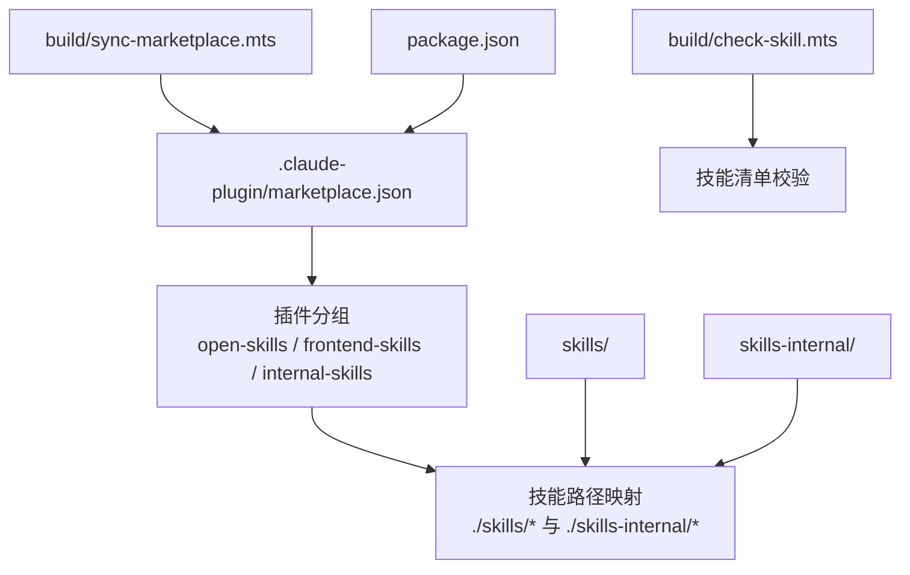
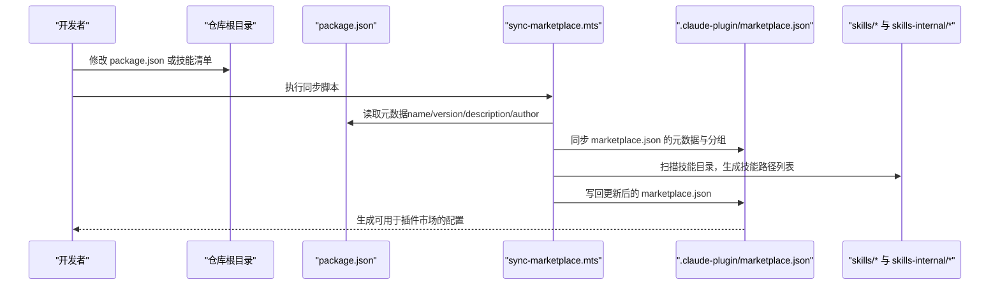
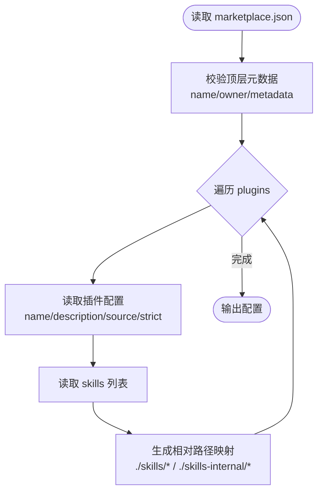
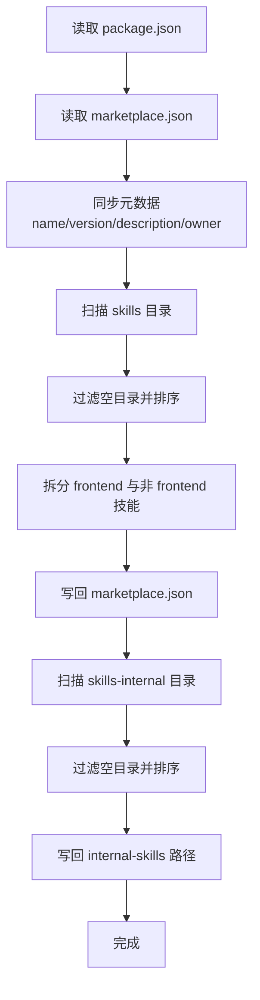
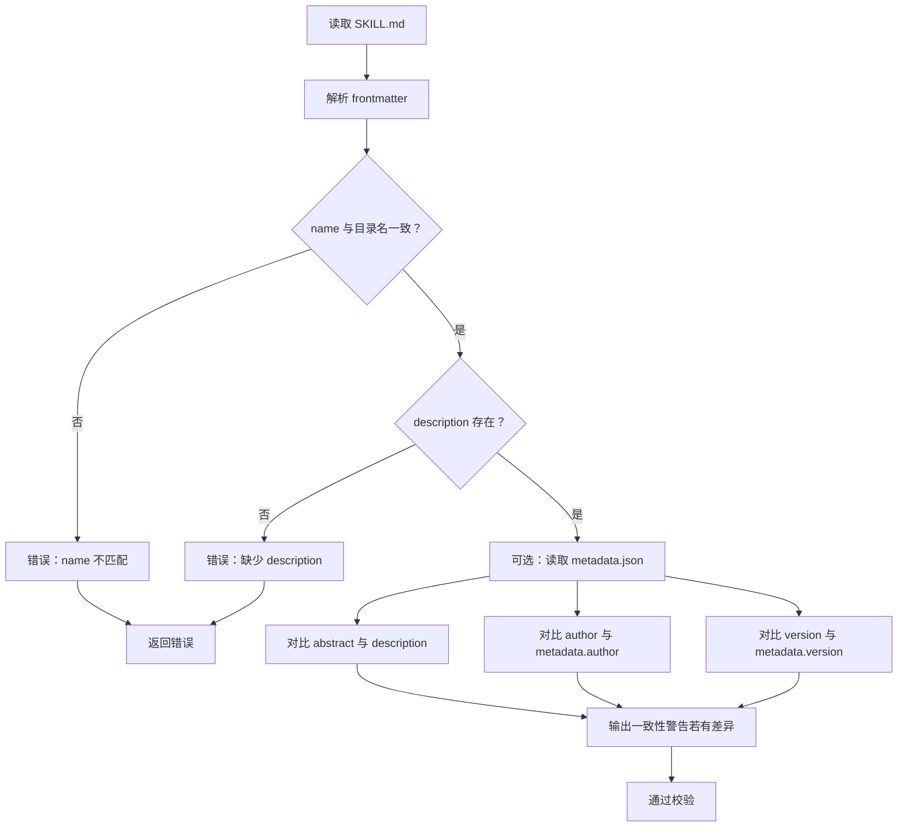
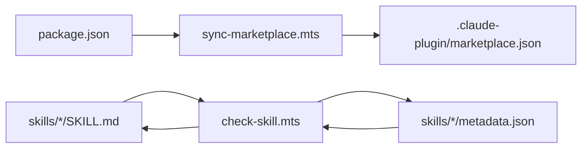

# Claude 插件市场集成

<cite>
**本文引用的文件**
- [.claude-plugin/marketplace.json](file://.claude-plugin/marketplace.json)
- [package.json](file://package.json)
- [docs/DEVELOP.md](file://docs/DEVELOP.md)
- [docs/STRUCTURE.md](file://docs/STRUCTURE.md)
- [docs/CLAUDE_CODE_SKILL.md](file://docs/CLAUDE_CODE_SKILL.md)
- [docs/RECOMMEND_SKILLS.md](file://docs/RECOMMEND_SKILLS.md)
- [build/check-skill.mts](file://build/check-skill.mts)
- [build/sync-marketplace.mts](file://build/sync-marketplace.mts)
- [skills/yy-comment/SKILL.md](file://skills/yy-comment/SKILL.md)
- [skills/yy-frontend-vue2-code-optimization/metadata.json](file://skills/yy-frontend-vue2-code-optimization/metadata.json)
- [skills/yy-create-skill/templates/skill-template.md](file://skills/yy-create-skill/templates/skill-template.md)
- [skills/yy-post-to-wechat/scripts/package.json](file://skills/yy-post-to-wechat/scripts/package.json)
</cite>

## 目录
1. [简介](#简介)
2. [项目结构](#项目结构)
3. [核心组件](#核心组件)
4. [架构总览](#架构总览)
5. [详细组件分析](#详细组件分析)
6. [依赖关系分析](#依赖关系分析)
7. [性能考虑](#性能考虑)
8. [故障排除指南](#故障排除指南)
9. [结论](#结论)
10. [附录](#附录)

## 简介
本文件面向希望在 Claude 插件市场中发布与维护技能的开发者，系统性说明以下内容：
- marketplace.json 配置文件的结构、作用与维护流程
- 技能清单文件（SKILL.md）的格式要求与元数据管理
- 本地开发、打包与同步至插件市场的完整工作流程
- 常见问题与故障排除建议（权限、网络、认证等）

## 项目结构
该项目采用“技能 + 市场配置 + 构建脚本”的组织方式，核心目录与职责如下：
- .claude-plugin/marketplace.json：插件市场配置，定义插件分组、技能目录映射与元数据
- skills/：公共技能集合，每个技能以独立目录存放，包含 SKILL.md 清单与资源
- skills-internal/：内部技能集合，用于仓库维护相关能力
- rules/：自定义规则与参考文档
- build/：校验与同步脚本，保障 marketplace.json 与 package.json 的一致性
- docs/：开发与使用指南、推荐技能列表等

**图示来源**
- [.claude-plugin/marketplace.json:1-65](file://.claude-plugin/marketplace.json#L1-L65)
- [build/sync-marketplace.mts:1-93](file://build/sync-marketplace.mts#L1-L93)
- [package.json:1-46](file://package.json#L1-L46)

**章节来源**
- [docs/STRUCTURE.md:1-10](file://docs/STRUCTURE.md#L1-L10)

## 核心组件
- marketplace.json：定义市场名称、拥有者、元数据以及三个插件分组及其技能路径列表
- package.json：提供仓库元数据（名称、版本、描述、作者），驱动同步脚本
- 同步脚本 sync-marketplace.mts：自动将 package.json 的元数据与技能目录同步到 marketplace.json
- 校验脚本 check-skill.mts：校验每个技能的 SKILL.md 清单与 metadata.json 的一致性
- 技能清单 SKILL.md：每个技能的说明、使用场景、指令与资源清单
- 技能元数据 metadata.json：技能的版本、摘要、标签、兼容性等结构化信息

**章节来源**
- [.claude-plugin/marketplace.json:1-65](file://.claude-plugin/marketplace.json#L1-L65)
- [package.json:1-46](file://package.json#L1-L46)
- [build/sync-marketplace.mts:1-93](file://build/sync-marketplace.mts#L1-L93)
- [build/check-skill.mts:1-230](file://build/check-skill.mts#L1-L230)

## 架构总览
下图展示了从本地开发到插件市场发布的整体流程，以及 marketplace.json 与 package.json 的联动关系。

**图示来源**
- [build/sync-marketplace.mts:1-93](file://build/sync-marketplace.mts#L1-L93)
- [.claude-plugin/marketplace.json:1-65](file://.claude-plugin/marketplace.json#L1-L65)
- [package.json:1-46](file://package.json#L1-L46)

## 详细组件分析

### marketplace.json 配置详解
- 顶层字段
  - name：市场名称，通常与仓库名称一致
  - owner.name：市场拥有者名称
  - metadata：市场元数据，包含 description 与 version
- plugins 数组：定义插件分组
  - 每个插件包含 name、description、source、strict 与 skills 列表
  - skills 列表为相对路径，指向 skills/ 或 skills-internal/ 下的具体技能目录
- 分组策略
  - open-skills：通用技能集合
  - frontend-skills：前端相关技能集合
  - internal-skills：内部维护类技能集合

**图示来源**
- [.claude-plugin/marketplace.json:1-65](file://.claude-plugin/marketplace.json#L1-L65)

**章节来源**
- [.claude-plugin/marketplace.json:1-65](file://.claude-plugin/marketplace.json#L1-L65)

### 同步脚本：sync-marketplace.mts
- 功能
  - 从 package.json 读取 name、version、description、author
  - 同步到 marketplace.json 的对应字段
  - 扫描 skills 与 skills-internal 目录，生成技能路径列表并按字母排序
  - 将技能按是否包含“frontend”关键字分为 open-skills 与 frontend-skills
  - 写回更新后的 marketplace.json
- 关键点
  - 自动删除空目录，避免陈旧路径污染
  - 严格区分公开与内部技能，确保市场分组正确

**图示来源**
- [build/sync-marketplace.mts:1-93](file://build/sync-marketplace.mts#L1-L93)

**章节来源**
- [build/sync-marketplace.mts:1-93](file://build/sync-marketplace.mts#L1-L93)

### 技能清单与元数据：SKILL.md 与 metadata.json
- SKILL.md
  - 必须以 YAML frontmatter 开头，包含 name、description、icon（可选）、examples（可选）、metadata（可选）
  - 校验规则
    - 文件存在且非空
    - frontmatter 以 --- 开始与结束
    - name 与技能目录名一致
    - 与 metadata.json 的 abstract/author/version 进行一致性比对（警告提示）
- metadata.json
  - 用于技能的结构化元数据，如 version、date、author、abstract、tags、compatibility 等
  - 与 SKILL.md 的对应字段进行一致性检查

**图示来源**
- [build/check-skill.mts:1-230](file://build/check-skill.mts#L1-L230)
- [skills/yy-comment/SKILL.md:1-192](file://skills/yy-comment/SKILL.md#L1-L192)
- [skills/yy-frontend-vue2-code-optimization/metadata.json:1-40](file://skills/yy-frontend-vue2-code-optimization/metadata.json#L1-L40)

**章节来源**
- [build/check-skill.mts:1-230](file://build/check-skill.mts#L1-L230)
- [skills/yy-comment/SKILL.md:1-192](file://skills/yy-comment/SKILL.md#L1-L192)
- [skills/yy-frontend-vue2-code-optimization/metadata.json:1-40](file://skills/yy-frontend-vue2-code-optimization/metadata.json#L1-L40)

### 技能清单模板与示例
- 模板文件提供了 SKILL.md 的基础结构与章节组织建议，便于新技能快速上手
- 示例文件展示了完整技能输出的参考格式

**章节来源**
- [skills/yy-create-skill/templates/skill-template.md:1-37](file://skills/yy-create-skill/templates/skill-template.md#L1-L37)

### 本地开发与安装
- 本地调试
  - 在根目录执行技能添加命令，即可将 skills 目录下的技能加入本地环境
  - 本地调试会产生临时文件，已在忽略列表中配置，避免误提交
- 在 Claude Code 中安装市场与技能
  - 通过 Claude Code 的插件市场功能添加仓库与插件市场，再选择所需技能安装

**章节来源**
- [docs/DEVELOP.md:1-18](file://docs/DEVELOP.md#L1-L18)
- [docs/CLAUDE_CODE_SKILL.md:1-10](file://docs/CLAUDE_CODE_SKILL.md#L1-L10)

## 依赖关系分析
- marketplace.json 依赖 package.json 的元数据进行同步
- 技能清单与元数据相互依赖，需保持一致性
- 同步脚本依赖技能目录结构，自动维护路径列表

**图示来源**
- [build/sync-marketplace.mts:1-93](file://build/sync-marketplace.mts#L1-L93)
- [build/check-skill.mts:1-230](file://build/check-skill.mts#L1-L230)
- [.claude-plugin/marketplace.json:1-65](file://.claude-plugin/marketplace.json#L1-L65)
- [package.json:1-46](file://package.json#L1-L46)

**章节来源**
- [build/sync-marketplace.mts:1-93](file://build/sync-marketplace.mts#L1-L93)
- [build/check-skill.mts:1-230](file://build/check-skill.mts#L1-L230)

## 性能考虑
- 同步脚本在扫描技能目录时会进行排序与空目录清理，建议保持技能目录结构清晰，避免过多深层嵌套
- 校验脚本逐个检查 SKILL.md 与 metadata.json，建议在 CI 中批量执行，减少本地负担
- marketplace.json 的路径列表按字母排序，有助于稳定性和可读性

## 故障排除指南
- marketplace.json 与 package.json 元数据不同步
  - 现象：市场版本号或描述未更新
  - 处理：执行同步脚本，确保 package.json 的 name/version/description/author 与 marketplace.json 对齐
- 技能路径缺失或路径错误
  - 现象：技能未出现在插件市场或路径不正确
  - 处理：检查 skills 与 skills-internal 目录是否包含有效文件；同步脚本会自动删除空目录并重新生成路径列表
- SKILL.md 校验失败
  - 现象：name 与目录名不一致、缺少 description、frontmatter 格式错误
  - 处理：修正 SKILL.md 的 frontmatter 与内容；若存在 metadata.json，确保 abstract/author/version 与 SKILL.md 一致
- 本地调试无法加载技能
  - 现象：npx skills add 后技能未出现
  - 处理：确认已执行添加命令；检查本地调试产生的临时文件是否被忽略；确保技能目录结构符合要求
- 在 Claude Code 中安装插件市场失败
  - 现象：无法添加市场或安装技能
  - 处理：确认网络连通性；在 Claude Code 中正确切换到 Marketplaces 标签页并按指引添加；若为首次添加，确保输入正确的仓库标识

**章节来源**
- [build/sync-marketplace.mts:1-93](file://build/sync-marketplace.mts#L1-L93)
- [build/check-skill.mts:1-230](file://build/check-skill.mts#L1-L230)
- [docs/DEVELOP.md:1-18](file://docs/DEVELOP.md#L1-L18)
- [docs/CLAUDE_CODE_SKILL.md:1-10](file://docs/CLAUDE_CODE_SKILL.md#L1-L10)

## 结论
通过规范的 marketplace.json 配置、严格的技能清单与元数据校验，以及自动化的同步脚本，本项目实现了从本地开发到插件市场的高效闭环。遵循本文档的工作流程与故障排除建议，可显著提升技能发布的质量与稳定性。

## 附录
- 推荐外部技能列表：可在 Claude Code 中通过指定仓库与技能名进行安装，便于扩展能力边界
- 技能开发模板与示例：参考模板文件与示例输出，快速创建高质量技能

**章节来源**
- [docs/RECOMMEND_SKILLS.md:1-82](file://docs/RECOMMEND_SKILLS.md#L1-L82)