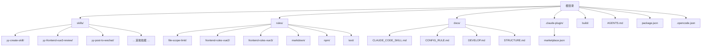
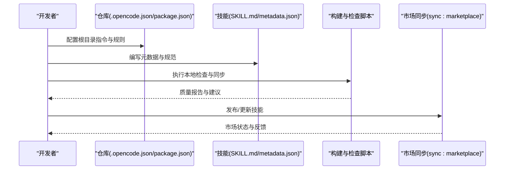
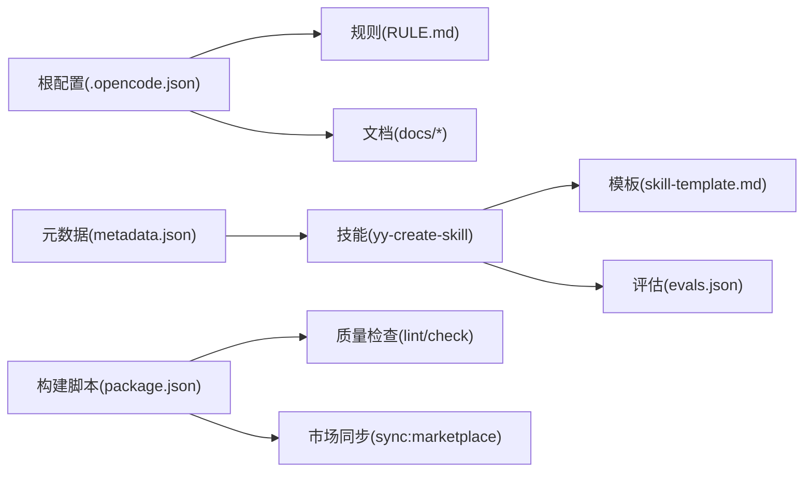
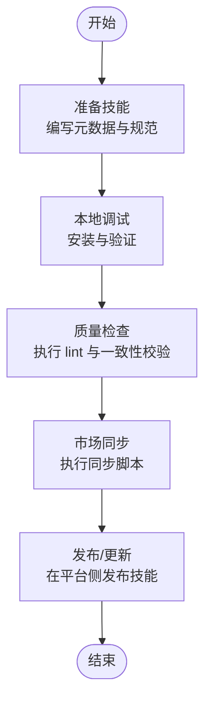

# OpenCode 平台集成

<cite>
**本文引用的文件**
- [.opencode.json](file://.opencode.json)
- [package.json](file://package.json)
- [docs/CLAUDE_CODE_SKILL.md](file://docs/CLAUDE_CODE_SKILL.md)
- [docs/CONFIG_RULE.md](file://docs/CONFIG_RULE.md)
- [docs/DEVELOP.md](file://docs/DEVELOP.md)
- [docs/STRUCTURE.md](file://docs/STRUCTURE.md)
- [AGENTS.md](file://AGENTS.md)
- [skills/yy-create-skill/SKILL.md](file://skills/yy-create-skill/SKILL.md)
- [skills/yy-create-skill/templates/skill-template.md](file://skills/yy-create-skill/templates/skill-template.md)
- [skills/yy-frontend-vue3-review/metadata.json](file://skills/yy-frontend-vue3-review/metadata.json)
- [skills/yy-frontend-vue3-review/evals.json](file://skills/yy-frontend-vue3-review/evals.json)
- [skills/yy-post-to-wechat/scripts/package.json](file://skills/yy-post-to-wechat/scripts/package.json)
- [skills/yy-post-to-wechat/scripts/tsconfig.json](file://skills/yy-post-to-wechat/scripts/tsconfig.json)
</cite>

## 目录
1. [简介](#简介)
2. [项目结构](#项目结构)
3. [核心组件](#核心组件)
4. [架构总览](#架构总览)
5. [详细组件分析](#详细组件分析)
6. [依赖关系分析](#依赖关系分析)
7. [性能考虑](#性能考虑)
8. [故障排除指南](#故障排除指南)
9. [结论](#结论)
10. [附录](#附录)

## 简介
本文件面向希望在 OpenCode 平台上集成与发布技能的开发者，系统阐述技能元数据与展示格式、平台配置与部署要点、技能审核与质量标准、以及从准备到发布的完整集成示例。文档严格基于仓库中的配置与规范文件，确保可操作性与一致性。

## 项目结构
仓库采用“技能 + 规则 + 构建工具 + 文档”的分层组织方式，便于在 OpenCode 平台中统一管理与发布。

图表来源
- [docs/STRUCTURE.md:1-10](file://docs/STRUCTURE.md#L1-L10)
- [package.json:1-46](file://package.json#L1-L46)
- [.opencode.json:1-14](file://.opencode.json#L1-L14)

章节来源
- [docs/STRUCTURE.md:1-10](file://docs/STRUCTURE.md#L1-L10)
- [package.json:1-46](file://package.json#L1-L46)
- [.opencode.json:1-14](file://.opencode.json#L1-L14)

## 核心组件
- 技能元数据与展示规范：通过技能目录内的元数据文件与 SKILL.md 规范，定义技能的名称、版本、摘要、分类、标签、兼容性与特性列表等，确保在平台侧正确展示与检索。
- OpenCode 配置：通过根目录配置文件声明指令与规则路径，控制 AI 的行为边界与项目记忆。
- 构建与同步：通过脚本与规则检查保障技能与文档质量，自动化同步市场信息。
- 开发与调试：提供本地安装与调试流程，避免污染 Git 仓库。

章节来源
- [skills/yy-frontend-vue3-review/metadata.json:1-42](file://skills/yy-frontend-vue3-review/metadata.json#L1-L42)
- [skills/yy-create-skill/SKILL.md:1-213](file://skills/yy-create-skill/SKILL.md#L1-L213)
- [.opencode.json:1-14](file://.opencode.json#L1-L14)
- [AGENTS.md:1-155](file://AGENTS.md#L1-L155)
- [docs/DEVELOP.md:1-18](file://docs/DEVELOP.md#L1-L18)

## 架构总览
OpenCode 平台集成的关键流程包括：技能准备（元数据与规范）、本地调试、规则与质量检查、市场同步与发布。

图表来源
- [.opencode.json:1-14](file://.opencode.json#L1-L14)
- [package.json:7-16](file://package.json#L7-L16)
- [AGENTS.md:11-17](file://AGENTS.md#L11-L17)

## 详细组件分析

### 技能元数据与展示格式
- 元数据文件：技能目录下的元数据文件用于描述技能的基本信息、版本、作者、摘要、分类、标签、兼容性与特性列表等，确保平台侧正确展示与检索。
- 展示与检索：分类与标签直接影响技能在平台市场的可见性与搜索结果；摘要与特性列表用于快速了解技能能力边界。
- 示例：前端 Vue3 审核技能的元数据文件包含名称、版本、日期、作者、摘要、分类、标签、兼容性与特性列表等字段。

章节来源
- [skills/yy-frontend-vue3-review/metadata.json:1-42](file://skills/yy-frontend-vue3-review/metadata.json#L1-L42)

### 技能规范与目录结构
- 规范来源：技能规范与目录结构由技能主文件与模板共同定义，确保技能具备清晰的描述、使用场景、指令步骤与相关资源。
- 目录结构：技能支持主文件、脚本目录、示例目录、模板目录与资源目录等，便于扩展与复用。
- 示例：技能创建指南提供了完整的模板与结构规范，涵盖 YAML frontmatter 字段约束、描述编写约束、决策点显式化原则等。

章节来源
- [skills/yy-create-skill/SKILL.md:1-213](file://skills/yy-create-skill/SKILL.md#L1-L213)
- [skills/yy-create-skill/templates/skill-template.md:1-37](file://skills/yy-create-skill/templates/skill-template.md#L1-L37)

### OpenCode 配置与规则
- 根配置：根目录配置文件声明指令与规则路径，控制 AI 的行为边界与项目记忆。
- 规则配置：OpenCode 与 Claude Code 的规则配置方式不同，需按各自文档进行配置。
- 示例：根配置文件展示了如何声明指令与规则路径，以便 AI 在执行时遵循项目规范。

章节来源
- [.opencode.json:1-14](file://.opencode.json#L1-L14)
- [docs/CONFIG_RULE.md:1-34](file://docs/CONFIG_RULE.md#L1-L34)

### 构建与质量检查
- 质量门禁：项目定义了质量门禁，要求在改动后执行检查与技能一致性校验。
- 检查项：包括文档与代码的检查、技能一致性检查、思维方法同步等。
- 示例：质量门禁要求执行脚本与技能检查，确保发布前的质量与一致性。

章节来源
- [AGENTS.md:11-17](file://AGENTS.md#L11-L17)
- [AGENTS.md:19-24](file://AGENTS.md#L19-L24)

### 市场同步与发布
- 同步脚本：通过脚本实现市场信息的同步，确保技能在平台侧的可见性与准确性。
- 发布流程：结合本地调试与质量检查，完成技能的发布与更新。

章节来源
- [package.json:7-16](file://package.json#L7-L16)

### 本地开发与调试
- 调试入口：提供本地安装与调试流程，便于在 OpenCode 平台上验证技能行为。
- 忽略文件：本地调试会生成特定文件，已在忽略列表中配置，避免提交到版本库。

章节来源
- [docs/DEVELOP.md:1-18](file://docs/DEVELOP.md#L1-L18)

### 技能审核与质量标准
- 审核维度：技能可包含评估文件，定义审核维度、断言与期望输出，确保功能验证与质量标准。
- 示例：前端 Vue3 审核技能的评估文件定义了多个维度的断言与文件范围，覆盖严重程度分级与输出格式规范。

章节来源
- [skills/yy-frontend-vue3-review/evals.json:1-429](file://skills/yy-frontend-vue3-review/evals.json#L1-L429)

### 平台特定配置与部署
- 环境与依赖：脚本工程的依赖与引擎版本在脚本包配置中声明，确保在平台侧正确运行。
- 配置示例：脚本工程的包配置与 TypeScript 配置展示了运行时要求与编译选项。

章节来源
- [skills/yy-post-to-wechat/scripts/package.json:1-29](file://skills/yy-post-to-wechat/scripts/package.json#L1-L29)
- [skills/yy-post-to-wechat/scripts/tsconfig.json:1-21](file://skills/yy-post-to-wechat/scripts/tsconfig.json#L1-L21)

## 依赖关系分析
OpenCode 平台集成涉及的依赖关系包括：根配置对规则与指令的引用、技能规范对模板与资源的依赖、构建脚本对质量检查与市场同步的依赖。

图表来源
- [.opencode.json:1-14](file://.opencode.json#L1-L14)
- [package.json:7-16](file://package.json#L7-L16)
- [skills/yy-create-skill/templates/skill-template.md:1-37](file://skills/yy-create-skill/templates/skill-template.md#L1-L37)
- [skills/yy-frontend-vue3-review/evals.json:1-429](file://skills/yy-frontend-vue3-review/evals.json#L1-L429)
- [skills/yy-frontend-vue3-review/metadata.json:1-42](file://skills/yy-frontend-vue3-review/metadata.json#L1-L42)

章节来源
- [.opencode.json:1-14](file://.opencode.json#L1-L14)
- [package.json:7-16](file://package.json#L7-L16)

## 性能考虑
- 自动发现与精确触发：技能应具备明确的触发条件与边界，避免误触发与上下文膨胀。
- 决策显式化：将隐含分支转化为明确规则，减少推理成本与歧义。
- 脚本与模板分离：将长模板移至独立目录，降低主文件体积与加载开销。
- 严格边界保护：如仅审核特定目录的文件，减少不必要的扫描与处理。

章节来源
- [skills/yy-create-skill/SKILL.md:104-120](file://skills/yy-create-skill/SKILL.md#L104-L120)
- [skills/yy-create-skill/SKILL.md:84-89](file://skills/yy-create-skill/SKILL.md#L84-L89)
- [skills/yy-frontend-vue3-review/metadata.json:21-26](file://skills/yy-frontend-vue3-review/metadata.json#L21-L26)

## 故障排除指南
- 网络连接问题
  - 症状：无法访问平台或同步失败。
  - 排查：确认网络连通性与代理设置；检查平台服务状态。
- API 调用错误
  - 症状：同步脚本或质量检查失败。
  - 排查：查看脚本输出日志，确认依赖与引擎版本满足要求；重新执行质量门禁检查。
- 权限不足
  - 症状：无法写入本地调试生成的文件或访问受限目录。
  - 排查：确认用户权限与忽略文件配置；避免提交本地生成文件到版本库。
- 触发误判
  - 症状：技能频繁误触发或不触发。
  - 排查：优化技能描述与使用场景，确保精确触发与明确边界；参考技能模板与规范。

章节来源
- [docs/DEVELOP.md:14-18](file://docs/DEVELOP.md#L14-L18)
- [AGENTS.md:11-17](file://AGENTS.md#L11-L17)
- [skills/yy-create-skill/SKILL.md:148-177](file://skills/yy-create-skill/SKILL.md#L148-L177)

## 结论
通过遵循本仓库提供的技能规范、元数据格式与质量门禁，结合 OpenCode 平台的配置与同步机制，开发者可以高效地准备、调试与发布高质量技能。建议在每次改动后执行质量检查与一致性校验，确保技能在平台侧的稳定性与可维护性。

## 附录

### OpenCode 平台集成流程图

图表来源
- [docs/DEVELOP.md:8-12](file://docs/DEVELOP.md#L8-L12)
- [AGENTS.md:11-17](file://AGENTS.md#L11-L17)
- [package.json:7-16](file://package.json#L7-L16)