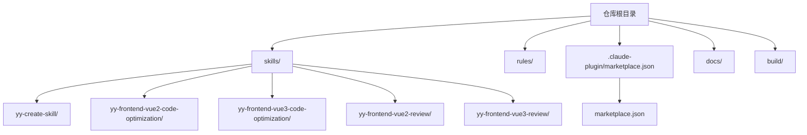
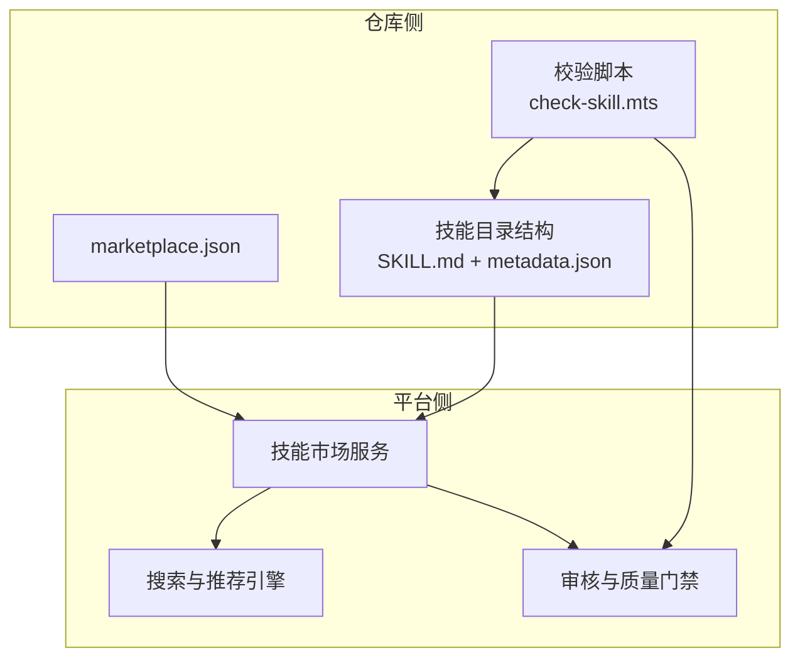
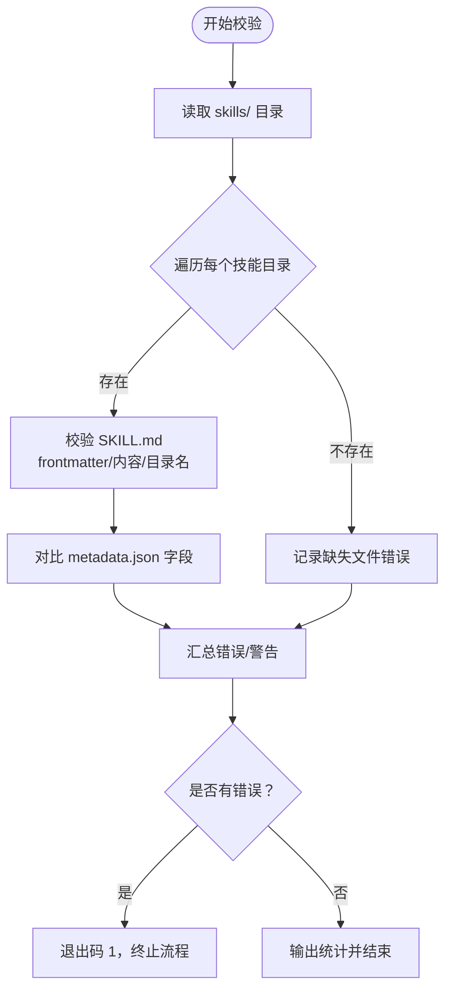
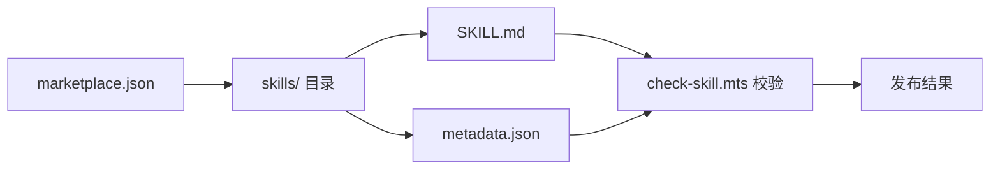

# Trae 平台集成

<cite>
**本文档引用的文件**
- [marketplace.json](file://.claude-plugin/marketplace.json)
- [package.json](file://package.json)
- [STRUCTURE.md](file://docs/STRUCTURE.md)
- [DEVELOP.md](file://docs/DEVELOP.md)
- [CONFIG_RULE.md](file://docs/CONFIG_RULE.md)
- [SKILL.md](file://skills/yy-create-skill/SKILL.md)
- [metadata.json（Vue2 代码优化）](file://skills/yy-frontend-vue2-code-optimization/metadata.json)
- [metadata.json（Vue3 代码优化）](file://skills/yy-frontend-vue3-code-optimization/metadata.json)
- [metadata.json（Vue2 代码审核）](file://skills/yy-frontend-vue2-review/metadata.json)
- [metadata.json（Vue3 代码审核）](file://skills/yy-frontend-vue3-review/metadata.json)
- [check-skill.mts](file://build/check-skill.mts)
</cite>

## 目录
1. [简介](#简介)
2. [项目结构](#项目结构)
3. [核心组件](#核心组件)
4. [架构总览](#架构总览)
5. [详细组件分析](#详细组件分析)
6. [依赖关系分析](#依赖关系分析)
7. [性能考量](#性能考量)
8. [故障排查指南](#故障排查指南)
9. [结论](#结论)
10. [附录](#附录)

## 简介
本文件面向希望在 Trae 平台上发布与运营“技能”的开发者，系统性阐述 Trae 平台的技能市场组织方式、技能元数据模型、分类与标签体系、市场配置与发布流程、质量校验机制以及最佳实践。文档基于仓库中的 marketplace.json、技能元数据文件与构建校验脚本，总结出 Trae 平台的集成要点与工作流，帮助开发者高效完成技能打包、元数据准备与批量发布。

## 项目结构
仓库采用“技能 + 规则 + 市场配置”的分层组织方式：
- skills/：公共技能集合，每个技能以独立目录呈现，包含 SKILL.md 与可选的 metadata.json、scripts/、examples/、templates/、resources/ 等。
- rules/：自定义规则集，支持不同平台（Claude Code、OpenCode 等）的规则导入与引用。
- .claude-plugin/marketplace.json：技能市场的聚合配置，定义插件分组与技能清单。
- docs/：开发与配置指南文档，包括项目结构、开发调试、规则配置等。
- build/：构建与校验脚本，例如技能元数据一致性检查工具。

图表来源
- [.claude-plugin/marketplace.json:1-65](file://.claude-plugin/marketplace.json#L1-L65)
- [STRUCTURE.md:1-10](file://docs/STRUCTURE.md#L1-L10)

章节来源
- [STRUCTURE.md:1-10](file://docs/STRUCTURE.md#L1-L10)
- [.claude-plugin/marketplace.json:1-65](file://.claude-plugin/marketplace.json#L1-L65)

## 核心组件
- 市场配置（marketplace.json）
  - 定义市场名称、拥有者、版本与描述。
  - 通过 plugins 数组分组声明技能集合，每组包含 name、description、source、strict 与 skills 列表。
  - Trae 平台通过该配置识别并拉取技能清单，实现批量上架与分组展示。
- 技能元数据（metadata.json）
  - 包含 name、version、date、author、abstract、category、tags、compatibility、features 等字段。
  - 用于平台侧的分类检索、标签过滤、兼容性校验与功能特性展示。
- 技能主文档（SKILL.md）
  - 采用 YAML frontmatter 定义 name 与 description，作为触发与展示的关键字段。
  - 与 metadata.json 的 abstract、author、version 存在一致性校验关系。
- 构建与校验（check-skill.mts）
  - 自动扫描 skills/ 下的每个技能目录，校验 SKILL.md 的 frontmatter、内容完整性与与 metadata.json 的一致性。
  - 输出错误与警告，确保发布前的质量门槛。

章节来源
- [.claude-plugin/marketplace.json:1-65](file://.claude-plugin/marketplace.json#L1-L65)
- [metadata.json（Vue2 代码优化）:1-40](file://skills/yy-frontend-vue2-code-optimization/metadata.json#L1-L40)
- [metadata.json（Vue3 代码优化）:1-47](file://skills/yy-frontend-vue3-code-optimization/metadata.json#L1-L47)
- [metadata.json（Vue2 代码审核）:1-34](file://skills/yy-frontend-vue2-review/metadata.json#L1-L34)
- [metadata.json（Vue3 代码审核）:1-42](file://skills/yy-frontend-vue3-review/metadata.json#L1-L42)
- [check-skill.mts:1-230](file://build/check-skill.mts#L1-L230)

## 架构总览
Trae 平台的技能市场集成由“配置驱动 + 元数据驱动 + 质量校验”三部分构成：
- 配置驱动：marketplace.json 作为入口，声明技能分组与清单，供平台批量抓取。
- 元数据驱动：每个技能的 metadata.json 与 SKILL.md 提供分类、标签、兼容性与功能特性，支撑搜索与推荐。
- 质量校验：check-skill.mts 在本地与 CI 环境中统一校验，减少平台侧审核压力。

图表来源
- [.claude-plugin/marketplace.json:1-65](file://.claude-plugin/marketplace.json#L1-L65)
- [check-skill.mts:1-230](file://build/check-skill.mts#L1-L230)

## 详细组件分析

### 市场配置（marketplace.json）
- 作用
  - 声明市场元信息（名称、拥有者、版本、描述）。
  - 通过 plugins 数组分组列出技能路径，platform 侧据此批量拉取与上架。
- 关键字段
  - name、owner、metadata、plugins[]
    - plugins[].name、description、source、strict、skills[]
- 集成要点
  - 保持 plugins[].skills[] 与实际 skills/ 目录一致，避免路径错误导致上架失败。
  - strict 字段用于控制严格模式（如触发与加载策略），需结合平台文档确认其影响。

章节来源
- [.claude-plugin/marketplace.json:1-65](file://.claude-plugin/marketplace.json#L1-L65)

### 技能元数据（metadata.json）
- 字段说明
  - name、version、date、author、abstract、category、tags[]、compatibility、features[]
- 分类与标签
  - category：如 "frontend"，用于平台侧一级分类。
  - tags：如 ["vue2","code-review","code-quality","security","best-practices"] 等，用于二级标签与搜索索引。
- 兼容性
  - compatibility.vue_version、compatibility.file_types、compatibility.required_directory 等，用于平台侧自动识别适用项目类型与边界。
- 功能特性
  - features[] 用于展示技能的核心能力，便于用户理解与筛选。

章节来源
- [metadata.json（Vue2 代码优化）:1-40](file://skills/yy-frontend-vue2-code-optimization/metadata.json#L1-L40)
- [metadata.json（Vue3 代码优化）:1-47](file://skills/yy-frontend-vue3-code-optimization/metadata.json#L1-L47)
- [metadata.json（Vue2 代码审核）:1-34](file://skills/yy-frontend-vue2-review/metadata.json#L1-L34)
- [metadata.json（Vue3 代码审核）:1-42](file://skills/yy-frontend-vue3-review/metadata.json#L1-L42)

### 技能主文档（SKILL.md）
- YAML frontmatter
  - name、description 为必填，且 name 需与目录名一致。
  - description 用于触发判断，应简洁明确，避免堆叠实现细节。
- 目录结构
  - 支持 scripts/、examples/、templates/、resources/ 等可选目录，按需创建。
- 与 metadata.json 的一致性
  - check-skill.mts 会比对 SKILL.md 的 description 与 metadata.json 的 abstract、metadata.author 与 author、metadata.version 与 version 的一致性。

章节来源
- [SKILL.md:1-213](file://skills/yy-create-skill/SKILL.md#L1-L213)
- [check-skill.mts:100-172](file://build/check-skill.mts#L100-L172)

### 构建与校验（check-skill.mts）
- 校验内容
  - SKILL.md 存在性与非空检查。
  - frontmatter 格式与字段完整性（name、description）。
  - name 与目录名一致性。
  - 与 metadata.json 的字段一致性（abstract、author、version）。
- 错误与警告
  - 发现错误时终止流程（退出码 1），发现警告时提示更新建议。
- 使用场景
  - 本地开发阶段与 CI 流水线中运行，保障上架前质量。

图表来源
- [check-skill.mts:177-226](file://build/check-skill.mts#L177-L226)

章节来源
- [check-skill.mts:1-230](file://build/check-skill.mts#L1-L230)

## 依赖关系分析
- marketplace.json 与技能目录
  - plugins[].skills[] 路径需指向实际存在的技能目录，否则平台无法拉取。
- SKILL.md 与 metadata.json
  - frontmatter 的 name 与目录名一致，description 与 metadata.json.abstract 建议保持一致。
  - metadata.json 的 author/version 与 SKILL.md 的 metadata.author/version 建议保持一致。
- 构建脚本与市场配置
  - check-skill.mts 与 marketplace.json 的一致性决定最终上架质量与成功率。

图表来源
- [.claude-plugin/marketplace.json:1-65](file://.claude-plugin/marketplace.json#L1-L65)
- [check-skill.mts:177-226](file://build/check-skill.mts#L177-L226)

章节来源
- [.claude-plugin/marketplace.json:1-65](file://.claude-plugin/marketplace.json#L1-L65)
- [check-skill.mts:177-226](file://build/check-skill.mts#L177-L226)

## 性能考量
- 上架效率
  - 保持 metadata.json 字段精简与准确，有助于平台侧快速索引与展示。
- 搜索体验
  - 合理使用 tags 与 features，提升搜索命中率与相关性。
- 校验成本
  - 在本地与 CI 中提前运行校验脚本，减少平台侧重复校验与失败重试。

## 故障排查指南
- marketplace.json 路径错误
  - 症状：平台无法拉取技能或报路径不存在。
  - 处理：核对 plugins[].skills[] 路径与实际目录一致。
- SKILL.md 缺失或格式错误
  - 症状：校验失败，退出码 1。
  - 处理：确保 SKILL.md 存在、frontmatter 正确、name 与目录名一致。
- 元数据不一致
  - 症状：出现警告，提示 abstract/author/version 不一致。
  - 处理：根据警告建议更新 metadata.json 对应字段。
- CI 失败
  - 症状：流水线中断。
  - 处理：在本地复现 check-skill.mts 输出，修复后重试。

章节来源
- [check-skill.mts:177-226](file://build/check-skill.mts#L177-L226)
- [DEVELOP.md:1-18](file://docs/DEVELOP.md#L1-L18)

## 结论
通过 marketplace.json 的分组配置、metadata.json 的元数据模型与 SKILL.md 的 frontmatter 规范，结合 check-skill.mts 的质量校验，开发者可以稳定地将技能批量上架到 Trae 平台。遵循本文档的集成策略与最佳实践，能够显著提升技能的搜索可见性、审核通过率与市场表现。

## 附录

### 集成工作流程（概览）
- 准备技能
  - 在 skills/ 下创建技能目录，编写 SKILL.md 与 metadata.json。
  - 按需创建 scripts/、examples/、templates/、resources/。
- 配置市场
  - 在 marketplace.json 的 plugins[].skills[] 中加入新技能路径。
- 校验与发布
  - 本地运行校验脚本，修复错误与警告。
  - 提交变更，平台侧根据 marketplace.json 批量拉取并上架。
- 运营与优化
  - 基于用户反馈与平台指标，持续优化 tags、features 与 description。

章节来源
- [package.json:7-16](file://package.json#L7-L16)
- [DEVELOP.md:1-18](file://docs/DEVELOP.md#L1-L18)

### 平台特定配置示例与最佳实践
- marketplace.json 示例要点
  - plugins[].name 与 description 清晰描述技能分组用途。
  - skills[] 路径使用相对路径，确保与仓库根目录一致。
- 元数据最佳实践
  - category 与 tags 与技能实际能力匹配，避免过度泛化。
  - compatibility 明确支持的文件类型与目录边界，减少误用。
- 开发与调试
  - 使用本地安装命令调试技能，避免提交临时文件。
  - 在 CI 中集成校验脚本，保证每次变更均通过质量门禁。

章节来源
- [.claude-plugin/marketplace.json:1-65](file://.claude-plugin/marketplace.json#L1-L65)
- [metadata.json（Vue2 代码优化）:1-40](file://skills/yy-frontend-vue2-code-optimization/metadata.json#L1-L40)
- [metadata.json（Vue3 代码优化）:1-47](file://skills/yy-frontend-vue3-code-optimization/metadata.json#L1-L47)
- [DEVELOP.md:1-18](file://docs/DEVELOP.md#L1-L18)
- [CONFIG_RULE.md:1-34](file://docs/CONFIG_RULE.md#L1-L34)