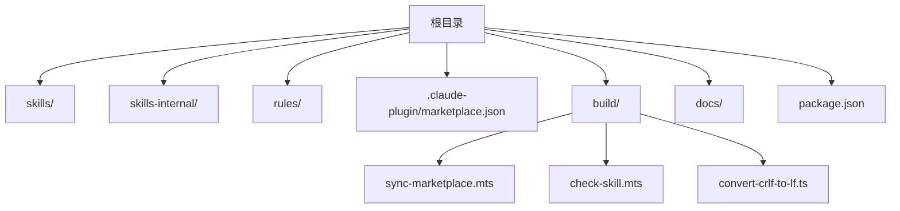
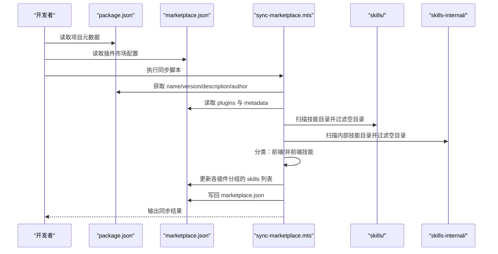
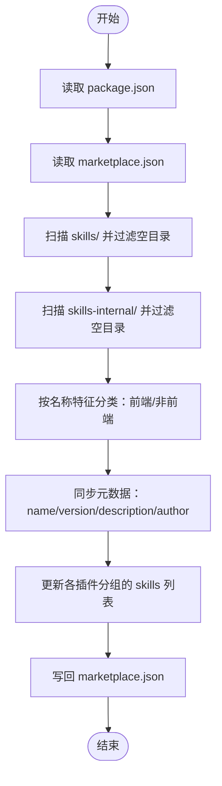
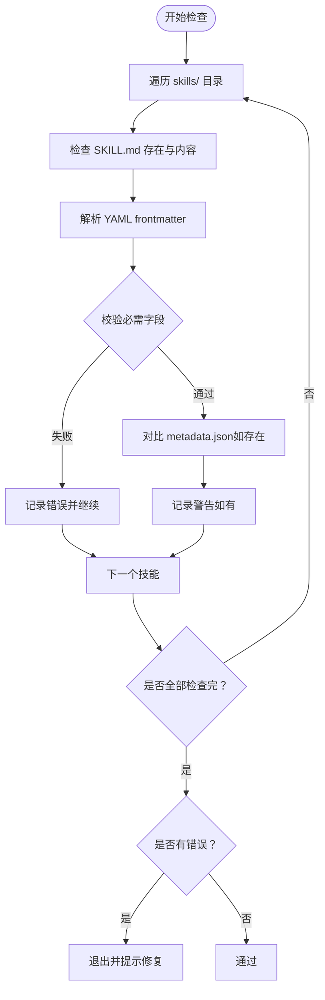
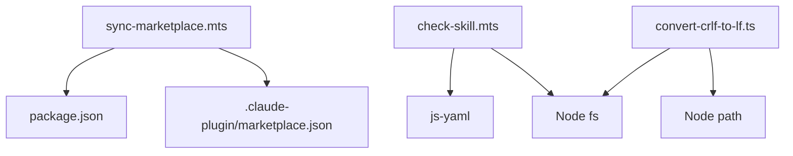

# 多平台同步机制

<cite>
**本文引用的文件**
- [package.json](file://package.json)
- [sync-marketplace.mts](file://build/sync-marketplace.mts)
- [check-skill.mts](file://build/check-skill.mts)
- [convert-crlf-to-lf.ts](file://build/convert-crlf-to-lf.ts)
- [marketplace.json](file://.claude-plugin/marketplace.json)
- [README.md](file://README.md)
- [DEVELOP.md](file://docs/DEVELOP.md)
- [STRUCTURE.md](file://docs/STRUCTURE.md)
</cite>

## 目录
1. [简介](#简介)
2. [项目结构](#项目结构)
3. [核心组件](#核心组件)
4. [架构总览](#架构总览)
5. [详细组件分析](#详细组件分析)
6. [依赖分析](#依赖分析)
7. [性能考虑](#性能考虑)
8. [故障排查指南](#故障排查指南)
9. [结论](#结论)
10. [附录](#附录)

## 简介
本文件面向多平台同步机制的技术文档，围绕 sync-marketplace.mts 构建脚本展开，系统阐述技能发现、元数据提取、格式转换与批量上传的完整流程；并结合 marketplace.json 的结构与 package.json 的脚本配置，说明多平台同步的数据流转过程、平台适配处理、错误处理与重试机制、同步配置与策略、质量检查机制以及性能优化与监控建议。

## 项目结构
仓库采用“技能 + 规则 + 插件市场配置”的组织方式：
- skills/：公共技能集合，按功能划分子目录
- skills-internal/：内部技能集合，用于仓库维护与管理
- rules/：规则模板与参考文档
- .claude-plugin/marketplace.json：插件市场配置，定义插件分组与技能清单
- build/：构建与同步脚本，包含同步脚本、质量检查脚本与编码规范转换脚本
- docs/：开发与使用文档
- package.json：脚本入口与依赖声明

**图表来源**
- [STRUCTURE.md:1-10](file://docs/STRUCTURE.md#L1-L10)
- [package.json:1-46](file://package.json#L1-L46)

**章节来源**
- [STRUCTURE.md:1-10](file://docs/STRUCTURE.md#L1-L10)
- [README.md:1-104](file://README.md#L1-L104)

## 核心组件
- 同步脚本 sync-marketplace.mts：负责读取 package.json 与 marketplace.json，扫描技能目录，按类型分组并写回插件市场配置
- 质量检查脚本 check-skill.mts：校验 SKILL.md 与 metadata.json 的一致性与完整性
- 编码规范转换脚本 convert-crlf-to-lf.ts：统一换行符，保障跨平台一致性
- marketplace.json：插件市场配置文件，定义插件分组与技能路径
- package.json：脚本入口，定义同步与检查命令

**章节来源**
- [sync-marketplace.mts:1-93](file://build/sync-marketplace.mts#L1-L93)
- [check-skill.mts:1-230](file://build/check-skill.mts#L1-L230)
- [convert-crlf-to-lf.ts:1-119](file://build/convert-crlf-to-lf.ts#L1-L119)
- [marketplace.json:1-65](file://.claude-plugin/marketplace.json#L1-L65)
- [package.json:1-46](file://package.json#L1-L46)

## 架构总览
多平台同步的总体流程如下：
- 读取 package.json，获取项目元数据（名称、版本、描述、作者）
- 读取 marketplace.json，获取现有插件分组与技能清单
- 扫描 skills/ 与 skills-internal/ 目录，过滤空目录并排序
- 按名称特征区分前端与非前端技能，分别填充至对应插件分组
- 写回 marketplace.json，完成一次完整的同步

**图表来源**
- [sync-marketplace.mts:12-93](file://build/sync-marketplace.mts#L12-L93)
- [marketplace.json:10-63](file://.claude-plugin/marketplace.json#L10-L63)
- [package.json:7-16](file://package.json#L7-L16)

## 详细组件分析

### 同步脚本 sync-marketplace.mts
职责与流程：
- 读取 package.json 与 marketplace.json
- 同步项目元数据（名称、版本、描述、作者）
- 扫描 skills/ 与 skills-internal/ 目录，过滤空目录并排序
- 按名称特征区分前端与非前端技能，填充至 open-skills 与 frontend-skills 插件分组
- 写回 marketplace.json

关键实现点：
- 使用文件系统 API 递归读取目录，过滤空目录并删除
- 使用字符串包含判断进行技能分类
- 严格按字母序排序，保证输出稳定
- 写回时保留缩进与换行，便于版本控制对比

**图表来源**
- [sync-marketplace.mts:12-93](file://build/sync-marketplace.mts#L12-L93)

**章节来源**
- [sync-marketplace.mts:12-93](file://build/sync-marketplace.mts#L12-L93)

### 质量检查脚本 check-skill.mts
职责与流程：
- 遍历 skills/ 下每个技能目录，检查 SKILL.md 是否存在且格式正确
- 解析 YAML frontmatter，校验必需字段（name、description），并与目录名一致性
- 若存在 metadata.json，则对比 abstract、author、version 字段的一致性
- 输出错误与警告，并在出现错误时退出进程

关键实现点：
- 使用正则表达式提取 YAML frontmatter
- 使用 js-yaml 解析并校验结构
- 多行描述转单行进行对比，避免空白差异导致误报
- 对比失败给出建议，便于快速修复

**图表来源**
- [check-skill.mts:50-172](file://build/check-skill.mts#L50-L172)

**章节来源**
- [check-skill.mts:10-230](file://build/check-skill.mts#L10-L230)

### 编码规范转换脚本 convert-crlf-to-lf.ts
职责与流程：
- 递归扫描项目根目录，识别文本文件类型
- 检测 CRLF（\r\n）并替换为 LF（\n）
- 支持 --check 模式仅报告可转换文件，不实际修改

关键实现点：
- 使用白名单扩展名与基础文件名，覆盖常见文本文件
- 忽略二进制与大型文件，减少不必要的处理
- 支持忽略目录集合，避免误伤版本控制与构建产物

**章节来源**
- [convert-crlf-to-lf.ts:1-119](file://build/convert-crlf-to-lf.ts#L1-L119)

### 插件市场配置 marketplace.json
结构要点：
- name、owner、metadata：项目级元数据
- plugins：插件分组数组，每项包含 name、description、source、strict、skills
- skills：技能相对路径列表，按 source 根路径解析

同步策略：
- open-skills：非前端技能集合
- frontend-skills：前端技能集合
- internal-skills：内部技能集合

**章节来源**
- [marketplace.json:1-65](file://.claude-plugin/marketplace.json#L1-L65)

### 脚本入口与调用链
- package.json 中定义了 lint 与 sync:marketplace 脚本，通过 Node 运行构建脚本
- 开发者可通过本地调试命令安装技能并验证效果

**章节来源**
- [package.json:7-16](file://package.json#L7-L16)
- [DEVELOP.md:1-18](file://docs/DEVELOP.md#L1-L18)

## 依赖分析
- 同步脚本依赖：
  - Node 文件系统 API：读写文件与目录
  - 路径模块：拼接与解析路径
  - package.json：提供项目元数据
  - marketplace.json：提供插件市场配置
- 质量检查脚本依赖：
  - js-yaml：解析 YAML frontmatter
  - Node 文件系统 API：读取文件内容
- 编码规范转换脚本依赖：
  - Node 异步文件系统 API：递归扫描与写入
  - 路径模块：规范化路径

**图表来源**
- [sync-marketplace.mts:1-10](file://build/sync-marketplace.mts#L1-L10)
- [check-skill.mts:1-5](file://build/check-skill.mts#L1-L5)
- [convert-crlf-to-lf.ts:1-3](file://build/convert-crlf-to-lf.ts#L1-L3)
- [package.json:41-44](file://package.json#L41-L44)

**章节来源**
- [package.json:41-44](file://package.json#L41-L44)

## 性能考虑
- 目录扫描与排序：对技能目录进行一次性读取与排序，复杂度 O(n log n)，n 为技能数量
- 空目录过滤：在读取阶段即删除空目录，减少后续处理开销
- 字符串分类：按名称特征进行简单过滤，时间复杂度 O(n)
- 写回策略：一次性写回，避免频繁 I/O
- 质量检查：逐个技能检查，建议在 CI 中并行化（当前脚本未内置并行）
- 编码转换：仅处理文本文件，忽略大型或二进制文件，减少处理时间

优化建议：
- 在 CI 中启用并行质量检查，拆分技能检查任务
- 对大规模技能集，考虑分批写回 marketplace.json，降低单次写入压力
- 对重复运行的场景，增加“变更检测”以跳过未变更的技能

[本节为通用性能讨论，无需具体文件分析]

## 故障排查指南
常见问题与解决方法：
- 同步后 marketplace.json 未更新
  - 检查 package.json 中的脚本是否正确执行
  - 确认脚本具有文件写权限
- 报错“缺少必需字段: name/description”
  - 检查 SKILL.md 的 YAML frontmatter 是否完整
  - 确保 name 与目录名一致
- metadata.json 与 SKILL.md 不一致
  - 根据警告建议更新 metadata.json 的 abstract/author/version
- CRLF 换行导致差异
  - 使用 convert-crlf-to-lf.ts --check 检查可转换文件
  - 执行脚本以统一换行符

**章节来源**
- [check-skill.mts:94-172](file://build/check-skill.mts#L94-L172)
- [convert-crlf-to-lf.ts:96-101](file://build/convert-crlf-to-lf.ts#L96-L101)

## 结论
本多平台同步机制通过 sync-marketplace.mts 实现了从项目元数据到技能清单的自动化同步，配合 check-skill.mts 的质量检查与 convert-crlf-to-lf.ts 的编码规范统一，形成了从“发现—校验—转换—同步”的闭环。通过合理的目录扫描、分类与写回策略，确保了插件市场的准确性与一致性。建议在持续集成中引入并行化与变更检测，进一步提升同步效率与稳定性。

[本节为总结性内容，无需具体文件分析]

## 附录

### 同步配置说明
- 平台参数设置
  - 插件分组：open-skills、frontend-skills、internal-skills
  - 同步范围：skills/、skills-internal/ 目录
  - 分类规则：按技能名称特征区分前端与非前端
- 同步频率控制
  - 建议在 CI 中触发，或在本地开发完成后手动执行
- 增量更新策略
  - 当前脚本为全量同步，建议在 CI 中结合变更检测实现增量更新

**章节来源**
- [sync-marketplace.mts:49-83](file://build/sync-marketplace.mts#L49-L83)
- [marketplace.json:10-63](file://.claude-plugin/marketplace.json#L10-L63)

### 错误处理与重试机制
- 文件读取与解析错误：脚本在读取与解析失败时会记录错误并终止
- 网络异常与 API 限流：当前脚本为本地文件操作，不涉及网络请求
- 数据冲突：通过质量检查与元数据对比提前发现，避免写回冲突

**章节来源**
- [check-skill.mts:117-171](file://build/check-skill.mts#L117-L171)
- [sync-marketplace.mts:38-42](file://build/sync-marketplace.mts#L38-L42)

### 技能质量检查机制
- 格式验证：检查 SKILL.md 存在性、frontmatter 格式与必需字段
- 内容审核：对比 metadata.json 与 SKILL.md 的关键字段
- 兼容性测试：统一换行符，减少跨平台差异

**章节来源**
- [check-skill.mts:50-172](file://build/check-skill.mts#L50-L172)
- [convert-crlf-to-lf.ts:49-104](file://build/convert-crlf-to-lf.ts#L49-L104)

### 监控指标与建议
- 指标建议：同步耗时、技能数量、空目录清理数量、质量检查错误数、警告数
- 建议：在 CI 日志中记录以上指标，便于趋势分析与回归定位

[本节为通用建议，无需具体文件分析]