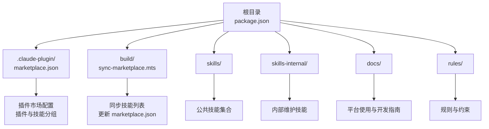
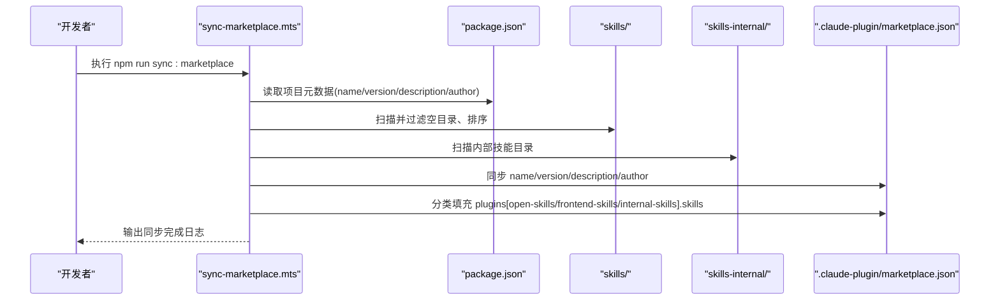
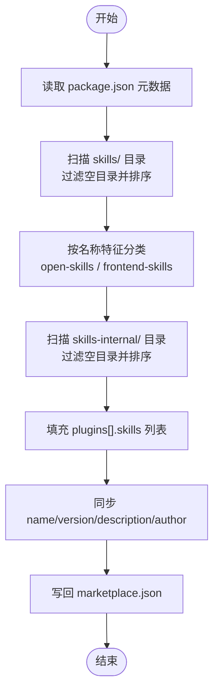
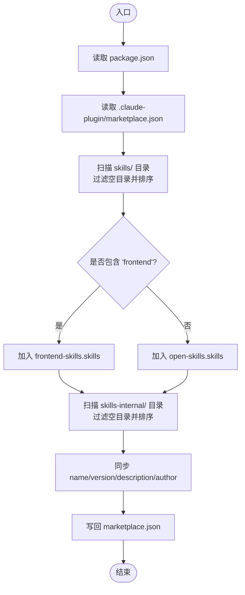
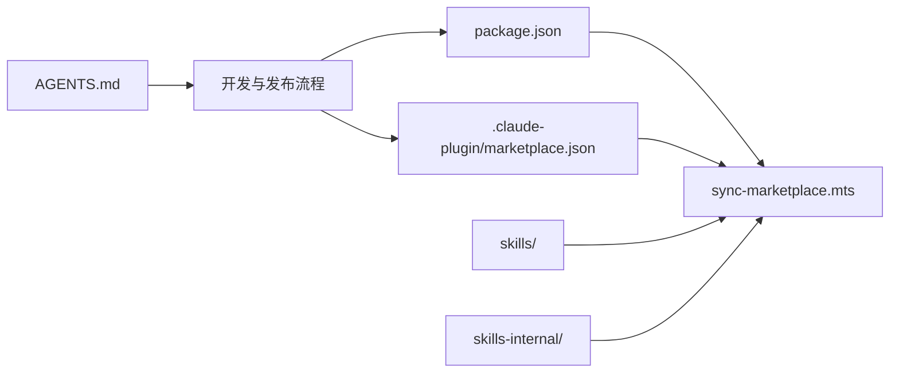

# 平台集成

<cite>
**本文引用的文件**
- [package.json](file://package.json)
- [sync-marketplace.mts](file://build/sync-marketplace.mts)
- [.claude-plugin/marketplace.json](file://.claude-plugin/marketplace.json)
- [AGENTS.md](file://AGENTS.md)
- [docs/STRUCTURE.md](file://docs/STRUCTURE.md)
- [docs/CLAUDE_CODE_SKILL.md](file://docs/CLAUDE_CODE_SKILL.md)
- [docs/DEVELOP.md](file://docs/DEVELOP.md)
- [skills/yy-create-skill/SKILL.md](file://skills/yy-create-skill/SKILL.md)
- [skills/yy-create-skill/templates/skill-template.md](file://skills/yy-create-skill/templates/skill-template.md)
- [.opencode.json](file://.opencode.json)
</cite>

## 目录
1. [简介](#简介)
2. [项目结构](#项目结构)
3. [核心组件](#核心组件)
4. [架构总览](#架构总览)
5. [详细组件分析](#详细组件分析)
6. [依赖关系分析](#依赖关系分析)
7. [性能考量](#性能考量)
8. [故障排除指南](#故障排除指南)
9. [结论](#结论)
10. [附录](#附录)

## 简介
本文件面向平台集成工程师与开发者，系统阐述本仓库在多平台技能市场上的支持能力与集成方法，重点覆盖：
- Claude 插件市场的集成与配置要点
- OpenCode、Trae 等平台的集成策略与特殊要求
- sync-marketplace.mts 构建脚本的工作原理（技能发现、元数据同步、格式转换与批量上传）
- 各平台的 API 使用方法、认证机制、请求/响应处理
- 技能格式要求、大小限制与审核标准差异
- 平台特定配置参数与部署要求
- 故障排除与重试机制
- 平台扩展与自定义集成方法

## 项目结构
本仓库采用“技能即产品”的组织方式，核心目录与职责如下：
- skills/：公共技能集合，按领域划分（如前端、通用等）
- skills-internal/：内部维护技能，用于仓库自检与方法同步
- .claude-plugin/：Claude 插件市场配置目录，包含 marketplace.json
- build/：构建与同步脚本，如 sync-marketplace.mts
- docs/：平台使用与开发指南
- rules/：规则与约束集合
- 根目录 package.json：项目脚本与依赖入口

图表来源
- [package.json:1-46](file://package.json#L1-L46)
- [.claude-plugin/marketplace.json:1-65](file://.claude-plugin/marketplace.json#L1-L65)
- [sync-marketplace.mts:1-93](file://build/sync-marketplace.mts#L1-L93)
- [docs/STRUCTURE.md:1-10](file://docs/STRUCTURE.md#L1-L10)

章节来源
- [docs/STRUCTURE.md:1-10](file://docs/STRUCTURE.md#L1-L10)
- [package.json:1-46](file://package.json#L1-L46)

## 核心组件
- 构建与同步脚本：负责扫描技能目录、分类与汇总、同步 package.json 元数据到 marketplace.json，并写回配置文件
- 插件市场配置：定义插件名称、描述、源路径与技能分组（通用、前端、内部）
- 开发与发布指南：提供本地调试、安装与使用方法
- 技能模板与规范：统一技能格式、命名与验收标准

章节来源
- [sync-marketplace.mts:1-93](file://build/sync-marketplace.mts#L1-L93)
- [.claude-plugin/marketplace.json:1-65](file://.claude-plugin/marketplace.json#L1-L65)
- [docs/CLAUDE_CODE_SKILL.md:1-10](file://docs/CLAUDE_CODE_SKILL.md#L1-L10)
- [docs/DEVELOP.md:1-18](file://docs/DEVELOP.md#L1-L18)
- [skills/yy-create-skill/SKILL.md:1-213](file://skills/yy-create-skill/SKILL.md#L1-L213)

## 架构总览
平台集成围绕“配置驱动 + 自动同步 + 统一模板”的架构展开：
- 配置驱动：.claude-plugin/marketplace.json 定义插件与技能分组
- 自动同步：sync-marketplace.mts 读取 package.json 与 skills 目录，更新 marketplace.json
- 统一模板：技能采用 SKILL.md 规范，确保跨平台一致性

图表来源
- [sync-marketplace.mts:12-93](file://build/sync-marketplace.mts#L12-L93)
- [.claude-plugin/marketplace.json:10-63](file://.claude-plugin/marketplace.json#L10-L63)
- [package.json:7-16](file://package.json#L7-L16)

## 详细组件分析

### Claude 插件市场集成
- 配置文件：.claude-plugin/marketplace.json 定义三个插件市场：
  - open-skills：通用技能集合
  - frontend-skills：前端相关技能集合
  - internal-skills：内部维护技能集合
- 安装与使用：通过 Claude Code 插件市场添加仓库并安装插件市场，再选择技能启用
- 自动同步：sync-marketplace.mts 会将 package.json 的 name、version、description、author 同步到 marketplace.json 对应字段，并按目录名排序填充各插件的 skills 列表

图表来源
- [sync-marketplace.mts:31-83](file://build/sync-marketplace.mts#L31-L83)
- [.claude-plugin/marketplace.json:10-63](file://.claude-plugin/marketplace.json#L10-L63)
- [package.json:12-14](file://package.json#L12-L14)

章节来源
- [.claude-plugin/marketplace.json:10-63](file://.claude-plugin/marketplace.json#L10-L63)
- [docs/CLAUDE_CODE_SKILL.md:1-10](file://docs/CLAUDE_CODE_SKILL.md#L1-L10)
- [sync-marketplace.mts:18-30](file://build/sync-marketplace.mts#L18-L30)

### OpenCode 平台集成策略
- 配置文件：.opencode.json 定义平台指令与规则索引，用于指导 AI 思考方式与规则应用
- 集成要点：
  - 通过 skills 目录中的技能进行本地测试与调用
  - 使用 package.json 中的脚本进行本地安装与调试
- 特殊要求：
  - 本地测试后方可提交，避免直接使用 git（由 .opencode.json 指令约束）
  - 严格遵循技能模板与验收清单，确保可复用性与一致性

章节来源
- [.opencode.json:1-14](file://.opencode.json#L1-L14)
- [docs/DEVELOP.md:8-18](file://docs/DEVELOP.md#L8-L18)
- [skills/yy-create-skill/SKILL.md:148-177](file://skills/yy-create-skill/SKILL.md#L148-L177)

### Trae 平台集成策略
- 集成思路：
  - 通过 skills/ 与 skills-internal/ 目录结构，结合 marketplace.json 的插件分组，形成可被 Trae 平台识别的技能清单
  - 使用统一的 SKILL.md 模板与命名规范，降低平台适配成本
- 特殊要求：
  - 保持技能目录结构与文件命名规范，避免路径与权限问题
  - 通过本地调试与一致性检查，确保技能在 Trae 环境中的可用性

章节来源
- [skills/yy-create-skill/SKILL.md:197-213](file://skills/yy-create-skill/SKILL.md#L197-L213)
- [docs/DEVELOP.md:8-18](file://docs/DEVELOP.md#L8-L18)

### sync-marketplace.mts 构建脚本详解
- 读取与同步元数据：
  - 读取 package.json 的 name、version、description、author，并同步到 marketplace.json 对应字段
- 技能发现与分类：
  - 扫描 skills/ 目录，过滤空目录并按字母序排序
  - 将包含“frontend”的技能归入 frontend-skills，其余归入 open-skills
  - 扫描 skills-internal/ 目录，过滤空目录并排序，填充 internal-skills
- 写回配置：
  - 将更新后的 marketplace.json 写回原文件，输出同步完成日志

图表来源
- [sync-marketplace.mts:12-93](file://build/sync-marketplace.mts#L12-L93)

章节来源
- [sync-marketplace.mts:12-93](file://build/sync-marketplace.mts#L12-L93)

### 技能格式与验收标准
- 统一模板：技能采用 SKILL.md 基础模板，包含 YAML frontmatter、描述、使用场景、指令、相关资源等章节
- 命名规范：目录使用 kebab-case，文件命名遵循规范
- 验收清单：涵盖描述准确性、触发条件明确性、指令完整性、YAML 格式正确性、决策点显式化、文件一致性与安全边界等
- 辅助目录：根据需要创建 examples/、templates/、resources/、scripts/，并遵循模板与脚本规范

章节来源
- [skills/yy-create-skill/SKILL.md:1-213](file://skills/yy-create-skill/SKILL.md#L1-L213)
- [skills/yy-create-skill/templates/skill-template.md:1-37](file://skills/yy-create-skill/templates/skill-template.md#L1-L37)

### 平台 API 使用方法与认证
- Claude Code 安装流程：通过插件市场添加仓库、选择插件市场、安装技能并重启终端
- OpenCode/Trae：通过本地调试与技能目录结构进行集成，遵循平台的安装与调用规范
- 注意：本仓库未提供平台 API 的直接调用封装，集成主要通过 marketplace.json 与技能目录结构实现

章节来源
- [docs/CLAUDE_CODE_SKILL.md:1-10](file://docs/CLAUDE_CODE_SKILL.md#L1-L10)
- [docs/DEVELOP.md:8-18](file://docs/DEVELOP.md#L8-L18)

## 依赖关系分析
- 构建脚本依赖：
  - package.json：提供 name、version、description、author 等元数据
  - marketplace.json：提供插件与技能分组配置
  - skills/ 与 skills-internal/：提供技能清单
- 开发与发布依赖：
  - AGENTS.md：定义项目规范与质量门禁
  - docs/：提供开发与使用指南

图表来源
- [package.json:7-16](file://package.json#L7-L16)
- [sync-marketplace.mts:8-16](file://build/sync-marketplace.mts#L8-L16)
- [.claude-plugin/marketplace.json:10-63](file://.claude-plugin/marketplace.json#L10-L63)

章节来源
- [package.json:7-16](file://package.json#L7-L16)
- [AGENTS.md:11-24](file://AGENTS.md#L11-L24)

## 性能考量
- 目录扫描与排序：对大量技能目录进行过滤与排序，建议控制技能数量规模或分批管理
- 文件读写：一次性写回 marketplace.json，避免频繁 I/O
- 本地调试：优先在本地验证技能可用性，减少平台侧反复测试

## 故障排除指南
- marketplace.json 未更新：
  - 确认执行 npm run sync:marketplace
  - 检查 package.json 元数据是否完整
- 技能未出现在插件市场：
  - 确认技能目录非空且命名规范
  - 检查 frontend 分类逻辑（是否包含“frontend”关键词）
- 本地调试失败：
  - 使用 docs/DEVELOP.md 中的命令进行本地安装与调试
  - 确保忽略文件未被提交（如 .agents/skills/ 与 skills-lock.json）

章节来源
- [package.json:14-15](file://package.json#L14-L15)
- [docs/DEVELOP.md:14-18](file://docs/DEVELOP.md#L14-L18)

## 结论
本仓库通过“配置驱动 + 自动同步 + 统一模板”的方式，实现了对 Claude、OpenCode、Trae 等平台的高效集成。sync-marketplace.mts 负责自动化同步与分组，.claude-plugin/marketplace.json 提供插件市场配置，技能模板与规范确保跨平台一致性。开发者可基于现有流程快速扩展新的平台或自定义集成。

## 附录
- 平台特定配置参数与部署要求：
  - .claude-plugin/marketplace.json：插件名称、描述、源路径与技能分组
  - .opencode.json：平台指令与规则索引
  - package.json：脚本与项目元数据
- 平台扩展与自定义集成方法：
  - 新增插件市场：在 marketplace.json 中新增 plugins 条目，并在 sync-marketplace.mts 中扩展分类逻辑
  - 新增平台：在 docs/ 中补充平台使用指南，并在 AGENTS.md 中完善质量门禁与交付规范

章节来源
- [.claude-plugin/marketplace.json:10-63](file://.claude-plugin/marketplace.json#L10-L63)
- [.opencode.json:1-14](file://.opencode.json#L1-L14)
- [package.json:7-16](file://package.json#L7-L16)
- [AGENTS.md:11-24](file://AGENTS.md#L11-L24)