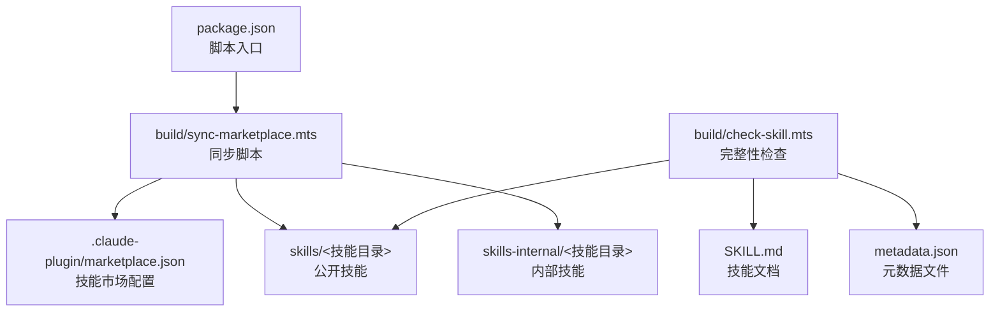
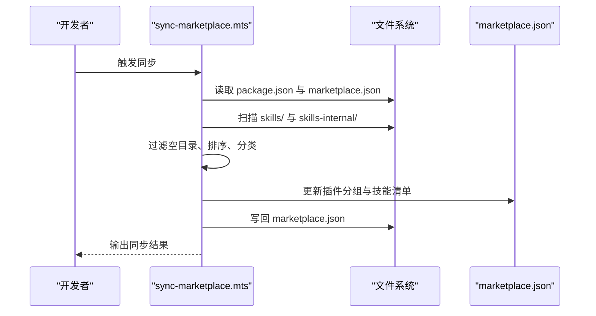
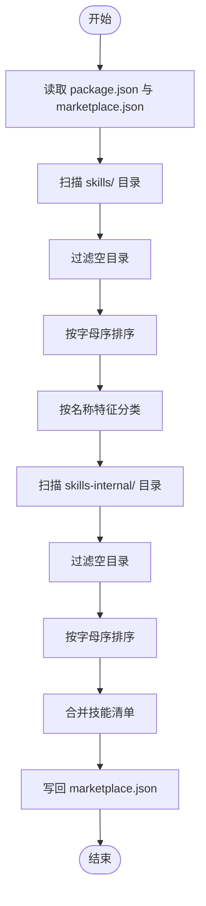
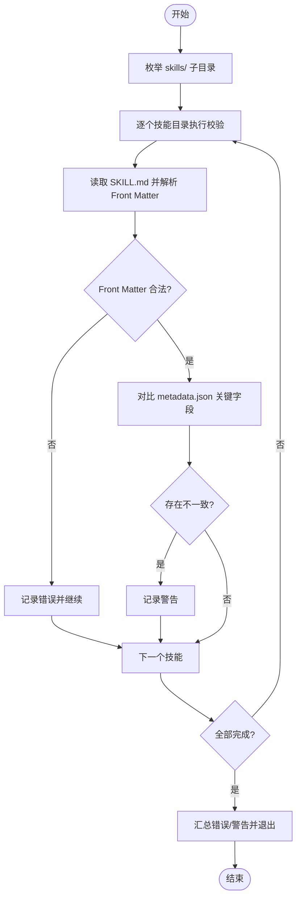
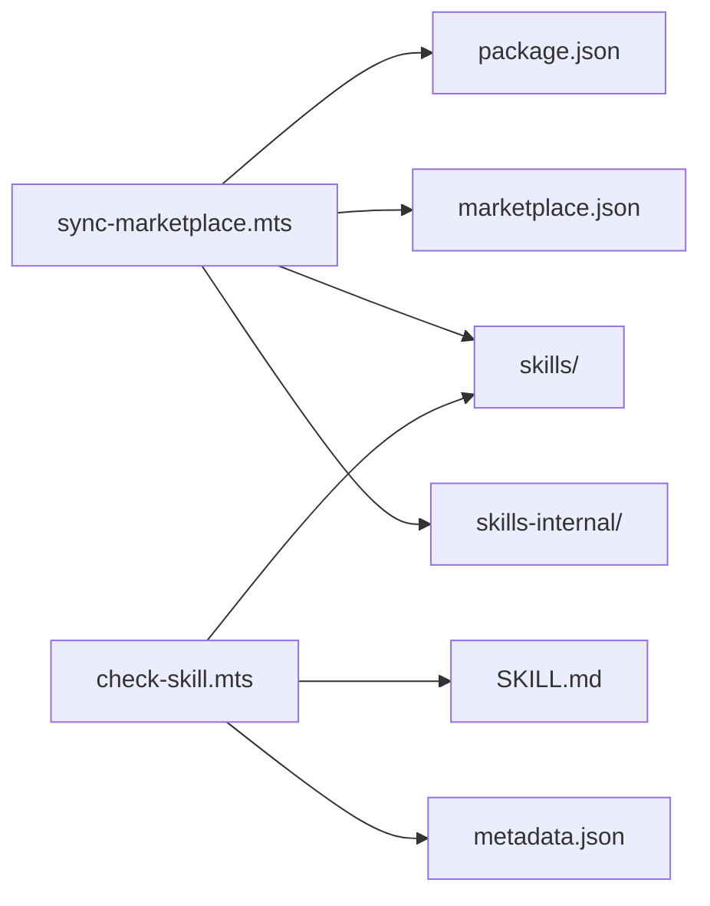

# 自动同步机制

<cite>
**本文引用的文件**   
- [package.json](file://package.json)
- [sync-marketplace.mts](file://build/sync-marketplace.mts)
- [check-skill.mts](file://build/check-skill.mts)
- [marketplace.json](file://.claude-plugin/marketplace.json)
- [yy-create-readme/SKILL.md](file://skills/yy-create-readme/SKILL.md)
- [yy-create-rule/SKILL.md](file://skills/yy-create-rule/SKILL.md)
- [yy-frontend-vue2-review/metadata.json](file://skills/yy-frontend-vue2-review/metadata.json)
- [yy-frontend-vue3-review/metadata.json](file://skills/yy-frontend-vue3-review/metadata.json)
- [DEVELOP.md](file://docs/DEVELOP.md)
- [STRUCTURE.md](file://docs/STRUCTURE.md)
- [yy-create-skill/SKILL.md](file://skills/yy-create-skill/SKILL.md)
</cite>

## 目录
1. [引言](#引言)
2. [项目结构](#项目结构)
3. [核心组件](#核心组件)
4. [架构总览](#架构总览)
5. [详细组件分析](#详细组件分析)
6. [依赖分析](#依赖分析)
7. [性能考虑](#性能考虑)
8. [故障排查指南](#故障排查指南)
9. [结论](#结论)
10. [附录](#附录)

## 引言
本文件系统性阐述“自动同步机制”的技术实现与运维实践，重点覆盖以下方面：
- 技能目录扫描与变更检测策略
- 元数据提取与一致性校验流程
- 批量更新与冲突解决策略
- sync-marketplace.mts 的核心算法与执行路径
- 技能完整性检查机制（SKILL.md 格式、依赖与元数据）
- 同步配置选项（频率、并发、重试）
- 日志与监控机制
- 性能优化建议（批量、缓存、资源管理）
- 自动化部署与 CI/CD 集成方案
- 运维监控指标与告警配置

## 项目结构
该项目围绕“技能市场”与“技能目录”两大核心对象构建同步体系：
- 技能市场配置：.claude-plugin/marketplace.json
- 技能目录：skills/ 与 skills-internal/
- 同步脚本：build/sync-marketplace.mts
- 完整性检查：build/check-skill.mts
- 开发与结构说明：docs/DEVELOP.md、docs/STRUCTURE.md

图表来源
- [package.json:1-46](file://package.json#L1-L46)
- [sync-marketplace.mts:1-93](file://build/sync-marketplace.mts#L1-L93)
- [marketplace.json:1-65](file://.claude-plugin/marketplace.json#L1-L65)
- [check-skill.mts:1-230](file://build/check-skill.mts#L1-L230)

章节来源
- [STRUCTURE.md:1-10](file://docs/STRUCTURE.md#L1-L10)
- [DEVELOP.md:1-18](file://docs/DEVELOP.md#L1-L18)

## 核心组件
- 同步脚本：负责扫描技能目录、分类与聚合、更新 marketplace.json
- 完整性检查：负责 SKILL.md 格式与 metadata.json 一致性校验
- 市场配置：定义插件分组与技能清单
- 技能目录：公开与内部两类技能集合

章节来源
- [sync-marketplace.mts:1-93](file://build/sync-marketplace.mts#L1-L93)
- [check-skill.mts:1-230](file://build/check-skill.mts#L1-L230)
- [marketplace.json:1-65](file://.claude-plugin/marketplace.json#L1-L65)

## 架构总览
自动同步机制由“扫描—聚合—写回—校验—发布”五步构成，形成闭环：

图表来源
- [sync-marketplace.mts:1-93](file://build/sync-marketplace.mts#L1-L93)
- [marketplace.json:1-65](file://.claude-plugin/marketplace.json#L1-L65)

## 详细组件分析

### 同步脚本：sync-marketplace.mts
职责与流程：
- 读取项目与市场配置
- 扫描公开与内部技能目录，过滤空目录并排序
- 按名称特征将技能归类到不同插件分组
- 写回市场配置文件

关键算法要点：
- 目录扫描与过滤：遍历目录，剔除空目录，保证清单干净
- 分类策略：通过名称关键字区分前端与非前端技能
- 写回策略：原子写入，避免中间态污染

图表来源
- [sync-marketplace.mts:1-93](file://build/sync-marketplace.mts#L1-L93)

章节来源
- [sync-marketplace.mts:1-93](file://build/sync-marketplace.mts#L1-L93)

### 完整性检查：check-skill.mts
职责与流程：
- 遍历 skills/ 下的每个技能目录
- 校验 SKILL.md 的 YAML Front Matter 格式与必填字段
- 对比 metadata.json 与 SKILL.md 的关键字段一致性
- 输出错误与警告，并在错误时终止流程

校验规则要点：
- SKILL.md 必须以 YAML Front Matter 开头，且 name 与目录名一致
- metadata.json 的 abstract、author、version 与 SKILL.md 对应字段一致性
- 多行 description 统一为单行进行对比

图表来源
- [check-skill.mts:1-230](file://build/check-skill.mts#L1-L230)

章节来源
- [check-skill.mts:1-230](file://build/check-skill.mts#L1-L230)

### 市场配置：marketplace.json
- 定义插件分组（公开技能、前端技能、内部技能）
- 每个分组维护技能清单（相对路径）
- 同步脚本负责维护该清单，确保与实际目录一致

章节来源
- [marketplace.json:1-65](file://.claude-plugin/marketplace.json#L1-L65)

### 技能文档与元数据示例
- SKILL.md 示例：展示技能描述、使用场景、指令与验收清单
- metadata.json 示例：版本、作者、摘要、标签、兼容性与特性等

章节来源
- [yy-create-readme/SKILL.md:1-120](file://skills/yy-create-readme/SKILL.md#L1-L120)
- [yy-create-rule/SKILL.md:1-133](file://skills/yy-create-rule/SKILL.md#L1-L133)
- [yy-frontend-vue2-review/metadata.json:1-34](file://skills/yy-frontend-vue2-review/metadata.json#L1-L34)
- [yy-frontend-vue3-review/metadata.json:1-42](file://skills/yy-frontend-vue3-review/metadata.json#L1-L42)

### 技能编写规范与验收清单
- 技能编写规范与验收清单：用于统一技能质量与一致性
- 与完整性检查配合，确保 SKILL.md 与 metadata.json 的一致性

章节来源
- [yy-create-skill/SKILL.md:1-213](file://skills/yy-create-skill/SKILL.md#L1-L213)

## 依赖分析
- 同步脚本依赖文件系统与路径模块，读取 package.json 与 marketplace.json，写回配置
- 完整性检查依赖 js-yaml 解析 Front Matter，依赖文件系统读取 SKILL.md 与 metadata.json
- marketplace.json 作为同步目标，被同步脚本与 CI/CD 流程共同依赖

图表来源
- [sync-marketplace.mts:1-93](file://build/sync-marketplace.mts#L1-L93)
- [check-skill.mts:1-230](file://build/check-skill.mts#L1-L230)
- [marketplace.json:1-65](file://.claude-plugin/marketplace.json#L1-L65)
- [package.json:1-46](file://package.json#L1-L46)

章节来源
- [package.json:1-46](file://package.json#L1-L46)
- [sync-marketplace.mts:1-93](file://build/sync-marketplace.mts#L1-L93)
- [check-skill.mts:1-230](file://build/check-skill.mts#L1-L230)

## 性能考虑
- 批量处理
  - 同步阶段：一次性读取目录、排序与分类，减少多次 IO
  - 完整性检查：串行遍历，避免并发带来的锁竞争与状态不一致
- 缓存策略
  - 当前实现未内置缓存；可在 CI 场景下利用缓存层（如 npm/yarn 缓存、Git LFS）提升整体效率
- 资源管理
  - 过滤空目录，避免无效条目进入清单
  - 写回采用原子写，降低竞态风险
- 并发与重试
  - 当前未实现并发与重试；建议在 CI 中通过作业队列与失败重试策略保障稳定性

## 故障排查指南
常见问题与定位思路：
- marketplace.json 未更新
  - 检查同步脚本是否成功读取 package.json 与 marketplace.json
  - 确认技能目录存在且非空
- SKILL.md 格式错误
  - 确保 Front Matter 以 "---" 开始与结束
  - 确保 name 与目录名一致
- metadata.json 不一致
  - 对比 abstract、author、version 与 SKILL.md 对应字段
  - 使用单行化 description 进行一致性比对

章节来源
- [sync-marketplace.mts:1-93](file://build/sync-marketplace.mts#L1-L93)
- [check-skill.mts:1-230](file://build/check-skill.mts#L1-L230)

## 结论
该自动同步机制通过“扫描—聚合—写回—校验—发布”的闭环流程，确保技能市场配置与实际技能目录保持一致。同步脚本与完整性检查分别承担“清单维护”与“质量把关”的职责，二者协同保障了技能生态的健康与稳定。

## 附录

### 同步配置选项
- 同步频率
  - 本地开发：手动触发
  - CI/CD：在 PR 合并或定时任务中触发
- 并发控制
  - 当前未实现；建议在 CI 中串行执行，避免竞态
- 错误重试
  - 当前未实现；建议在 CI 中启用失败重试与超时控制

章节来源
- [package.json:1-46](file://package.json#L1-L46)

### 日志与监控
- 同步脚本输出同步结果
- 完整性检查输出错误与警告
- 建议在 CI 中记录并归档日志，便于问题追踪

章节来源
- [sync-marketplace.mts:1-93](file://build/sync-marketplace.mts#L1-L93)
- [check-skill.mts:1-230](file://build/check-skill.mts#L1-L230)

### 自动化部署与 CI/CD 集成
- 触发时机
  - 代码变更推送后自动触发
  - 支持 PR 预检与主干合并后发布
- 步骤建议
  - 安装依赖 → 运行完整性检查 → 执行同步 → 写回 marketplace.json → 发布产物

章节来源
- [DEVELOP.md:1-18](file://docs/DEVELOP.md#L1-L18)
- [STRUCTURE.md:1-10](file://docs/STRUCTURE.md#L1-L10)

### 运维监控指标与告警
- 指标建议
  - 同步成功率、失败次数、耗时分布
  - 完整性检查错误率、警告率
- 告警策略
  - 失败重试阈值、超时告警、异常日志告警