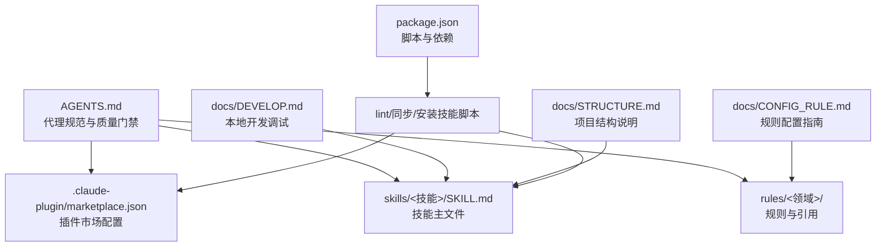
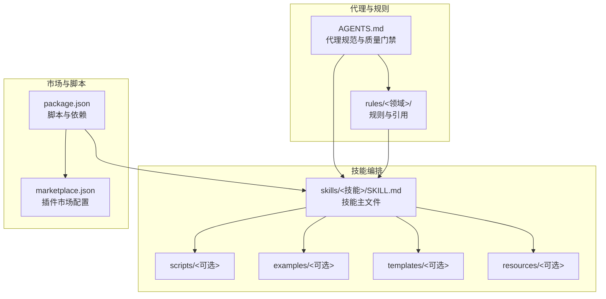
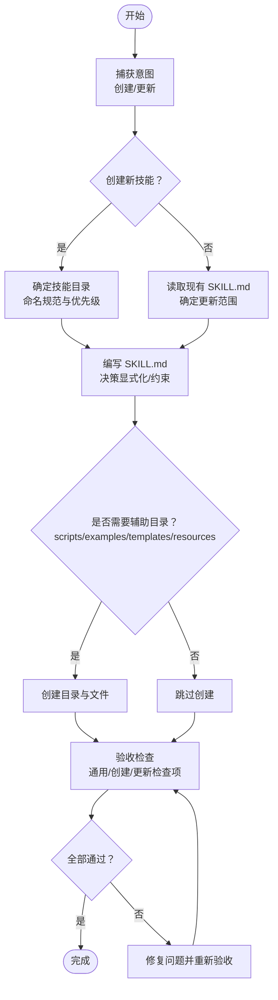
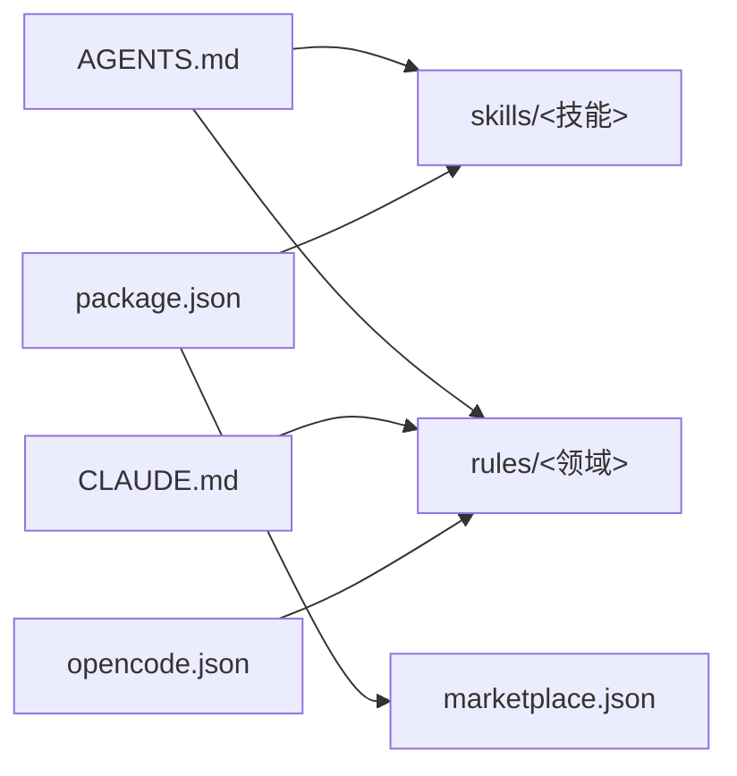

# AI 代理规范

<cite>
**本文引用的文件**
- [AGENTS.md](file://AGENTS.md)
- [CLAUDE.md](file://CLAUDE.md)
- [package.json](file://package.json)
- [docs/DEVELOP.md](file://docs/DEVELOP.md)
- [docs/STRUCTURE.md](file://docs/STRUCTURE.md)
- [docs/CONFIG_RULE.md](file://docs/CONFIG_RULE.md)
- [skills/yy-create-skill/SKILL.md](file://skills/yy-create-skill/SKILL.md)
- [skills/yy-review/SKILL.md](file://skills/yy-review/SKILL.md)
- [skills/yy-lint/SKILL.md](file://skills/yy-lint/SKILL.md)
- [skills/yy-create-rule/SKILL.md](file://skills/yy-create-rule/SKILL.md)
- [rules/frontend-rules-vue2/RULE.md](file://rules/frontend-rules-vue2/RULE.md)
- [skills/yy-frontend-vue2-review/references/security.md](file://skills/yy-frontend-vue2-review/references/security.md)
- [skills/yy-frontend-vue3-review/references/security.md](file://skills/yy-frontend-vue3-review/references/security.md)
- [skills/yy-init/templates/agents-minimal-template.md](file://skills/yy-init/templates/agents-minimal-template.md)
</cite>

## 目录
1. [简介](#简介)
2. [项目结构](#项目结构)
3. [核心组件](#核心组件)
4. [架构总览](#架构总览)
5. [详细组件分析](#详细组件分析)
6. [依赖分析](#依赖分析)
7. [性能考虑](#性能考虑)
8. [故障排查指南](#故障排查指南)
9. [结论](#结论)
10. [附录](#附录)

## 简介
本规范面向“AI 代理”的设计与实现，围绕技能系统（Skills）与代理规则（Rules）两大支柱，定义代理的行为约束、安全机制、生命周期管理、开发最佳实践、与技能系统的交互方式、测试与验证方法以及部署与运维指导。本仓库以“技能”为最小可复用单元，强调“精确触发、明确边界、指令清晰、决策显式化”，并通过 AGENTS.md 与多层 RULE.md 规则体系保障代理在不同工具链（Claude Code、OpenCode 等）中的一致行为。

## 项目结构
仓库采用“技能 + 规则 + 插件市场配置 + 文档”的分层组织方式，核心目录与职责如下：
- skills/：公共技能集合，每个技能为独立的 SKILL.md，可包含 scripts/、examples/、templates/、resources/ 等辅助目录
- rules/：自定义规则集，按领域拆分子模块，支持多层引用
- .claude-plugin/：插件市场配置目录，包含 marketplace.json
- docs/：开发与配置指南、结构说明、规则配置说明
- AGENTS.md：代理项目规范与质量门禁、交付格式、AI 思考方式等
- package.json：项目脚本与依赖，提供 lint、同步市场配置等能力

图表来源
- [docs/STRUCTURE.md:1-10](file://docs/STRUCTURE.md#L1-L10)
- [docs/DEVELOP.md:1-18](file://docs/DEVELOP.md#L1-L18)
- [docs/CONFIG_RULE.md:1-34](file://docs/CONFIG_RULE.md#L1-L34)
- [package.json:1-46](file://package.json#L1-L46)

章节来源
- [docs/STRUCTURE.md:1-10](file://docs/STRUCTURE.md#L1-L10)
- [docs/DEVELOP.md:1-18](file://docs/DEVELOP.md#L1-L18)
- [docs/CONFIG_RULE.md:1-34](file://docs/CONFIG_RULE.md#L1-L34)
- [package.json:1-46](file://package.json#L1-L46)

## 核心组件
- 代理规范与质量门禁（AGENTS.md）
  - 质量门禁：lint、技能一致性检查、思维同步检查
  - 交付格式：变更说明、文件引用带路径与行号、技能变更影响说明
  - AI 思考方式：行动前假设显式化、决策点显式化、克制与精简、验证与比对
  - 重要提示：npm 项目、每次修改后执行 lint、不要手动修改 marketplace.json、技能是主要产出物、中文交互、本地测试后再提交
- 规则系统（rules/）
  - 支持多层级引用，按“Essential/Strongly Recommended/Recommended”优先级组织
  - 示例：Vue2/Vue3 前端规则拆分子模块，覆盖组件开发、网络请求、安全、性能等
- 技能系统（skills/）
  - 技能为“可按需加载的任务说明书”，具备自动发现、精确触发、明确边界、指令清晰、决策显式化
  - 支持 scripts/（可执行脚本）、examples/（示例）、templates/（模板）、resources/（资源）
- 插件市场配置（.claude-plugin/marketplace.json）
  - 由构建脚本自动生成与同步，避免手工维护
- 开发与脚本（package.json、docs/）
  - 提供 lint、类型检查、换行符转换、市场配置同步、技能安装等脚本

章节来源
- [AGENTS.md:1-155](file://AGENTS.md#L1-L155)
- [rules/frontend-rules-vue2/RULE.md:1-62](file://rules/frontend-rules-vue2/RULE.md#L1-L62)
- [skills/yy-create-skill/SKILL.md:1-213](file://skills/yy-create-skill/SKILL.md#L1-L213)
- [package.json:1-46](file://package.json#L1-L46)
- [docs/CONFIG_RULE.md:1-34](file://docs/CONFIG_RULE.md#L1-L34)

## 架构总览
代理架构以“规则驱动 + 技能编排”为核心，通过 AGENTS.md 统一约束代理行为，rules/ 提供领域规范，skills/ 提供可复用任务编排，.claude-plugin/marketplace.json 提供市场分组与加载入口，package.json 提供自动化脚本与质量门禁。

图表来源
- [AGENTS.md:1-155](file://AGENTS.md#L1-L155)
- [rules/frontend-rules-vue2/RULE.md:1-62](file://rules/frontend-rules-vue2/RULE.md#L1-L62)
- [skills/yy-create-skill/SKILL.md:1-213](file://skills/yy-create-skill/SKILL.md#L1-L213)
- [package.json:1-46](file://package.json#L1-L46)

## 详细组件分析

### 组件一：代理规范与质量门禁（AGENTS.md）
- 质量门禁
  - 执行 lint 检测代码与文档
  - 执行技能一致性检查
  - 若涉及 AI 思考方式调整，执行思维同步检查
- 交付格式
  - 修改原因与影响范围说明
  - 文件引用带路径与行号
  - 技能变更对用户的影响说明
- AI 思考方式
  - 行动前思考：假设显式化、决策点显式化
  - 克制与精简：简单优先、精确修改、显式分级筛选
  - 验证与比对：目标驱动执行、交叉比对式矛盾定位、逆向逻辑验证
- 重要提示
  - npm 项目、每次修改后执行 lint、不要手动修改 marketplace.json、技能是主要产出物、中文交互、本地测试后再提交

章节来源
- [AGENTS.md:11-155](file://AGENTS.md#L11-L155)

### 组件二：规则系统（rules/）
- 规则组织
  - 多层级引用，按优先级组织（Essential/Strongly Recommended/Recommended）
  - 示例：Vue2/Vue3 前端规则拆分子模块，覆盖组件开发、网络请求、安全、性能等
- 配置方式
  - OpenCode：将规则文件存放于 .opencode/rules/，在项目根目录创建 opencode.json 指定 instructions
  - Claude Code：在 CLAUDE.md 中通过 @path/to/import 引入规则文件，支持最多 5 层递归引用

章节来源
- [rules/frontend-rules-vue2/RULE.md:1-62](file://rules/frontend-rules-vue2/RULE.md#L1-L62)
- [docs/CONFIG_RULE.md:1-34](file://docs/CONFIG_RULE.md#L1-L34)

### 组件三：技能系统（skills/）
- 技能特性
  - 自动发现、精确触发、明确边界、指令清晰、决策显式化
- 目录结构
  - 必需：SKILL.md
  - 可选：scripts/（主执行脚本、依赖配置）、examples/、templates/、resources/
- 创建与更新流程
  - 捕获意图、确定技能目录、编写 SKILL.md、创建目录结构、验收检查、输出结果
  - 更新策略：先读取再修改、默认补充+优化、同步检查辅助文件、description 独立评估
- 安全边界
  - 严禁主动执行编译、构建、部署、自动测试、修改代码等命令
  - Lint 技能对命令执行范围进行严格限制与修复边界约束

图表来源
- [skills/yy-create-skill/SKILL.md:34-177](file://skills/yy-create-skill/SKILL.md#L34-L177)

章节来源
- [skills/yy-create-skill/SKILL.md:1-213](file://skills/yy-create-skill/SKILL.md#L1-L213)
- [skills/yy-lint/SKILL.md:75-88](file://skills/yy-lint/SKILL.md#L75-L88)
- [skills/yy-review/SKILL.md:120-131](file://skills/yy-review/SKILL.md#L120-L131)

### 组件四：插件市场配置与同步（.claude-plugin/marketplace.json 与 package.json）
- marketplace.json
  - 由构建脚本自动生成与同步，避免手工维护
- package.json 脚本
  - lint、lint:skills、check:skill、lint:markdown、lint:lf、check:type、sync:marketplace、install:skill
  - 通过 sync:marketplace 与构建脚本联动，保证市场配置与技能清单一致

章节来源
- [AGENTS.md:125-128](file://AGENTS.md#L125-L128)
- [package.json:7-16](file://package.json#L7-L16)

### 组件五：本地开发与调试（docs/DEVELOP.md）
- 本地调试
  - 在根目录执行 npx skills add ./ 可加载 skills/ 目录下的技能
  - 本地调试生成的文件（如 skills-lock.json、.agents/skills/）不在 Git 中提交

章节来源
- [docs/DEVELOP.md:1-18](file://docs/DEVELOP.md#L1-L18)

### 组件六：代理初始化模板（skills/yy-init/templates/agents-minimal-template.md）
- 提供 AGENTS.md 的最小化模板，包含范围、质量门禁、交付格式、项目结构、AI 思考方式、路径格式规范、Rules 引用等
- 便于团队快速建立统一的代理规范与工作流

章节来源
- [skills/yy-init/templates/agents-minimal-template.md:1-114](file://skills/yy-init/templates/agents-minimal-template.md#L1-L114)

## 依赖分析
- 组件耦合与协作
  - AGENTS.md 为顶层规范，约束 skills/ 与 rules/ 的行为边界
  - skills/ 通过 SKILL.md 与 scripts/ 实现任务编排与可执行能力
  - rules/ 通过 RULE.md 与 references/* 提供领域约束与最佳实践
  - package.json 脚本驱动 lint、类型检查、换行符转换、市场同步与技能安装
- 外部依赖与集成点
  - 插件市场配置 marketplace.json 由构建脚本同步生成
  - Claude Code/OpenCode 通过 CLAUDE.md/.opencode/rules/ 引入规则，形成跨工具链的一致性

图表来源
- [AGENTS.md:1-155](file://AGENTS.md#L1-L155)
- [package.json:1-46](file://package.json#L1-L46)
- [docs/CONFIG_RULE.md:1-34](file://docs/CONFIG_RULE.md#L1-L34)
- [CLAUDE.md:1-2](file://CLAUDE.md#L1-L2)

章节来源
- [package.json:1-46](file://package.json#L1-L46)
- [docs/CONFIG_RULE.md:1-34](file://docs/CONFIG_RULE.md#L1-L34)
- [CLAUDE.md:1-2](file://CLAUDE.md#L1-L2)

## 性能考虑
- 代码体积与执行效率
  - 简单优先：用最少的代码解决问题，避免预测性开发
  - 精确修改：只改必须改的，减少上下文膨胀
- 技能执行与资源占用
  - Lint 技能对并行任务进行约束，避免在多任务并发时执行 lint，降低资源争用
  - 代码审核技能对文件改动进行过滤，仅检查代码文件，减少无关文件处理开销
- 质量门禁与缓存
  - 通过 lint、类型检查、换行符转换等脚本在本地快速发现问题，减少远端 CI 压力

章节来源
- [AGENTS.md:69-94](file://AGENTS.md#L69-L94)
- [skills/yy-lint/SKILL.md:64-68](file://skills/yy-lint/SKILL.md#L64-L68)
- [skills/yy-review/SKILL.md:28-43](file://skills/yy-review/SKILL.md#L28-L43)

## 故障排查指南
- 常见问题与处理
  - 未执行质量门禁：确保每次修改后执行 lint，并通过技能一致性检查
  - marketplace.json 手动修改：避免手工维护，使用 sync:marketplace 脚本同步
  - 规则未生效：确认规则文件路径与引用层级，Claude Code 支持最多 5 层递归引用
  - 技能误触发：检查 SKILL.md 的 description 与使用场景，避免实现细节混入
  - 安全边界违规：严禁执行编译、构建、部署、自动测试、修改代码等命令
- 本地调试与隔离
  - 使用 docs/DEVELOP.md 中的调试命令加载本地技能
  - 本地调试生成的文件在 .gitignore 中配置忽略，避免提交

章节来源
- [AGENTS.md:11-18](file://AGENTS.md#L11-L18)
- [AGENTS.md:125-132](file://AGENTS.md#L125-L132)
- [docs/DEVELOP.md:14-18](file://docs/DEVELOP.md#L14-L18)
- [skills/yy-lint/SKILL.md:75-83](file://skills/yy-lint/SKILL.md#L75-L83)
- [skills/yy-review/SKILL.md:120-131](file://skills/yy-review/SKILL.md#L120-L131)

## 结论
本规范以 AGENTS.md 为总纲，结合 rules/ 的领域规则与 skills/ 的任务编排，构建起“规则驱动 + 技能编排”的代理体系。通过明确的质量门禁、安全边界与性能考量，确保代理在多工具链环境中保持一致的行为与稳定的交付质量。建议团队在项目初期即建立统一的 AGENTS.md 与规则体系，并以技能为单位进行迭代与复用，持续提升代理的可靠性与可维护性。

## 附录
- 术语
  - 技能（Skill）：可按需加载的任务说明书，具备自动发现、精确触发、明确边界、指令清晰、决策显式化
  - 规则（Rule）：面向领域的行为约束与最佳实践，支持多层级引用与跨工具链配置
  - 市场配置（Marketplace）：插件与技能分组的配置文件，由构建脚本自动生成与同步
- 参考路径
  - 代理规范与质量门禁：[AGENTS.md](file://AGENTS.md)
  - 项目结构说明：[docs/STRUCTURE.md](file://docs/STRUCTURE.md)
  - 规则配置指南：[docs/CONFIG_RULE.md](file://docs/CONFIG_RULE.md)
  - 本地开发调试：[docs/DEVELOP.md](file://docs/DEVELOP.md)
  - 技能创建与更新：[skills/yy-create-skill/SKILL.md](file://skills/yy-create-skill/SKILL.md)
  - 代码审核：[skills/yy-review/SKILL.md](file://skills/yy-review/SKILL.md)
  - 代码风格检查：[skills/yy-lint/SKILL.md](file://skills/yy-lint/SKILL.md)
  - 规则创建与更新：[skills/yy-create-rule/SKILL.md](file://skills/yy-create-rule/SKILL.md)
  - Vue2 规则总览：[rules/frontend-rules-vue2/RULE.md](file://rules/frontend-rules-vue2/RULE.md)
  - Vue2 安全规范：[skills/yy-frontend-vue2-review/references/security.md](file://skills/yy-frontend-vue2-review/references/security.md)
  - Vue3 安全规范：[skills/yy-frontend-vue3-review/references/security.md](file://skills/yy-frontend-vue3-review/references/security.md)
  - 代理初始化模板：[skills/yy-init/templates/agents-minimal-template.md](file://skills/yy-init/templates/agents-minimal-template.md)
  - 插件市场配置入口：[CLAUDE.md](file://CLAUDE.md)
  - 项目脚本与依赖：[package.json](file://package.json)