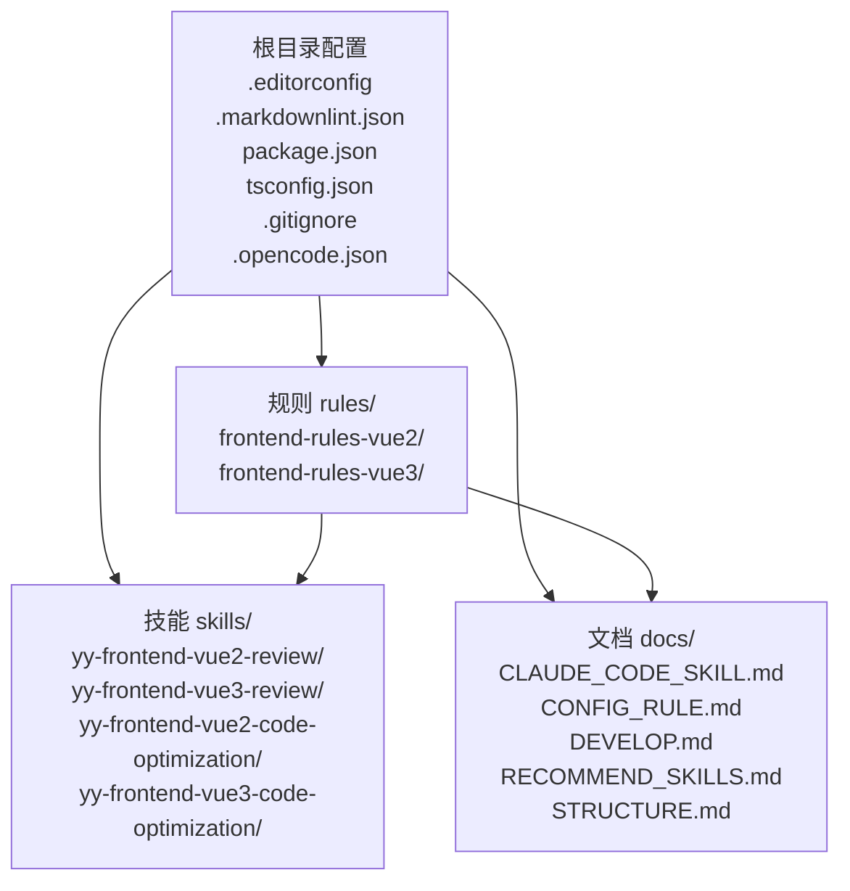
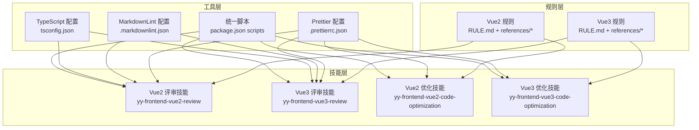
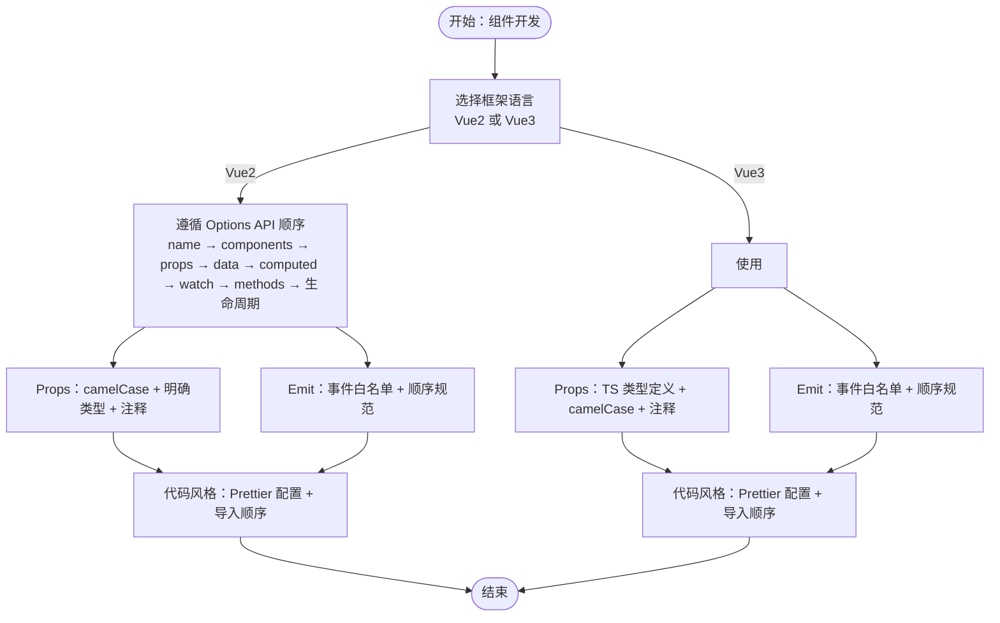
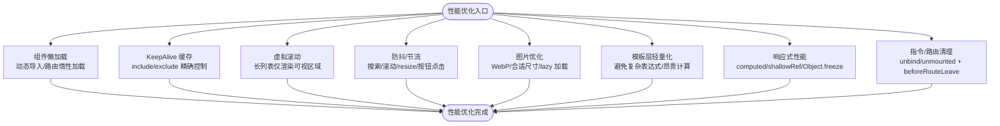
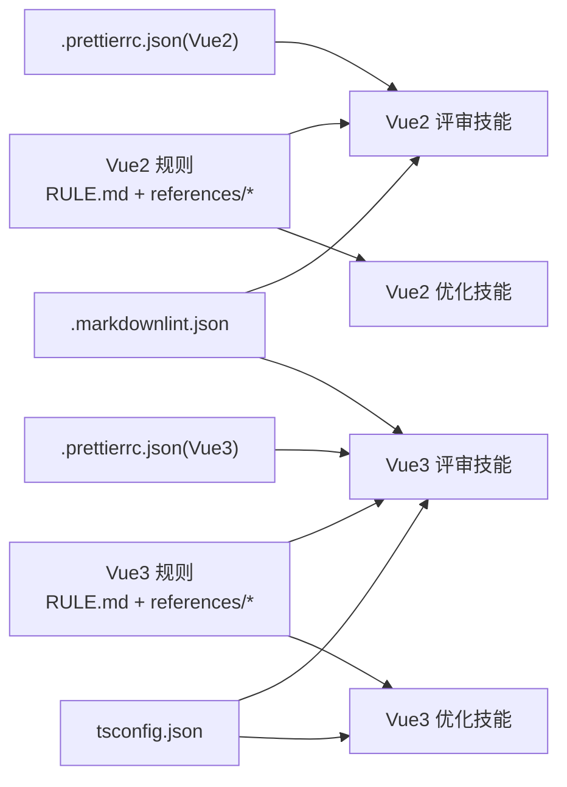

# 代码规范与最佳实践

<cite>
**本文档引用的文件**
- [.editorconfig](file://.editorconfig)
- [.markdownlint.json](file://.markdownlint.json)
- [package.json](file://package.json)
- [tsconfig.json](file://tsconfig.json)
- [.gitignore](file://.gitignore)
- [.opencode.json](file://.opencode.json)
- [rules/frontend-rules-vue2/RULE.md](file://rules/frontend-rules-vue2/RULE.md)
- [rules/frontend-rules-vue3/RULE.md](file://rules/frontend-rules-vue3/RULE.md)
- [rules/frontend-rules-vue2/assets/.prettierrc.json](file://rules/frontend-rules-vue2/assets/.prettierrc.json)
- [rules/frontend-rules-vue3/assets/.prettierrc.json](file://rules/frontend-rules-vue3/assets/.prettierrc.json)
- [skills/yy-frontend-vue2-review/references/code-style.md](file://skills/yy-frontend-vue2-review/references/code-style.md)
- [skills/yy-frontend-vue3-review/references/code-style.md](file://skills/yy-frontend-vue3-review/references/code-style.md)
- [rules/frontend-rules-vue2/references/naming.md](file://rules/frontend-rules-vue2/references/naming.md)
- [rules/frontend-rules-vue3/references/naming.md](file://rules/frontend-rules-vue3/references/naming.md)
- [rules/frontend-rules-vue2/references/performance.md](file://rules/frontend-rules-vue2/references/performance.md)
- [rules/frontend-rules-vue3/references/performance.md](file://rules/frontend-rules-vue3/references/performance.md)
- [skills/yy-frontend-vue2-review/references/component.md](file://skills/yy-frontend-vue2-review/references/component.md)
- [skills/yy-frontend-vue3-review/references/component.md](file://skills/yy-frontend-vue3-review/references/component.md)
</cite>

## 目录
1. [简介](#简介)
2. [项目结构](#项目结构)
3. [核心组件](#核心组件)
4. [架构总览](#架构总览)
5. [详细组件分析](#详细组件分析)
6. [依赖关系分析](#依赖关系分析)
7. [性能考量](#性能考量)
8. [故障排查指南](#故障排查指南)
9. [结论](#结论)
10. [附录](#附录)

## 简介
本文件面向团队与个人开发者，系统化梳理本仓库的代码规范与最佳实践，覆盖以下方面：
- 编码标准：命名约定、缩进与空白、注释规范、文件组织结构
- TypeScript 开发：类型定义、接口设计、模块组织
- 代码质量检查：ESLint/Prettier/MarkdownLint/类型检查与行尾统一
- 前端开发规范：Vue2/Vue3 的开发模式与组件设计原则
- 性能优化：内存管理、渲染优化、资源加载策略
- 可维护性：重构策略、版本兼容性、技术债务管理
- 团队协作：代码审查、分支管理、发布流程

## 项目结构
仓库采用“规则 + 技能 + 文档”的分层组织方式：
- rules：前端通用规则与参考文件（Vue2/Vue3）
- skills：AI 技能实现与评审规则（含 Vue2/Vue3 评审与优化技能）
- docs：项目文档与规范说明
- 根目录配置：编辑器与 Lint 工具配置、包管理与脚本

图表来源
- [rules/frontend-rules-vue2/RULE.md](file://rules/frontend-rules-vue2/RULE.md)
- [rules/frontend-rules-vue3/RULE.md](file://rules/frontend-rules-vue3/RULE.md)
- [package.json](file://package.json)

章节来源
- [package.json:1-46](file://package.json#L1-L46)
- [.editorconfig:1-10](file://.editorconfig#L1-L10)
- [.markdownlint.json:1-13](file://.markdownlint.json#L1-L13)
- [tsconfig.json:1-24](file://tsconfig.json#L1-L24)
- [.gitignore:1-162](file://.gitignore#L1-L162)
- [.opencode.json:1-14](file://.opencode.json#L1-L14)

## 核心组件
- 编辑器与统一格式：EditorConfig 统一缩进、换行、尾随空白；Prettier 配置在各前端规则目录下提供 Vue2/Vue3 的具体设置
- Markdown 规范：markdownlint 配置用于文档一致性检查
- 类型系统：TypeScript 配置启用严格模式开关，并限定目标与模块系统
- 脚本与流水线：统一的 lint 脚本串联技能检查、Markdown 检查、类型检查、行尾转换与市场同步

章节来源
- [.editorconfig:1-10](file://.editorconfig#L1-L10)
- [rules/frontend-rules-vue2/assets/.prettierrc.json:1-19](file://rules/frontend-rules-vue2/assets/.prettierrc.json#L1-L19)
- [rules/frontend-rules-vue3/assets/.prettierrc.json:1-20](file://rules/frontend-rules-vue3/assets/.prettierrc.json#L1-L20)
- [.markdownlint.json:1-13](file://.markdownlint.json#L1-L13)
- [tsconfig.json:1-24](file://tsconfig.json#L1-L24)
- [package.json:7-16](file://package.json#L7-L16)

## 架构总览
整体规范体系围绕“规则文件 + AI 技能 + 文档”协同工作，形成“制定—执行—评审—优化—发布”的闭环。

图表来源
- [rules/frontend-rules-vue2/RULE.md](file://rules/frontend-rules-vue2/RULE.md)
- [rules/frontend-rules-vue3/RULE.md](file://rules/frontend-rules-vue3/RULE.md)
- [skills/yy-frontend-vue2-review/references/component.md](file://skills/yy-frontend-vue2-review/references/component.md)
- [skills/yy-frontend-vue3-review/references/component.md](file://skills/yy-frontend-vue3-review/references/component.md)
- [rules/frontend-rules-vue2/assets/.prettierrc.json](file://rules/frontend-rules-vue2/assets/.prettierrc.json)
- [rules/frontend-rules-vue3/assets/.prettierrc.json](file://rules/frontend-rules-vue3/assets/.prettierrc.json)
- [.markdownlint.json](file://.markdownlint.json)
- [tsconfig.json](file://tsconfig.json)
- [package.json](file://package.json)

## 详细组件分析

### 编码标准与文件组织
- 缩进与空白
  - 统一使用 2 空格缩进、LF 换行、UTF-8 编码、结尾插入换行、去除尾随空白
- 注释规范
  - Vue2/Vue3 规则中均提供注释规范条目，强调模板/脚本/样式注释格式与注释保护原则
- 文件组织
  - Vue2/Vue3 规则明确适用范围与目录约束，仅允许操作 src 目录下的文件
  - Vue2 使用 Options API，Vue3 使用 <script setup> 语法

章节来源
- [.editorconfig:1-10](file://.editorconfig#L1-L10)
- [skills/yy-frontend-vue2-review/references/code-style.md:1-95](file://skills/yy-frontend-vue2-review/references/code-style.md#L1-L95)
- [skills/yy-frontend-vue3-review/references/code-style.md:1-71](file://skills/yy-frontend-vue3-review/references/code-style.md#L1-L71)
- [rules/frontend-rules-vue2/RULE.md:38-44](file://rules/frontend-rules-vue2/RULE.md#L38-L44)
- [rules/frontend-rules-vue3/RULE.md:18-23](file://rules/frontend-rules-vue3/RULE.md#L18-L23)

### 命名约定
- Vue2
  - 组件文件名：多单词 + PascalCase；目录命名：kebab-case；组件使用：PascalCase
  - API 函数：api + Method + URLPath（小驼峰）
  - 事件函数：on + EventName（小驼峰）
  - 常量：全大写 + 下划线；Props/Emits：camelCase；布尔值：isXX/hasXX/showXX 前缀
  - CSS：BEM 规范（块、元素、修饰符），全小写，__ 连接元素，-- 连接修饰符
- Vue3
  - 组件文件名：多单词 + PascalCase；目录命名：kebab-case；组件使用：PascalCase
  - API 函数：api + Method + URLPath（小驼峰）
  - 事件函数：on + EventName（小驼峰）
  - 常量：全大写 + 下划线；Props：camelCase；emit 事件：camelCase；布尔值：isXX/hasXX/showXX 前缀
  - Hooks：必须以 use 开头
  - TypeScript 类型：I + PascalCase；泛型参数：单字母大写

章节来源
- [rules/frontend-rules-vue2/references/naming.md:1-73](file://rules/frontend-rules-vue2/references/naming.md#L1-L73)
- [rules/frontend-rules-vue3/references/naming.md:1-85](file://rules/frontend-rules-vue3/references/naming.md#L1-L85)

### TypeScript 开发最佳实践
- 类型定义
  - Vue3 规则强调 TypeScript 类型注解规范，禁止使用 any、不推荐 as any、@ts-ignore
  - 推荐使用 import type 进行类型导入
- 接口设计
  - 接口与类型别名采用 I + PascalCase 命名
  - 泛型参数使用单字母大写
- 模块组织
  - Vue3 推荐使用 <script setup> 语法，避免 Options API
  - 禁止使用 mixins，优先使用组合式函数（Hooks）

章节来源
- [rules/frontend-rules-vue3/references/naming.md:54-72](file://rules/frontend-rules-vue3/references/naming.md#L54-L72)
- [skills/yy-frontend-vue3-review/references/component.md:7-19](file://skills/yy-frontend-vue3-review/references/component.md#L7-L19)

### 代码质量检查与工具链
- 统一脚本
  - 通过 package.json 的 lint 脚本串联技能检查、Markdown 检查、类型检查、行尾转换与市场同步
- MarkdownLint
  - .markdownlint.json 提供默认规则与部分规则关闭项，确保文档风格一致
- Prettier
  - Vue2/Vue3 规则各自提供 .prettierrc.json，统一分号、引号、尾随逗号、打印宽度、缩进等
- TypeScript
  - tsconfig.json 指定 ES2022 目标与模块系统，开启严格模式开关（严格关闭），并排除 node_modules 与 skills 目录

章节来源
- [package.json:7-16](file://package.json#L7-L16)
- [.markdownlint.json:1-13](file://.markdownlint.json#L1-L13)
- [rules/frontend-rules-vue2/assets/.prettierrc.json:1-19](file://rules/frontend-rules-vue2/assets/.prettierrc.json#L1-L19)
- [rules/frontend-rules-vue3/assets/.prettierrc.json:1-20](file://rules/frontend-rules-vue3/assets/.prettierrc.json#L1-L20)
- [tsconfig.json:1-24](file://tsconfig.json#L1-L24)

### 前端开发规范（Vue2/Vue3）
- Vue2 组件开发
  - Options API 结构顺序：name → components → props → data → computed → watch → methods → 生命周期钩子
  - 模板元素特性顺序：is → v-for → v-if/v-else-if/v-else → v-show/v-cloak → id → props/attrs → v-on → v-html/v-text → v-slot
  - Props：camelCase 命名，明确类型与默认值，必须添加注释
  - Emit：事件顺序 input → 其它自定义事件 → change/click 等交互事件；基础组件禁止在生命周期中 emit
  - 禁止 mixins，建议重构为可复用工具函数或独立组件
- Vue3 组件开发
  - 必须使用 <script setup> 语法，禁止使用 this
  - 禁止使用 mixins
  - 结构顺序：imports → defineProps → defineEmits → 全局 Hooks → 业务模块（按领域分组） → defineExpose
  - Props：使用 TypeScript 类型定义，camelCase 命名，类型明确并注释说明
  - Emit：事件顺序与白名单与 Vue2 类似，基础组件禁止在生命周期中 emit
  - ref 优先，复杂对象使用 reactive；ref 访问使用 .value

图表来源
- [skills/yy-frontend-vue2-review/references/component.md:9-49](file://skills/yy-frontend-vue2-review/references/component.md#L9-L49)
- [skills/yy-frontend-vue2-review/references/component.md:92-128](file://skills/yy-frontend-vue2-review/references/component.md#L92-L128)
- [skills/yy-frontend-vue3-review/references/component.md:28-37](file://skills/yy-frontend-vue3-review/references/component.md#L28-L37)
- [skills/yy-frontend-vue3-review/references/component.md:52-64](file://skills/yy-frontend-vue3-review/references/component.md#L52-L64)

章节来源
- [skills/yy-frontend-vue2-review/references/component.md:1-195](file://skills/yy-frontend-vue2-review/references/component.md#L1-L195)
- [skills/yy-frontend-vue3-review/references/component.md:1-105](file://skills/yy-frontend-vue3-review/references/component.md#L1-L105)

### 性能优化建议
- 组件懒加载
  - Vue2：使用动态导入 () => import(...)；路由页面必须惰性加载
  - Vue3：使用 defineAsyncComponent 动态导入
- KeepAlive 缓存
  - 通过 include/exclude 精确控制缓存范围，避免内存泄漏
- 虚拟滚动
  - 长列表（100+ 项）使用虚拟滚动，仅渲染可视区域
- 防抖节流
  - 搜索（防抖 300ms）、滚动（节流 100ms）、resize（节流）、按钮点击（防抖/锁）
- 图片优化
  - WebP 优先、合适尺寸、非首屏图片 lazy 加载
- 模板层轻量化
  - 模板只负责展示，避免复杂表达式与昂贵计算，优先使用 computed
- 响应式性能
  - Vue2：优先 computed；大数据 Object.freeze；避免在 watch 中同步 DOM 操作；$set 响应式陷阱
  - Vue3：优先 computed；大型数据列表考虑 shallowRef；避免在 watch 中同步 DOM 操作
- 自定义指令与路由守卫清理
  - Vue2：unbind 钩子清理事件监听与定时器
  - Vue3：unmounted 钩子清理事件监听与定时器；beforeRouteLeave 清理定时器、取消未完成请求、关闭弹窗

图表来源
- [rules/frontend-rules-vue2/references/performance.md:24-40](file://rules/frontend-rules-vue2/references/performance.md#L24-L40)
- [rules/frontend-rules-vue2/references/performance.md:44-53](file://rules/frontend-rules-vue2/references/performance.md#L44-L53)
- [rules/frontend-rules-vue2/references/performance.md:57-71](file://rules/frontend-rules-vue2/references/performance.md#L57-L71)
- [rules/frontend-rules-vue2/references/performance.md:75-98](file://rules/frontend-rules-vue2/references/performance.md#L75-L98)
- [rules/frontend-rules-vue2/references/performance.md:102-111](file://rules/frontend-rules-vue2/references/performance.md#L102-L111)
- [rules/frontend-rules-vue2/references/performance.md:123-128](file://rules/frontend-rules-vue2/references/performance.md#L123-L128)
- [rules/frontend-rules-vue2/references/performance.md:135-144](file://rules/frontend-rules-vue2/references/performance.md#L135-L144)
- [rules/frontend-rules-vue3/references/performance.md:12-18](file://rules/frontend-rules-vue3/references/performance.md#L12-L18)
- [rules/frontend-rules-vue3/references/performance.md:27-31](file://rules/frontend-rules-vue3/references/performance.md#L27-L31)
- [rules/frontend-rules-vue3/references/performance.md:40-49](file://rules/frontend-rules-vue3/references/performance.md#L40-L49)
- [rules/frontend-rules-vue3/references/performance.md:64-72](file://rules/frontend-rules-vue3/references/performance.md#L64-L72)
- [rules/frontend-rules-vue3/references/performance.md:74-82](file://rules/frontend-rules-vue3/references/performance.md#L74-L82)
- [rules/frontend-rules-vue3/references/performance.md:86-95](file://rules/frontend-rules-vue3/references/performance.md#L86-L95)
- [rules/frontend-rules-vue3/references/performance.md:99-104](file://rules/frontend-rules-vue3/references/performance.md#L99-L104)
- [rules/frontend-rules-vue3/references/performance.md:107-112](file://rules/frontend-rules-vue3/references/performance.md#L107-L112)
- [rules/frontend-rules-vue3/references/performance.md:119-128](file://rules/frontend-rules-vue3/references/performance.md#L119-L128)

章节来源
- [rules/frontend-rules-vue2/references/performance.md:1-179](file://rules/frontend-rules-vue2/references/performance.md#L1-L179)
- [rules/frontend-rules-vue3/references/performance.md:1-136](file://rules/frontend-rules-vue3/references/performance.md#L1-L136)

### 可维护性考虑
- 代码重构
  - Vue2：禁止 mixins，建议重构为可复用工具函数或独立组件
  - Vue3：禁止 mixins，优先使用组合式函数（Hooks）
- 版本兼容性
  - Vue2 使用 Options API；Vue3 使用 <script setup> 与组合式 API
  - TypeScript 类型命名与导入方式在 Vue3 中更严格
- 技术债务管理
  - 通过统一的规则文件与 AI 评审技能持续识别与治理
  - 通过 Prettier/MarkdownLint/TypeScript 统一质量门槛

章节来源
- [skills/yy-frontend-vue2-review/references/component.md:53-59](file://skills/yy-frontend-vue2-review/references/component.md#L53-L59)
- [skills/yy-frontend-vue3-review/references/component.md:17-19](file://skills/yy-frontend-vue3-review/references/component.md#L17-L19)
- [rules/frontend-rules-vue3/references/naming.md:54-72](file://rules/frontend-rules-vue3/references/naming.md#L54-L72)

### 团队协作规范
- 代码审查
  - 使用 AI 评审技能（yy-frontend-vue2-review / yy-frontend-vue3-review）进行自动化规则检查
  - 规则文件作为评审依据，确保一致性
- 分支管理
  - 仓库包含大量 .gitignore 条目，建议遵循现有忽略策略，避免无关文件进入版本控制
- 发布流程
  - 通过统一脚本（package.json scripts）执行 lint、类型检查、行尾转换与市场同步

章节来源
- [package.json:7-16](file://package.json#L7-L16)
- [.gitignore:1-162](file://.gitignore#L1-L162)
- [.opencode.json:1-14](file://.opencode.json#L1-L14)

## 依赖关系分析
- 规则与技能的耦合
  - Vue2/Vue3 规则文件作为技能评审与优化的权威依据
- 工具链与规则的耦合
  - Prettier 配置与规则文件中的代码风格条目强关联
  - MarkdownLint 配置与文档规范一致
  - TypeScript 配置与 Vue3 规则中的类型注解规范相辅相成

图表来源
- [rules/frontend-rules-vue2/RULE.md](file://rules/frontend-rules-vue2/RULE.md)
- [rules/frontend-rules-vue3/RULE.md](file://rules/frontend-rules-vue3/RULE.md)
- [skills/yy-frontend-vue2-review/references/component.md](file://skills/yy-frontend-vue2-review/references/component.md)
- [skills/yy-frontend-vue3-review/references/component.md](file://skills/yy-frontend-vue3-review/references/component.md)
- [rules/frontend-rules-vue2/assets/.prettierrc.json](file://rules/frontend-rules-vue2/assets/.prettierrc.json)
- [rules/frontend-rules-vue3/assets/.prettierrc.json](file://rules/frontend-rules-vue3/assets/.prettierrc.json)
- [.markdownlint.json](file://.markdownlint.json)
- [tsconfig.json](file://tsconfig.json)

章节来源
- [rules/frontend-rules-vue2/RULE.md:1-62](file://rules/frontend-rules-vue2/RULE.md#L1-L62)
- [rules/frontend-rules-vue3/RULE.md:1-68](file://rules/frontend-rules-vue3/RULE.md#L1-L68)

## 性能考量
- 渲染优化
  - 使用虚拟滚动与 KeepAlive 缓存，结合 include/exclude 精准控制缓存范围
  - 避免在模板中执行昂贵计算，优先使用 computed
- 资源加载策略
  - 页面路由与大组件采用惰性加载，减少初始包体积
  - 图片使用 WebP、合适尺寸与懒加载
- 内存管理
  - 在指令与路由守卫中清理事件监听与定时器，防止内存泄漏
  - Vue2 中注意 $set 响应式陷阱，Vue3 中合理使用 shallowRef

章节来源
- [rules/frontend-rules-vue2/references/performance.md:24-40](file://rules/frontend-rules-vue2/references/performance.md#L24-L40)
- [rules/frontend-rules-vue2/references/performance.md:44-53](file://rules/frontend-rules-vue2/references/performance.md#L44-L53)
- [rules/frontend-rules-vue2/references/performance.md:57-71](file://rules/frontend-rules-vue2/references/performance.md#L57-L71)
- [rules/frontend-rules-vue2/references/performance.md:102-111](file://rules/frontend-rules-vue2/references/performance.md#L102-L111)
- [rules/frontend-rules-vue2/references/performance.md:123-128](file://rules/frontend-rules-vue2/references/performance.md#L123-L128)
- [rules/frontend-rules-vue2/references/performance.md:135-144](file://rules/frontend-rules-vue2/references/performance.md#L135-L144)
- [rules/frontend-rules-vue3/references/performance.md:12-18](file://rules/frontend-rules-vue3/references/performance.md#L12-L18)
- [rules/frontend-rules-vue3/references/performance.md:27-31](file://rules/frontend-rules-vue3/references/performance.md#L27-L31)
- [rules/frontend-rules-vue3/references/performance.md:40-49](file://rules/frontend-rules-vue3/references/performance.md#L40-L49)
- [rules/frontend-rules-vue3/references/performance.md:86-95](file://rules/frontend-rules-vue3/references/performance.md#L86-L95)
- [rules/frontend-rules-vue3/references/performance.md:99-104](file://rules/frontend-rules-vue3/references/performance.md#L99-L104)
- [rules/frontend-rules-vue3/references/performance.md:107-112](file://rules/frontend-rules-vue3/references/performance.md#L107-L112)
- [rules/frontend-rules-vue3/references/performance.md:119-128](file://rules/frontend-rules-vue3/references/performance.md#L119-L128)

## 故障排查指南
- 规则不一致
  - 确认使用的规则文件版本与技能版本匹配
  - 检查 Prettier 配置与规则文件中的代码风格条目是否一致
- 组件开发问题
  - Vue2：检查 Options API 结构顺序与 Props/Emits 规范
  - Vue3：<script setup> 语法与 Hooks 使用是否符合规范
- 性能问题
  - 检查是否使用了虚拟滚动、KeepAlive 缓存、防抖节流与图片优化
  - 确认指令与路由守卫清理逻辑是否完善
- 质量检查失败
  - 运行统一脚本（package.json scripts）定位失败环节
  - 检查 MarkdownLint 与 TypeScript 配置是否与规则一致

章节来源
- [skills/yy-frontend-vue2-review/references/component.md:9-49](file://skills/yy-frontend-vue2-review/references/component.md#L9-L49)
- [skills/yy-frontend-vue3-review/references/component.md:28-37](file://skills/yy-frontend-vue3-review/references/component.md#L28-L37)
- [rules/frontend-rules-vue2/references/performance.md:75-98](file://rules/frontend-rules-vue2/references/performance.md#L75-L98)
- [rules/frontend-rules-vue3/references/performance.md:64-82](file://rules/frontend-rules-vue3/references/performance.md#L64-L82)
- [package.json:7-16](file://package.json#L7-L16)

## 结论
本仓库通过“规则 + 技能 + 工具链”的协同机制，构建了覆盖命名、风格、组件设计、性能优化与质量检查的完整规范体系。建议团队在日常开发中：
- 严格遵循规则文件与 AI 评审技能
- 使用统一的 Prettier/MarkdownLint/TypeScript 配置
- 在 Vue2/Vue3 中分别采用 Options API 与 <script setup> 的最佳实践
- 持续应用性能优化策略并定期进行技术债务治理

## 附录
- 规则文件快速索引
  - Vue2：总纲、AI 行为约束、组件开发、交互通信、指令规范、命名规范、结构顺序、网络请求、代码风格、注释规范、CSS 规范、性能优化、约束清单
  - Vue3：总纲、AI 行为约束、组件开发、交互通信、指令规范、命名规范、响应式、watch 规范、Hooks 规范、结构顺序、网络请求、约束清单、TypeScript 类型规范、代码风格、CSS 规范、性能优化、注释规范
- 工具配置要点
  - EditorConfig：统一缩进、换行、空白
  - Prettier：分号、引号、尾随逗号、打印宽度、缩进
  - MarkdownLint：文档风格一致性
  - TypeScript：目标与模块系统、严格模式开关

章节来源
- [rules/frontend-rules-vue2/RULE.md:10-62](file://rules/frontend-rules-vue2/RULE.md#L10-L62)
- [rules/frontend-rules-vue3/RULE.md:10-68](file://rules/frontend-rules-vue3/RULE.md#L10-L68)
- [.editorconfig:1-10](file://.editorconfig#L1-L10)
- [rules/frontend-rules-vue2/assets/.prettierrc.json:1-19](file://rules/frontend-rules-vue2/assets/.prettierrc.json#L1-L19)
- [rules/frontend-rules-vue3/assets/.prettierrc.json:1-20](file://rules/frontend-rules-vue3/assets/.prettierrc.json#L1-L20)
- [.markdownlint.json:1-13](file://.markdownlint.json#L1-L13)
- [tsconfig.json:1-24](file://tsconfig.json#L1-L24)