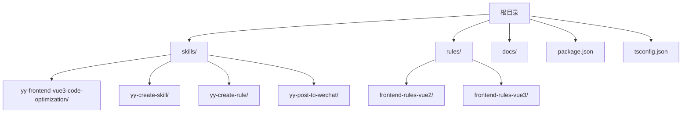
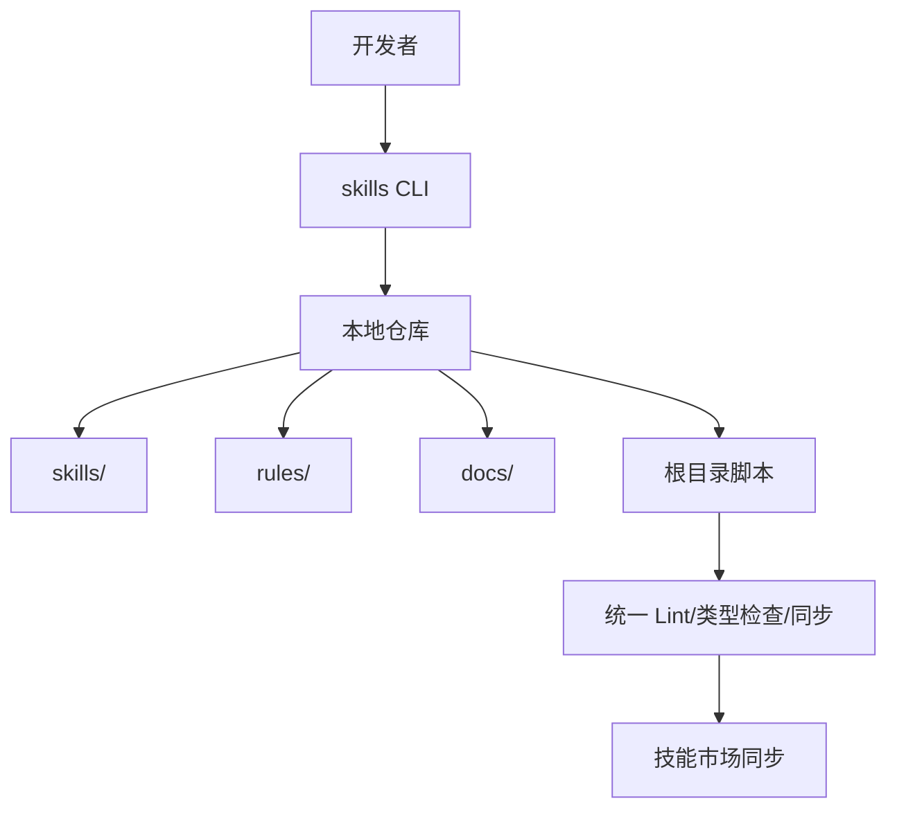
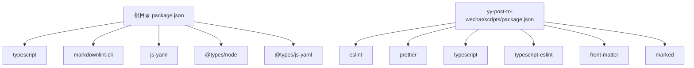

# 开发指南

<cite>
**本文引用的文件**
- [package.json](file://package.json)
- [tsconfig.json](file://tsconfig.json)
- [docs/DEVELOP.md](file://docs/DEVELOP.md)
- [docs/STRUCTURE.md](file://docs/STRUCTURE.md)
- [docs/CLAUDE_CODE_SKILL.md](file://docs/CLAUDE_CODE_SKILL.md)
- [rules/frontend-rules-vue2/RULE.md](file://rules/frontend-rules-vue2/RULE.md)
- [rules/frontend-rules-vue3/RULE.md](file://rules/frontend-rules-vue3/RULE.md)
- [rules/frontend-rules-vue2/references/ai-behavior.md](file://rules/frontend-rules-vue2/references/ai-behavior.md)
- [rules/frontend-rules-vue3/references/code-style.md](file://rules/frontend-rules-vue3/references/code-style.md)
- [rules/frontend-rules-vue3/references/naming.md](file://rules/frontend-rules-vue3/references/naming.md)
- [skills/yy-create-skill/templates/skill-template.md](file://skills/yy-create-skill/templates/skill-template.md)
- [skills/yy-create-rule/resources/content-template.md](file://skills/yy-create-rule/resources/content-template.md)
- [skills/yy-post-to-wechat/scripts/package.json](file://skills/yy-post-to-wechat/scripts/package.json)
- [skills/yy-frontend-vue3-code-optimization/prompts/skill-prompts.md](file://skills/yy-frontend-vue3-code-optimization/prompts/skill-prompts.md)
- [.gitignore](file://.gitignore)
</cite>

## 目录
1. [简介](#简介)
2. [项目结构](#项目结构)
3. [核心组件](#核心组件)
4. [架构总览](#架构总览)
5. [详细组件分析](#详细组件分析)
6. [依赖分析](#依赖分析)
7. [性能考虑](#性能考虑)
8. [故障排查指南](#故障排查指南)
9. [结论](#结论)
10. [附录](#附录)

## 简介
本指南面向开发者，提供本地开发环境搭建、IDE 配置、调试工具设置、测试与质量保障、AI 代理开发规范、代码规范与最佳实践、贡献流程以及开发工具使用方法的完整说明。同时为新贡献者提供项目结构理解与上手路径。

## 项目结构
该项目采用“技能 + 规则”的双轴组织方式：
- skills：对外公开的技能集合，每个技能以独立目录形式提供文档、示例与元数据
- rules：面向前端工程的开发规范与约束，按 Vue2/Vue3 拆分子模块，提供行为约束、命名、代码风格、性能等规范
- docs：开发与使用指南文档
- 根目录脚本与配置：统一的 Lint、类型检查、同步市场等自动化流程

图表来源
- [docs/STRUCTURE.md:1-10](file://docs/STRUCTURE.md#L1-L10)
- [rules/frontend-rules-vue2/RULE.md:1-62](file://rules/frontend-rules-vue2/RULE.md#L1-L62)
- [rules/frontend-rules-vue3/RULE.md:1-68](file://rules/frontend-rules-vue3/RULE.md#L1-L68)

章节来源
- [docs/STRUCTURE.md:1-10](file://docs/STRUCTURE.md#L1-L10)

## 核心组件
- 开发脚本与工具链
  - 统一 Lint/类型检查/同步市场：通过根目录脚本实现，便于在多子项目间保持一致的质量基线
  - TypeScript 配置：面向 ES2022，启用 bundler 模块解析，跳过库类型检查以加速开发
- 规范与约束
  - Vue2/Vue3 规范：拆分为“总纲索引”“AI 行为约束”“基础规范/强烈推荐/风格指南”等模块，覆盖组件开发、交互通信、命名、结构顺序、网络请求、代码风格、注释、CSS、性能、约束清单等
  - AI 行为约束：限定修改权限、文档生成限制与直接输出策略
- 技能模板与内容结构
  - 技能基础模板：提供 Markdown 结构与章节组织建议
  - 规则内容模板：提供章节组织、示例与注意事项的写作规范
- 调试与本地开发
  - 本地调试：通过 skills CLI 添加本地仓库，即可在本地快速验证技能
  - 忽略文件：本地调试产生的锁定与缓存文件已在忽略列表中

章节来源
- [package.json:1-46](file://package.json#L1-L46)
- [tsconfig.json:1-24](file://tsconfig.json#L1-L24)
- [rules/frontend-rules-vue2/RULE.md:1-62](file://rules/frontend-rules-vue2/RULE.md#L1-L62)
- [rules/frontend-rules-vue3/RULE.md:1-68](file://rules/frontend-rules-vue3/RULE.md#L1-L68)
- [rules/frontend-rules-vue2/references/ai-behavior.md:1-29](file://rules/frontend-rules-vue2/references/ai-behavior.md#L1-L29)
- [skills/yy-create-skill/templates/skill-template.md:1-37](file://skills/yy-create-skill/templates/skill-template.md#L1-L37)
- [skills/yy-create-rule/resources/content-template.md:1-122](file://skills/yy-create-rule/resources/content-template.md#L1-L122)
- [docs/DEVELOP.md:1-18](file://docs/DEVELOP.md#L1-L18)
- [.gitignore:1-162](file://.gitignore#L1-L162)

## 架构总览
整体开发与发布流程围绕“本地调试 → 规范约束 → 质量检查 → 同步市场”的闭环展开。开发者在本地通过 CLI 添加仓库进行技能调试，随后通过统一的 Lint/类型检查/同步脚本保障质量与一致性。

图表来源
- [docs/DEVELOP.md:8-17](file://docs/DEVELOP.md#L8-L17)
- [package.json:7-16](file://package.json#L7-L16)
- [rules/frontend-rules-vue2/RULE.md:14-36](file://rules/frontend-rules-vue2/RULE.md#L14-L36)
- [rules/frontend-rules-vue3/RULE.md:14-46](file://rules/frontend-rules-vue3/RULE.md#L14-L46)

## 详细组件分析

### 本地开发与调试
- 本地调试步骤
  - 在根目录执行添加命令，即可将当前仓库注册为技能源，便于本地调试
  - 本地调试会产生锁定与缓存文件，已在忽略列表中，避免提交到版本库
- 调试与忽略文件
  - 本地调试产物：skills-lock.json、.agents/skills/ 等
  - 忽略文件：.gitignore 中已配置

章节来源
- [docs/DEVELOP.md:8-17](file://docs/DEVELOP.md#L8-L17)
- [.gitignore:151-162](file://.gitignore#L151-L162)

### AI 代理开发规范与约束
- 适用范围
  - 限定在 src 目录下的文件，禁止修改 src 之外的文件（除非用户明确指定）
- 行为准则
  - 允许在对话中直接输出文字说明、总结或代码片段
  - 允许修改代码中的注释与 JSDoc
  - 禁止未经用户明确要求就创建 README、说明文档等
- 修改权限
  - 允许修改：代码中的注释、JSDoc；src 目录下的文件
  - 禁止修改：src 之外的任何文件（除非用户明确指定）

章节来源
- [rules/frontend-rules-vue2/references/ai-behavior.md:5-29](file://rules/frontend-rules-vue2/references/ai-behavior.md#L5-L29)

### 代码规范与最佳实践（Vue3）
- 代码风格与格式化
  - 使用 Prettier 配置，统一缩进、引号、分号、行宽、尾随逗号、箭头函数括号等
  - 函数写法偏好：优先使用箭头函数，避免 function 声明
- 命名规范
  - 文件与组件：多单词 + PascalCase；目录使用 kebab-case
  - 函数：API 函数、事件函数命名体系；Props、emit 事件、布尔值命名；Hooks 以 use 开头
  - TypeScript 类型：I 前缀 + PascalCase；泛型参数单字母大写
  - CSS 命名：BEM 规范，块__元素--修饰符
- 结构顺序与导入分组
  - Vue3：<script setup> 结构顺序与导入分组（4 组）
  - JS/TS：导入顺序（4 组）与网络请求统一模式
- 网络请求与安全
  - 统一响应解构处理；错误处理与安全约束
- 注释规范
  - 模板/脚本/样式注释格式与注释保护原则
- 性能优化
  - 懒加载、KeepAlive、虚拟滚动、防抖节流、图片优化
- 绝对禁止与不推荐项
  - 绝对禁止：连续解构、父组件直接修改子组件数据、多次修改 ref/reactive 属性类型、直接修改 props、在 <script setup> 中使用 this、使用 Options API 写法、使用 mixins、多层 try/catch 嵌套、基础组件生命周期主动 emit、简单逻辑额外封装为函数
  - 不推荐项：多层 try/catch 嵌套、生命周期 emit、可选链操作符、CSS 原生嵌套、:has() 伪类

章节来源
- [rules/frontend-rules-vue3/RULE.md:18-68](file://rules/frontend-rules-vue3/RULE.md#L18-L68)
- [rules/frontend-rules-vue3/references/code-style.md:1-61](file://rules/frontend-rules-vue3/references/code-style.md#L1-L61)
- [rules/frontend-rules-vue3/references/naming.md:1-85](file://rules/frontend-rules-vue3/references/naming.md#L1-L85)

### Vue2 规范要点
- 规范模块化：总纲索引、AI 行为约束、基础规范、强烈推荐、风格指南
- 适用范围：src 目录下的 .vue/.js/.css/.scss/.less 文件，使用 Options API
- 结构顺序与导入分组、组件交互与通信、模板指令、命名与性能等

章节来源
- [rules/frontend-rules-vue2/RULE.md:14-62](file://rules/frontend-rules-vue2/RULE.md#L14-L62)

### 技能模板与内容结构
- 技能基础模板
  - 提供 Markdown 结构与章节组织建议，包含名称、描述、使用场景、指令、相关资源等
- 规则内容模板
  - 提供章节组织、示例与注意事项的写作规范，强调层级结构一致性与插入位置优先级

章节来源
- [skills/yy-create-skill/templates/skill-template.md:9-37](file://skills/yy-create-skill/templates/skill-template.md#L9-L37)
- [skills/yy-create-rule/resources/content-template.md:5-31](file://skills/yy-create-rule/resources/content-template.md#L5-L31)

### 开发工具与脚本
- 根目录脚本
  - 统一 Lint：check:skill、lint:skills、lint:markdown、check:type、lint:lf、sync:marketplace
  - 安装技能：install:skill
- TypeScript 配置
  - 目标与模块：ES2022；模块解析：bundler；跳过库检查；严格模式关闭
- 子项目脚本示例
  - yy-post-to-wechat/scripts：包含 ESLint、Prettier、TypeScript 类型检查脚本

章节来源
- [package.json:7-16](file://package.json#L7-L16)
- [tsconfig.json:2-13](file://tsconfig.json#L2-L13)
- [skills/yy-post-to-wechat/scripts/package.json:9-15](file://skills/yy-post-to-wechat/scripts/package.json#L9-L15)

### 贡献流程与质量保障
- 质量基线
  - 统一 Lint/类型检查/同步市场，确保多子项目一致性
- 忽略文件
  - 本地调试产物与第三方参考目录已在忽略列表中
- 调试与验证
  - 通过 skills CLI 添加本地仓库进行调试
- 市场同步
  - 通过 sync:marketplace 脚本同步技能市场信息

章节来源
- [package.json:7-16](file://package.json#L7-L16)
- [.gitignore:148-162](file://.gitignore#L148-L162)
- [docs/DEVELOP.md:8-17](file://docs/DEVELOP.md#L8-L17)

### Claude Code 安装技能
- 安装步骤：进入 claude 交互模式，添加 bulls-cows/skills 插件市场，选择 open-skills 插件市场并安装所需技能

章节来源
- [docs/CLAUDE_CODE_SKILL.md:1-10](file://docs/CLAUDE_CODE_SKILL.md#L1-L10)

## 依赖分析
- 根目录依赖
  - TypeScript、markdownlint-cli、js-yaml、@types/* 等
- 子项目依赖
  - front-matter、marked 等
- 子项目脚本依赖
  - eslint、prettier、typescript、typescript-eslint 等

图表来源
- [package.json:34-44](file://package.json#L34-L44)
- [skills/yy-post-to-wechat/scripts/package.json:16-27](file://skills/yy-post-to-wechat/scripts/package.json#L16-L27)

章节来源
- [package.json:34-44](file://package.json#L34-L44)
- [skills/yy-post-to-wechat/scripts/package.json:16-27](file://skills/yy-post-to-wechat/scripts/package.json#L16-L27)

## 性能考虑
- Vue3 性能优化建议
  - 懒加载、KeepAlive、虚拟滚动、防抖节流、图片优化
- 代码风格与格式化
  - 统一 Prettier 配置，减少格式化差异带来的 diff 膨胀与合并冲突
- 网络请求
  - 统一响应解构与错误处理，避免重复请求与无效渲染

章节来源
- [rules/frontend-rules-vue3/RULE.md:45-68](file://rules/frontend-rules-vue3/RULE.md#L45-L68)
- [rules/frontend-rules-vue3/references/code-style.md:30-50](file://rules/frontend-rules-vue3/references/code-style.md#L30-L50)
- [rules/frontend-rules-vue3/references/naming.md:76-85](file://rules/frontend-rules-vue3/references/naming.md#L76-L85)

## 故障排查指南
- 本地调试产物
  - 本地调试会生成 skills-lock.json 与 .agents/skills/ 等文件，已在忽略列表中，避免提交
- 调试命令
  - 在根目录执行添加命令，将当前仓库注册为技能源
- 市场同步
  - 如需同步技能市场信息，执行 sync:marketplace 脚本

章节来源
- [.gitignore:151-162](file://.gitignore#L151-L162)
- [docs/DEVELOP.md:8-17](file://docs/DEVELOP.md#L8-L17)
- [package.json:14-15](file://package.json#L14-L15)

## 结论
本指南提供了从环境搭建、规范约束、开发工具到质量保障与贡献流程的完整路径。建议新贡献者先熟悉项目结构与开发脚本，再结合 Vue2/Vue3 规范与 AI 行为约束开展工作，最后通过统一的 Lint/类型检查/同步流程保障质量与一致性。

## 附录
- 在 Claude Code 中安装技能的步骤与注意事项
- Vue3 提示词技能的边界与执行流程（含任务调度、风险分级与执行顺序）

章节来源
- [docs/CLAUDE_CODE_SKILL.md:1-10](file://docs/CLAUDE_CODE_SKILL.md#L1-L10)
- [skills/yy-frontend-vue3-code-optimization/prompts/skill-prompts.md:21-57](file://skills/yy-frontend-vue3-code-optimization/prompts/skill-prompts.md#L21-L57)