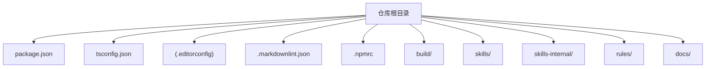
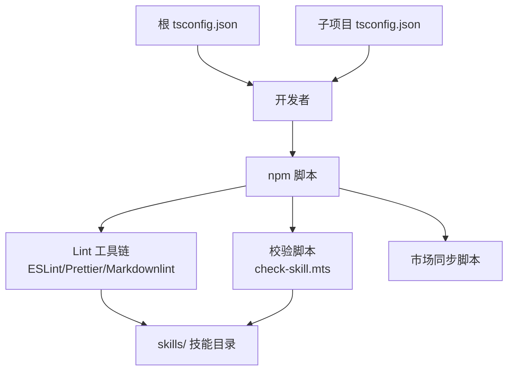
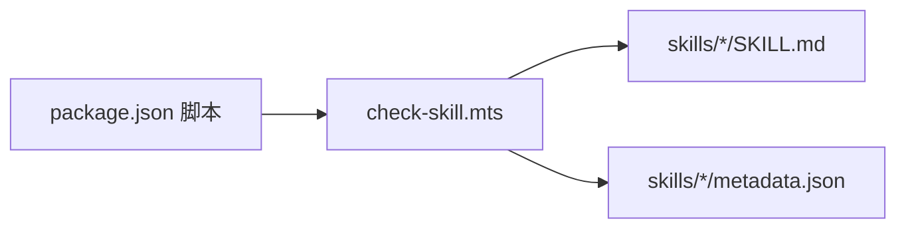

# 本地开发环境

<cite>
**本文引用的文件**
- [package.json](file://package.json)
- [tsconfig.json](file://tsconfig.json)
- [.editorconfig](file://.editorconfig)
- [.markdownlint.json](file://.markdownlint.json)
- [.npmrc](file://.npmrc)
- [DEVELOP.md](file://docs/DEVELOP.md)
- [STRUCTURE.md](file://docs/STRUCTURE.md)
- [check-skill.mts](file://build/check-skill.mts)
- [yy-post-to-wechat/scripts/package.json](file://skills/yy-post-to-wechat/scripts/package.json)
- [yy-post-to-wechat/scripts/tsconfig.json](file://skills/yy-post-to-wechat/scripts/tsconfig.json)
- [yy-create-skill/SKILL.md](file://skills/yy-create-skill/SKILL.md)
- [yy-create-skill/templates/skill-template.md](file://skills/yy-create-skill/templates/skill-template.md)
</cite>

## 目录
1. [简介](#简介)
2. [项目结构](#项目结构)
3. [核心组件](#核心组件)
4. [架构总览](#架构总览)
5. [详细组件分析](#详细组件分析)
6. [依赖关系分析](#依赖关系分析)
7. [性能考虑](#性能考虑)
8. [故障排查指南](#故障排查指南)
9. [结论](#结论)
10. [附录](#附录)

## 简介
本指南面向首次参与本地开发的工程师，目标是帮助你在本仓库上快速搭建可运行的开发环境，涵盖系统要求、安装步骤、IDE 推荐配置、关键配置文件说明、调试与日志设置，以及常见问题排查。仓库采用 Node.js + TypeScript 技术栈，配合 Markdown 规范与类型检查工具，确保技能文档与脚本的一致性与质量。

## 项目结构
仓库采用“技能 + 规则 + 构建工具”的分层组织方式：
- 根目录包含统一的包管理、类型配置、编辑器规范与 Markdown 规范
- skills/ 与 skills-internal/ 分别存放公开与内部技能
- rules/ 存放各类规则与参考材料
- build/ 存放校验与同步脚本
- docs/ 提供开发与结构说明文档

图表来源
- [STRUCTURE.md:1-10](file://docs/STRUCTURE.md#L1-L10)
- [package.json:1-46](file://package.json#L1-L46)
- [tsconfig.json:1-24](file://tsconfig.json#L1-L24)

章节来源
- [STRUCTURE.md:1-10](file://docs/STRUCTURE.md#L1-L10)

## 核心组件
- 包管理与脚本
  - 统一通过 npm/yarn/pnpm 管理依赖与脚本，根目录提供 Lint、类型检查、换行符转换与市场同步等任务
- 类型系统
  - 根 tsconfig.json 面向 ES2022，启用严格模式开关，排除 skills 与 skills-internal 目录
  - 子项目（如微信脚本）各自维护独立 tsconfig.json
- 编辑器与格式化
  - .editorconfig 统一缩进、换行与空白处理
  - .markdownlint.json 控制 Markdown 规则
  - .npmrc 固定版本与镜像源
- 校验与同步
  - build/check-skill.mts 校验 SKILL.md 与 metadata.json 的一致性
  - 同步脚本负责市场元数据同步

章节来源
- [package.json:1-46](file://package.json#L1-L46)
- [tsconfig.json:1-24](file://tsconfig.json#L1-L24)
- [.editorconfig:1-10](file://.editorconfig#L1-L10)
- [.markdownlint.json:1-13](file://.markdownlint.json#L1-L13)
- [.npmrc:1-3](file://.npmrc#L1-L3)
- [check-skill.mts:1-230](file://build/check-skill.mts#L1-L230)

## 架构总览
本地开发围绕“脚本驱动 + 类型约束 + 规范校验”展开，形成从开发到发布的闭环。

图表来源
- [package.json:7-16](file://package.json#L7-L16)
- [tsconfig.json:1-24](file://tsconfig.json#L1-L24)
- [yy-post-to-wechat/scripts/tsconfig.json:1-21](file://skills/yy-post-to-wechat/scripts/tsconfig.json#L1-L21)
- [check-skill.mts:1-230](file://build/check-skill.mts#L1-L230)

## 详细组件分析

### 系统要求与安装步骤
- 系统要求
  - Node.js：根工程脚本未声明 engines，但子项目（如微信脚本）要求 Node >= 22.18.0，建议使用 22.x LTS
  - TypeScript：根工程使用 5.9.3；子项目使用 5.x；建议统一使用兼容版本
  - 包管理器：推荐使用 npm（.npmrc 指定镜像与固定版本）
- 安装步骤
  1) 克隆仓库并进入目录
  2) 安装根依赖：npm install
  3) 进入子项目目录安装其依赖（如需独立开发脚本）
  4) 运行统一脚本：npm run lint（包含类型检查、Markdown Lint、换行符转换、技能校验与市场同步）

章节来源
- [yy-post-to-wechat/scripts/package.json:6-8](file://skills/yy-post-to-wechat/scripts/package.json#L6-L8)
- [package.json:1-46](file://package.json#L1-L46)
- [.npmrc:1-3](file://.npmrc#L1-L3)

### IDE 与编辑器推荐配置
- VS Code 插件（建议）
  - ESLint：与根工程 ESLint 配置联动
  - Prettier：与 .prettierrc/.prettierrc.json 对齐
  - MarkdownLint：与 .markdownlint.json 对齐
  - EditorConfig：与 .editorconfig 对齐
- VS Code 设置要点
  - 编码：UTF-8
  - 缩进：2 空格
  - 行尾：LF
  - 自动保存：开启
  - 格式化：Prettier 作为默认格式化器
  - ESLint：开启保存时自动修复
- 仓库内已有格式化配置
  - .editorconfig：统一缩进、换行与空白处理
  - .markdownlint.json：Markdown 规则集合
  - 子项目 tsconfig.json：严格类型检查与 NodeNext 模块解析

章节来源
- [.editorconfig:1-10](file://.editorconfig#L1-L10)
- [.markdownlint.json:1-13](file://.markdownlint.json#L1-L13)
- [yy-post-to-wechat/scripts/tsconfig.json:1-21](file://skills/yy-post-to-wechat/scripts/tsconfig.json#L1-L21)

### 关键配置文件说明
- package.json
  - 脚本职责：统一执行技能校验、Markdown Lint、类型检查、换行符转换与市场同步
  - 依赖：js-yaml、markdownlint-cli、typescript、@types/node 等
- tsconfig.json（根）
  - 目标与模块：ES2022
  - 严格性：关闭严格模式（strict=false）
  - 排除：skills 与 skills-internal 目录
- .editorconfig
  - 统一编码、缩进、行尾与空白处理
- .markdownlint.json
  - 默认启用，部分规则关闭或调整
- .npmrc
  - registry 指向国内镜像，save-exact=true 固定版本
- 子项目 tsconfig.json（微信脚本）
  - NodeNext 模块解析，严格模式开启，输出目录与源目录分离

章节来源
- [package.json:1-46](file://package.json#L1-L46)
- [tsconfig.json:1-24](file://tsconfig.json#L1-L24)
- [.editorconfig:1-10](file://.editorconfig#L1-L10)
- [.markdownlint.json:1-13](file://.markdownlint.json#L1-L13)
- [.npmrc:1-3](file://.npmrc#L1-L3)
- [yy-post-to-wechat/scripts/tsconfig.json:1-21](file://skills/yy-post-to-wechat/scripts/tsconfig.json#L1-L21)

### 调试环境设置
- 本地调试技能
  - 在根目录执行技能注册命令，即可在本地调试 skills/ 下的技能
  - 注意：本地调试会生成 skills-lock.json 与 .agents/skills/ 等文件，已在 .gitignore 中忽略，无需提交
- 断点调试
  - 使用 Node.js 调试器附加到 npm run 脚本进程
  - 对于 TypeScript 文件，建议启用 sourceMap（根 tsconfig.json 已开启）
- 日志与错误追踪
  - 根脚本输出统一控制台日志，便于定位问题
  - 子项目可使用各自的 ESLint/Prettier 输出定位格式与类型问题

章节来源
- [DEVELOP.md:1-18](file://docs/DEVELOP.md#L1-L18)
- [tsconfig.json:1-24](file://tsconfig.json#L1-L24)

### 技能文档与模板
- SKILL.md 结构
  - YAML frontmatter：name、description
  - 正文：描述、使用场景、指令、相关资源、目录结构规范
- 模板参考
  - skill-template.md 提供最小可用结构与编写规范
- 目录结构
  - 支持 scripts/、examples/、templates/、resources/ 等可选目录

章节来源
- [yy-create-skill/SKILL.md:1-213](file://skills/yy-create-skill/SKILL.md#L1-L213)
- [yy-create-skill/templates/skill-template.md:1-37](file://skills/yy-create-skill/templates/skill-template.md#L1-L37)

## 依赖关系分析
- 脚本依赖
  - lint: 调用 check:skill、lint:skills、lint:markdown、check:type、lint:lf、sync:marketplace
  - 子项目脚本：lint:prettier、lint:eslint、lint:type、format
- 类型与模块解析
  - 根 tsconfig.json 使用 bundler 模块解析，子项目使用 NodeNext
- 校验链路
  - check-skill.mts 读取 skills/ 下每个技能的 SKILL.md 与 metadata.json，进行一致性校验

图表来源
- [package.json:7-16](file://package.json#L7-L16)
- [check-skill.mts:1-230](file://build/check-skill.mts#L1-L230)

章节来源
- [package.json:7-16](file://package.json#L7-L16)
- [check-skill.mts:1-230](file://build/check-skill.mts#L1-L230)

## 性能考虑
- 类型检查
  - 根 tsconfig.json 关闭严格模式，降低初始类型检查成本；子项目可按需开启
- Lint 并行
  - 各类 Lint 任务可并行执行，缩短整体耗时
- 文件扫描
  - 根 tsconfig.json 显式排除 skills 与 skills-internal，减少不必要的类型扫描

## 故障排查指南
- Node 版本不匹配
  - 症状：子项目安装失败或运行报错
  - 处理：升级到 Node >= 22.18.0，或使用 nvm 管理多版本
- TypeScript 版本冲突
  - 症状：类型检查报错或模块解析异常
  - 处理：统一使用 TypeScript 5.x；根与子项目保持兼容
- Lint 失败
  - 症状：ESLint/Prettier/Markdownlint 报错
  - 处理：按输出修复；必要时使用 format/lint:format/lint:prettier
- 换行符问题
  - 症状：跨平台差异导致 CI 失败
  - 处理：执行 lint:lf 脚本，统一为 LF
- 技能校验失败
  - 症状：check:skill 输出错误或警告
  - 处理：核对 SKILL.md YAML frontmatter、description 与 metadata.json 的一致性；按提示修正

章节来源
- [yy-post-to-wechat/scripts/package.json:6-8](file://skills/yy-post-to-wechat/scripts/package.json#L6-L8)
- [package.json:7-16](file://package.json#L7-L16)
- [check-skill.mts:50-122](file://build/check-skill.mts#L50-L122)

## 结论
通过统一的包管理脚本、严格的类型配置与规范化的编辑器设置，本仓库提供了稳定可靠的本地开发体验。建议在本地开发时遵循“先校验、后调试、再提交”的流程，确保技能文档与脚本的质量与一致性。

## 附录
- 常用命令速查
  - 安装依赖：npm install
  - 统一 Lint：npm run lint
  - 类型检查：npm run check:type
  - Markdown Lint：npm run lint:markdown
  - 换行符转换：npm run lint:lf
  - 技能校验：npm run check:skill
  - 市场同步：npm run sync:marketplace
  - 子项目 Lint：cd skills/yy-post-to-wechat/scripts && npm run lint