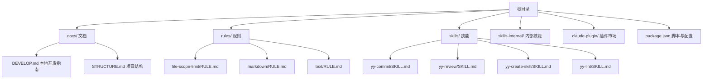
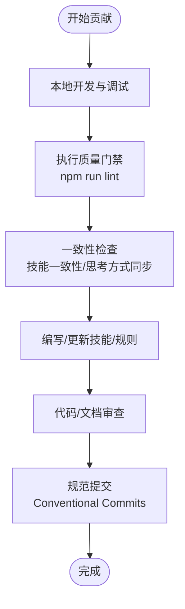
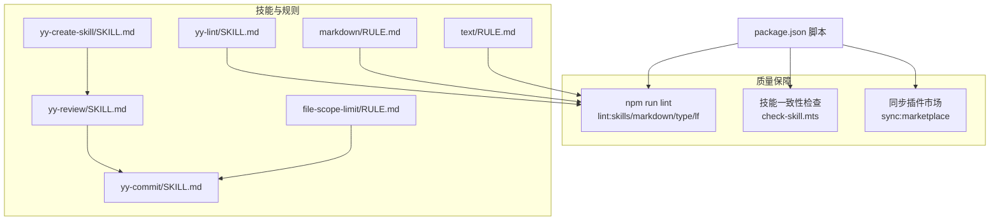

# 贡献流程

<cite>
**本文引用的文件**
- [README.md](file://README.md)
- [AGENTS.md](file://AGENTS.md)
- [DEVELOP.md](file://docs/DEVELOP.md)
- [STRUCTURE.md](file://docs/STRUCTURE.md)
- [CLAUDE_CODE_SKILL.md](file://docs/CLAUDE_CODE_SKILL.md)
- [package.json](file://package.json)
- [.gitignore](file://.gitignore)
- [yy-commit/SKILL.md](file://skills/yy-commit/SKILL.md)
- [yy-review/SKILL.md](file://skills/yy-review/SKILL.md)
- [yy-create-skill/SKILL.md](file://skills/yy-create-skill/SKILL.md)
- [yy-lint/SKILL.md](file://skills/yy-lint/SKILL.md)
- [file-scope-limit/RULE.md](file://rules/file-scope-limit/RULE.md)
- [markdown/RULE.md](file://rules/markdown/RULE.md)
- [text/RULE.md](file://rules/text/RULE.md)
- [check-skill.mts](file://build/check-skill.mts)
</cite>

## 目录
1. [简介](#简介)
2. [项目结构](#项目结构)
3. [核心角色与职责](#核心角色与职责)
4. [贡献流程总览](#贡献流程总览)
5. [详细流程说明](#详细流程说明)
6. [架构与依赖关系](#架构与依赖关系)
7. [性能与质量保障](#性能与质量保障)
8. [故障排查指南](#故障排查指南)
9. [结语](#结语)
10. [附录](#附录)

## 简介
本仓库维护实用的规则与 AI 技能，面向技能开发者、代码贡献者与文档维护者三类角色，提供从需求分析、设计讨论、实现开发到测试验证的全流程指导。项目强调规范化、可审计与可复用，通过内置技能与规则体系保障质量与一致性。

## 项目结构
项目采用“技能 + 规则 + 文档”的组织方式，核心目录与职责如下：
- skills/：公共技能集合，每个技能为独立的 SKILL.md，可被外部平台加载复用
- skills-internal/：内部技能，用于维护本仓库自身
- rules/：规则集，覆盖文件修改范围、Markdown 书写、文本表达等
- docs/：项目文档，包括开发指南、结构说明、安装与使用说明
- .claude-plugin/：插件市场配置目录
- 根目录脚本与配置：package.json、.gitignore、AGENTS.md 等

图表来源
- [STRUCTURE.md:1-10](file://docs/STRUCTURE.md#L1-L10)
- [README.md:1-104](file://README.md#L1-L104)

章节来源
- [STRUCTURE.md:1-10](file://docs/STRUCTURE.md#L1-L10)
- [README.md:1-104](file://README.md#L1-L104)

## 核心角色与职责
- 技能开发者：负责设计与实现技能，遵循 AGENTS.md 的交付规范与质量门禁，确保技能可复用、可审计、可测试。
- 代码贡献者：负责规则与脚本的维护，遵循提交规范与代码审查流程，保证变更可控、可追踪。
- 文档维护者：负责规则与文档的编写与更新，遵循 Markdown 与文本表达规范，确保一致性与可读性。

章节来源
- [AGENTS.md:1-155](file://AGENTS.md#L1-L155)
- [README.md:32-90](file://README.md#L32-L90)

## 贡献流程总览
贡献流程围绕“质量门禁 + 规范化交付 + 可审计变更”展开，关键节点包括：
- 本地开发与调试：使用本地安装命令调试 skills 目录下的技能
- 质量门禁：执行 lint、一致性检查与 AI 思考方式同步
- 规范化交付：技能与规则遵循统一的模板与格式
- 变更审计：通过提交信息、变更范围与评审流程确保可追溯

图表来源
- [DEVELOP.md:1-18](file://docs/DEVELOP.md#L1-L18)
- [AGENTS.md:11-17](file://AGENTS.md#L11-L17)
- [yy-commit/SKILL.md:75-118](file://skills/yy-commit/SKILL.md#L75-L118)

章节来源
- [DEVELOP.md:1-18](file://docs/DEVELOP.md#L1-L18)
- [AGENTS.md:11-17](file://AGENTS.md#L11-L17)

## 详细流程说明

### 需求分析与设计讨论
- 明确目标：确定是创建新技能、更新现有技能，还是维护规则与文档
- 设计边界：在 AGENTS.md 的“智能体重要提示”与“需要遵守的规则”中明确约束
- 决策显式化：将隐含分支转化为明确规则，避免模糊表述
- 评审准备：在设计阶段准备好评审清单与验收标准

章节来源
- [AGENTS.md:123-149](file://AGENTS.md#L123-L149)

### 实现开发
- 技能开发：使用 yy-create-skill 技能生成规范的 SKILL.md，遵循模板与命名规范
- 规则开发：基于 file-scope-limit、markdown、text 等规则，确保变更在授权范围内并符合表达规范
- 脚本与依赖：如需脚本，按 package.json 的脚本约定组织，避免破坏现有依赖

章节来源
- [yy-create-skill/SKILL.md:34-177](file://skills/yy-create-skill/SKILL.md#L34-L177)
- [file-scope-limit/RULE.md:1-138](file://rules/file-scope-limit/RULE.md#L1-L138)
- [markdown/RULE.md:1-79](file://rules/markdown/RULE.md#L1-L79)
- [text/RULE.md:1-90](file://rules/text/RULE.md#L1-L90)

### 测试验证
- 本地测试：在本地环境中测试技能调用与输出，确保符合预期
- 代码检查：使用 yy-lint 技能执行 lint 检查，自动修复报错，保留警告供人工评估
- 一致性检查：使用内置脚本与技能进行一致性校验，确保 metadata 与 SKILL.md 一致

章节来源
- [yy-lint/SKILL.md:1-88](file://skills/yy-lint/SKILL.md#L1-L88)
- [check-skill.mts:1-230](file://build/check-skill.mts#L1-L230)

### 提交与合并
- 提交信息：遵循 Conventional Commits 规范，必要时在标题后添加正文说明具体改动点
- 变更范围：严格遵守 file-scope-limit 规则，非授权范围内的文件需获得明确授权
- 合并前审查：通过 yy-review 技能进行代码/逻辑/安全/最佳实践检查，确保无严重或中等问题

章节来源
- [yy-commit/SKILL.md:75-118](file://skills/yy-commit/SKILL.md#L75-L118)
- [file-scope-limit/RULE.md:1-138](file://rules/file-scope-limit/RULE.md#L1-L138)
- [yy-review/SKILL.md:1-131](file://skills/yy-review/SKILL.md#L1-L131)

### 发布与版本管理
- 版本标记：遵循语义化版本管理，结合变更类型（feat/fix/refactor/chore 等）决定主/次/补丁版本
- 变更通知：在提交信息与 PR 描述中说明变更动机、影响范围与迁移指引
- 向后兼容：在规则与技能设计中尽量保持向后兼容，必要时提供迁移方案

章节来源
- [yy-commit/SKILL.md:81-91](file://skills/yy-commit/SKILL.md#L81-L91)

### 社区参与
- 问题报告：在 GitHub Issues 中描述问题现象、复现步骤与期望结果
- 功能请求：在 Issues 中清晰描述需求背景、使用场景与验收标准
- 讨论参与：在 PR 与 Issues 中积极回应反馈，配合审查与修改

章节来源
- [README.md:91-104](file://README.md#L91-L104)

## 架构与依赖关系
项目通过技能、规则与文档形成闭环的质量保障体系，脚本与配置支撑自动化检查与同步。

图表来源
- [package.json:7-16](file://package.json#L7-L16)
- [check-skill.mts:1-230](file://build/check-skill.mts#L1-L230)
- [yy-create-skill/SKILL.md:1-213](file://skills/yy-create-skill/SKILL.md#L1-L213)
- [yy-review/SKILL.md:1-131](file://skills/yy-review/SKILL.md#L1-L131)
- [yy-commit/SKILL.md:1-251](file://skills/yy-commit/SKILL.md#L1-L251)
- [yy-lint/SKILL.md:1-88](file://skills/yy-lint/SKILL.md#L1-L88)
- [file-scope-limit/RULE.md:1-138](file://rules/file-scope-limit/RULE.md#L1-L138)
- [markdown/RULE.md:1-79](file://rules/markdown/RULE.md#L1-L79)
- [text/RULE.md:1-90](file://rules/text/RULE.md#L1-L90)

章节来源
- [package.json:7-16](file://package.json#L7-L16)

## 性能与质量保障
- 自动化检查：通过 npm 脚本统一执行 lint、类型检查、换行符转换与市场同步，减少人工负担
- 一致性校验：使用脚本对 SKILL.md 与 metadata.json 进行一致性检查，避免脱节
- 本地调试：提供本地安装命令与忽略文件清单，便于快速迭代与验证

章节来源
- [package.json:7-16](file://package.json#L7-L16)
- [check-skill.mts:1-230](file://build/check-skill.mts#L1-L230)
- [DEVELOP.md:1-18](file://docs/DEVELOP.md#L1-L18)
- [.gitignore:151-162](file://.gitignore#L151-L162)

## 故障排查指南
- 本地调试文件未提交：确保本地调试生成的文件在 .gitignore 中已忽略，避免误提交
- 提交失败或被拒绝：检查提交信息格式、变更范围与审查结果，按要求修正后重试
- 规则不一致：根据一致性检查脚本的输出，同步 metadata.json 与 SKILL.md 的字段
- 插件市场异常：检查 marketplace.json 的生成与同步脚本是否正常执行

章节来源
- [.gitignore:151-162](file://.gitignore#L151-L162)
- [check-skill.mts:127-172](file://build/check-skill.mts#L127-L172)
- [AGENTS.md:125-128](file://AGENTS.md#L125-L128)

## 结语
本贡献流程以“规范化、可审计、可复用”为核心，通过技能、规则与文档的协同，确保贡献过程高效、透明且可持续。欢迎社区成员按照本文档参与贡献，共同提升项目的质量与影响力。

## 附录

### 提交信息规范速查
- 类型：feat/fix/docs/style/refactor/perf/test/chore/revert
- Scope：优先使用具体模块/组件名
- 描述：中文、祈使语气、不超过 50 字、说明“为什么”或“为了解决什么问题”
- 正文：当改动较多时，以列表形式说明具体改动点

章节来源
- [yy-commit/SKILL.md:75-118](file://skills/yy-commit/SKILL.md#L75-L118)

### 代码审查清单速查
- 语法错误：未闭合标签、未定义变量、语法结构错误
- 逻辑错误：空指针引用、数组越界、逻辑判断错误
- 安全漏洞：XSS、敏感信息泄露、SQL 注入风险
- 最佳实践：调试代码、硬编码敏感信息、不必要的注释或死代码

章节来源
- [yy-review/SKILL.md:44-84](file://skills/yy-review/SKILL.md#L44-L84)

### 安装与使用速查
- 在 Claude Code 中安装技能：通过插件市场添加仓库并选择技能
- 本地调试技能：在根目录执行本地安装命令

章节来源
- [CLAUDE_CODE_SKILL.md:1-10](file://docs/CLAUDE_CODE_SKILL.md#L1-L10)
- [DEVELOP.md:8-12](file://docs/DEVELOP.md#L8-L12)