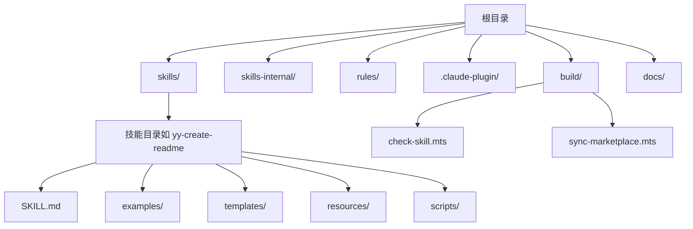
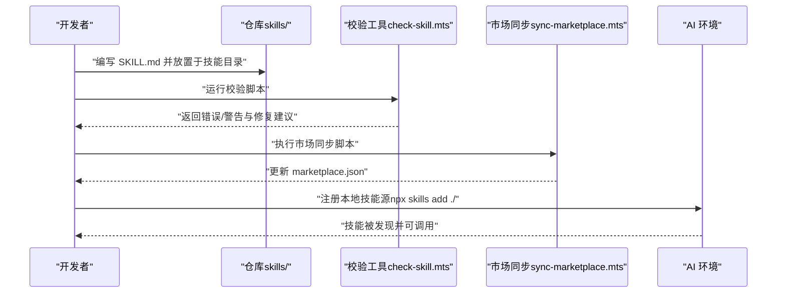
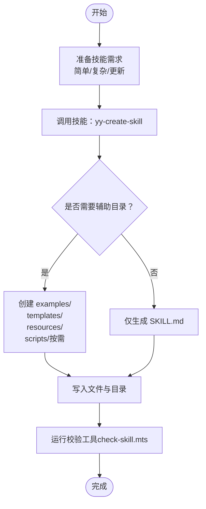
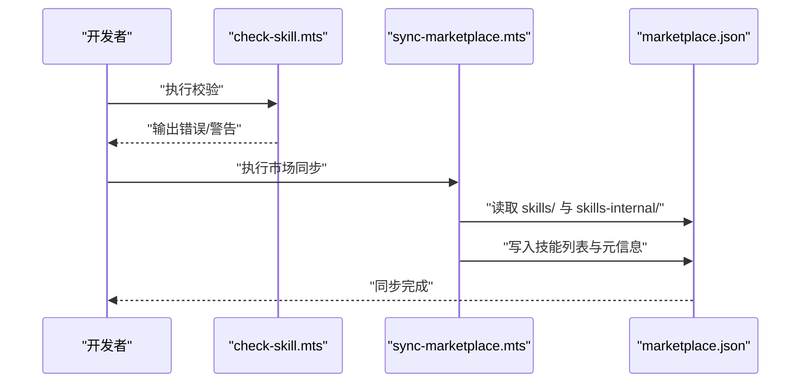

# 快速开始

<cite>
**本文引用的文件**
- [package.json](file://package.json)
- [tsconfig.json](file://tsconfig.json)
- [DEVELOP.md](file://docs/DEVELOP.md)
- [STRUCTURE.md](file://docs/STRUCTURE.md)
- [yy-create-skill/SKILL.md](file://skills/yy-create-skill/SKILL.md)
- [yy-create-skill/templates/skill-template.md](file://skills/yy-create-skill/templates/skill-template.md)
- [yy-create-skill/examples/input.md](file://skills/yy-create-skill/examples/input.md)
- [yy-create-skill/examples/output.md](file://skills/yy-create-skill/examples/output.md)
- [yy-create-readme/SKILL.md](file://skills/yy-create-readme/SKILL.md)
- [yy-lint/SKILL.md](file://skills/yy-lint/SKILL.md)
- [check-skill.mts](file://build/check-skill.mts)
- [sync-marketplace.mts](file://build/sync-marketplace.mts)
- [yy-post-to-wechat/scripts/package.json](file://skills/yy-post-to-wechat/scripts/package.json)
- [yy-post-to-wechat/scripts/tsconfig.json](file://skills/yy-post-to-wechat/scripts/tsconfig.json)
</cite>

## 目录
1. [简介](#简介)
2. [项目结构](#项目结构)
3. [核心组件](#核心组件)
4. [架构总览](#架构总览)
5. [详细组件分析](#详细组件分析)
6. [依赖分析](#依赖分析)
7. [性能考虑](#性能考虑)
8. [故障排除指南](#故障排除指南)
9. [结论](#结论)
10. [附录](#附录)

## 简介
本指南面向首次接触 AI 技能开发的新用户，目标是帮助你在最短时间内完成环境准备、安装依赖、创建第一个“Hello World”级别的技能，并理解技能文件的基本结构与规范。你将学会：
- 如何搭建本地开发环境（Node.js、TypeScript、常用工具）
- 如何安装并注册技能源，使本地技能可在 AI 环境中被发现与调用
- 如何使用内置的“创建技能”技能来生成符合规范的技能文件
- 如何编写最小可用的 SKILL.md 文件，包含 YAML frontmatter、描述、使用场景与指令
- 如何通过内置校验与市场同步工具保证技能质量与发布一致性
- 常见初始化错误与解决方案

## 项目结构
该项目采用“技能仓库 + 规则与工具”的组织方式，核心目录与职责如下：
- skills/：公共技能集合，每个子目录代表一个技能，包含 SKILL.md 与可选的 examples/templates/resources/scripts 等
- skills-internal/：内部私有技能集合，用于维护仓库自身
- rules/：自定义规则与参考文档，支撑技能编写与评审
- .claude-plugin/marketplace.json：技能市场配置，定义插件与技能分组
- build/：开发期校验与同步脚本，如技能元数据校验、市场清单同步
- docs/：开发与结构文档，如本地开发指南、项目结构说明
- 根目录 package.json、tsconfig.json：项目脚本与 TypeScript 编译配置

图表来源
- [STRUCTURE.md:1-10](file://docs/STRUCTURE.md#L1-L10)
- [yy-create-readme/SKILL.md:1-120](file://skills/yy-create-readme/SKILL.md#L1-L120)

章节来源
- [STRUCTURE.md:1-10](file://docs/STRUCTURE.md#L1-L10)

## 核心组件
- 技能文件 SKILL.md：技能的“任务说明书”，包含 YAML frontmatter、描述、使用场景、指令、相关资源等章节
- 创建技能技能（yy-create-skill）：帮助你自动生成符合规范的技能目录与文件，减少手工编写成本
- 校验工具（check-skill.mts）：检查 SKILL.md 的格式、必需字段、与 metadata.json 的一致性
- 市场同步工具（sync-marketplace.mts）：将 skills 与 skills-internal 目录中的技能同步到 marketplace.json，便于在市场中展示
- TypeScript 配置与脚本：统一编译目标、模块系统与开发脚本，确保工具链一致

章节来源
- [yy-create-skill/SKILL.md:1-213](file://skills/yy-create-skill/SKILL.md#L1-L213)
- [check-skill.mts:1-230](file://build/check-skill.mts#L1-L230)
- [sync-marketplace.mts:1-93](file://build/sync-marketplace.mts#L1-L93)
- [tsconfig.json:1-24](file://tsconfig.json#L1-L24)
- [package.json:1-46](file://package.json#L1-L46)

## 架构总览
下面的图展示了“从本地开发到技能可用”的整体流程：开发者在本地编写 SKILL.md 并通过校验，然后将技能注册到 AI 环境，最终由市场同步工具维护技能清单。

图表来源
- [check-skill.mts:177-229](file://build/check-skill.mts#L177-L229)
- [sync-marketplace.mts:12-92](file://build/sync-marketplace.mts#L12-L92)
- [DEVELOP.md:8-17](file://docs/DEVELOP.md#L8-L17)

## 详细组件分析

### 环境搭建与依赖安装
- Node.js 与包管理器
  - 推荐使用 Node.js 22+（部分脚本与示例脚本要求较新的运行时）
  - 使用 npm 作为包管理器，确保与脚本兼容
- TypeScript
  - 项目使用 ES2022 目标与模块系统，严格模式可按需开启
  - 根目录 tsconfig.json 为工具脚本提供统一编译配置
- 依赖安装
  - 安装根目录依赖（lint、类型检查、markdown 工具等）
  - 对于需要可执行脚本的技能（如 yy-post-to-wechat/scripts），其子目录有独立的 package.json 与 tsconfig.json，按需安装与编译

章节来源
- [package.json:1-46](file://package.json#L1-L46)
- [tsconfig.json:1-24](file://tsconfig.json#L1-L24)
- [yy-post-to-wechat/scripts/package.json:1-29](file://skills/yy-post-to-wechat/scripts/package.json#L1-L29)
- [yy-post-to-wechat/scripts/tsconfig.json:1-21](file://skills/yy-post-to-wechat/scripts/tsconfig.json#L1-L21)

### 注册本地技能源
- 在项目根目录执行技能注册命令，即可将本地 skills 目录加入 AI 环境的技能源
- 本地调试会生成临时文件（如 .agents/skills/、skills-lock.json），已在 .gitignore 中忽略，无需提交

章节来源
- [DEVELOP.md:8-17](file://docs/DEVELOP.md#L8-L17)

### 技能文件结构与必需元素
- YAML frontmatter
  - 必须以三连字符开头与结尾
  - 必备字段：name、description（description 使用折叠式语法）
  - 不得包含其他字段（如 version、author、tags 等）
- 标题与章节
  - 标题：# 技能名称
  - 必需章节：描述、使用场景、指令、相关资源
- 指令
  - 清晰的分步说明，最后一步描述输出格式
  - 明确触发条件与边界，避免模糊表述
- 目录结构
  - 最小结构：SKILL.md
  - 可选结构：scripts/、examples/、templates/、resources/

章节来源
- [yy-create-skill/SKILL.md:99-176](file://skills/yy-create-skill/SKILL.md#L99-L176)
- [yy-create-skill/templates/skill-template.md:9-36](file://skills/yy-create-skill/templates/skill-template.md#L9-L36)

### 使用“创建技能”技能生成你的第一个技能
- 目标：通过内置技能 yy-create-skill，快速生成符合规范的技能文件与目录
- 输入示例：参考 examples/input.md 中的多种请求示例，涵盖简单技能、带模板技能、更新现有技能、复杂技能等
- 输出示例：参考 examples/output.md，了解生成的目录结构与 SKILL.md 内容摘要
- 模板参考：使用 skill-template.md 作为基础结构模板

图表来源
- [yy-create-skill/SKILL.md:34-176](file://skills/yy-create-skill/SKILL.md#L34-L176)
- [yy-create-skill/examples/input.md:1-41](file://skills/yy-create-skill/examples/input.md#L1-L41)
- [yy-create-skill/examples/output.md:1-194](file://skills/yy-create-skill/examples/output.md#L1-L194)
- [yy-create-skill/templates/skill-template.md:1-37](file://skills/yy-create-skill/templates/skill-template.md#L1-L37)

章节来源
- [yy-create-skill/SKILL.md:1-213](file://skills/yy-create-skill/SKILL.md#L1-L213)
- [yy-create-skill/examples/input.md:1-41](file://skills/yy-create-skill/examples/input.md#L1-L41)
- [yy-create-skill/examples/output.md:1-194](file://skills/yy-create-skill/examples/output.md#L1-L194)
- [yy-create-skill/templates/skill-template.md:1-37](file://skills/yy-create-skill/templates/skill-template.md#L1-L37)

### Hello World 级别技能示例
- 参考“创建技能”输出示例中的“简单技能输出”，你可以快速获得一个最小可用的技能目录结构与 SKILL.md 内容
- 该示例展示了：
  - 目录结构（仅 SKILL.md）
  - YAML frontmatter 的 name 与 description
  - 描述、使用场景、指令与相关资源章节
- 你可以在此基础上扩展：添加 examples/、templates/、scripts/ 等目录，逐步完善技能能力

章节来源
- [yy-create-skill/examples/output.md:5-52](file://skills/yy-create-skill/examples/output.md#L5-L52)

### 校验与发布准备
- 校验工具（check-skill.mts）
  - 检查 SKILL.md 是否存在、是否为空、frontmatter 格式是否正确
  - 校验 name 与目录名是否一致
  - 对比 metadata.json（如存在）与 SKILL.md 的一致性（abstract、author、version）
- 市场同步工具（sync-marketplace.mts）
  - 从 skills 与 skills-internal 目录读取技能清单，过滤空目录并排序
  - 将技能列表分别写入 marketplace.json 的不同插件分组
  - 同步 package.json 中的 name、version、description、author 到 marketplace.json

图表来源
- [check-skill.mts:50-122](file://build/check-skill.mts#L50-L122)
- [check-skill.mts:127-172](file://build/check-skill.mts#L127-L172)
- [sync-marketplace.mts:31-83](file://build/sync-marketplace.mts#L31-L83)

章节来源
- [check-skill.mts:1-230](file://build/check-skill.mts#L1-L230)
- [sync-marketplace.mts:1-93](file://build/sync-marketplace.mts#L1-L93)

## 依赖分析
- 脚本与工具
  - package.json 中定义了 lint、check:type、sync:marketplace 等脚本，统一开发与发布流程
  - TypeScript 配置在根目录与子脚本目录分别提供，确保工具与业务代码的编译一致性
- 外部依赖
  - js-yaml 用于解析 YAML frontmatter
  - front-matter、marked 用于文档处理
  - markdownlint-cli 用于 Markdown 规范检查

章节来源
- [package.json:7-16](file://package.json#L7-L16)
- [tsconfig.json:1-24](file://tsconfig.json#L1-L24)
- [yy-post-to-wechat/scripts/package.json:16-27](file://skills/yy-post-to-wechat/scripts/package.json#L16-L27)

## 性能考虑
- 校验与同步脚本均采用文件系统遍历与 JSON/YAML 解析，建议在本地开发时仅对必要目录执行
- 对于大型技能目录，建议先在子目录内进行迭代，再统一执行市场同步
- TypeScript 编译目标为 ES2022，确保与现代 Node.js 运行时兼容，减少运行时转换开销

## 故障排除指南
- SKILL.md 不存在或为空
  - 症状：校验工具报告文件不存在或内容为空
  - 处理：确保 SKILL.md 存在且包含有效内容
- YAML frontmatter 格式错误
  - 症状：缺少起止三连字符、格式不合法
  - 处理：修正 frontmatter，确保以三连字符包裹并使用折叠式 description
- name 与目录名不匹配
  - 症状：校验工具提示 name 与目录名不一致
  - 处理：保持 SKILL.md 中的 name 与技能目录名一致
- metadata.json 不一致
  - 症状：校验工具提示 abstract/author/version 与 SKILL.md 不一致
  - 处理：根据建议更新 metadata.json，使其与 SKILL.md 保持一致
- 本地技能未被 AI 发现
  - 症状：调用技能时报未找到
  - 处理：执行技能注册命令，确保本地目录已被加入技能源；确认 .agents/skills/ 与 skills-lock.json 未被提交
- 市场同步失败或技能未出现在市场
  - 症状：marketplace.json 未更新或技能未在对应分组中
  - 处理：执行市场同步脚本，检查 skills 与 skills-internal 目录是否包含有效子目录；确认 package.json 元信息正确

章节来源
- [check-skill.mts:58-121](file://build/check-skill.mts#L58-L121)
- [check-skill.mts:127-172](file://build/check-skill.mts#L127-L172)
- [DEVELOP.md:14-17](file://docs/DEVELOP.md#L14-L17)
- [sync-marketplace.mts:31-83](file://build/sync-marketplace.mts#L31-L83)

## 结论
通过本指南，你已经完成了环境准备、依赖安装、技能注册与第一个技能的创建。建议你：
- 以“创建技能”技能为入口，快速生成符合规范的 SKILL.md
- 使用校验工具与市场同步工具保障质量与一致性
- 逐步扩展 examples/templates/resources/scripts 等辅助目录，完善技能能力
- 参考现有技能（如 yy-create-readme、yy-lint）学习最佳实践

## 附录

### 快速开始清单
- 安装 Node.js 22+ 与 npm
- 在项目根目录安装依赖
- 在根目录执行技能注册命令，将本地技能加入 AI 环境
- 使用“创建技能”技能生成你的第一个 SKILL.md
- 运行校验工具，修复错误与警告
- 执行市场同步脚本，更新 marketplace.json
- 在 AI 环境中调用你的技能，验证效果

章节来源
- [DEVELOP.md:8-17](file://docs/DEVELOP.md#L8-L17)
- [yy-create-skill/SKILL.md:1-213](file://skills/yy-create-skill/SKILL.md#L1-L213)
- [check-skill.mts:177-229](file://build/check-skill.mts#L177-L229)
- [sync-marketplace.mts:85-92](file://build/sync-marketplace.mts#L85-L92)