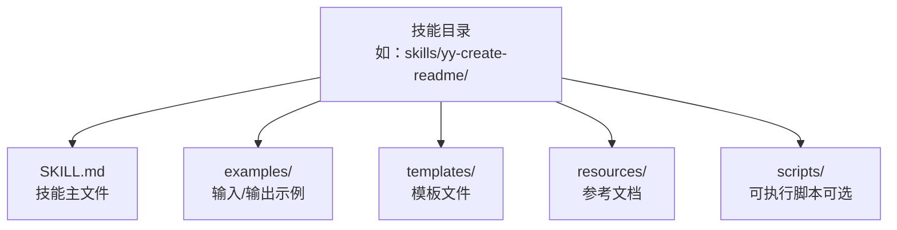
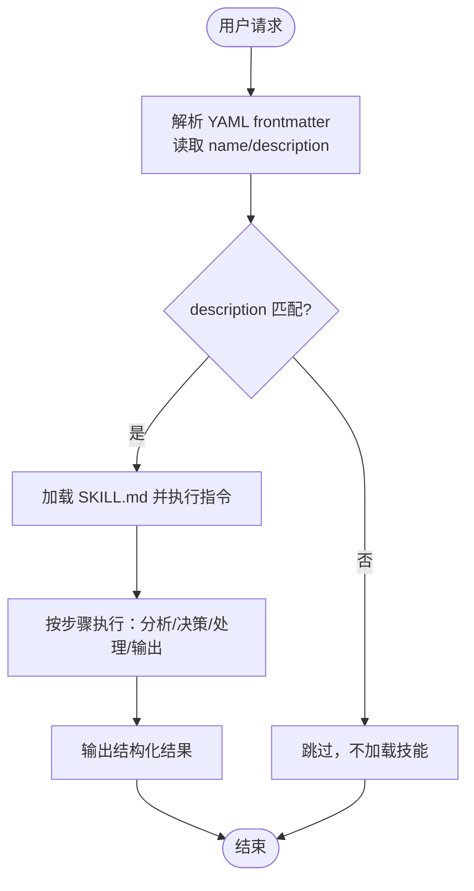
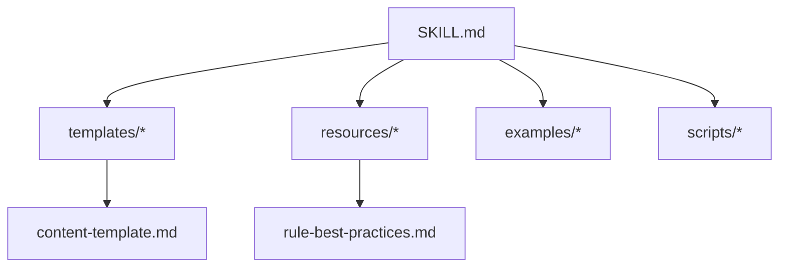

# SKILL.md 文件格式

<cite>
**本文引用的文件**
- [yy-create-readme/SKILL.md](file://skills/yy-create-readme/SKILL.md)
- [yy-create-report/SKILL.md](file://skills/yy-create-report/SKILL.md)
- [yy-create-rule/SKILL.md](file://skills/yy-create-rule/SKILL.md)
- [yy-create-skill/SKILL.md](file://skills/yy-create-skill/SKILL.md)
- [yy-handoff/SKILL.md](file://skills/yy-handoff/SKILL.md)
- [yy-comment/SKILL.md](file://skills/yy-comment/SKILL.md)
- [yy-lint/SKILL.md](file://skills/yy-lint/SKILL.md)
- [yy-mode-spec/SKILL.md](file://skills/yy-mode-spec/SKILL.md)
- [skill-guide.md](file://skills/yy-create-skill/resources/skill-guide.md)
- [skill-template.md](file://skills/yy-create-skill/templates/skill-template.md)
- [content-template.md](file://skills/yy-create-rule/resources/content-template.md)
- [rule-best-practices.md](file://skills/yy-create-rule/resources/rule-best-practices.md)
</cite>

## 目录
1. [简介](#简介)
2. [项目结构](#项目结构)
3. [核心组件](#核心组件)
4. [架构总览](#架构总览)
5. [详细组件分析](#详细组件分析)
6. [依赖分析](#依赖分析)
7. [性能考量](#性能考量)
8. [故障排查指南](#故障排查指南)
9. [结论](#结论)
10. [附录](#附录)

## 简介
本文件为 SKILL.md 文件格式的权威技术文档，面向开发者与 AI 助手协作场景，系统阐述 YAML frontmatter 标准、章节结构、写作规范、字段参考、格式示例与验证规则。通过对仓库中多个真实 SKILL.md 示例的归纳总结，提炼出统一的编写与校验标准，帮助快速掌握并正确落地 SKILL.md 格式。

## 项目结构
SKILL.md 是“可按需加载的任务说明书”，通常位于技能目录根部，配合 examples/、templates/、resources/、scripts/ 等辅助目录使用。目录结构与命名规范详见“目录结构规范”与“命名规范”。

图表来源
- [skill-guide.md: 目录结构规范:167-191](file://skills/yy-create-skill/resources/skill-guide.md#L167-L191)

章节来源
- [skill-guide.md: 目录结构规范:167-191](file://skills/yy-create-skill/resources/skill-guide.md#L167-L191)

## 核心组件
SKILL.md 的核心由 YAML frontmatter 与正文章节构成，二者共同决定技能的触发、边界与可执行性。

- YAML frontmatter
  - name：技能名称，用于识别与展示
  - description：技能用途与触发条件，AI 依据此字段判断是否加载该技能
  - 严格限制：仅允许上述两个字段，禁止添加其他字段（如 version、author、tags 等）

- 正文章节
  - 描述：1-2 句话说明技能核心作用
  - 使用场景：明确触发条件与不应触发场景
  - 指令：清晰的分步说明，最后一步描述输出格式
  - 相关资源：列出 examples/、templates/、resources/、scripts/ 等辅助文件

章节来源
- [yy-create-skill/SKILL.md: YAML frontmatter 字段约束:99-103](file://skills/yy-create-skill/SKILL.md#L99-L103)
- [yy-create-skill/SKILL.md: 指令章节与输出格式要求:34-129](file://skills/yy-create-skill/SKILL.md#L34-L129)
- [yy-create-readme/SKILL.md: 描述与使用场景示例:10-27](file://skills/yy-create-readme/SKILL.md#L10-L27)
- [yy-create-report/SKILL.md: 使用场景与操作步骤示例:13-83](file://skills/yy-create-report/SKILL.md#L13-L83)
- [yy-create-rule/SKILL.md: 指令与验收清单示例:29-126](file://skills/yy-create-rule/SKILL.md#L29-L126)

## 架构总览
SKILL.md 的整体架构围绕“触发—边界—执行—输出”闭环展开，AI 通过 YAML frontmatter 的 description 精确路由到合适技能，再按指令逐步执行，最终输出结构化结果。

图表来源
- [yy-create-skill/SKILL.md: 技能触发方式:265-269](file://skills/yy-create-skill/SKILL.md#L265-L269)
- [yy-create-skill/SKILL.md: 指令与输出格式:34-129](file://skills/yy-create-skill/SKILL.md#L34-L129)

## 详细组件分析

### YAML frontmatter 标准
- 字段要求
  - name：技能名称，用于识别与展示
  - description：技能用途与触发条件，AI 依据此字段判断是否加载该技能
  - 严格限制：仅允许上述两个字段，禁止添加其他字段
- 语法与折叠式写法
  - description 使用折叠式（>）写法，换行符转为空格，避免行内长描述导致解析错误
  - 使用保留式（|）处理代码块或列表时保留换行
- 示例与错误对比
  - 正确示例：见多个 SKILL.md 的 YAML frontmatter
  - 错误示例：在同一行写长描述、添加未允许字段、未使用折叠式语法

章节来源
- [yy-create-skill/SKILL.md: YAML frontmatter 字段约束:99-103](file://skills/yy-create-skill/SKILL.md#L99-L103)
- [skill-guide.md: YAML Frontmatter 规则:7-26](file://skills/yy-create-skill/resources/skill-guide.md#L7-L26)

### 正文章节结构与写作规范
- 描述
  - 1-2 句话说明技能核心作用，帮助 AI 理解用途
  - 与 description 协同，避免重复与冗余
- 使用场景
  - 明确“应该触发”的典型场景与“不应触发”的典型场景
  - 帮助 AI 理解技能边界，减少误触发
- 指令
  - 清晰的分步说明，每一步描述具体操作
  - 最后一步描述输出格式，便于 AI 知道最终产物形态
  - 决策点显式化：将隐含分支转化为明确规则，避免“根据情况处理”等模糊表述
- 相关资源
  - 列出 examples/、templates/、resources/、scripts/ 等辅助文件，便于 AI 与用户查阅

章节来源
- [yy-create-readme/SKILL.md: 描述与使用场景:10-27](file://skills/yy-create-readme/SKILL.md#L10-L27)
- [yy-create-report/SKILL.md: 使用场景与操作步骤:13-83](file://skills/yy-create-report/SKILL.md#L13-L83)
- [yy-create-rule/SKILL.md: 指令与验收清单:29-126](file://skills/yy-create-rule/SKILL.md#L29-L126)
- [yy-create-skill/SKILL.md: 指令与验收清单:34-129](file://skills/yy-create-skill/SKILL.md#L34-L129)
- [skill-guide.md: 指令与决策点显式化:63-125](file://skills/yy-create-skill/resources/skill-guide.md#L63-L125)

### 指令步骤编号与层级规范
- 步骤编号
  - 使用“步骤 N：标题”的格式，如“步骤 1：分析项目结构”
  - 保持连续编号，避免跳跃
- 层级结构
  - 使用 Markdown 标题层级，建议不超过三级
  - 子步骤可用有序列表或无序列表，保持清晰
- 输出格式
  - 最后一步明确输出格式，如“输出结构化工作报告”、“生成 README.md 文件应包含...”

章节来源
- [yy-create-readme/SKILL.md: 指令步骤编号与层级:30-87](file://skills/yy-create-readme/SKILL.md#L30-L87)
- [yy-create-report/SKILL.md: 操作步骤编号与输出示例:26-111](file://skills/yy-create-report/SKILL.md#L26-L111)
- [yy-create-rule/SKILL.md: 指令与输出:77-104](file://skills/yy-create-rule/SKILL.md#L77-L104)

### description 的折叠式语法与约束
- 折叠式语法（>）
  - 适合长段落描述，换行符转为空格
  - 禁止在同一行写长描述
- 保留式语法（|）
  - 适合代码块或列表，保留换行
- 约束
  - description 仅用于触发判断，不写实现方式
  - 控制在 2-3 句话内，避免堆叠步骤、规则、例外和实现细节
  - 具体约束写在正文，如使用场景、指令、示例

章节来源
- [skill-guide.md: description 编写约束:27-44](file://skills/yy-create-skill/resources/skill-guide.md#L27-L44)
- [yy-create-skill/SKILL.md: description 编写约束:90-98](file://skills/yy-create-skill/SKILL.md#L90-L98)

### 目录结构规范与命名规范
- 目录结构
  - 必需：SKILL.md
  - 可选：scripts/、examples/、templates/、resources/
- 命名规范
  - 技能目录使用 kebab-case（如 yy-create-readme）
  - 脚本文件使用 kebab-case（如 wechat-api.ts）
  - 依赖配置放在 scripts/package.json
- 辅助目录创建条件
  - scripts/：技能需要可执行脚本，或用户明确要求
  - templates/：生成的模板内容超过 20 行（计数规则：不含空行、代码块围栏标记行、YAML frontmatter 行）
  - resources/：需要独立参考文档，且内容不适合放在 SKILL.md 正文
  - examples/：用户明确要求提供示例

章节来源
- [skill-guide.md: 目录结构规范:167-191](file://skills/yy-create-skill/resources/skill-guide.md#L167-L191)
- [yy-create-skill/SKILL.md: 默认策略与辅助目录创建条件:84-89](file://skills/yy-create-skill/SKILL.md#L84-L89)

### 决策点显式化原则
- 将隐含分支转化为明确规则，避免“根据情况处理”、“视情况而定”等模糊表述
- 使用表格或列表格式呈现决策逻辑
- 示例格式见“决策分支”与“表格格式”

章节来源
- [skill-guide.md: 决策点显式化:78-125](file://skills/yy-create-skill/resources/skill-guide.md#L78-L125)
- [yy-create-report/SKILL.md: 决策分支示例:38-42](file://skills/yy-create-report/SKILL.md#L38-L42)

### 安全边界与禁止行为
- 涉及敏感操作的技能，必须明确禁止行为，防止越界执行
- 示例：禁止编译、构建、部署命令；禁止删除文件命令；网络请求命令（除特定 API 外）

章节来源
- [yy-lint/SKILL.md: 安全边界:75-83](file://skills/yy-lint/SKILL.md#L75-L83)
- [skill-guide.md: 安全边界:151-166](file://skills/yy-create-skill/resources/skill-guide.md#L151-L166)

### 验收清单与质量要求
- 通用检查项
  - 描述准确反映技能用途
  - description 精确，避免误触发
  - 使用场景明确（触发条件与不应触发场景）
  - 指令步骤完整可执行，最后一步描述输出格式
  - YAML 格式正确（仅 name 与 description 两字段）
  - 决策点显式化
  - 文件间一致性（SKILL.md 与辅助文件一致）
  - 安全边界明确
- 创建技能后检查项
  - 文件命名符合规范（kebab-case）
  - 使用中文描述
  - 代码示例包含语言标签
  - 未在 SKILL.md 内嵌过长模板代码（超过 20 行应移至 templates/）
  - 如有脚本文件，遵循 kebab-case 命名规范，依赖配置放在 scripts/package.json
- 更新技能后检查项
  - description 仅保留触发判断所需信息，不混入执行细节
  - 如有辅助文件，检查是否需要同步更新（引用的步骤编号、章节名称、字段名一致）

章节来源
- [yy-create-skill/SKILL.md: 验收清单:148-177](file://skills/yy-create-skill/SKILL.md#L148-L177)
- [skill-guide.md: 验收清单:356-391](file://skills/yy-create-skill/resources/skill-guide.md#L356-L391)

## 依赖分析
SKILL.md 与其他文件的依赖关系体现在“文件间一致性”与“辅助资源引用”上。

图表来源
- [yy-create-rule/SKILL.md: 相关资源引用:127-133](file://skills/yy-create-rule/SKILL.md#L127-L133)
- [yy-create-skill/SKILL.md: 相关资源引用:188-196](file://skills/yy-create-skill/SKILL.md#L188-L196)
- [content-template.md: 规则内容结构模板:1-122](file://skills/yy-create-rule/resources/content-template.md#L1-L122)
- [rule-best-practices.md: 规则内容编写最佳实践:1-92](file://skills/yy-create-rule/resources/rule-best-practices.md#L1-L92)

章节来源
- [yy-create-rule/SKILL.md: 相关资源:127-133](file://skills/yy-create-rule/SKILL.md#L127-L133)
- [yy-create-skill/SKILL.md: 相关资源:188-196](file://skills/yy-create-skill/SKILL.md#L188-L196)

## 性能考量
- YAML frontmatter 简洁性：description 控制在 2-3 句话内，有助于 AI 快速路由
- 步骤数量与层级：建议控制在合理范围内，避免过长的指令链影响执行效率
- 输出格式明确：最后一步描述输出格式，减少往返确认，提升执行速度
- 辅助目录创建条件：仅在必要时创建 templates/、resources/、scripts/，避免冗余文件增加解析负担

章节来源
- [skill-guide.md: 质量要求与长度控制:386-391](file://skills/yy-create-skill/resources/skill-guide.md#L386-L391)
- [yy-create-skill/SKILL.md: 默认策略与辅助目录创建条件:84-89](file://skills/yy-create-skill/SKILL.md#L84-L89)

## 故障排查指南
- 常见错误类型
  - YAML frontmatter 字段非法：添加了未允许字段（如 version、author、tags）
  - description 语法错误：在同一行写长描述、未使用折叠式语法
  - 指令不清晰：步骤模糊、缺少输出格式说明、决策点未显式化
  - 使用场景缺失：仅有“应该触发”的场景，缺少“不应触发”的场景
  - 文件间不一致：SKILL.md 与辅助文件对同一事项描述不一致
- 排查步骤
  - 检查 YAML frontmatter 是否仅包含 name 与 description，且 description 使用折叠式语法
  - 校验使用场景章节是否包含“不应触发”的场景
  - 校验指令步骤是否清晰、编号连续、最后一步描述输出格式
  - 检查辅助文件（examples/、templates/、resources/、scripts/）是否与 SKILL.md 一致
  - 对于涉及敏感操作的技能，确认安全边界是否明确

章节来源
- [yy-create-skill/SKILL.md: 验收清单与质量要求:148-177](file://skills/yy-create-skill/SKILL.md#L148-L177)
- [skill-guide.md: 常见问题与解决方案:270-355](file://skills/yy-create-skill/resources/skill-guide.md#L270-L355)

## 结论
SKILL.md 的核心在于“精确触发 + 明确边界 + 清晰指令 + 结构化输出”。通过严格的 YAML frontmatter 规范、标准化的章节结构与写作规范、以及完善的验收清单，可以显著提升 AI 对技能的理解与执行效率，降低误触发与歧义风险。建议在编写与更新 SKILL.md 时，严格遵循本文档的各项要求，并结合示例文件进行对照与校验。

## 附录

### 字段参考与格式示例
- YAML frontmatter 字段
  - name：技能名称（如 yy-create-readme）
  - description：技能用途与触发条件（使用折叠式语法）
- 正文章节
  - 描述：1-2 句话说明技能核心作用
  - 使用场景：列出“应该触发”与“不应触发”的典型场景
  - 指令：清晰的分步说明，最后一步描述输出格式
  - 相关资源：列出 examples/、templates/、resources/、scripts/ 等辅助文件

章节来源
- [yy-create-skill/SKILL.md: 模板结构:9-36](file://skills/yy-create-skill/SKILL.md#L9-L36)
- [skill-template.md: 模板结构:9-36](file://skills/yy-create-skill/templates/skill-template.md#L9-L36)

### 实际 SKILL.md 示例（路径）
- [yy-create-readme/SKILL.md](file://skills/yy-create-readme/SKILL.md)
- [yy-create-report/SKILL.md](file://skills/yy-create-report/SKILL.md)
- [yy-create-rule/SKILL.md](file://skills/yy-create-rule/SKILL.md)
- [yy-create-skill/SKILL.md](file://skills/yy-create-skill/SKILL.md)
- [yy-handoff/SKILL.md](file://skills/yy-handoff/SKILL.md)
- [yy-comment/SKILL.md](file://skills/yy-comment/SKILL.md)
- [yy-lint/SKILL.md](file://skills/yy-lint/SKILL.md)
- [yy-mode-spec/SKILL.md](file://skills/yy-mode-spec/SKILL.md)