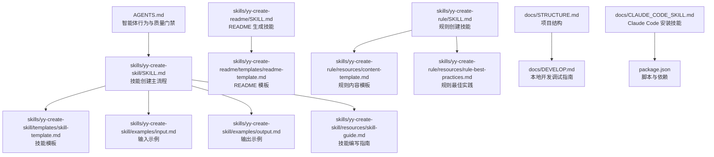
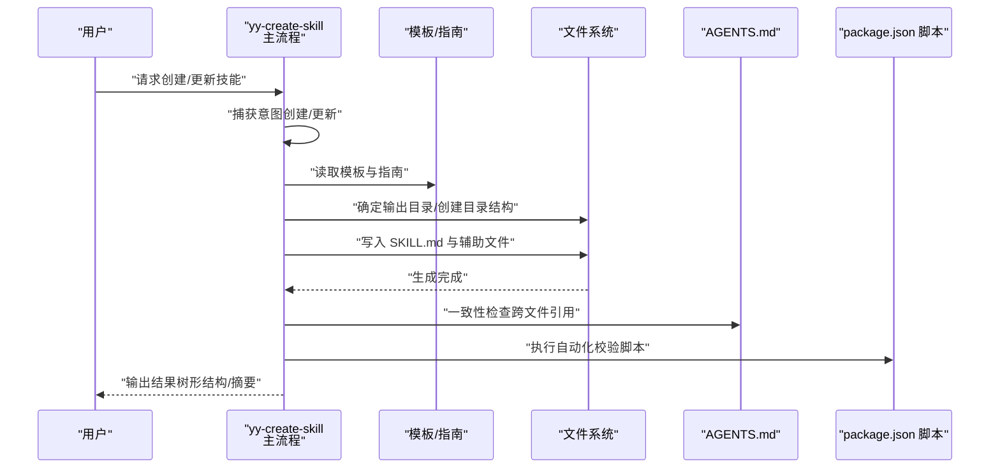
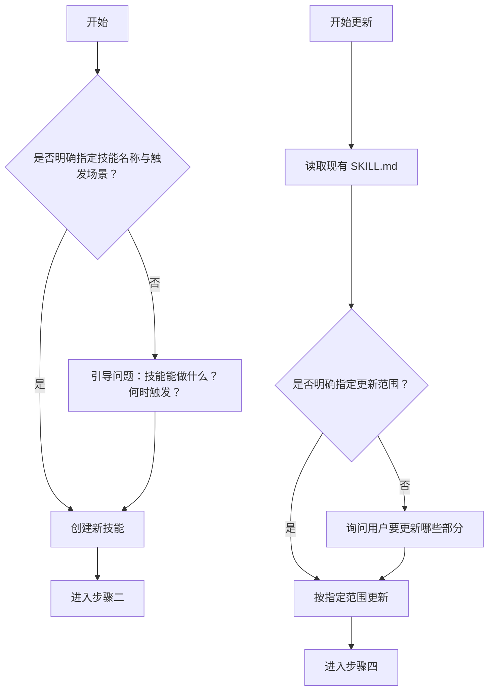
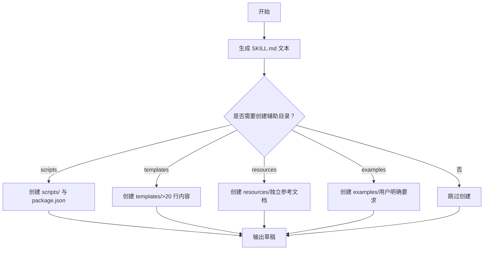
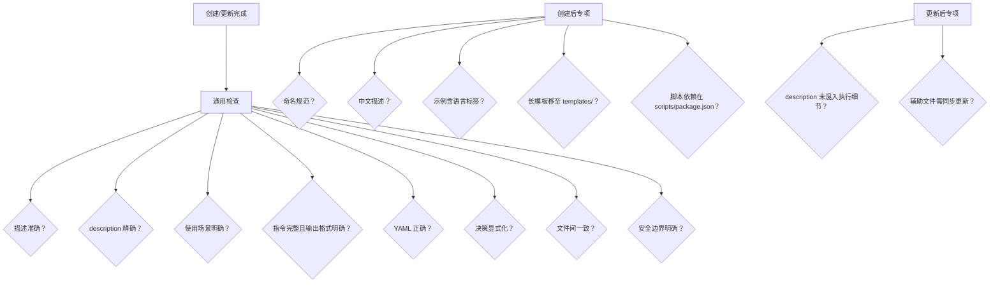
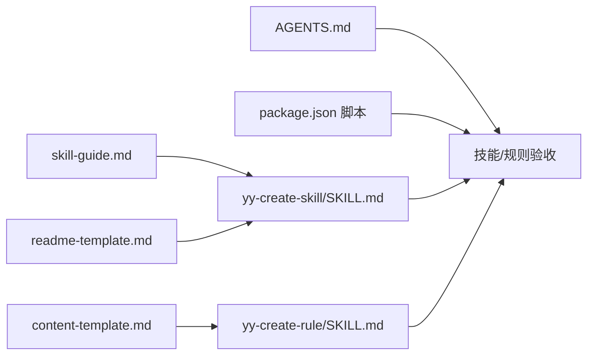

# 技能创建流程

<cite>
**本文引用的文件**
- [yy-create-skill/SKILL.md](file://skills/yy-create-skill/SKILL.md)
- [skill-template.md](file://skills/yy-create-skill/templates/skill-template.md)
- [input.md](file://skills/yy-create-skill/examples/input.md)
- [output.md](file://skills/yy-create-skill/examples/output.md)
- [skill-guide.md](file://skills/yy-create-skill/resources/skill-guide.md)
- [yy-create-readme/SKILL.md](file://skills/yy-create-readme/SKILL.md)
- [readme-template.md](file://skills/yy-create-readme/templates/readme-template.md)
- [yy-create-rule/SKILL.md](file://skills/yy-create-rule/SKILL.md)
- [content-template.md](file://skills/yy-create-rule/resources/content-template.md)
- [rule-best-practices.md](file://skills/yy-create-rule/resources/rule-best-practices.md)
- [STRUCTURE.md](file://docs/STRUCTURE.md)
- [DEVELOP.md](file://docs/DEVELOP.md)
- [CLAUDE_CODE_SKILL.md](file://docs/CLAUDE_CODE_SKILL.md)
- [AGENTS.md](file://AGENTS.md)
- [package.json](file://package.json)
</cite>

## 目录
1. [简介](#简介)
2. [项目结构](#项目结构)
3. [核心组件](#核心组件)
4. [架构总览](#架构总览)
5. [详细组件分析](#详细组件分析)
6. [依赖分析](#依赖分析)
7. [性能考量](#性能考量)
8. [故障排查指南](#故障排查指南)
9. [结论](#结论)
10. [附录](#附录)

## 简介
本指南围绕“技能创建流程”的七个核心步骤展开，结合仓库内的技能与规则文档，系统讲解从用户意图捕获到最终输出结果的全流程。同时覆盖更新现有技能的差异化处理、验收检查的自动化与人工复核要点，并提供常见问题与最佳实践建议，帮助不同背景的读者高效落地。

## 项目结构
仓库采用“技能与规则分离”的组织方式：
- skills/：公共技能集合，每个技能以独立目录存在，包含 SKILL.md 与可选的 examples/templates/resources/scripts 等子目录
- rules/：规则与参考文档，用于沉淀项目规范与最佳实践
- docs/：项目文档与安装说明
- AGENTS.md：智能体行为与质量门禁的总体规范
- package.json：项目脚本与依赖，包含技能校验、Markdown Lint、CRLF 转 LF、市场同步等

**图示来源**
- [yy-create-skill/SKILL.md:1-213](file://skills/yy-create-skill/SKILL.md#L1-L213)
- [skill-template.md:1-37](file://skills/yy-create-skill/templates/skill-template.md#L1-L37)
- [input.md:1-41](file://skills/yy-create-skill/examples/input.md#L1-L41)
- [output.md:1-194](file://skills/yy-create-skill/examples/output.md#L1-L194)
- [skill-guide.md:1-395](file://skills/yy-create-skill/resources/skill-guide.md#L1-L395)
- [yy-create-readme/SKILL.md:1-120](file://skills/yy-create-readme/SKILL.md#L1-L120)
- [readme-template.md:1-73](file://skills/yy-create-readme/templates/readme-template.md#L1-L73)
- [yy-create-rule/SKILL.md:1-133](file://skills/yy-create-rule/SKILL.md#L1-L133)
- [content-template.md:1-122](file://skills/yy-create-rule/resources/content-template.md#L1-L122)
- [rule-best-practices.md:1-92](file://skills/yy-create-rule/resources/rule-best-practices.md#L1-L92)
- [STRUCTURE.md:1-10](file://docs/STRUCTURE.md#L1-L10)
- [DEVELOP.md:1-18](file://docs/DEVELOP.md#L1-L18)
- [CLAUDE_CODE_SKILL.md:1-10](file://docs/CLAUDE_CODE_SKILL.md#L1-L10)
- [package.json:1-46](file://package.json#L1-L46)

**章节来源**
- [STRUCTURE.md:1-10](file://docs/STRUCTURE.md#L1-L10)
- [DEVELOP.md:1-18](file://docs/DEVELOP.md#L1-L18)

## 核心组件
- 技能创建主流程（yy-create-skill）：定义七步法、命名规范、模板策略、验收清单与输出约定
- 技能模板与指南：提供结构化模板、命名与 YAML 语法规范、决策显式化、文件一致性与安全边界
- 输入/输出示例：展示从简单到复杂的创建与更新案例
- README 生成技能：作为“创建技能”流程的参考范式，体现“先分析、再生成”的思路
- 规则创建技能：对比“规则”与“技能”的差异，强调引用关系与内容结构
- AGENTS.md：质量门禁与行为准则，指导验收与一致性检查
- package.json：提供本地校验、Linter、同步脚本，支撑自动化验收

**章节来源**
- [yy-create-skill/SKILL.md:1-213](file://skills/yy-create-skill/SKILL.md#L1-L213)
- [skill-guide.md:1-395](file://skills/yy-create-skill/resources/skill-guide.md#L1-L395)
- [input.md:1-41](file://skills/yy-create-skill/examples/input.md#L1-L41)
- [output.md:1-194](file://skills/yy-create-skill/examples/output.md#L1-L194)
- [yy-create-readme/SKILL.md:1-120](file://skills/yy-create-readme/SKILL.md#L1-L120)
- [yy-create-rule/SKILL.md:1-133](file://skills/yy-create-rule/SKILL.md#L1-L133)
- [AGENTS.md:1-155](file://AGENTS.md#L1-L155)
- [package.json:1-46](file://package.json#L1-L46)

## 架构总览
下图展示了“技能创建流程”的高层交互：用户请求经由意图捕获进入流程，依据创建/更新策略生成 SKILL.md 与目录结构，随后通过自动化与人工验收保障质量，最终输出结果。

**图示来源**
- [yy-create-skill/SKILL.md:36-187](file://skills/yy-create-skill/SKILL.md#L36-L187)
- [skill-guide.md:356-395](file://skills/yy-create-skill/resources/skill-guide.md#L356-L395)
- [AGENTS.md:11-24](file://AGENTS.md#L11-L24)
- [package.json:7-16](file://package.json#L7-L16)

## 详细组件分析

### 步骤一：捕获意图
- 目标：区分“创建新技能”与“更新现有技能”
- 创建新技能的判断逻辑：
  - 需求明确：同时给出技能名称与至少一个触发场景
  - 需求模糊：通过引导问题补充“技能能做什么”“何时触发”
- 更新现有技能的判断逻辑：
  - 读取现有 SKILL.md
  - 明确指定更新范围（如“更新 description”“修改步骤 3”）
  - 未明确指定时，询问用户要更新哪些部分

**图示来源**
- [yy-create-skill/SKILL.md:36-53](file://skills/yy-create-skill/SKILL.md#L36-L53)

**章节来源**
- [yy-create-skill/SKILL.md:36-53](file://skills/yy-create-skill/SKILL.md#L36-L53)

### 步骤二：确定技能目录
- 创建新技能：使用小写、短横线分隔的命名（单数、动宾结构）
- 更新现有技能：直接沿用现有目录
- 命名规范与结构规范详见技能指南

**章节来源**
- [yy-create-skill/SKILL.md:54-61](file://skills/yy-create-skill/SKILL.md#L54-L61)
- [skill-guide.md:167-191](file://skills/yy-create-skill/resources/skill-guide.md#L167-L191)

### 步骤三：确定输出目录
- 优先级策略：按用户指定 → .agents/skills/ → .claude/skills/ → .opencode/skills/ → .trae/skills/ → skills/
- 无已有目录时，在项目根目录创建 skills/

**章节来源**
- [yy-create-skill/SKILL.md:63-72](file://skills/yy-create-skill/SKILL.md#L63-L72)

### 步骤四：编写 SKILL.md
- 生成 SKILL.md 文本内容，不执行文件写入
- 默认策略：
  - description 使用折叠式 YAML 语法
  - 默认只生成 SKILL.md，不自动创建辅助目录
  - 仅在满足条件时创建 scripts/、templates/、resources/、examples/（如脚本需求、模板超阈值、独立参考文档、用户明确要求）
- description 编写约束：
  - 仅写用途与触发场景，不写实现方式
  - 控制在 2-3 句话内
  - 具体约束写在正文
- YAML frontmatter 字段约束：
  - 仅允许 name 与 description 两字段
- 决策点显式化原则：
  - 将隐含分支转化为明确规则，避免模糊表述

**图示来源**
- [yy-create-skill/SKILL.md:74-129](file://skills/yy-create-skill/SKILL.md#L74-L129)
- [skill-guide.md:7-26](file://skills/yy-create-skill/resources/skill-guide.md#L7-L26)

**章节来源**
- [yy-create-skill/SKILL.md:74-129](file://skills/yy-create-skill/SKILL.md#L74-L129)
- [skill-guide.md:27-125](file://skills/yy-create-skill/resources/skill-guide.md#L27-L125)

### 步骤五：创建目录结构
- 创建新技能：创建目录、写入 SKILL.md、按需创建辅助目录
- 更新现有技能：读取现有结构，只修改 SKILL.md 或用户指定部分，不删除已有辅助文件

**章节来源**
- [yy-create-skill/SKILL.md:130-147](file://skills/yy-create-skill/SKILL.md#L130-L147)

### 步骤六：验收
- 通用检查项（必检）：
  - 描述章节准确反映用途
  - description 精确、不误触发
  - 使用场景明确（触发/不应触发）
  - 指令完整可执行，最后一步描述输出格式
  - YAML 格式正确（name/description，description 使用折叠式）
  - 决策点显式化
  - 文件间一致性
  - 安全边界（敏感操作禁止）
- 创建后检查项：
  - 文件命名 kebab-case
  - 使用中文描述
  - 代码示例含语言标签
  - 长模板移至 templates/（>20 行）
  - 脚本依赖置于 scripts/package.json
- 更新后检查项：
  - description 仅保留触发判断所需信息
  - 如有辅助文件，检查是否需要同步更新（步骤编号、章节名称、字段名一致）

**图示来源**
- [yy-create-skill/SKILL.md:148-177](file://skills/yy-create-skill/SKILL.md#L148-L177)
- [skill-guide.md:356-395](file://skills/yy-create-skill/resources/skill-guide.md#L356-L395)

**章节来源**
- [yy-create-skill/SKILL.md:148-177](file://skills/yy-create-skill/SKILL.md#L148-L177)
- [skill-guide.md:356-395](file://skills/yy-create-skill/resources/skill-guide.md#L356-L395)

### 步骤七：输出结果
- 输出内容：
  - 创建/更新结果（技能名称与操作类型）
  - 目录结构（树形/文本代码块）
  - SKILL.md 内容摘要（description 文本 + 指令步骤概要）

**章节来源**
- [yy-create-skill/SKILL.md:178-187](file://skills/yy-create-skill/SKILL.md#L178-L187)

### 更新现有技能的特殊处理
- 先读取再修改：理解当前结构后再变更
- 默认策略：补充+优化（保留现有内容，补充缺失，优化表达与结构；用户明确“完全重写”则覆盖）
- 同步检查辅助文件：修改 SKILL.md 后，检查 examples/templates/resources 中引用的步骤编号、章节名称、字段名是否与修改后一致
- description 独立评估：更新其他章节时，单独评估 description 是否需要同步调整

**章节来源**
- [yy-create-skill/SKILL.md:121-129](file://skills/yy-create-skill/SKILL.md#L121-L129)

### 与 README 生成流程的对比参考
- README 生成技能体现了“先分析、再生成”的思路：分析项目结构 → 检查现有 README → 收集信息 → 引导完善 → 生成内容 → 写入文件
- 两者共同点：均强调“先理解、后输出”，并通过模板与指南保证质量

**章节来源**
- [yy-create-readme/SKILL.md:28-88](file://skills/yy-create-readme/SKILL.md#L28-L88)
- [readme-template.md:1-73](file://skills/yy-create-readme/templates/readme-template.md#L1-L73)

### 与规则创建流程的差异
- 规则创建（yy-create-rule）：
  - 捕获意图：自动判断内容类型（最佳实践/规范/bug 修复/架构决策/其他），默认全局范围
  - 初始化：检查规则目录与 AGENTS.md，不存在则提示或创建
  - 决定放置位置：在现有规则文档内插入或新建文件，并更新 AGENTS.md 引用
  - 格式化与插入：使用内容模板与最佳实践
  - 验收：规则文档结构清晰、示例完整、引用正确
- 与技能创建的区别：
  - 规则侧重“知识沉淀与引用”，技能侧重“任务说明书与可执行步骤”
  - 规则更新可能涉及 AGENTS.md 的引用同步，技能更新主要关注自身与辅助文件一致性

**章节来源**
- [yy-create-rule/SKILL.md:31-104](file://skills/yy-create-rule/SKILL.md#L31-L104)
- [content-template.md:1-122](file://skills/yy-create-rule/resources/content-template.md#L1-L122)
- [rule-best-practices.md:1-92](file://skills/yy-create-rule/resources/rule-best-practices.md#L1-L92)

## 依赖分析
- AGENTS.md 定义质量门禁与行为准则，贯穿验收阶段
- package.json 提供自动化脚本（技能校验、Markdown Lint、CRLF 转 LF、市场同步），支撑验收自动化
- 技能与规则文档相互独立但互补，分别服务于“可执行任务”和“知识沉淀”

**图示来源**
- [AGENTS.md:11-24](file://AGENTS.md#L11-L24)
- [package.json:7-16](file://package.json#L7-L16)
- [yy-create-skill/SKILL.md:1-213](file://skills/yy-create-skill/SKILL.md#L1-L213)
- [yy-create-rule/SKILL.md:1-133](file://skills/yy-create-rule/SKILL.md#L1-L133)
- [skill-guide.md:1-395](file://skills/yy-create-skill/resources/skill-guide.md#L1-L395)
- [readme-template.md:1-73](file://skills/yy-create-readme/templates/readme-template.md#L1-L73)
- [content-template.md:1-122](file://skills/yy-create-rule/resources/content-template.md#L1-L122)

**章节来源**
- [AGENTS.md:11-24](file://AGENTS.md#L11-L24)
- [package.json:7-16](file://package.json#L7-L16)

## 性能考量
- 模板与指南的复用：通过模板与指南减少重复劳动，提升生成速度
- 自动化验收：利用脚本批量检查 YAML、路径格式、模板行数阈值等，降低人工成本
- 交互轮次优化：默认采用常见策略，仅在用户明确要求时提供选项，减少不必要的确认

[本节为通用建议，无需特定文件引用]

## 故障排查指南
- YAML frontmatter 解析错误
  - 现象：description 过长导致解析异常
  - 处理：使用折叠式语法，避免行内长描述
  - 参考：技能指南关于 YAML frontmatter 的折叠式与保留式用法
- description 混入实现细节
  - 现象：误触发或边界不清
  - 处理：仅保留触发判断所需信息，具体约束写在正文
- 决策点模糊
  - 现象：步骤中出现“根据情况处理”等模糊表述
  - 处理：将隐含分支转化为明确规则，使用列表或表格
- 文件间不一致
  - 现象：辅助文件与 SKILL.md 对同一事项描述矛盾
  - 处理：统一编号、术语与规则描述
- 脚本依赖未放置在 scripts/package.json
  - 现象：脚本无法运行或依赖缺失
  - 处理：将依赖配置放入 scripts/package.json
- 本地调试与市场同步
  - 使用本地脚本添加技能进行调试，注意忽略生成文件（skills-lock.json、.agents/skills/）
  - 市场同步脚本自动生成 marketplace.json，避免手工修改

**章节来源**
- [skill-guide.md:7-26](file://skills/yy-create-skill/resources/skill-guide.md#L7-L26)
- [skill-guide.md:78-125](file://skills/yy-create-skill/resources/skill-guide.md#L78-L125)
- [skill-guide.md:126-150](file://skills/yy-create-skill/resources/skill-guide.md#L126-L150)
- [skill-guide.md:187-190](file://skills/yy-create-skill/resources/skill-guide.md#L187-L190)
- [DEVELOP.md:14-18](file://docs/DEVELOP.md#L14-L18)
- [package.json:14-16](file://package.json#L14-L16)

## 结论
通过“意图捕获—目录规划—模板生成—目录创建—验收—输出”的七步法，结合模板与指南、自动化脚本与人工复核，可稳定地产出高质量技能。更新现有技能时，遵循“先读取再修改、默认补充+优化、同步检查辅助文件”的策略，确保一致性与可维护性。建议在日常工作中固化验收清单与交互模式，持续提升交付效率与质量。

[本节为总结性内容，无需特定文件引用]

## 附录

### 完整创建示例（从请求到结果）
- 输入示例涵盖：创建简单技能、创建带模板的技能、更新现有技能、创建复杂技能、显式调用技能创建
- 输出示例涵盖：创建结果、目录结构、SKILL.md 内容摘要（含 description 与步骤概要）

**章节来源**
- [input.md:1-41](file://skills/yy-create-skill/examples/input.md#L1-L41)
- [output.md:1-194](file://skills/yy-create-skill/examples/output.md#L1-L194)

### 安装与调试指引
- 在 Claude Code 中安装技能的步骤
- 本地开发调试命令与注意事项（生成文件忽略提交）

**章节来源**
- [CLAUDE_CODE_SKILL.md:1-10](file://docs/CLAUDE_CODE_SKILL.md#L1-L10)
- [DEVELOP.md:8-18](file://docs/DEVELOP.md#L8-L18)