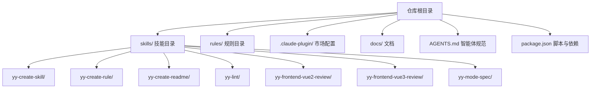
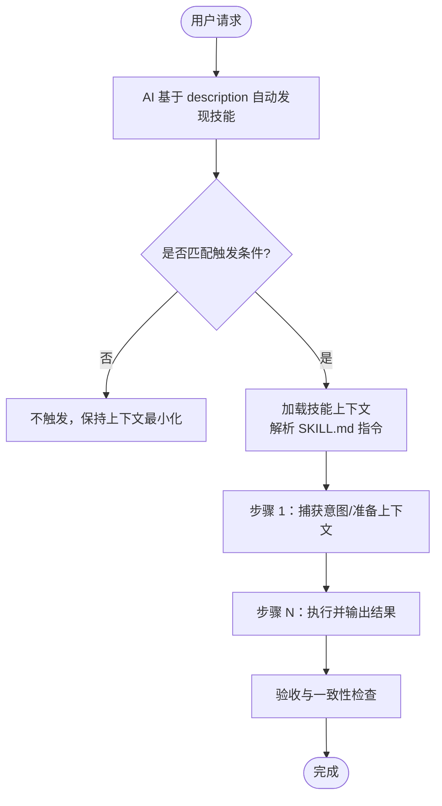
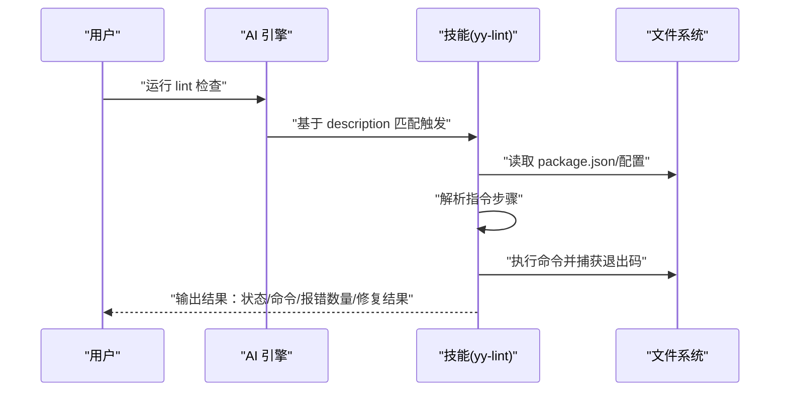

# 技能基础概念

<cite>
**本文引用的文件**
- [技能编写指南](file://skills/yy-create-skill/resources/skill-guide.md)
- [技能基础模板](file://skills/yy-create-skill/templates/skill-template.md)
- [yy-create-skill 技能](file://skills/yy-create-skill/SKILL.md)
- [yy-create-rule 技能](file://skills/yy-create-rule/SKILL.md)
- [yy-create-readme 技能](file://skills/yy-create-readme/SKILL.md)
- [yy-lint 技能](file://skills/yy-lint/SKILL.md)
- [yy-frontend-vue2-review 技能](file://skills/yy-frontend-vue2-review/SKILL.md)
- [yy-frontend-vue3-review 技能](file://skills/yy-frontend-vue3-review/SKILL.md)
- [yy-mode-spec 技能](file://skills/yy-mode-spec/SKILL.md)
- [AGENTS.md](file://AGENTS.md)
- [package.json](file://package.json)
- [项目结构说明](file://docs/STRUCTURE.md)
- [本地开发调试指南](file://docs/DEVELOP.md)
- [Claude Code 安装技能](file://docs/CLAUDE_CODE_SKILL.md)
</cite>

## 目录
1. [简介](#简介)
2. [项目结构](#项目结构)
3. [核心组件](#核心组件)
4. [架构总览](#架构总览)
5. [详细组件分析](#详细组件分析)
6. [依赖分析](#依赖分析)
7. [性能考量](#性能考量)
8. [故障排查指南](#故障排查指南)
9. [结论](#结论)
10. [附录](#附录)

## 简介
本文件围绕“技能”的基础概念与实现原理展开，系统阐述“可按需加载的任务说明书”这一设计理念，解释技能的五大关键特点：自动发现机制、精确触发条件、明确边界定义、清晰指令步骤、显式决策规则。文档还对比技能与传统程序的差异，强调其可复用性与任务导向特性，并结合仓库中的真实技能示例（如代码格式化、文档生成、规则创建等）说明触发机制与上下文加载原理，帮助开发者快速理解并高效使用技能系统。

## 项目结构
仓库采用“技能 + 规则 + 插件市场配置”的分层组织方式：
- skills/：公共技能集合，每个技能以独立目录存在，包含 SKILL.md、可选的 scripts/examples/templates/resources 等子目录
- rules/：项目规则与参考文档，沉淀项目规范与最佳实践
- .claude-plugin/：插件市场配置，定义技能分组与发布入口
- docs/：开发与使用文档，包括结构说明、本地调试、安装指引等
- AGENTS.md：智能体编码规范与质量门禁，指导技能与规则的编写与维护
- package.json：项目脚本与依赖，支撑技能校验、Markdown Lint、市场同步等

图表来源
- [项目结构说明:1-10](file://docs/STRUCTURE.md#L1-L10)
- [yy-create-skill 技能:1-213](file://skills/yy-create-skill/SKILL.md#L1-L213)
- [yy-create-rule 技能:1-133](file://skills/yy-create-rule/SKILL.md#L1-L133)
- [yy-create-readme 技能:1-120](file://skills/yy-create-readme/SKILL.md#L1-L120)
- [yy-lint 技能:1-88](file://skills/yy-lint/SKILL.md#L1-L88)
- [yy-frontend-vue2-review 技能:1-167](file://skills/yy-frontend-vue2-review/SKILL.md#L1-L167)
- [yy-frontend-vue3-review 技能:1-206](file://skills/yy-frontend-vue3-review/SKILL.md#L1-L206)
- [yy-mode-spec 技能:1-115](file://skills/yy-mode-spec/SKILL.md#L1-L115)

章节来源
- [项目结构说明:1-10](file://docs/STRUCTURE.md#L1-L10)

## 核心组件
- 技能主文件 SKILL.md：定义技能名称、描述、使用场景、指令步骤、相关资源与验收清单，是技能的“任务说明书”
- 目录结构规范：支持 scripts/、examples/、templates/、resources/ 等子目录，按需扩展
- 触发与边界：通过 description 精确路由、使用场景与不应触发场景明确边界
- 指令与决策：步骤清晰、输出格式明确、决策分支显式化
- 质量与一致性：文件间一致性检查、安全边界、验收清单与交互设计原则

章节来源
- [技能编写指南:1-395](file://skills/yy-create-skill/resources/skill-guide.md#L1-L395)
- [技能基础模板:1-37](file://skills/yy-create-skill/templates/skill-template.md#L1-L37)
- [yy-create-skill 技能:1-213](file://skills/yy-create-skill/SKILL.md#L1-L213)

## 架构总览
技能系统以“任务说明书”为核心，围绕以下闭环运转：
- 自动发现：AI 通过 description 与上下文匹配自动加载相关技能
- 精确触发：使用场景与不应触发场景明确边界，避免误触发
- 明确边界：限定执行范围（如仅 src 目录、仅 Vue2/Vue3 项目等）
- 清晰指令：步骤化、可执行、最后一步描述输出格式
- 显式决策：将隐含分支转化为明确规则，避免模糊表述

图表来源
- [yy-frontend-vue2-review 技能:1-167](file://skills/yy-frontend-vue2-review/SKILL.md#L1-L167)
- [yy-frontend-vue3-review 技能:1-206](file://skills/yy-frontend-vue3-review/SKILL.md#L1-L206)
- [yy-lint 技能:1-88](file://skills/yy-lint/SKILL.md#L1-L88)
- [yy-create-readme 技能:1-120](file://skills/yy-create-readme/SKILL.md#L1-L120)

## 详细组件分析

### 技能五大关键特点
- 自动发现：AI 基于 description 与用户请求进行语义匹配，仅在相关时加载技能，避免上下文膨胀
- 精确触发：description 与“使用场景/不应触发场景”共同构成触发边界，减少误触发
- 明确边界：限定执行范围（如仅 src 目录、仅 Vue2/Vue3 项目、仅 README 根目录等）
- 清晰指令：步骤化、可执行、最后一步描述输出格式，便于 AI 稳健执行
- 显式决策：将隐含分支转化为明确规则（表格/列表），避免“根据情况处理”等模糊表述

章节来源
- [yy-create-skill 技能:13-33](file://skills/yy-create-skill/SKILL.md#L13-L33)
- [yy-lint 技能:14-27](file://skills/yy-lint/SKILL.md#L14-L27)
- [yy-frontend-vue2-review 技能:31-46](file://skills/yy-frontend-vue2-review/SKILL.md#L31-L46)
- [yy-frontend-vue3-review 技能:24-33](file://skills/yy-frontend-vue3-review/SKILL.md#L24-L33)
- [yy-create-readme 技能:14-27](file://skills/yy-create-readme/SKILL.md#L14-L27)

### 技能与传统程序的区别
- 任务导向：技能聚焦“做什么”和“如何做”，而非“如何实现”
- 可复用性：通过标准化的 SKILL.md 与目录结构，实现跨项目、跨团队复用
- 上下文最小化：仅在触发时加载，避免不必要的上下文膨胀
- 交互与验收：强调交互设计与验收清单，提升可维护性与一致性

章节来源
- [yy-create-skill 技能:13-33](file://skills/yy-create-skill/SKILL.md#L13-L33)
- [技能编写指南:192-264](file://skills/yy-create-skill/resources/skill-guide.md#L192-L264)

### 触发机制与上下文加载原理
- 自动触发：当用户请求与 description 内容匹配时自动触发
- 显式调用：当用户主动提及技能名称时触发
- 上下文加载：加载 SKILL.md 与相关资源（examples/templates/resources/scripts），按步骤执行

图表来源
- [yy-lint 技能:1-88](file://skills/yy-lint/SKILL.md#L1-L88)

章节来源
- [yy-lint 技能:28-73](file://skills/yy-lint/SKILL.md#L28-L73)
- [yy-create-skill 技能:148-177](file://skills/yy-create-skill/SKILL.md#L148-L177)

### 目录结构与资源组织
- 必需：SKILL.md（技能主文件）
- 可选：scripts/（可执行脚本）、examples/（输入/输出示例）、templates/（模板）、resources/（参考文档）

章节来源
- [yy-create-skill 技能:197-213](file://skills/yy-create-skill/SKILL.md#L197-L213)
- [技能编写指南:167-191](file://skills/yy-create-skill/resources/skill-guide.md#L167-L191)

### 典型技能示例与应用场景

#### 代码格式化（yy-lint）
- 触发条件：用户提到“lint/代码检查/代码风格检查”
- 边界定义：仅执行 lint 相关命令，禁止编译/构建/部署等敏感命令
- 指令步骤：确定命令 → 验证 Node 版本 → 执行检查 → 输出结果
- 决策显式：exit code 为 0 则通过，非 0 则读取错误日志并修复报错（不修复警告）

章节来源
- [yy-lint 技能:1-88](file://skills/yy-lint/SKILL.md#L1-L88)

#### 文档生成（yy-create-readme）
- 触发条件：用户要求创建/更新 README.md
- 边界定义：仅处理 README.md，不处理其他文档
- 指令步骤：分析项目结构 → 检查现有 README → 收集项目信息 → 引导用户完善描述 → 生成 README → 写入文件
- 输出约定：必要内容（名称/描述/安装/使用）+ 推荐内容（特性/技术栈/协议）

章节来源
- [yy-create-readme 技能:1-120](file://skills/yy-create-readme/SKILL.md#L1-L120)

#### 规则创建（yy-create-rule）
- 触发条件：用户想要创建规则/记录最佳实践/记录经验
- 边界定义：仅处理规则文档，不处理技能文件
- 指令步骤：捕获意图 → 检查并初始化目录/文件 → 决定放置位置 → 格式化并插入内容 → 更新 AGENTS.md 引用
- 验收清单：章节标题明确、内容结构清晰、提供具体示例、中文编写、AGENTS.md 引用更新

章节来源
- [yy-create-rule 技能:1-133](file://skills/yy-create-rule/SKILL.md#L1-L133)

#### 前端代码审核（yy-frontend-vue2-review / yy-frontend-vue3-review）
- 触发条件：用户提到代码审核/PR 审核/提交前检查
- 边界定义：严格限制在 src 目录内审核，区分 Vue2/Vue3 项目，不修改代码
- 指令步骤：获取审核目标 → 生成审核清单 → 逐文件逐维度审核 → 结果汇总与判断
- 决策显式：严重/中等/轻微三级分级，明确“必须修复/建议修复/不影响通过”

章节来源
- [yy-frontend-vue2-review 技能:1-167](file://skills/yy-frontend-vue2-review/SKILL.md#L1-L167)
- [yy-frontend-vue3-review 技能:1-206](file://skills/yy-frontend-vue3-review/SKILL.md#L1-L206)

#### 规格优先开发（yy-mode-spec）
- 触发条件：用户输入 /yy-mode-spec 命令或需要在编码前制定详细规格
- 边界定义：仅在需要制定规格时触发，不直接执行编码
- 指令步骤：分析需求复杂度 → 编写规格内容 → 确定输出方式 → 展示规格并等待确认 → 处理反馈 → 执行实施
- 输出约定：规格目录、规格摘要、任务概览

章节来源
- [yy-mode-spec 技能:1-115](file://skills/yy-mode-spec/SKILL.md#L1-L115)

## 依赖分析
- 本地开发与调试：通过 npx skills add ./ 将 skills 目录注册为技能源，支持本地调试与快速迭代
- 质量门禁：AGENTS.md 定义质量门禁与编辑规范，确保技能与规则的一致性与可维护性
- 市场同步：package.json 中提供 lint 与市场同步脚本，保障技能清单与市场配置一致

图表来源
- [本地开发调试指南:1-18](file://docs/DEVELOP.md#L1-L18)
- [AGENTS.md:1-155](file://AGENTS.md#L1-L155)
- [package.json:1-46](file://package.json#L1-L46)

章节来源
- [本地开发调试指南:1-18](file://docs/DEVELOP.md#L1-L18)
- [AGENTS.md:1-155](file://AGENTS.md#L1-L155)
- [package.json:1-46](file://package.json#L1-L46)

## 性能考量
- 上下文最小化：仅在触发时加载技能，避免不必要的上下文膨胀
- 交互轮次优化：默认采用常见策略，减少与用户的交互次数
- 并行任务约束：多个并行任务时延迟执行 lint，避免冲突与资源竞争
- 输出裁剪：成功通过时不读取输出日志，节省 token 与时间

章节来源
- [技能编写指南:192-264](file://skills/yy-create-skill/resources/skill-guide.md#L192-L264)
- [yy-lint 技能:64-73](file://skills/yy-lint/SKILL.md#L64-L73)

## 故障排查指南
- 描述不精确：导致误触发或不触发。应控制在 2-3 句话内，明确触发条件与边界
- 指令不清晰：步骤缺失或模糊。应使用祈使语气，每步只描述一个操作，最后一步描述输出格式
- 决策点模糊：隐含分支未显式化。应使用表格/列表格式呈现决策逻辑
- 文件间不一致：SKILL.md 与 examples/templates/resources 内容矛盾。应统一步骤编号、章节名称与术语
- 安全边界缺失：涉及敏感操作未明确禁止。应列出禁止主动执行的命令与行为

章节来源
- [yy-create-skill 技能:148-177](file://skills/yy-create-skill/SKILL.md#L148-L177)
- [技能编写指南:126-166](file://skills/yy-create-skill/resources/skill-guide.md#L126-L166)

## 结论
技能系统以“可按需加载的任务说明书”为核心，通过自动发现、精确触发、明确边界、清晰指令与显式决策五大特点，实现了高复用、强一致、低耦合的任务执行框架。结合仓库中的真实技能示例，开发者可以快速理解并构建高质量的技能，提升协作效率与交付质量。

## 附录
- 安装技能（Claude Code）：通过 /plugin 命令添加市场、选择 open-skills 插件市场并安装所需技能
- 本地开发：在根目录执行 npx skills add ./ 调试 skills 目录下的技能
- 市场配置：.claude-plugin/marketplace.json 定义插件与技能分组

章节来源
- [Claude Code 安装技能:1-10](file://docs/CLAUDE_CODE_SKILL.md#L1-L10)
- [本地开发调试指南:1-18](file://docs/DEVELOP.md#L1-L18)
- [package.json:14-16](file://package.json#L14-L16)