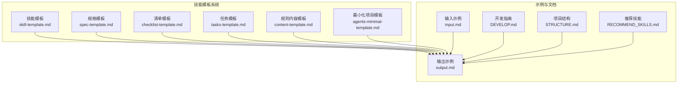
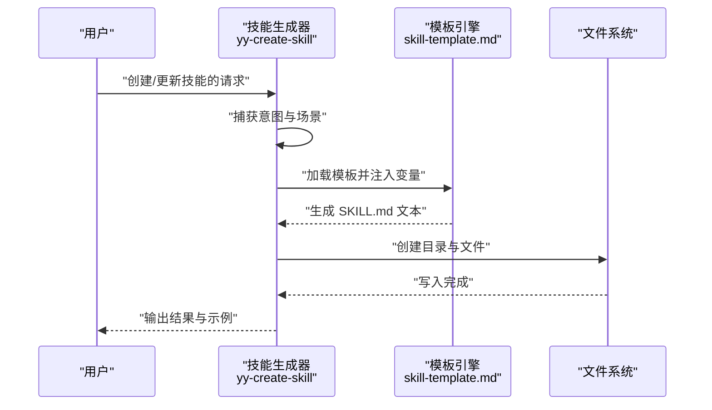
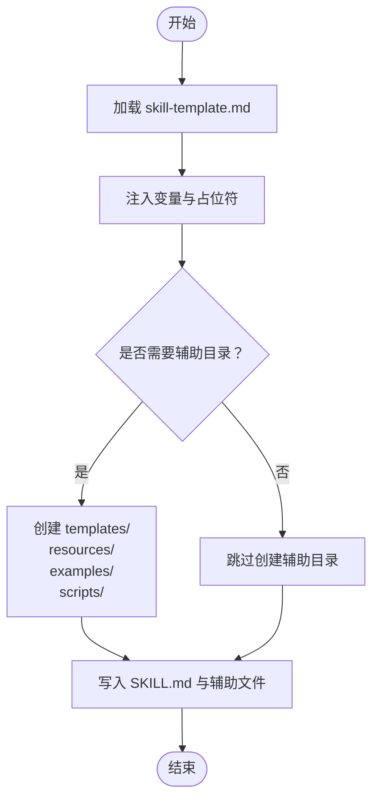
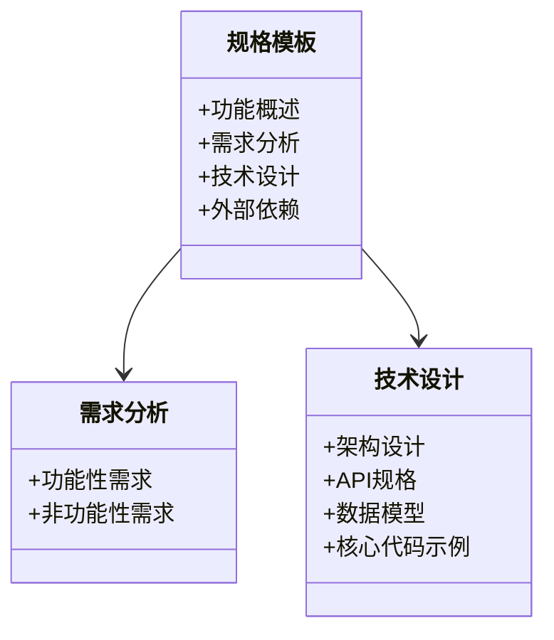
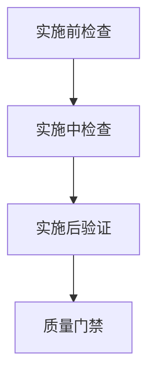
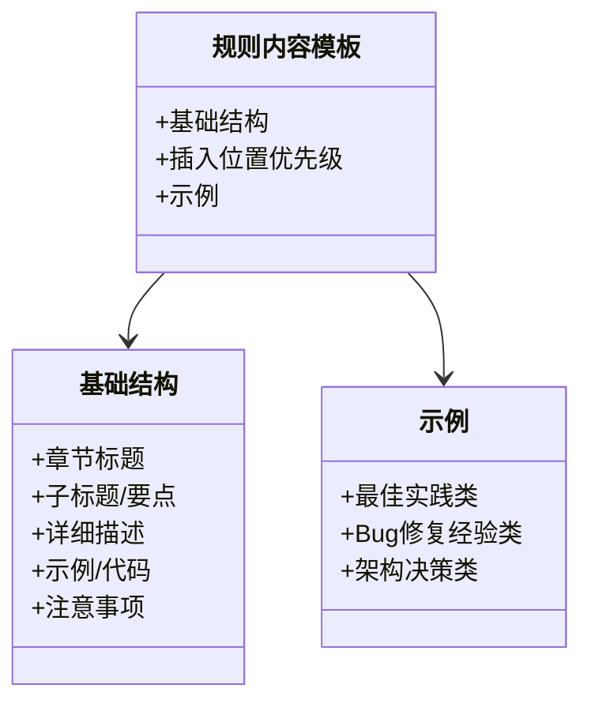
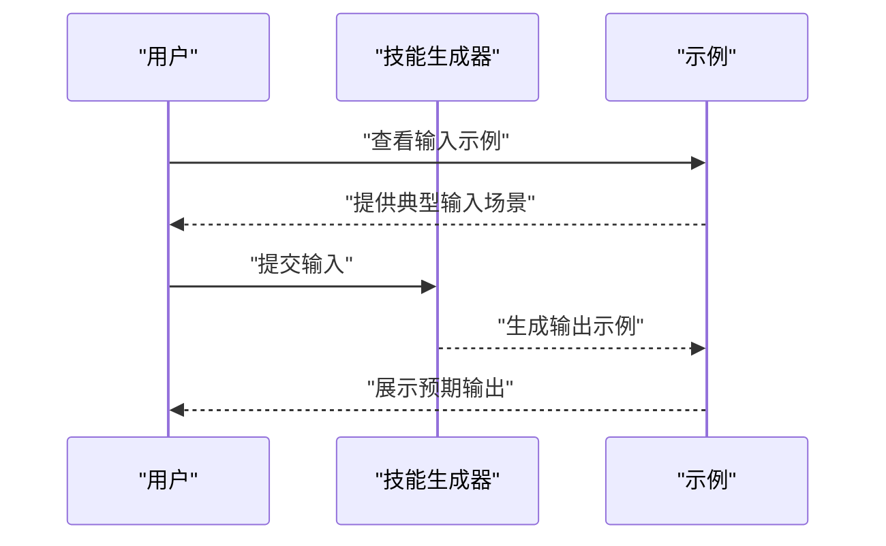
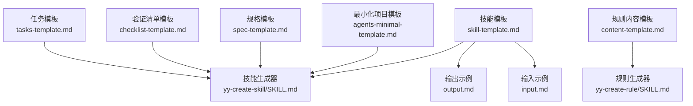

# 技能模板系统

<cite>
**本文档引用的文件**
- [skill-template.md](file://skills/yy-create-skill/templates/skill-template.md)
- [yy-create-skill/SKILL.md](file://skills/yy-create-skill/SKILL.md)
- [spec-template.md](file://skills/yy-mode-spec/templates/spec-template.md)
- [checklist-template.md](file://skills/yy-mode-spec/templates/checklist-template.md)
- [tasks-template.md](file://skills/yy-mode-spec/templates/tasks-template.md)
- [input.md](file://skills/yy-create-skill/examples/input.md)
- [output.md](file://skills/yy-create-skill/examples/output.md)
- [content-template.md](file://skills/yy-create-rule/resources/content-template.md)
- [yy-create-rule/SKILL.md](file://skills/yy-create-rule/SKILL.md)
- [agents-minimal-template.md](file://skills/yy-init/templates/agents-minimal-template.md)
- [DEVELOP.md](file://docs/DEVELOP.md)
- [STRUCTURE.md](file://docs/STRUCTURE.md)
- [RECOMMEND_SKILLS.md](file://docs/RECOMMEND_SKILLS.md)
</cite>

## 目录
1. [简介](#简介)
2. [项目结构](#项目结构)
3. [核心组件](#核心组件)
4. [架构总览](#架构总览)
5. [详细组件分析](#详细组件分析)
6. [依赖分析](#依赖分析)
7. [性能考虑](#性能考虑)
8. [故障排除指南](#故障排除指南)
9. [结论](#结论)
10. [附录](#附录)

## 简介
本文件面向技能模板系统，系统性阐述模板设计原理、工作机制与最佳实践，重点覆盖：
- 模板变量替换与动态内容生成的思路与落地方式
- skill-template.md 模板的结构与占位符语义
- 模板选择策略：何时使用基础模板、何时需要自定义模板
- 模板定制指导：如何扩展模板以适配不同类型的技能
- 模板与实际技能生成的关系及版本管理的重要性
- 模板验证与测试方法，确保模板的正确性与可用性
- 丰富的模板示例，展示不同类型技能的模板应用

## 项目结构
技能模板系统围绕“技能”这一核心实体展开，采用“模板 + 示例 + 辅助资源”的结构化组织方式：
- 模板层：提供标准化的模板文件，用于快速生成技能文档骨架
- 示例层：提供输入/输出示例，帮助理解模板的实际应用效果
- 辅助资源层：提供规则、指南、最小化模板等，支撑技能编写的规范与一致性

**图表来源**
- [skill-template.md:1-37](file://skills/yy-create-skill/templates/skill-template.md#L1-L37)
- [spec-template.md:1-51](file://skills/yy-mode-spec/templates/spec-template.md#L1-L51)
- [checklist-template.md:1-32](file://skills/yy-mode-spec/templates/checklist-template.md#L1-L32)
- [tasks-template.md:1-27](file://skills/yy-mode-spec/templates/tasks-template.md#L1-L27)
- [content-template.md:1-122](file://skills/yy-create-rule/resources/content-template.md#L1-L122)
- [agents-minimal-template.md:1-114](file://skills/yy-init/templates/agents-minimal-template.md#L1-L114)
- [input.md:1-41](file://skills/yy-create-skill/examples/input.md#L1-L41)
- [output.md:1-194](file://skills/yy-create-skill/examples/output.md#L1-L194)
- [DEVELOP.md:1-18](file://docs/DEVELOP.md#L1-L18)
- [STRUCTURE.md:1-10](file://docs/STRUCTURE.md#L1-L10)
- [RECOMMEND_SKILLS.md:1-82](file://docs/RECOMMEND_SKILLS.md#L1-L82)

**章节来源**
- [STRUCTURE.md:1-10](file://docs/STRUCTURE.md#L1-L10)

## 核心组件
- 技能模板（skill-template.md）：提供技能文档的基础结构与写作规范，用于生成标准化的 SKILL.md 文档骨架
- 规格模板（spec-template.md）、验证清单模板（checklist-template.md）、任务模板（tasks-template.md）：面向工程化场景，提供文档化的规格说明、验证清单与任务分解模板
- 规则内容模板（content-template.md）：规范规则文档的结构与写作方式，便于沉淀项目知识
- 最小化项目模板（agents-minimal-template.md）：提供 AGENTS.md 的最小化结构，帮助快速建立项目规范
- 输入/输出示例（input.md、output.md）：展示用户输入与系统输出的典型场景，辅助理解模板的实际应用
- 开发指南（DEVELOP.md）：提供本地调试与技能添加的指引

**章节来源**
- [skill-template.md:1-37](file://skills/yy-create-skill/templates/skill-template.md#L1-L37)
- [spec-template.md:1-51](file://skills/yy-mode-spec/templates/spec-template.md#L1-L51)
- [checklist-template.md:1-32](file://skills/yy-mode-spec/templates/checklist-template.md#L1-L32)
- [tasks-template.md:1-27](file://skills/yy-mode-spec/templates/tasks-template.md#L1-L27)
- [content-template.md:1-122](file://skills/yy-create-rule/resources/content-template.md#L1-L122)
- [agents-minimal-template.md:1-114](file://skills/yy-init/templates/agents-minimal-template.md#L1-L114)
- [input.md:1-41](file://skills/yy-create-skill/examples/input.md#L1-L41)
- [output.md:1-194](file://skills/yy-create-skill/examples/output.md#L1-L194)
- [DEVELOP.md:1-18](file://docs/DEVELOP.md#L1-L18)

## 架构总览
模板系统围绕“模板 + 生成流程 + 验收与示例”的闭环展开：
- 模板层：提供标准化模板，确保技能文档的一致性
- 生成流程：根据用户意图与模板选择策略，生成 SKILL.md 与辅助目录
- 验收与示例：通过验收清单与示例输出，验证模板生成的质量

**图表来源**
- [yy-create-skill/SKILL.md:34-177](file://skills/yy-create-skill/SKILL.md#L34-L177)
- [skill-template.md:9-36](file://skills/yy-create-skill/templates/skill-template.md#L9-L36)

## 详细组件分析

### 技能模板（skill-template.md）
- 设计目的：提供技能文档的标准化结构，确保描述、使用场景、指令、相关资源等关键要素齐全
- 结构组成：YAML frontmatter + 标题 + 描述 + 使用场景 + 指令 + 相关资源
- 占位符与语义：
  - name：技能名称（用于标识与触发）
  - description：技能用途与触发场景（折叠式写法，避免行内语法）
  - 标题与章节：技能名称、描述、使用场景、指令、相关资源
- 生成策略：默认只生成 SKILL.md；当模板内容超过阈值或用户明确要求时，创建 templates/、resources/、examples/、scripts/ 等辅助目录

**图表来源**
- [skill-template.md:9-36](file://skills/yy-create-skill/templates/skill-template.md#L9-L36)
- [yy-create-skill/SKILL.md:74-98](file://skills/yy-create-skill/SKILL.md#L74-L98)

**章节来源**
- [skill-template.md:1-37](file://skills/yy-create-skill/templates/skill-template.md#L1-L37)
- [yy-create-skill/SKILL.md:74-98](file://skills/yy-create-skill/SKILL.md#L74-L98)

### 规格模板（spec-template.md）
- 设计目的：为技术规格说明书提供标准化结构，便于团队协作与评审
- 结构组成：功能概述、需求分析（功能性/非功能性）、技术设计（架构/接口/数据模型/代码示例）、外部依赖
- 应用场景：适用于需要生成规范文档的技能或规则

**图表来源**
- [spec-template.md:1-51](file://skills/yy-mode-spec/templates/spec-template.md#L1-L51)

**章节来源**
- [spec-template.md:1-51](file://skills/yy-mode-spec/templates/spec-template.md#L1-L51)

### 验证清单模板（checklist-template.md）
- 设计目的：提供验证清单的标准化结构，便于阶段性检查与质量门禁
- 结构组成：实施前检查、实施中检查、实施后验证、质量门禁
- 应用场景：适用于需要阶段性验证的技能或流程

**图表来源**
- [checklist-template.md:1-32](file://skills/yy-mode-spec/templates/checklist-template.md#L1-L32)

**章节来源**
- [checklist-template.md:1-32](file://skills/yy-mode-spec/templates/checklist-template.md#L1-L32)

### 任务分解模板（tasks-template.md）
- 设计目的：提供任务分解的标准化结构，便于项目规划与进度跟踪
- 结构组成：任务列表（按阶段划分）、任务依赖图
- 应用场景：适用于需要任务拆解与依赖管理的技能或工程

**章节来源**
- [tasks-template.md:1-27](file://skills/yy-mode-spec/templates/tasks-template.md#L1-L27)

### 规则内容模板（content-template.md）
- 设计目的：规范规则文档的结构与写作方式，便于沉淀项目知识
- 结构组成：基础结构（章节标题、子标题、要点、示例/代码、注意事项）、插入位置优先级、示例（最佳实践类、Bug修复经验类、架构决策类）
- 应用场景：规则文档的编写与更新

**图表来源**
- [content-template.md:1-122](file://skills/yy-create-rule/resources/content-template.md#L1-L122)

**章节来源**
- [content-template.md:1-122](file://skills/yy-create-rule/resources/content-template.md#L1-L122)

### 最小化项目模板（agents-minimal-template.md）
- 设计目的：提供 AGENTS.md 的最小化结构，帮助快速建立项目规范
- 结构组成：范围、改动检查、交付格式、项目结构、AI思考方式、路径格式规范、Rules
- 应用场景：项目初始化与规范建立

**章节来源**
- [agents-minimal-template.md:1-114](file://skills/yy-init/templates/agents-minimal-template.md#L1-L114)

### 输入/输出示例（input.md、output.md）
- 设计目的：展示用户输入与系统输出的典型场景，辅助理解模板的实际应用
- 内容组成：输入示例（创建简单技能、创建带模板的技能、更新现有技能、创建复杂技能、显式调用技能创建）、输出示例（简单技能输出、带模板的技能输出、更新技能输出、复杂技能输出）

**图表来源**
- [input.md:1-41](file://skills/yy-create-skill/examples/input.md#L1-L41)
- [output.md:1-194](file://skills/yy-create-skill/examples/output.md#L1-L194)

**章节来源**
- [input.md:1-41](file://skills/yy-create-skill/examples/input.md#L1-L41)
- [output.md:1-194](file://skills/yy-create-skill/examples/output.md#L1-L194)

## 依赖分析
- 模板与生成流程的耦合：模板文件与生成流程紧密耦合，生成流程负责将模板与变量结合，形成最终的 SKILL.md
- 示例与模板的映射：示例输出展示了模板在不同场景下的应用效果，有助于验证模板的正确性
- 辅助资源与模板的关系：规则内容模板、最小化项目模板等辅助资源与技能模板共同构成模板体系

**图表来源**
- [skill-template.md:1-37](file://skills/yy-create-skill/templates/skill-template.md#L1-L37)
- [yy-create-skill/SKILL.md:1-213](file://skills/yy-create-skill/SKILL.md#L1-L213)
- [output.md:1-194](file://skills/yy-create-skill/examples/output.md#L1-L194)
- [input.md:1-41](file://skills/yy-create-skill/examples/input.md#L1-L41)
- [content-template.md:1-122](file://skills/yy-create-rule/resources/content-template.md#L1-L122)
- [yy-create-rule/SKILL.md:1-133](file://skills/yy-create-rule/SKILL.md#L1-L133)
- [agents-minimal-template.md:1-114](file://skills/yy-init/templates/agents-minimal-template.md#L1-L114)
- [spec-template.md:1-51](file://skills/yy-mode-spec/templates/spec-template.md#L1-L51)
- [checklist-template.md:1-32](file://skills/yy-mode-spec/templates/checklist-template.md#L1-L32)
- [tasks-template.md:1-27](file://skills/yy-mode-spec/templates/tasks-template.md#L1-L27)

**章节来源**
- [yy-create-skill/SKILL.md:1-213](file://skills/yy-create-skill/SKILL.md#L1-L213)
- [yy-create-rule/SKILL.md:1-133](file://skills/yy-create-rule/SKILL.md#L1-L133)

## 性能考虑
- 模板体积控制：当模板内容超过一定阈值时，应将内容迁移到 templates/ 目录，避免 SKILL.md 过大影响可读性与加载性能
- 生成效率：生成流程应尽量减少不必要的文件写入与目录创建，仅在必要时创建辅助目录
- 验收效率：通过验收清单快速定位问题，减少反复修改的成本

## 故障排除指南
- 描述字段不符合规范：description 应使用折叠式语法，避免行内写法；仅描述用途与触发场景，不包含实现细节
- 目录结构不规范：技能目录应使用 kebab-case 命名；仅在需要时创建 scripts/、templates/、resources/、examples/ 目录
- 文件命名不规范：所有文件应使用中文命名，避免使用特殊字符
- 示例缺失：对于复杂技能，应在 examples/ 目录下提供输入/输出示例，便于验证与演示
- 规则文档未更新引用：创建新规则文档后，需在 AGENTS.md 中添加引用

**章节来源**
- [yy-create-skill/SKILL.md:148-177](file://skills/yy-create-skill/SKILL.md#L148-L177)
- [yy-create-rule/SKILL.md:105-126](file://skills/yy-create-rule/SKILL.md#L105-L126)

## 结论
技能模板系统通过标准化的模板与严格的生成流程，确保技能文档的一致性与可维护性。通过合理的模板选择策略、定制化扩展与完善的验证机制，可以有效提升技能生成的质量与效率。建议在实际使用中：
- 优先使用基础模板，按需扩展
- 严格遵守描述字段与目录结构规范
- 通过示例与验收清单持续验证模板的正确性
- 建立模板版本管理机制，确保模板演进的可追溯性

## 附录

### 模板选择策略
- 使用基础模板：适用于常规技能，描述、使用场景、指令、相关资源等要素齐全即可
- 使用自定义模板：适用于复杂技能或特定领域，需要额外的模板或规则支持
- 使用规格/清单/任务模板：适用于工程化场景，需要生成规范文档或进行阶段性验证

**章节来源**
- [yy-create-skill/SKILL.md:80-98](file://skills/yy-create-skill/SKILL.md#L80-L98)
- [spec-template.md:1-51](file://skills/yy-mode-spec/templates/spec-template.md#L1-L51)
- [checklist-template.md:1-32](file://skills/yy-mode-spec/templates/checklist-template.md#L1-L32)
- [tasks-template.md:1-27](file://skills/yy-mode-spec/templates/tasks-template.md#L1-L27)

### 模板定制指导
- 扩展模板以适配特定类型技能：在 templates/ 目录下创建专用模板，通过 SKILL.md 中的指令引用
- 规则文档定制：使用 content-template.md 规范规则文档的结构与写作方式
- 最小化项目模板：使用 agents-minimal-template.md 快速建立项目规范

**章节来源**
- [yy-create-skill/SKILL.md:74-98](file://skills/yy-create-skill/SKILL.md#L74-L98)
- [content-template.md:1-122](file://skills/yy-create-rule/resources/content-template.md#L1-L122)
- [agents-minimal-template.md:1-114](file://skills/yy-init/templates/agents-minimal-template.md#L1-L114)

### 模板与实际技能生成的关系
- 模板是技能生成的骨架，生成流程负责将模板与变量结合，形成最终的 SKILL.md
- 示例输出展示了模板在不同场景下的应用效果，有助于验证模板的正确性
- 验收清单提供了质量保障，确保生成的技能符合规范

**章节来源**
- [yy-create-skill/SKILL.md:148-177](file://skills/yy-create-skill/SKILL.md#L148-L177)
- [output.md:1-194](file://skills/yy-create-skill/examples/output.md#L1-L194)

### 模板版本管理的重要性
- 版本管理有助于追踪模板的演进历史，确保模板更新不影响现有技能的稳定性
- 建议在模板文件中添加版本信息与变更说明，便于回溯与审计

**章节来源**
- [yy-create-skill/SKILL.md:1-213](file://skills/yy-create-skill/SKILL.md#L1-L213)

### 模板验证与测试方法
- 验收清单：通过验收清单逐项检查生成的技能是否符合规范
- 示例对比：将生成结果与示例输出进行对比，验证模板的正确性
- 本地调试：使用开发指南提供的命令进行本地调试，验证模板与生成流程

**章节来源**
- [yy-create-skill/SKILL.md:148-177](file://skills/yy-create-skill/SKILL.md#L148-L177)
- [DEVELOP.md:1-18](file://docs/DEVELOP.md#L1-L18)
- [RECOMMEND_SKILLS.md:1-82](file://docs/RECOMMEND_SKILLS.md#L1-L82)