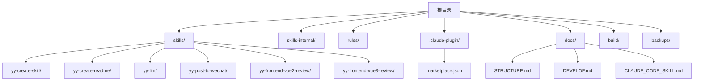
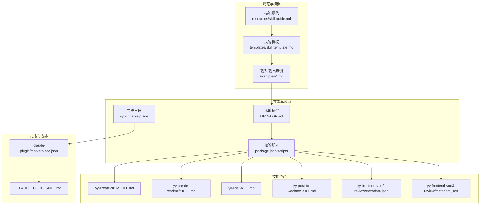
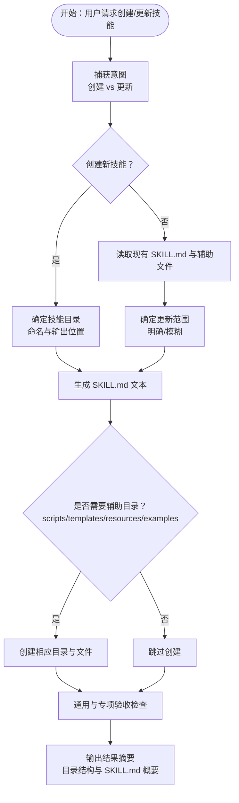
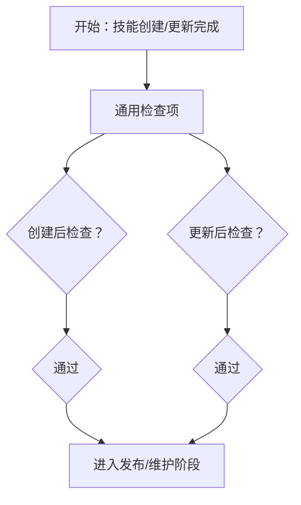
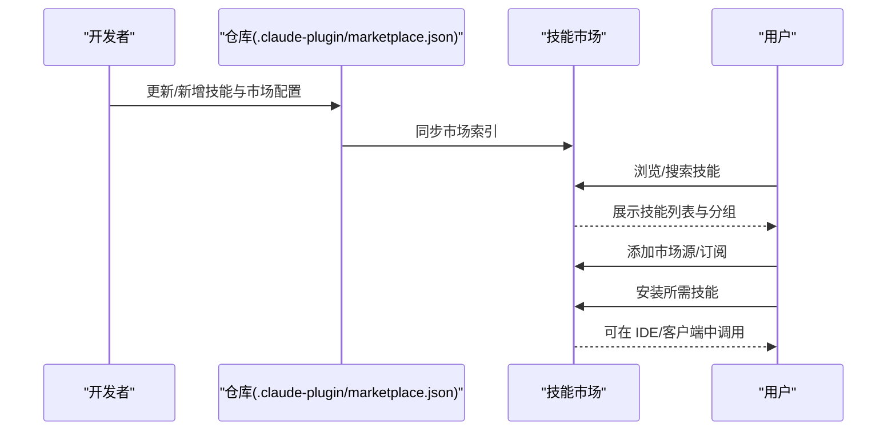
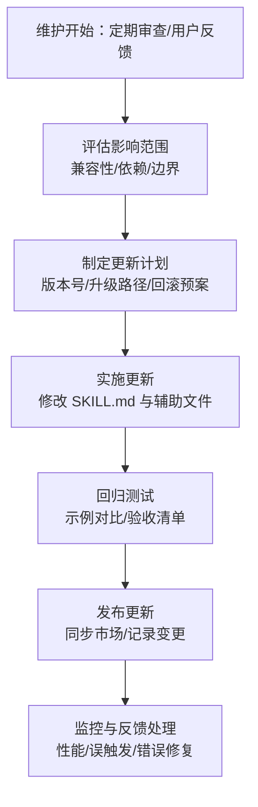
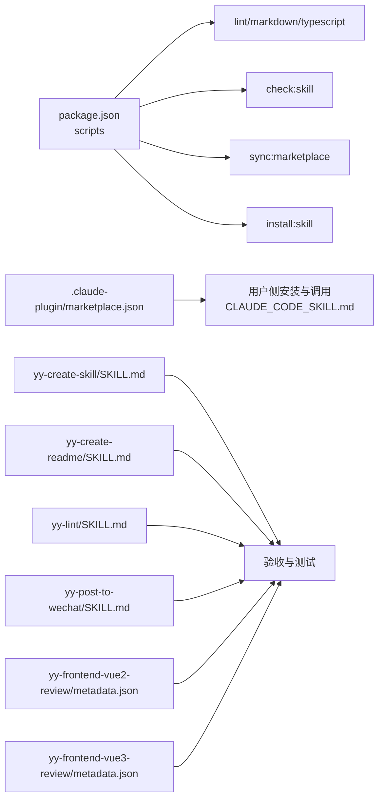

# 技能生命周期管理

<cite>
**本文引用的文件**
- [package.json](file://package.json)
- [.claude-plugin/marketplace.json](file://.claude-plugin/marketplace.json)
- [docs/STRUCTURE.md](file://docs/STRUCTURE.md)
- [docs/DEVELOP.md](file://docs/DEVELOP.md)
- [docs/CLAUDE_CODE_SKILL.md](file://docs/CLAUDE_CODE_SKILL.md)
- [skills/yy-create-skill/SKILL.md](file://skills/yy-create-skill/SKILL.md)
- [skills/yy-create-skill/resources/skill-guide.md](file://skills/yy-create-skill/resources/skill-guide.md)
- [skills/yy-create-skill/templates/skill-template.md](file://skills/yy-create-skill/templates/skill-template.md)
- [skills/yy-create-skill/examples/input.md](file://skills/yy-create-skill/examples/input.md)
- [skills/yy-create-skill/examples/output.md](file://skills/yy-create-skill/examples/output.md)
- [skills/yy-create-readme/SKILL.md](file://skills/yy-create-readme/SKILL.md)
- [skills/yy-lint/SKILL.md](file://skills/yy-lint/SKILL.md)
- [skills/yy-post-to-wechat/SKILL.md](file://skills/yy-post-to-wechat/SKILL.md)
- [skills/yy-frontend-vue2-review/metadata.json](file://skills/yy-frontend-vue2-review/metadata.json)
- [skills/yy-frontend-vue3-review/metadata.json](file://skills/yy-frontend-vue3-review/metadata.json)
</cite>

## 目录
1. [简介](#简介)
2. [项目结构](#项目结构)
3. [核心组件](#核心组件)
4. [架构总览](#架构总览)
5. [详细组件分析](#详细组件分析)
6. [依赖关系分析](#依赖关系分析)
7. [性能考量](#性能考量)
8. [故障排查指南](#故障排查指南)
9. [结论](#结论)
10. [附录](#附录)

## 简介
本文件系统化梳理“技能生命周期管理”的完整流程与规范，覆盖从创建、测试、发布、维护、更新、退役到废弃的全过程。文档结合仓库内的技能规范、模板与示例，给出版本管理策略、状态管理模型、自动化工具支持与最佳实践，并提供实际案例分析，帮助团队建立可复用、可演进、可治理的技能体系。

## 项目结构
仓库采用“技能 + 规则 + 市场配置 + 文档”的组织方式，便于本地开发、市场发布与自动化校验。

图表来源
- [docs/STRUCTURE.md:1-10](file://docs/STRUCTURE.md#L1-L10)
- [docs/DEVELOP.md:1-18](file://docs/DEVELOP.md#L1-L18)
- [.claude-plugin/marketplace.json](file://.claude-plugin/marketplace.json)

章节来源
- [docs/STRUCTURE.md:1-10](file://docs/STRUCTURE.md#L1-L10)
- [docs/DEVELOP.md:1-18](file://docs/DEVELOP.md#L1-L18)

## 核心组件
- 技能规范与模板：提供技能编写、验收、交互设计的统一标准，确保技能可触发、可执行、可维护。
- 市场与安装：通过市场配置文件与安装指引，支撑技能在不同平台的发现与使用。
- 开发与自动化：通过脚本与构建工具，实现技能校验、同步与批量安装。
- 典型技能样例：涵盖文档生成、代码检查、发布到微信、前端代码审核等场景，体现不同生命周期阶段的实践。

章节来源
- [skills/yy-create-skill/SKILL.md:1-213](file://skills/yy-create-skill/SKILL.md#L1-L213)
- [skills/yy-create-skill/resources/skill-guide.md:1-395](file://skills/yy-create-skill/resources/skill-guide.md#L1-L395)
- [skills/yy-create-skill/templates/skill-template.md:1-37](file://skills/yy-create-skill/templates/skill-template.md#L1-L37)
- [skills/yy-create-skill/examples/input.md:1-41](file://skills/yy-create-skill/examples/input.md#L1-L41)
- [skills/yy-create-skill/examples/output.md:1-194](file://skills/yy-create-skill/examples/output.md#L1-L194)
- [docs/CLAUDE_CODE_SKILL.md:1-10](file://docs/CLAUDE_CODE_SKILL.md#L1-L10)
- [package.json:1-46](file://package.json#L1-L46)

## 架构总览
技能生命周期由“规范制定—模板生成—本地开发—测试验证—发布—维护更新—退役与废弃”构成闭环。仓库通过脚本与市场配置实现自动化与可发现性。

图表来源
- [skills/yy-create-skill/resources/skill-guide.md:1-395](file://skills/yy-create-skill/resources/skill-guide.md#L1-L395)
- [skills/yy-create-skill/templates/skill-template.md:1-37](file://skills/yy-create-skill/templates/skill-template.md#L1-L37)
- [skills/yy-create-skill/examples/input.md:1-41](file://skills/yy-create-skill/examples/input.md#L1-L41)
- [skills/yy-create-skill/examples/output.md:1-194](file://skills/yy-create-skill/examples/output.md#L1-L194)
- [docs/DEVELOP.md:1-18](file://docs/DEVELOP.md#L1-L18)
- [package.json:7-16](file://package.json#L7-L16)
- [skills/yy-create-readme/SKILL.md:1-120](file://skills/yy-create-readme/SKILL.md#L1-L120)
- [skills/yy-lint/SKILL.md:1-88](file://skills/yy-lint/SKILL.md#L1-L88)
- [skills/yy-post-to-wechat/SKILL.md:1-174](file://skills/yy-post-to-wechat/SKILL.md#L1-L174)
- [skills/yy-frontend-vue2-review/metadata.json:1-34](file://skills/yy-frontend-vue2-review/metadata.json#L1-L34)
- [skills/yy-frontend-vue3-review/metadata.json:1-42](file://skills/yy-frontend-vue3-review/metadata.json#L1-L42)
- [.claude-plugin/marketplace.json](file://.claude-plugin/marketplace.json)
- [docs/CLAUDE_CODE_SKILL.md:1-10](file://docs/CLAUDE_CODE_SKILL.md#L1-L10)

## 详细组件分析

### 技能创建与模板体系
- 模板与规范：提供技能基础结构、命名规范、YAML frontmatter、使用场景、指令、验收清单与交互设计原则。
- 输入/输出示例：覆盖简单、带模板、更新、复杂技能等场景，指导生成可执行的技能资产。
- 生成策略：根据需求决定是否创建 scripts/、templates/、resources/、examples/ 等辅助目录，遵循“默认最小化、按需扩展”。

图表来源
- [skills/yy-create-skill/SKILL.md:36-177](file://skills/yy-create-skill/SKILL.md#L36-L177)
- [skills/yy-create-skill/resources/skill-guide.md:356-395](file://skills/yy-create-skill/resources/skill-guide.md#L356-L395)
- [skills/yy-create-skill/templates/skill-template.md:9-37](file://skills/yy-create-skill/templates/skill-template.md#L9-L37)
- [skills/yy-create-skill/examples/input.md:5-41](file://skills/yy-create-skill/examples/input.md#L5-L41)
- [skills/yy-create-skill/examples/output.md:5-194](file://skills/yy-create-skill/examples/output.md#L5-L194)

章节来源
- [skills/yy-create-skill/SKILL.md:1-213](file://skills/yy-create-skill/SKILL.md#L1-L213)
- [skills/yy-create-skill/resources/skill-guide.md:1-395](file://skills/yy-create-skill/resources/skill-guide.md#L1-L395)
- [skills/yy-create-skill/templates/skill-template.md:1-37](file://skills/yy-create-skill/templates/skill-template.md#L1-L37)
- [skills/yy-create-skill/examples/input.md:1-41](file://skills/yy-create-skill/examples/input.md#L1-L41)
- [skills/yy-create-skill/examples/output.md:1-194](file://skills/yy-create-skill/examples/output.md#L1-L194)

### 技能测试与验证
- 验收清单：覆盖描述准确性、触发边界、指令完整性、决策显式化、文件一致性、安全边界等。
- 测试样例：通过 examples/output.md 展示不同场景的期望输出，便于回归与对比。
- 交互设计：强调默认策略优先、减少交互轮次、快速提交模式等，提升执行效率与用户体验。

图表来源
- [skills/yy-create-skill/SKILL.md:148-177](file://skills/yy-create-skill/SKILL.md#L148-L177)
- [skills/yy-create-skill/resources/skill-guide.md:356-395](file://skills/yy-create-skill/resources/skill-guide.md#L356-L395)
- [skills/yy-create-skill/examples/output.md:5-194](file://skills/yy-create-skill/examples/output.md#L5-L194)

章节来源
- [skills/yy-create-skill/SKILL.md:148-177](file://skills/yy-create-skill/SKILL.md#L148-L177)
- [skills/yy-create-skill/resources/skill-guide.md:356-395](file://skills/yy-create-skill/resources/skill-guide.md#L356-L395)
- [skills/yy-create-skill/examples/output.md:5-194](file://skills/yy-create-skill/examples/output.md#L5-L194)

### 技能发布与市场发现
- 市场配置：通过 marketplace.json 定义插件与技能分组，支撑市场发现与分类。
- 安装指引：提供在 Claude Code 等平台安装与启用技能的步骤，确保用户侧可发现与调用。

图表来源
- [.claude-plugin/marketplace.json](file://.claude-plugin/marketplace.json)
- [docs/CLAUDE_CODE_SKILL.md:1-10](file://docs/CLAUDE_CODE_SKILL.md#L1-L10)

章节来源
- [.claude-plugin/marketplace.json](file://.claude-plugin/marketplace.json)
- [docs/CLAUDE_CODE_SKILL.md:1-10](file://docs/CLAUDE_CODE_SKILL.md#L1-L10)

### 技能维护与更新
- 版本与兼容：通过 metadata.json 记录版本、日期、作者、摘要、兼容性与特性，便于追踪演进。
- 更新策略：遵循“默认补充+优化”，在更新时保持 description 的触发边界清晰，同步检查辅助文件一致性。
- 自动化：利用脚本实现批量安装、同步市场与类型检查，降低维护成本。

图表来源
- [skills/yy-frontend-vue2-review/metadata.json:1-34](file://skills/yy-frontend-vue2-review/metadata.json#L1-L34)
- [skills/yy-frontend-vue3-review/metadata.json:1-42](file://skills/yy-frontend-vue3-review/metadata.json#L1-L42)
- [skills/yy-create-skill/SKILL.md:121-177](file://skills/yy-create-skill/SKILL.md#L121-L177)
- [package.json:7-16](file://package.json#L7-L16)

章节来源
- [skills/yy-frontend-vue2-review/metadata.json:1-34](file://skills/yy-frontend-vue2-review/metadata.json#L1-L34)
- [skills/yy-frontend-vue3-review/metadata.json:1-42](file://skills/yy-frontend-vue3-review/metadata.json#L1-L42)
- [skills/yy-create-skill/SKILL.md:121-177](file://skills/yy-create-skill/SKILL.md#L121-L177)
- [package.json:7-16](file://package.json#L7-L16)

### 技能退役与废弃
- 退役条件：功能过时、被更高阶技能替代、长期无人维护、存在安全风险或违反边界。
- 处理流程：停止发布新版本、通知用户迁移、保留历史版本与文档、逐步下架市场。
- 数据清理：删除或归档不再使用的资源文件，确保仓库整洁与合规。

章节来源
- [skills/yy-create-skill/resources/skill-guide.md:151-166](file://skills/yy-create-skill/resources/skill-guide.md#L151-L166)

### 实际案例分析

#### 案例一：文档生成类技能（yy-create-readme）
- 场景：自动生成 README，覆盖项目结构分析、信息收集、模板生成与写入。
- 生命周期：创建（模板与规范）、测试（示例对比）、发布（市场同步）、维护（模板与指南更新）。
- 关键点：触发边界明确、默认补充+优化策略、输出约定清晰。

章节来源
- [skills/yy-create-readme/SKILL.md:1-120](file://skills/yy-create-readme/SKILL.md#L1-L120)

#### 案例二：代码检查类技能（yy-lint）
- 场景：自动检测 lint 脚本、验证 Node 版本、执行检查并尝试自动修复报错。
- 生命周期：创建（规范与安全边界）、测试（多种命令与边界条件）、发布（市场同步）、维护（修复边界与并行任务约束）。
- 关键点：安全边界明确、并行任务约束、输出格式统一。

章节来源
- [skills/yy-lint/SKILL.md:1-88](file://skills/yy-lint/SKILL.md#L1-L88)

#### 案例三：发布到微信类技能（yy-post-to-wechat）
- 场景：通过微信公众号 API 将 Markdown/HTML 发布到草稿箱，支持主题与图片处理。
- 生命周期：创建（配置与参数优先级）、测试（文件存在性与格式支持）、发布（API 调用与结果输出）、维护（依赖与兼容性）。
- 关键点：环境配置检查、参数优先级、前置要求明确。

章节来源
- [skills/yy-post-to-wechat/SKILL.md:1-174](file://skills/yy-post-to-wechat/SKILL.md#L1-L174)

#### 案例四：前端代码审核类技能（yy-frontend-vue2-review / yy-frontend-vue3-review）
- 场景：针对 Vue2/Vue3 的代码审核，覆盖多维度检查与分级。
- 生命周期：创建（维度与边界定义）、测试（Git 变动文件检测）、发布（版本与兼容性）、维护（维度扩展与规则更新）。
- 关键点：版本与 API 风格兼容、严格目录边界、自动识别与拒绝处理。

章节来源
- [skills/yy-frontend-vue2-review/metadata.json:1-34](file://skills/yy-frontend-vue2-review/metadata.json#L1-L34)
- [skills/yy-frontend-vue3-review/metadata.json:1-42](file://skills/yy-frontend-vue3-review/metadata.json#L1-L42)

## 依赖关系分析
- 开发脚本：通过 package.json 的 scripts 定义 lint、类型检查、CRLF 转换、技能校验与市场同步。
- 市场配置：.claude-plugin/marketplace.json 与安装文档共同决定技能的可发现性与可用性。
- 技能资产：各技能的 SKILL.md 与 metadata.json 作为资产元数据，支撑版本与兼容性管理。

图表来源
- [package.json:7-16](file://package.json#L7-L16)
- [.claude-plugin/marketplace.json](file://.claude-plugin/marketplace.json)
- [docs/CLAUDE_CODE_SKILL.md:1-10](file://docs/CLAUDE_CODE_SKILL.md#L1-L10)
- [skills/yy-create-skill/SKILL.md:148-177](file://skills/yy-create-skill/SKILL.md#L148-L177)
- [skills/yy-create-readme/SKILL.md:1-120](file://skills/yy-create-readme/SKILL.md#L1-L120)
- [skills/yy-lint/SKILL.md:1-88](file://skills/yy-lint/SKILL.md#L1-L88)
- [skills/yy-post-to-wechat/SKILL.md:1-174](file://skills/yy-post-to-wechat/SKILL.md#L1-L174)
- [skills/yy-frontend-vue2-review/metadata.json:1-34](file://skills/yy-frontend-vue2-review/metadata.json#L1-L34)
- [skills/yy-frontend-vue3-review/metadata.json:1-42](file://skills/yy-frontend-vue3-review/metadata.json#L1-L42)

章节来源
- [package.json:7-16](file://package.json#L7-L16)
- [.claude-plugin/marketplace.json](file://.claude-plugin/marketplace.json)
- [docs/CLAUDE_CODE_SKILL.md:1-10](file://docs/CLAUDE_CODE_SKILL.md#L1-L10)
- [skills/yy-create-skill/SKILL.md:148-177](file://skills/yy-create-skill/SKILL.md#L148-L177)
- [skills/yy-create-readme/SKILL.md:1-120](file://skills/yy-create-readme/SKILL.md#L1-L120)
- [skills/yy-lint/SKILL.md:1-88](file://skills/yy-lint/SKILL.md#L1-L88)
- [skills/yy-post-to-wechat/SKILL.md:1-174](file://skills/yy-post-to-wechat/SKILL.md#L1-L174)
- [skills/yy-frontend-vue2-review/metadata.json:1-34](file://skills/yy-frontend-vue2-review/metadata.json#L1-L34)
- [skills/yy-frontend-vue3-review/metadata.json:1-42](file://skills/yy-frontend-vue3-review/metadata.json#L1-L42)

## 性能考量
- 触发精准度：通过精确的 description 与使用场景，减少误触发带来的额外计算与 token 消耗。
- 默认策略：优先采用常见默认策略，减少交互轮次与重复执行。
- 并行任务约束：在多任务并行修改文件时，延迟执行检查类技能，避免冲突与无效开销。
- 输出裁剪：成功场景不读取日志，仅在失败时解析错误日志，降低 token 与时间消耗。

章节来源
- [skills/yy-lint/SKILL.md:64-73](file://skills/yy-lint/SKILL.md#L64-L73)
- [skills/yy-create-skill/resources/skill-guide.md:192-264](file://skills/yy-create-skill/resources/skill-guide.md#L192-L264)

## 故障排查指南
- 本地调试：使用根目录命令添加技能进行本地调试，注意忽略生成的临时文件。
- 校验失败：通过类型检查、Markdown 规范、CRLF 转换与技能校验脚本定位问题。
- 市场同步：执行市场同步脚本，确保技能在市场可见与可安装。
- 安装问题：按照安装文档添加市场源与订阅，重启客户端后再次尝试。

章节来源
- [docs/DEVELOP.md:8-18](file://docs/DEVELOP.md#L8-L18)
- [package.json:8-16](file://package.json#L8-L16)
- [docs/CLAUDE_CODE_SKILL.md:1-10](file://docs/CLAUDE_CODE_SKILL.md#L1-L10)

## 结论
本仓库提供了完整的技能生命周期管理框架：以规范与模板为基石，以自动化脚本与市场配置为支撑，辅以丰富的示例与元数据，形成从创建、测试、发布、维护、更新到退役与废弃的闭环。通过明确的版本与兼容性管理、状态转换条件与安全边界约束，以及持续的性能优化与故障排查机制，能够有效保障技能资产的质量与可持续演进。

## 附录

### 版本管理策略
- 版本号规则：采用语义化版本（主.次.补丁），在 metadata.json 中记录版本与日期。
- 兼容性考虑：在 metadata.json 的 compatibility 字段中明确技术栈、API 风格与文件类型等。
- 升级路径：通过 metadata.json 的 features 与 abstract 描述演进点，提供迁移指引与回滚预案。

章节来源
- [skills/yy-frontend-vue2-review/metadata.json:1-34](file://skills/yy-frontend-vue2-review/metadata.json#L1-L34)
- [skills/yy-frontend-vue3-review/metadata.json:1-42](file://skills/yy-frontend-vue3-review/metadata.json#L1-L42)

### 状态管理与转换
- 状态模型：活跃（可使用）、测试（内部/限定范围）、废弃（停止维护/下架）。
- 转换条件：功能过时、替代技能上线、安全风险、误触发频繁、用户反馈差。
- 处理流程：退役前通知迁移、保留历史版本、逐步下架市场、清理资源。

章节来源
- [skills/yy-create-skill/resources/skill-guide.md:151-166](file://skills/yy-create-skill/resources/skill-guide.md#L151-L166)

### 工具支持与自动化流程
- 校验与同步：lint、check:type、lint:markdown、lint:lf、check:skill、sync:marketplace。
- 批量安装：install:skill 脚本支持多平台客户端批量安装与关联。
- 本地调试：npx skills add ./ 用于本地技能调试。

章节来源
- [package.json:7-16](file://package.json#L7-L16)
- [docs/DEVELOP.md:8-18](file://docs/DEVELOP.md#L8-L18)