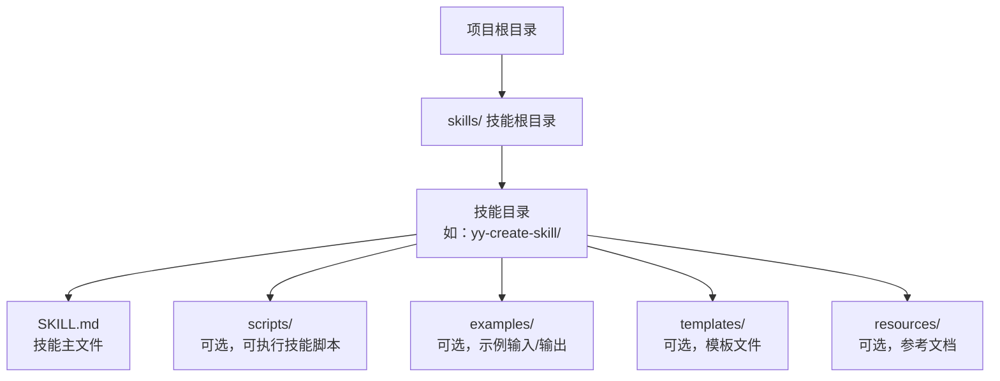
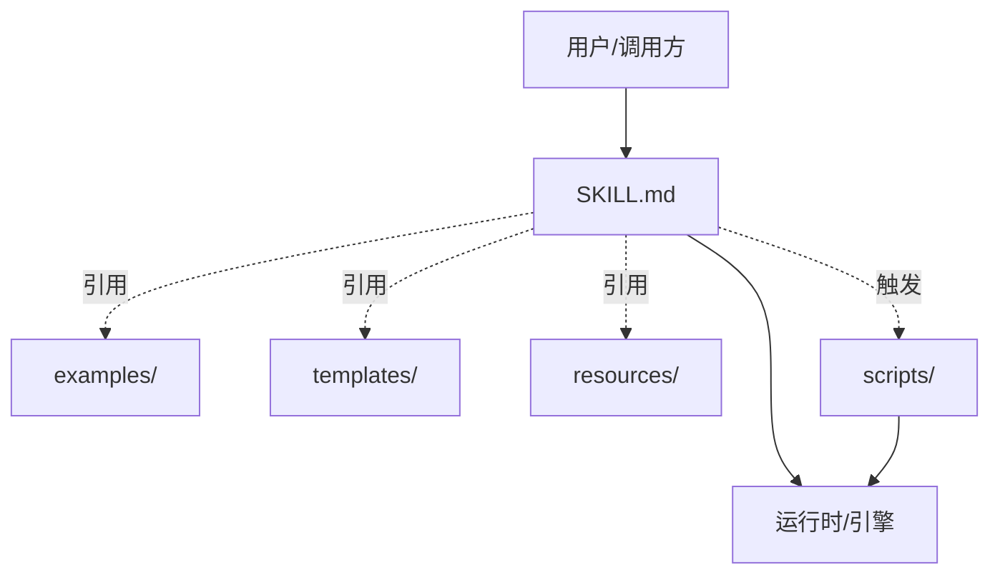
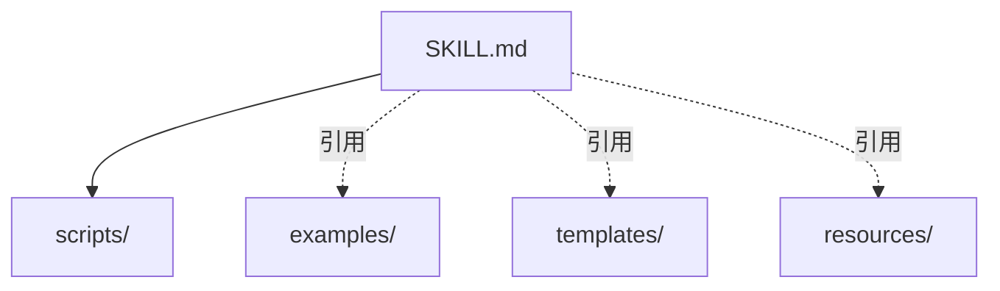

# 技能目录结构

<cite>
**本文引用的文件**
- [docs/STRUCTURE.md](file://docs/STRUCTURE.md)
- [skills/yy-create-skill/SKILL.md](file://skills/yy-create-skill/SKILL.md)
- [skills/yy-create-skill/resources/skill-guide.md](file://skills/yy-create-skill/resources/skill-guide.md)
- [skills/yy-create-skill/templates/skill-template.md](file://skills/yy-create-skill/templates/skill-template.md)
- [skills/yy-create-skill/examples/input.md](file://skills/yy-create-skill/examples/input.md)
- [skills/yy-create-skill/examples/output.md](file://skills/yy-create-skill/examples/output.md)
- [skills/yy-create-readme/SKILL.md](file://skills/yy-create-readme/SKILL.md)
- [skills/yy-create-readme/templates/readme-template.md](file://skills/yy-create-readme/templates/readme-template.md)
- [skills/yy-create-readme/resources/readme-writing-guide.md](file://skills/yy-create-readme/resources/readme-writing-guide.md)
- [skills/yy-mode-plan/SKILL.md](file://skills/yy-mode-plan/SKILL.md)
- [skills/yy-mode-plan/examples/input.md](file://skills/yy-mode-plan/examples/input.md)
- [skills/yy-mode-plan/examples/output.md](file://skills/yy-mode-plan/examples/output.md)
- [skills/yy-post-to-wechat/SKILL.md](file://skills/yy-post-to-wechat/SKILL.md)
- [skills/yy-post-to-wechat/scripts/package.json](file://skills/yy-post-to-wechat/scripts/package.json)
</cite>

## 目录
1. [简介](#简介)
2. [项目结构](#项目结构)
3. [核心组件](#核心组件)
4. [架构总览](#架构总览)
5. [详细组件分析](#详细组件分析)
6. [依赖关系分析](#依赖关系分析)
7. [性能考虑](#性能考虑)
8. [故障排查指南](#故障排查指南)
9. [结论](#结论)
10. [附录](#附录)

## 简介
本文件面向技能开发者，系统阐述“技能目录结构”的标准布局与规范，重点说明：
- 必需文件：SKILL.md
- 可选目录：scripts/、examples/、templates/、resources/
- 各目录的作用、文件要求与命名规范
- 辅助目录的创建条件与使用场景
- 目录结构与技能功能的关系
- 目录结构验证方法与常见错误排查

## 项目结构
仓库采用“技能根目录 + 多技能子目录”的组织方式，技能目录遵循统一的结构规范，便于自动化发现与复用。

图表来源
- [docs/STRUCTURE.md:1-10](file://docs/STRUCTURE.md#L1-L10)
- [skills/yy-create-skill/SKILL.md:197-213](file://skills/yy-create-skill/SKILL.md#L197-L213)

章节来源
- [docs/STRUCTURE.md:1-10](file://docs/STRUCTURE.md#L1-L10)

## 核心组件
- SKILL.md：技能主文件，定义技能名称、描述、使用场景、指令与相关资源。是技能被自动发现与触发的关键入口。
- scripts/：可选目录，存放可执行脚本与依赖配置。适用于需要外部程序或工具链参与的技能。
- examples/：可选目录，提供输入/输出示例，帮助用户理解技能的调用方式与期望结果。
- templates/：可选目录，存放生成模板文件。当 SKILL.md 中的模板内容过长或需要复用时，应迁移到该目录。
- resources/：可选目录，存放参考文档、写作指南、规范说明等，避免 SKILL.md 过于臃肿。

章节来源
- [skills/yy-create-skill/SKILL.md:197-213](file://skills/yy-create-skill/SKILL.md#L197-L213)
- [skills/yy-create-skill/resources/skill-guide.md:167-191](file://skills/yy-create-skill/resources/skill-guide.md#L167-L191)

## 架构总览
技能目录结构与技能功能的关系如下：
- 必需文件 SKILL.md 决定技能的“意图”与“边界”，用于自动触发与显式调用。
- 可选目录 examples/、templates/、resources/ 服务于“可发现性”“可复用性”“可维护性”。
- 可选目录 scripts/ 服务于“可执行性”，将复杂流程封装为脚本，降低调用门槛。

图表来源
- [skills/yy-create-skill/SKILL.md:188-196](file://skills/yy-create-skill/SKILL.md#L188-L196)
- [skills/yy-create-skill/resources/skill-guide.md:167-191](file://skills/yy-create-skill/resources/skill-guide.md#L167-L191)

## 详细组件分析

### SKILL.md：技能主文件
- 作用：定义技能名称、描述、使用场景、指令、输出约定、相关资源等。
- YAML frontmatter：仅允许 name 与 description 两个字段；description 使用折叠式语法，避免行内写法。
- 指令：步骤清晰、可执行，最后一步描述输出格式；隐含分支需显式化为规则。
- 一致性：与 examples/、templates/、resources/ 中的同一件事描述保持一致。
- 安全边界：涉及敏感操作时，明确禁止的行为需在文档中列出。

章节来源
- [skills/yy-create-skill/SKILL.md:1-213](file://skills/yy-create-skill/SKILL.md#L1-L213)
- [skills/yy-create-skill/resources/skill-guide.md:7-166](file://skills/yy-create-skill/resources/skill-guide.md#L7-L166)

### scripts/：可执行脚本目录
- 适用场景：技能需要外部程序、API 调用、文件转换、批量处理等。
- 文件要求：
  - 主执行脚本：遵循 kebab-case 命名（如 run-cli.mjs、wechat-api.ts）。
  - 依赖配置：scripts/package.json，包含 engines、scripts、dependencies、devDependencies 等。
- 调用方式：在技能文档中提供使用方法与参数说明，便于用户直接调用。

章节来源
- [skills/yy-create-skill/resources/skill-guide.md:187](file://skills/yy-create-skill/resources/skill-guide.md#L187)
- [skills/yy-post-to-wechat/SKILL.md:121-154](file://skills/yy-post-to-wechat/SKILL.md#L121-L154)
- [skills/yy-post-to-wechat/scripts/package.json:1-29](file://skills/yy-post-to-wechat/scripts/package.json#L1-L29)

### examples/：示例目录
- 适用场景：技能使用方式不够直观，需要输入/输出示例帮助理解。
- 文件要求：
  - input.md：展示用户如何请求技能。
  - output.md：展示技能执行后的预期结果或文件结构。
- 作用：提升技能的可发现性与可复用性，降低学习成本。

章节来源
- [skills/yy-create-skill/examples/input.md:1-41](file://skills/yy-create-skill/examples/input.md#L1-L41)
- [skills/yy-create-skill/examples/output.md:1-194](file://skills/yy-create-skill/examples/output.md#L1-L194)
- [skills/yy-mode-plan/examples/input.md:1-36](file://skills/yy-mode-plan/examples/input.md#L1-L36)
- [skills/yy-mode-plan/examples/output.md:1-102](file://skills/yy-mode-plan/examples/output.md#L1-L102)

### templates/：模板目录
- 适用场景：需要生成特定格式文件，且模板内容超过一定行数（计数规则：不含空行、代码块围栏行、YAML frontmatter 行）。
- 文件要求：模板文件命名清晰，语义明确；与 SKILL.md 的生成步骤一一对应。
- 作用：将 SKILL.md 中的模板内容迁移至独立文件，保持主文档简洁。

章节来源
- [skills/yy-create-skill/resources/skill-guide.md:189](file://skills/yy-create-skill/resources/skill-guide.md#L189)
- [skills/yy-create-readme/SKILL.md:116-120](file://skills/yy-create-readme/SKILL.md#L116-L120)
- [skills/yy-create-readme/templates/readme-template.md:1-73](file://skills/yy-create-readme/templates/readme-template.md#L1-L73)

### resources/：资源目录
- 适用场景：需要独立的参考文档、写作指南、规范说明等，避免 SKILL.md 过于臃肿。
- 文件要求：文档结构清晰、术语统一；与 SKILL.md 的描述保持一致。
- 作用：提升技能的可维护性与可扩展性。

章节来源
- [skills/yy-create-skill/resources/skill-guide.md:190](file://skills/yy-create-skill/resources/skill-guide.md#L190)
- [skills/yy-create-readme/SKILL.md:116-120](file://skills/yy-create-readme/SKILL.md#L116-L120)
- [skills/yy-create-readme/resources/readme-writing-guide.md:1-43](file://skills/yy-create-readme/resources/readme-writing-guide.md#L1-L43)

### 目录结构示例与命名规范
- 标准目录结构（示例）：
  - skill-name/
    - SKILL.md（必需）
    - scripts/（可选）
    - examples/（可选）
    - templates/（可选）
    - resources/（可选）

- 命名规范：
  - 目录与文件采用 kebab-case（短横线分隔的小写形式）。
  - 脚本文件遵循 kebab-case 命名（如 run-cli.mjs、wechat-api.ts）。
  - 路径分隔符使用正斜杠，路径包含空格时使用引号包裹。

章节来源
- [skills/yy-create-skill/resources/skill-guide.md:169-191](file://skills/yy-create-skill/resources/skill-guide.md#L169-L191)
- [skills/yy-create-skill/templates/skill-template.md:11-37](file://skills/yy-create-skill/templates/skill-template.md#L11-L37)

## 依赖关系分析
技能目录结构与各组件之间的依赖关系如下：

图表来源
- [skills/yy-create-skill/SKILL.md:188-196](file://skills/yy-create-skill/SKILL.md#L188-L196)
- [skills/yy-create-skill/resources/skill-guide.md:167-191](file://skills/yy-create-skill/resources/skill-guide.md#L167-L191)

章节来源
- [skills/yy-create-skill/SKILL.md:188-196](file://skills/yy-create-skill/SKILL.md#L188-L196)

## 性能考虑
- 目录结构本身不直接影响执行性能，但合理的结构有助于：
  - 自动发现与加载：SKILL.md 位于技能根目录，便于引擎快速定位。
  - 可复用性：templates/、resources/、examples/ 提升技能的可复用与可维护性。
  - 可执行性：scripts/ 将复杂流程封装为脚本，减少重复计算与逻辑耦合。

## 故障排查指南
- 常见错误与排查方法：
  - YAML frontmatter 不合法：检查 name 与 description 字段，确保使用折叠式语法。
  - description 过长或包含实现细节：将其拆分到 SKILL.md 的“指令”或“相关资源”中。
  - examples/、templates/、resources/ 与 SKILL.md 描述不一致：统一术语、步骤编号与规则。
  - scripts/ 命名不符合 kebab-case：修正文件名与依赖配置 scripts/package.json。
  - scripts/ 依赖缺失：检查 scripts/package.json 的 engines、scripts、dependencies、devDependencies。
  - 目录结构不规范：对照标准结构示例，补齐缺失目录或文件。

- 验收清单（摘自技能指南）：
  - 描述章节准确反映技能用途
  - description 精确反映技能用途，不会误触发
  - 使用场景明确（触发条件和不应触发场景）
  - 指令步骤完整可执行，最后一步描述输出格式
  - YAML 格式正确
  - 决策点显式化
  - 文件间一致性
  - 安全边界明确

章节来源
- [skills/yy-create-skill/resources/skill-guide.md:356-395](file://skills/yy-create-skill/resources/skill-guide.md#L356-L395)

## 结论
技能目录结构是技能可发现、可复用、可维护与可执行的基础。遵循“必需 SKILL.md + 可选 scripts/、examples/、templates/、resources/”的布局，配合严格的命名规范与验收清单，能够显著提升技能的质量与可用性。开发者应根据技能功能选择性启用辅助目录，并在 SKILL.md 中清晰表达触发条件、指令与输出约定。

## 附录
- 相关资源与示例：
  - 技能模板：见 templates/skill-template.md
  - 技能指南：见 resources/skill-guide.md
  - 输入/输出示例：见 examples/input.md、examples/output.md
  - README 模板与写作指南：见 templates/readme-template.md、resources/readme-writing-guide.md
  - 可执行技能示例：见 yy-post-to-wechat/SKILL.md、scripts/package.json

章节来源
- [skills/yy-create-skill/templates/skill-template.md:1-37](file://skills/yy-create-skill/templates/skill-template.md#L1-L37)
- [skills/yy-create-skill/resources/skill-guide.md:1-395](file://skills/yy-create-skill/resources/skill-guide.md#L1-L395)
- [skills/yy-create-skill/examples/input.md:1-41](file://skills/yy-create-skill/examples/input.md#L1-L41)
- [skills/yy-create-skill/examples/output.md:1-194](file://skills/yy-create-skill/examples/output.md#L1-L194)
- [skills/yy-create-readme/templates/readme-template.md:1-73](file://skills/yy-create-readme/templates/readme-template.md#L1-L73)
- [skills/yy-create-readme/resources/readme-writing-guide.md:1-43](file://skills/yy-create-readme/resources/readme-writing-guide.md#L1-L43)
- [skills/yy-post-to-wechat/SKILL.md:121-154](file://skills/yy-post-to-wechat/SKILL.md#L121-L154)
- [skills/yy-post-to-wechat/scripts/package.json:1-29](file://skills/yy-post-to-wechat/scripts/package.json#L1-L29)