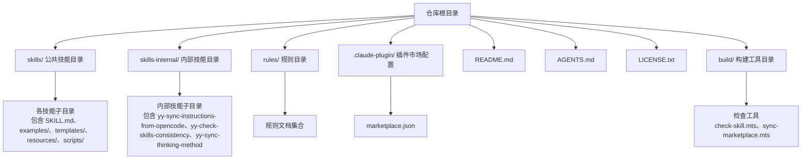
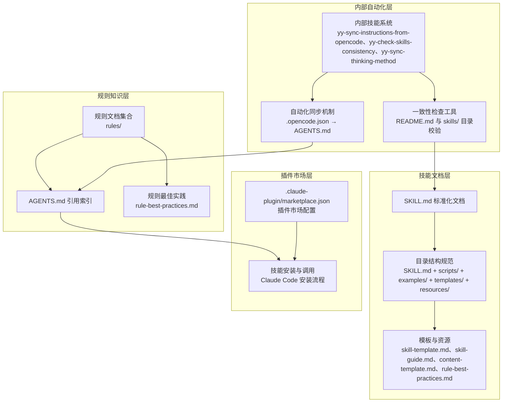
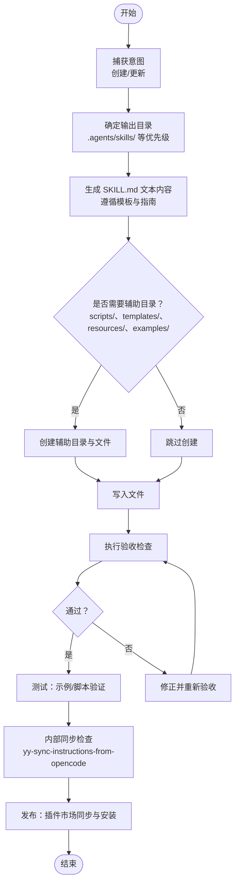
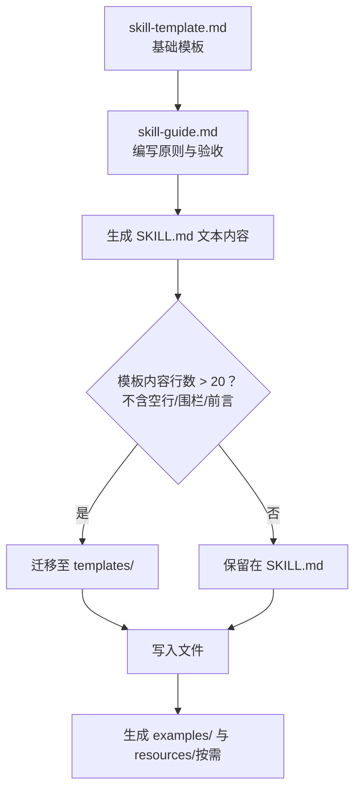
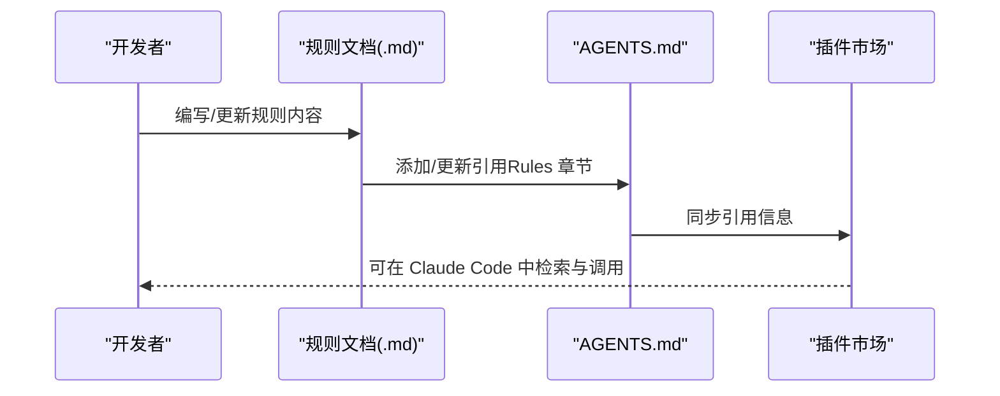
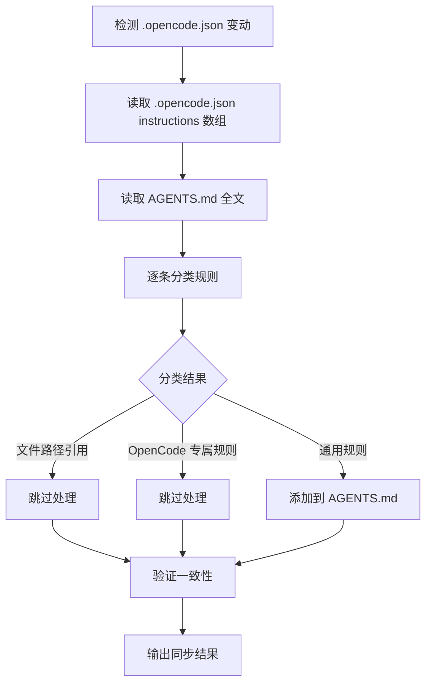
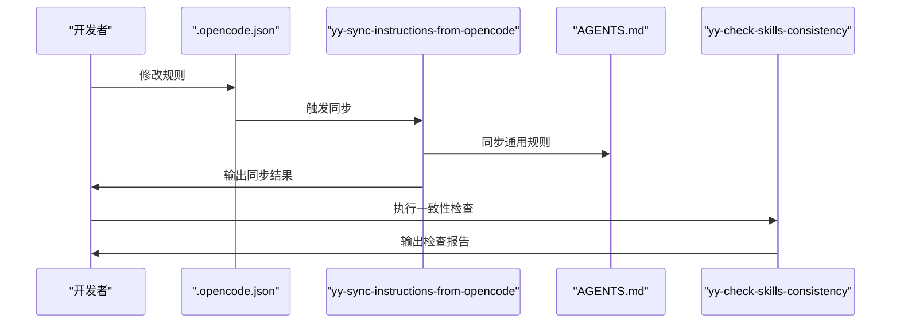
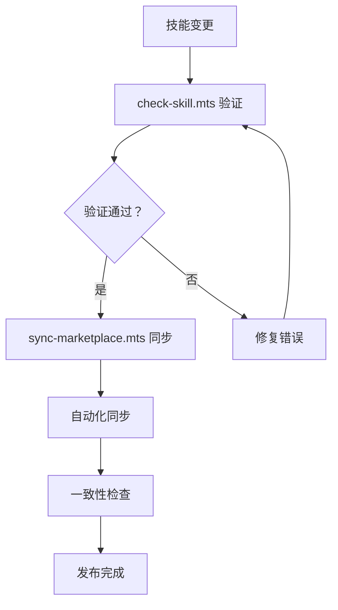
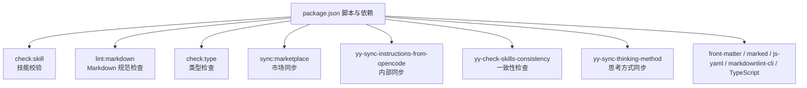

# 技能系统

<cite>
**本文引用的文件**
- [skills/yy-create-skill/SKILL.md](file://skills/yy-create-skill/SKILL.md)
- [skills/yy-create-readme/SKILL.md](file://skills/yy-create-readme/SKILL.md)
- [skills/yy-create-rule/SKILL.md](file://skills/yy-create-rule/SKILL.md)
- [skills/yy-create-skill/templates/skill-template.md](file://skills/yy-create-skill/templates/skill-template.md)
- [skills/yy-create-skill/resources/skill-guide.md](file://skills/yy-create-skill/resources/skill-guide.md)
- [skills/yy-create-rule/resources/content-template.md](file://skills/yy-create-rule/resources/content-template.md)
- [skills/yy-create-rule/resources/rule-best-practices.md](file://skills/yy-create-rule/resources/rule-best-practices.md)
- [skills/yy-create-skill/examples/input.md](file://skills/yy-create-skill/examples/input.md)
- [skills/yy-create-skill/examples/output.md](file://skills/yy-create-skill/examples/output.md)
- [skills-internal/yy-sync-instructions-from-opencode/SKILL.md](file://skills-internal/yy-sync-instructions-from-opencode/SKILL.md)
- [skills-internal/yy-check-skills-consistency/SKILL.md](file://skills-internal/yy-check-skills-consistency/SKILL.md)
- [skills-internal/yy-sync-thinking-method/SKILL.md](file://skills-internal/yy-sync-thinking-method/SKILL.md)
- [AGENTS.md](file://AGENTS.md)
- [package.json](file://package.json)
- [build/check-skill.mts](file://build/check-skill.mts)
- [build/sync-marketplace.mts](file://build/sync-marketplace.mts)
- [docs/STRUCTURE.md](file://docs/STRUCTURE.md)
- [docs/DEVELOP.md](file://docs/DEVELOP.md)
- [docs/CLAUDE_CODE_SKILL.md](file://docs/CLAUDE_CODE_SKILL.md)
</cite>

## 更新摘要
**所做更改**
- 新增内部技能功能章节，详细介绍 `yy-sync-instructions-from-opencode` 技能
- 更新自动化能力章节，说明双向同步机制
- 新增内部技能目录结构说明
- 更新技能生命周期管理，增加内部技能的同步流程
- 新增自动化质量保证机制

## 目录
1. [简介](#简介)
2. [项目结构](#项目结构)
3. [核心组件](#核心组件)
4. [架构总览](#架构总览)
5. [详细组件分析](#详细组件分析)
6. [内部技能功能](#内部技能功能)
7. [自动化能力](#自动化能力)
8. [依赖分析](#依赖分析)
9. [性能考虑](#性能考虑)
10. [故障排查指南](#故障排查指南)
11. [结论](#结论)
12. [附录](#附录)

## 简介
本技能系统围绕"可按需加载的任务说明书"这一核心理念构建，强调自动发现、精确触发、明确边界、指令清晰与决策显式化五大原则。系统通过标准化的 SKILL.md 文件格式、严格的目录结构规范以及完善的模板与资源体系，支撑从创建、测试到发布的完整生命周期管理。同时，系统提供规则文档（Rules）与技能文档协同的知识沉淀机制，便于 AI 助手在不同场景下高效复用与扩展。

**更新** 新增内部技能功能，实现从 `.opencode.json` 到 `AGENTS.md` 的智能同步机制，增强技能系统的自动化能力。

## 项目结构
仓库采用"公共技能 + 私有技能"的双层目录组织方式，配合规则目录与插件市场配置，形成可扩展的知识与能力体系。新增的内部技能目录专门用于维护系统级的自动化功能。

**图表来源**
- [docs/STRUCTURE.md:1-10](file://docs/STRUCTURE.md#L1-L10)
- [skills-internal/yy-sync-instructions-from-opencode/SKILL.md:1-73](file://skills-internal/yy-sync-instructions-from-opencode/SKILL.md#L1-L73)

**章节来源**
- [docs/STRUCTURE.md:1-10](file://docs/STRUCTURE.md#L1-L10)

## 核心组件
- 技能主文件 SKILL.md：定义技能元数据（name、description）、使用场景、指令步骤、相关资源与验收清单，是技能被自动发现与精确触发的关键载体。
- 目录结构规范：统一的目录布局（SKILL.md、scripts/、examples/、templates/、resources/），确保技能可执行性与可维护性。
- 模板与资源：提供技能与规则的编写模板、最佳实践与交互设计原则，保障内容一致性与质量。
- 规则系统：与 AGENTS.md 协同，将项目规范、最佳实践与经验教训沉淀为可检索的知识库，供 AI 后续参考。
- **内部技能系统**：新增的内部技能目录，包含自动化同步、一致性检查等系统级功能，确保知识库的完整性和一致性。

**更新** 新增内部技能系统，提供自动化质量保证和知识同步能力。

**章节来源**
- [skills/yy-create-skill/SKILL.md:1-213](file://skills/yy-create-skill/SKILL.md#L1-L213)
- [skills/yy-create-skill/resources/skill-guide.md:167-191](file://skills/yy-create-skill/resources/skill-guide.md#L167-L191)
- [skills/yy-create-rule/SKILL.md:1-133](file://skills/yy-create-rule/SKILL.md#L1-L133)
- [skills-internal/yy-sync-instructions-from-opencode/SKILL.md:1-73](file://skills-internal/yy-sync-instructions-from-opencode/SKILL.md#L1-L73)

## 架构总览
技能系统由"技能文档层""规则知识层""插件市场层"和"内部自动化层"四部分组成，通过标准化的 SKILL.md 与规则文档实现知识的结构化与可检索化，借助插件市场实现技能的分发与复用，内部自动化层确保知识库的一致性和完整性。

**图表来源**
- [skills/yy-create-skill/SKILL.md:197-213](file://skills/yy-create-skill/SKILL.md#L197-L213)
- [skills/yy-create-rule/SKILL.md:127-133](file://skills/yy-create-rule/SKILL.md#L127-L133)
- [docs/CLAUDE_CODE_SKILL.md:1-10](file://docs/CLAUDE_CODE_SKILL.md#L1-L10)
- [skills-internal/yy-sync-instructions-from-opencode/SKILL.md:10-53](file://skills-internal/yy-sync-instructions-from-opencode/SKILL.md#L10-L53)

## 详细组件分析

### SKILL.md 标准格式与字段规范
- 必需字段
  - name：技能名称，采用 kebab-case 命名，体现"动宾结构 + 单数名词"的规范。
  - description：技能用途与触发场景的简要描述，使用 YAML 折叠式语法（>），控制在 2-3 句话内，避免混入实现细节。
- 可选字段
  - 其他字段（如 version、author、tags）不在当前规范范围内，应保持最小元数据集。
- 章节结构
  - 描述：用 1-2 句话准确反映技能核心作用，帮助 AI 理解技能用途。
  - 使用场景：明确触发条件与不应触发场景，限定技能边界。
  - 指令：清晰的分步说明，最后一步描述输出格式；隐含分支应显式化为规则。
  - 相关资源：列出 examples/、templates/、resources/ 等辅助文件，便于理解与复用。
- 验收清单
  - 通用检查项：描述准确性、触发精确性、场景明确性、指令完整性、YAML 格式正确性、决策显式化、文件一致性、安全边界。
  - 创建后检查项：命名规范、语言风格、示例规范、模板内容迁移、脚本依赖配置。
  - 更新后检查项：description 与执行细节分离、辅助文件同步更新。

**章节来源**
- [skills/yy-create-skill/SKILL.md:99-129](file://skills/yy-create-skill/SKILL.md#L99-L129)
- [skills/yy-create-skill/SKILL.md:148-177](file://skills/yy-create-skill/SKILL.md#L148-L177)
- [skills/yy-create-skill/resources/skill-guide.md:5-14](file://skills/yy-create-skill/resources/skill-guide.md#L5-L14)
- [skills/yy-create-skill/resources/skill-guide.md:27-44](file://skills/yy-create-skill/resources/skill-guide.md#L27-L44)
- [skills/yy-create-skill/resources/skill-guide.md:356-395](file://skills/yy-create-skill/resources/skill-guide.md#L356-L395)

### 技能生命周期管理
- 创建
  - 意图捕获：区分"创建新技能"与"更新现有技能"，通过引导问题补齐信息。
  - 目录与输出：确定技能目录（优先级：.agents/skills/ > .claude/skills/ > .opencode/skills/ > .trae/skills/ > skills/），按需生成 SKILL.md 与辅助目录。
  - 内容生成：遵循模板与指南，生成 SKILL.md 文本内容，必要时创建 examples/、templates/、resources/、scripts/。
  - 验收：执行通用与创建后检查项，确保格式、命名、示例、模板迁移与脚本依赖合规。
- 测试
  - 示例驱动：提供 examples/input.md 与 examples/output.md，验证输入到输出的映射关系。
  - 脚本集成：可执行技能通过 scripts/ 与 package.json 管理依赖，结合本地调试命令进行验证。
- 发布
  - 插件市场：通过 marketplace.json 配置市场分组，使用 Claude Code 安装流程完成技能分发与调用。
  - 版本与同步：通过脚本同步市场信息，确保技能清单与实际内容一致。

**图表来源**
- [skills/yy-create-skill/SKILL.md:36-89](file://skills/yy-create-skill/SKILL.md#L36-L89)
- [skills/yy-create-skill/SKILL.md:130-177](file://skills/yy-create-skill/SKILL.md#L130-L177)
- [skills/yy-create-skill/examples/input.md:1-41](file://skills/yy-create-skill/examples/input.md#L1-L41)
- [skills/yy-create-skill/examples/output.md:1-194](file://skills/yy-create-skill/examples/output.md#L1-L194)
- [docs/CLAUDE_CODE_SKILL.md:1-10](file://docs/CLAUDE_CODE_SKILL.md#L1-L10)
- [skills-internal/yy-sync-instructions-from-opencode/SKILL.md:14-23](file://skills-internal/yy-sync-instructions-from-opencode/SKILL.md#L14-L23)

**章节来源**
- [skills/yy-create-skill/SKILL.md:34-177](file://skills/yy-create-skill/SKILL.md#L34-L177)
- [skills/yy-create-skill/examples/input.md:1-41](file://skills/yy-create-skill/examples/input.md#L1-L41)
- [skills/yy-create-skill/examples/output.md:1-194](file://skills/yy-create-skill/examples/output.md#L1-L194)
- [docs/CLAUDE_CODE_SKILL.md:1-10](file://docs/CLAUDE_CODE_SKILL.md#L1-L10)

### 技能模板系统与文件生成机制
- 模板结构
  - 基础模板提供 SKILL.md 的章节骨架与编写指引，参考 skill-template.md。
  - 指南文档 skill-guide.md 提供 YAML frontmatter、description、使用场景、指令、决策显式化、文件一致性、安全边界等编写原则与验收清单。
- 文件生成策略
  - 默认仅生成 SKILL.md；当模板内容超过阈值（实际内容行 > 20 行，不含空行、代码块围栏与 YAML frontmatter 行）时，自动迁移至 templates/。
  - examples/、resources/、scripts/ 的创建遵循"按需生成"原则，避免冗余目录。
- 示例与输出
  - examples/input.md 展示典型输入示例，examples/output.md 展示预期输出示例，便于测试与回归。

**图表来源**
- [skills/yy-create-skill/templates/skill-template.md:1-37](file://skills/yy-create-skill/templates/skill-template.md#L1-L37)
- [skills/yy-create-skill/resources/skill-guide.md:78-150](file://skills/yy-create-skill/resources/skill-guide.md#L78-L150)
- [skills/yy-create-skill/SKILL.md:80-89](file://skills/yy-create-skill/SKILL.md#L80-L89)

**章节来源**
- [skills/yy-create-skill/templates/skill-template.md:1-37](file://skills/yy-create-skill/templates/skill-template.md#L1-L37)
- [skills/yy-create-skill/resources/skill-guide.md:78-150](file://skills/yy-create-skill/resources/skill-guide.md#L78-L150)
- [skills/yy-create-skill/SKILL.md:74-89](file://skills/yy-create-skill/SKILL.md#L74-L89)

### 规则系统与知识沉淀
- 规则文档编写
  - 使用 content-template.md 的结构模板，提供章节标题、要点描述、代码示例与注意事项的标准化格式。
  - rule-best-practices.md 提供面向 AI 的编写原则、语言规范、一致性与引用格式。
- AGENTS.md 引用
  - 当创建新规则文档时，自动在 AGENTS.md 的 Rules 章节中添加引用，确保 AI 能够检索到最新知识。
- 与技能的协同
  - 规则文档沉淀项目规范与经验，技能文档承载可执行流程，二者共同构成"知识库 + 能力库"的复合体系。

**图表来源**
- [skills/yy-create-rule/resources/content-template.md:1-122](file://skills/yy-create-rule/resources/content-template.md#L1-L122)
- [skills/yy-create-rule/resources/rule-best-practices.md:65-79](file://skills/yy-create-rule/resources/rule-best-practices.md#L65-L79)
- [skills/yy-create-rule/SKILL.md:83-104](file://skills/yy-create-rule/SKILL.md#L83-L104)

**章节来源**
- [skills/yy-create-rule/resources/content-template.md:1-122](file://skills/yy-create-rule/resources/content-template.md#L1-L122)
- [skills/yy-create-rule/resources/rule-best-practices.md:1-92](file://skills/yy-create-rule/resources/rule-best-practices.md#L1-L92)
- [skills/yy-create-rule/SKILL.md:29-104](file://skills/yy-create-rule/SKILL.md#L29-L104)

### 目录结构规范与最佳实践
- 目录结构
  - 必需：SKILL.md
  - 可选：scripts/（主执行脚本与依赖配置）、examples/（输入/输出示例）、templates/（模板文件）、resources/（参考文档）
- 命名规范
  - kebab-case 命名，优先动宾结构与单数名词，确保语义清晰与跨平台兼容。
- 交互设计
  - 默认采用常见策略，仅在用户明确要求时提供选项；引导问题聚焦核心；支持快速模式跳过确认。
- 质量要求
  - SKILL.md 控制在 500 行以内，超出内容迁移至 resources；使用祈使语气与中文描述；示例包含语言标签。

**章节来源**
- [skills/yy-create-skill/resources/skill-guide.md:167-191](file://skills/yy-create-skill/resources/skill-guide.md#L167-L191)
- [skills/yy-create-skill/resources/skill-guide.md:192-264](file://skills/yy-create-skill/resources/skill-guide.md#L192-L264)
- [skills/yy-create-skill/resources/skill-guide.md:386-395](file://skills/yy-create-skill/resources/skill-guide.md#L386-L395)

### 不同类型技能的实现示例
- 简单技能：如代码格式化，强调触发条件与输出格式，避免复杂分支。
- 带模板技能：如生成 README，通过 templates/ 提供结构化模板，SKILL.md 聚焦流程与边界。
- 复杂技能：如 API 测试，包含多步骤、示例与报告模板，强调决策显式化与安全边界。
- 更新技能：通过 examples/output.md 展示更新前后对比，验证 description 精确性与文件一致性。

**章节来源**
- [skills/yy-create-skill/examples/output.md:5-194](file://skills/yy-create-skill/examples/output.md#L5-L194)
- [skills/yy-create-readme/SKILL.md:1-120](file://skills/yy-create-readme/SKILL.md#L1-L120)
- [skills/yy-create-rule/SKILL.md:1-133](file://skills/yy-create-rule/SKILL.md#L1-L133)

### 技能依赖关系与组合使用
- 依赖关系
  - 技能之间可通过 examples/ 与 templates/ 的引用建立间接依赖；更新 SKILL.md 时需同步检查辅助文件引用一致性。
  - 可执行技能通过 scripts/ 与 package.json 管理外部依赖，确保可移植性与可维护性。
- 组合使用
  - 将多个简单技能组合为复合流程，利用 examples/ 展示端到端用例；在 SKILL.md 中明确步骤间的输入输出契约与边界条件。

**章节来源**
- [skills/yy-create-skill/SKILL.md:121-129](file://skills/yy-create-skill/SKILL.md#L121-L129)
- [skills/yy-create-skill/resources/skill-guide.md:126-150](file://skills/yy-create-skill/resources/skill-guide.md#L126-L150)

### 高级扩展：自定义技能类型与插件开发
- 自定义技能类型
  - 在 templates/ 中扩展模板，定义新的章节与约束；在 resources/ 中沉淀最佳实践与验收清单。
  - 通过 examples/ 提供典型输入/输出，确保新类型的可测试性与可复用性。
- 插件开发
  - 使用 scripts/ 与 package.json 管理可执行逻辑；通过 marketplace.json 配置市场分组；遵循 CLAUDE_CODE_SKILL.md 的安装流程完成分发。

**章节来源**
- [skills/yy-create-skill/templates/skill-template.md:1-37](file://skills/yy-create-skill/templates/skill-template.md#L1-L37)
- [skills/yy-create-skill/resources/skill-guide.md:167-191](file://skills/yy-create-skill/resources/skill-guide.md#L167-L191)
- [docs/CLAUDE_CODE_SKILL.md:1-10](file://docs/CLAUDE_CODE_SKILL.md#L1-L10)

## 内部技能功能

### 内部技能系统概述
内部技能系统是技能系统的重要组成部分，专门用于维护系统级的自动化功能。这些技能不对外公开，但对维持知识库的完整性和一致性至关重要。

**更新** 新增内部技能系统，包含三个核心技能：规则同步、一致性检查和思考方式同步。

### yy-sync-instructions-from-opencode 技能
这是新增的核心内部技能，实现了从 `.opencode.json` 到 `AGENTS.md` 的智能同步机制。

#### 功能特性
- **双向同步机制**：确保通用规则不会仅存在于 `.opencode.json` 而缺失于 `AGENTS.md`
- **智能分类**：自动识别文件路径引用、OpenCode 专属规则和通用规则
- **单向同步**：`.opencode.json` → `AGENTS.md`，保护源文件不被意外修改
- **完整性验证**：同步后自动验证规则一致性

#### 规则分类机制
技能会将 `.opencode.json` 中的 `instructions` 数组按以下规则分类：

1. **文件路径引用**（以 `./` 开头或匹配已知文件名如 `AGENTS.md`）：跳过，AGENTS.md 已通过 `@` 语法引用
2. **OpenCode 专属规则**：跳过，这类规则仅适用于 OpenCode 环境
3. **通用规则**：需要同步到 AGENTS.md 的规则

#### 同步流程

**图表来源**
- [skills-internal/yy-sync-instructions-from-opencode/SKILL.md:26-53](file://skills-internal/yy-sync-instructions-from-opencode/SKILL.md#L26-L53)

**章节来源**
- [skills-internal/yy-sync-instructions-from-opencode/SKILL.md:1-73](file://skills-internal/yy-sync-instructions-from-opencode/SKILL.md#L1-L73)

### yy-check-skills-consistency 技能
负责检查 README.md 中的技能列表与实际 skills/ 目录内容的一致性。

#### 核心功能
- **字母顺序检查**：验证 README.md 中的技能列表是否按字母顺序排序
- **内容一致性检查**：比较 README.md 与 skills/ 目录的实际内容
- **自动修复**：支持自动修复排序问题和内容不一致问题

**章节来源**
- [skills-internal/yy-check-skills-consistency/SKILL.md:1-93](file://skills-internal/yy-check-skills-consistency/SKILL.md#L1-L93)

### yy-sync-thinking-method 技能
同步维护"AI 思考方式"在多个文件中的一致性。

#### 关联文件
- `AGENTS.md`（权威来源）
- `skills/yy-init/templates/agents-minimal-template.md`（模板副本）
- `skills/yy-optimize/SKILL.md`（适配版本）

#### 同步规则
- AGENTS.md 与模板文件的 `## AI 思考方式` 章节内容必须完全一致
- yy-optimize 中是思考方式的应用适配，需要与权威来源保持对应关系

**章节来源**
- [skills-internal/yy-sync-thinking-method/SKILL.md:1-74](file://skills-internal/yy-sync-thinking-method/SKILL.md#L1-L74)

## 自动化能力

### 内部同步机制
内部技能系统通过自动化流程确保知识库的完整性和一致性，减少人工维护成本。

#### 自动化流程

**图表来源**
- [skills-internal/yy-sync-instructions-from-opencode/SKILL.md:14-23](file://skills-internal/yy-sync-instructions-from-opencode/SKILL.md#L14-L23)
- [AGENTS.md:20-22](file://AGENTS.md#L20-L22)

### 质量保证机制
系统通过多种自动化工具确保技能质量和知识库的完整性。

#### 构建工具
- **check-skill.mts**：验证 SKILL.md 文件格式和元数据一致性
- **sync-marketplace.mts**：同步 marketplace.json 与实际技能目录
- **convert-crlf-to-lf.ts**：统一换行符格式

#### 质量检查流程

**图表来源**
- [build/check-skill.mts:177-230](file://build/check-skill.mts#L177-L230)
- [build/sync-marketplace.mts:31-84](file://build/sync-marketplace.mts#L31-L84)

**章节来源**
- [build/check-skill.mts:1-230](file://build/check-skill.mts#L1-L230)
- [build/sync-marketplace.mts:1-93](file://build/sync-marketplace.mts#L1-L93)
- [package.json:7-16](file://package.json#L7-L16)

## 依赖分析
- 工具链与脚本
  - 通过 package.json 的脚本实现技能校验、Markdown 规范检查、类型检查与市场同步。
  - 新增内部技能的自动化同步功能，通过 AGENTS.md 中的改动检查项触发。
- 外部依赖
  - front-matter 与 marked 用于解析与渲染 Markdown；js-yaml 用于 YAML 处理；markdownlint-cli 与 TypeScript 用于质量保障。
- 内部依赖
  - 内部技能相互协作，形成完整的自动化质量保证体系。

**图表来源**
- [package.json:7-16](file://package.json#L7-L16)
- [package.json:41-44](file://package.json#L41-L44)
- [skills-internal/yy-sync-instructions-from-opencode/SKILL.md:14-23](file://skills-internal/yy-sync-instructions-from-opencode/SKILL.md#L14-L23)

**章节来源**
- [package.json:1-46](file://package.json#L1-L46)

## 性能考虑
- 内容规模控制：SKILL.md 控制在 500 行以内，超出内容迁移至 resources/，降低解析与检索成本。
- 模板阈值：模板内容超过阈值时迁移至 templates/，减少 SKILL.md 的体积与复杂度。
- 交互轮次优化：默认采用常见策略，减少不必要的用户确认与引导问题，提升执行效率。
- **内部同步优化**：内部技能采用增量同步机制，仅处理发生变化的规则，提高同步效率。

**更新** 新增内部同步优化，通过增量处理提高同步效率。

## 故障排查指南
- YAML frontmatter 解析错误
  - 使用折叠式（>）或保留式（|）语法处理长段落，避免将长描述放在一行。
- 触发误判
  - 精确描述 description，限定触发条件；避免在 description 中混入实现细节。
- 文件一致性问题
  - 检查 SKILL.md 与 examples/、templates/、resources/ 的步骤编号、章节名称与术语一致性。
- 安全边界缺失
  - 涉及敏感操作的技能需明确禁止行为，防止越界执行。
- **内部同步问题**
  - 检查 `.opencode.json` 格式是否正确，确保 `instructions` 数组格式规范。
  - 验证 AGENTS.md 的 `## 需要遵守的规则` 章节格式，确保同步目标正确。
  - 使用 `yy-check-skills-consistency` 技能检查 README.md 与 skills/ 目录的一致性。
- 本地调试与安装
  - 使用本地调试命令添加技能；注意忽略文件（skills-lock.json、.agents/skills/）避免提交到仓库。

**更新** 新增内部同步问题排查指南。

**章节来源**
- [skills/yy-create-skill/resources/skill-guide.md:5-26](file://skills/yy-create-skill/resources/skill-guide.md#L5-L26)
- [skills/yy-create-skill/resources/skill-guide.md:27-44](file://skills/yy-create-skill/resources/skill-guide.md#L27-L44)
- [skills/yy-create-skill/resources/skill-guide.md:126-150](file://skills/yy-create-skill/resources/skill-guide.md#L126-L150)
- [docs/DEVELOP.md:8-18](file://docs/DEVELOP.md#L8-L18)
- [docs/CLAUDE_CODE_SKILL.md:1-10](file://docs/CLAUDE_CODE_SKILL.md#L1-L10)
- [skills-internal/yy-sync-instructions-from-opencode/SKILL.md:14-23](file://skills-internal/yy-sync-instructions-from-opencode/SKILL.md#L14-L23)

## 结论
本技能系统通过标准化的 SKILL.md 格式、严格的目录结构与模板资源体系，实现了从创建、测试到发布的闭环管理。新增的内部技能功能进一步增强了系统的自动化能力，通过 `yy-sync-instructions-from-opencode` 实现了从 `.opencode.json` 到 `AGENTS.md` 的智能同步机制，确保知识库的完整性和一致性。规则系统与 AGENTS.md 的协同进一步强化了知识沉淀与检索能力。遵循命名规范、交互设计与质量要求，可确保技能具备高可读性、可维护性与可复用性；通过插件市场与本地调试流程，实现技能的高效分发与迭代。

**更新** 新结论强调内部技能系统的价值，特别是规则同步和一致性检查功能对系统整体质量的贡献。

## 附录
- 本地开发调试
  - 在仓库根目录执行本地添加命令，调试 skills/ 目录下的技能；注意忽略文件不要提交到 Git。
  - **内部技能调试**：使用 `yy-sync-instructions-from-opencode`、`yy-check-skills-consistency`、`yy-sync-thinking-method` 等内部技能进行自动化测试。
- 插件市场安装
  - 通过 Claude Code 的插件市场添加 open-skills 并安装所需技能，重启后即可通过技能名调用。
- **自动化流程**
  - 在 AGENTS.md 的改动检查项中，确保 `.opencode.json` 有改动时自动执行 `yy-sync-instructions-from-opencode` 技能。

**更新** 新增内部技能调试和自动化流程说明。

**章节来源**
- [docs/DEVELOP.md:8-18](file://docs/DEVELOP.md#L8-L18)
- [docs/CLAUDE_CODE_SKILL.md:1-10](file://docs/CLAUDE_CODE_SKILL.md#L1-L10)
- [AGENTS.md:20-22](file://AGENTS.md#L20-L22)