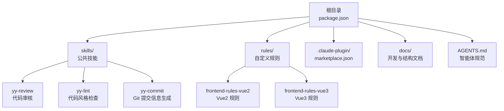
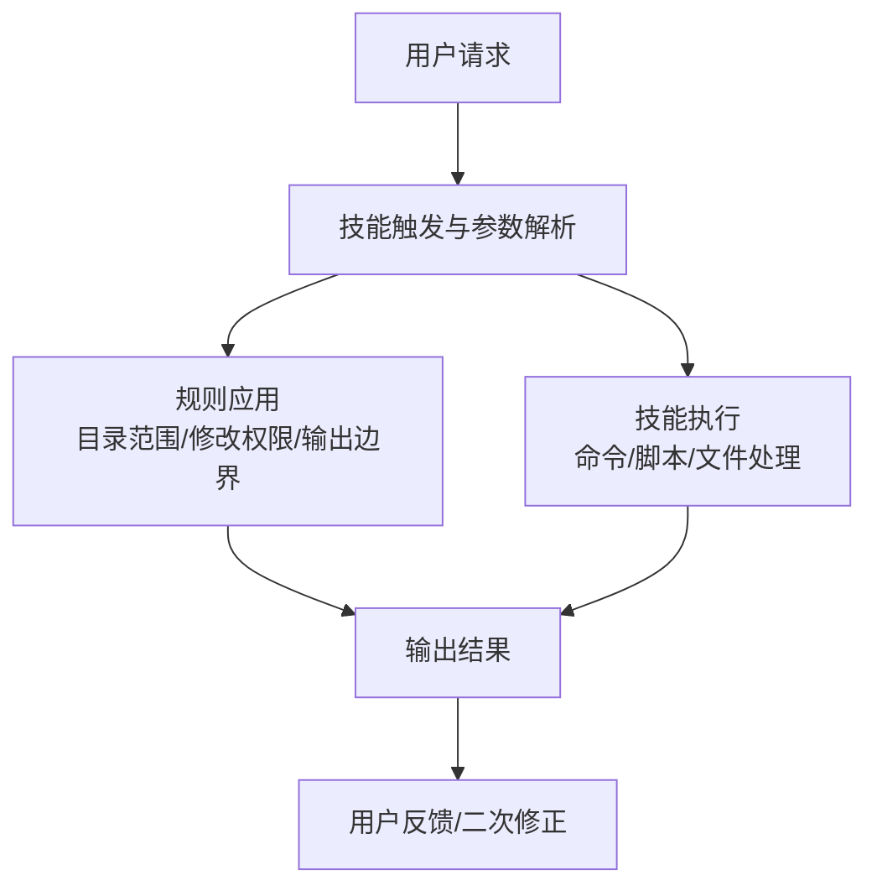
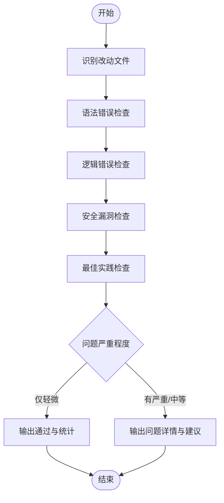
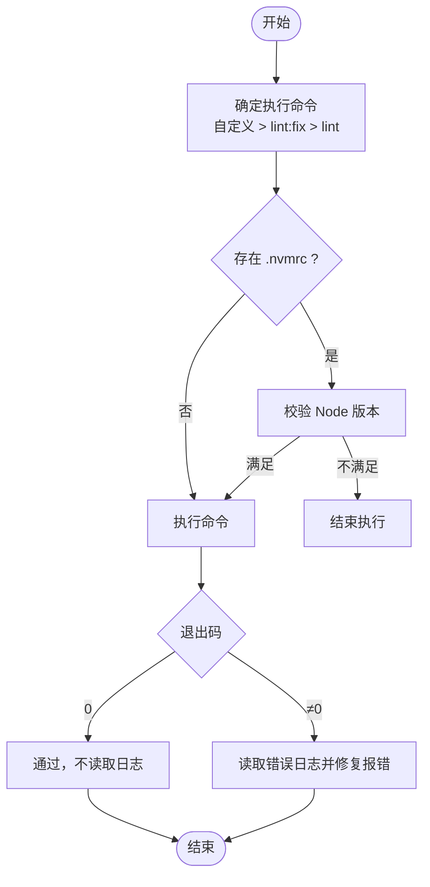
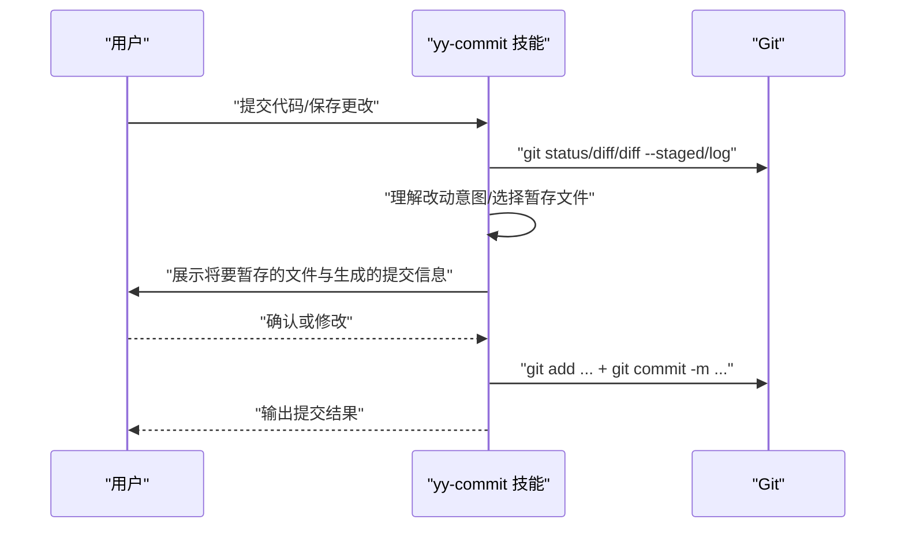
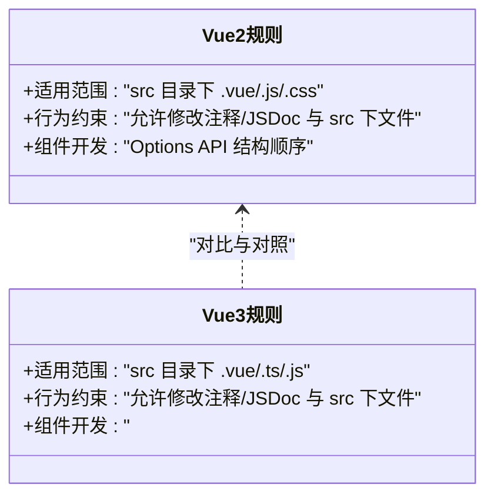
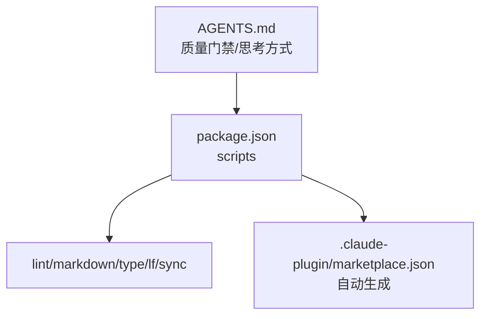

# 使用问题

<cite>
**本文引用的文件**
- [package.json](file://package.json)
- [AGENTS.md](file://AGENTS.md)
- [docs/DEVELOP.md](file://docs/DEVELOP.md)
- [docs/STRUCTURE.md](file://docs/STRUCTURE.md)
- [skills/yy-review/SKILL.md](file://skills/yy-review/SKILL.md)
- [skills/yy-lint/SKILL.md](file://skills/yy-lint/SKILL.md)
- [skills/yy-commit/SKILL.md](file://skills/yy-commit/SKILL.md)
- [rules/frontend-rules-vue2/RULE.md](file://rules/frontend-rules-vue2/RULE.md)
- [rules/frontend-rules-vue3/RULE.md](file://rules/frontend-rules-vue3/RULE.md)
- [rules/frontend-rules-vue2/references/ai-behavior.md](file://rules/frontend-rules-vue2/references/ai-behavior.md)
- [rules/frontend-rules-vue2/references/component-dev.md](file://rules/frontend-rules-vue2/references/component-dev.md)
- [rules/frontend-rules-vue3/references/ai-behavior.md](file://rules/frontend-rules-vue3/references/ai-behavior.md)
- [rules/frontend-rules-vue3/references/component-dev.md](file://rules/frontend-rules-vue3/references/component-dev.md)
- [.claude-plugin/marketplace.json](file://.claude-plugin/marketplace.json)
</cite>

## 目录
1. [简介](#简介)
2. [项目结构](#项目结构)
3. [核心组件](#核心组件)
4. [架构总览](#架构总览)
5. [详细组件分析](#详细组件分析)
6. [依赖分析](#依赖分析)
7. [性能考量](#性能考量)
8. [故障排除指南](#故障排除指南)
9. [结论](#结论)
10. [附录](#附录)

## 简介
本文件面向使用者与维护者，系统梳理在调用技能、应用规则、前端代码审核等使用过程中可能遇到的常见问题，并提供可操作的故障排除方法。重点覆盖以下方面：
- 技能调用失败与触发异常
- 规则应用异常与范围限制
- 前端代码审核不通过与误判
- 参数传递错误的诊断与修复
- 各类技能的正确使用方法与常见误用场景
- 调试模式的启用与使用技巧

## 项目结构
该项目采用“技能 + 规则 + 市场配置”的分层组织方式，便于在不同项目中复用与扩展。

图表来源
- [docs/STRUCTURE.md:1-10](file://docs/STRUCTURE.md#L1-L10)
- [AGENTS.md:35-44](file://AGENTS.md#L35-L44)

章节来源
- [docs/STRUCTURE.md:1-10](file://docs/STRUCTURE.md#L1-L10)
- [AGENTS.md:35-44](file://AGENTS.md#L35-L44)

## 核心组件
- 技能层：提供具体能力，如代码审核、风格检查、提交信息生成等。
- 规则层：定义项目级约束与行为边界，确保修改范围与输出合规。
- 市场层：通过 marketplace.json 管理技能分组与可见性，避免手工维护。

章节来源
- [AGENTS.md:135-143](file://AGENTS.md#L135-L143)
- [.claude-plugin/marketplace.json](file://.claude-plugin/marketplace.json)

## 架构总览
下图展示了技能调用、规则应用与输出结果之间的关系，帮助定位问题来源。

图表来源
- [skills/yy-lint/SKILL.md:75-83](file://skills/yy-lint/SKILL.md#L75-L83)
- [skills/yy-review/SKILL.md:120-131](file://skills/yy-review/SKILL.md#L120-L131)
- [rules/frontend-rules-vue2/RULE.md:38-43](file://rules/frontend-rules-vue2/RULE.md#L38-L43)
- [rules/frontend-rules-vue3/RULE.md:18-23](file://rules/frontend-rules-vue3/RULE.md#L18-L23)

## 详细组件分析

### 代码审核技能（yy-review）
- 功能要点
  - 对 git 变动文件进行语法、逻辑、安全与最佳实践检查。
  - 按严重程度分类输出问题与修复建议；支持“仅轻微问题”通过。
- 常见误用
  - 直接要求修改代码而非仅审核（应使用优化类技能）。
  - 仅询问代码问题时不应触发。
- 误判排查
  - 确认触发场景是否符合“代码 review/质量检查/提交前/合并前”等。
  - 检查是否将 catch 块中的日志误判为问题。
- 输出格式
  - 无问题时输出“审核通过”与统计；有问题时输出问题明细与建议。

图表来源
- [skills/yy-review/SKILL.md:26-84](file://skills/yy-review/SKILL.md#L26-L84)

章节来源
- [skills/yy-review/SKILL.md:10-84](file://skills/yy-review/SKILL.md#L10-L84)

### 代码风格检查技能（yy-lint）
- 功能要点
  - 自动检测 lint 脚本、验证 Node 版本、执行检查并尝试自动修复报错（不修复警告）。
  - 支持用户自定义命令；若存在并行任务则延迟执行。
- 常见误用
  - 要求修复 bug 但未明确提到 lint。
  - 要求重构或编写测试时不应触发。
- 误判排查
  - 确认 package.json 中是否存在可用的 lint 脚本。
  - 检查 .nvmrc 与当前 Node 版本是否匹配。
  - 并行任务期间避免触发 lint。
- 安全边界
  - 仅允许执行特定脚本与 npx 命令，禁止编译/构建/部署等。

图表来源
- [skills/yy-lint/SKILL.md:28-71](file://skills/yy-lint/SKILL.md#L28-L71)

章节来源
- [skills/yy-lint/SKILL.md:10-71](file://skills/yy-lint/SKILL.md#L10-L71)

### Git 提交信息生成技能（yy-commit）
- 功能要点
  - 分析当前状态、理解改动意图、智能暂存文件、生成符合规范的提交信息。
  - 支持快速提交模式与常规确认流程。
- 常见误用
  - 仅查看状态或历史时不应触发。
  - 不应执行 push/pull/merge 等其他操作。
- 误判排查
  - 确认用户是否明确表达“提交/保存更改”等意图。
  - 检查是否包含敏感文件（如 .env、密钥、大型二进制）。
- 输出结果
  - 提交文件列表、提交信息与提交哈希值。

图表来源
- [skills/yy-commit/SKILL.md:23-194](file://skills/yy-commit/SKILL.md#L23-L194)

章节来源
- [skills/yy-commit/SKILL.md:11-194](file://skills/yy-commit/SKILL.md#L11-L194)

### 前端规则（Vue2/Vue3）
- Vue2 规则
  - 适用范围：src 目录下的 .vue/.js/.css 等文件，使用 Options API。
  - 行为约束：允许修改代码注释/JSDoc 与 src 下文件；禁止生成 README 等文档。
  - 组件开发：严格遵循 Options API 结构顺序与脚本区 JSDoc 规范。
- Vue3 规则
  - 适用范围：src 目录下的 .vue/.ts/.js 等文件，使用 <script setup>。
  - 行为约束：与 Vue2 类似，但禁止使用 Options API。
  - 组件开发：严格遵循 <script setup> 结构顺序与 Hooks 规范。

图表来源
- [rules/frontend-rules-vue2/RULE.md:38-62](file://rules/frontend-rules-vue2/RULE.md#L38-L62)
- [rules/frontend-rules-vue3/RULE.md:18-68](file://rules/frontend-rules-vue3/RULE.md#L18-L68)

章节来源
- [rules/frontend-rules-vue2/RULE.md:1-62](file://rules/frontend-rules-vue2/RULE.md#L1-L62)
- [rules/frontend-rules-vue3/RULE.md:1-68](file://rules/frontend-rules-vue3/RULE.md#L1-L68)

## 依赖分析
- 脚本与工具链
  - 通过 package.json 的 scripts 管理 lint、类型检查、换行符转换与市场同步。
- 市场配置
  - marketplace.json 由构建脚本生成，避免手工维护导致的不一致。
- 文档与规范
  - AGENTS.md 提供质量门禁、交付格式与 AI 思考方式，确保输出质量与一致性。

图表来源
- [package.json:7-16](file://package.json#L7-L16)
- [AGENTS.md:11-17](file://AGENTS.md#L11-L17)

章节来源
- [package.json:7-16](file://package.json#L7-L16)
- [AGENTS.md:11-17](file://AGENTS.md#L11-L17)

## 性能考量
- 避免在并行任务期间执行 lint，等待所有任务完成后统一执行，减少冲突与资源竞争。
- 审核与 lint 过程中尽量避免读取大量输出日志，以节省 token 与时间。
- 前端规则应用时，优先使用结构化顺序与注释规范，降低后续修复成本。

## 故障排除指南

### 技能调用失败
- 触发异常
  - 确认用户意图是否符合技能的“应触发场景”。例如，yy-review 不应在仅询问代码问题时触发；yy-lint 不应在要求修复 bug 且未明确提到 lint 时触发。
  - 检查是否存在“不应触发”的场景，避免误判。
- 参数传递错误
  - yy-lint 支持自定义命令，若用户未提供命令，需检查 package.json 中是否存在可用脚本（lint:fix 或 lint）。
  - yy-commit 需要明确的“提交/保存更改”意图，否则不应触发。
- 修复建议
  - 明确触发条件与参数，必要时引导用户提供更具体的输入。
  - 对于自定义命令，确保命令可执行且与当前项目环境匹配。

章节来源
- [skills/yy-review/SKILL.md:14-26](file://skills/yy-review/SKILL.md#L14-L26)
- [skills/yy-lint/SKILL.md:14-27](file://skills/yy-lint/SKILL.md#L14-L27)
- [skills/yy-commit/SKILL.md:11-23](file://skills/yy-commit/SKILL.md#L11-L23)

### 规则应用异常
- 目录范围限制
  - Vue2/Vue3 规则均限定仅允许操作 src 目录下的文件；超出范围的修改会被拒绝。
- 修改权限与行为边界
  - 允许修改代码中的注释与 JSDoc；禁止未经用户明确要求就创建 README 等文档。
- 修复建议
  - 在应用规则前，先确认文件路径是否位于 src 目录下。
  - 如需生成文档，请明确获得用户授权。

章节来源
- [rules/frontend-rules-vue2/RULE.md:38-43](file://rules/frontend-rules-vue2/RULE.md#L38-L43)
- [rules/frontend-rules-vue3/RULE.md:18-23](file://rules/frontend-rules-vue3/RULE.md#L18-L23)
- [rules/frontend-rules-vue2/references/ai-behavior.md:16-29](file://rules/frontend-rules-vue2/references/ai-behavior.md#L16-L29)
- [rules/frontend-rules-vue3/references/ai-behavior.md:16-29](file://rules/frontend-rules-vue3/references/ai-behavior.md#L16-L29)

### 前端代码审核不通过
- 常见问题
  - Options API 与 <script setup> 混用：Vue2 应使用 Options API，Vue3 应使用 <script setup>。
  - 结构顺序不合规：未按规则模块中的顺序组织代码。
  - 注释与 JSDoc 不规范：未按注释规范生成或缺失。
- 修复建议
  - 对照规则模块中的顺序与规范逐项修正。
  - 使用规则模块中的参考文件作为模板，确保结构一致。

章节来源
- [rules/frontend-rules-vue2/references/component-dev.md:7-19](file://rules/frontend-rules-vue2/references/component-dev.md#L7-L19)
- [rules/frontend-rules-vue3/references/component-dev.md:7-20](file://rules/frontend-rules-vue3/references/component-dev.md#L7-L20)

### 调试模式与本地测试
- 本地调试
  - 在根目录执行技能添加命令，将技能注册到本地环境以便测试。
  - 本地调试会生成忽略文件（如 skills-lock.json、.agents/skills/），请勿提交至仓库。
- 质量门禁
  - 每次修改后执行统一 lint 脚本，确保文档与代码质量。
  - 执行一致性检查技能与思维同步技能（如涉及 AI 思考方式调整）。

章节来源
- [docs/DEVELOP.md:8-18](file://docs/DEVELOP.md#L8-L18)
- [AGENTS.md:11-17](file://AGENTS.md#L11-L17)

## 结论
通过明确技能触发条件、严格遵循规则边界、规范参数传递与本地调试流程，可以显著降低使用过程中的失败与误判概率。遇到问题时，建议按“触发条件—参数—规则—输出格式—调试验证”的路径逐步排查，确保问题快速定位与修复。

## 附录
- 项目结构参考：[docs/STRUCTURE.md](file://docs/STRUCTURE.md)
- 本地开发调试参考：[docs/DEVELOP.md](file://docs/DEVELOP.md)
- 质量门禁与规范：[AGENTS.md](file://AGENTS.md)
- 市场配置：[.claude-plugin/marketplace.json](file://.claude-plugin/marketplace.json)