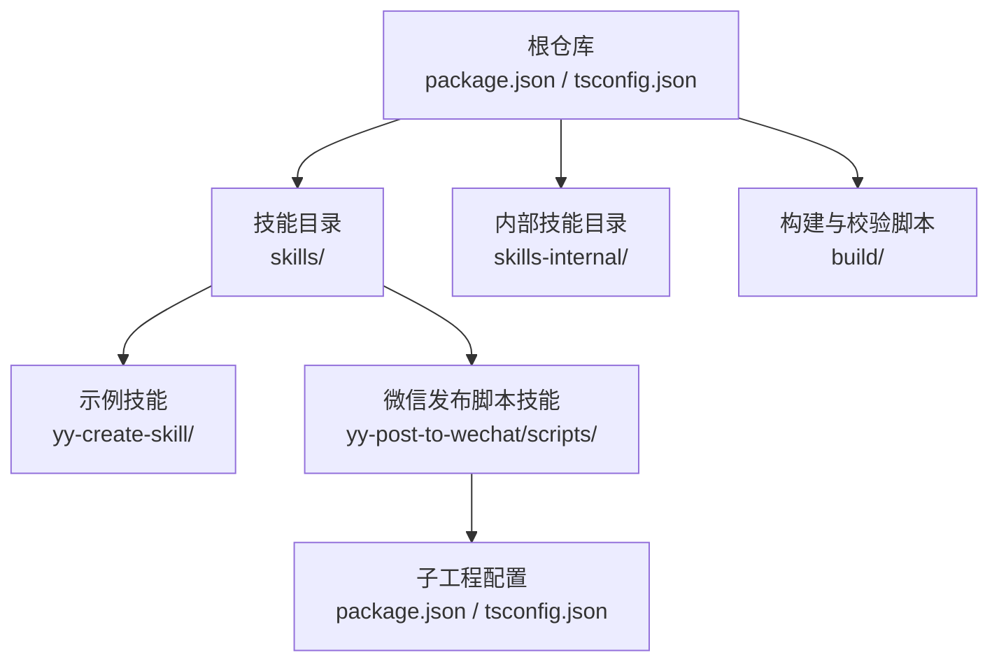
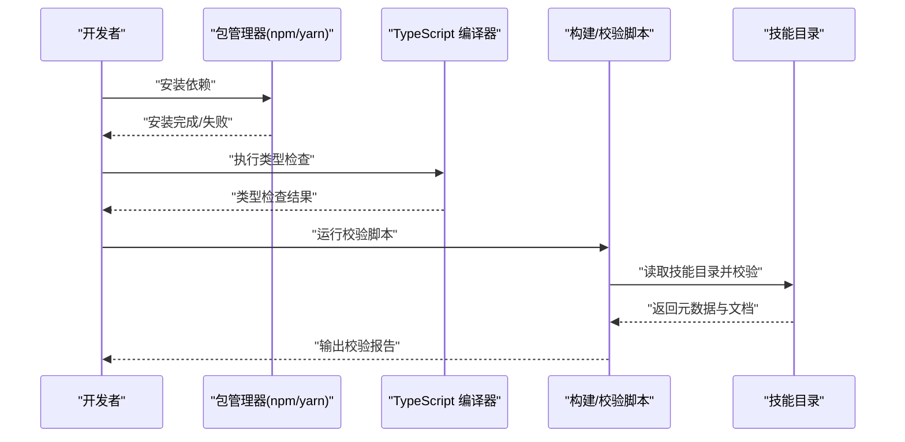
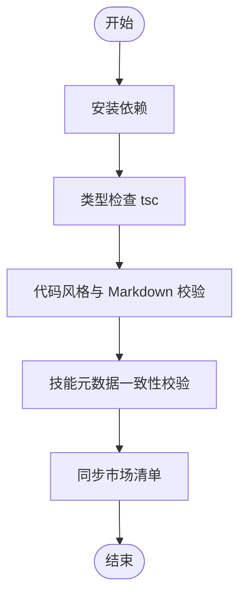
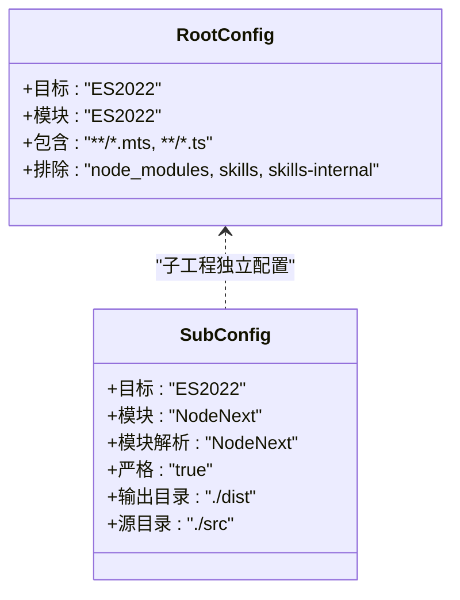
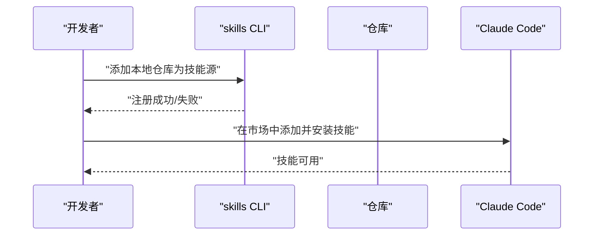
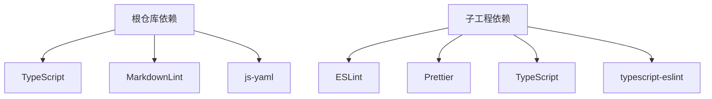

# 安装问题

<cite>
**本文引用的文件**
- [package.json](file://package.json)
- [tsconfig.json](file://tsconfig.json)
- [.npmrc](file://.npmrc)
- [DEVELOP.md](file://docs/DEVELOP.md)
- [CLAUDE_CODE_SKILL.md](file://docs/CLAUDE_CODE_SKILL.md)
- [check-skill.mts](file://build/check-skill.mts)
- [sync-marketplace.mts](file://build/sync-marketplace.mts)
- [yy-post-to-wechat/package.json](file://skills/yy-post-to-wechat/scripts/package.json)
- [yy-post-to-wechat/tsconfig.json](file://skills/yy-post-to-wechat/scripts/tsconfig.json)
- [.gitignore](file://.gitignore)
</cite>

## 目录
1. [简介](#简介)
2. [项目结构](#项目结构)
3. [核心组件](#核心组件)
4. [架构总览](#架构总览)
5. [详细组件分析](#详细组件分析)
6. [依赖分析](#依赖分析)
7. [性能考虑](#性能考虑)
8. [故障排除指南](#故障排除指南)
9. [结论](#结论)
10. [附录](#附录)

## 简介
本文件面向首次接触本仓库的开发者与使用者，提供系统化的安装与环境配置故障排除指南。内容覆盖：
- Node.js 环境版本与兼容性
- npm/yarn 安装失败的常见原因与解决步骤
- TypeScript 编译错误的定位与修复
- 不同操作系统下的安装要点与注意事项
- 权限问题、路径配置与依赖冲突的排查与修复
- 安装前的环境检查清单与安装后的验证方法
- 常见错误信息解读与对应解决步骤

## 项目结构
本仓库采用“根仓库 + 多技能子目录”的组织方式，根目录提供统一的开发与校验脚本，部分技能内部包含独立的前端脚本工程，具备独立的依赖与编译配置。

图表来源
- [package.json:1-46](file://package.json#L1-L46)
- [tsconfig.json:1-24](file://tsconfig.json#L1-L24)
- [yy-post-to-wechat/package.json:1-29](file://skills/yy-post-to-wechat/scripts/package.json#L1-L29)
- [yy-post-to-wechat/tsconfig.json:1-21](file://skills/yy-post-to-wechat/scripts/tsconfig.json#L1-L21)

章节来源
- [package.json:1-46](file://package.json#L1-L46)
- [tsconfig.json:1-24](file://tsconfig.json#L1-L24)
- [DEVELOP.md:1-18](file://docs/DEVELOP.md#L1-L18)

## 核心组件
- 根仓库构建与校验脚本
  - 通过 TypeScript 编译校验与技能元数据一致性检查，确保技能文档与元数据一致。
- 技能脚本工程
  - 部分技能包含独立的脚本工程，拥有独立的 Node.js 版本要求、依赖与编译配置。
- 开发与安装脚本
  - 提供本地安装与同步市场清单的自动化脚本，便于快速集成与发布。

章节来源
- [check-skill.mts:1-230](file://build/check-skill.mts#L1-L230)
- [sync-marketplace.mts:1-93](file://build/sync-marketplace.mts#L1-L93)
- [yy-post-to-wechat/package.json:1-29](file://skills/yy-post-to-wechat/scripts/package.json#L1-L29)
- [yy-post-to-wechat/tsconfig.json:1-21](file://skills/yy-post-to-wechat/scripts/tsconfig.json#L1-L21)

## 架构总览
下图展示了安装与校验的关键流程：从环境准备、依赖安装、到 TypeScript 编译与技能元数据校验的整体过程。

图表来源
- [package.json:7-16](file://package.json#L7-L16)
- [check-skill.mts:177-229](file://build/check-skill.mts#L177-L229)
- [sync-marketplace.mts:12-92](file://build/sync-marketplace.mts#L12-L92)

## 详细组件分析

### 组件一：根仓库安装与校验
- 作用
  - 统一管理开发依赖与脚本，提供类型检查、技能校验与市场清单同步能力。
- 关键点
  - TypeScript 编译选项与包含/排除规则，确保仅对目标文件进行编译。
  - 校验脚本遍历技能目录，检查 SKILL.md 与 metadata.json 的一致性。
  - 同步脚本根据技能目录动态更新市场清单。

图表来源
- [package.json:7-16](file://package.json#L7-L16)
- [tsconfig.json:14-22](file://tsconfig.json#L14-L22)
- [check-skill.mts:50-122](file://build/check-skill.mts#L50-L122)
- [sync-marketplace.mts:31-83](file://build/sync-marketplace.mts#L31-L83)

章节来源
- [package.json:7-16](file://package.json#L7-L16)
- [tsconfig.json:14-22](file://tsconfig.json#L14-L22)
- [check-skill.mts:177-229](file://build/check-skill.mts#L177-L229)
- [sync-marketplace.mts:12-92](file://build/sync-marketplace.mts#L12-L92)

### 组件二：技能脚本工程（以微信发布为例）
- 作用
  - 为特定技能提供独立的脚本与依赖，包含独立的 Node.js 版本要求与编译配置。
- 关键点
  - 子工程独立的 engines 字段限制 Node.js 版本。
  - 独立的 TypeScript 配置与输出目录设置。

图表来源
- [tsconfig.json:2-13](file://tsconfig.json#L2-L13)
- [yy-post-to-wechat/tsconfig.json:2-17](file://skills/yy-post-to-wechat/scripts/tsconfig.json#L2-L17)

章节来源
- [yy-post-to-wechat/package.json:6-8](file://skills/yy-post-to-wechat/scripts/package.json#L6-L8)
- [yy-post-to-wechat/tsconfig.json:1-21](file://skills/yy-post-to-wechat/scripts/tsconfig.json#L1-L21)

### 组件三：本地开发与安装
- 本地调试
  - 通过根目录提供的命令将仓库注册为技能源，便于本地调试与验证。
- 市场安装
  - 支持在 Claude Code 中添加市场并安装技能，便于在 IDE 生态中使用。

图表来源
- [DEVELOP.md:8-17](file://docs/DEVELOP.md#L8-L17)
- [CLAUDE_CODE_SKILL.md:1-10](file://docs/CLAUDE_CODE_SKILL.md#L1-L10)

章节来源
- [DEVELOP.md:8-17](file://docs/DEVELOP.md#L8-L17)
- [CLAUDE_CODE_SKILL.md:1-10](file://docs/CLAUDE_CODE_SKILL.md#L1-L10)

## 依赖分析
- 根仓库依赖
  - 开发依赖包含 TypeScript、MarkdownLint、js-yaml 等，用于类型检查、文档校验与 YAML 解析。
- 子工程依赖
  - 独立的 ESLint、Prettier、TypeScript 及其插件，用于代码风格与类型检查。
- 包管理器配置
  - 使用 .npmrc 指定镜像与版本精确保存策略，减少安装不确定性。

图表来源
- [package.json:34-44](file://package.json#L34-L44)
- [yy-post-to-wechat/package.json:20-27](file://skills/yy-post-to-wechat/scripts/package.json#L20-L27)
- [.npmrc:1-3](file://.npmrc#L1-L3)

章节来源
- [package.json:34-44](file://package.json#L34-L44)
- [yy-post-to-wechat/package.json:20-27](file://skills/yy-post-to-wechat/scripts/package.json#L20-L27)
- [.npmrc:1-3](file://.npmrc#L1-L3)

## 性能考虑
- 类型检查范围控制
  - 通过 tsconfig 的 include/exclude 精准限定编译范围，避免不必要的编译开销。
- 依赖隔离
  - 子工程独立依赖与引擎版本，降低全局依赖冲突带来的性能与稳定性影响。
- 构建脚本批量化
  - 将多项检查合并为脚本任务，减少重复启动成本。

章节来源
- [tsconfig.json:14-22](file://tsconfig.json#L14-L22)
- [yy-post-to-wechat/tsconfig.json:18-21](file://skills/yy-post-to-wechat/scripts/tsconfig.json#L18-L21)

## 故障排除指南

### 一、Node.js 环境配置问题
- 症状
  - 安装或运行时报错，提示 Node.js 版本过低或模块解析失败。
- 排查步骤
  - 确认 Node.js 版本满足根仓库与子工程要求：
    - 根仓库：使用 ES2022 模块与解析策略，建议使用较新的 LTS 版本。
    - 子工程（如微信发布脚本）：要求 Node.js 版本满足 engines 字段。
  - 清理缓存并重装依赖，避免版本不一致导致的问题。
- 解决方案
  - 升级 Node.js 至满足要求的版本，或在子工程中使用与 engines 匹配的 Node.js 版本。
  - 使用版本管理工具（如 nvm）在不同项目间切换 Node.js 版本。

章节来源
- [tsconfig.json:2-13](file://tsconfig.json#L2-L13)
- [yy-post-to-wechat/package.json:6-8](file://skills/yy-post-to-wechat/scripts/package.json#L6-L8)

### 二、npm/yarn 安装失败
- 症状
  - 安装过程中出现网络超时、权限不足、依赖冲突等问题。
- 排查步骤
  - 检查 .npmrc 配置，确认镜像地址与版本精确保存策略。
  - 确认网络连通性与代理设置，必要时更换为官方源或企业镜像。
  - 清理缓存与锁文件，重新安装。
- 解决方案
  - 使用国内镜像源（如仓库中配置的镜像）加速下载。
  - 以管理员权限或使用合适的权限账户执行安装。
  - 若存在依赖冲突，尝试锁定版本或升级到兼容版本。

章节来源
- [.npmrc:1-3](file://.npmrc#L1-L3)
- [.gitignore:40-42](file://.gitignore#L40-L42)

### 三、TypeScript 编译错误
- 症状
  - tsc 报告类型错误、模块解析失败或包含/排除规则导致的遗漏。
- 排查步骤
  - 检查 tsconfig 的 include/exclude 设置，确保目标文件被包含。
  - 查看具体报错位置，定位到对应源文件并修正类型问题。
  - 对于子工程，确认其独立 tsconfig 的模块解析与目标版本。
- 解决方案
  - 修正类型定义或导入路径，确保模块解析正确。
  - 调整 include/exclude 范围，避免遗漏或误包含文件。
  - 在子工程中保持与根仓库一致的模块解析策略或明确区分。

章节来源
- [tsconfig.json:14-22](file://tsconfig.json#L14-L22)
- [yy-post-to-wechat/tsconfig.json:2-17](file://skills/yy-post-to-wechat/scripts/tsconfig.json#L2-L17)

### 四、操作系统差异与注意事项
- macOS/Linux
  - 注意文件权限与符号链接，避免因权限不足导致的安装失败。
  - 使用 shell 的 PATH 确保 Node/npm/yarn 命令可用。
- Windows
  - 建议使用 WSL 或 PowerShell 管理员权限运行，避免路径大小写与反斜杠问题。
  - 确保 Node.js 安装路径不包含空格或特殊字符。

章节来源
- [DEVELOP.md:1-18](file://docs/DEVELOP.md#L1-L18)

### 五、权限问题
- 症状
  - 安装或运行时提示权限不足、无法写入缓存或全局安装失败。
- 排查步骤
  - 检查 npm/yarn 的缓存目录与全局安装目录权限。
  - 确认 .npmrc 中的缓存与缓存策略配置。
- 解决方案
  - 使用 sudo（macOS/Linux）或以管理员身份运行（Windows）。
  - 更改 npm/yarn 的缓存目录到用户可写路径。

章节来源
- [.gitignore:50-52](file://.gitignore#L50-L52)
- [.npmrc:1-3](file://.npmrc#L1-L3)

### 六、路径配置问题
- 症状
  - 构建脚本无法找到技能目录或读取文件失败。
- 排查步骤
  - 确认工作目录与脚本中的相对路径一致。
  - 检查 .gitignore 中对本地调试文件的忽略规则，避免误删或误改。
- 解决方案
  - 在正确的根目录执行脚本，避免在子目录中运行导致的路径偏差。
  - 如需临时启用某些忽略项，请谨慎操作并在完成后恢复。

章节来源
- [.gitignore:151-161](file://.gitignore#L151-L161)
- [sync-marketplace.mts:31-45](file://build/sync-marketplace.mts#L31-L45)

### 七、依赖冲突
- 症状
  - 安装过程中出现版本冲突、重复依赖或模块找不到。
- 排查步骤
  - 检查 package.json 与子工程 package.json 的依赖版本。
  - 使用 lock 文件锁定版本，避免自动升级导致的不兼容。
- 解决方案
  - 升级到兼容版本或降级到稳定版本。
  - 清理 node_modules 与 lock 文件后重新安装。

章节来源
- [package.json:34-44](file://package.json#L34-L44)
- [yy-post-to-wechat/package.json:16-27](file://skills/yy-post-to-wechat/scripts/package.json#L16-L27)

### 八、安装前环境检查清单
- Node.js 版本满足根仓库与子工程要求
- 网络可访问包源，必要时配置镜像
- 工作目录正确，无路径大小写或斜杠问题
- 权限充足，可写入缓存与全局目录
- 无冲突的旧版本依赖残留

章节来源
- [tsconfig.json:2-13](file://tsconfig.json#L2-L13)
- [yy-post-to-wechat/package.json:6-8](file://skills/yy-post-to-wechat/scripts/package.json#L6-L8)
- [.npmrc:1-3](file://.npmrc#L1-L3)

### 九、安装后验证方法
- 运行类型检查，确保无类型错误
- 执行技能元数据校验脚本，确认 SKILL.md 与 metadata.json 一致
- 运行市场清单同步脚本，确认技能列表与目录一致
- 在本地调试环境中注册仓库并验证技能可用性

章节来源
- [package.json:7-16](file://package.json#L7-L16)
- [check-skill.mts:177-229](file://build/check-skill.mts#L177-L229)
- [sync-marketplace.mts:12-92](file://build/sync-marketplace.mts#L12-L92)
- [DEVELOP.md:8-17](file://docs/DEVELOP.md#L8-L17)

## 结论
通过本指南，您可以系统地排查与解决安装过程中的常见问题，确保在不同操作系统与环境下顺利完成环境准备、依赖安装与构建校验。建议在安装前后对照“环境检查清单”与“验证方法”，以最小化潜在风险并提升安装成功率。

## 附录

### 常见错误信息与解决步骤
- “Node 版本过低”
  - 升级 Node.js 至满足 engines 与模块目标版本要求。
- “模块解析失败”
  - 检查 tsconfig 的模块解析策略与包含/排除范围。
- “安装超时/网络错误”
  - 更换镜像源或使用代理，清理缓存后重试。
- “权限不足”
  - 使用管理员权限或更改缓存目录，确保可写权限。
- “类型检查失败”
  - 修正类型定义与导入路径，缩小 include 范围或增加排除项。

章节来源
- [yy-post-to-wechat/package.json:6-8](file://skills/yy-post-to-wechat/scripts/package.json#L6-L8)
- [tsconfig.json:14-22](file://tsconfig.json#L14-L22)
- [.npmrc:1-3](file://.npmrc#L1-L3)
- [.gitignore:50-52](file://.gitignore#L50-L52)