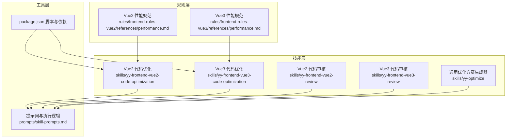
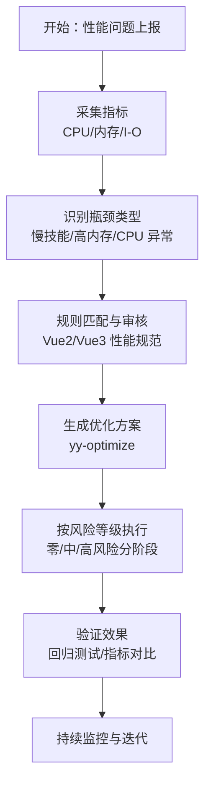
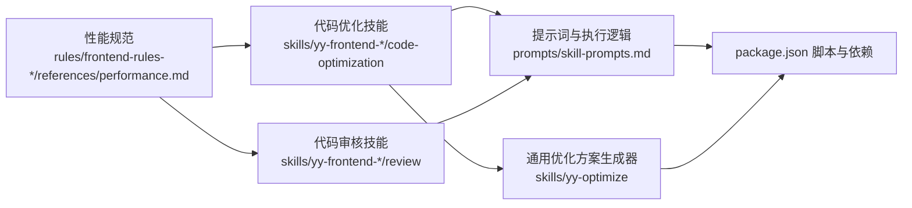
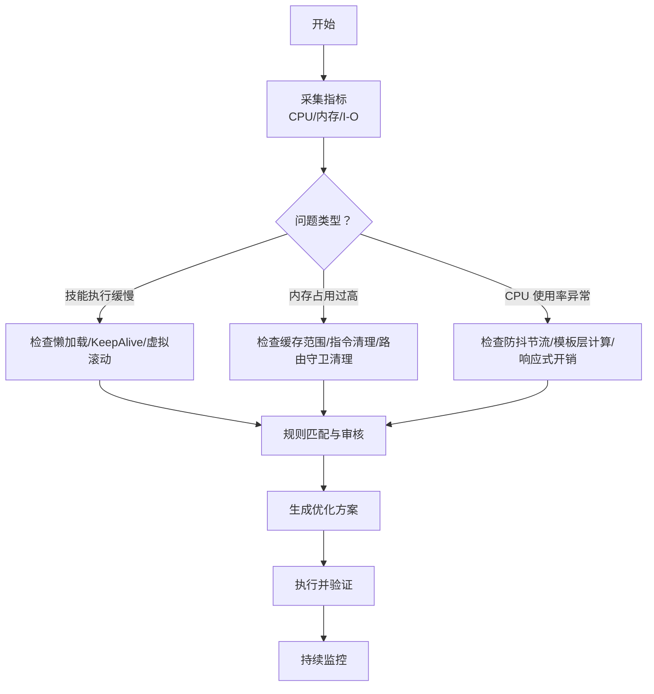

# 性能问题

<cite>
**本文档引用的文件**
- [性能.md（Vue2 规范）](file://rules/frontend-rules-vue2/references/performance.md)
- [性能.md（Vue3 规范）](file://rules/frontend-rules-vue3/references/performance.md)
- [性能.md（Vue2 代码优化）](file://skills/yy-frontend-vue2-code-optimization/rules/performance.md)
- [性能.md（Vue3 代码优化）](file://skills/yy-frontend-vue3-code-optimization/rules/performance.md)
- [性能.md（Vue2 代码审核）](file://skills/yy-frontend-vue2-review/rules/performance.md)
- [性能.md（Vue3 代码审核）](file://skills/yy-frontend-vue3-review/rules/performance.md)
- [yy-optimize 技能说明](file://skills/yy-optimize/SKILL.md)
- [Vue2 代码优化提示词](file://skills/yy-frontend-vue2-code-optimization/prompts/skill-prompts.md)
- [Vue3 代码优化提示词](file://skills/yy-frontend-vue3-code-optimization/prompts/skill-prompts.md)
- [Vue2 代码审核技能说明](file://skills/yy-frontend-vue2-review/SKILL.md)
- [Vue3 代码审核技能说明](file://skills/yy-frontend-vue3-review/SKILL.md)
- [package.json](file://package.json)
</cite>

## 目录
1. [简介](#简介)
2. [项目结构](#项目结构)
3. [核心组件](#核心组件)
4. [架构总览](#架构总览)
5. [详细组件分析](#详细组件分析)
6. [依赖分析](#依赖分析)
7. [性能考量](#性能考量)
8. [故障排除指南](#故障排除指南)
9. [结论](#结论)
10. [附录](#附录)

## 简介
本指南聚焦于前端性能问题的诊断与优化，结合仓库中的 Vue2/Vue3 性能规范、代码优化与审核技能，系统阐述如何识别与解决“技能执行缓慢、内存占用过高、CPU 使用率异常”等性能问题，并提供内存分析、CPU 分析与 I/O 监控的实操方法，以及前端代码审核与大数据量处理的最佳实践。

## 项目结构
本仓库围绕“规则 + 技能”的结构组织性能相关内容：
- 规则层：提供 Vue2/Vue3 的性能规范与最佳实践
- 技能层：提供代码优化与审核能力，支持按文件类型与风险等级执行
- 工具层：通过脚本与提示词驱动性能优化与审核流程

**图表来源**
- [性能.md（Vue2 规范）](file://rules/frontend-rules-vue2/references/performance.md)
- [性能.md（Vue3 规范）](file://rules/frontend-rules-vue3/references/performance.md)
- [Vue2 代码优化提示词](file://skills/yy-frontend-vue2-code-optimization/prompts/skill-prompts.md)
- [Vue3 代码优化提示词](file://skills/yy-frontend-vue3-code-optimization/prompts/skill-prompts.md)
- [yy-optimize 技能说明](file://skills/yy-optimize/SKILL.md)
- [package.json](file://package.json)

**章节来源**
- [性能.md（Vue2 规范）](file://rules/frontend-rules-vue2/references/performance.md)
- [性能.md（Vue3 规范）](file://rules/frontend-rules-vue3/references/performance.md)
- [yy-optimize 技能说明](file://skills/yy-optimize/SKILL.md)
- [Vue2 代码优化提示词](file://skills/yy-frontend-vue2-code-optimization/prompts/skill-prompts.md)
- [Vue3 代码优化提示词](file://skills/yy-frontend-vue3-code-optimization/prompts/skill-prompts.md)
- [package.json](file://package.json)

## 核心组件
- Vue2/Vue3 性能规范：提供组件懒加载、KeepAlive 缓存、虚拟滚动、防抖节流、图片优化、模板层轻量化、响应式性能、指令与路由守卫清理等优化要点
- 代码优化技能：按风险等级（零风险/中风险/高风险）分阶段执行，支持并行处理与逐项确认
- 代码审核技能：覆盖 9 大维度（代码风格、最佳实践、组件规范、命名、网络请求、computed、逻辑错误、安全、禁止项），严格限制在 src 目录内
- 通用优化方案生成器：对任意优化目标生成多个可选方案，强调“务实优先，不为优化而优化”

**章节来源**
- [性能.md（Vue2 代码优化）](file://skills/yy-frontend-vue2-code-optimization/rules/performance.md)
- [性能.md（Vue3 代码优化）](file://skills/yy-frontend-vue3-code-optimization/rules/performance.md)
- [Vue2 代码优化提示词](file://skills/yy-frontend-vue2-code-optimization/prompts/skill-prompts.md)
- [Vue3 代码优化提示词](file://skills/yy-frontend-vue3-code-optimization/prompts/skill-prompts.md)
- [Vue2 代码审核技能说明](file://skills/yy-frontend-vue2-review/SKILL.md)
- [Vue3 代码审核技能说明](file://skills/yy-frontend-vue3-review/SKILL.md)
- [yy-optimize 技能说明](file://skills/yy-optimize/SKILL.md)

## 架构总览
性能优化与诊断的总体流程分为“识别—分析—生成方案—执行—验证”闭环：

[本图为概念性流程图，不直接映射具体源码文件]

## 详细组件分析

### Vue2 性能优化规范
- 组件懒加载与路由懒加载：减少初始包体积，提升首屏性能
- KeepAlive 缓存：通过 include/exclude 精确控制缓存范围，避免内存泄漏
- 虚拟滚动：长列表（100+ 项）仅渲染可视区域，降低渲染开销
- 防抖节流：搜索（防抖300ms）、滚动（节流100ms）、resize（节流）、按钮点击（防抖/锁）
- 图片优化：WebP 优先、合适尺寸、非首屏 lazy
- 模板层轻量化：模板只负责展示，避免昂贵计算，优先 computed
- 响应式性能：computed 派生、大数据 Object.freeze；避免 watch 中同步 DOM 操作
- 指令清理：unbind 钩子清理事件监听与定时器
- 路由守卫清理：beforeRouteLeave 清理定时器、取消未完成请求、关闭弹窗
- 过滤器：优先使用局部 filters，保持纯函数，不修改外部状态
- 响应式陷阱（Vue2 特有）：新增属性、数组索引赋值、数组长度修改的正确写法

**章节来源**
- [性能.md（Vue2 规范）](file://rules/frontend-rules-vue2/references/performance.md)
- [性能.md（Vue2 代码优化）](file://skills/yy-frontend-vue2-code-optimization/rules/performance.md)
- [性能.md（Vue2 代码审核）](file://skills/yy-frontend-vue2-review/rules/performance.md)

### Vue3 性能优化规范
- 组件懒加载：defineAsyncComponent 动态导入
- KeepAlive 缓存：include/exclude 精确控制
- 虚拟滚动：长列表仅渲染可视区域
- 防抖节流：搜索（防抖）、滚动（节流）、resize（节流）、按钮点击（防抖/锁）
- 图片优化：WebP 优先、合适尺寸、非首屏 lazy
- 模板层轻量化：模板只负责展示，避免昂贵计算，优先 computed
- 响应式性能：computed 派生，大型数据列表考虑 shallowRef，避免 watch 中同步 DOM 操作
- 自定义指令清理：unmounted 钩子清理事件监听与定时器
- 路由守卫清理：beforeRouteLeave 清理定时器、取消未完成请求、关闭弹窗

**章节来源**
- [性能.md（Vue3 规范）](file://rules/frontend-rules-vue3/references/performance.md)
- [性能.md（Vue3 代码优化）](file://skills/yy-frontend-vue3-code-optimization/rules/performance.md)
- [性能.md（Vue3 代码审核）](file://skills/yy-frontend-vue3-review/rules/performance.md)

### 代码优化技能（按风险等级）
- 零风险：业务逻辑梳理、注释增强（仅增不改）
- 中风险：代码风格清洗（导入排序、结构顺序、模板属性排序）、CSS/BEM 规范、语义化命名
- 高风险：逻辑深度优化（async/await、computed 优先、Props 增强、组件拆分建议）

执行流程：
- 文件扫描 → 任务清单生成 → 零风险自动执行 → 中风险用户确认 → 高风险逐项确认
- 并行处理：同类型任务并行，提高效率

**章节来源**
- [Vue2 代码优化提示词](file://skills/yy-frontend-vue2-code-optimization/prompts/skill-prompts.md)
- [Vue3 代码优化提示词](file://skills/yy-frontend-vue3-code-optimization/prompts/skill-prompts.md)

### 代码审核技能（Vue2/Vue3）
- 审核范围：严格限制在 src 目录内，覆盖 9 大维度
- 风险分级：🔴 严重 / 🟡 中等 / 🟢 轻微
- 执行顺序：严重问题优先（D07/D08/D09），中等问题次之（D03/D04/D05/D06），轻微问题最后（D01/D02）
- 输出格式：审核清单、问题统计、修复建议

**章节来源**
- [Vue2 代码审核技能说明](file://skills/yy-frontend-vue2-review/SKILL.md)
- [Vue3 代码审核技能说明](file://skills/yy-frontend-vue3-review/SKILL.md)

### 通用优化方案生成器（yy-optimize）
- 核心原则：务实优先，不为优化而优化
- 使用场景：用户提到“优化/改进/提升/重构”，或需要多个可选方案对比
- 执行流程：理解优化目标 → 分析现状 → 判断是否需要优化 → 生成优化方案 → 输出方案供用户选择 → 迭代完善 → 确认执行
- 输出格式：优化分析、现状问题、方案一/二/三、预期效果、潜在风险、适用场景

**章节来源**
- [yy-optimize 技能说明](file://skills/yy-optimize/SKILL.md)

## 依赖分析
- 规则依赖：Vue2/Vue3 性能规范作为优化与审核的依据
- 技能依赖：代码优化与审核技能依赖提示词与执行逻辑，按风险等级分阶段执行
- 工具依赖：package.json 中的脚本与依赖为性能优化与审核提供基础环境

**图表来源**
- [性能.md（Vue2 规范）](file://rules/frontend-rules-vue2/references/performance.md)
- [性能.md（Vue3 规范）](file://rules/frontend-rules-vue3/references/performance.md)
- [Vue2 代码优化提示词](file://skills/yy-frontend-vue2-code-optimization/prompts/skill-prompts.md)
- [Vue3 代码优化提示词](file://skills/yy-frontend-vue3-code-optimization/prompts/skill-prompts.md)
- [yy-optimize 技能说明](file://skills/yy-optimize/SKILL.md)
- [package.json](file://package.json)

**章节来源**
- [package.json](file://package.json)

## 性能考量
- 组件懒加载与路由懒加载：减少初始包体积，降低首屏渲染压力
- KeepAlive 缓存：合理控制缓存范围，避免内存泄漏
- 虚拟滚动：长列表仅渲染可视区域，显著降低 DOM 与渲染开销
- 防抖节流：控制高频事件触发频率，避免过度渲染与请求
- 图片优化：WebP、合适尺寸、非首屏 lazy，降低网络与渲染负担
- 模板层轻量化：模板只负责展示，避免昂贵计算，优先 computed
- 响应式性能：computed 派生、大数据 Object.freeze/shallowRef、避免 watch 中同步 DOM 操作
- 指令与路由守卫清理：防止内存泄漏与资源未释放
- 代码风格与结构：导入排序、结构顺序、模板属性排序，提升可维护性与可分析性

[本节为通用性能指导，不直接分析具体源码文件]

## 故障排除指南

### 诊断流程（CPU/内存/I-O）

[本图为概念性流程图，不直接映射具体源码文件]

### 常见问题与修复建议
- 组件懒加载缺失：使用动态导入与路由懒加载，减少初始包体积
- KeepAlive 缓存不当：通过 include/exclude 精确控制缓存范围
- 虚拟滚动缺失：长列表使用虚拟滚动，仅渲染可视区域
- 高频事件未节流：搜索（防抖300ms）、滚动（节流100ms）、resize（节流）、按钮点击（防抖/锁）
- 图片未优化：WebP 优先、合适尺寸、非首屏 lazy
- 模板层昂贵计算：将计算逻辑迁移到 computed，避免在模板中执行昂贵计算
- 响应式开销大：大数据使用 freeze/shallowRef，避免 watch 中同步 DOM 操作
- 指令与路由守卫未清理：在 unbind/unmounted 钩子中清理事件监听与定时器，在 beforeRouteLeave 中清理定时器、取消未完成请求、关闭弹窗

**章节来源**
- [性能.md（Vue2 规范）](file://rules/frontend-rules-vue2/references/performance.md)
- [性能.md（Vue3 规范）](file://rules/frontend-rules-vue3/references/performance.md)
- [性能.md（Vue2 代码优化）](file://skills/yy-frontend-vue2-code-optimization/rules/performance.md)
- [性能.md（Vue3 代码优化）](file://skills/yy-frontend-vue3-code-optimization/rules/performance.md)
- [性能.md（Vue2 代码审核）](file://skills/yy-frontend-vue2-review/rules/performance.md)
- [性能.md（Vue3 代码审核）](file://skills/yy-frontend-vue3-review/rules/performance.md)

## 结论
本指南基于仓库中的 Vue2/Vue3 性能规范与代码优化/审核技能，提供了系统化的性能问题诊断与优化方法。通过规则匹配、风险分层执行、通用优化方案生成与严格的审核流程，能够有效识别与解决技能执行缓慢、内存占用过高、CPU 使用率异常等性能问题，并建立持续监控与迭代的闭环。

[本节为总结性内容，不直接分析具体源码文件]

## 附录
- Vue2/Vue3 性能规范速查：组件懒加载、KeepAlive、虚拟滚动、防抖节流、图片优化、模板层轻量化、响应式性能、指令与路由守卫清理
- 代码优化技能：零/中/高风险分阶段执行，支持并行处理与逐项确认
- 代码审核技能：9 大维度风险分级，严格限制在 src 目录内
- 通用优化方案生成器：对任意优化目标生成多个可选方案，强调“务实优先，不为优化而优化”

**章节来源**
- [性能.md（Vue2 规范）](file://rules/frontend-rules-vue2/references/performance.md)
- [性能.md（Vue3 规范）](file://rules/frontend-rules-vue3/references/performance.md)
- [Vue2 代码优化提示词](file://skills/yy-frontend-vue2-code-optimization/prompts/skill-prompts.md)
- [Vue3 代码优化提示词](file://skills/yy-frontend-vue3-code-optimization/prompts/skill-prompts.md)
- [Vue2 代码审核技能说明](file://skills/yy-frontend-vue2-review/SKILL.md)
- [Vue3 代码审核技能说明](file://skills/yy-frontend-vue3-review/SKILL.md)
- [yy-optimize 技能说明](file://skills/yy-optimize/SKILL.md)