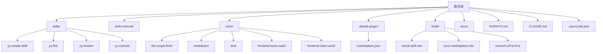
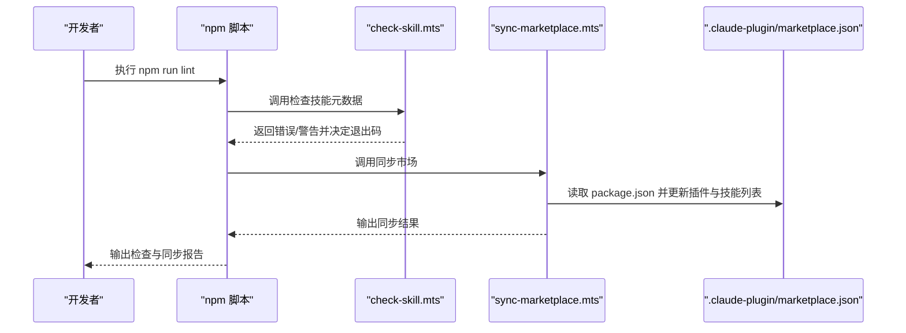
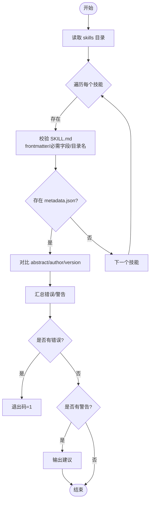
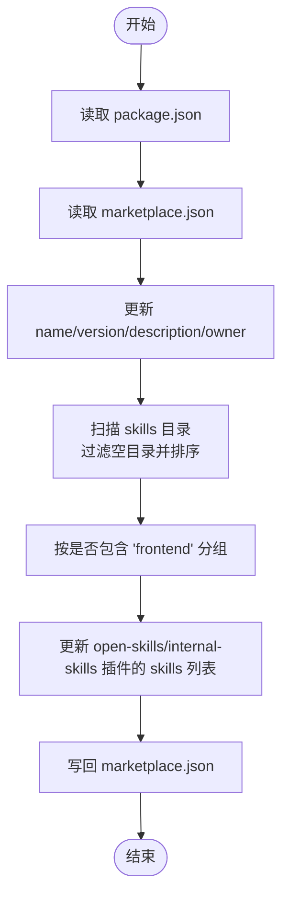
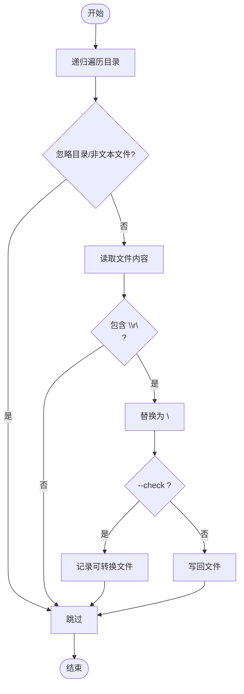
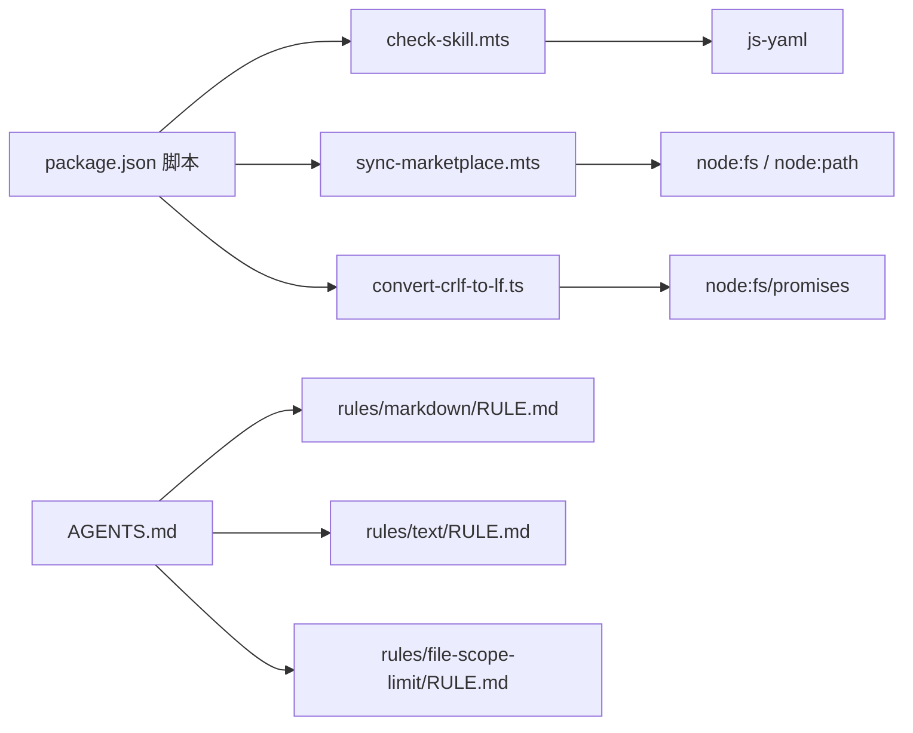

# 故障排除

<cite>
**本文引用的文件**
- [package.json](file://package.json)
- [.opencode.json](file://.opencode.json)
- [AGENTS.md](file://AGENTS.md)
- [CLAUDE.md](file://CLAUDE.md)
- [docs/DEVELOP.md](file://docs/DEVELOP.md)
- [docs/CONFIG_RULE.md](file://docs/CONFIG_RULE.md)
- [docs/CLAUDE_CODE_SKILL.md](file://docs/CLAUDE_CODE_SKILL.md)
- [docs/STRUCTURE.md](file://docs/STRUCTURE.md)
- [build/check-skill.mts](file://build/check-skill.mts)
- [build/sync-marketplace.mts](file://build/sync-marketplace.mts)
- [build/convert-crlf-to-lf.ts](file://build/convert-crlf-to-lf.ts)
- [.claude-plugin/marketplace.json](file://.claude-plugin/marketplace.json)
- [skills/yy-create-skill/SKILL.md](file://skills/yy-create-skill/SKILL.md)
- [skills/yy-lint/SKILL.md](file://skills/yy-lint/SKILL.md)
- [skills/yy-review/SKILL.md](file://skills/yy-review/SKILL.md)
- [skills/yy-commit/SKILL.md](file://skills/yy-commit/SKILL.md)
- [rules/file-scope-limit/RULE.md](file://rules/file-scope-limit/RULE.md)
- [rules/markdown/RULE.md](file://rules/markdown/RULE.md)
- [rules/text/RULE.md](file://rules/text/RULE.md)
</cite>

## 目录
1. [简介](#简介)
2. [项目结构](#项目结构)
3. [核心组件](#核心组件)
4. [架构总览](#架构总览)
5. [详细组件分析](#详细组件分析)
6. [依赖关系分析](#依赖关系分析)
7. [性能考虑](#性能考虑)
8. [故障排除指南](#故障排除指南)
9. [结论](#结论)
10. [附录](#附录)

## 简介
本指南面向技能开发者与技术支持人员，系统化梳理安装配置、技能开发、规则应用与市场同步等环节的常见问题与解决方案。文档提供问题诊断方法（日志分析、错误代码解读、根因分析）、调试工具与技巧、性能诊断与优化方法，以及网络与权限相关问题的排查步骤，并给出问题分类与升级流程建议。

## 项目结构
项目采用“技能 + 规则 + 构建脚本”的分层组织方式：
- skills：公共技能集合，每个技能以独立目录与 SKILL.md 为主入口
- skills-internal：内部私有技能集合
- rules：规则库，按领域划分（如前端 Vue2/Vue3、Markdown、文本等）
- .claude-plugin：插件市场配置，定义插件与技能分组
- build：自动化检查、同步与格式转换脚本
- docs：开发与配置指南文档
- AGENTS.md、CLAUDE.md、.opencode.json：项目规范与外部工具配置入口

图表来源
- [docs/STRUCTURE.md:1-10](file://docs/STRUCTURE.md#L1-L10)
- [package.json:1-46](file://package.json#L1-L46)

章节来源
- [docs/STRUCTURE.md:1-10](file://docs/STRUCTURE.md#L1-L10)
- [package.json:1-46](file://package.json#L1-L46)

## 核心组件
- 自动化检查与校验：build/check-skill.mts 负责 SKILL.md 与 metadata.json 的一致性校验，输出错误与警告并终止 CI 流程
- 市场同步：build/sync-marketplace.mts 将 package.json 与技能目录同步至 .claude-plugin/marketplace.json，自动分组前端与非前端技能
- 文档统一化：build/convert-crlf-to-lf.ts 统一换行符，减少跨平台差异导致的格式问题
- 规则与规范：AGENTS.md 定义质量门禁、交付格式、AI 思考方式；CLAUDE.md/.opencode.json 引入外部工具配置

章节来源
- [build/check-skill.mts:1-230](file://build/check-skill.mts#L1-L230)
- [build/sync-marketplace.mts:1-93](file://build/sync-marketplace.mts#L1-L93)
- [build/convert-crlf-to-lf.ts:1-119](file://build/convert-crlf-to-lf.ts#L1-L119)
- [AGENTS.md:1-155](file://AGENTS.md#L1-L155)
- [CLAUDE.md:1-2](file://CLAUDE.md#L1-L2)
- [.opencode.json:1-14](file://.opencode.json#L1-L14)

## 架构总览
下图展示从本地开发到市场同步的关键流程与组件交互：

图表来源
- [package.json:7-16](file://package.json#L7-L16)
- [build/check-skill.mts:177-229](file://build/check-skill.mts#L177-L229)
- [build/sync-marketplace.mts:12-93](file://build/sync-marketplace.mts#L12-L93)

## 详细组件分析

### 自动化检查组件（check-skill.mts）
职责与流程
- 遍历 skills 目录，逐个校验 SKILL.md 的 frontmatter 结构、必需字段与目录名一致性
- 对比 metadata.json 的 abstract/author/version 与 SKILL.md 的 description/metadata.author/metadata.version
- 输出错误与警告，并在出现错误时终止进程

图表来源
- [build/check-skill.mts:50-172](file://build/check-skill.mts#L50-L172)
- [build/check-skill.mts:177-229](file://build/check-skill.mts#L177-L229)

章节来源
- [build/check-skill.mts:1-230](file://build/check-skill.mts#L1-L230)

### 市场同步组件（sync-marketplace.mts）
职责与流程
- 从 package.json 读取 name/version/description/author
- 读取 .claude-plugin/marketplace.json，更新插件名称、版本、描述与所有者
- 扫描 skills 与 skills-internal 目录，过滤空目录并按字母排序
- 将技能按是否包含“frontend”分别写入 open-skills 与 frontend-skills 插件
- 写回 marketplace.json 并输出同步结果

图表来源
- [build/sync-marketplace.mts:12-93](file://build/sync-marketplace.mts#L12-L93)

章节来源
- [build/sync-marketplace.mts:1-93](file://build/sync-marketplace.mts#L1-L93)

### 文档统一化组件（convert-crlf-to-lf.ts）
职责与流程
- 递归扫描项目根目录，跳过 .git、node_modules 等忽略目录
- 仅处理文本类型扩展名与特定基础文件名
- 将 CRLF 统一替换为 LF，支持 --check 模式仅报告可转换文件

图表来源
- [build/convert-crlf-to-lf.ts:56-119](file://build/convert-crlf-to-lf.ts#L56-L119)

章节来源
- [build/convert-crlf-to-lf.ts:1-119](file://build/convert-crlf-to-lf.ts#L1-L119)

### 规则与规范（AGENTS.md、CLAUDE.md、.opencode.json）
- AGENTS.md：定义质量门禁、交付格式、AI 思考方式与关键参考，强调每次修改后必须执行 npm run lint，并禁止手动修改 marketplace.json
- CLAUDE.md：通过 @path/to/import 引入 AGENTS.md 等规范文件
- .opencode.json：定义 OpenCode 的 instructions 列表，包含 AGENTS.md、结构文档与规则文件

章节来源
- [AGENTS.md:11-18](file://AGENTS.md#L11-L18)
- [AGENTS.md:125-132](file://AGENTS.md#L125-L132)
- [CLAUDE.md:1-2](file://CLAUDE.md#L1-L2)
- [.opencode.json:1-14](file://.opencode.json#L1-L14)

## 依赖关系分析
- npm 脚本依赖：lint 脚本串联 check:skill、lint:skills、lint:markdown、check:type、lint:lf、sync:marketplace
- 构建脚本依赖：check-skill.mts 依赖 js-yaml；sync-marketplace.mts 依赖 node:fs 与 node:path；convert-crlf-to-lf.ts 依赖 node:fs/promises
- 规则与规范依赖：技能与规则文件通过 @path/to/import 方式相互引用，支持最多 5 层递归引用

图表来源
- [package.json:7-16](file://package.json#L7-L16)
- [build/check-skill.mts:1-6](file://build/check-skill.mts#L1-L6)
- [build/sync-marketplace.mts:1-6](file://build/sync-marketplace.mts#L1-L6)
- [build/convert-crlf-to-lf.ts:1-4](file://build/convert-crlf-to-lf.ts#L1-L4)
- [AGENTS.md:135-149](file://AGENTS.md#L135-L149)

章节来源
- [package.json:7-16](file://package.json#L7-L16)
- [build/check-skill.mts:1-6](file://build/check-skill.mts#L1-L6)
- [build/sync-marketplace.mts:1-6](file://build/sync-marketplace.mts#L1-L6)
- [build/convert-crlf-to-lf.ts:1-4](file://build/convert-crlf-to-lf.ts#L1-L4)
- [AGENTS.md:135-149](file://AGENTS.md#L135-L149)

## 性能考虑
- 脚本性能
  - check-skill.mts：对每个技能执行文件读取与 YAML 解析，时间复杂度与技能数量线性相关；建议在 CI 中缓存依赖与并行化其他任务
  - sync-marketplace.mts：读取与写入 JSON 文件，时间复杂度近似 O(n)，其中 n 为技能数量；建议减少不必要的重复扫描
  - convert-crlf-to-lf.ts：递归遍历项目根目录，忽略目录与空文件；建议在 CI 中使用 --check 模式预检，避免不必要的写操作
- I/O 与内存
  - 大型项目中，大量小文件的读取与字符串替换可能带来内存压力；建议在本地开发阶段启用 --check 模式，仅在必要时执行写回
- 建议
  - 在 CI 中拆分 lint 步骤，避免阻塞
  - 对规则与技能文档进行增量检查，减少全量扫描

[本节为通用性能建议，不直接分析具体文件]

## 故障排除指南

### 一、安装与环境问题
- 症状：执行 npm run lint 报错或失败
  - 可能原因：缺少依赖、TypeScript 类型检查失败、markdownlint 未安装、换行符不一致
  - 排查步骤：
    - 确认依赖安装：npm ci 或 npm install
    - 检查 TypeScript 类型：npm run check:type
    - 检查换行符：npm run lint:lf（或使用 --check 模式预检）
    - 检查 markdown 格式：npm run lint:markdown
  - 解决方案：根据报错信息修复类型、格式或换行符；确保本地与 CI 环境一致

章节来源
- [package.json:7-16](file://package.json#L7-L16)
- [build/convert-crlf-to-lf.ts:96-101](file://build/convert-crlf-to-lf.ts#L96-L101)

### 二、技能开发与元数据问题
- 症状：check-skill.mts 报告 SKILL.md 错误或警告
  - 可能原因：frontmatter 缺失/格式错误、必需字段缺失、name 与目录名不匹配、metadata.json 与 SKILL.md 不一致
  - 排查步骤：
    - 检查 SKILL.md 是否以 --- 开头且包含 name/description
    - 确认 metadata.json 的 abstract/author/version 与 SKILL.md 对应字段一致
    - 使用脚本输出的建议更新 metadata.json
  - 解决方案：修正 frontmatter 与字段值；确保 name 与目录名一致；同步 metadata.json

章节来源
- [build/check-skill.mts:50-172](file://build/check-skill.mts#L50-L172)
- [AGENTS.md:11-18](file://AGENTS.md#L11-L18)

### 三、规则配置问题
- OpenCode 配置
  - 症状：规则未生效或未被识别
  - 可能原因：规则文件未放置在 .opencode/rules/ 目录、opencode.json 未正确配置 instructions
  - 排查步骤：确认 .opencode/rules/ 下存在规则文件；检查 opencode.json 的 instructions 数组是否包含相应路径
  - 解决方案：将规则文件放入 .opencode/rules/；在 opencode.json 中添加正确的 instructions 路径
- Claude Code 配置
  - 症状：规则未加载或引用链异常
  - 可能原因：CLAUDE.md 未正确 @path/to/import 规则、规则文件层级超过 5 层
  - 排查步骤：检查 CLAUDE.md 的 @path/to/import；确认规则文件未超过 5 层嵌套
  - 解决方案：修正导入路径；减少嵌套层级

章节来源
- [docs/CONFIG_RULE.md:1-34](file://docs/CONFIG_RULE.md#L1-L34)
- [.opencode.json:1-14](file://.opencode.json#L1-L14)
- [CLAUDE.md:1-2](file://CLAUDE.md#L1-L2)

### 四、市场同步问题
- 症状：marketplace.json 未更新或技能未出现在市场
  - 可能原因：skills/skills-internal 目录为空导致被删除、package.json 与 marketplace.json 字段不一致、插件名称不匹配
  - 排查步骤：确认技能目录非空；检查 package.json 与 marketplace.json 的 name/version/description/owner 是否一致；确认插件名称 open-skills/frontend-skills/internal-skills 存在
  - 解决方案：填充技能内容；执行 npm run sync:marketplace；检查输出日志

章节来源
- [build/sync-marketplace.mts:31-83](file://build/sync-marketplace.mts#L31-L83)
- [.claude-plugin/marketplace.json](file://.claude-plugin/marketplace.json)

### 五、本地调试与开发问题
- 症状：本地调试生成不应提交的文件
  - 可能原因：未遵循 .gitignore 忽略规则
  - 排查步骤：确认 .gitignore 中包含 skills-lock.json 与 .agents/skills/
  - 解决方案：不要提交这些文件；使用本地调试后清理

章节来源
- [docs/DEVELOP.md:14-18](file://docs/DEVELOP.md#L14-L18)

### 六、网络与权限问题
- 症状：Claude Code 插件市场添加失败或技能无法安装
  - 可能原因：网络不可达、Marketplace 名称或仓库地址错误、权限不足
  - 排查步骤：确认网络连通性；在 Claude Code 中通过 /plugin 添加 bulls-cows/skills；选择 open-skills 插件市场并安装所需技能
  - 解决方案：更换网络或代理；确保仓库与插件名称正确；重启 Claude Code 或衍生插件后重试

章节来源
- [docs/CLAUDE_CODE_SKILL.md:1-10](file://docs/CLAUDE_CODE_SKILL.md#L1-L10)

### 七、日志分析与根因分析
- 日志来源
  - check-skill.mts：输出每个技能的错误与警告详情，包含字段不一致的建议
  - sync-marketplace.mts：输出删除空目录与同步结果
  - convert-crlf-to-lf.ts：输出 --check 模式下的可转换文件与 --update 模式下的已转换文件
- 根因分析技巧
  - 从前向后：先检查 SKILL.md frontmatter，再对比 metadata.json
  - 从外向内：先同步 marketplace.json，再检查技能目录
  - 从粗到细：先执行 npm run lint，再单独执行 lint:lf、lint:markdown、check:type

章节来源
- [build/check-skill.mts:197-225](file://build/check-skill.mts#L197-L225)
- [build/sync-marketplace.mts:39-40](file://build/sync-marketplace.mts#L39-L40)
- [build/convert-crlf-to-lf.ts:96-101](file://build/convert-crlf-to-lf.ts#L96-L101)

### 八、调试工具与技巧
- 开发工具
  - 本地调试：在根目录执行 npx skills add ./，参考本地开发指南
  - 规则调试：在 Claude Code 中通过 @path/to/import 引入规则文件，支持最多 5 层递归
- 测试工具
  - 质量门禁：每次修改后执行 npm run lint；必要时执行技能一致性检查与思考方式同步
- 分析工具
  - 换行符统一：使用 lint:lf 或 convert-crlf-to-lf.ts 的 --check 模式
  - 规则与规范：通过 AGENTS.md、CLAUDE.md、.opencode.json 统一约束

章节来源
- [docs/DEVELOP.md:8-17](file://docs/DEVELOP.md#L8-L17)
- [AGENTS.md:11-18](file://AGENTS.md#L11-L18)
- [package.json:7-16](file://package.json#L7-L16)
- [docs/CONFIG_RULE.md:17-34](file://docs/CONFIG_RULE.md#L17-L34)

### 九、性能问题诊断与优化
- 症状：CI 时间过长、I/O 抖动
- 诊断与优化
  - 换行符处理：优先使用 --check 模式预检，减少写回次数
  - 市场同步：避免频繁触发，仅在 package.json 或技能目录变更时执行
  - 类型检查：在本地快速修复类型问题，减少 CI 失败重试

章节来源
- [build/convert-crlf-to-lf.ts:96-101](file://build/convert-crlf-to-lf.ts#L96-L101)
- [package.json:7-16](file://package.json#L7-L16)

### 十、问题分类与升级流程（建议）
- 分类
  - 安装配置类：规则未生效、市场同步失败、网络权限问题
  - 技能开发类：SKILL.md/frontmatter 错误、metadata.json 不一致、本地调试异常
  - 规则应用类：引用链过深、导入路径错误、规范冲突
  - 性能类：CI 时间过长、I/O 抖动、类型检查失败
- 升级流程
  - 一线：开发者自查（npm run lint、检查规则与规范）
  - 二线：技术负责人复核（检查 marketplace.json、技能目录一致性）
  - 三线：架构评审（规则设计、CI 流水线优化）

[本节为流程建议，不直接分析具体文件]

## 结论
通过规范化检查、市场同步与文档统一化脚本，结合 AGENTS.md 的质量门禁与规则体系，本项目形成了可复用的故障排除与运维框架。建议在日常开发中坚持“先本地后 CI、先检查后提交、先同步后发布”的原则，并利用脚本的输出日志进行根因定位与持续优化。

[本节为总结，不直接分析具体文件]

## 附录
- 相关技能与规则参考
  - 技能：yy-create-skill、yy-lint、yy-review、yy-commit
  - 规则：file-scope-limit、markdown、text、frontend-rules-vue2、frontend-rules-vue3

章节来源
- [skills/yy-create-skill/SKILL.md](file://skills/yy-create-skill/SKILL.md)
- [skills/yy-lint/SKILL.md](file://skills/yy-lint/SKILL.md)
- [skills/yy-review/SKILL.md](file://skills/yy-review/SKILL.md)
- [skills/yy-commit/SKILL.md](file://skills/yy-commit/SKILL.md)
- [rules/file-scope-limit/RULE.md](file://rules/file-scope-limit/RULE.md)
- [rules/markdown/RULE.md](file://rules/markdown/RULE.md)
- [rules/text/RULE.md](file://rules/text/RULE.md)