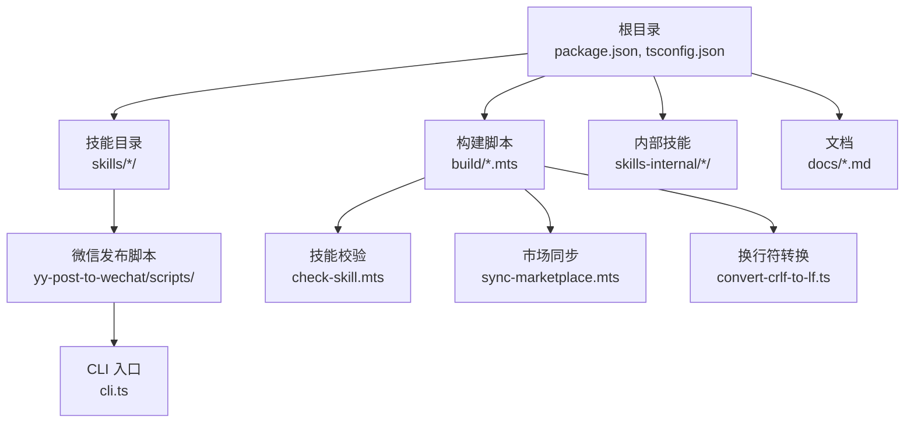
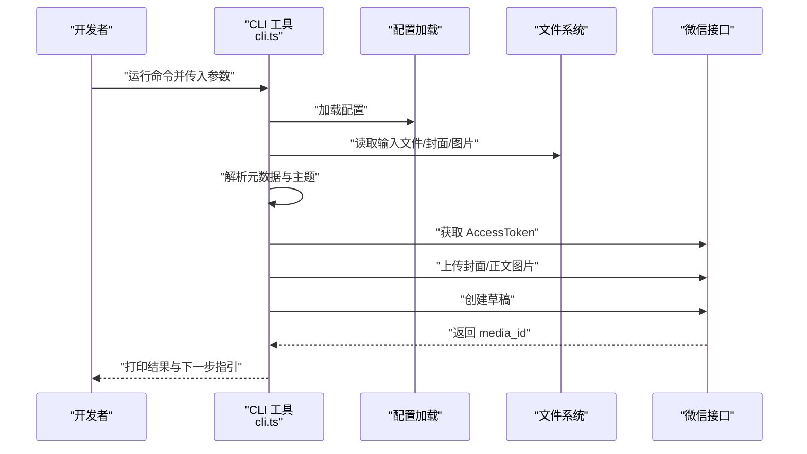
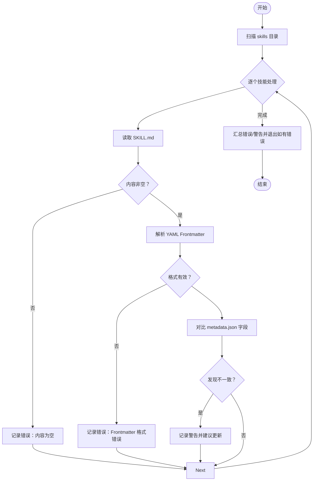
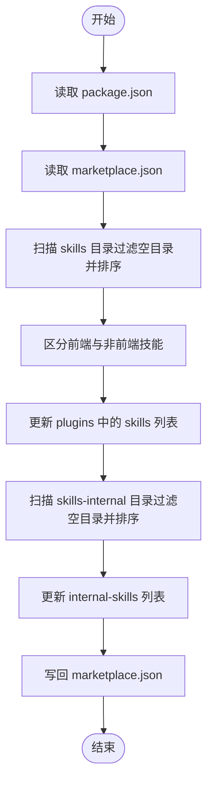
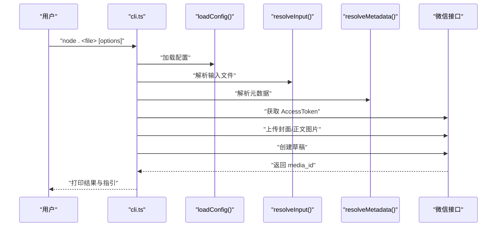
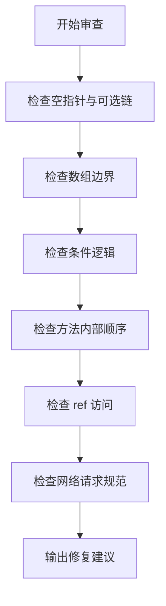
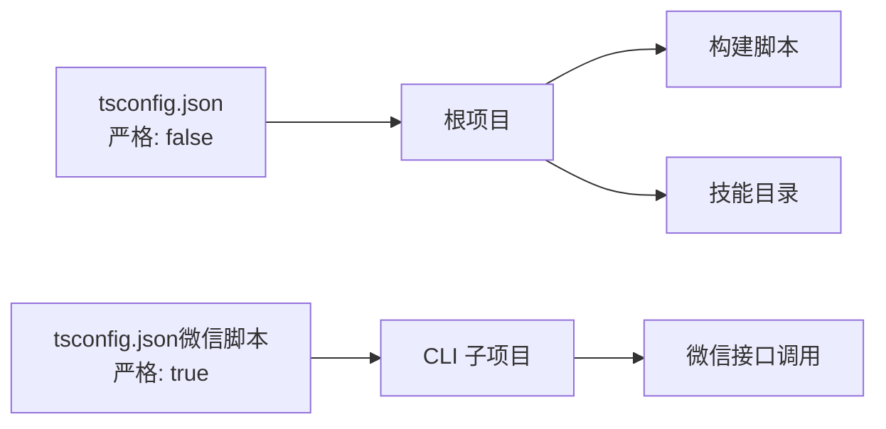

# 调试工具与技巧

<cite>
**本文档引用的文件**
- [package.json](file://package.json)
- [tsconfig.json](file://tsconfig.json)
- [DEVELOP.md](file://docs/DEVELOP.md)
- [CONFIG_RULE.md](file://docs/CONFIG_RULE.md)
- [check-skill.mts](file://build/check-skill.mts)
- [sync-marketplace.mts](file://build/sync-marketplace.mts)
- [convert-crlf-to-lf.ts](file://build/convert-crlf-to-lf.ts)
- [cli.ts](file://skills/yy-post-to-wechat/scripts/src/cli.ts)
- [package.json（微信脚本）](file://skills/yy-post-to-wechat/scripts/package.json)
- [tsconfig.json（微信脚本）](file://skills/yy-post-to-wechat/scripts/tsconfig.json)
- [best-practice.md](file://skills/yy-frontend-vue3-review/references/best-practice.md)
- [logic-error.md](file://skills/yy-frontend-vue3-review/references/logic-error.md)
- [evals.json（Vue3 审查）](file://skills/yy-frontend-vue3-review/evals.json)
- [evals.json（Vue2 审查）](file://skills/yy-frontend-vue2-review/evals.json)
- [content-template.md](file://skills/yy-create-rule/resources/content-template.md)
</cite>

## 目录
1. [简介](#简介)
2. [项目结构](#项目结构)
3. [核心组件](#核心组件)
4. [架构总览](#架构总览)
5. [详细组件分析](#详细组件分析)
6. [依赖关系分析](#依赖关系分析)
7. [性能考虑](#性能考虑)
8. [故障排查指南](#故障排查指南)
9. [结论](#结论)
10. [附录](#附录)

## 简介
本指南面向技能开发者与工程团队，系统化介绍本地调试方法、日志分析技巧、错误追踪工具使用，以及网络请求、文件系统操作与外部服务集成的调试策略。文档结合仓库内的构建与验证脚本、CLI 工具与前端审查规则，提供从环境配置到执行流程跟踪的完整调试实践路径。

## 项目结构
该项目采用“技能（skills）+ 内部技能（skills-internal）+ 构建与市场同步（build）+ 文档（docs）”的组织方式。技能以独立目录形式存在，每个技能通常包含说明文档与可选的子脚本。构建脚本负责元数据校验、市场清单同步与文本规范化。文档提供本地开发与规则配置指引。

图表来源
- [package.json:1-46](file://package.json#L1-L46)
- [tsconfig.json:1-24](file://tsconfig.json#L1-L24)
- [check-skill.mts:1-230](file://build/check-skill.mts#L1-L230)
- [sync-marketplace.mts:1-93](file://build/sync-marketplace.mts#L1-L93)
- [convert-crlf-to-lf.ts:1-130](file://build/convert-crlf-to-lf.ts#L1-L130)
- [cli.ts:1-264](file://skills/yy-post-to-wechat/scripts/src/cli.ts#L1-L264)

章节来源
- [package.json:1-46](file://package.json#L1-L46)
- [tsconfig.json:1-24](file://tsconfig.json#L1-L24)

## 核心组件
- 构建与校验脚本
  - 技能元数据校验：检查 SKILL.md 的 YAML Frontmatter、字段一致性与 metadata.json 对应项。
  - 市场清单同步：自动扫描技能目录，更新 marketplace.json 的插件列表与元信息。
  - 文本规范化：检查并转换 CRLF 到 LF，确保跨平台一致性。
- CLI 工具（微信发布）
  - 命令行参数解析、输入文件与元数据解析、主题与配色、封面图与正文图片上传、草稿创建与结果输出。
- 前端审查规则
  - 最佳实践与逻辑错误检测，指导调试断点、变量监控与流程跟踪。
- 规则与配置
  - OpenCode 与 Claude Code 的规则引入与配置方式，便于统一调试风格与约束。

章节来源
- [check-skill.mts:1-230](file://build/check-skill.mts#L1-L230)
- [sync-marketplace.mts:1-93](file://build/sync-marketplace.mts#L1-L93)
- [convert-crlf-to-lf.ts:1-130](file://build/convert-crlf-to-lf.ts#L1-L130)
- [cli.ts:1-264](file://skills/yy-post-to-wechat/scripts/src/cli.ts#L1-L264)
- [best-practice.md:1-85](file://skills/yy-frontend-vue3-review/references/best-practice.md#L1-L85)
- [logic-error.md:1-37](file://skills/yy-frontend-vue3-review/references/logic-error.md#L1-L37)
- [CONFIG_RULE.md:1-34](file://docs/CONFIG_RULE.md#L1-L34)

## 架构总览
下图展示本地调试与外部服务集成的整体流程：本地开发 → 技能安装 → CLI 执行 → 外部服务调用 → 结果反馈。

图表来源
- [cli.ts:148-258](file://skills/yy-post-to-wechat/scripts/src/cli.ts#L148-L258)

章节来源
- [DEVELOP.md:1-18](file://docs/DEVELOP.md#L1-L18)
- [cli.ts:1-264](file://skills/yy-post-to-wechat/scripts/src/cli.ts#L1-L264)

## 详细组件分析

### 组件一：技能元数据校验（check-skill.mts）
职责与流程
- 读取 skills 目录下每个技能的 SKILL.md，校验文件存在性、内容非空与 YAML Frontmatter 格式。
- 解析 Frontmatter 并与 metadata.json 进行字段一致性比对（description→abstract、author、version）。
- 输出错误与警告，并在出现错误时终止进程。

图表来源
- [check-skill.mts:50-172](file://build/check-skill.mts#L50-L172)

章节来源
- [check-skill.mts:1-230](file://build/check-skill.mts#L1-L230)

### 组件二：市场清单同步（sync-marketplace.mts）
职责与流程
- 读取 package.json 与 marketplace.json，同步名称、版本、描述与作者。
- 扫描 skills 与 skills-internal 目录，过滤空目录并排序，分别填充至对应插件的 skills 列表。
- 写回 marketplace.json 并输出同步结果。

图表来源
- [sync-marketplace.mts:12-92](file://build/sync-marketplace.mts#L12-L92)

章节来源
- [sync-marketplace.mts:1-93](file://build/sync-marketplace.mts#L1-L93)

### 组件三：CLI 工具（微信发布）——执行流程与断点建议
职责与流程
- 参数解析：主题、颜色、标题、摘要、作者、封面、引用开关等。
- 输入解析：校验文件存在性、识别 HTML/Markdown 输入。
- 元数据解析：优先 CLI 选项，其次 Frontmatter，再其次默认推断。
- 外部服务：获取 AccessToken、上传封面与正文图片、替换图片链接、创建草稿。
- 结果输出：打印文章信息与下一步指引。

断点与变量监控建议
- 在参数解析与输入解析阶段设置断点，核对路径与文件存在性。
- 在元数据解析处断点，检查 title/author/digest/coverPath 推断逻辑。
- 在获取 AccessToken 与上传图片处断点，观察凭证与网络异常。
- 在创建草稿处断点，记录 media_id 与后续跳转链接。

图表来源
- [cli.ts:148-258](file://skills/yy-post-to-wechat/scripts/src/cli.ts#L148-L258)

章节来源
- [cli.ts:1-264](file://skills/yy-post-to-wechat/scripts/src/cli.ts#L1-L264)

### 组件四：前端审查规则与调试实践
- 最佳实践：清理调试输出、推荐在 computed 等函数中使用 try/catch 并在 catch 中使用警告输出。
- 逻辑错误：空指针、数组越界、逻辑判断错误、方法内部逻辑顺序、ref 访问需使用 .value。
- 网络请求规范：使用 async/await + try/catch/finally，避免多层嵌套。

图表来源
- [best-practice.md:1-85](file://skills/yy-frontend-vue3-review/references/best-practice.md#L1-L85)
- [logic-error.md:1-37](file://skills/yy-frontend-vue3-review/references/logic-error.md#L1-L37)
- [evals.json（Vue3 审查）:246-281](file://skills/yy-frontend-vue3-review/evals.json#L246-L281)
- [evals.json（Vue2 审查）:246-277](file://skills/yy-frontend-vue2-review/evals.json#L246-L277)

章节来源
- [best-practice.md:1-85](file://skills/yy-frontend-vue3-review/references/best-practice.md#L1-L85)
- [logic-error.md:1-37](file://skills/yy-frontend-vue3-review/references/logic-error.md#L1-L37)
- [evals.json（Vue3 审查）:246-281](file://skills/yy-frontend-vue3-review/evals.json#L246-L281)
- [evals.json（Vue2 审查）:246-277](file://skills/yy-frontend-vue2-review/evals.json#L246-L277)

### 组件五：规则与配置（OpenCode / Claude Code）
- OpenCode：将规则文件放置于 .opencode/rules/，在项目根目录创建 opencode.json 并配置 instructions。
- Claude Code：在 CLAUDE.md 中通过 @path/to/import 引入规则文件，支持最多 5 层递归引用。

章节来源
- [CONFIG_RULE.md:1-34](file://docs/CONFIG_RULE.md#L1-L34)

## 依赖关系分析
- TypeScript 编译配置
  - 严格模式关闭，允许动态类型与隐式 any，便于快速迭代与调试。
  - 包含 .mts 与 .ts 文件，排除 skills 与 skills-internal 目录，避免与子项目的 tsconfig 冲突。
- CLI 项目配置
  - Node 引擎要求较高版本，启用严格类型检查与源码映射，便于定位问题。
  - ESLint/Prettier/TypeScript 检查贯穿开发流程，减少调试期的语法与风格问题。

图表来源
- [tsconfig.json:1-24](file://tsconfig.json#L1-L24)
- [tsconfig.json（微信脚本）:1-21](file://skills/yy-post-to-wechat/scripts/tsconfig.json#L1-L21)

章节来源
- [tsconfig.json:1-24](file://tsconfig.json#L1-L24)
- [tsconfig.json（微信脚本）:1-21](file://skills/yy-post-to-wechat/scripts/tsconfig.json#L1-L21)

## 性能考虑
- 日志与输出
  - 构建脚本与 CLI 工具广泛使用控制台输出，便于在 CI/本地快速定位问题。
  - 建议在生产环境或批量任务中减少冗余输出，保留关键指标（耗时、错误数）。
- 网络请求
  - 微信接口调用次数与顺序直接影响性能，建议合并上传与创建草稿步骤，避免重复请求。
- 类型检查
  - 根项目关闭严格模式，CLI 子项目开启严格模式，平衡开发效率与质量。

## 故障排查指南
- 技能元数据校验失败
  - 现象：Frontmatter 缺失或格式错误、字段不一致、目录名与 name 不匹配。
  - 处理：修正 SKILL.md 的 YAML Frontmatter，确保 description→abstract、author、version 与 metadata.json 一致。
- 市场清单不同步
  - 现象：新增技能未出现在 marketplace.json。
  - 处理：运行市场同步脚本，检查空目录清理与排序逻辑。
- CLI 执行失败
  - 现象：文件不存在、缺少凭证、封面缺失、网络异常。
  - 处理：核对输入路径与权限、检查配置文件中的 appId/appSecret、确保封面存在且可访问。
- 前端逻辑错误
  - 现象：空指针、数组越界、条件判断错误、ref 访问未使用 .value。
  - 处理：在审查规则指引下，使用断点与变量监控定位问题，遵循推荐的逻辑顺序与 try/catch 使用。
- 规则未生效
  - 现象：OpenCode/Claude Code 未应用自定义规则。
  - 处理：确认 opencode.json 的 instructions 配置与 CLAUDE.md 的 @path 引用层级限制。

章节来源
- [check-skill.mts:50-172](file://build/check-skill.mts#L50-L172)
- [sync-marketplace.mts:31-83](file://build/sync-marketplace.mts#L31-L83)
- [cli.ts:65-74](file://skills/yy-post-to-wechat/scripts/src/cli.ts#L65-L74)
- [best-practice.md:34-36](file://skills/yy-frontend-vue3-review/references/best-practice.md#L34-L36)
- [logic-error.md:7-36](file://skills/yy-frontend-vue3-review/references/logic-error.md#L7-L36)
- [CONFIG_RULE.md:1-34](file://docs/CONFIG_RULE.md#L1-L34)

## 结论
本指南基于仓库内的构建、校验与 CLI 工具，总结了本地调试、日志分析与错误追踪的关键实践。通过统一的规则配置、严格的元数据校验与清晰的执行流程，开发者可以高效定位问题、优化调试体验，并在外部服务集成场景中建立稳健的调试闭环。

## 附录
- 本地开发调试
  - 在根目录执行技能安装命令，避免提交本地生成文件（见开发文档说明）。
- 规则配置
  - OpenCode：将规则置于 .opencode/rules/，在 opencode.json 中配置 instructions。
  - Claude Code：在 CLAUDE.md 中使用 @path/to/import 引入规则，支持最多 5 层递归。

章节来源
- [DEVELOP.md:1-18](file://docs/DEVELOP.md#L1-L18)
- [CONFIG_RULE.md:1-34](file://docs/CONFIG_RULE.md#L1-L34)