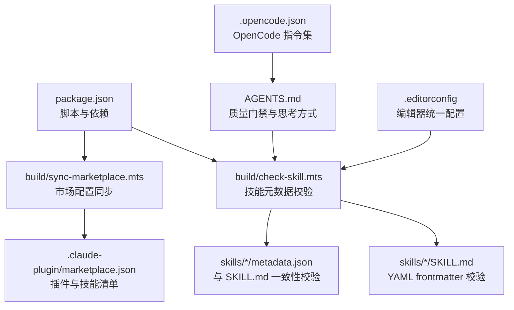
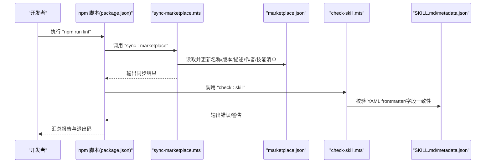
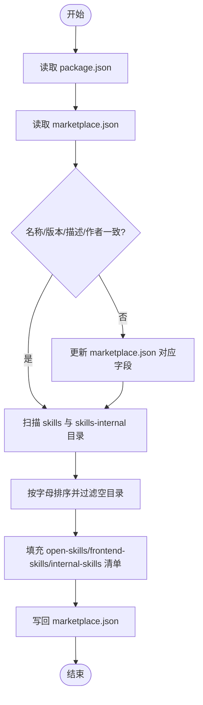
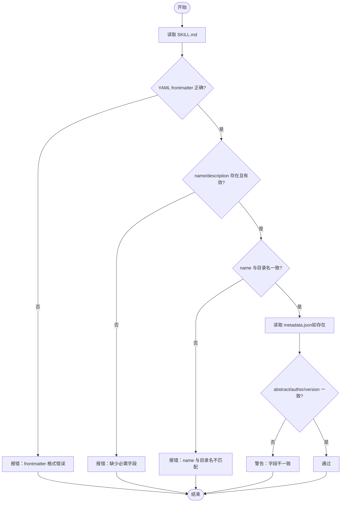
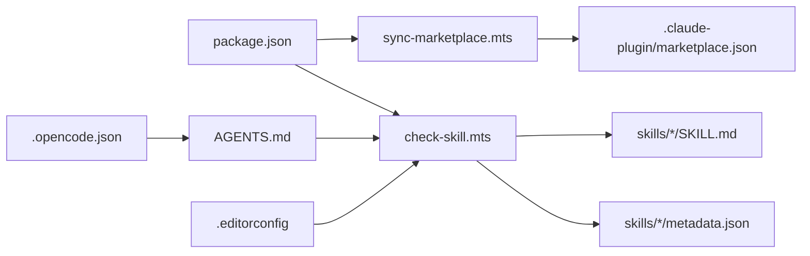

# 配置问题

<cite>
**本文引用的文件**
- [.claude-plugin/marketplace.json](file://.claude-plugin/marketplace.json)
- [AGENTS.md](file://AGENTS.md)
- [package.json](file://package.json)
- [build/check-skill.mts](file://build/check-skill.mts)
- [build/sync-marketplace.mts](file://build/sync-marketplace.mts)
- [.opencode.json](file://.opencode.json)
- [.editorconfig](file://.editorconfig)
- [skills/yy-comment/SKILL.md](file://skills/yy-comment/SKILL.md)
- [skills/yy-create-skill/SKILL.md](file://skills/yy-create-skill/SKILL.md)
- [rules/frontend-rules-vue2/RULE.md](file://rules/frontend-rules-vue2/RULE.md)
</cite>

## 目录
1. [简介](#简介)
2. [项目结构](#项目结构)
3. [核心组件](#核心组件)
4. [架构总览](#架构总览)
5. [详细组件分析](#详细组件分析)
6. [依赖分析](#依赖分析)
7. [性能考虑](#性能考虑)
8. [故障排除指南](#故障排除指南)
9. [结论](#结论)
10. [附录](#附录)

## 简介
本指南聚焦于配置问题的系统性故障排除，涵盖 marketplace.json 配置错误、技能配置文件格式问题、AI 代理配置异常，以及环境变量、权限与网络配置的排查方法。文档还提供配置验证工具与测试方法的使用指南，帮助快速定位并修复配置相关问题。

## 项目结构
该仓库围绕“技能”与“市场配置”两条主线组织：
- 市场配置：.claude-plugin/marketplace.json 定义插件与技能集合，由构建脚本自动同步。
- 技能元数据：每个技能目录下的 SKILL.md 使用 YAML frontmatter 定义 name 与 description，metadata.json 用于与 SKILL.md 的一致性校验。
- 代理与规则：AGENTS.md 定义质量门禁与思考方式；.opencode.json 与 .editorconfig 提供规则与编辑器配置。
- 构建与校验：package.json 中的脚本驱动检查与同步；build/check-skill.mts 与 build/sync-marketplace.mts 分别负责技能与市场配置的验证与同步。

**图表来源**
- [package.json:1-46](file://package.json#L1-L46)
- [build/check-skill.mts:1-230](file://build/check-skill.mts#L1-L230)
- [build/sync-marketplace.mts:1-93](file://build/sync-marketplace.mts#L1-L93)
- [.claude-plugin/marketplace.json:1-65](file://.claude-plugin/marketplace.json#L1-L65)
- [AGENTS.md:1-155](file://AGENTS.md#L1-L155)
- [.opencode.json:1-14](file://.opencode.json#L1-L14)
- [.editorconfig:1-10](file://.editorconfig#L1-L10)

**章节来源**
- [package.json:1-46](file://package.json#L1-L46)
- [.claude-plugin/marketplace.json:1-65](file://.claude-plugin/marketplace.json#L1-L65)
- [AGENTS.md:1-155](file://AGENTS.md#L1-L155)
- [.opencode.json:1-14](file://.opencode.json#L1-L14)
- [.editorconfig:1-10](file://.editorconfig#L1-L10)

## 核心组件
- 市场配置同步器：读取 package.json 与 skills 目录，自动更新 marketplace.json 的名称、版本、描述与作者，并按字母顺序填充技能清单。
- 技能元数据校验器：检查 SKILL.md 的 YAML frontmatter、name 与目录名一致性，以及 metadata.json 与 SKILL.md 的字段一致性。
- 质量门禁与规则：AGENTS.md 规定改动后必须执行的检查项与交付规范；.opencode.json 定义指令集；.editorconfig 统一编辑器行为。

**章节来源**
- [build/sync-marketplace.mts:1-93](file://build/sync-marketplace.mts#L1-L93)
- [build/check-skill.mts:1-230](file://build/check-skill.mts#L1-L230)
- [AGENTS.md:1-155](file://AGENTS.md#L1-L155)
- [.opencode.json:1-14](file://.opencode.json#L1-L14)
- [.editorconfig:1-10](file://.editorconfig#L1-L10)

## 架构总览
下图展示了配置相关组件之间的交互关系与控制流：

**图表来源**
- [package.json:7-16](file://package.json#L7-L16)
- [build/sync-marketplace.mts:12-93](file://build/sync-marketplace.mts#L12-L93)
- [build/check-skill.mts:177-230](file://build/check-skill.mts#L177-L230)

## 详细组件分析

### 市场配置文件 marketplace.json 故障排除
- 常见问题
  - 名称/版本/描述/作者与 package.json 不一致
  - 技能清单缺失或顺序不正确
  - 插件分组不完整（open-skills/frontend-skills/internal-skills）
- 诊断步骤
  - 确认 marketplace.json 的顶层 name、metadata.version、metadata.description、owner.name 与 package.json 对应字段一致。
  - 确认 plugins 数组包含 open-skills、frontend-skills、internal-skills 三个插件，且每个插件的 skills 列表来自 skills 与 skills-internal 目录的合法子目录。
  - 确保 skills 列表按字母顺序排序，且不包含空目录。
- 修复方法
  - 执行 npm run lint，其中包含 sync:marketplace 脚本，自动同步并写回 marketplace.json。
  - 如需手动修复，先修正 package.json，再运行同步脚本。

**图表来源**
- [build/sync-marketplace.mts:12-93](file://build/sync-marketplace.mts#L12-L93)
- [package.json:7-16](file://package.json#L7-L16)

**章节来源**
- [build/sync-marketplace.mts:12-93](file://build/sync-marketplace.mts#L12-L93)
- [.claude-plugin/marketplace.json:1-65](file://.claude-plugin/marketplace.json#L1-L65)
- [package.json:7-16](file://package.json#L7-L16)

### 技能配置文件格式问题
- SKILL.md 校验要点
  - 必须以 YAML frontmatter 开头（---），且包含 name 与 description。
  - name 必须与技能目录名一致。
  - description 支持多行折叠语法，但需保证 YAML 语法正确。
- metadata.json 一致性校验
  - abstract 应与 description（单行化）保持一致。
  - author 与 version 需与 SKILL.md 的 metadata.author 与 metadata.version 一致。
- 诊断与修复
  - 执行 npm run lint，其中 check:skill 会逐个检查 SKILL.md 与 metadata.json。
  - 根据输出的错误/警告逐项修正，必要时同步更新 metadata.json。

**图表来源**
- [build/check-skill.mts:50-172](file://build/check-skill.mts#L50-L172)

**章节来源**
- [build/check-skill.mts:50-172](file://build/check-skill.mts#L50-L172)
- [skills/yy-comment/SKILL.md:1-192](file://skills/yy-comment/SKILL.md#L1-L192)
- [skills/yy-create-skill/SKILL.md:1-200](file://skills/yy-create-skill/SKILL.md#L1-L200)

### AI 代理配置异常
- 质量门禁与思考方式
  - AGENTS.md 明确改动后必须执行的检查项与交付规范，包括执行 npm run lint、一致性检查与思维同步等。
  - 未遵循质量门禁可能导致技能与市场配置不一致，进而引发代理无法正确加载或触发。
- 规则与指令集
  - .opencode.json 定义指令集，确保 AI 在执行任务时遵循统一的规则与语言要求。
  - 规则文件（如 rules/frontend-rules-vue2/RULE.md）通过引用机制组织，需确保引用路径正确且层级不超过限定范围。

**章节来源**
- [AGENTS.md:1-155](file://AGENTS.md#L1-L155)
- [.opencode.json:1-14](file://.opencode.json#L1-L14)
- [rules/frontend-rules-vue2/RULE.md:1-62](file://rules/frontend-rules-vue2/RULE.md#L1-L62)

## 依赖分析
- 组件耦合
  - marketplace.json 依赖 package.json 的元数据与 skills 目录结构。
  - SKILL.md 与 metadata.json 的一致性依赖 check-skill.mts 的校验逻辑。
  - AGENTS.md 与 .opencode.json 共同约束 AI 的行为与规则。
- 外部依赖
  - js-yaml 用于解析 SKILL.md 的 YAML frontmatter。
  - markdownlint-cli 与 TypeScript 编译器用于文档与类型检查。

**图表来源**
- [package.json:1-46](file://package.json#L1-L46)
- [build/sync-marketplace.mts:1-93](file://build/sync-marketplace.mts#L1-L93)
- [build/check-skill.mts:1-230](file://build/check-skill.mts#L1-L230)
- [AGENTS.md:1-155](file://AGENTS.md#L1-L155)
- [.opencode.json:1-14](file://.opencode.json#L1-L14)
- [.editorconfig:1-10](file://.editorconfig#L1-L10)

**章节来源**
- [package.json:1-46](file://package.json#L1-L46)
- [build/sync-marketplace.mts:1-93](file://build/sync-marketplace.mts#L1-L93)
- [build/check-skill.mts:1-230](file://build/check-skill.mts#L1-L230)
- [AGENTS.md:1-155](file://AGENTS.md#L1-L155)
- [.opencode.json:1-14](file://.opencode.json#L1-L14)
- [.editorconfig:1-10](file://.editorconfig#L1-L10)

## 性能考虑
- 同步与校验的开销
  - marketplace.json 同步会遍历 skills 与 skills-internal 目录并排序，建议保持目录结构简洁，避免过多空目录。
  - check-skill.mts 对每个技能执行 YAML 解析与 JSON 对比，建议在 CI 中缓存依赖以减少重复安装时间。
- 编辑器与规则
  - .editorconfig 统一换行与缩进，有助于减少因格式差异导致的校验失败与重跑成本。

[本节为通用指导，无需具体文件分析]

## 故障排除指南

### marketplace.json 配置错误
- 症状
  - 代理无法加载某些技能或显示版本不一致。
- 诊断
  - 对比 package.json 与 marketplace.json 的元数据字段。
  - 检查 plugins 列表是否包含全部插件分组，skills 是否按字母排序。
- 修复
  - 运行 npm run lint，触发 sync:marketplace 自动修复。
  - 如需手动修复，先修正 package.json，再运行同步脚本。

**章节来源**
- [build/sync-marketplace.mts:12-93](file://build/sync-marketplace.mts#L12-L93)
- [.claude-plugin/marketplace.json:1-65](file://.claude-plugin/marketplace.json#L1-L65)
- [package.json:7-16](file://package.json#L7-L16)

### 技能配置文件格式问题
- 症状
  - 校验失败，提示 frontmatter 格式错误、缺少必需字段或 name 与目录名不匹配。
- 诊断
  - 检查 SKILL.md 的 YAML frontmatter 是否以 --- 开始与结束，字段是否齐全。
  - 确认 metadata.json 与 SKILL.md 的 abstract/author/version 是否一致。
- 修复
  - 修正 SKILL.md 的 YAML 语法与字段值。
  - 根据警告同步 metadata.json。

**章节来源**
- [build/check-skill.mts:50-172](file://build/check-skill.mts#L50-L172)
- [skills/yy-comment/SKILL.md:1-192](file://skills/yy-comment/SKILL.md#L1-L192)
- [skills/yy-create-skill/SKILL.md:1-200](file://skills/yy-create-skill/SKILL.md#L1-L200)

### AI 代理配置异常
- 症状
  - 代理行为不符合预期，或规则未生效。
- 诊断
  - 检查 AGENTS.md 的质量门禁是否被满足（执行 npm run lint、一致性检查、思维同步）。
  - 确认 .opencode.json 的指令集与语言要求是否正确。
  - 检查规则文件的引用路径与层级是否符合限制。
- 修复
  - 按 AGENTS.md 的质量门禁执行检查与同步。
  - 修正 .opencode.json 的指令集与规则引用。

**章节来源**
- [AGENTS.md:1-155](file://AGENTS.md#L1-L155)
- [.opencode.json:1-14](file://.opencode.json#L1-L14)
- [rules/frontend-rules-vue2/RULE.md:1-62](file://rules/frontend-rules-vue2/RULE.md#L1-L62)

### 环境变量设置
- 建议
  - 在本地与 CI 环境中统一 Node.js 版本与 npm/yarn 缓存策略。
  - 确保 markdownlint 与 TypeScript 相关依赖版本稳定，避免因工具版本差异导致的校验结果不一致。

**章节来源**
- [package.json:34-44](file://package.json#L34-L44)

### 权限配置
- 建议
  - marketplace.json 同步脚本会删除空目录，确保脚本运行具备写权限。
  - AGENTS.md 要求改动后执行 lint 与一致性检查，确保团队成员在受控范围内修改文件。

**章节来源**
- [build/sync-marketplace.mts:32-44](file://build/sync-marketplace.mts#L32-L44)
- [AGENTS.md:11-24](file://AGENTS.md#L11-L24)

### 网络配置
- 建议
  - 在 CI 环境中配置稳定的 npm/yarn 源，减少依赖下载失败的概率。
  - 规则与指令集引用外部资源时，确保网络可达与缓存可用。

[本节为通用指导，无需具体文件分析]

### 配置验证工具与测试方法
- 工具与脚本
  - npm run lint：综合执行技能检查、文档检查、类型检查与 marketplace 同步。
  - npm run check:skill：专门校验 SKILL.md 与 metadata.json。
  - npm run sync:marketplace：同步 marketplace.json。
- 测试方法
  - 在本地修改后先执行 npm run lint，确认无错误/警告。
  - 对涉及 AI 思考方式调整的改动，执行 AGENTS.md 中的质量门禁与同步步骤。

**章节来源**
- [package.json:7-16](file://package.json#L7-L16)
- [AGENTS.md:11-24](file://AGENTS.md#L11-L24)

## 结论
通过规范的配置管理与自动化校验，可以显著降低 marketplace.json 与技能配置文件的错误率。建议在每次改动后执行 npm run lint，并严格遵循 AGENTS.md 的质量门禁，确保配置与规则的一致性与可维护性。

[本节为总结，无需具体文件分析]

## 附录
- 相关参考
  - marketplace.json 结构与插件分组
  - SKILL.md YAML frontmatter 规范
  - metadata.json 与 SKILL.md 字段一致性
  - AGENTS.md 质量门禁与思考方式
  - .opencode.json 指令集
  - .editorconfig 编辑器配置

**章节来源**
- [.claude-plugin/marketplace.json:1-65](file://.claude-plugin/marketplace.json#L1-L65)
- [skills/yy-comment/SKILL.md:1-192](file://skills/yy-comment/SKILL.md#L1-L192)
- [skills/yy-create-skill/SKILL.md:1-200](file://skills/yy-create-skill/SKILL.md#L1-L200)
- [AGENTS.md:1-155](file://AGENTS.md#L1-L155)
- [.opencode.json:1-14](file://.opencode.json#L1-L14)
- [.editorconfig:1-10](file://.editorconfig#L1-L10)