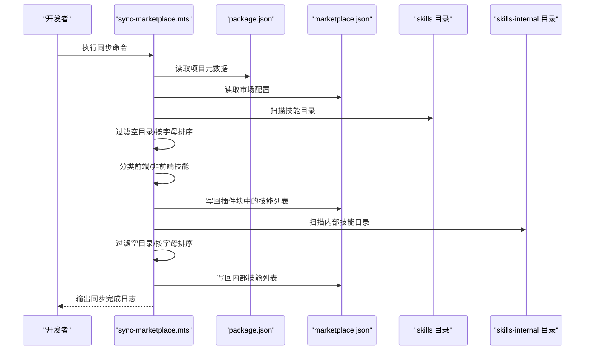
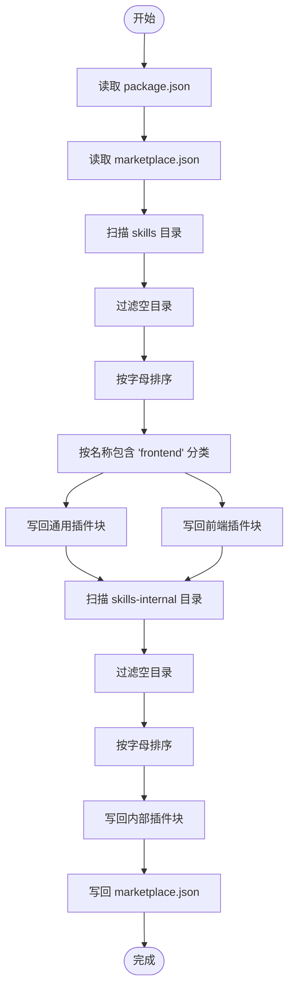
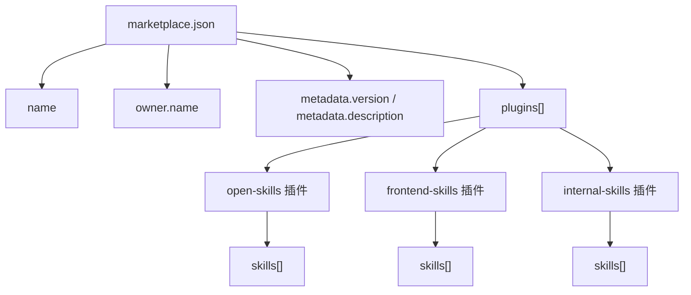
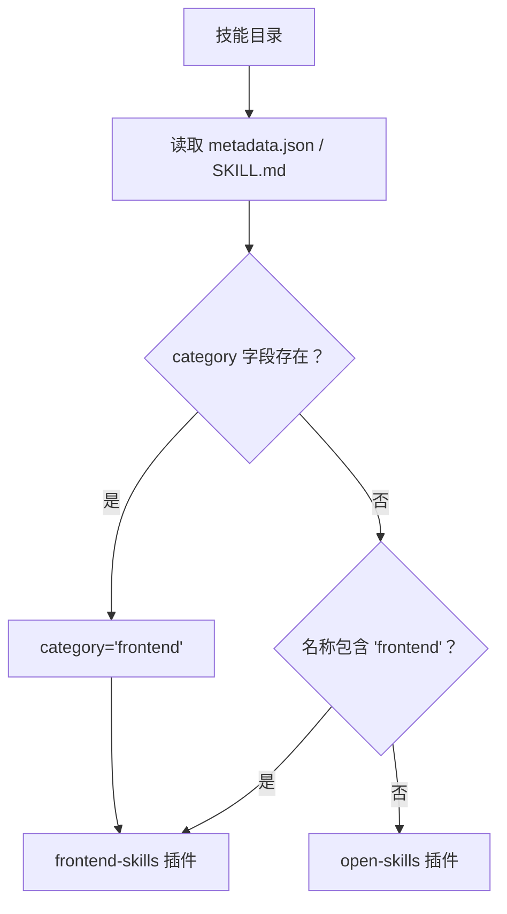
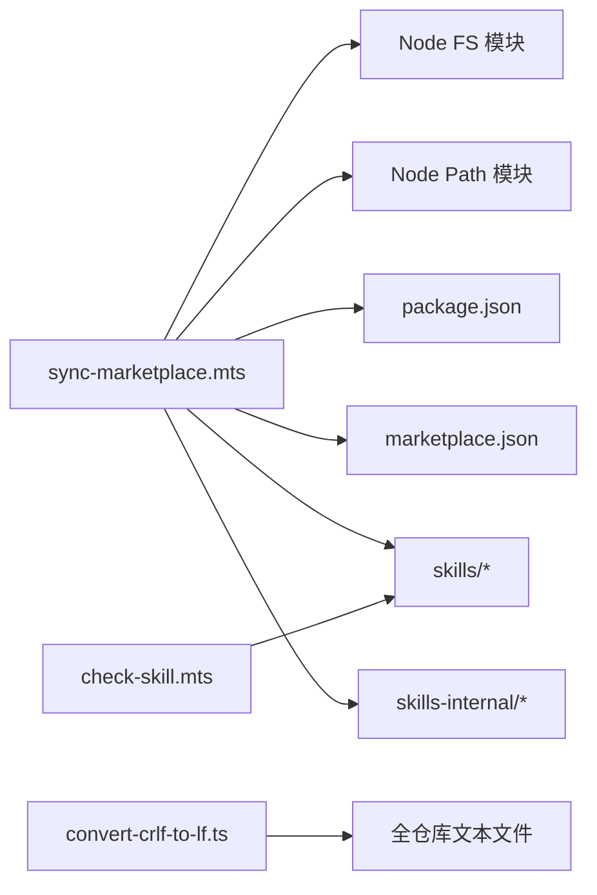

# 市场同步工具

<cite>
**本文引用的文件**
- [package.json](file://package.json)
- [marketplace.json](file://.claude-plugin/marketplace.json)
- [sync-marketplace.mts](file://build/sync-marketplace.mts)
- [check-skill.mts](file://build/check-skill.mts)
- [convert-crlf-to-lf.ts](file://build/convert-crlf-to-lf.ts)
- [metadata.json（Vue2 代码优化）](file://skills/yy-frontend-vue2-code-optimization/metadata.json)
- [metadata.json（Vue3 代码优化）](file://skills/yy-frontend-vue3-code-optimization/metadata.json)
- [metadata.json（Vue2 代码审核）](file://skills/yy-frontend-vue2-review/metadata.json)
- [metadata.json（Vue3 代码审核）](file://skills/yy-frontend-vue3-review/metadata.json)
- [metadata.json（前端提交助手）](file://skills/yy-frontend-commit/metadata.json)
- [SKILL.md（前端提交助手）](file://skills/yy-frontend-commit/SKILL.md)
- [SKILL.md（注释技能）](file://skills/yy-comment/SKILL.md)
</cite>

## 目录
1. [简介](#简介)
2. [项目结构](#项目结构)
3. [核心组件](#核心组件)
4. [架构总览](#架构总览)
5. [详细组件分析](#详细组件分析)
6. [依赖关系分析](#依赖关系分析)
7. [性能考量](#性能考量)
8. [故障排查指南](#故障排查指南)
9. [结论](#结论)
10. [附录](#附录)

## 简介
本文件面向开发者，系统性阐述“市场同步工具”的工作原理与实现细节，重点围绕 sync-marketplace.mts 脚本展开，覆盖以下方面：
- 从 package.json 读取元数据并同步至 marketplace.json 的机制
- 技能目录扫描、空目录过滤与按字母顺序排序的流程
- 市场配置文件结构与字段含义（name、version、description、author 等）
- 技能分类逻辑：前端技能与非前端技能的识别与分流
- 同步规则的可定制点与扩展方法（新增技能分类、修改同步规则）
- 错误处理与异常情况的应对策略
- 最佳实践与常见问题解决方案

## 项目结构
该仓库采用“技能即插件”的组织方式，市场配置位于 .claude-plugin/marketplace.json，同步脚本位于 build/sync-marketplace.mts，技能目录为 skills 与 skills-internal。

```mermaid
graph TB
A["package.json<br/>项目元数据"] --> B["sync-marketplace.mts<br/>同步脚本"]
C["marketplace.json<br/>市场配置"] <- --> B
D["skills/<技能目录>"] --> B
E["skills-internal/<内部技能>"] --> B
F["metadata.json<br/>技能元数据"] -.-> D
G["SKILL.md<br/>技能说明"] -.-> D
```

图示来源
- [package.json:1-46](file://package.json#L1-L46)
- [marketplace.json:1-65](file://.claude-plugin/marketplace.json#L1-L65)
- [sync-marketplace.mts:1-93](file://build/sync-marketplace.mts#L1-L93)

章节来源
- [package.json:1-46](file://package.json#L1-L46)
- [.claude-plugin/marketplace.json:1-65](file://.claude-plugin/marketplace.json#L1-L65)
- [build/sync-marketplace.mts:1-93](file://build/sync-marketplace.mts#L1-L93)

## 核心组件
- 同步脚本：负责读取 package.json 与 marketplace.json，扫描技能目录，过滤空目录，按字母排序，按分类写回对应插件块。
- 市场配置：定义市场名称、拥有者、版本、描述以及三个插件块（通用技能、前端技能、内部技能）及其包含的技能路径。
- 技能元数据：部分技能提供 metadata.json，其中包含 name、version、author、abstract、category、tags、compatibility、features 等字段；另有 SKILL.md 作为技能说明文档，常包含 YAML frontmatter（name、description、metadata）。
- 质量检查脚本：check-skill.mts 用于验证 SKILL.md 与 metadata.json 的一致性，辅助同步前的质量把关。

章节来源
- [build/sync-marketplace.mts:1-93](file://build/sync-marketplace.mts#L1-L93)
- [.claude-plugin/marketplace.json:1-65](file://.claude-plugin/marketplace.json#L1-L65)
- [build/check-skill.mts:1-230](file://build/check-skill.mts#L1-L230)

## 架构总览
同步流程由同步脚本驱动，核心步骤如下：
1. 读取 package.json 与 marketplace.json
2. 同步市场元数据（name、version、description、author）
3. 扫描 skills 目录，过滤空目录，按字母排序
4. 识别前端技能与非前端技能，分别写入对应插件块
5. 扫描 skills-internal 目录，同上处理
6. 写回 marketplace.json



图示来源
- [build/sync-marketplace.mts:12-93](file://build/sync-marketplace.mts#L12-L93)
- [package.json:1-46](file://package.json#L1-L46)
- [.claude-plugin/marketplace.json:1-65](file://.claude-plugin/marketplace.json#L1-L65)

## 详细组件分析

### 同步脚本：sync-marketplace.mts
- 作用：自动化将 package.json 的元数据同步到 marketplace.json，并根据技能目录动态更新各插件块的技能列表。
- 关键流程：
  - 读取 package.json 与 marketplace.json
  - 同步 name、version、description、author
  - 扫描 skills 目录：过滤空目录、按字母排序
  - 技能分类：前端技能（名称包含“frontend”）与非前端技能分流
  - 写回 marketplace.json
  - 对 skills-internal 目录执行相同流程



图示来源
- [build/sync-marketplace.mts:12-93](file://build/sync-marketplace.mts#L12-L93)

章节来源
- [build/sync-marketplace.mts:12-93](file://build/sync-marketplace.mts#L12-L93)

### 市场配置文件结构与字段含义
marketplace.json 的结构包含：
- 顶层字段
  - name：市场名称，来源于 package.json 的 name
  - owner.name：市场拥有者，来源于 package.json 的 author
  - metadata.version：市场版本，来源于 package.json 的 version
  - metadata.description：市场描述，来源于 package.json 的 description
  - plugins[]：插件块数组，包含 open-skills、frontend-skills、internal-skills 三类
- 插件块字段
  - name：插件名称（如 open-skills）
  - description：插件描述
  - source：源码路径前缀
  - strict：严格模式开关
  - skills[]：该插件包含的技能路径列表（相对路径）



图示来源
- [.claude-plugin/marketplace.json:1-65](file://.claude-plugin/marketplace.json#L1-L65)
- [package.json:1-46](file://package.json#L1-L46)

章节来源
- [.claude-plugin/marketplace.json:1-65](file://.claude-plugin/marketplace.json#L1-L65)
- [package.json:1-46](file://package.json#L1-L46)

### 技能元数据与分类逻辑
- 技能元数据来源
  - metadata.json：提供 name、version、author、abstract、category、tags、compatibility、features 等字段
  - SKILL.md：提供 YAML frontmatter（name、description、metadata），常包含 author、version 等
- 分类逻辑
  - 前端技能：名称中包含“frontend”的技能被识别为前端技能，写入 frontend-skills 插件块
  - 非前端技能：其余技能写入 open-skills 插件块
  - 内部技能：skills-internal 目录下的技能写入 internal-skills 插件块



图示来源
- [build/sync-marketplace.mts:49-60](file://build/sync-marketplace.mts#L49-L60)
- [skills/yy-frontend-vue2-code-optimization/metadata.json:1-40](file://skills/yy-frontend-vue2-code-optimization/metadata.json#L1-L40)
- [skills/yy-frontend-vue3-code-optimization/metadata.json:1-47](file://skills/yy-frontend-vue3-code-optimization/metadata.json#L1-L47)
- [skills/yy-frontend-vue2-review/metadata.json:1-34](file://skills/yy-frontend-vue2-review/metadata.json#L1-L34)
- [skills/yy-frontend-vue3-review/metadata.json:1-42](file://skills/yy-frontend-vue3-review/metadata.json#L1-L42)
- [skills/yy-frontend-commit/metadata.json:1-11](file://skills/yy-frontend-commit/metadata.json#L1-L11)

章节来源
- [build/sync-marketplace.mts:49-60](file://build/sync-marketplace.mts#L49-L60)
- [skills/yy-frontend-vue2-code-optimization/metadata.json:1-40](file://skills/yy-frontend-vue2-code-optimization/metadata.json#L1-L40)
- [skills/yy-frontend-vue3-code-optimization/metadata.json:1-47](file://skills/yy-frontend-vue3-code-optimization/metadata.json#L1-L47)
- [skills/yy-frontend-vue2-review/metadata.json:1-34](file://skills/yy-frontend-vue2-review/metadata.json#L1-L34)
- [skills/yy-frontend-vue3-review/metadata.json:1-42](file://skills/yy-frontend-vue3-review/metadata.json#L1-L42)
- [skills/yy-frontend-commit/metadata.json:1-11](file://skills/yy-frontend-commit/metadata.json#L1-L11)

### 同步规则与自定义方法
- 自定义技能分类
  - 当前规则：名称包含“frontend”的技能视为前端技能
  - 可扩展点：可在脚本中增加对 metadata.category 的判断，或引入更复杂的分类规则
- 同步规则修改
  - 技能路径前缀：当前为“./skills/”和“./skills-internal/”，可调整为其他约定
  - 排序规则：当前为字母排序，可替换为自定义排序策略
  - 插件块扩展：可新增插件块并在脚本中追加写回逻辑
- 新增技能分类的步骤
  - 在技能目录中新增符合命名约定的子目录
  - 如需独立插件块，需在 marketplace.json 中新增插件块，并在脚本中处理该插件块的写回逻辑

章节来源
- [build/sync-marketplace.mts:49-83](file://build/sync-marketplace.mts#L49-L83)
- [.claude-plugin/marketplace.json:10-63](file://.claude-plugin/marketplace.json#L10-L63)

### 元数据同步机制
- marketplace.json 的 name、metadata.version、metadata.description、owner.name 来源于 package.json 对应字段
- 同步脚本在读取 package.json 后，直接赋值到 marketplace.json 对应位置，确保市场元数据与项目版本保持一致

章节来源
- [build/sync-marketplace.mts:12-30](file://build/sync-marketplace.mts#L12-L30)
- [package.json:1-46](file://package.json#L1-L46)

### 目录扫描与空目录处理
- 扫描 skills 与 skills-internal 目录，过滤空目录并删除
- 过滤后按字母顺序排序，保证技能列表稳定可预测
- 删除空目录的日志输出便于审计

章节来源
- [build/sync-marketplace.mts:31-45](file://build/sync-marketplace.mts#L31-L45)
- [build/sync-marketplace.mts:62-77](file://build/sync-marketplace.mts#L62-L77)

### 技能说明与质量检查
- SKILL.md 的 YAML frontmatter 包含 name、description、metadata（author、version 等）
- check-skill.mts 用于验证 SKILL.md 与 metadata.json 的一致性，辅助同步前的质量把关
- convert-crlf-to-lf.ts 用于统一换行符，减少跨平台差异带来的问题

章节来源
- [build/check-skill.mts:50-172](file://build/check-skill.mts#L50-L172)
- [build/convert-crlf-to-lf.ts:1-119](file://build/convert-crlf-to-lf.ts#L1-L119)
- [skills/yy-frontend-commit/SKILL.md:1-311](file://skills/yy-frontend-commit/SKILL.md#L1-L311)
- [skills/yy-comment/SKILL.md:1-192](file://skills/yy-comment/SKILL.md#L1-L192)

## 依赖关系分析
- 同步脚本依赖于 Node.js 文件系统 API 与路径模块
- marketplace.json 与 package.json 为同步脚本的输入输出
- 技能目录中的 metadata.json 与 SKILL.md 为分类与一致性检查提供依据
- 质量检查脚本与换行符转换脚本为同步前的辅助工具



图示来源
- [build/sync-marketplace.mts:1-10](file://build/sync-marketplace.mts#L1-L10)
- [build/check-skill.mts:1-5](file://build/check-skill.mts#L1-L5)
- [build/convert-crlf-to-lf.ts:1-4](file://build/convert-crlf-to-lf.ts#L1-L4)

章节来源
- [build/sync-marketplace.mts:1-10](file://build/sync-marketplace.mts#L1-L10)
- [build/check-skill.mts:1-5](file://build/check-skill.mts#L1-L5)
- [build/convert-crlf-to-lf.ts:1-4](file://build/convert-crlf-to-lf.ts#L1-L4)

## 性能考量
- 目录扫描与文件读取为 O(N) 操作，N 为技能目录下子目录数量
- 过滤空目录与排序均为线性或近似线性复杂度
- 建议在大型仓库中定期清理空目录，减少不必要的 IO
- 可考虑缓存已知有效技能列表，避免重复扫描

## 故障排查指南
- 文件读取失败
  - 现象：脚本报错，无法读取 package.json 或 marketplace.json
  - 处理：检查文件权限与路径，确认文件存在且可读
- 目录为空
  - 现象：空目录被删除并输出日志
  - 处理：确认技能目录结构，清理无效空目录
- 技能分类错误
  - 现象：技能未落入预期插件块
  - 处理：检查技能名称是否包含“frontend”，或在脚本中增加 metadata.category 判断
- 元数据不同步
  - 现象：marketplace.json 的 name/version/description/author 未更新
  - 处理：确认 package.json 字段正确，重新执行同步脚本
- 质量检查失败
  - 现象：check-skill.mts 报告 SKILL.md 与 metadata.json 不一致
  - 处理：根据警告提示修正 metadata.json 或 SKILL.md 的对应字段

章节来源
- [build/sync-marketplace.mts:38-41](file://build/sync-marketplace.mts#L38-L41)
- [build/sync-marketplace.mts:68-74](file://build/sync-marketplace.mts#L68-L74)
- [build/check-skill.mts:127-172](file://build/check-skill.mts#L127-L172)

## 结论
市场同步工具通过 sync-marketplace.mts 将项目元数据与技能目录动态同步至 marketplace.json，实现了市场配置的自动化维护。借助 metadata.json 与 SKILL.md 的协同，系统能够识别前端技能并进行分流，同时提供质量检查与换行符统一等辅助能力。开发者可通过扩展分类规则与插件块，灵活适配团队的技能组织方式。

## 附录
- 常用命令
  - 同步市场：执行脚本中的同步命令
  - 质量检查：运行技能检查脚本
  - 统一换行符：运行换行符转换脚本（支持 --check 检查模式）
- 最佳实践
  - 保持技能目录命名规范，便于前端技能识别
  - 在 metadata.json 与 SKILL.md 中保持字段一致性
  - 定期清理空目录，避免冗余
  - 在团队内约定技能分类规则，必要时扩展脚本逻辑