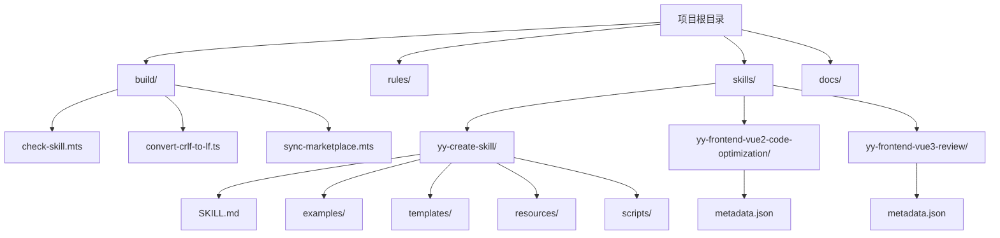
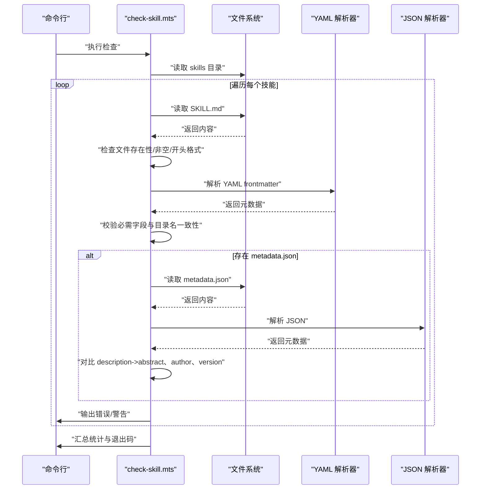
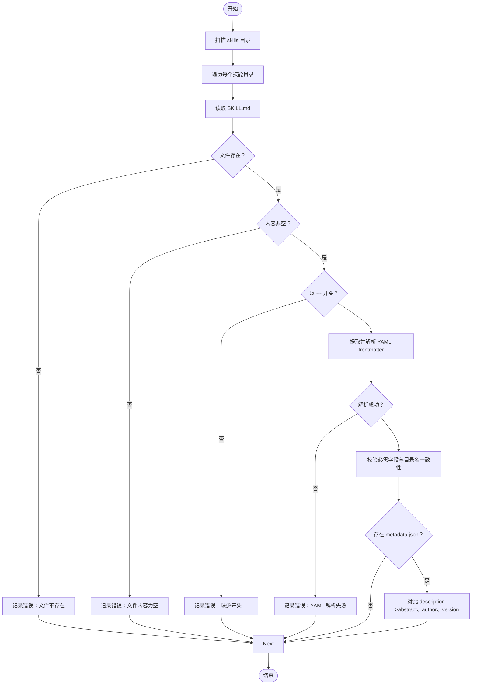
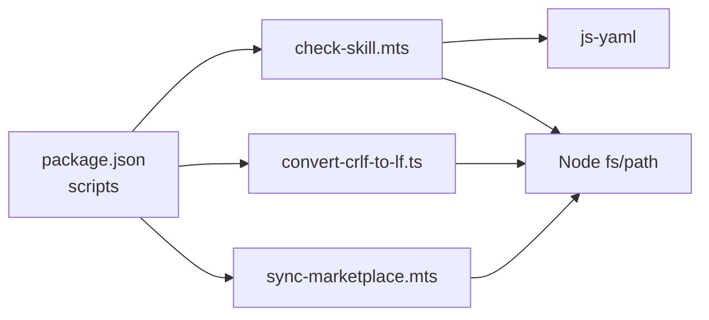

# 技能检查工具

<cite>
**本文引用的文件**
- [package.json](file://package.json)
- [check-skill.mts](file://build/check-skill.mts)
- [convert-crlf-to-lf.ts](file://build/convert-crlf-to-lf.ts)
- [sync-marketplace.mts](file://build/sync-marketplace.mts)
- [STRUCTURE.md](file://docs/STRUCTURE.md)
- [DEVELOP.md](file://docs/DEVELOP.md)
- [CLAUDE_CODE_SKILL.md](file://docs/CLAUDE_CODE_SKILL.md)
- [SKILL.md](file://skills/yy-create-skill/SKILL.md)
- [input.md](file://skills/yy-create-rule/examples/input.md)
- [output.md](file://skills/yy-create-rule/examples/output.md)
- [metadata.json](file://skills/yy-frontend-vue2-code-optimization/metadata.json)
- [metadata.json](file://skills/yy-frontend-vue2-review/metadata.json)
- [metadata.json](file://skills/yy-frontend-vue3-code-optimization/metadata.json)
- [metadata.json](file://skills/yy-frontend-vue3-review/metadata.json)
</cite>

## 目录
1. [简介](#简介)
2. [项目结构](#项目结构)
3. [核心组件](#核心组件)
4. [架构总览](#架构总览)
5. [详细组件分析](#详细组件分析)
6. [依赖关系分析](#依赖关系分析)
7. [性能考虑](#性能考虑)
8. [故障排查指南](#故障排查指南)
9. [结论](#结论)
10. [附录](#附录)

## 简介
本文件为“技能检查工具”的全面技术文档，聚焦于 check-skill.mts 脚本的检查逻辑与验证规则，涵盖技能文件结构验证、必需字段检查、格式规范验证、示例文件检查、一致性校验、输出格式与错误报告机制、扩展与自定义规则方法、性能优化与批量处理能力，以及面向技能开发者的使用指南与常见问题排查。

## 项目结构
仓库采用“技能 + 规则 + 构建脚本 + 文档”的组织方式：
- skills：公共技能目录，每个子目录代表一个技能，通常包含 SKILL.md 与可选的 metadata.json、examples、templates、resources、scripts 等。
- rules：自定义规则集合，按领域划分（如前端 Vue2/Vue3 规则）。
- build：构建与检查脚本，包含技能检查、换行符转换、市场同步等。
- docs：项目文档，包含结构说明、开发指南、安装说明等。

图表来源
- [STRUCTURE.md:1-10](file://docs/STRUCTURE.md#L1-L10)
- [check-skill.mts:1-230](file://build/check-skill.mts#L1-L230)
- [SKILL.md:1-213](file://skills/yy-create-skill/SKILL.md#L1-L213)

章节来源
- [STRUCTURE.md:1-10](file://docs/STRUCTURE.md#L1-L10)
- [DEVELOP.md:1-18](file://docs/DEVELOP.md#L1-L18)

## 核心组件
- 技能检查脚本（check-skill.mts）：扫描 skills 目录，逐个技能验证 SKILL.md 的 YAML frontmatter 结构、必需字段、与 metadata.json 的一致性，并输出错误与警告。
- 换行符转换脚本（convert-crlf-to-lf.ts）：批量扫描文本文件，将 CRLF 转换为 LF，支持仅检查模式。
- 市场同步脚本（sync-marketplace.mts）：同步 package.json 与 .claude-plugin/marketplace.json，自动整理技能列表并写回。
- 技能示例与元数据：各技能目录中的 SKILL.md 与 metadata.json 作为检查目标与比对对象。

章节来源
- [check-skill.mts:1-230](file://build/check-skill.mts#L1-L230)
- [convert-crlf-to-lf.ts:1-119](file://build/convert-crlf-to-lf.ts#L1-L119)
- [sync-marketplace.mts:1-93](file://build/sync-marketplace.mts#L1-L93)

## 架构总览
技能检查工具的整体流程如下：
- 读取 skills 目录，遍历每个技能子目录。
- 对每个技能：检查 SKILL.md 是否存在、内容是否为空、是否以 YAML frontmatter 开头、frontmatter 是否可解析。
- 校验 SKILL.md 的必需字段（name、description），并确保 name 与目录名一致。
- 若存在 metadata.json：将 SKILL.md 的 description 单行化并与 metadata.json 的 abstract 对比；将 metadata.author/version 与 SKILL.md 的 metadata.author/version 对比，输出一致性警告。
- 汇总错误与警告，错误导致进程退出码非零，警告提示用户修正 metadata.json。

图表来源
- [check-skill.mts:177-229](file://build/check-skill.mts#L177-L229)

## 详细组件分析

### 组件一：技能检查脚本（check-skill.mts）
- 输入输出
  - 输入：skills 目录下的每个技能子目录，期望包含 SKILL.md 与可选的 metadata.json。
  - 输出：控制台打印每个技能的错误与警告；错误数量大于 0 时退出码为 1；警告数量大于 0 时提示用户修正 metadata.json。
- 关键流程
  - 目录扫描：读取 skills 子目录，逐个处理。
  - 文件存在性与格式检查：SKILL.md 必须存在且非空，frontmatter 必须以 "---" 开头与结尾。
  - YAML frontmatter 解析：使用 js-yaml 解析，捕获解析异常。
  - 必需字段校验：name 与 description 均不可为空；name 必须与目录名一致。
  - metadata.json 一致性校验：description 单行化后与 abstract 对比；metadata.author/version 与 JSON 中字段对比，输出一致性警告。
  - 结果汇总：统计错误与警告总数，决定最终退出码。
- 数据结构
  - SkillMetadata：name、description、icon、examples、metadata（含 author、version 等）。
  - MetadataJson：version、date、author、abstract、references、tags 等。
  - ValidationResult：包含 skillName、hasErrors、errors、warnings。

图表来源
- [check-skill.mts:50-172](file://build/check-skill.mts#L50-L172)

章节来源
- [check-skill.mts:1-230](file://build/check-skill.mts#L1-L230)

### 组件二：示例与模板验证（SKILL.md 与 examples）
- SKILL.md 格式要求
  - 必须包含 YAML frontmatter，且以 "---" 包裹；name 与 description 为必需字段；name 必须与目录名一致。
  - 正文包含“描述”、“使用场景”、“指令”等章节，描述技能用途、触发条件、边界、步骤与输出格式。
  - 模板与资源：可选 examples/、templates/、resources/、scripts/ 目录，用于提供示例、模板、资源与可执行脚本。
- 示例文件检查
  - examples/input.md 与 examples/output.md 展示用户输入与期望输出，便于人工验收与回归验证。
- metadata.json 一致性
  - abstract 应与 description（单行化）保持一致；author 与 version 分别与 SKILL.md 的 metadata.author 与 metadata.version 保持一致。

章节来源
- [SKILL.md:1-213](file://skills/yy-create-skill/SKILL.md#L1-L213)
- [input.md:1-34](file://skills/yy-create-rule/examples/input.md#L1-L34)
- [output.md:1-32](file://skills/yy-create-rule/examples/output.md#L1-L32)
- [metadata.json:1-40](file://skills/yy-frontend-vue2-code-optimization/metadata.json#L1-L40)
- [metadata.json:1-34](file://skills/yy-frontend-vue2-review/metadata.json#L1-L34)
- [metadata.json:1-47](file://skills/yy-frontend-vue3-code-optimization/metadata.json#L1-L47)
- [metadata.json:1-42](file://skills/yy-frontend-vue3-review/metadata.json#L1-L42)

### 组件三：批量换行符转换（convert-crlf-to-lf.ts）
- 功能概述
  - 递归扫描项目根目录，识别文本文件（基于扩展名与特定文件名），将 CRLF（\r\n）替换为 LF（\n）。
  - 支持“仅检查”模式（--check），不修改文件，仅输出可转换文件列表。
- 性能与健壮性
  - 忽略空文件与受控目录（.git、node_modules 等）。
  - 仅对文本文件进行处理，减少无关文件 IO。
- 使用场景
  - 统一团队协作中的换行符，避免跨平台差异导致的 CI/CD 问题。

章节来源
- [convert-crlf-to-lf.ts:1-119](file://build/convert-crlf-to-lf.ts#L1-L119)

### 组件四：市场同步（sync-marketplace.mts）
- 功能概述
  - 读取 package.json 与 .claude-plugin/marketplace.json，同步 name、version、description、author 等元数据。
  - 自动扫描 skills 与 skills-internal 目录，过滤空目录，按字母排序，分别填充 open-skills 与 internal-skills 插件的 skills 列表。
  - 写回 marketplace.json，完成市场清单同步。
- 注意事项
  - 会删除空目录，避免脏数据进入市场清单。

章节来源
- [sync-marketplace.mts:1-93](file://build/sync-marketplace.mts#L1-L93)

## 依赖关系分析
- 构建脚本依赖
  - check-skill.mts 依赖 js-yaml 进行 frontmatter 解析，依赖 Node.js fs/path 进行文件系统操作。
  - convert-crlf-to-lf.ts 依赖 Node.js 异步 fs API，支持 Promise 风格递归扫描。
  - sync-marketplace.mts 依赖 Node.js fs 与 JSON 解析，读写 marketplace.json。
- 项目脚本集成
  - package.json 中通过 npm scripts 调用 check-skill.mts，形成统一的检查入口。

图表来源
- [package.json:7-16](file://package.json#L7-L16)
- [check-skill.mts:1-6](file://build/check-skill.mts#L1-L6)
- [convert-crlf-to-lf.ts:1-4](file://build/convert-crlf-to-lf.ts#L1-L4)
- [sync-marketplace.mts:1-10](file://build/sync-marketplace.mts#L1-L10)

章节来源
- [package.json:1-46](file://package.json#L1-L46)

## 性能考虑
- I/O 优化
  - 仅对存在 frontmatter 的文件进行 YAML 解析，避免对非 Markdown 文件的无效解析。
  - 仅在存在 metadata.json 时进行 JSON 对比，减少不必要的文件读取。
- 扫描策略
  - 使用同步 readdir 遍历 skills 目录，简单高效；对于大规模技能集，可考虑并发处理（见扩展建议）。
- 文本处理
  - description 单行化采用正则替换，时间复杂度近似 O(n)，对较长 description 影响有限。
- 批量处理
  - 通过 npm scripts 一次性执行检查，适合 CI 场景；可在 CI 中并行化多个检查任务（如 lint、type check、换行符转换等）。

## 故障排查指南
- 常见错误
  - SKILL.md 不存在：检查技能目录命名与文件是否存在。
  - 文件内容为空：补全 SKILL.md 内容。
  - frontmatter 缺少结束 "---"：补齐 YAML frontmatter。
  - YAML 解析失败：检查 frontmatter 语法，确保缩进与键名正确。
  - name 与目录名不一致：统一 name 与目录名。
  - metadata.json 与 SKILL.md 不一致：根据警告提示更新 metadata.json 的 abstract、author、version。
- 退出码
  - 错误数量 > 0：进程退出码为 1，CI 将中断。
  - 警告数量 > 0：提示用户修正 metadata.json，不影响 CI 通过。
- 本地调试
  - 使用 npm 脚本运行检查：npm run check:skill。
  - 使用仅检查模式转换换行符：node build/convert-crlf-to-lf.ts --check。

章节来源
- [check-skill.mts:177-229](file://build/check-skill.mts#L177-L229)
- [convert-crlf-to-lf.ts:96-101](file://build/convert-crlf-to-lf.ts#L96-L101)

## 结论
技能检查工具以 check-skill.mts 为核心，围绕 SKILL.md 与 metadata.json 的一致性进行严格校验，辅以换行符统一与市场清单同步，形成完整的技能质量保障体系。通过清晰的错误与警告分类、可扩展的校验规则与良好的性能表现，能够有效提升技能开发与维护效率。

## 附录

### 使用指南
- 本地安装与运行
  - 安装依赖后，通过 npm 脚本运行检查：npm run check:skill。
  - 如需仅检查换行符问题，使用：node build/convert-crlf-to-lf.ts --check。
- 在 Claude Code 中安装技能
  - 参考文档逐步添加市场与插件，安装完成后即可通过 /<技能名> 调用。

章节来源
- [package.json:7-16](file://package.json#L7-L16)
- [CLAUDE_CODE_SKILL.md:1-10](file://docs/CLAUDE_CODE_SKILL.md#L1-L10)

### 自定义检查规则与扩展点
- 扩展校验逻辑
  - 在 validateSkillMd 中增加新的字段校验或格式约束。
  - 在 validateMetadataJson 中新增字段对比逻辑。
- 新增检查项
  - 可在主流程中增加对 examples/、templates/、resources/、scripts/ 等目录的结构与内容检查。
- 并发与批处理
  - 将技能目录遍历改为 Promise.all 并发处理，显著提升大规模技能集的检查速度。
- 输出格式与报告
  - 可将错误与警告汇总为 JSON 报告，便于 CI/CD 集成与可视化展示。

章节来源
- [check-skill.mts:177-229](file://build/check-skill.mts#L177-L229)