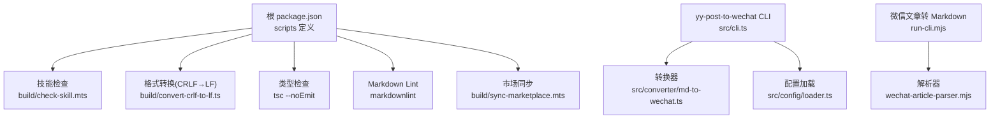
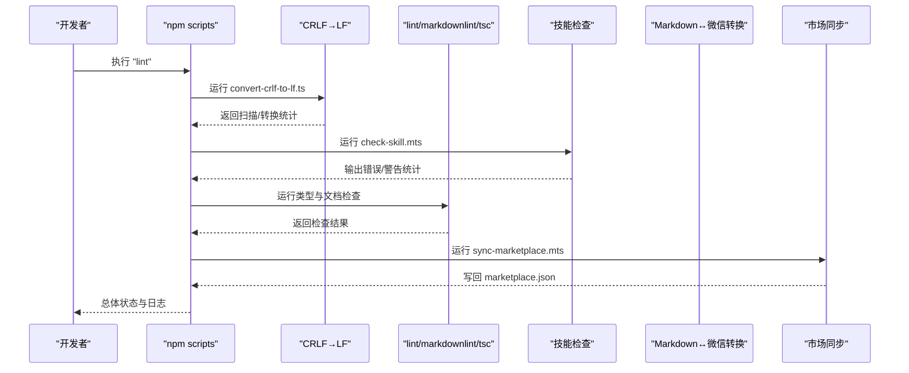
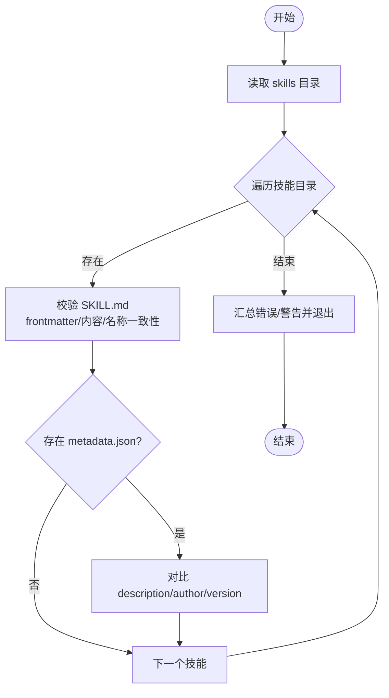
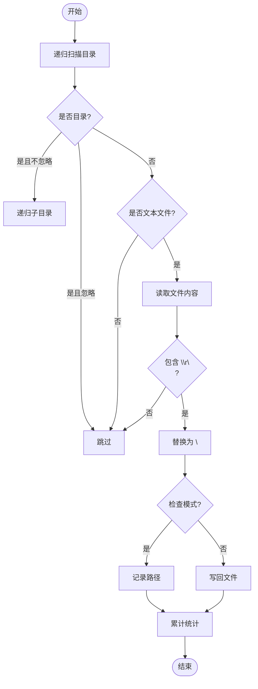
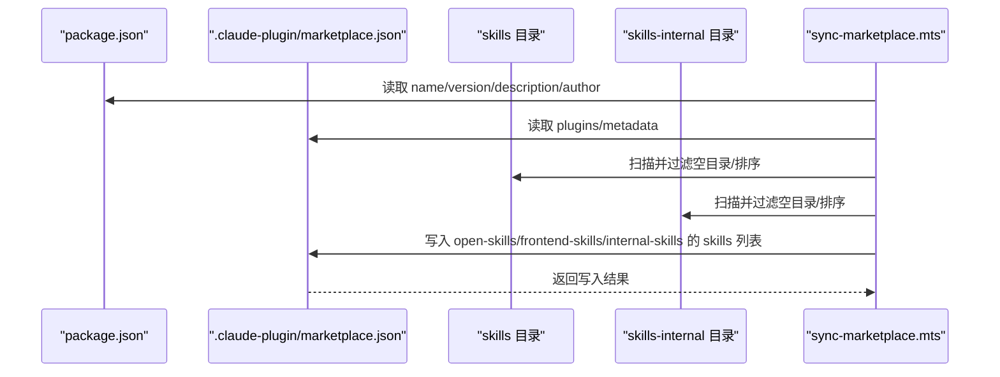
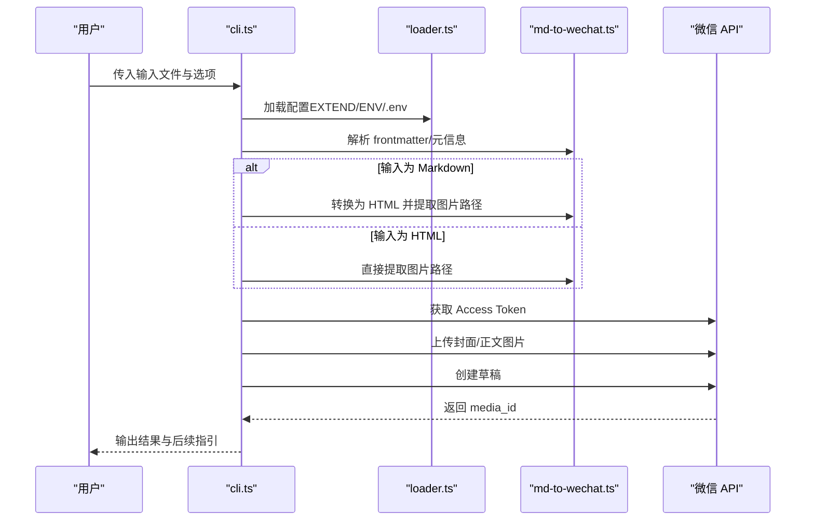
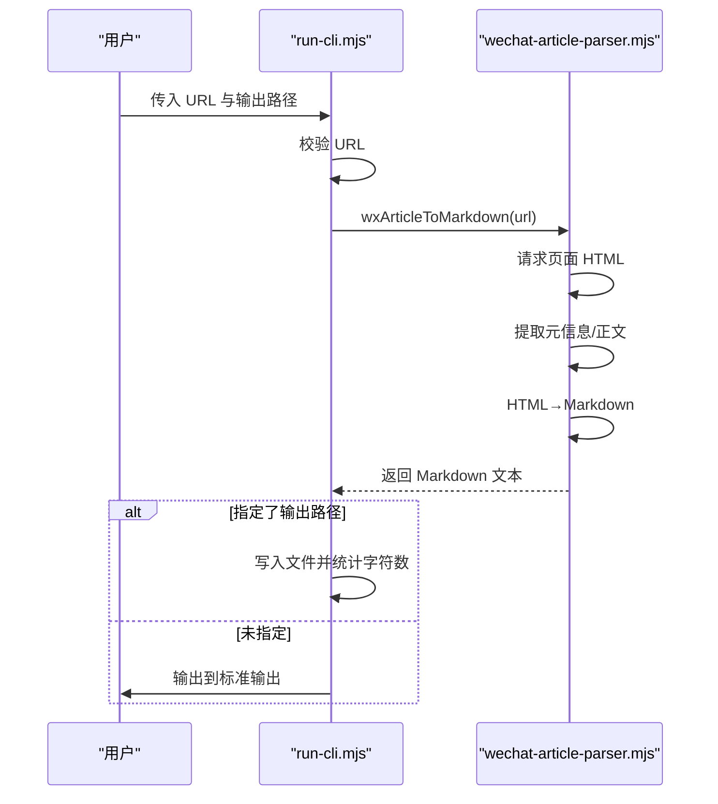
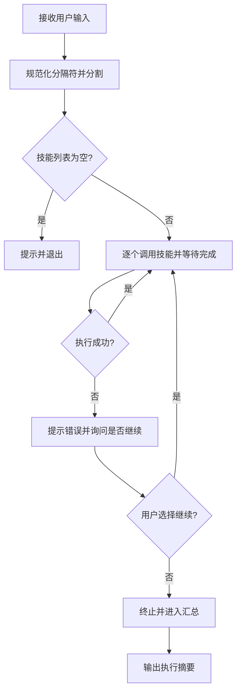
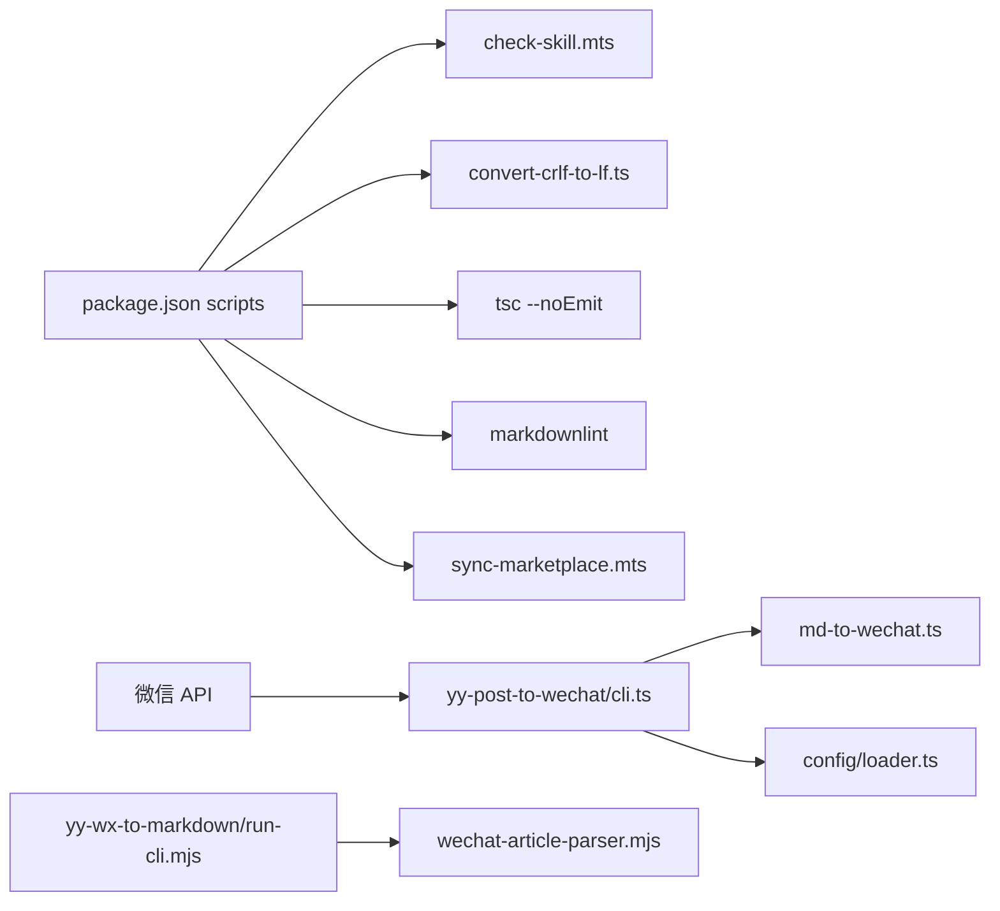

# 构建工具

<cite>
**本文引用的文件**
- [package.json](file://package.json)
- [build/check-skill.mts](file://build/check-skill.mts)
- [build/sync-marketplace.mts](file://build/sync-marketplace.mts)
- [build/convert-crlf-to-lf.ts](file://build/convert-crlf-to-lf.ts)
- [skills/yy-post-to-wechat/scripts/package.json](file://skills/yy-post-to-wechat/scripts/package.json)
- [skills/yy-post-to-wechat/scripts/src/cli.ts](file://skills/yy-post-to-wechat/scripts/src/cli.ts)
- [skills/yy-post-to-wechat/scripts/src/converter/md-to-wechat.ts](file://skills/yy-post-to-wechat/scripts/src/converter/md-to-wechat.ts)
- [skills/yy-post-to-wechat/scripts/src/config/loader.ts](file://skills/yy-post-to-wechat/scripts/src/config/loader.ts)
- [skills/yy-wx-to-markdown/scripts/run-cli.mjs](file://skills/yy-wx-to-markdown/scripts/run-cli.mjs)
- [skills/yy-wx-to-markdown/scripts/wechat-article-parser.mjs](file://skills/yy-wx-to-markdown/scripts/wechat-article-parser.mjs)
- [skills/yy-run-skills/SKILL.md](file://skills/yy-run-skills/SKILL.md)
</cite>

## 目录
1. [简介](#简介)
2. [项目结构](#项目结构)
3. [核心组件](#核心组件)
4. [架构总览](#架构总览)
5. [详细组件分析](#详细组件分析)
6. [依赖分析](#依赖分析)
7. [性能考虑](#性能考虑)
8. [故障排查指南](#故障排查指南)
9. [结论](#结论)
10. [附录](#附录)

## 简介
本文件面向构建工具系统的使用者与维护者，系统性阐述该仓库的构建体系与自动化流程，覆盖技能检查、格式转换与市场同步等模块；明确构建脚本的执行顺序与依赖关系，给出配置项与参数传递方式，解释错误处理与异常恢复机制，并提供性能优化策略与扩展方法，帮助运维人员完成环境部署与监控。

## 项目结构
仓库采用“技能即模块”的组织方式，根目录通过 npm scripts 统一编排构建流程；核心构建逻辑位于 build 目录，技能转换与发布能力集中在 yy-post-to-wechat 与 yy-wx-to-markdown 等子项目中；技能清单与市场同步由独立脚本驱动。

图表来源
- [package.json:7-16](file://package.json#L7-L16)
- [build/check-skill.mts:177-229](file://build/check-skill.mts#L177-L229)
- [build/convert-crlf-to-lf.ts:56-110](file://build/convert-crlf-to-lf.ts#L56-L110)
- [build/sync-marketplace.mts:12-92](file://build/sync-marketplace.mts#L12-L92)
- [skills/yy-post-to-wechat/scripts/src/cli.ts:148-258](file://skills/yy-post-to-wechat/scripts/src/cli.ts#L148-L258)
- [skills/yy-post-to-wechat/scripts/src/converter/md-to-wechat.ts:30-90](file://skills/yy-post-to-wechat/scripts/src/converter/md-to-wechat.ts#L30-L90)
- [skills/yy-post-to-wechat/scripts/src/config/loader.ts:130-144](file://skills/yy-post-to-wechat/scripts/src/config/loader.ts#L130-L144)
- [skills/yy-wx-to-markdown/scripts/run-cli.mjs:11-47](file://skills/yy-wx-to-markdown/scripts/run-cli.mjs#L11-L47)
- [skills/yy-wx-to-markdown/scripts/wechat-article-parser.mjs:136-192](file://skills/yy-wx-to-markdown/scripts/wechat-article-parser.mjs#L136-L192)

章节来源
- [package.json:7-16](file://package.json#L7-L16)

## 核心组件
- 技能检查器：遍历 skills 目录，校验每个技能的 SKILL.md 与 metadata.json 的一致性与完整性，输出错误与警告统计。
- CRLF→LF 转换器：递归扫描项目文本文件，检测并统一换行符，支持仅检查模式。
- 类型与风格检查：通过 tsc 与 markdownlint 对源码与文档进行静态检查。
- 市场同步器：读取根 package.json 与 .claude-plugin/marketplace.json，自动填充插件与技能清单，按前端/非前端分类写回。
- 转换与发布管线：yy-post-to-wechat CLI 将 Markdown 或 HTML 转换为微信图文草稿，支持主题、配色、封面与图片上传；yy-wx-to-markdown 将微信文章转为 Markdown 并可输出到文件或标准输出。

章节来源
- [build/check-skill.mts:50-122](file://build/check-skill.mts#L50-L122)
- [build/check-skill.mts:127-172](file://build/check-skill.mts#L127-L172)
- [build/convert-crlf-to-lf.ts:49-54](file://build/convert-crlf-to-lf.ts#L49-L54)
- [build/convert-crlf-to-lf.ts:56-110](file://build/convert-crlf-to-lf.ts#L56-L110)
- [build/sync-marketplace.mts:12-92](file://build/sync-marketplace.mts#L12-L92)
- [skills/yy-post-to-wechat/scripts/src/cli.ts:148-258](file://skills/yy-post-to-wechat/scripts/src/cli.ts#L148-L258)
- [skills/yy-wx-to-markdown/scripts/run-cli.mjs:11-47](file://skills/yy-wx-to-markdown/scripts/run-cli.mjs#L11-L47)

## 架构总览
构建系统围绕 npm scripts 的统一入口，串联“预处理（格式转换）→ 验证（技能检查、类型检查、文档检查）→ 转换（Markdown↔微信）→ 后处理（市场同步）”四个阶段。各阶段相互解耦，便于并行与增量执行。

图表来源
- [package.json:8-14](file://package.json#L8-L14)
- [build/convert-crlf-to-lf.ts:112-119](file://build/convert-crlf-to-lf.ts#L112-L119)
- [build/check-skill.mts:177-229](file://build/check-skill.mts#L177-L229)
- [build/sync-marketplace.mts:85-92](file://build/sync-marketplace.mts#L85-L92)

## 详细组件分析

### 技能检查器（build/check-skill.mts）
职责与流程
- 遍历 skills 目录，对每个技能的 SKILL.md 进行完整性与格式校验。
- 若存在 metadata.json，则比对 description→abstract、metadata.author→author、metadata.version→version 的一致性，输出差异作为警告。
- 统计错误与警告数量，若存在错误则退出并返回非零状态码。

图表来源
- [build/check-skill.mts:177-229](file://build/check-skill.mts#L177-L229)
- [build/check-skill.mts:50-122](file://build/check-skill.mts#L50-L122)
- [build/check-skill.mts:127-172](file://build/check-skill.mts#L127-L172)

章节来源
- [build/check-skill.mts:10-36](file://build/check-skill.mts#L10-L36)
- [build/check-skill.mts:50-122](file://build/check-skill.mts#L50-L122)
- [build/check-skill.mts:127-172](file://build/check-skill.mts#L127-L172)
- [build/check-skill.mts:177-229](file://build/check-skill.mts#L177-L229)

### CRLF→LF 转换器（build/convert-crlf-to-lf.ts）
职责与流程
- 递归扫描项目根目录，忽略常见二进制与工具目录。
- 识别文本文件集合（基于扩展名与特定文件名），检测文件是否包含 Windows 换行符。
- 支持“仅检查”模式与“直接写回”模式，输出扫描与转换统计。

图表来源
- [build/convert-crlf-to-lf.ts:56-110](file://build/convert-crlf-to-lf.ts#L56-L110)
- [build/convert-crlf-to-lf.ts:112-119](file://build/convert-crlf-to-lf.ts#L112-L119)

章节来源
- [build/convert-crlf-to-lf.ts:9-42](file://build/convert-crlf-to-lf.ts#L9-L42)
- [build/convert-crlf-to-lf.ts:49-54](file://build/convert-crlf-to-lf.ts#L49-L54)
- [build/convert-crlf-to-lf.ts:56-110](file://build/convert-crlf-to-lf.ts#L56-L110)
- [build/convert-crlf-to-lf.ts:112-119](file://build/convert-crlf-to-lf.ts#L112-L119)

### 市场同步器（build/sync-marketplace.mts）
职责与流程
- 读取根 package.json 与 .claude-plugin/marketplace.json。
- 同步 name、version、description、author 等元数据。
- 扫描 skills 与 skills-internal 目录，过滤空目录并排序，分别写入 open-skills 与 frontend-skills、internal-skills 插件的技能列表。
- 写回 marketplace.json 并输出同步结果。

图表来源
- [build/sync-marketplace.mts:12-92](file://build/sync-marketplace.mts#L12-L92)

章节来源
- [build/sync-marketplace.mts:12-92](file://build/sync-marketplace.mts#L12-L92)

### Markdown→微信转换与发布（yy-post-to-wechat）
职责与流程
- CLI 接收输入文件与选项（主题、颜色、标题、摘要、作者、封面、是否引用等）。
- 解析 frontmatter 与正文，生成元信息（标题、摘要、封面路径）。
- 将 Markdown 转换为 HTML，提取本地图片路径，上传封面与正文图片，创建草稿并输出媒体 ID。
- 配置可通过 EXTEND.md、环境变量与 .env 文件加载，支持布尔值解析与默认值。

图表来源
- [skills/yy-post-to-wechat/scripts/src/cli.ts:148-258](file://skills/yy-post-to-wechat/scripts/src/cli.ts#L148-L258)
- [skills/yy-post-to-wechat/scripts/src/converter/md-to-wechat.ts:30-90](file://skills/yy-post-to-wechat/scripts/src/converter/md-to-wechat.ts#L30-L90)
- [skills/yy-post-to-wechat/scripts/src/config/loader.ts:130-144](file://skills/yy-post-to-wechat/scripts/src/config/loader.ts#L130-L144)

章节来源
- [skills/yy-post-to-wechat/scripts/src/cli.ts:14-63](file://skills/yy-post-to-wechat/scripts/src/cli.ts#L14-L63)
- [skills/yy-post-to-wechat/scripts/src/cli.ts:65-120](file://skills/yy-post-to-wechat/scripts/src/cli.ts#L65-L120)
- [skills/yy-post-to-wechat/scripts/src/cli.ts:148-258](file://skills/yy-post-to-wechat/scripts/src/cli.ts#L148-L258)
- [skills/yy-post-to-wechat/scripts/src/converter/md-to-wechat.ts:12-28](file://skills/yy-post-to-wechat/scripts/src/converter/md-to-wechat.ts#L12-L28)
- [skills/yy-post-to-wechat/scripts/src/converter/md-to-wechat.ts:30-90](file://skills/yy-post-to-wechat/scripts/src/converter/md-to-wechat.ts#L30-L90)
- [skills/yy-post-to-wechat/scripts/src/config/loader.ts:20-33](file://skills/yy-post-to-wechat/scripts/src/config/loader.ts#L20-L33)
- [skills/yy-post-to-wechat/scripts/src/config/loader.ts:79-128](file://skills/yy-post-to-wechat/scripts/src/config/loader.ts#L79-L128)
- [skills/yy-post-to-wechat/scripts/src/config/loader.ts:130-144](file://skills/yy-post-to-wechat/scripts/src/config/loader.ts#L130-L144)

### 微信文章转 Markdown（yy-wx-to-markdown）
职责与流程
- CLI 接收微信文章 URL 与可选输出路径。
- 校验 URL 合法性，抓取页面 HTML，提取标题、作者与正文片段，转换为 Markdown 并拼装 frontmatter。
- 可将结果写入文件或输出到标准输出，统计字符长度。

图表来源
- [skills/yy-wx-to-markdown/scripts/run-cli.mjs:11-47](file://skills/yy-wx-to-markdown/scripts/run-cli.mjs#L11-L47)
- [skills/yy-wx-to-markdown/scripts/wechat-article-parser.mjs:136-192](file://skills/yy-wx-to-markdown/scripts/wechat-article-parser.mjs#L136-L192)

章节来源
- [skills/yy-wx-to-markdown/scripts/run-cli.mjs:11-47](file://skills/yy-wx-to-markdown/scripts/run-cli.mjs#L11-L47)
- [skills/yy-wx-to-markdown/scripts/wechat-article-parser.mjs:13-78](file://skills/yy-wx-to-markdown/scripts/wechat-article-parser.mjs#L13-L78)
- [skills/yy-wx-to-markdown/scripts/wechat-article-parser.mjs:83-129](file://skills/yy-wx-to-markdown/scripts/wechat-article-parser.mjs#L83-L129)
- [skills/yy-wx-to-markdown/scripts/wechat-article-parser.mjs:136-192](file://skills/yy-wx-to-markdown/scripts/wechat-article-parser.mjs#L136-L192)

### 串行执行多个技能（yy-run-skills）
职责与流程
- 解析用户输入的技能列表（支持多种分隔符），按顺序串行调用。
- 记录每个技能的执行结果，遇到失败时询问用户是否继续。
- 输出执行摘要（总数、成功数、失败数与详细结果）。

图表来源
- [skills/yy-run-skills/SKILL.md:27-68](file://skills/yy-run-skills/SKILL.md#L27-L68)

章节来源
- [skills/yy-run-skills/SKILL.md:1-69](file://skills/yy-run-skills/SKILL.md#L1-L69)

## 依赖分析
- npm scripts 作为统一入口，串联各构建任务；任务之间通过进程退出码与标准输出交互。
- 技能检查依赖 js-yaml 与 fs；格式转换依赖 node:fs/promises；市场同步依赖 JSON 文件读写。
- 转换与发布模块内部依赖 marked、front-matter 与微信 API；CLI 通过命令行参数与配置文件驱动行为。

图表来源
- [package.json:7-16](file://package.json#L7-L16)
- [build/check-skill.mts:1-5](file://build/check-skill.mts#L1-L5)
- [build/convert-crlf-to-lf.ts:1-3](file://build/convert-crlf-to-lf.ts#L1-L3)
- [build/sync-marketplace.mts:1-10](file://build/sync-marketplace.mts#L1-L10)
- [skills/yy-post-to-wechat/scripts/src/cli.ts:1-12](file://skills/yy-post-to-wechat/scripts/src/cli.ts#L1-L12)
- [skills/yy-post-to-wechat/scripts/src/converter/md-to-wechat.ts:1-6](file://skills/yy-post-to-wechat/scripts/src/converter/md-to-wechat.ts#L1-L6)
- [skills/yy-post-to-wechat/scripts/src/config/loader.ts:1-3](file://skills/yy-post-to-wechat/scripts/src/config/loader.ts#L1-L3)
- [skills/yy-wx-to-markdown/scripts/run-cli.mjs:1-10](file://skills/yy-wx-to-markdown/scripts/run-cli.mjs#L1-L10)
- [skills/yy-wx-to-markdown/scripts/wechat-article-parser.mjs:1-10](file://skills/yy-wx-to-markdown/scripts/wechat-article-parser.mjs#L1-L10)

章节来源
- [package.json:34-44](file://package.json#L34-L44)
- [skills/yy-post-to-wechat/scripts/package.json:16-27](file://skills/yy-post-to-wechat/scripts/package.json#L16-L27)

## 性能考虑
- 并行处理
  - 当前脚本以串行顺序执行。可在 CI 中将“格式转换、类型检查、文档检查、技能检查、市场同步”拆分为独立 Job 并行运行，最后合并报告。
- 增量构建
  - 技能检查与格式转换可结合文件变更集（如 git diff）进行增量扫描，减少全量遍历。
- 缓存机制
  - 将第三方依赖安装与 lint 结果缓存至 CI 缓存层，缩短重复流水线时间。
- I/O 优化
  - 在转换器中避免重复读取同一文件；对图片上传采用并发限流与去重策略，降低网络与磁盘压力。
- 并发与限流
  - 对外部 API（如微信）调用增加指数退避与并发上限，防止触发限流。

## 故障排查指南
- 技能检查失败
  - 症状：存在错误项导致退出码非零。
  - 排查：检查 SKILL.md frontmatter 格式、name 与目录名一致性、metadata.json 字段映射。
  - 参考
    - [build/check-skill.mts:58-72](file://build/check-skill.mts#L58-L72)
    - [build/check-skill.mts:74-89](file://build/check-skill.mts#L74-L89)
    - [build/check-skill.mts:94-103](file://build/check-skill.mts#L94-L103)
    - [build/check-skill.mts:105-109](file://build/check-skill.mts#L105-L109)
- 格式转换未生效
  - 症状：未发现可转换文件或仅检查模式无写回。
  - 排查：确认目标文件扩展名在白名单内、不在忽略目录中；检查 --check 参数。
  - 参考
    - [build/convert-crlf-to-lf.ts:9-42](file://build/convert-crlf-to-lf.ts#L9-L42)
    - [build/convert-crlf-to-lf.ts:96-101](file://build/convert-crlf-to-lf.ts#L96-L101)
- 市场同步异常
  - 症状：插件列表缺失或空目录未清理。
  - 排查：确认 skills 与 skills-internal 子目录非空；检查 marketplace.json 权限。
  - 参考
    - [build/sync-marketplace.mts:31-45](file://build/sync-marketplace.mts#L31-L45)
    - [build/sync-marketplace.mts:62-77](file://build/sync-marketplace.mts#L62-L77)
- 转换与发布失败
  - 症状：缺少封面、配置缺失、图片上传失败、微信接口错误。
  - 排查：检查 EXTEND.md/.env/.yy-skills 配置路径与键名；确保 WECHAT_APP_ID/WECHAT_APP_SECRET 设置正确；关注图片路径与网络可达性。
  - 参考
    - [skills/yy-post-to-wechat/scripts/src/cli.ts:172-177](file://skills/yy-post-to-wechat/scripts/src/cli.ts#L172-L177)
    - [skills/yy-post-to-wechat/scripts/src/cli.ts:202-205](file://skills/yy-post-to-wechat/scripts/src/cli.ts#L202-L205)
    - [skills/yy-post-to-wechat/scripts/src/config/loader.ts:79-128](file://skills/yy-post-to-wechat/scripts/src/config/loader.ts#L79-L128)
- 微信文章转 Markdown 失败
  - 症状：URL 非法或正文提取失败。
  - 排查：确认链接包含目标域名；检查网络连通与反爬策略。
  - 参考
    - [skills/yy-wx-to-markdown/scripts/run-cli.mjs:23-27](file://skills/yy-wx-to-markdown/scripts/run-cli.mjs#L23-L27)
    - [skills/yy-wx-to-markdown/scripts/wechat-article-parser.mjs:136-161](file://skills/yy-wx-to-markdown/scripts/wechat-article-parser.mjs#L136-L161)

## 结论
该构建工具体系以 npm scripts 为入口，将技能检查、格式转换、类型与文档检查、市场同步以及内容转换与发布串联为清晰的流水线。通过模块化与可配置的设计，既满足日常开发校验需求，也为扩展新的构建任务提供了良好基础。建议在 CI 中引入并行与缓存策略，持续提升构建效率与稳定性。

## 附录

### 构建配置与参数说明
- npm scripts
  - lint：按顺序执行技能检查、Markdown Lint、CRLF→LF、类型检查、市场同步。
  - lint:skills：对特定子项目的前端脚本进行 lint。
  - install:skill：全局安装技能包。
  - 参考
    - [package.json:7-16](file://package.json#L7-L16)
- 技能检查（check-skill.mts）
  - 输入：skills 目录下每个技能的 SKILL.md 与可选 metadata.json。
  - 行为：校验 frontmatter、名称一致性、字段映射；输出错误/警告统计。
  - 参考
    - [build/check-skill.mts:50-122](file://build/check-skill.mts#L50-L122)
    - [build/check-skill.mts:127-172](file://build/check-skill.mts#L127-L172)
- CRLF→LF（convert-crlf-to-lf.ts）
  - 参数：--check（仅检查）。
  - 行为：扫描文本文件，统一换行符；输出统计。
  - 参考
    - [build/convert-crlf-to-lf.ts:7](file://build/convert-crlf-to-lf.ts#L7)
    - [build/convert-crlf-to-lf.ts:56-110](file://build/convert-crlf-to-lf.ts#L56-L110)
- 市场同步（sync-marketplace.mts）
  - 输入：package.json、.claude-plugin/marketplace.json、skills 与 skills-internal 目录。
  - 行为：填充元数据并写回插件技能列表。
  - 参考
    - [build/sync-marketplace.mts:12-92](file://build/sync-marketplace.mts#L12-L92)
- 转换与发布（yy-post-to-wechat）
  - CLI 参数：--theme/--color/--title/--summary/--author/--cover/--no-cite。
  - 配置来源：EXTEND.md、环境变量、.env 文件。
  - 参考
    - [skills/yy-post-to-wechat/scripts/src/cli.ts:14-63](file://skills/yy-post-to-wechat/scripts/src/cli.ts#L14-L63)
    - [skills/yy-post-to-wechat/scripts/src/config/loader.ts:20-33](file://skills/yy-post-to-wechat/scripts/src/config/loader.ts#L20-L33)
    - [skills/yy-post-to-wechat/scripts/src/config/loader.ts:79-128](file://skills/yy-post-to-wechat/scripts/src/config/loader.ts#L79-L128)
- 微信文章转 Markdown（yy-wx-to-markdown）
  - CLI 参数：URL 与可选输出路径。
  - 行为：抓取页面、提取元信息与正文、转换为 Markdown。
  - 参考
    - [skills/yy-wx-to-markdown/scripts/run-cli.mjs:11-47](file://skills/yy-wx-to-markdown/scripts/run-cli.mjs#L11-L47)
    - [skills/yy-wx-to-markdown/scripts/wechat-article-parser.mjs:136-192](file://skills/yy-wx-to-markdown/scripts/wechat-article-parser.mjs#L136-L192)

### 自定义构建流程扩展方法
- 新增任务
  - 在根 package.json 的 scripts 中新增命令，或在子项目 package.json 中新增脚本。
  - 通过 npm run <script> 调用，与其他任务保持串并行关系。
  - 参考
    - [package.json:7-16](file://package.json#L7-L16)
    - [skills/yy-post-to-wechat/scripts/package.json:9-15](file://skills/yy-post-to-wechat/scripts/package.json#L9-L15)
- 修改现有流程
  - 调整 scripts 顺序以改变执行先后；拆分任务为并行 Job；在转换器与 CLI 中增加参数与配置项。
  - 参考
    - [build/check-skill.mts:177-229](file://build/check-skill.mts#L177-L229)
    - [build/convert-crlf-to-lf.ts:56-110](file://build/convert-crlf-to-lf.ts#L56-L110)
    - [skills/yy-post-to-wechat/scripts/src/cli.ts:14-63](file://skills/yy-post-to-wechat/scripts/src/cli.ts#L14-L63)

### 运维部署与监控
- 环境准备
  - Node.js 版本需满足子项目引擎要求；安装依赖后方可运行 CLI 与转换脚本。
  - 参考
    - [skills/yy-post-to-wechat/scripts/package.json:6-8](file://skills/yy-post-to-wechat/scripts/package.json#L6-L8)
- 监控要点
  - 关注脚本退出码与标准输出日志；对市场同步与微信 API 调用增加重试与告警。
  - 参考
    - [build/sync-marketplace.mts:85-92](file://build/sync-marketplace.mts#L85-L92)
    - [skills/yy-post-to-wechat/scripts/src/cli.ts:202-205](file://skills/yy-post-to-wechat/scripts/src/cli.ts#L202-L205)