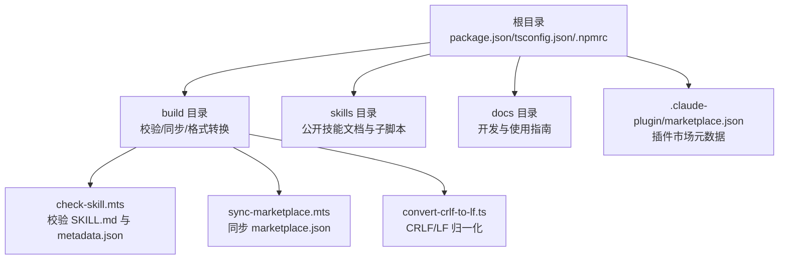
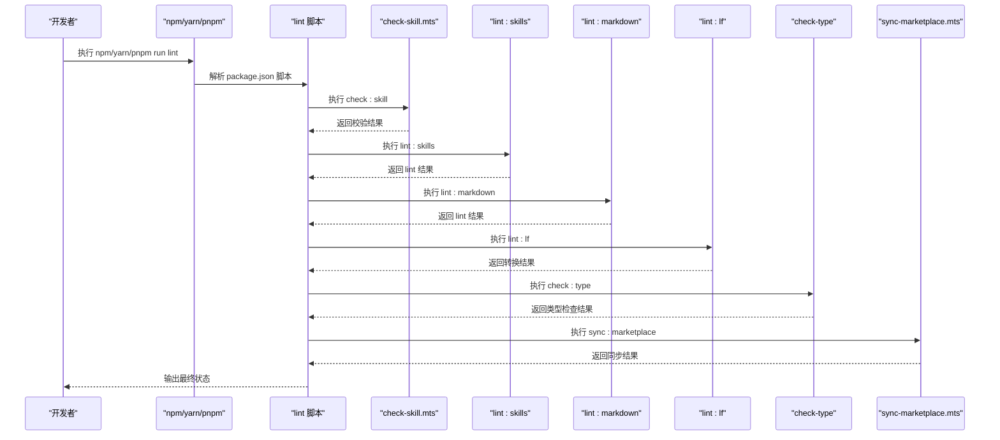
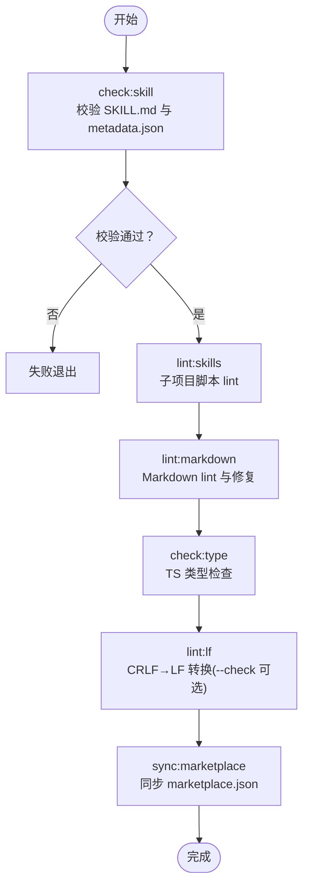
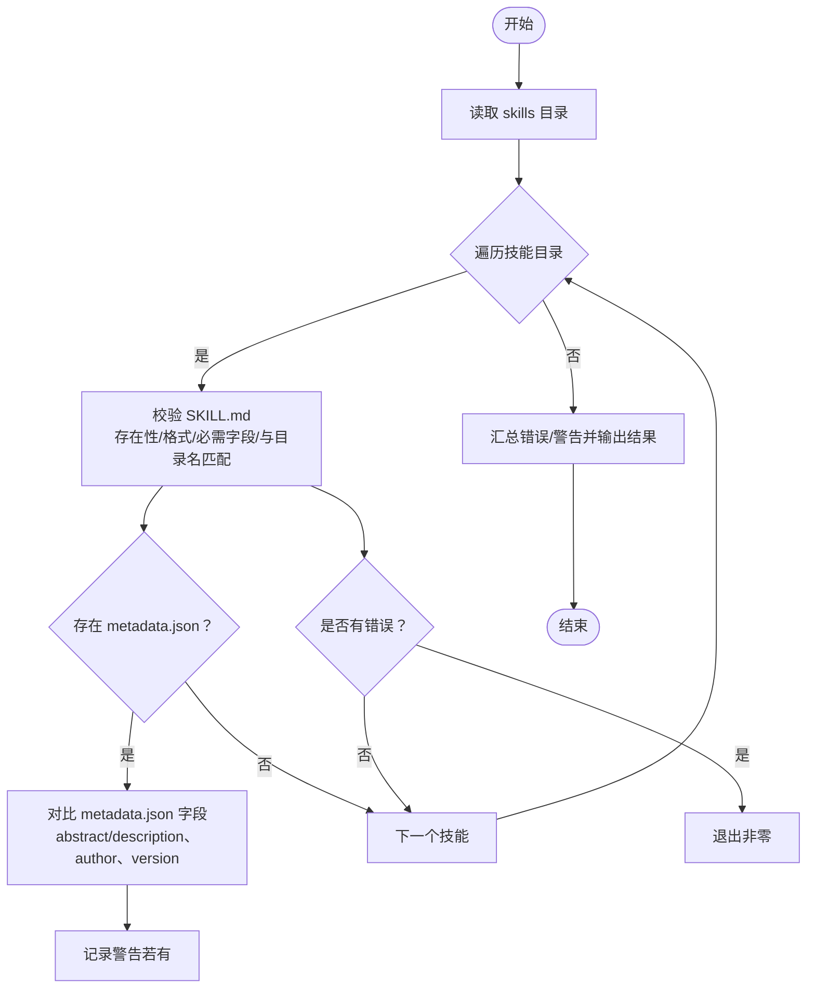
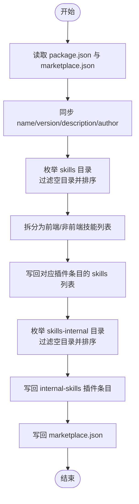
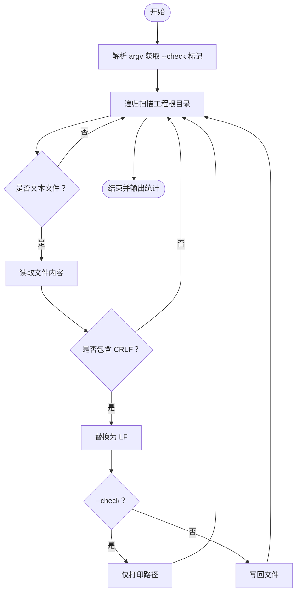
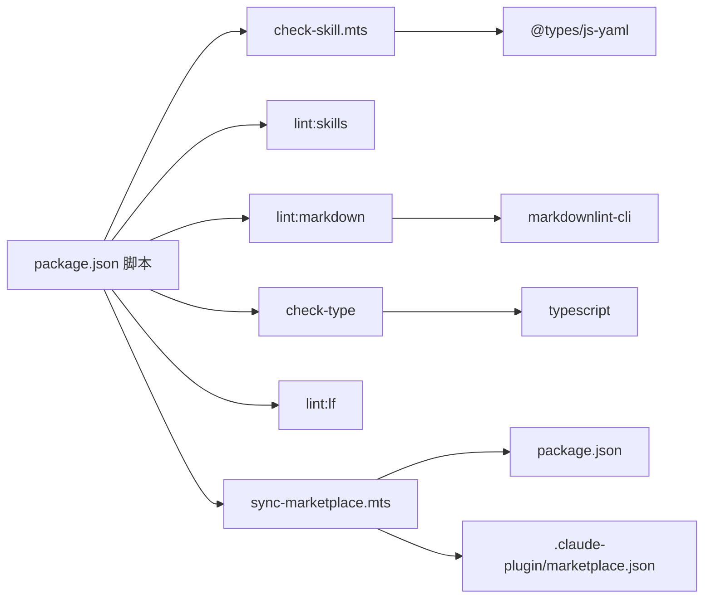

# 构建脚本管理

<cite>
**本文引用的文件**
- [package.json](file://package.json)
- [tsconfig.json](file://tsconfig.json)
-.npmrc](file://.npmrc)
- [build/check-skill.mts](file://build/check-skill.mts)
- [build/sync-marketplace.mts](file://build/sync-marketplace.mts)
- [build/convert-crlf-to-lf.ts](file://build/convert-crlf-to-lf.ts)
- [docs/DEVELOP.md](file://docs/DEVELOP.md)
- [README.md](file://README.md)
- [skills/yy-lint/SKILL.md](file://skills/yy-lint/SKILL.md)
- [skills/yy-create-skill/SKILL.md](file://skills/yy-create-skill/SKILL.md)
- [skills/yy-post-to-wechat/scripts/package.json](file://skills/yy-post-to-wechat/scripts/package.json)
</cite>

## 目录
1. [简介](#简介)
2. [项目结构](#项目结构)
3. [核心组件](#核心组件)
4. [架构总览](#架构总览)
5. [详细组件分析](#详细组件分析)
6. [依赖分析](#依赖分析)
7. [性能考虑](#性能考虑)
8. [故障排除指南](#故障排除指南)
9. [结论](#结论)
10. [附录](#附录)

## 简介
本文件系统性梳理仓库中的构建脚本管理体系，围绕 package.json 中定义的构建脚本命令（如 lint、sync:marketplace、check:skills 等）展开，解释各命令的作用、参数、执行顺序与依赖关系，给出完整的构建流程图与时序说明，并提供构建环境配置要求、调试与故障排除方法、扩展与定制建议，以及在 CI/CD 环境中的集成思路与运维部署要点。

## 项目结构
仓库采用“技能 + 规则 + 构建工具”的组织方式：
- 根目录提供统一的构建脚本与类型配置
- skills 目录存放公开技能文档与可选子脚本
- build 目录存放构建期校验与同步工具
- docs 提供开发与使用指南
- .claude-plugin marketplace.json 用于插件市场元数据同步

图表来源
- [package.json:1-46](file://package.json#L1-L46)
- [build/check-skill.mts:1-230](file://build/check-skill.mts#L1-L230)
- [build/sync-marketplace.mts:1-93](file://build/sync-marketplace.mts#L1-L93)
- [build/convert-crlf-to-lf.ts:1-119](file://build/convert-crlf-to-lf.ts#L1-L119)

章节来源
- [package.json:1-46](file://package.json#L1-L46)
- [tsconfig.json:1-24](file://tsconfig.json#L1-L24)
-.npmrc:1-3](file://.npmrc#L1-L3)

## 核心组件
本仓库的构建脚本主要由以下命令组成，分别承担不同职责：
- lint：聚合执行多项质量检查与同步任务
- check:skill：校验 skills 目录下每个技能的 SKILL.md 与 metadata.json 一致性
- lint:skills：针对特定子项目的脚本 lint（如微信文章发布脚本）
- lint:markdown：Markdown 文件批量 lint 与自动修复
- lint:lf：将工程中的 CRLF 统一转换为 LF（支持 --check 模式）
- check:type：TypeScript 类型检查（仅检查，不输出编译产物）
- sync:marketplace：同步插件市场元数据与技能列表
- install:skill：一键全局安装仓库内技能（面向 Claude Code/Opencode 等平台）

章节来源
- [package.json:7-16](file://package.json#L7-L16)
- [build/check-skill.mts:177-229](file://build/check-skill.mts#L177-L229)
- [build/sync-marketplace.mts:12-93](file://build/sync-marketplace.mts#L12-L93)
- [build/convert-crlf-to-lf.ts:7-119](file://build/convert-crlf-to-lf.ts#L7-L119)

## 架构总览
下图展示了 lint 命令的执行序列，体现各子任务的依赖关系与执行顺序。

图表来源
- [package.json:8-14](file://package.json#L8-L14)
- [build/check-skill.mts:177-229](file://build/check-skill.mts#L177-L229)
- [build/sync-marketplace.mts:12-93](file://build/sync-marketplace.mts#L12-L93)
- [build/convert-crlf-to-lf.ts:7-119](file://build/convert-crlf-to-lf.ts#L7-L119)

## 详细组件分析

### lint 命令与执行流程
- 作用：聚合执行多项质量检查与同步任务，确保仓库整体质量与市场元数据一致
- 执行顺序：check:skill → lint:skills → lint:markdown → check:type → lint:lf → sync:marketplace
- 参数与行为：
  - check:skill：遍历 skills 目录，校验每个技能的 SKILL.md 与 metadata.json 一致性，出现错误即退出
  - lint:skills：切换到子项目目录执行其内部 lint 脚本
  - lint:markdown：对所有 .md 文件执行 lint 并尝试自动修复
  - check:type：执行 TypeScript 类型检查（仅检查，不生成产物）
  - lint:lf：扫描工程文本文件，将 CRLF 统一为 LF；支持 --check 仅报告不修改
  - sync:marketplace：读取 package.json 与 marketplace.json，同步名称、版本、描述、作者等元数据，并按字母序更新技能列表

图表来源
- [package.json:8-14](file://package.json#L8-L14)
- [build/check-skill.mts:177-229](file://build/check-skill.mts#L177-L229)
- [build/sync-marketplace.mts:12-93](file://build/sync-marketplace.mts#L12-L93)
- [build/convert-crlf-to-lf.ts:7-119](file://build/convert-crlf-to-lf.ts#L7-L119)

章节来源
- [package.json:8-14](file://package.json#L8-L14)

### check:skill 组件
- 功能：校验 skills 目录下每个技能的 SKILL.md 与 metadata.json 一致性
- 关键检查点：
  - SKILL.md 存在性与非空
  - YAML frontmatter 格式与必需字段（name/description）
  - name 与目录名匹配
  - metadata.json 字段一致性（abstract/description、author、version）
- 错误与警告：
  - 错误导致进程退出码非零
  - 警告仅输出提示，不影响退出码

图表来源
- [build/check-skill.mts:50-172](file://build/check-skill.mts#L50-L172)

章节来源
- [build/check-skill.mts:177-229](file://build/check-skill.mts#L177-L229)

### sync:marketplace 组件
- 功能：同步插件市场元数据与技能列表
- 同步字段：name、version、description、owner.name
- 技能分类：按名称包含“frontend”区分前端技能与非前端技能，分别写回对应插件条目
- 清理逻辑：过滤空目录并删除，输出清理日志
- 输出：将更新后的 marketplace.json 写回

图表来源
- [build/sync-marketplace.mts:12-93](file://build/sync-marketplace.mts#L12-L93)

章节来源
- [build/sync-marketplace.mts:12-93](file://build/sync-marketplace.mts#L12-L93)

### lint:lf 组件
- 功能：将工程中识别为文本的文件统一换行符为 LF
- 过滤策略：忽略特定目录（.git、node_modules 等），仅处理常见文本扩展名与特定基名
- 检查模式：支持 --check 仅报告不修改
- 输出：统计扫描与转换文件数量

图表来源
- [build/convert-crlf-to-lf.ts:56-119](file://build/convert-crlf-to-lf.ts#L56-L119)

章节来源
- [build/convert-crlf-to-lf.ts:7-119](file://build/convert-crlf-to-lf.ts#L7-L119)

### lint:skills 与 lint:markdown
- lint:skills：切换到子项目目录（如微信文章发布脚本）并执行其内部 lint 脚本
- lint:markdown：对所有 .md 文件执行 lint 并尝试自动修复

章节来源
- [package.json:9-13](file://package.json#L9-L13)

### check:type
- 作用：执行 TypeScript 类型检查（仅检查，不生成产物）
- 配置：由 tsconfig.json 提供编译选项与包含/排除规则

章节来源
- [package.json:13](file://package.json#L13)
- [tsconfig.json:1-24](file://tsconfig.json#L1-L24)

### install:skill
- 作用：一键全局安装仓库内技能（面向 Claude Code/Opencode 等平台）
- 注意：该命令用于本地开发与演示，不参与常规构建流程

章节来源
- [package.json:15](file://package.json#L15)
- [README.md:36-37](file://README.md#L36-L37)

## 依赖分析
- 脚本依赖关系
  - lint 串行依赖：check:skill → lint:skills → lint:markdown → check:type → lint:lf → sync:marketplace
  - lint:skills 依赖子项目内部脚本与依赖
  - lint:markdown 依赖 markdownlint-cli
  - check:type 依赖 TypeScript 与 tsconfig.json
  - lint:lf 为纯 Node.js 文件处理工具
  - sync:marketplace 依赖 package.json 与 .claude-plugin/marketplace.json
- 外部依赖
  - js-yaml：用于解析 YAML frontmatter
  - markdownlint-cli：用于 Markdown lint
  - front-matter、marked：用于内容解析与渲染
  - @types/*：类型声明

图表来源
- [package.json:34-44](file://package.json#L34-L44)
- [build/check-skill.mts:4](file://build/check-skill.mts#L4)
- [build/sync-marketplace.mts:8-16](file://build/sync-marketplace.mts#L8-L16)

章节来源
- [package.json:34-44](file://package.json#L34-L44)

## 性能考虑
- lint:lf
  - 采用异步递归扫描与逐文件处理，避免一次性加载大文件
  - 支持 --check 模式减少磁盘写入开销
- check:skill
  - 遍历 skills 目录，建议在大型仓库中关注目录数量与文件大小
- sync:marketplace
  - 读取与写回 JSON 文件，I/O 成本较低；过滤空目录可减少后续处理
- lint:skills
  - 子项目脚本执行时间取决于其复杂度与依赖安装情况

[本节为通用性能讨论，无需列出具体文件来源]

## 故障排除指南
- lint 命令失败
  - 检查 check:skill 的错误输出，修复 SKILL.md 或 metadata.json 的必填字段与一致性问题
  - 若 lint:markdown 报错，定位具体 .md 文件并修正格式
  - 若 check:type 失败，修正 TypeScript 类型错误
  - 若 lint:lf 报告大量 CRLF，确认团队协作换行符约定
- sync:marketplace 异常
  - 确认 .claude-plugin/marketplace.json 存在且可读写
  - 检查 skills 与 skills-internal 目录是否包含有效子目录
- lint:skills 无法执行
  - 确认子项目目录存在并包含可执行脚本
  - 检查子项目 package.json 的 engines 与 Node 版本要求
- 日志与调试
  - 使用 --check 模式观察 lint:lf 的扫描范围
  - 在本地开发指南中了解如何添加技能与调试技巧

章节来源
- [build/check-skill.mts:177-229](file://build/check-skill.mts#L177-L229)
- [build/sync-marketplace.mts:12-93](file://build/sync-marketplace.mts#L12-L93)
- [build/convert-crlf-to-lf.ts:7-119](file://build/convert-crlf-to-lf.ts#L7-L119)
- [docs/DEVELOP.md:1-18](file://docs/DEVELOP.md#L1-L18)

## 结论
本仓库的构建脚本体系以 lint 为核心串联多项质量保障与市场元数据同步任务，check:skill、lint:markdown、check:type、lint:lf、sync:marketplace 各司其职，形成闭环的质量控制与发布准备流程。通过合理的依赖顺序与参数配置，可在本地与 CI/CD 环境中稳定运行。建议在团队内统一换行符约定与 Markdown 规范，并定期校验技能元数据一致性。

[本节为总结性内容，无需列出具体文件来源]

## 附录

### 构建环境配置要求
- Node.js 版本
  - 顶层脚本未强制限定 Node 版本，但子项目（如微信文章发布脚本）要求 Node >= 指定版本
- 依赖安装
  - 使用 .npmrc 指定镜像与版本精确安装策略
  - TypeScript 与相关类型声明用于类型检查
- 环境变量
  - 未在脚本中显式使用环境变量，建议在 CI 环境中统一配置 npm registry 与缓存策略

章节来源
- [skills/yy-post-to-wechat/scripts/package.json:6-8](file://skills/yy-post-to-wechat/scripts/package.json#L6-L8)
-.npmrc:1-3](file://.npmrc#L1-L3)
- [package.json:34-44](file://package.json#L34-L44)

### 扩展与定制方法
- 新增构建任务
  - 在 package.json scripts 中新增命令，并在 lint 或其他聚合命令中追加执行顺序
  - 若为独立工具，可仿照 lint:lf 的实现方式封装为独立脚本
- 修改现有流程
  - 调整 lint 命令的子任务顺序或增加前置/后置任务
  - 对 check:skill 增加更多字段校验或警告提示
- 与 CI/CD 集成
  - 在流水线中顺序执行 lint、check:type、lint:markdown、lint:lf、sync:marketplace
  - 将 install:skill 作为可选步骤用于演示或预览环境

章节来源
- [package.json:7-16](file://package.json#L7-L16)
- [build/check-skill.mts:177-229](file://build/check-skill.mts#L177-L229)
- [build/convert-crlf-to-lf.ts:7-119](file://build/convert-crlf-to-lf.ts#L7-L119)
- [build/sync-marketplace.mts:12-93](file://build/sync-marketplace.mts#L12-L93)

### 运维部署与监控
- 部署建议
  - 使用 .npmrc 固定镜像与版本策略，确保依赖一致性
  - 在 CI 中缓存 node_modules，加速安装
- 监控与告警
  - 将 lint 命令纳入流水线，失败即告警
  - 对 sync:marketplace 的写回操作记录审计日志
  - 对大型仓库，监控 lint:lf 的扫描耗时与转换数量

[本节为通用运维建议，无需列出具体文件来源]