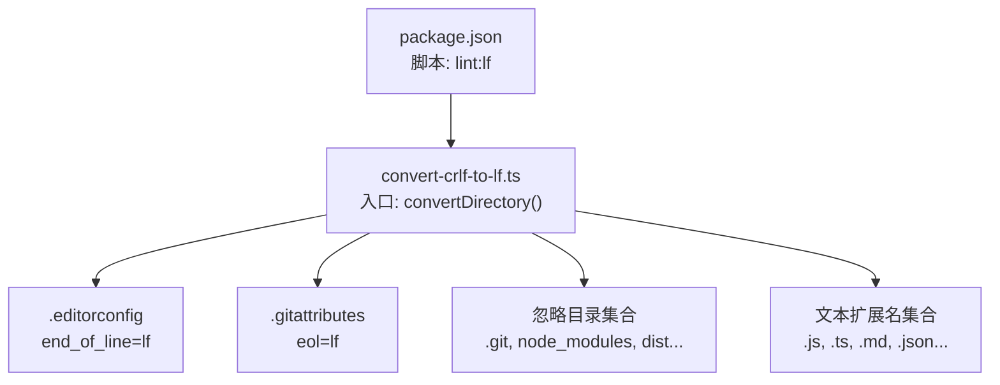
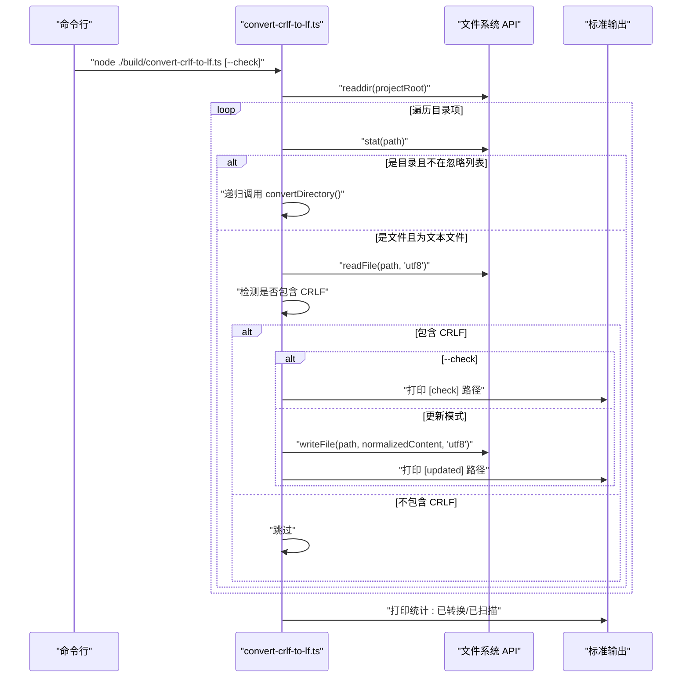
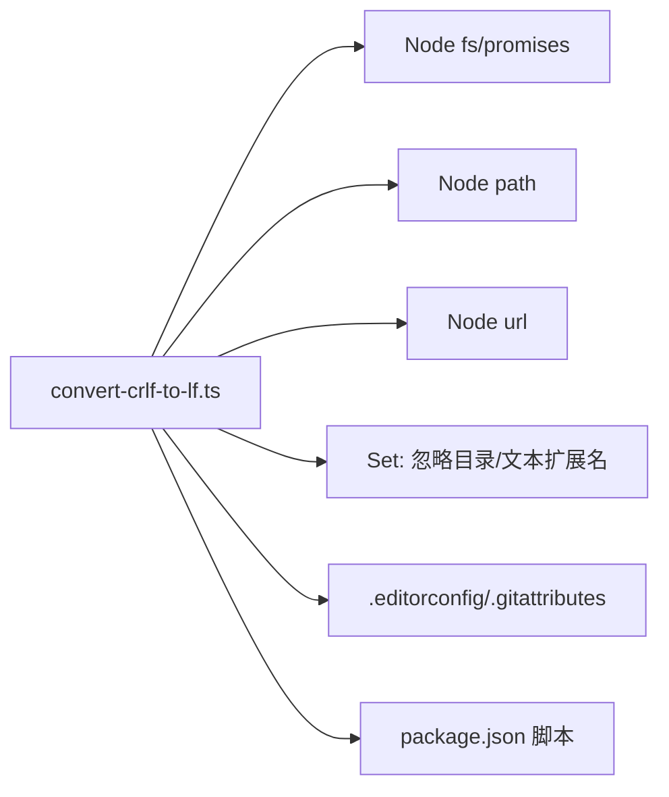

# 格式转换工具

<cite>
**本文引用的文件**
- [convert-crlf-to-lf.ts](file://build/convert-crlf-to-lf.ts)
- [package.json](file://package.json)
- [.editorconfig](file://.editorconfig)
- [.gitattributes](file://.gitattributes)
- [.markdownlint.json](file://.markdownlint.json)
- [.markdownlintignore](file://.markdownlintignore)
- [.gitignore](file://.gitignore)
- [check-skill.mts](file://build/check-skill.mts)
</cite>

## 目录
1. [简介](#简介)
2. [项目结构](#项目结构)
3. [核心组件](#核心组件)
4. [架构总览](#架构总览)
5. [详细组件分析](#详细组件分析)
6. [依赖关系分析](#依赖关系分析)
7. [性能考虑](#性能考虑)
8. [故障排查指南](#故障排查指南)
9. [结论](#结论)
10. [附录](#附录)

## 简介
本技术文档围绕仓库中的 CRLF 到 LF 换行符格式转换脚本展开，系统性说明其功能、实现原理、配置选项、错误处理、性能优化以及在持续集成流程中的集成方法。该脚本旨在统一文本文件的换行符，消除跨平台差异带来的问题，提升协作效率与一致性。

## 项目结构
- 转换脚本位于 build 目录，作为独立的 Node.js 脚本运行。
- 项目通过 package.json 的脚本统一调用该转换脚本，支持“仅检查模式”和“实际更新模式”。
- 顶层配置文件（.editorconfig、.gitattributes）与转换脚本协同，确保团队在编辑器与版本控制层面也遵循 LF 统一策略。

图表来源
- [package.json:7-14](file://package.json#L7-L14)
- [convert-crlf-to-lf.ts:5-16](file://build/convert-crlf-to-lf.ts#L5-L16)
- [convert-crlf-to-lf.ts:18-42](file://build/convert-crlf-to-lf.ts#L18-L42)
- [.editorconfig:7](file://.editorconfig#L7)
- [.gitattributes:1](file://.gitattributes#L1)

章节来源
- [package.json:7-14](file://package.json#L7-L14)
- [convert-crlf-to-lf.ts:5-16](file://build/convert-crlf-to-lf.ts#L5-L16)
- [convert-crlf-to-lf.ts:18-42](file://build/convert-crlf-to-lf.ts#L18-L42)
- [.editorconfig:7](file://.editorconfig#L7)
- [.gitattributes:1](file://.gitattributes#L1)

## 核心组件
- 转换脚本主体：负责遍历项目根目录、识别文本文件、检测 CRLF 并替换为 LF、支持“仅检查”模式与“更新”模式。
- 配置与过滤：通过忽略目录集合与文本扩展名集合控制扫描范围；通过命令行参数控制行为。
- 输出统计：统计扫描与转换的文件数量，便于 CI 回馈与审计。

章节来源
- [convert-crlf-to-lf.ts:56-110](file://build/convert-crlf-to-lf.ts#L56-L110)
- [convert-crlf-to-lf.ts:44-47](file://build/convert-crlf-to-lf.ts#L44-L47)

## 架构总览
转换脚本采用递归遍历策略，结合文件类型判定与内容检测，实现对项目内文本文件的批量格式标准化。

图表来源
- [convert-crlf-to-lf.ts:56-110](file://build/convert-crlf-to-lf.ts#L56-L110)
- [convert-crlf-to-lf.ts:7](file://build/convert-crlf-to-lf.ts#L7)
- [package.json:12](file://package.json#L12)

## 详细组件分析

### 脚本入口与参数解析
- 入口位置：脚本通过相对路径定位项目根目录，基于当前工作目录计算绝对路径。
- 参数解析：通过命令行参数判断是否启用“仅检查模式”。该模式下不会写入文件，仅输出将被转换的文件路径，便于 CI 中先行校验。

章节来源
- [convert-crlf-to-lf.ts:5-7](file://build/convert-crlf-to-lf.ts#L5-L7)
- [convert-crlf-to-lf.ts:7](file://build/convert-crlf-to-lf.ts#L7)

### 忽略目录与文本文件判定
- 忽略目录集合：.git、.idea、.vscode、coverage、dist、node_modules 等，避免对版本控制、缓存与构建产物进行处理。
- 文本文件判定：基于扩展名集合与特定基础名集合判断是否为文本文件。扩展名集合覆盖前端与通用配置文件类型，基础名集合覆盖配置文件名。

章节来源
- [convert-crlf-to-lf.ts:9-16](file://build/convert-crlf-to-lf.ts#L9-L16)
- [convert-crlf-to-lf.ts:18-42](file://build/convert-crlf-to-lf.ts#L18-L42)

### 递归遍历与批量处理
- 递归遍历：对目录项逐个处理，遇到目录则递归深入，遇到文件则进行类型与内容检测。
- 批量处理：对每个文本文件读取 UTF-8 内容，检测是否包含 CRLF；若包含，则替换为 LF 并按模式决定是否写回。

章节来源
- [convert-crlf-to-lf.ts:56-110](file://build/convert-crlf-to-lf.ts#L56-L110)

### CRLF 到 LF 的转换逻辑
- 内容检测：通过包含判断快速跳过不含 CRLF 的文件，减少不必要的 I/O。
- 替换策略：使用全局正则将 CRLF 统一替换为 LF，保证跨平台一致性。
- 相对路径输出：将绝对路径转换为相对于项目根的路径，便于人类阅读与 CI 定位。

章节来源
- [convert-crlf-to-lf.ts:86-94](file://build/convert-crlf-to-lf.ts#L86-L94)
- [convert-crlf-to-lf.ts:94](file://build/convert-crlf-to-lf.ts#L94)

### 输出统计与模式切换
- 统计结构：返回扫描文件数与转换文件数，便于 CI 判断是否需要进一步处理。
- 模式切换：--check 模式仅输出将被转换的文件路径；非 --check 模式实际写回文件并输出已更新路径。

章节来源
- [convert-crlf-to-lf.ts:44-47](file://build/convert-crlf-to-lf.ts#L44-L47)
- [convert-crlf-to-lf.ts:112-117](file://build/convert-crlf-to-lf.ts#L112-L117)

### 与项目配置的协同
- .editorconfig：统一字符集、缩进、换行等编辑器行为，与脚本目标一致。
- .gitattributes：在版本控制层面强制 LF 换行，避免历史提交引入 CRLF。
- package.json：通过 lint:lf 脚本将转换纳入常规 lint 流程。

章节来源
- [.editorconfig:7](file://.editorconfig#L7)
- [.gitattributes:1](file://.gitattributes#L1)
- [package.json:12](file://package.json#L12)

### 与其他构建脚本的关系
- 本脚本与检查技能元数据的脚本（check-skill.mts）同属 build 目录，均服务于质量保障与一致性。
- 两者职责不同：前者聚焦换行符标准化，后者聚焦技能文档元数据一致性。

章节来源
- [check-skill.mts:1-230](file://build/check-skill.mts#L1-L230)

## 依赖关系分析
- 脚本依赖 Node.js 异步文件系统 API 进行目录遍历、文件读写与元数据查询。
- 通过 Set 结构维护忽略目录与文本扩展名，提高查找效率。
- 与项目配置文件形成“编辑器层 + 版本控制层 + 脚本层”的三层协同，确保跨平台一致性。

图表来源
- [convert-crlf-to-lf.ts:1-3](file://build/convert-crlf-to-lf.ts#L1-L3)
- [convert-crlf-to-lf.ts:9-42](file://build/convert-crlf-to-lf.ts#L9-L42)
- [.editorconfig:7](file://.editorconfig#L7)
- [.gitattributes:1](file://.gitattributes#L1)
- [package.json:12](file://package.json#L12)

章节来源
- [convert-crlf-to-lf.ts:1-3](file://build/convert-crlf-to-lf.ts#L1-L3)
- [convert-crlf-to-lf.ts:9-42](file://build/convert-crlf-to-lf.ts#L9-L42)
- [.editorconfig:7](file://.editorconfig#L7)
- [.gitattributes:1](file://.gitattributes#L1)
- [package.json:12](file://package.json#L12)

## 性能考虑
- 时间复杂度：对每个文本文件进行一次完整读取与一次写回（更新模式），整体复杂度近似 O(N)，N 为扫描到的文本文件数量。
- 空间复杂度：读取文件内容至内存进行替换，空间开销与文件大小线性相关；对于超大文件可能带来内存压力。
- 优化建议：
  - 在 CI 中优先使用“仅检查模式”，在本地或预检阶段再执行更新，减少 CI 作业时间。
  - 对于超大文件，可考虑分块读取或流式处理策略，但需谨慎处理换行符跨越分界点的情况。
  - 合理利用忽略目录集合，避免对 node_modules、dist 等目录进行扫描。
  - 将转换脚本与其它 lint 步骤合并，减少重复 I/O。

[本节为通用性能指导，不直接分析具体文件，故无“章节来源”]

## 故障排查指南
- 权限问题
  - 现象：写入失败或无法读取文件。
  - 排查：确认运行用户对目标文件具有读写权限；在 CI 环境中检查工作区权限设置。
- 编码不兼容
  - 现象：读取为乱码或替换无效。
  - 排查：脚本默认以 UTF-8 读写；若文件为非 UTF-8，可能导致替换异常。建议统一使用 UTF-8 编码，或在项目中通过 .editorconfig 明确 charset。
- 大文件处理
  - 现象：内存占用过高或超时。
  - 排查：考虑拆分处理或采用流式方案；在 CI 中限制大文件参与转换。
- 忽略规则误判
  - 现象：某些文件未被转换或被错误忽略。
  - 排查：核对扩展名集合与基础名集合；确认是否属于忽略目录；必要时临时调整忽略集合。
- CI 集成异常
  - 现象：CI 报告转换失败或未生效。
  - 排查：确认 package.json 中 lint:lf 脚本正确；检查 CI 日志中是否传入 --check 参数；核对 .gitattributes 与 .editorconfig 是否生效。

章节来源
- [convert-crlf-to-lf.ts:86-94](file://build/convert-crlf-to-lf.ts#L86-L94)
- [.editorconfig:4](file://.editorconfig#L4)
- [package.json:12](file://package.json#L12)

## 结论
该转换脚本通过简洁高效的递归遍历与内容检测，实现了对项目内文本文件的批量 LF 格式标准化。配合 .editorconfig、.gitattributes 与 CI 脚本，可在跨平台协作环境中显著降低换行符差异带来的问题。建议在 CI 中优先使用“仅检查模式”进行预检，再在本地或受控环境下执行更新，以平衡效率与安全性。

[本节为总结性内容，不直接分析具体文件，故无“章节来源”]

## 附录

### 配置选项与自定义参数
- 命令行参数
  - --check：仅检查模式，不写回文件，输出将被转换的文件路径。
- 忽略目录集合（默认）
  - .git、.idea、.vscode、coverage、dist、node_modules
- 文本扩展名集合（默认）
  - .css、.env、.eslintignore、.gitattributes、.gitignore、.html、.js、.json、.md、.mts、.scss、.ts、.tsx、.vue、.yaml、.yml
- 文本基础名集合（默认）
  - .editorconfig、.prettierignore、.prettierrc、README

章节来源
- [convert-crlf-to-lf.ts:7](file://build/convert-crlf-to-lf.ts#L7)
- [convert-crlf-to-lf.ts:9-16](file://build/convert-crlf-to-lf.ts#L9-L16)
- [convert-crlf-to-lf.ts:18-42](file://build/convert-crlf-to-lf.ts#L18-L42)

### 在持续集成中的集成方法
- 在 package.json 中的 lint:lf 脚本统一调用转换脚本。
- CI 流水线中建议：
  - 预检阶段：执行 node ./build/convert-crlf-to-lf.ts --check，收集将被转换的文件列表。
  - 应用阶段：在本地或受控环境执行 node ./build/convert-crlf-to-lf.ts，写回文件。
- 与其它 lint 步骤合并，减少重复 I/O 与作业时间。

章节来源
- [package.json:12](file://package.json#L12)
- [convert-crlf-to-lf.ts:112-117](file://build/convert-crlf-to-lf.ts#L112-L117)

### 最佳实践与常见问题
- 最佳实践
  - 统一使用 UTF-8 编码，避免编码不兼容导致的替换异常。
  - 在提交前执行“仅检查模式”，确保 CI 不会因大量文件变更而失败。
  - 将转换脚本与 .editorconfig、.gitattributes 协同使用，形成“编辑器层 + 版本控制层 + 脚本层”的一致性保障。
- 常见问题
  - 文件未被转换：检查扩展名或基础名是否在集合中；确认未被忽略目录覆盖。
  - CI 报错：确认 CI 是否传入 --check；检查 .gitattributes 与 .editorconfig 是否生效。
  - 大文件内存不足：考虑拆分处理或在 CI 中限制大文件参与转换。

章节来源
- [.editorconfig:4](file://.editorconfig#L4)
- [.gitattributes:1](file://.gitattributes#L1)
- [convert-crlf-to-lf.ts:112-117](file://build/convert-crlf-to-lf.ts#L112-L117)