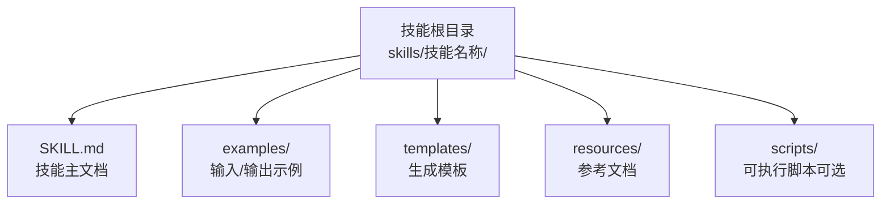
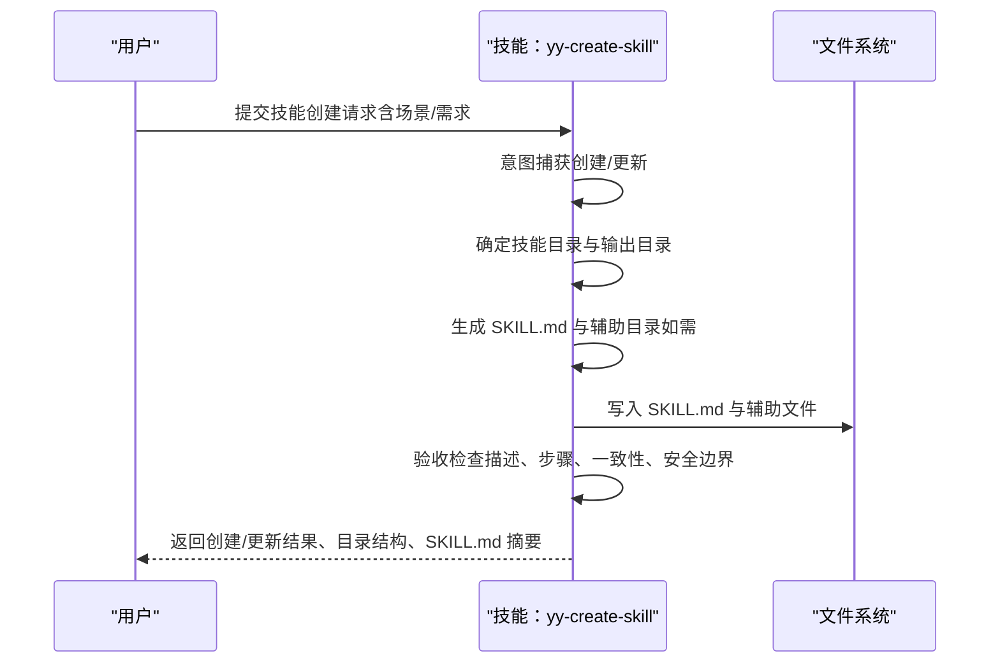
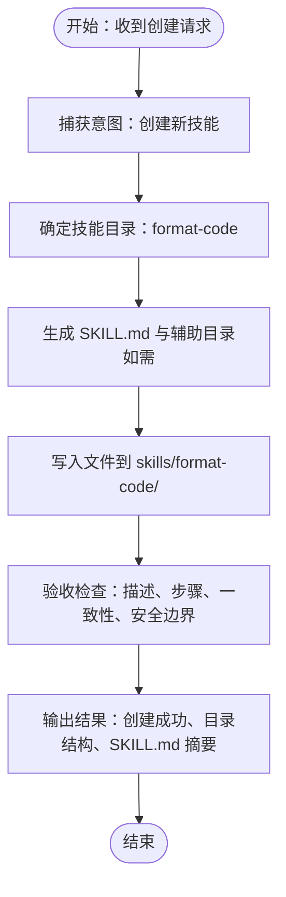
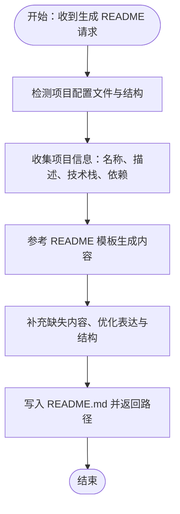
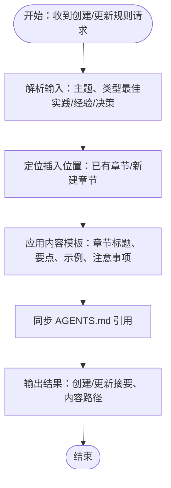
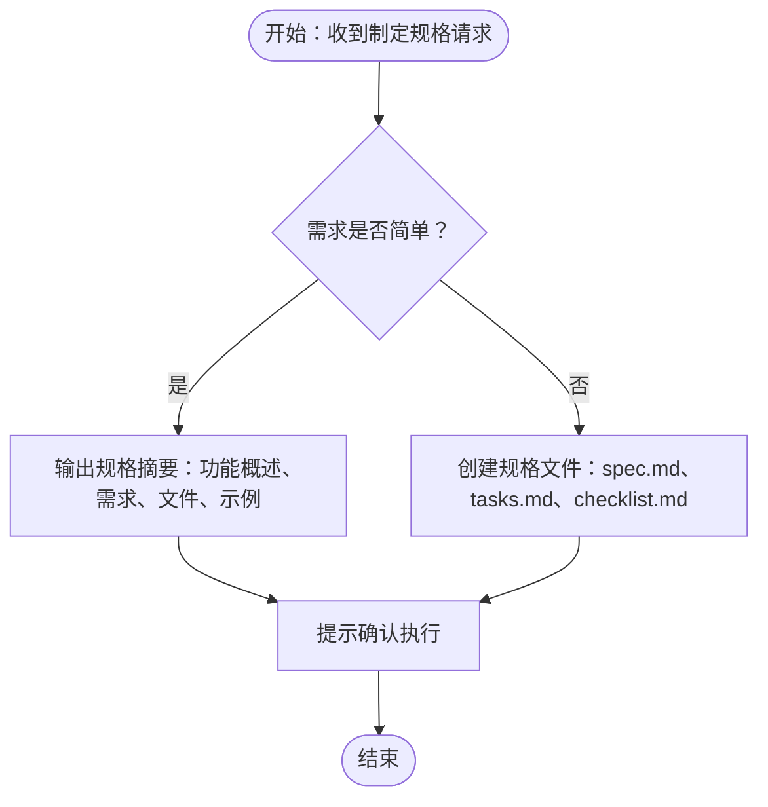
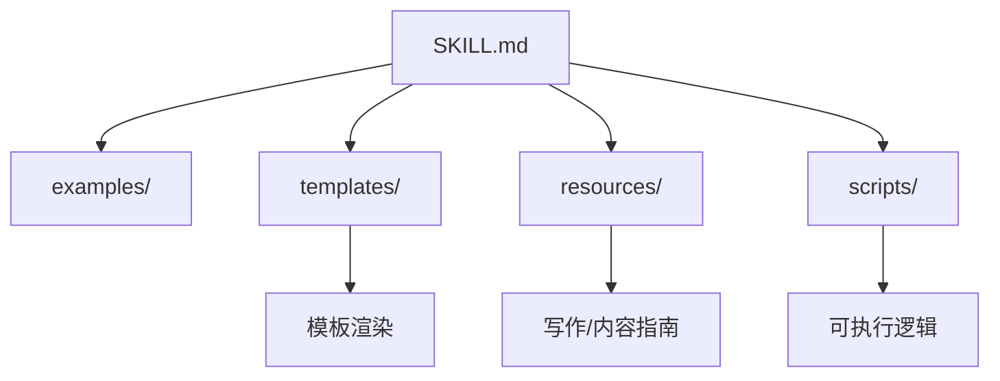

# 基础示例

<cite>
**本文引用的文件**
- [yy-create-skill/SKILL.md](file://skills/yy-create-skill/SKILL.md)
- [yy-create-skill/examples/input.md](file://skills/yy-create-skill/examples/input.md)
- [yy-create-skill/examples/output.md](file://skills/yy-create-skill/examples/output.md)
- [yy-create-skill/templates/skill-template.md](file://skills/yy-create-skill/templates/skill-template.md)
- [yy-create-readme/SKILL.md](file://skills/yy-create-readme/SKILL.md)
- [yy-create-readme/templates/readme-template.md](file://skills/yy-create-readme/templates/readme-template.md)
- [yy-create-readme/resources/readme-writing-guide.md](file://skills/yy-create-readme/resources/readme-writing-guide.md)
- [yy-create-rule/examples/input.md](file://skills/yy-create-rule/examples/input.md)
- [yy-create-rule/examples/output.md](file://skills/yy-create-rule/examples/output.md)
- [yy-create-rule/resources/content-template.md](file://skills/yy-create-rule/resources/content-template.md)
- [yy-mode-spec/examples/input.md](file://skills/yy-mode-spec/examples/input.md)
- [yy-mode-spec/examples/output.md](file://skills/yy-mode-spec/examples/output.md)
- [docs/CLAUDE_CODE_SKILL.md](file://docs/CLAUDE_CODE_SKILL.md)
</cite>

## 目录
1. [简介](#简介)
2. [项目结构](#项目结构)
3. [核心组件](#核心组件)
4. [架构总览](#架构总览)
5. [详细组件分析](#详细组件分析)
6. [依赖分析](#依赖分析)
7. [性能考虑](#性能考虑)
8. [故障排查指南](#故障排查指南)
9. [结论](#结论)
10. [附录](#附录)

## 简介
本文件面向初学者，提供技能系统的入门级使用指南。通过“创建第一个技能”的完整流程，从“代码格式化”到“README 生成”，逐步讲解技能的输入格式、输出结果与预期行为。文档强调可操作步骤与设计思路，帮助你快速理解技能的基本概念与工作原理，并提供常见使用场景与模板，为后续深入学习打下基础。

## 项目结构
技能系统以“技能目录 + 标准化文档 + 辅助资源”的方式组织。每个技能通常包含：
- SKILL.md：技能主文档，定义用途、触发场景、指令步骤与输出约定
- examples/：输入/输出示例，展示典型交互
- templates/：模板文件，用于生成目标内容
- resources/：参考文档、写作指南等
- scripts/：可选的执行脚本（如需要）

下面的图示展示了技能目录的典型结构与文件关系：

图表来源
- [yy-create-skill/SKILL.md:197-213](file://skills/yy-create-skill/SKILL.md#L197-L213)

章节来源
- [yy-create-skill/SKILL.md:197-213](file://skills/yy-create-skill/SKILL.md#L197-L213)

## 核心组件
- 技能主文档（SKILL.md）：定义技能的用途、触发条件、执行步骤与输出格式，是技能被自动发现与精确触发的关键。
- 示例（examples/）：提供输入与输出示例，帮助理解技能的期望交互。
- 模板（templates/）：用于生成目标内容的结构化模板，降低重复劳动。
- 资源（resources/）：写作指南、内容模板等参考资料，保证输出质量与一致性。
- 脚本（scripts/）：当技能需要自动化执行时，提供可执行脚本与依赖配置。

章节来源
- [yy-create-skill/SKILL.md:74-98](file://skills/yy-create-skill/SKILL.md#L74-L98)
- [yy-create-skill/SKILL.md:130-147](file://skills/yy-create-skill/SKILL.md#L130-L147)

## 架构总览
技能系统的工作流由“意图捕获 -> 目录确定 -> 文档生成 -> 目录创建 -> 验收检查 -> 输出结果”构成。下图展示了创建技能的典型时序：

图表来源
- [yy-create-skill/SKILL.md:36-53](file://skills/yy-create-skill/SKILL.md#L36-L53)
- [yy-create-skill/SKILL.md:130-177](file://skills/yy-create-skill/SKILL.md#L130-L177)

章节来源
- [yy-create-skill/SKILL.md:34-177](file://skills/yy-create-skill/SKILL.md#L34-L177)

## 详细组件分析

### 示例一：创建第一个技能（代码格式化）
本示例演示如何创建一个“在提交前自动格式化代码”的技能，涵盖从输入到输出的完整流程。

- 输入格式
  - 明确技能名称与触发场景（如“在提交前自动格式化代码”）
  - 可选补充技术栈或工具偏好（如 ESLint/Prettier）
  - 参考输入示例路径：[yy-create-skill/examples/input.md:7-9](file://skills/yy-create-skill/examples/input.md#L7-L9)

- 指令步骤（示例）
  - 检测项目使用的语言与格式化工具
  - 运行格式化命令
  - 输出格式化结果（工具名称、处理文件数、变更摘要）
  - 参考指令模板路径：[yy-create-skill/templates/skill-template.md:29](file://skills/yy-create-skill/templates/skill-template.md#L29)

- 输出结果
  - 创建目录：skills/format-code/SKILL.md
  - 输出摘要：技能名称、目录结构、SKILL.md 概要（步骤编号与名称）
  - 参考输出示例路径：[yy-create-skill/examples/output.md:18-52](file://skills/yy-create-skill/examples/output.md#L18-L52)

- 设计思路
  - 精确触发：description 仅描述用途与触发场景，避免实现细节
  - 步骤可执行：最后一步明确输出格式，便于验收
  - 目录最小化：默认只生成 SKILL.md，按需创建 templates/resources/examples/scripts

图表来源
- [yy-create-skill/SKILL.md:36-53](file://skills/yy-create-skill/SKILL.md#L36-L53)
- [yy-create-skill/SKILL.md:130-177](file://skills/yy-create-skill/SKILL.md#L130-L177)

章节来源
- [yy-create-skill/examples/input.md:7-9](file://skills/yy-create-skill/examples/input.md#L7-L9)
- [yy-create-skill/examples/output.md:18-52](file://skills/yy-create-skill/examples/output.md#L18-L52)
- [yy-create-skill/templates/skill-template.md:29](file://skills/yy-create-skill/templates/skill-template.md#L29)

### 示例二：生成 README（从项目信息到模板渲染）
本示例演示如何创建一个“自动生成 README”的技能，从项目配置中提取信息并渲染模板。

- 输入格式
  - 项目配置文件（如 package.json、Cargo.toml、pyproject.toml）
  - 可选自定义徽章、贡献指南等需求
  - 参考输入示例路径：[yy-create-skill/examples/input.md:13-18](file://skills/yy-create-skill/examples/input.md#L13-L18)

- 指令步骤（示例）
  - 读取项目配置文件，分析项目结构与依赖
  - 参考 README 模板生成文档
  - 输出结果：README.md 路径、包含的章节列表、项目信息摘要
  - 参考指令模板路径：[yy-create-skill/templates/skill-template.md:29](file://skills/yy-create-skill/templates/skill-template.md#L29)

- 输出结果
  - 目录结构：包含 templates/readme-template.md
  - SKILL.md 内容：描述、使用场景、指令、相关资源
  - 参考输出示例路径：[yy-create-skill/examples/output.md:56-105](file://skills/yy-create-skill/examples/output.md#L56-L105)

- 设计思路
  - 模板驱动：将结构化模板与动态信息结合，提升一致性
  - 写作指南：提供常见问题与注意事项，减少歧义
  - 可选增强：界面展示、配置说明、开发指南等按需添加

图表来源
- [yy-create-readme/SKILL.md:50-87](file://skills/yy-create-readme/SKILL.md#L50-L87)
- [yy-create-readme/templates/readme-template.md:1-73](file://skills/yy-create-readme/templates/readme-template.md#L1-L73)
- [yy-create-readme/resources/readme-writing-guide.md:1-43](file://skills/yy-create-readme/resources/readme-writing-guide.md#L1-L43)

章节来源
- [yy-create-skill/examples/input.md:13-18](file://skills/yy-create-skill/examples/input.md#L13-L18)
- [yy-create-skill/examples/output.md:56-105](file://skills/yy-create-skill/examples/output.md#L56-L105)
- [yy-create-readme/SKILL.md:50-87](file://skills/yy-create-readme/SKILL.md#L50-L87)

### 示例三：创建规则文档（规范化知识沉淀）
本示例展示如何创建或更新规则文档，帮助沉淀最佳实践、Bug 修复经验与架构决策。

- 输入格式
  - 记录最佳实践、Bug 修复经验或架构决策
  - 可选指定目录（如 .agents/rules/frontend）
  - 参考输入示例路径：[yy-create-rule/examples/input.md:7-21](file://skills/yy-create-rule/examples/input.md#L7-L21)

- 输出结果
  - 创建/更新规则文档并返回摘要
  - 若内容已存在，提示无需重复添加
  - 参考输出示例路径：[yy-create-rule/examples/output.md:7-31](file://skills/yy-create-rule/examples/output.md#L7-L31)

- 设计思路
  - 结构化模板：章节标题、要点、示例、注意事项
  - 插入位置优先级：明确相关章节优先插入，否则新建章节
  - 与 AGENTS.md 同步：更新引用，便于后续 AI 开发参考

图表来源
- [yy-create-rule/examples/input.md:7-21](file://skills/yy-create-rule/examples/input.md#L7-L21)
- [yy-create-rule/examples/output.md:7-31](file://skills/yy-create-rule/examples/output.md#L7-L31)
- [yy-create-rule/resources/content-template.md:1-122](file://skills/yy-create-rule/resources/content-template.md#L1-L122)

章节来源
- [yy-create-rule/examples/input.md:7-21](file://skills/yy-create-rule/examples/input.md#L7-L21)
- [yy-create-rule/examples/output.md:7-31](file://skills/yy-create-rule/examples/output.md#L7-L31)
- [yy-create-rule/resources/content-template.md:1-122](file://skills/yy-create-rule/resources/content-template.md#L1-L122)

### 示例四：制定规格（从需求到可执行任务）
本示例展示如何将需求转化为可执行的规格文件，包含功能概述、需求、技术设计与任务分解。

- 输入格式
  - 简单需求：直接在对话中描述
  - 复杂需求：指定工具目录、需求目录等
  - 参考输入示例路径：[yy-mode-spec/examples/input.md:7-42](file://skills/yy-mode-spec/examples/input.md#L7-L42)

- 输出结果
  - 对于简单需求：直接输出规格摘要
  - 对于复杂需求：创建规格文件（spec.md）、任务分解（tasks.md）、验证清单（checklist.md）
  - 参考输出示例路径：[yy-mode-spec/examples/output.md:9-207](file://skills/yy-mode-spec/examples/output.md#L9-L207)

- 设计思路
  - 规格摘要：功能概述、需求列表、涉及文件、核心代码示例
  - 任务分解：阶段划分、任务依赖、复杂度与验收标准
  - 验证清单：实施前后检查项与质量门禁

图表来源
- [yy-mode-spec/examples/input.md:7-42](file://skills/yy-mode-spec/examples/input.md#L7-L42)
- [yy-mode-spec/examples/output.md:9-207](file://skills/yy-mode-spec/examples/output.md#L9-L207)

章节来源
- [yy-mode-spec/examples/input.md:7-42](file://skills/yy-mode-spec/examples/input.md#L7-L42)
- [yy-mode-spec/examples/output.md:9-207](file://skills/yy-mode-spec/examples/output.md#L9-L207)

## 依赖分析
技能系统通过“标准化文档 + 辅助资源”的方式实现松耦合与高内聚：
- 技能主文档（SKILL.md）定义触发条件与执行步骤，是系统自动发现与精确触发的依据
- 示例（examples/）提供输入/输出契约，便于测试与回归
- 模板（templates/）与资源（resources/）提供可复用的结构与规范
- 脚本（scripts/）在需要自动化执行时提供扩展能力

图表来源
- [yy-create-skill/SKILL.md:188-213](file://skills/yy-create-skill/SKILL.md#L188-L213)
- [yy-create-readme/SKILL.md:116-120](file://skills/yy-create-readme/SKILL.md#L116-L120)

章节来源
- [yy-create-skill/SKILL.md:188-213](file://skills/yy-create-skill/SKILL.md#L188-L213)
- [yy-create-readme/SKILL.md:116-120](file://skills/yy-create-readme/SKILL.md#L116-L120)

## 性能考虑
- 自动发现与精确触发：通过 SKILL.md 的 description 与使用场景，避免误触发与上下文膨胀
- 模板驱动生成：减少重复计算，提高生成效率
- 可选目录与延迟创建：仅在需要时创建 templates/resources/examples/scripts，降低 IO 成本
- 验收检查前置：在写入前进行一致性与安全边界检查，减少后续修复成本

## 故障排查指南
- 触发条件不精确
  - 症状：技能在无关对话中被调用
  - 处理：检查 SKILL.md 的 description 与“使用场景/不应触发”章节，确保仅描述用途与触发场景
  - 参考路径：[yy-create-skill/SKILL.md:152-159](file://skills/yy-create-skill/SKILL.md#L152-L159)

- 指令步骤不清晰
  - 症状：执行困难或输出不符合预期
  - 处理：确保最后一步描述输出格式，步骤编号与描述清晰
  - 参考路径：[yy-create-skill/templates/skill-template.md:29](file://skills/yy-create-skill/templates/skill-template.md#L29)

- 目录结构不规范
  - 症状：找不到模板或资源文件
  - 处理：按技能目录结构规范创建，必要时使用 templates/resources/examples/scripts
  - 参考路径：[yy-create-skill/SKILL.md:197-213](file://skills/yy-create-skill/SKILL.md#L197-L213)

- 写作与内容质量问题
  - 症状：README/规则内容空洞或不一致
  - 处理：参考写作指南与内容模板，补充具体示例与注意事项
  - 参考路径：[yy-create-readme/resources/readme-writing-guide.md:1-43](file://skills/yy-create-readme/resources/readme-writing-guide.md#L1-L43)
  - 参考路径：[yy-create-rule/resources/content-template.md:1-122](file://skills/yy-create-rule/resources/content-template.md#L1-L122)

章节来源
- [yy-create-skill/SKILL.md:152-159](file://skills/yy-create-skill/SKILL.md#L152-L159)
- [yy-create-skill/templates/skill-template.md:29](file://skills/yy-create-skill/templates/skill-template.md#L29)
- [yy-create-skill/SKILL.md:197-213](file://skills/yy-create-skill/SKILL.md#L197-L213)
- [yy-create-readme/resources/readme-writing-guide.md:1-43](file://skills/yy-create-readme/resources/readme-writing-guide.md#L1-L43)
- [yy-create-rule/resources/content-template.md:1-122](file://skills/yy-create-rule/resources/content-template.md#L1-L122)

## 结论
通过本基础示例，你可以掌握技能系统的核心概念与基本用法：从“意图捕获”到“目录确定”，从“文档生成”到“目录创建”，再到“验收检查”与“输出结果”。建议从“代码格式化”和“README 生成”这两个简单技能入手，逐步理解 SKILL.md 的结构、examples 的契约以及 templates/resources 的协作方式。在此基础上，你可以尝试创建更复杂的技能，如 API 测试、规则文档与规格制定，从而为后续深入学习打下坚实基础。

## 附录
- 安装与使用技能（Claude Code）
  - 在 Claude Code 中安装技能市场并启用插件后，可通过“/<技能名>”调用技能
  - 参考路径：[docs/CLAUDE_CODE_SKILL.md:1-10](file://docs/CLAUDE_CODE_SKILL.md#L1-L10)

- 常用模板与示例
  - 技能基础模板：[yy-create-skill/templates/skill-template.md:1-37](file://skills/yy-create-skill/templates/skill-template.md#L1-L37)
  - README 模板：[yy-create-readme/templates/readme-template.md:1-73](file://skills/yy-create-readme/templates/readme-template.md#L1-L73)
  - 规则内容模板：[yy-create-rule/resources/content-template.md:1-122](file://skills/yy-create-rule/resources/content-template.md#L1-L122)

章节来源
- [docs/CLAUDE_CODE_SKILL.md:1-10](file://docs/CLAUDE_CODE_SKILL.md#L1-L10)
- [yy-create-skill/templates/skill-template.md:1-37](file://skills/yy-create-skill/templates/skill-template.md#L1-L37)
- [yy-create-readme/templates/readme-template.md:1-73](file://skills/yy-create-readme/templates/readme-template.md#L1-L73)
- [yy-create-rule/resources/content-template.md:1-122](file://skills/yy-create-rule/resources/content-template.md#L1-L122)