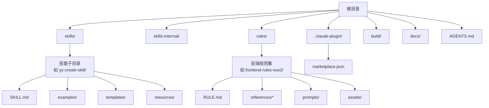
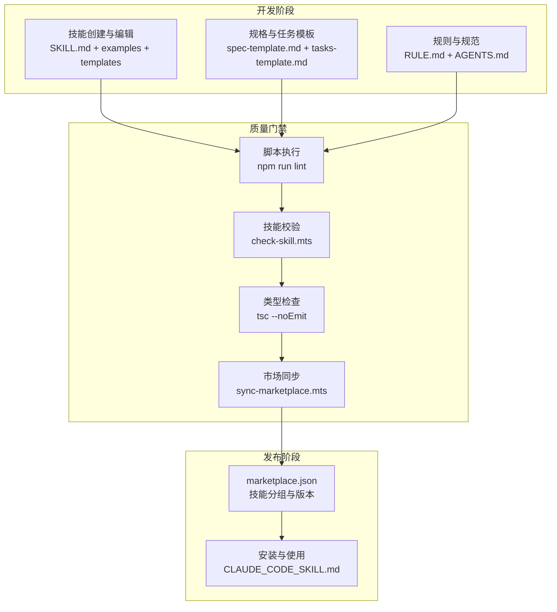
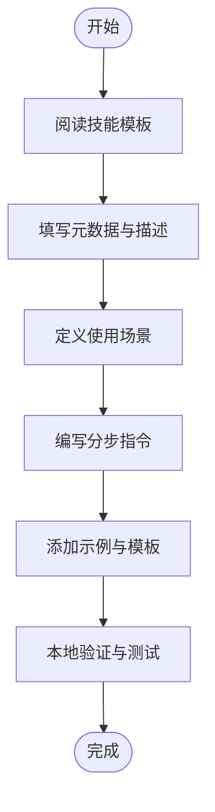
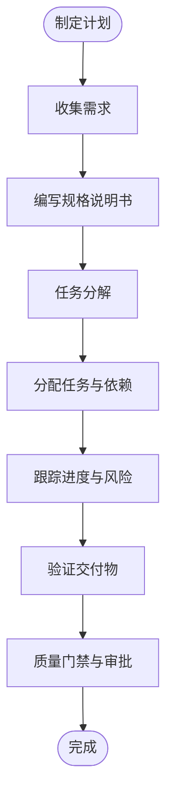
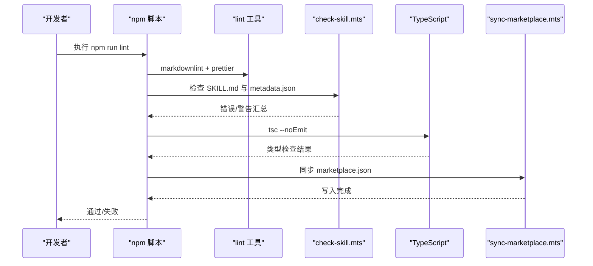
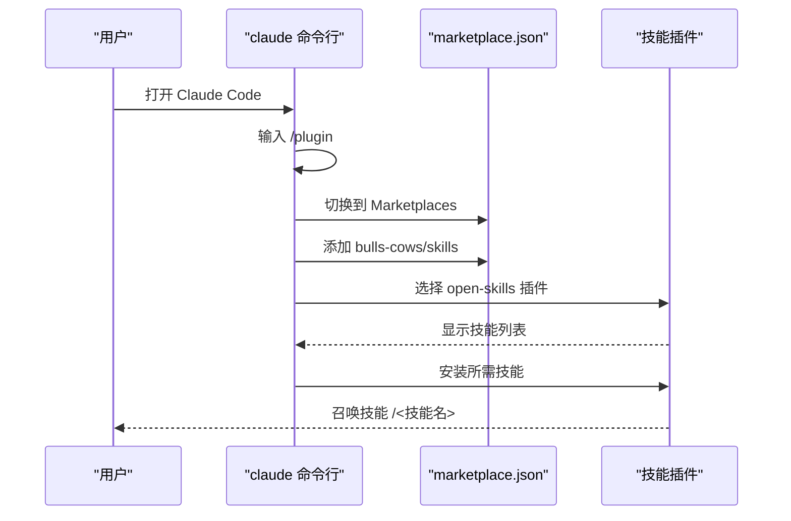
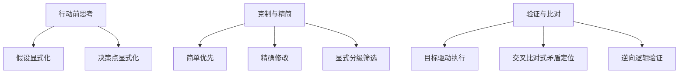
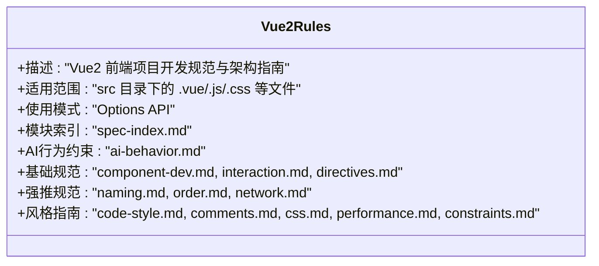
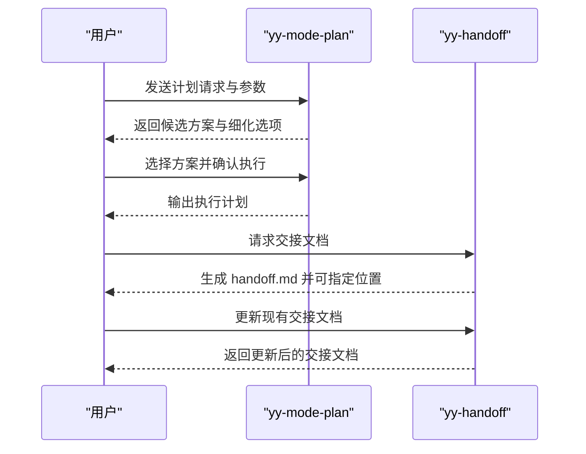
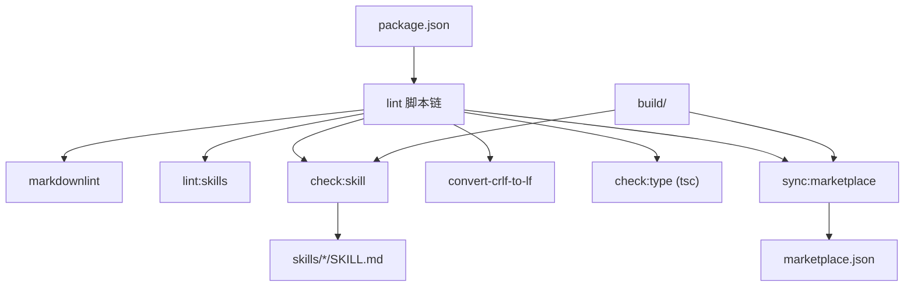

# 教程工作流

<cite>
**本文引用的文件**
- [package.json](file://package.json)
- [AGENTS.md](file://AGENTS.md)
- [DEVELOP.md](file://docs/DEVELOP.md)
- [STRUCTURE.md](file://docs/STRUCTURE.md)
- [CLAUDE_CODE_SKILL.md](file://docs/CLAUDE_CODE_SKILL.md)
- [skill-template.md](file://skills/yy-create-skill/templates/skill-template.md)
- [spec-template.md](file://skills/yy-mode-spec/templates/spec-template.md)
- [tasks-template.md](file://skills/yy-mode-spec/templates/tasks-template.md)
- [checklist-template.md](file://skills/yy-mode-spec/templates/checklist-template.md)
- [RULE.md](file://rules/frontend-rules-vue2/RULE.md)
- [output.md](file://skills/yy-create-skill/examples/output.md)
- [check-skill.mts](file://build/check-skill.mts)
- [sync-marketplace.mts](file://build/sync-marketplace.mts)
- [input.md (yy-mode-plan)](file://skills/yy-mode-plan/examples/input.md)
- [input.md (yy-handoff)](file://skills/yy-handoff/examples/input.md)
</cite>

## 目录
1. [简介](#简介)
2. [项目结构](#项目结构)
3. [核心组件](#核心组件)
4. [架构概览](#架构概览)
5. [详细组件分析](#详细组件分析)
6. [依赖分析](#依赖分析)
7. [性能考虑](#性能考虑)
8. [故障排除指南](#故障排除指南)
9. [结论](#结论)
10. [附录](#附录)

## 简介
本教程工作流文档面向技能开发者与团队协作场景，提供从需求分析、技能设计、开发实现到发布的完整端到端流程指导。系统化梳理项目规划、规格制定、任务分配与知识传递等关键环节，配套可复用模板与脚手架，帮助团队建立标准化的工作流程。同时总结团队协作最佳实践、沟通技巧与进度管理方法，为项目管理和团队开发提供实用指导。

## 项目结构
仓库采用“技能 + 规则 + 构建工具”的分层组织方式：
- skills/：公共技能根目录，每个技能为独立的目录，包含 SKILL.md、examples、templates、resources 等
- skills-internal/：私有技能目录，用于内部维护与迭代
- rules/：自定义规则集合，按领域拆分子模块，支持快速导航与引用
- .claude-plugin/：插件市场配置，定义技能分组与发布入口
- build/：构建与质量保障脚本，负责技能校验与市场同步
- docs/：项目文档与开发指南，提供结构说明与安装指引
- AGENTS.md：智能体编码规范与质量门禁，定义交付格式与行为准则

图表来源
- [STRUCTURE.md:1-10](file://docs/STRUCTURE.md#L1-L10)
- [RULE.md:1-62](file://rules/frontend-rules-vue2/RULE.md#L1-L62)

章节来源
- [STRUCTURE.md:1-10](file://docs/STRUCTURE.md#L1-L10)
- [AGENTS.md:35-45](file://AGENTS.md#L35-L45)

## 核心组件
- 技能模板与示例：提供标准化的技能结构与输出示例，便于快速创建与复用
- 规格与任务模板：支撑需求分析、技术设计与任务分解，形成可追踪的交付物
- 质量门禁与规则：通过 lint、类型检查与市场同步脚本，确保一致性与可维护性
- 市场配置与安装：通过 marketplace.json 与安装指南，实现技能的统一发布与获取

章节来源
- [skill-template.md:1-37](file://skills/yy-create-skill/templates/skill-template.md#L1-L37)
- [output.md:1-194](file://skills/yy-create-skill/examples/output.md#L1-L194)
- [spec-template.md:1-51](file://skills/yy-mode-spec/templates/spec-template.md#L1-L51)
- [tasks-template.md:1-27](file://skills/yy-mode-spec/templates/tasks-template.md#L1-L27)
- [checklist-template.md:1-32](file://skills/yy-mode-spec/templates/checklist-template.md#L1-L32)
- [check-skill.mts:1-230](file://build/check-skill.mts#L1-L230)
- [sync-marketplace.mts:1-93](file://build/sync-marketplace.mts#L1-L93)

## 架构概览
系统围绕“技能开发—质量门禁—市场发布”三阶段展开，配合模板与规则体系，形成闭环的质量保障与协作机制。

图表来源
- [package.json:7-16](file://package.json#L7-L16)
- [check-skill.mts:177-229](file://build/check-skill.mts#L177-L229)
- [sync-marketplace.mts:12-92](file://build/sync-marketplace.mts#L12-L92)
- [CLAUDE_CODE_SKILL.md:1-10](file://docs/CLAUDE_CODE_SKILL.md#L1-L10)

## 详细组件分析

### 技能模板与示例
- 模板结构：提供技能基础框架，包含元数据、描述、使用场景、指令与相关资源等章节
- 输出示例：展示从简单到复杂的技能创建结果，包括目录结构、SKILL.md 内容与变更说明
- 应用建议：以模板为起点，结合业务场景细化指令与示例，确保触发条件明确、输出格式规范

图表来源
- [skill-template.md:9-36](file://skills/yy-create-skill/templates/skill-template.md#L9-L36)
- [output.md:18-104](file://skills/yy-create-skill/examples/output.md#L18-L104)

章节来源
- [skill-template.md:1-37](file://skills/yy-create-skill/templates/skill-template.md#L1-L37)
- [output.md:1-194](file://skills/yy-create-skill/examples/output.md#L1-L194)

### 规格与任务模板
- 规格说明书模板：覆盖功能概述、需求分析、技术设计、API 规格、数据模型与核心代码示例
- 任务分解模板：支持阶段划分、任务依赖与复杂度评估，配合验收标准形成可追踪的执行清单
- 验证清单模板：提供实施前后检查点与质量门禁，确保交付质量与合规性

图表来源
- [spec-template.md:5-50](file://skills/yy-mode-spec/templates/spec-template.md#L5-L50)
- [tasks-template.md:5-26](file://skills/yy-mode-spec/templates/tasks-template.md#L5-L26)
- [checklist-template.md:5-31](file://skills/yy-mode-spec/templates/checklist-template.md#L5-L31)

章节来源
- [spec-template.md:1-51](file://skills/yy-mode-spec/templates/spec-template.md#L1-L51)
- [tasks-template.md:1-27](file://skills/yy-mode-spec/templates/tasks-template.md#L1-L27)
- [checklist-template.md:1-32](file://skills/yy-mode-spec/templates/checklist-template.md#L1-L32)

### 质量门禁与规则
- 脚本与流程：通过 npm 脚本统一执行 lint、类型检查、CRLF 转 LF、技能一致性检查与市场同步
- 技能校验：自动检测 SKILL.md 格式、元数据完整性与 metadata.json 一致性，输出错误与警告
- 市场同步：自动从 skills 与 skills-internal 目录生成技能列表，按前端/非前端分类写入 marketplace.json

图表来源
- [package.json:7-16](file://package.json#L7-L16)
- [check-skill.mts:177-229](file://build/check-skill.mts#L177-L229)
- [sync-marketplace.mts:12-92](file://build/sync-marketplace.mts#L12-L92)

章节来源
- [package.json:7-16](file://package.json#L7-L16)
- [check-skill.mts:1-230](file://build/check-skill.mts#L1-L230)
- [sync-marketplace.mts:1-93](file://build/sync-marketplace.mts#L1-L93)

### 市场配置与安装
- 市场配置：marketplace.json 自动同步包信息与技能列表，按插件分组维护
- 安装流程：提供在 Claude Code 中添加市场、选择插件与安装技能的步骤说明

图表来源
- [CLAUDE_CODE_SKILL.md:1-10](file://docs/CLAUDE_CODE_SKILL.md#L1-L10)
- [sync-marketplace.mts:18-60](file://build/sync-marketplace.mts#L18-L60)

章节来源
- [CLAUDE_CODE_SKILL.md:1-10](file://docs/CLAUDE_CODE_SKILL.md#L1-L10)
- [sync-marketplace.mts:1-93](file://build/sync-marketplace.mts#L1-L93)

### 团队协作与沟通
- 智能体编码规范：明确质量门禁、交付格式、项目结构、编辑器配置与 AI 思考方式
- 行动前思考：强调假设显式化、决策点显式化与克制精简原则
- 验证与比对：目标驱动执行、交叉比对式矛盾定位与逆向逻辑验证
- 重要提示：npm 项目特性、运行 lint、不要手动修改 marketplace.json、技能是主要产出物等

图表来源
- [AGENTS.md:47-121](file://AGENTS.md#L47-L121)

章节来源
- [AGENTS.md:1-155](file://AGENTS.md#L1-L155)

### 前端规则与行为约束
- Vue2 前端规则：按 Essential/Strongly Recommended/Recommended 三级索引，覆盖组件开发、交互通信、指令规范、命名与性能优化等
- 适用范围：限定 src 目录下的 .vue/.js/.css 等文件，使用 Options API，提供快速导航索引与约束清单

图表来源
- [RULE.md:1-62](file://rules/frontend-rules-vue2/RULE.md#L1-L62)

章节来源
- [RULE.md:1-62](file://rules/frontend-rules-vue2/RULE.md#L1-L62)

### 本地开发与调试
- 目录说明：skills-internal 用于私有技能维护，skills 用于公共技能提供
- 调试命令：在根目录执行技能添加命令，即可在本地调试 skills 目录下的技能
- 忽略文件：本地调试生成的 skills-lock.json 与 .agents/skills/ 不提交到 Git

章节来源
- [DEVELOP.md:1-18](file://docs/DEVELOP.md#L1-L18)

### 计划制定与交接文档
- 计划制定：支持指定工具目录、计划文件与细化确认，形成可执行的阶段性方案
- 交接文档：支持创建、续接、整理上下文、更新现有文档与指定存放位置，确保任务连续性

图表来源
- [input.md (yy-mode-plan):7-35](file://skills/yy-mode-plan/examples/input.md#L7-L35)
- [input.md (yy-handoff):7-43](file://skills/yy-handoff/examples/input.md#L7-L43)

章节来源
- [input.md (yy-mode-plan):1-36](file://skills/yy-mode-plan/examples/input.md#L1-L36)
- [input.md (yy-handoff):1-43](file://skills/yy-handoff/examples/input.md#L1-L43)

## 依赖分析
- 脚本依赖：package.json 中的 lint 脚本串联多个检查步骤，确保文档与代码质量
- 构建依赖：check-skill.mts 与 sync-marketplace.mts 依赖 Node.js 文件系统 API 与 js-yaml
- 市场依赖：marketplace.json 由 sync-marketplace.mts 动态生成，依赖 skills 与 skills-internal 目录结构

图表来源
- [package.json:7-16](file://package.json#L7-L16)
- [check-skill.mts:1-230](file://build/check-skill.mts#L1-L230)
- [sync-marketplace.mts:1-93](file://build/sync-marketplace.mts#L1-L93)

章节来源
- [package.json:1-46](file://package.json#L1-L46)
- [check-skill.mts:1-230](file://build/check-skill.mts#L1-L230)
- [sync-marketplace.mts:1-93](file://build/sync-marketplace.mts#L1-L93)

## 性能考虑
- 脚本执行效率：通过并行化 lint 步骤与增量检查，减少重复计算
- 文件系统访问：在批量处理技能时，优先缓存目录列表与元数据，降低 I/O 成本
- 市场同步策略：按前端/非前端分类写入，避免全量重建导致的性能损耗

## 故障排除指南
- 技能校验失败：检查 SKILL.md 格式、元数据完整性与 metadata.json 一致性，根据错误/警告提示逐项修正
- 市场同步异常：确认 skills 与 skills-internal 目录存在且非空，检查 marketplace.json 权限与 JSON 格式
- 类型检查错误：根据 tsc 报错定位具体文件与行号，修复类型定义或导入路径
- 文档与代码风格问题：运行 markdownlint 与 prettier，确保符合项目规范

章节来源
- [check-skill.mts:50-122](file://build/check-skill.mts#L50-L122)
- [sync-marketplace.mts:12-92](file://build/sync-marketplace.mts#L12-L92)
- [package.json:11-13](file://package.json#L11-L13)

## 结论
本教程工作流通过标准化模板、严格的质量门禁与清晰的协作规范，为技能开发与团队协作提供了可复用的框架。建议团队在项目启动时即引入规格与任务模板，贯穿开发全过程；在每次变更后执行质量门禁脚本，确保技能一致性与可维护性；在发布前完成市场同步与安装验证，保障用户体验与交付质量。

## 附录
- 快速开始清单
  - 阅读项目结构与开发指南
  - 使用技能模板创建新技能
  - 编写规格说明书与任务分解
  - 执行质量门禁脚本
  - 同步市场并验证安装
- 最佳实践
  - 明确触发条件与输出格式
  - 保持元数据与文档一致性
  - 使用验证清单进行阶段性检查
  - 采用逆向逻辑验证提升质量