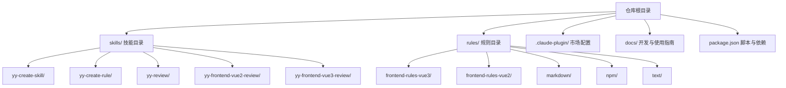
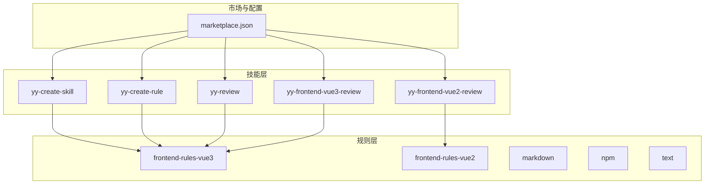
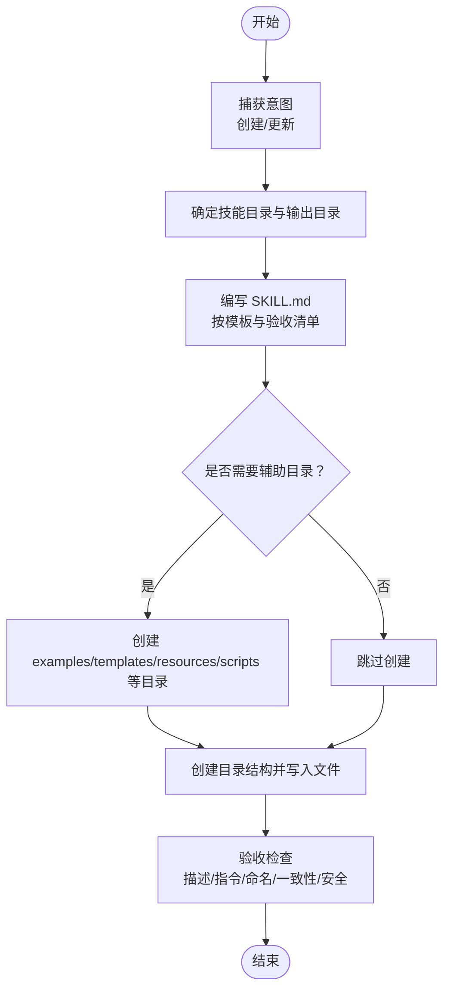
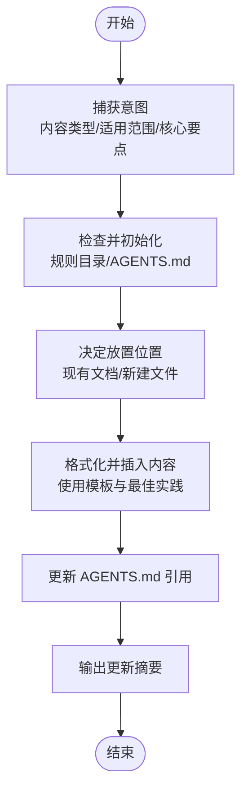
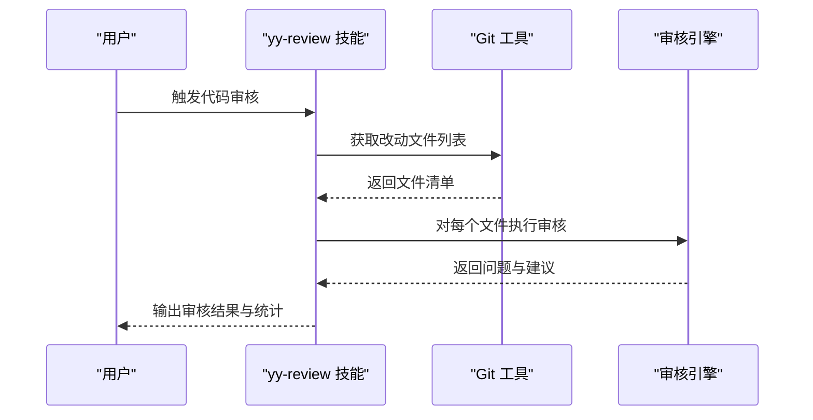
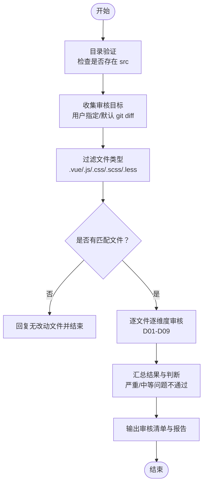
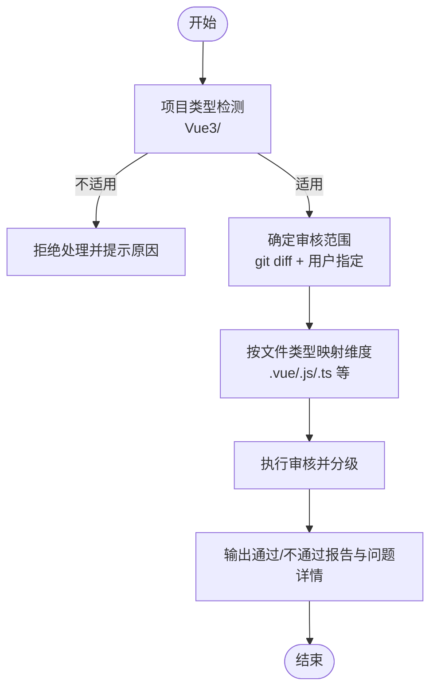
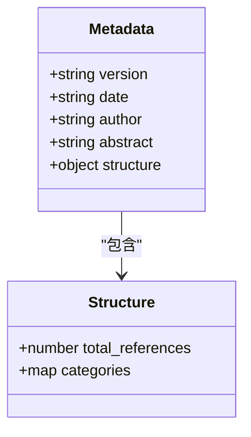
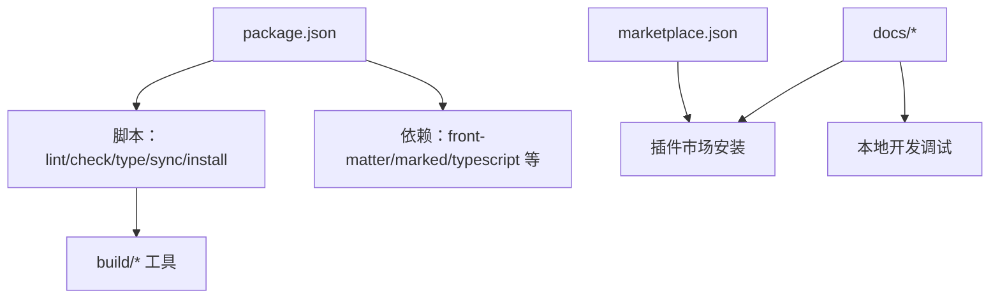

# 示例与教程

<cite>
**本文引用的文件**
- [README.md](file://README.md)
- [package.json](file://package.json)
- [DEVELOP.md](file://docs/DEVELOP.md)
- [CLAUDE_CODE_SKILL.md](file://docs/CLAUDE_CODE_SKILL.md)
- [STRUCTURE.md](file://docs/STRUCTURE.md)
- [yy-create-skill/SKILL.md](file://skills/yy-create-skill/SKILL.md)
- [yy-create-rule/SKILL.md](file://skills/yy-create-rule/SKILL.md)
- [yy-review/SKILL.md](file://skills/yy-review/SKILL.md)
- [yy-frontend-vue2-review/SKILL.md](file://skills/yy-frontend-vue2-review/SKILL.md)
- [yy-frontend-vue3-review/SKILL.md](file://skills/yy-frontend-vue3-review/SKILL.md)
- [yy-create-skill/examples/input.md](file://skills/yy-create-skill/examples/input.md)
- [yy-create-skill/examples/output.md](file://skills/yy-create-skill/examples/output.md)
- [yy-create-rule/examples/input.md](file://skills/yy-create-rule/examples/input.md)
- [yy-create-rule/examples/output.md](file://skills/yy-create-rule/examples/output.md)
- [frontend-rules-vue3/metadata.json](file://rules/frontend-rules-vue3/metadata.json)
</cite>

## 目录
1. [简介](#简介)
2. [项目结构](#项目结构)
3. [核心组件](#核心组件)
4. [架构总览](#架构总览)
5. [详细组件分析](#详细组件分析)
6. [依赖分析](#依赖分析)
7. [性能考虑](#性能考虑)
8. [故障排查指南](#故障排查指南)
9. [结论](#结论)
10. [附录](#附录)

## 简介
本教程面向不同技能水平的用户，提供从基础到高级的完整学习路径，涵盖技能创建、规则应用、代码审核与市场发布等核心能力。通过“示例驱动 + 实战演练”的方式，帮助你快速掌握如何使用与扩展本仓库中的技能与规则，形成可复用的工作流与知识库。

## 项目结构
本仓库采用“技能 + 规则 + 市场配置”的分层组织方式：
- skills/：公共技能集合，每个技能以独立目录呈现，包含 SKILL.md、examples/、templates/、resources/ 等可选子目录
- rules/：规则集合，按技术栈细分，提供参考文件与元数据
- .claude-plugin/marketplace.json：插件市场配置，用于在 Claude Code 中安装与管理技能
- docs/：开发与使用指南，包含本地调试、安装、结构说明等
- package.json：项目脚本与依赖，提供 Lint、类型检查、市场同步等自动化流程

**图表来源**
- [STRUCTURE.md:1-10](file://docs/STRUCTURE.md#L1-L10)
- [README.md:1-104](file://README.md#L1-L104)

**章节来源**
- [STRUCTURE.md:1-10](file://docs/STRUCTURE.md#L1-L10)
- [README.md:1-104](file://README.md#L1-L104)

## 核心组件
本仓库的核心能力围绕“技能”和“规则”两大类组件展开：

- 技能（Skills）：可按需加载的任务说明书，具备明确触发条件、清晰指令与可执行输出。常见技能包括：
  - 创建/更新技能：yy-create-skill
  - 创建/更新规则：yy-create-rule
  - 代码审核：yy-review、yy-frontend-vue2-review、yy-frontend-vue3-review
  - 通用工具：yy-commit、yy-lint、yy-create-readme、yy-post-to-wechat 等

- 规则（Rules）：面向特定技术栈的开发规范与最佳实践，提供参考文件与元数据，支撑技能在具体场景下的落地。

- 市场与安装：通过 .claude-plugin/marketplace.json 与官方插件市场对接，支持在 Claude Code 中一键安装与使用。

**章节来源**
- [README.md:32-86](file://README.md#L32-L86)
- [CLAUDE_CODE_SKILL.md:1-10](file://docs/CLAUDE_CODE_SKILL.md#L1-L10)

## 架构总览
下图展示了技能与规则在项目中的协作关系，以及与市场配置的集成方式：

**图表来源**
- [README.md:12-86](file://README.md#L12-L86)
- [.claude-plugin/marketplace.json](file://.claude-plugin/marketplace.json)

## 详细组件分析

### 技能：yy-create-skill（从零到一创建规范技能）
该技能的目标是帮助用户创建或更新符合规范的 Skill，包含完整的目录结构、YAML 元数据与可执行指令步骤。其核心流程如下：

- 捕获意图：区分“创建新技能”与“更新现有技能”，并引导用户提供触发场景与用途
- 确定技能目录与输出目录：遵循 kebab-case 命名，优先在 .agents/skills/ 等目录生成
- 编写 SKILL.md：按模板与验收清单生成内容，必要时创建 examples/、templates/、resources/、scripts/ 等辅助目录
- 创建目录结构并执行写入
- 验收：检查描述准确性、指令完整性、文件命名与一致性、安全边界等

**图表来源**
- [yy-create-skill/SKILL.md:34-177](file://skills/yy-create-skill/SKILL.md#L34-L177)

**章节来源**
- [yy-create-skill/SKILL.md:1-213](file://skills/yy-create-skill/SKILL.md#L1-L213)
- [yy-create-skill/examples/input.md:1-41](file://skills/yy-create-skill/examples/input.md#L1-L41)
- [yy-create-skill/examples/output.md:1-194](file://skills/yy-create-skill/examples/output.md#L1-L194)

### 技能：yy-create-rule（沉淀团队规则与知识）
该技能用于创建或更新规则文档，并在 AGENTS.md 中更新引用关系，使 AI 助手能够理解项目的具体规范与最佳实践。流程包括：

- 捕获意图：判断内容类型（最佳实践/规范约定/bug 修复/架构决策等）
- 检查并初始化：规则目录与 AGENTS.md
- 决定放置位置：在现有规则文档中插入或新建文件
- 格式化并插入内容：使用内容模板与最佳实践
- 更新 AGENTS.md 引用
- 输出更新摘要

**图表来源**
- [yy-create-rule/SKILL.md:29-103](file://skills/yy-create-rule/SKILL.md#L29-L103)

**章节来源**
- [yy-create-rule/SKILL.md:1-133](file://skills/yy-create-rule/SKILL.md#L1-L133)
- [yy-create-rule/examples/input.md:1-34](file://skills/yy-create-rule/examples/input.md#L1-L34)
- [yy-create-rule/examples/output.md:1-32](file://skills/yy-create-rule/examples/output.md#L1-L32)

### 技能：yy-review（通用代码审核）
该技能对 git 变动文件进行代码审核，按严重程度分类输出问题描述与修复建议。流程包括：

- 获取改动文件列表：支持 HEAD 与暂存区
- 代码审核：语法错误、逻辑错误、安全漏洞、最佳实践
- 输出审核结果：统计与详情，区分“无问题/仅有轻微问题/存在严重或中等问题”
- 安全边界：禁止主动执行编译、构建、部署、自动测试与修改代码的命令

**图表来源**
- [yy-review/SKILL.md:26-84](file://skills/yy-review/SKILL.md#L26-L84)

**章节来源**
- [yy-review/SKILL.md:1-131](file://skills/yy-review/SKILL.md#L1-L131)

### 技能：yy-frontend-vue2-review（Vue2 前端代码审核）
该技能专用于 Vue2 项目，严格限制在 src 目录内审核，覆盖 9 大审核维度（代码风格、最佳实践、组件规范、命名、网络请求、computed、逻辑错误、安全、绝对禁止项），并按严重程度分级输出审核清单。

**图表来源**
- [yy-frontend-vue2-review/SKILL.md:59-96](file://skills/yy-frontend-vue2-review/SKILL.md#L59-L96)

**章节来源**
- [yy-frontend-vue2-review/SKILL.md:1-167](file://skills/yy-frontend-vue2-review/SKILL.md#L1-L167)

### 技能：yy-frontend-vue3-review（Vue3 前端代码审核）
该技能用于 Vue3 项目，支持 .vue（SFC）、.js/.jsx/.ts/.tsx、.css/.scss/.less 等文件类型，提供更严格的规范与风险分级，覆盖代码风格、最佳实践、组件规范、命名、网络请求、computed、逻辑错误、安全、绝对禁止项等维度。

**图表来源**
- [yy-frontend-vue3-review/SKILL.md:14-88](file://skills/yy-frontend-vue3-review/SKILL.md#L14-L88)

**章节来源**
- [yy-frontend-vue3-review/SKILL.md:1-206](file://skills/yy-frontend-vue3-review/SKILL.md#L1-L206)

### 规则：frontend-rules-vue3（Vue3 开发规范与架构指南）
该规则集提供 18 个 references/ 子模块，按优先级三级分类（基础/强烈推荐/风格指南），并与 yy-frontend-vue3-code-optimization 技能规范对齐。元数据包含版本、作者、摘要与结构分布。

**图表来源**
- [frontend-rules-vue3/metadata.json:1-17](file://rules/frontend-rules-vue3/metadata.json#L1-L17)

**章节来源**
- [frontend-rules-vue3/metadata.json:1-17](file://rules/frontend-rules-vue3/metadata.json#L1-L17)

## 依赖分析
- 本地开发与调试：通过 package.json 中的脚本实现 Lint、类型检查、CRLF 转换、市场同步与技能安装
- 市场发布：.claude-plugin/marketplace.json 与官方插件市场对接，支持在 Claude Code 中安装
- 文档与指南：docs/ 目录提供本地开发调试、安装、项目结构说明等

**图表来源**
- [package.json:7-16](file://package.json#L7-L16)
- [.claude-plugin/marketplace.json](file://.claude-plugin/marketplace.json)

**章节来源**
- [package.json:1-46](file://package.json#L1-L46)
- [DEVELOP.md:1-18](file://docs/DEVELOP.md#L1-L18)
- [CLAUDE_CODE_SKILL.md:1-10](file://docs/CLAUDE_CODE_SKILL.md#L1-L10)

## 性能考虑
- 审核范围控制：技能默认聚焦于改动文件与特定目录（如 src），避免全量扫描带来的性能开销
- 分段处理：大型文件可按行数分段审核，减少单次处理压力
- 严格边界：禁止执行编译、构建、部署与自动修复命令，降低资源占用与风险
- 规则模块化：规则按子模块组织，便于按需加载与维护

[本节为通用指导，无需特定文件分析]

## 故障排查指南
- 本地调试文件：本地调试会生成 skills-lock.json 与 .agents/skills/ 等文件，已在 .gitignore 中配置忽略，避免误提交
- 市场安装：在 Claude Code 中首次添加仓库需选中 “+ Add Marketplace”，输入仓库名后回车；选择 open-skills 插件市场并安装所需技能
- 项目结构：确保遵循 skills/ 与 rules/ 的目录规范，避免因结构不匹配导致技能无法加载或规则不生效

**章节来源**
- [DEVELOP.md:14-18](file://docs/DEVELOP.md#L14-L18)
- [CLAUDE_CODE_SKILL.md:1-10](file://docs/CLAUDE_CODE_SKILL.md#L1-L10)

## 结论
通过本教程，你可以系统地掌握从“创建技能”到“沉淀规则”再到“代码审核”的完整工作流。结合示例与模板，你可以快速搭建自己的技能体系与团队规范，并在 Claude Code 等环境中高效使用与发布。

[本节为总结性内容，无需特定文件分析]

## 附录

### 交互式学习路径建议
- 初学者
  - 从 yy-create-skill 与 yy-create-rule 开始，掌握“如何创建一个规范技能”和“如何沉淀团队规则”
  - 参考 examples/input.md 与 examples/output.md，对照输入输出模板逐步上手
- 进阶用户
  - 使用 yy-review 与前端审核技能（yy-frontend-vue2-review、yy-frontend-vue3-review）进行实战代码审核
  - 对照规则 references/ 子模块，理解各维度的规范与风险分级
- 高级用户
  - 基于技能模板与验收清单，扩展复杂场景（如 API 测试、UI 设计、发布流程等）
  - 通过 marketpalce.json 与官方插件市场，将你的技能发布给更广泛的用户群体

### 常用模板与脚手架
- 技能模板：templates/skill-template.md
- 规则内容模板：resources/content-template.md
- 规则最佳实践：resources/rule-best-practices.md
- 示例输入/输出：skills/*/examples/input.md 与 skills/*/examples/output.md

**章节来源**
- [yy-create-skill/SKILL.md:188-196](file://skills/yy-create-skill/SKILL.md#L188-L196)
- [yy-create-rule/SKILL.md:127-133](file://skills/yy-create-rule/SKILL.md#L127-L133)
- [yy-create-skill/examples/input.md:1-41](file://skills/yy-create-skill/examples/input.md#L1-L41)
- [yy-create-skill/examples/output.md:1-194](file://skills/yy-create-skill/examples/output.md#L1-L194)
- [yy-create-rule/examples/input.md:1-34](file://skills/yy-create-rule/examples/input.md#L1-L34)
- [yy-create-rule/examples/output.md:1-32](file://skills/yy-create-rule/examples/output.md#L1-L32)