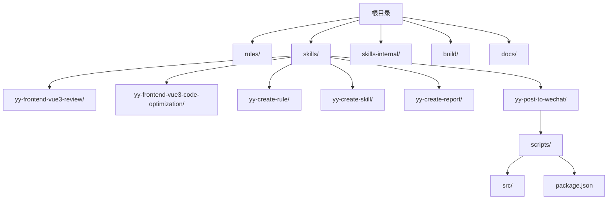
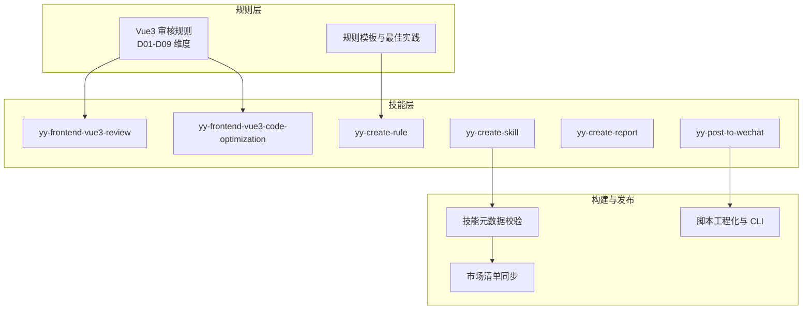
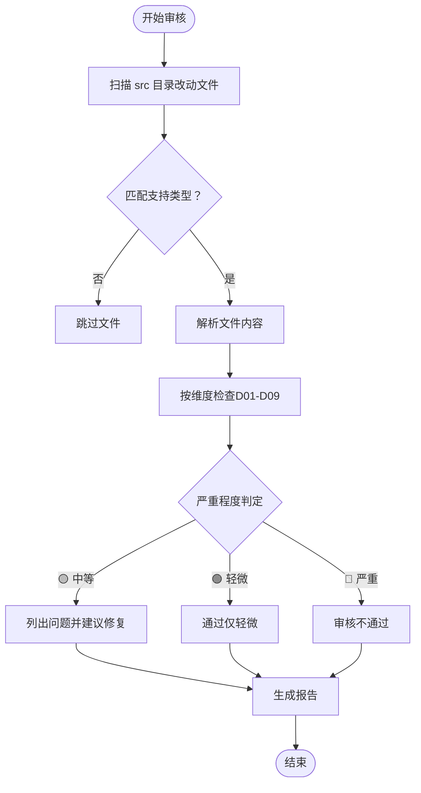
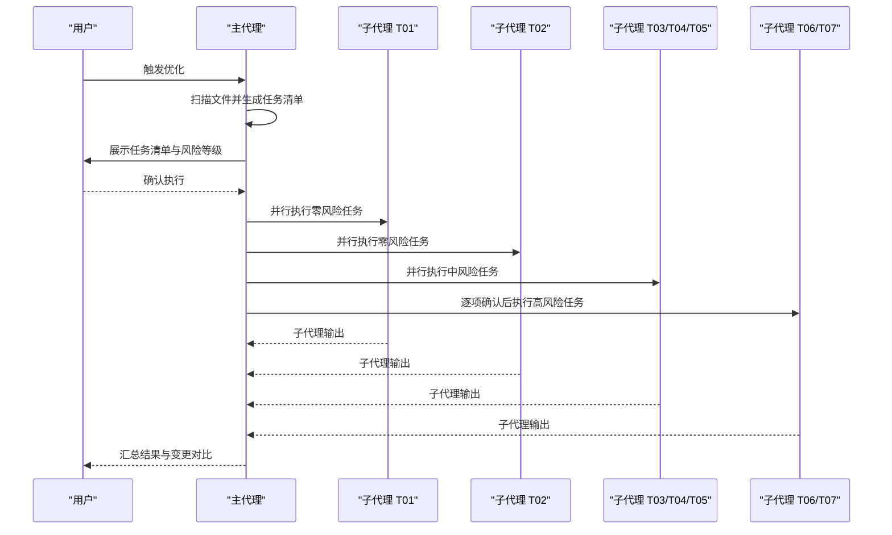
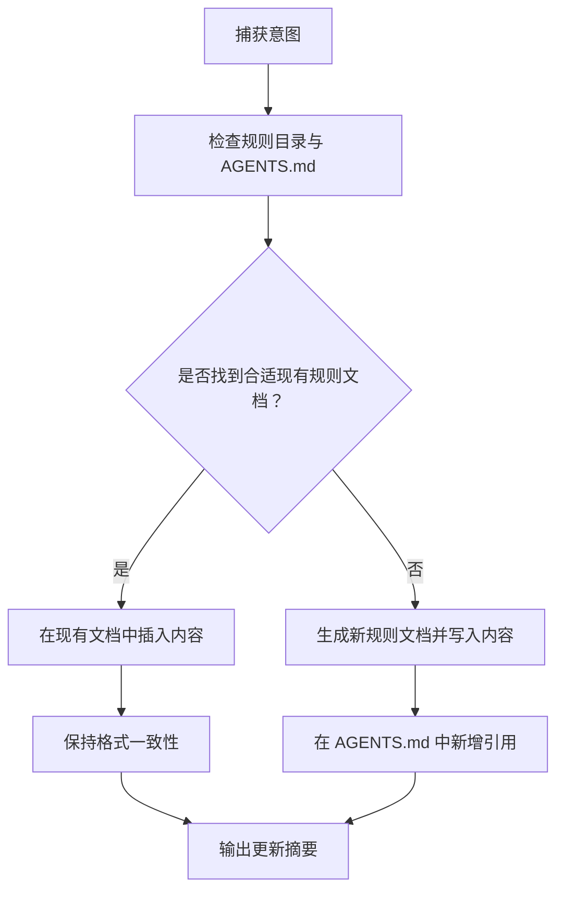
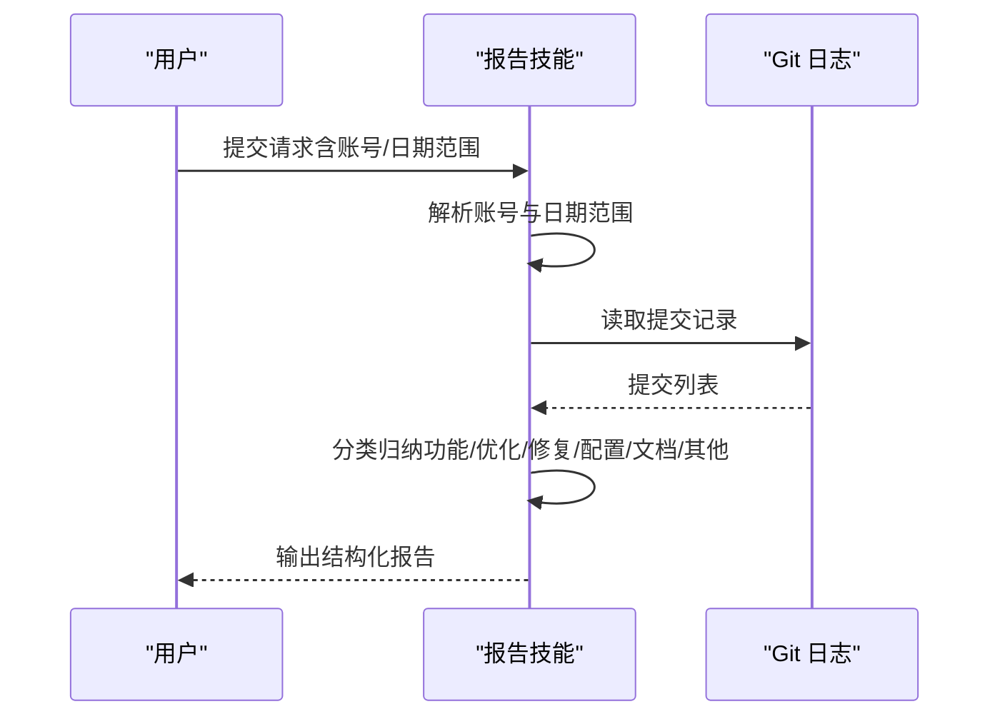
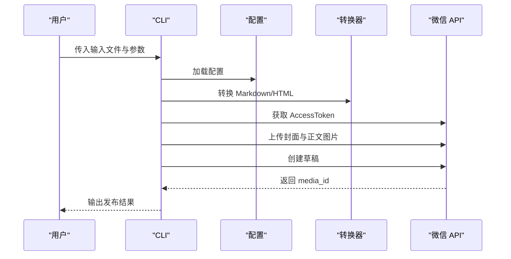
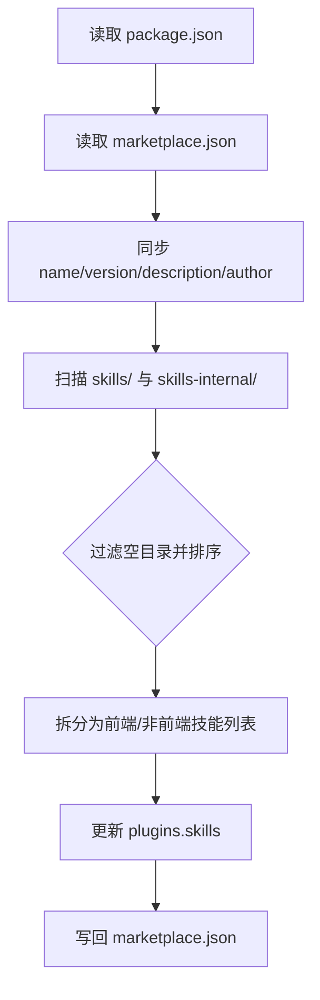
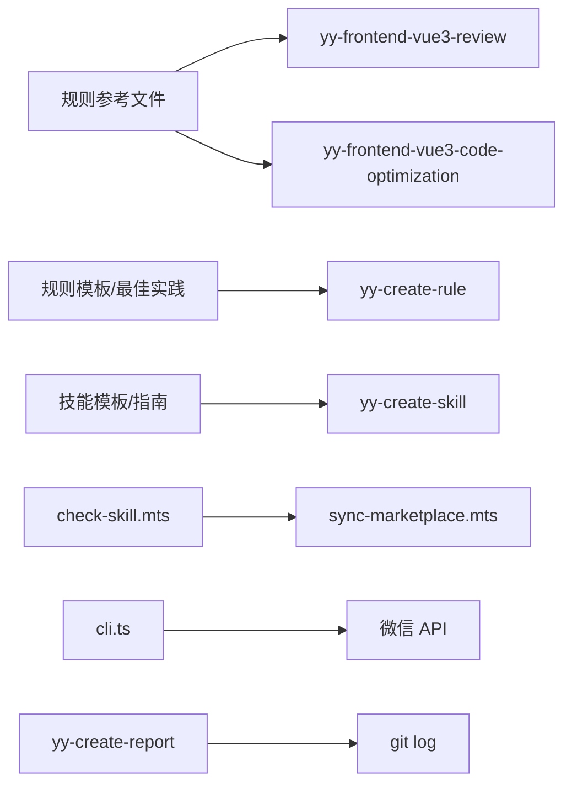

# 进阶示例

<cite>
**本文引用的文件**
- [README.md](file://README.md)
- [package.json](file://package.json)
- [skills/yy-frontend-vue3-review/SKILL.md](file://skills/yy-frontend-vue3-review/SKILL.md)
- [skills/yy-frontend-vue3-review/references/absolute-prohibitions.md](file://skills/yy-frontend-vue3-review/references/absolute-prohibitions.md)
- [skills/yy-frontend-vue3-review/references/best-practice.md](file://skills/yy-frontend-vue3-review/references/best-practice.md)
- [skills/yy-frontend-vue3-review/references/code-style.md](file://skills/yy-frontend-vue3-review/references/code-style.md)
- [skills/yy-frontend-vue3-review/references/component.md](file://skills/yy-frontend-vue3-review/references/component.md)
- [skills/yy-frontend-vue3-review/references/computed.md](file://skills/yy-frontend-vue3-review/references/computed.md)
- [skills/yy-frontend-vue3-code-optimization/SKILL.md](file://skills/yy-frontend-vue3-code-optimization/SKILL.md)
- [skills/yy-create-rule/SKILL.md](file://skills/yy-create-rule/SKILL.md)
- [skills/yy-create-rule/resources/content-template.md](file://skills/yy-create-rule/resources/content-template.md)
- [skills/yy-create-skill/SKILL.md](file://skills/yy-create-skill/SKILL.md)
- [skills/yy-create-skill/templates/skill-template.md](file://skills/yy-create-skill/templates/skill-template.md)
- [skills/yy-create-report/SKILL.md](file://skills/yy-create-report/SKILL.md)
- [skills/yy-post-to-wechat/scripts/src/cli.ts](file://skills/yy-post-to-wechat/scripts/src/cli.ts)
- [skills/yy-post-to-wechat/scripts/package.json](file://skills/yy-post-to-wechat/scripts/package.json)
- [build/check-skill.mts](file://build/check-skill.mts)
- [build/sync-marketplace.mts](file://build/sync-marketplace.mts)
</cite>

## 目录
1. [简介](#简介)
2. [项目结构](#项目结构)
3. [核心组件](#核心组件)
4. [架构总览](#架构总览)
5. [详细组件分析](#详细组件分析)
6. [依赖分析](#依赖分析)
7. [性能考虑](#性能考虑)
8. [故障排查指南](#故障排查指南)
9. [结论](#结论)
10. [附录](#附录)

## 简介
本文件面向有经验的开发者，提供基于仓库的“进阶示例”文档，聚焦以下高级主题与实战案例：
- Vue3 代码审核与自定义规则扩展
- 自定义规则创建与知识沉淀
- 报告生成与 API 测试技能串联
- 复杂技能工程化：子代理调度、风险分级与变更预览
- 构建与发布：技能校验、市场清单同步与脚本化 CLI
- 性能优化、错误处理与最佳实践

本指南既提供架构视图，也给出可落地的实施步骤与可视化图示，帮助你在真实项目中快速落地。

## 项目结构
仓库采用“规则 + 技能”的双轨组织方式，规则用于沉淀规范与最佳实践，技能用于封装可复用的自动化流程。技能内部可包含脚本、模板与资源目录，形成“可执行的知识”。

图表来源
- [README.md:1-104](file://README.md#L1-L104)
- [package.json:1-46](file://package.json#L1-L46)

章节来源
- [README.md:1-104](file://README.md#L1-L104)
- [package.json:1-46](file://package.json#L1-L46)

## 核心组件
- Vue3 代码审核技能：基于维度化的规则体系，对文件类型与严重程度进行分级，输出可执行的修复建议。
- Vue3 代码优化技能：采用子代理流水线，按风险等级分层执行，支持逐项确认与变更预览。
- 自定义规则创建技能：将最佳实践、Bug 修复经验、架构决策沉淀为可检索的规则文档，并同步到 AGENTS.md。
- 报告生成技能：聚合 Git 提交记录，按类别输出结构化工作报告。
- 微信公众号发布脚本：CLI 化的 Markdown/HTML 转换与草稿发布流程，支持主题、颜色、封面与评论配置。
- 构建与发布工具：技能元数据校验、市场清单同步与脚本工程化。

章节来源
- [skills/yy-frontend-vue3-review/SKILL.md:1-206](file://skills/yy-frontend-vue3-review/SKILL.md#L1-L206)
- [skills/yy-frontend-vue3-code-optimization/SKILL.md:1-464](file://skills/yy-frontend-vue3-code-optimization/SKILL.md#L1-L464)
- [skills/yy-create-rule/SKILL.md:1-133](file://skills/yy-create-rule/SKILL.md#L1-L133)
- [skills/yy-create-report/SKILL.md:1-179](file://skills/yy-create-report/SKILL.md#L1-L179)
- [skills/yy-post-to-wechat/scripts/src/cli.ts:1-264](file://skills/yy-post-to-wechat/scripts/src/cli.ts#L1-L264)
- [build/check-skill.mts:1-230](file://build/check-skill.mts#L1-L230)
- [build/sync-marketplace.mts:1-93](file://build/sync-marketplace.mts#L1-L93)

## 架构总览
下图展示了“规则-技能-构建-发布”的整体架构，以及关键组件间的交互关系。

图表来源
- [skills/yy-frontend-vue3-review/SKILL.md:1-206](file://skills/yy-frontend-vue3-review/SKILL.md#L1-L206)
- [skills/yy-frontend-vue3-code-optimization/SKILL.md:1-464](file://skills/yy-frontend-vue3-code-optimization/SKILL.md#L1-L464)
- [skills/yy-create-rule/SKILL.md:1-133](file://skills/yy-create-rule/SKILL.md#L1-L133)
- [build/check-skill.mts:1-230](file://build/check-skill.mts#L1-L230)
- [build/sync-marketplace.mts:1-93](file://build/sync-marketplace.mts#L1-L93)
- [skills/yy-post-to-wechat/scripts/src/cli.ts:1-264](file://skills/yy-post-to-wechat/scripts/src/cli.ts#L1-L264)

## 详细组件分析

### Vue3 代码审核技能（yy-frontend-vue3-review）
- 适用场景：对 src 目录下改动文件进行 Vue3 规范审核，支持 .vue/.js/.ts/.css 等类型。
- 审核维度：代码风格、最佳实践、组件规范、命名规范、网络请求、computed、逻辑错误、安全漏洞、绝对禁止项。
- 风险分级：轻微（🟢）、中等（🟡）、严重（🔴），分别决定是否影响通过与修复建议。
- 输出格式：通过/不通过统计、问题详情、修复建议与示例。
- 边界条件：非 Vue3 项目拒绝处理；大型文件分段审核；TypeScript 类型明确，禁止 any。

图表来源
- [skills/yy-frontend-vue3-review/SKILL.md:148-161](file://skills/yy-frontend-vue3-review/SKILL.md#L148-L161)
- [skills/yy-frontend-vue3-review/SKILL.md:36-72](file://skills/yy-frontend-vue3-review/SKILL.md#L36-L72)

章节来源
- [skills/yy-frontend-vue3-review/SKILL.md:1-206](file://skills/yy-frontend-vue3-review/SKILL.md#L1-L206)
- [skills/yy-frontend-vue3-review/references/absolute-prohibitions.md:1-23](file://skills/yy-frontend-vue3-review/references/absolute-prohibitions.md#L1-L23)
- [skills/yy-frontend-vue3-review/references/best-practice.md:1-123](file://skills/yy-frontend-vue3-review/references/best-practice.md#L1-L123)
- [skills/yy-frontend-vue3-review/references/code-style.md:1-71](file://skills/yy-frontend-vue3-review/references/code-style.md#L1-L71)
- [skills/yy-frontend-vue3-review/references/component.md:1-105](file://skills/yy-frontend-vue3-review/references/component.md#L1-L105)
- [skills/yy-frontend-vue3-review/references/computed.md:1-22](file://skills/yy-frontend-vue3-review/references/computed.md#L1-L22)

### Vue3 代码优化技能（yy-frontend-vue3-code-optimization）
- 任务与风险：T01-T07 七类任务，按零风险（自动）、中风险（确认后执行）、高风险（逐项确认）分层。
- 子代理架构：主代理负责编排，子代理按任务类型并行处理，职责单一、故障隔离。
- 执行流程：前置检测 → 文件扫描 → 任务清单 → 用户确认 → 任务执行 → 结果汇总。
- 输出契约：子代理输出格式与最终汇总输出格式，关键变更提供 diff 对比。

图表来源
- [skills/yy-frontend-vue3-code-optimization/SKILL.md:81-129](file://skills/yy-frontend-vue3-code-optimization/SKILL.md#L81-L129)
- [skills/yy-frontend-vue3-code-optimization/SKILL.md:141-165](file://skills/yy-frontend-vue3-code-optimization/SKILL.md#L141-L165)
- [skills/yy-frontend-vue3-code-optimization/SKILL.md:370-444](file://skills/yy-frontend-vue3-code-optimization/SKILL.md#L370-L444)

章节来源
- [skills/yy-frontend-vue3-code-optimization/SKILL.md:1-464](file://skills/yy-frontend-vue3-code-optimization/SKILL.md#L1-L464)

### 自定义规则创建技能（yy-create-rule）
- 目标：将最佳实践、Bug 修复经验、架构决策沉淀为规则文档，并更新 AGENTS.md 引用。
- 流程：捕获意图 → 检查目录与 AGENTS.md → 决定放置位置 → 格式化并插入内容 → 更新引用 → 输出结果。
- 模板与最佳实践：提供内容结构模板与编写规范，确保中文、示例与反例齐全。

图表来源
- [skills/yy-create-rule/SKILL.md:31-91](file://skills/yy-create-rule/SKILL.md#L31-L91)
- [skills/yy-create-rule/resources/content-template.md:1-122](file://skills/yy-create-rule/resources/content-template.md#L1-L122)

章节来源
- [skills/yy-create-rule/SKILL.md:1-133](file://skills/yy-create-rule/SKILL.md#L1-L133)
- [skills/yy-create-rule/resources/content-template.md:1-122](file://skills/yy-create-rule/resources/content-template.md#L1-L122)

### 报告生成技能（yy-create-report）
- 输入：Git 账号、时间范围、分类关键词。
- 流程：解析账号参数 → 确定日期范围 → 读取提交记录 → 分类归纳 → 输出结构化报告。
- 输出：标题、MR 建议标题、六大分类条目与“其他”汇总。

图表来源
- [skills/yy-create-report/SKILL.md:26-83](file://skills/yy-create-report/SKILL.md#L26-L83)

章节来源
- [skills/yy-create-report/SKILL.md:1-179](file://skills/yy-create-report/SKILL.md#L1-L179)

### 微信公众号发布脚本（yy-post-to-wechat）
- 功能：将 Markdown/HTML 转换为微信图文，自动上传图片与封面，创建草稿。
- CLI 参数：主题、颜色、标题、摘要、作者、封面、是否引用等。
- 流程：解析参数 → 读取内容与元数据 → 转换 HTML → 上传图片 → 创建草稿 → 输出结果。

图表来源
- [skills/yy-post-to-wechat/scripts/src/cli.ts:148-258](file://skills/yy-post-to-wechat/scripts/src/cli.ts#L148-L258)
- [skills/yy-post-to-wechat/scripts/package.json:1-29](file://skills/yy-post-to-wechat/scripts/package.json#L1-L29)

章节来源
- [skills/yy-post-to-wechat/scripts/src/cli.ts:1-264](file://skills/yy-post-to-wechat/scripts/src/cli.ts#L1-L264)
- [skills/yy-post-to-wechat/scripts/package.json:1-29](file://skills/yy-post-to-wechat/scripts/package.json#L1-L29)

### 技能工程化与发布（构建与同步）
- 技能元数据校验：检查 SKILL.md YAML frontmatter、name 与目录名一致性、metadata.json 对齐。
- 市场清单同步：同步 package.json 与 marketplace.json，按前端/非前端分类更新插件技能列表，清理空目录。

图表来源
- [build/sync-marketplace.mts:12-93](file://build/sync-marketplace.mts#L12-L93)
- [build/check-skill.mts:50-122](file://build/check-skill.mts#L50-L122)

章节来源
- [build/check-skill.mts:1-230](file://build/check-skill.mts#L1-L230)
- [build/sync-marketplace.mts:1-93](file://build/sync-marketplace.mts#L1-L93)

## 依赖分析
- 技能与规则：Vue3 审核与优化技能依赖规则层的参考文件；规则创建技能依赖模板与最佳实践。
- 技能与构建：技能创建与更新依赖元数据校验；市场同步依赖 package.json 与 marketplace.json。
- 技能与外部：微信发布脚本依赖微信公众号 API；报告生成依赖 Git 命令行工具。

图表来源
- [skills/yy-frontend-vue3-review/SKILL.md:75-88](file://skills/yy-frontend-vue3-review/SKILL.md#L75-L88)
- [skills/yy-create-rule/SKILL.md:127-133](file://skills/yy-create-rule/SKILL.md#L127-L133)
- [skills/yy-create-skill/SKILL.md:188-213](file://skills/yy-create-skill/SKILL.md#L188-L213)
- [build/check-skill.mts:1-230](file://build/check-skill.mts#L1-L230)
- [build/sync-marketplace.mts:1-93](file://build/sync-marketplace.mts#L1-L93)
- [skills/yy-post-to-wechat/scripts/src/cli.ts:1-264](file://skills/yy-post-to-wechat/scripts/src/cli.ts#L1-L264)
- [skills/yy-create-report/SKILL.md:57-83](file://skills/yy-create-report/SKILL.md#L57-L83)

章节来源
- [skills/yy-frontend-vue3-review/SKILL.md:1-206](file://skills/yy-frontend-vue3-review/SKILL.md#L1-L206)
- [skills/yy-frontend-vue3-code-optimization/SKILL.md:1-464](file://skills/yy-frontend-vue3-code-optimization/SKILL.md#L1-L464)
- [skills/yy-create-rule/SKILL.md:1-133](file://skills/yy-create-rule/SKILL.md#L1-L133)
- [skills/yy-create-skill/SKILL.md:1-213](file://skills/yy-create-skill/SKILL.md#L1-L213)
- [build/check-skill.mts:1-230](file://build/check-skill.mts#L1-L230)
- [build/sync-marketplace.mts:1-93](file://build/sync-marketplace.mts#L1-L93)
- [skills/yy-post-to-wechat/scripts/src/cli.ts:1-264](file://skills/yy-post-to-wechat/scripts/src/cli.ts#L1-L264)
- [skills/yy-create-report/SKILL.md:1-179](file://skills/yy-create-report/SKILL.md#L1-L179)

## 性能考虑
- 大文件分段处理：审核与优化对超阈值文件采用分段处理，降低上下文压力。
- 并行执行：子代理流水线按任务类型并行处理，缩短整体耗时。
- 预览先行：高风险任务逐项展示 diff，避免一次性大规模变更带来的回滚成本。
- 依赖最小化：规则与模板文件保持精简，避免不必要的上下文膨胀。
- 缓存与幂等：报告生成与微信发布流程中尽量避免重复操作，确保幂等性。

## 故障排查指南
- 技能元数据不一致
  - 现象：metadata.json 与 SKILL.md description/author/version 不一致。
  - 处理：根据校验脚本提示更新 metadata.json，或修正 SKILL.md。
  - 参考
    - [build/check-skill.mts:127-172](file://build/check-skill.mts#L127-L172)
- 市场清单未更新
  - 现象：新增技能未出现在 marketplace.json。
  - 处理：运行同步脚本，检查 skills/ 与 skills-internal/ 目录结构。
  - 参考
    - [build/sync-marketplace.mts:31-84](file://build/sync-marketplace.mts#L31-L84)
- 微信发布失败
  - 现象：AccessToken 获取或图片上传失败。
  - 处理：检查 appId/appSecret 配置，确认封面与正文图片路径有效。
  - 参考
    - [skills/yy-post-to-wechat/scripts/src/cli.ts:202-205](file://skills/yy-post-to-wechat/scripts/src/cli.ts#L202-L205)
    - [skills/yy-post-to-wechat/scripts/src/cli.ts:129-141](file://skills/yy-post-to-wechat/scripts/src/cli.ts#L129-L141)
- 审核/优化未生效
  - 现象：未检测到 src 目录或文件类型不匹配。
  - 处理：确认项目结构与文件类型，检查边界条件与豁免项。
  - 参考
    - [skills/yy-frontend-vue3-review/SKILL.md:148-161](file://skills/yy-frontend-vue3-review/SKILL.md#L148-L161)
    - [skills/yy-frontend-vue3-code-optimization/SKILL.md:36-45](file://skills/yy-frontend-vue3-code-optimization/SKILL.md#L36-L45)

章节来源
- [build/check-skill.mts:127-172](file://build/check-skill.mts#L127-L172)
- [build/sync-marketplace.mts:31-84](file://build/sync-marketplace.mts#L31-L84)
- [skills/yy-post-to-wechat/scripts/src/cli.ts:202-205](file://skills/yy-post-to-wechat/scripts/src/cli.ts#L202-L205)
- [skills/yy-post-to-wechat/scripts/src/cli.ts:129-141](file://skills/yy-post-to-wechat/scripts/src/cli.ts#L129-L141)
- [skills/yy-frontend-vue3-review/SKILL.md:148-161](file://skills/yy-frontend-vue3-review/SKILL.md#L148-L161)
- [skills/yy-frontend-vue3-code-optimization/SKILL.md:36-45](file://skills/yy-frontend-vue3-code-optimization/SKILL.md#L36-L45)

## 结论
本仓库提供了从“规则沉淀—技能封装—工程化—发布”的完整闭环。通过 Vue3 审核与优化技能，开发者可以建立高质量的代码规范与执行流程；通过规则与技能的创建能力，团队知识得以沉淀与传承；借助构建与发布工具，技能与市场清单保持同步，保障交付质量与一致性。建议在实际项目中结合自身技术栈与流程，逐步引入并定制这些高级能力。

## 附录
- 相关资源
  - 技能模板与指南：[skills/yy-create-skill/templates/skill-template.md](file://skills/yy-create-skill/templates/skill-template.md)
  - 规则内容模板与最佳实践：[skills/yy-create-rule/resources/content-template.md](file://skills/yy-create-rule/resources/content-template.md)
- 常用命令
  - 技能校验：node --run check:skill
  - 市场清单同步：node --run sync:marketplace
  - 微信发布脚本：在 scripts 目录下执行 CLI（需 Node >= 22.18.0）