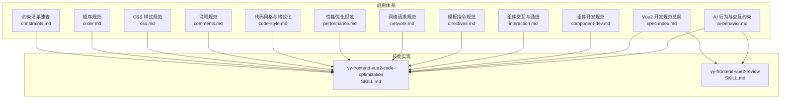
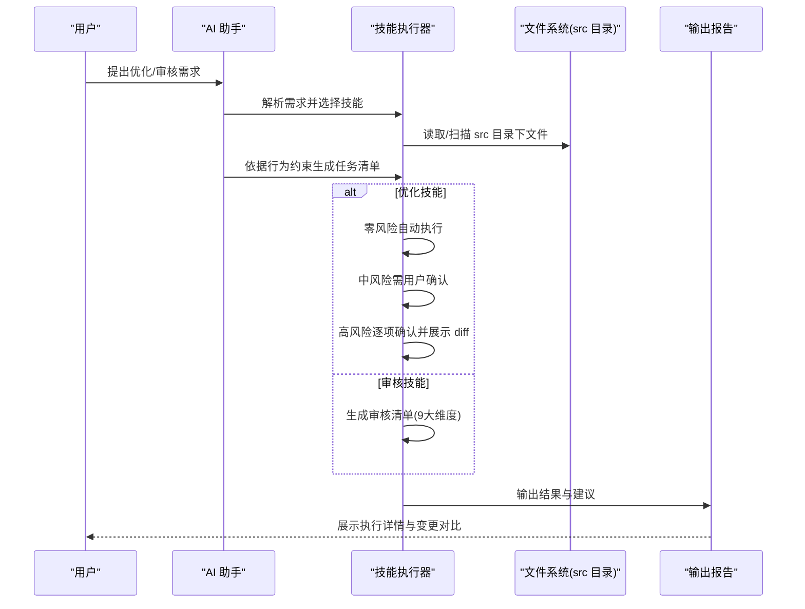
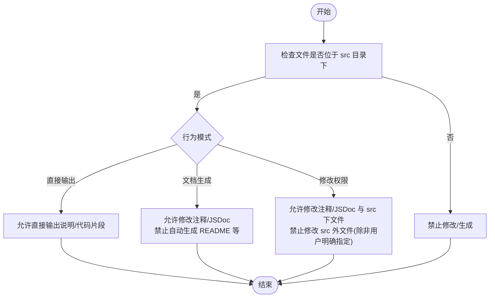
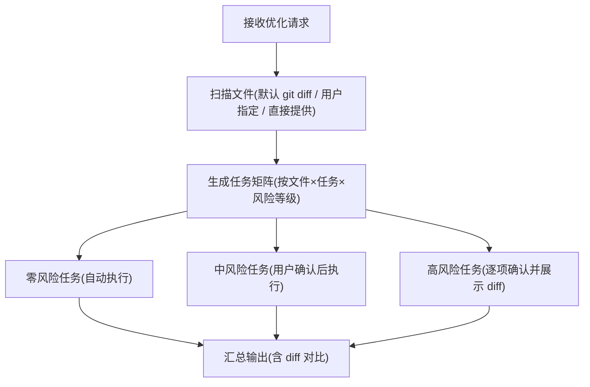
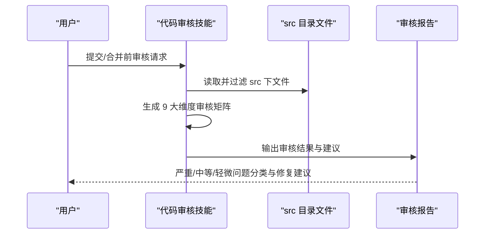
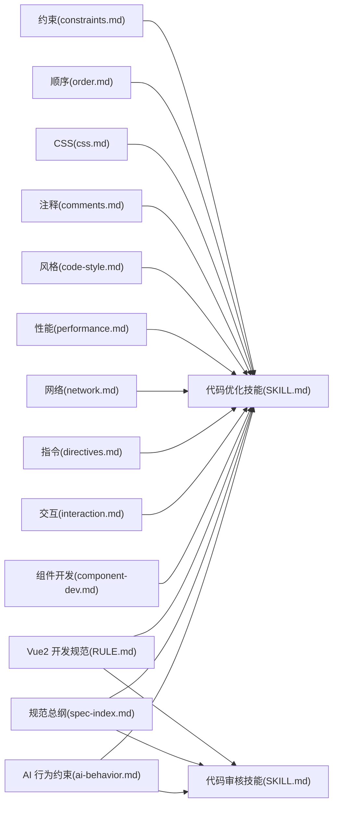

# AI 行为约束

<cite>
**本文引用的文件**
- [ai-behavior.md](file://rules/frontend-rules-vue2/references/ai-behavior.md)
- [RULE.md](file://rules/frontend-rules-vue2/RULE.md)
- [spec-index.md](file://rules/frontend-rules-vue2/references/spec-index.md)
- [yy-frontend-vue2-code-optimization/SKILL.md](file://skills/yy-frontend-vue2-code-optimization/SKILL.md)
- [yy-frontend-vue2-review/SKILL.md](file://skills/yy-frontend-vue2-review/SKILL.md)
- [component-dev.md](file://rules/frontend-rules-vue2/references/component-dev.md)
- [interaction.md](file://rules/frontend-rules-vue2/references/interaction.md)
- [directives.md](file://rules/frontend-rules-vue2/references/directives.md)
- [network.md](file://rules/frontend-rules-vue2/references/network.md)
- [performance.md](file://rules/frontend-rules-vue2/references/performance.md)
- [code-style.md](file://rules/frontend-rules-vue2/references/code-style.md)
- [comments.md](file://rules/frontend-rules-vue2/references/comments.md)
- [css.md](file://rules/frontend-rules-vue2/references/css.md)
- [order.md](file://rules/frontend-rules-vue2/references/order.md)
- [constraints.md](file://rules/frontend-rules-vue2/references/constraints.md)
</cite>

## 目录
1. [简介](#简介)
2. [项目结构](#项目结构)
3. [核心组件](#核心组件)
4. [架构总览](#架构总览)
5. [详细组件分析](#详细组件分析)
6. [依赖分析](#依赖分析)
7. [性能考量](#性能考量)
8. [故障排查指南](#故障排查指南)
9. [结论](#结论)
10. [附录](#附录)

## 简介
本文件系统化阐述 Vue2 项目中 AI 的行为边界与限制，聚焦“修改权限约束”“文档生成规则”“直接输出限制”等关键议题，结合代码优化与代码审核两大技能，给出可落地的执行策略与风险控制机制。同时提供安全与合规建议、人机协作最佳实践，以及违规处置流程，帮助在保证质量与安全的前提下高效利用 AI 辅助开发。

## 项目结构
该仓库围绕 Vue2 前端规范与技能展开，形成“规则体系 + 技能实现”的双轨结构：
- 规则体系：集中于 rules/frontend-rules-vue2，提供 Vue2 开发的总纲、行为约束、组件规范、交互通信、指令规范、网络请求、性能优化、代码风格、注释规范、CSS 规范、顺序规范、约束清单等模块。
- 技能实现：集中于 skills，包含面向 Vue2 的代码优化与代码审核两类技能，分别对应“可执行优化”和“不可修改审核”的两类 AI 行为。

图表来源
- [ai-behavior.md:1-29](file://rules/frontend-rules-vue2/references/ai-behavior.md#L1-L29)
- [spec-index.md:1-61](file://rules/frontend-rules-vue2/references/spec-index.md#L1-L61)
- [component-dev.md:1-92](file://rules/frontend-rules-vue2/references/component-dev.md#L1-L92)
- [interaction.md:1-130](file://rules/frontend-rules-vue2/references/interaction.md#L1-L130)
- [directives.md:1-116](file://rules/frontend-rules-vue2/references/directives.md#L1-L116)
- [network.md:1-180](file://rules/frontend-rules-vue2/references/network.md#L1-L180)
- [performance.md:1-179](file://rules/frontend-rules-vue2/references/performance.md#L1-L179)
- [code-style.md:1-63](file://rules/frontend-rules-vue2/references/code-style.md#L1-L63)
- [comments.md:1-106](file://rules/frontend-rules-vue2/references/comments.md#L1-L106)
- [css.md:1-63](file://rules/frontend-rules-vue2/references/css.md#L1-L63)
- [order.md:1-131](file://rules/frontend-rules-vue2/references/order.md#L1-L131)
- [constraints.md:1-57](file://rules/frontend-rules-vue2/references/constraints.md#L1-L57)
- [yy-frontend-vue2-code-optimization/SKILL.md:1-415](file://skills/yy-frontend-vue2-code-optimization/SKILL.md#L1-L415)
- [yy-frontend-vue2-review/SKILL.md:1-167](file://skills/yy-frontend-vue2-review/SKILL.md#L1-L167)

章节来源
- [RULE.md:1-62](file://rules/frontend-rules-vue2/RULE.md#L1-L62)

## 核心组件
- AI 行为与交互约束：定义 AI 在对话与文件操作中的“红线”与“行为模式”，明确“直接输出”“文档生成”“修改权限”三大维度的边界。
- Vue2 开发规范总纲：对规则模块进行优先级与索引组织，便于检索与落地。
- 代码优化技能（yy-frontend-vue2-code-optimization）：以“零风险/中风险/高风险”三级流水线执行，严格限制修改范围与业务逻辑变更。
- 代码审核技能（yy-frontend-vue2-review）：严格限定在 src 目录内审核，覆盖 9 大审核维度，不修改代码（除非用户明确要求修复）。

章节来源
- [ai-behavior.md:1-29](file://rules/frontend-rules-vue2/references/ai-behavior.md#L1-L29)
- [spec-index.md:58-61](file://rules/frontend-rules-vue2/references/spec-index.md#L58-L61)
- [yy-frontend-vue2-code-optimization/SKILL.md:14-36](file://skills/yy-frontend-vue2-code-optimization/SKILL.md#L14-L36)
- [yy-frontend-vue2-review/SKILL.md:11-17](file://skills/yy-frontend-vue2-review/SKILL.md#L11-L17)

## 架构总览
AI 在 Vue2 项目中的行为约束由“规则—技能—执行”三层构成：
- 规则层：以 ai-behavior.md 为核心，界定“可做什么/不可做什么”，并以 RULE.md 与 spec-index.md 提供索引与导航。
- 技能层：以代码优化与代码审核两类技能为载体，将规则转化为可执行的流程与输出。
- 执行层：通过“自动/确认/逐项确认”的风险分级机制，确保变更可控、可追溯。

图表来源
- [ai-behavior.md:5-29](file://rules/frontend-rules-vue2/references/ai-behavior.md#L5-L29)
- [yy-frontend-vue2-code-optimization/SKILL.md:40-120](file://skills/yy-frontend-vue2-code-optimization/SKILL.md#L40-L120)
- [yy-frontend-vue2-review/SKILL.md:59-96](file://skills/yy-frontend-vue2-review/SKILL.md#L59-L96)

## 详细组件分析

### AI 行为与交互约束（规则层）
- 适用范围：仅限 src 目录下的 .vue/.js/.css/.scss/.less 文件。
- 直接输出：允许在对话中直接输出文字说明、总结或代码片段，无需总是生成文件。
- 文档生成：允许修改代码中的注释和 JSDoc；禁止未经用户明确要求就创建 README、说明文档等。
- 修改权限：允许修改代码中的注释/JSDoc 与 src 目录下的文件；禁止修改 src 目录之外的任何文件（除非用户明确指定）。

图表来源
- [ai-behavior.md:5-29](file://rules/frontend-rules-vue2/references/ai-behavior.md#L5-L29)

章节来源
- [ai-behavior.md:1-29](file://rules/frontend-rules-vue2/references/ai-behavior.md#L1-L29)
- [RULE.md:38-43](file://rules/frontend-rules-vue2/RULE.md#L38-L43)

### 代码优化技能（执行层）
- 适用场景：默认对 git diff 变动文件执行优化；支持用户指定文件/文件夹或直接提供代码内容。
- 不适用场景：生成新组件/功能、修改业务逻辑、生成提交信息、Vue3 项目、非前端代码、TypeScript、JSX/TSX。
- 风险分级与执行规则：
  - 零风险：自动执行（如业务逻辑梳理、注释增强）。
  - 中风险：需用户确认后执行（如代码风格清洗、CSS/BEM 规范、语义化命名）。
  - 高风险：逐项展示 diff → 用户确认 → 执行（如逻辑深度优化、无效代码清理）。
- 输出契约：子代理输出格式与最终汇总输出格式，关键变更提供 diff 对比。

图表来源
- [yy-frontend-vue2-code-optimization/SKILL.md:18-120](file://skills/yy-frontend-vue2-code-optimization/SKILL.md#L18-L120)

章节来源
- [yy-frontend-vue2-code-optimization/SKILL.md:18-120](file://skills/yy-frontend-vue2-code-optimization/SKILL.md#L18-L120)
- [yy-frontend-vue2-code-optimization/SKILL.md:290-320](file://skills/yy-frontend-vue2-code-optimization/SKILL.md#L290-L320)

### 代码审核技能（执行层）
- 核心原则：严格限制在 src 目录内审核，绝不越界；绝不修改代码（仅审核，修复需用户明确要求）。
- 审核维度：代码风格、最佳实践、组件规范、命名、网络请求、computed、逻辑错误、安全、绝对禁止项。
- 严重程度分级：🔴 严重（发现即不通过）、🟡 中等（建议修复）、🟢 轻微（不影响通过）。
- 输出格式：审核清单、通过/不通过结论、问题统计与修复建议。

图表来源
- [yy-frontend-vue2-review/SKILL.md:29-96](file://skills/yy-frontend-vue2-review/SKILL.md#L29-L96)

章节来源
- [yy-frontend-vue2-review/SKILL.md:1-167](file://skills/yy-frontend-vue2-review/SKILL.md#L1-L167)

### 规则模块与最佳实践（规则层）
- 组件开发：Options API 结构、组件命名、脚本区 JSDoc、模板层轻量化、方法职责与页面拆分。
- 组件交互与通信：Props 定义与只读约束、Emit 事件白名单、$refs/$parent/$children 禁用、provide/inject 使用边界。
- 模板指令：v-for/key、v-if 与 v-for 冲突、v-html 安全（DOMPurify）、指令简写、属性顺序。
- 网络请求：async/await、统一响应解构、错误处理、等于运算符偏好、防重复提交、v-html 安全与敏感数据处理。
- 性能优化：组件懒加载、KeepAlive、虚拟滚动、防抖节流、图片优化、模板层轻量化、响应式陷阱（$set/splice）。
- 代码风格与注释：Prettier 配置、函数写法偏好、模板/脚本/样式注释格式与保护原则。
- CSS 规范：BEM 命名、scoped 优先、全局样式标注、兼容性降级方案。
- 顺序规范：SFC 块顺序、Import 分组与排序、Options API 内部结构顺序。
- 约束清单：绝对禁止项（连续解构、父改子、修改 data 原始类型、修改 props、mixins、无意义命名等）、推荐项、不推荐项、注意事项与 Vue2 响应式陷阱。

章节来源
- [component-dev.md:1-92](file://rules/frontend-rules-vue2/references/component-dev.md#L1-L92)
- [interaction.md:1-130](file://rules/frontend-rules-vue2/references/interaction.md#L1-L130)
- [directives.md:1-116](file://rules/frontend-rules-vue2/references/directives.md#L1-L116)
- [network.md:1-180](file://rules/frontend-rules-vue2/references/network.md#L1-L180)
- [performance.md:1-179](file://rules/frontend-rules-vue2/references/performance.md#L1-L179)
- [code-style.md:1-63](file://rules/frontend-rules-vue2/references/code-style.md#L1-L63)
- [comments.md:1-106](file://rules/frontend-rules-vue2/references/comments.md#L1-L106)
- [css.md:1-63](file://rules/frontend-rules-vue2/references/css.md#L1-L63)
- [order.md:1-131](file://rules/frontend-rules-vue2/references/order.md#L1-L131)
- [constraints.md:1-57](file://rules/frontend-rules-vue2/references/constraints.md#L1-L57)

## 依赖分析
- 规则与技能的耦合关系：
  - ai-behavior.md 为两类技能的共同约束基线，决定“可做什么/不可做什么”。
  - spec-index.md 与 RULE.md 提供规则导航与优先级，指导技能在执行时如何取舍。
  - 各专项规则（component-dev、interaction、directives、network、performance、code-style、comments、css、order、constraints）为技能执行提供具体判据。
- 技能之间的协作：
  - 代码优化技能以“风险分级”驱动执行，避免高风险变更未经人工确认。
  - 代码审核技能以“维度化检查”保障质量，不越界修改，必要时提出修复建议。

图表来源
- [ai-behavior.md:1-29](file://rules/frontend-rules-vue2/references/ai-behavior.md#L1-L29)
- [spec-index.md:1-61](file://rules/frontend-rules-vue2/references/spec-index.md#L1-L61)
- [RULE.md:1-62](file://rules/frontend-rules-vue2/RULE.md#L1-L62)
- [yy-frontend-vue2-code-optimization/SKILL.md:1-415](file://skills/yy-frontend-vue2-code-optimization/SKILL.md#L1-L415)
- [yy-frontend-vue2-review/SKILL.md:1-167](file://skills/yy-frontend-vue2-review/SKILL.md#L1-L167)

章节来源
- [RULE.md:14-42](file://rules/frontend-rules-vue2/RULE.md#L14-L42)

## 性能考量
- 风险控制优先：通过“零风险自动执行、中风险用户确认、高风险逐项确认”的三级机制，降低大规模变更带来的性能与稳定性风险。
- 变更可视化：关键变更提供 diff 对比，便于快速评估影响面与回滚成本。
- 规则驱动的性能优化：在组件开发、网络请求、性能优化、顺序规范、约束清单等模块中，明确性能优化路径与响应式陷阱规避方法，减少潜在性能退化。

章节来源
- [yy-frontend-vue2-code-optimization/SKILL.md:40-120](file://skills/yy-frontend-vue2-code-optimization/SKILL.md#L40-L120)
- [performance.md:1-179](file://rules/frontend-rules-vue2/references/performance.md#L1-L179)
- [constraints.md:48-57](file://rules/frontend-rules-vue2/references/constraints.md#L48-L57)

## 故障排查指南
- 常见违规场景与处理
  - 越界修改：在 src 目录之外创建/修改文件。处理：严格拒绝，提示用户将需求纳入 src 范畴或明确授权。
  - 自动生成文档：在未明确要求的情况下生成 README/说明文档。处理：仅允许修改现有注释/JSDoc，禁止自动生成。
  - 高风险变更：涉及业务逻辑优化/无效代码清理。处理：逐项展示 diff → 用户确认 → 执行。
  - 审核不通过：存在严重/中等问题。处理：输出问题统计与修复建议，直至问题解决。
- 安全与合规
  - v-html 必须使用 DOMPurify 过滤，避免 XSS。
  - 禁止在生命周期中直接触发业务逻辑，避免耦合与副作用。
  - 禁止父组件直接修改子组件内部状态，确保单向数据流。
  - 禁止连续解构与无意义命名，提升可读性与可维护性。
- 回滚与审计
  - 建议在执行高风险任务前提交当前状态，以便随时回滚。
  - 保留变更对比与执行日志，便于审计与复盘。

章节来源
- [ai-behavior.md:16-29](file://rules/frontend-rules-vue2/references/ai-behavior.md#L16-L29)
- [yy-frontend-vue2-review/SKILL.md:82-96](file://skills/yy-frontend-vue2-review/SKILL.md#L82-L96)
- [network.md:176-180](file://rules/frontend-rules-vue2/references/network.md#L176-L180)
- [interaction.md:37-41](file://rules/frontend-rules-vue2/references/interaction.md#L37-L41)
- [constraints.md:1-57](file://rules/frontend-rules-vue2/references/constraints.md#L1-L57)

## 结论
通过“规则—技能—执行”的闭环设计，Vue2 项目中的 AI 行为约束实现了“可执行、可监督、可回溯”。AI 在对话中可直接输出说明与代码片段，在 src 目录内可修改注释与代码，但严禁越界与自动生成文档。代码优化与审核两类技能分别承担“可优化的变更”和“不可修改的审核”，以风险分级与可视化对比确保变更可控、质量可保。遵循上述约束与最佳实践，可在保障安全与合规的前提下，最大化发挥 AI 的辅助价值。

## 附录
- 快速导航（规则模块）
  - 组件开发、组件交互与通信、模板指令、网络请求、性能优化、代码风格、注释规范、CSS 规范、顺序规范、约束清单。
- 风险分级速览
  - 零风险：自动执行（业务逻辑梳理、注释增强）。
  - 中风险：需用户确认（代码风格清洗、CSS/BEM 规范、语义化命名）。
  - 高风险：逐项确认（逻辑深度优化、无效代码清理）。

章节来源
- [RULE.md:45-62](file://rules/frontend-rules-vue2/RULE.md#L45-L62)
- [yy-frontend-vue2-code-optimization/SKILL.md:40-120](file://skills/yy-frontend-vue2-code-optimization/SKILL.md#L40-L120)