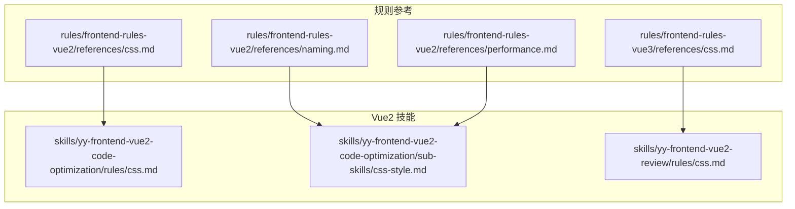
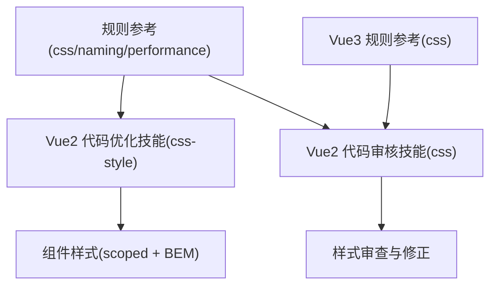
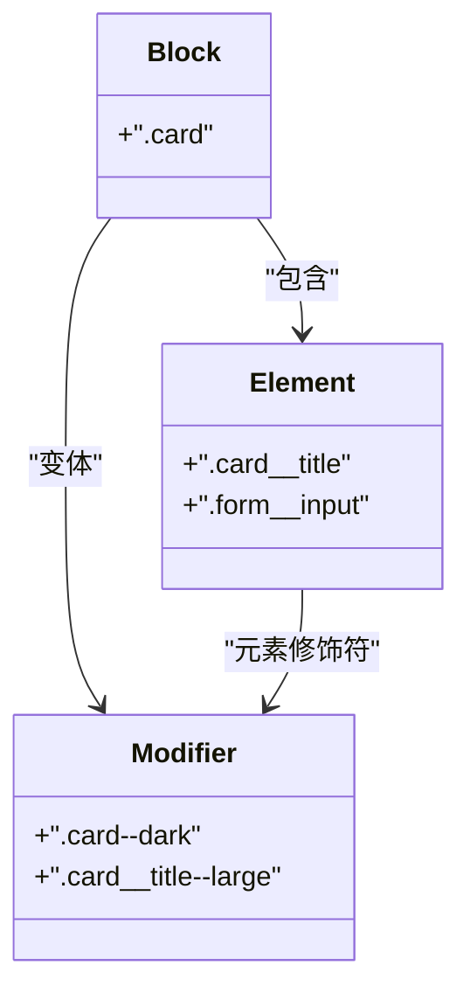
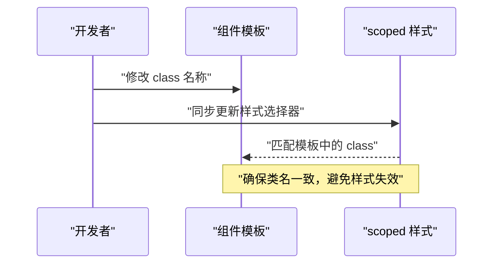
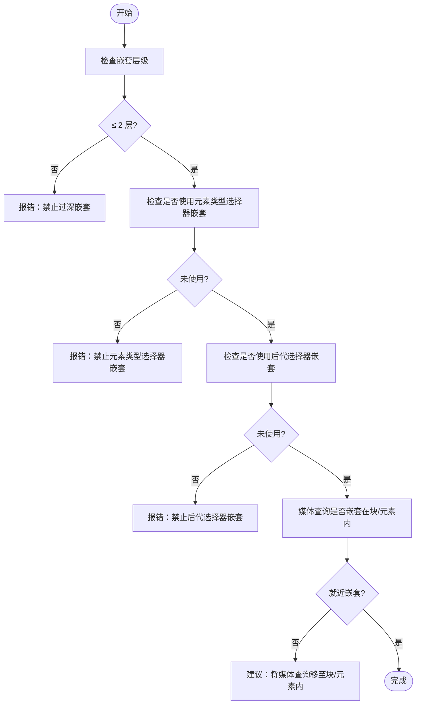
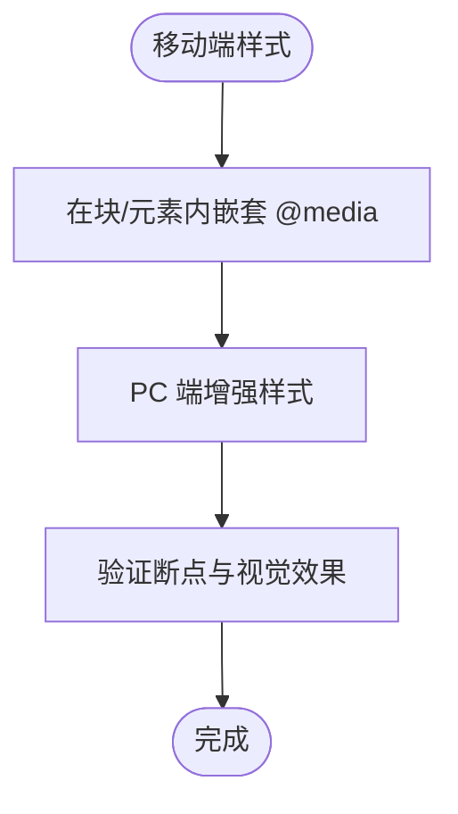
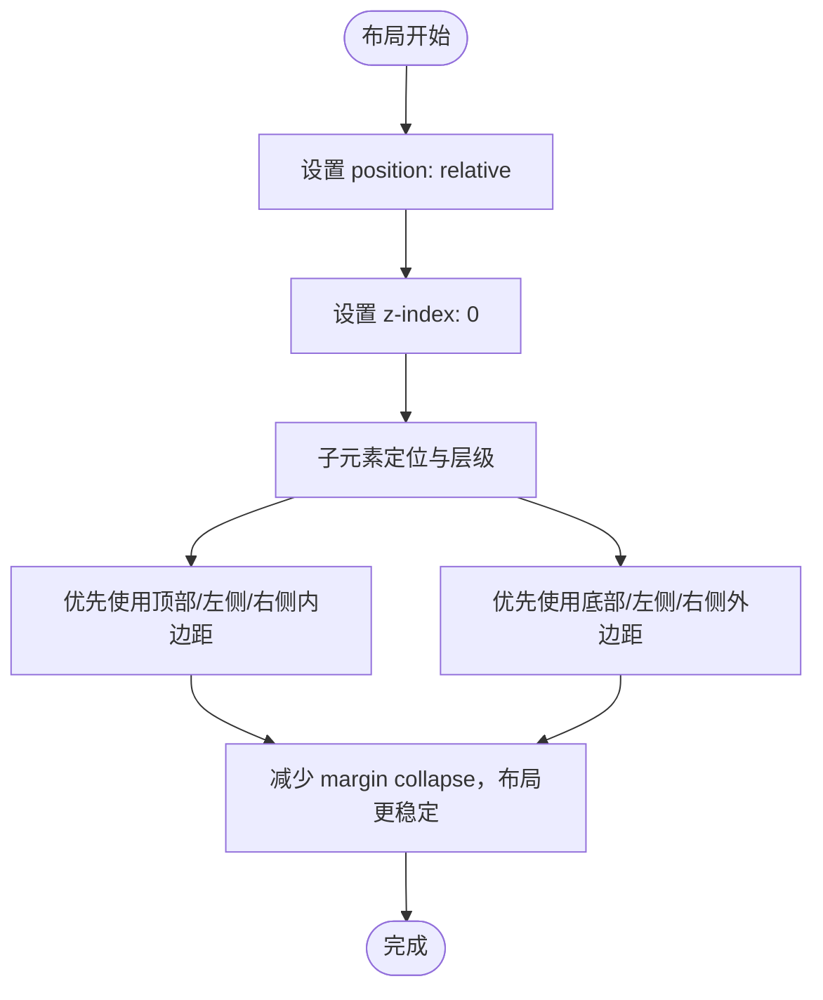
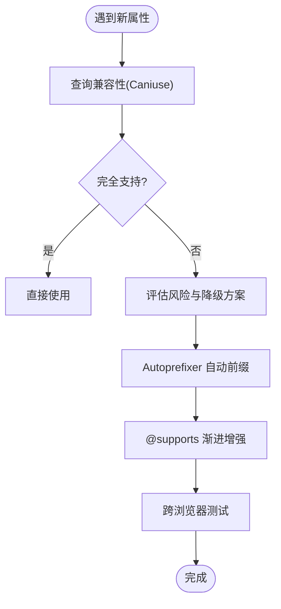
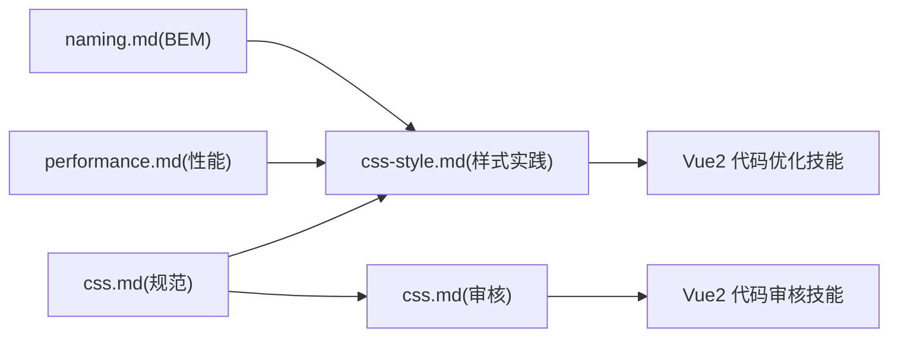

# CSS 样式规范

<cite>
**本文引用的文件**
- [rules/frontend-rules-vue2/references/css.md](file://rules/frontend-rules-vue2/references/css.md)
- [rules/frontend-rules-vue2/references/naming.md](file://rules/frontend-rules-vue2/references/naming.md)
- [rules/frontend-rules-vue2/references/performance.md](file://rules/frontend-rules-vue2/references/performance.md)
- [skills/yy-frontend-vue2-code-optimization/rules/css.md](file://skills/yy-frontend-vue2-code-optimization/rules/css.md)
- [skills/yy-frontend-vue2-code-optimization/sub-skills/css-style.md](file://skills/yy-frontend-vue2-code-optimization/sub-skills/css-style.md)
- [skills/yy-frontend-vue2-review/rules/css.md](file://skills/yy-frontend-vue2-review/rules/css.md)
- [rules/frontend-rules-vue3/references/css.md](file://rules/frontend-rules-vue3/references/css.md)
</cite>

## 目录
1. [简介](#简介)
2. [项目结构](#项目结构)
3. [核心组件](#核心组件)
4. [架构总览](#架构总览)
5. [详细组件分析](#详细组件分析)
6. [依赖分析](#依赖分析)
7. [性能考量](#性能考量)
8. [故障排查指南](#故障排查指南)
9. [结论](#结论)
10. [附录](#附录)

## 简介
本文件面向 Vue2 项目的 CSS 样式规范，系统阐述 BEM 命名约定、scoped 样式优先使用、全局样式的标注与管理、样式组织与复用策略、样式冲突避免方法，以及响应式设计、主题定制、样式性能优化的指导原则。内容来源于仓库中 Vue2 前端规则与技能文档，确保与现有工程实践一致。

## 项目结构
本仓库以“规则 + 技能”的方式组织前端开发规范，其中与 CSS 样式直接相关的内容主要分布在：
- Vue2 规则参考：rules/frontend-rules-vue2/references/css.md、naming.md、performance.md
- Vue2 代码优化技能：skills/yy-frontend-vue2-code-optimization/rules/css.md、sub-skills/css-style.md
- Vue2 代码审核技能：skills/yy-frontend-vue2-review/rules/css.md
- Vue3 规则参考（用于对比与一致性）：rules/frontend-rules-vue3/references/css.md

图表来源
- [rules/frontend-rules-vue2/references/css.md:1-63](file://rules/frontend-rules-vue2/references/css.md#L1-L63)
- [rules/frontend-rules-vue2/references/naming.md:53-73](file://rules/frontend-rules-vue2/references/naming.md#L53-L73)
- [rules/frontend-rules-vue2/references/performance.md:1-179](file://rules/frontend-rules-vue2/references/performance.md#L1-L179)
- [rules/frontend-rules-vue3/references/css.md:1-67](file://rules/frontend-rules-vue3/references/css.md#L1-L67)
- [skills/yy-frontend-vue2-code-optimization/rules/css.md:1-68](file://skills/yy-frontend-vue2-code-optimization/rules/css.md#L1-L68)
- [skills/yy-frontend-vue2-code-optimization/sub-skills/css-style.md:1-323](file://skills/yy-frontend-vue2-code-optimization/sub-skills/css-style.md#L1-L323)
- [skills/yy-frontend-vue2-review/rules/css.md:1-63](file://skills/yy-frontend-vue2-review/rules/css.md#L1-L63)

章节来源
- [rules/frontend-rules-vue2/references/css.md:1-63](file://rules/frontend-rules-vue2/references/css.md#L1-L63)
- [skills/yy-frontend-vue2-code-optimization/rules/css.md:1-68](file://skills/yy-frontend-vue2-code-optimization/rules/css.md#L1-L68)
- [skills/yy-frontend-vue2-review/rules/css.md:1-63](file://skills/yy-frontend-vue2-review/rules/css.md#L1-L63)
- [rules/frontend-rules-vue3/references/css.md:1-67](file://rules/frontend-rules-vue3/references/css.md#L1-L67)

## 核心组件
- 预处理器与格式化：Sass/SCSS、Less；格式化工具链为 csscomb + prettier；全局样式存放于 src/styles/
- 作用域与全局样式：优先使用 scoped；非 scoped 必须标注“/* 全局 */”
- 响应式适配：使用 @media；移动端优先，再增强 PC 端
- BEM 命名：块/元素/修饰符，全小写、短横线连接、语义清晰、类名唯一
- 布局推荐：相对定位 + z-index:0 创建定位上下文；外边距与内边距优先使用底部/左侧/右侧，避免顶部/底部
- 兼容性指南：常见属性的兼容性风险与降级方案；使用 Autoprefixer + PostCSS 自动前缀；渐进增强使用 @supports

章节来源
- [rules/frontend-rules-vue2/references/css.md:3-63](file://rules/frontend-rules-vue2/references/css.md#L3-L63)
- [skills/yy-frontend-vue2-code-optimization/rules/css.md:3-68](file://skills/yy-frontend-vue2-code-optimization/rules/css.md#L3-L68)
- [skills/yy-frontend-vue2-review/rules/css.md:1-63](file://skills/yy-frontend-vue2-review/rules/css.md#L1-L63)
- [rules/frontend-rules-vue3/references/css.md:1-67](file://rules/frontend-rules-vue3/references/css.md#L1-L67)

## 架构总览
CSS 规范在工程中的落地路径如下：
- 规则参考文件定义总体规范与约束
- Vue2 代码优化技能将规范转化为可执行的样式结构与 BEM 实践
- Vue2 代码审核技能用于检查样式是否符合规范
- Vue3 规则参考用于横向对比，确保一致性

图表来源
- [rules/frontend-rules-vue2/references/css.md:1-63](file://rules/frontend-rules-vue2/references/css.md#L1-L63)
- [rules/frontend-rules-vue2/references/naming.md:53-73](file://rules/frontend-rules-vue2/references/naming.md#L53-L73)
- [rules/frontend-rules-vue2/references/performance.md:1-179](file://rules/frontend-rules-vue2/references/performance.md#L1-L179)
- [skills/yy-frontend-vue2-code-optimization/sub-skills/css-style.md:1-323](file://skills/yy-frontend-vue2-code-optimization/sub-skills/css-style.md#L1-L323)
- [skills/yy-frontend-vue2-review/rules/css.md:1-63](file://skills/yy-frontend-vue2-review/rules/css.md#L1-L63)
- [rules/frontend-rules-vue3/references/css.md:1-67](file://rules/frontend-rules-vue3/references/css.md#L1-L67)

## 详细组件分析

### BEM 命名约定
- 块（Block）：独立模块，如 .card、.form
- 元素（Element）：块内部子元素，如 .card__title、.form__input
- 修饰符（Modifier）：状态/样式变体，如 .card--dark、.card__title--large
- 命名规则：全小写、__ 连接元素、-- 连接修饰符、类名唯一且不冲突
- 在 Vue2 中，建议在 <style scoped> 中配合 SCSS/LESS 的 & 语法进行嵌套书写，保持层级不超过 2 层

图表来源
- [rules/frontend-rules-vue2/references/naming.md:53-73](file://rules/frontend-rules-vue2/references/naming.md#L53-L73)
- [skills/yy-frontend-vue2-code-optimization/sub-skills/css-style.md:13-18](file://skills/yy-frontend-vue2-code-optimization/sub-skills/css-style.md#L13-L18)

章节来源
- [rules/frontend-rules-vue2/references/naming.md:53-73](file://rules/frontend-rules-vue2/references/naming.md#L53-L73)
- [skills/yy-frontend-vue2-code-optimization/sub-skills/css-style.md:13-18](file://skills/yy-frontend-vue2-code-optimization/sub-skills/css-style.md#L13-L18)

### scoped 样式优先与全局样式标注
- 优先使用 <style scoped>，确保样式仅作用于当前组件
- 非 scoped 样式需在顶部标注 “/* 全局 */”，明确作用域
- 在 Vue2 中，模板与 scoped 样式中的类名必须保持同步，修改样式类名时同步更新模板 class 属性

图表来源
- [skills/yy-frontend-vue2-code-optimization/sub-skills/css-style.md:128-170](file://skills/yy-frontend-vue2-code-optimization/sub-skills/css-style.md#L128-L170)

章节来源
- [rules/frontend-rules-vue2/references/css.md:19-23](file://rules/frontend-rules-vue2/references/css.md#L19-L23)
- [skills/yy-frontend-vue2-code-optimization/sub-skills/css-style.md:122-126](file://skills/yy-frontend-vue2-code-optimization/sub-skills/css-style.md#L122-L126)
- [skills/yy-frontend-vue2-code-optimization/sub-skills/css-style.md:128-130](file://skills/yy-frontend-vue2-code-optimization/sub-skills/css-style.md#L128-L130)

### 样式组织与复用策略
- 嵌套层级控制：块 → 元素 → 修饰符，最多两层嵌套
- 媒体查询可嵌套在对应块/元素内部，便于就近维护
- 禁止场景：
  - 嵌套层级超过 2 层
  - 使用元素类型选择器嵌套（降低特异性）
  - 使用后代选择器嵌套（降低性能）
- 推荐结构：修饰符与块/元素同级或使用 & 引用；媒体查询就近放置

图表来源
- [skills/yy-frontend-vue2-code-optimization/sub-skills/css-style.md:86-120](file://skills/yy-frontend-vue2-code-optimization/sub-skills/css-style.md#L86-L120)

章节来源
- [skills/yy-frontend-vue2-code-optimization/sub-skills/css-style.md:86-120](file://skills/yy-frontend-vue2-code-optimization/sub-skills/css-style.md#L86-L120)

### 响应式设计与移动端优先
- 使用 @media 适配不同屏幕
- 移动端优先：先写移动端样式，再通过媒体查询增强 PC 端
- 在 Vue2 scoped 样式中，可在块/元素内部就近嵌套媒体查询，提升可维护性

图表来源
- [skills/yy-frontend-vue2-code-optimization/sub-skills/css-style.md:172-187](file://skills/yy-frontend-vue2-code-optimization/sub-skills/css-style.md#L172-L187)
- [rules/frontend-rules-vue2/references/css.md:25-28](file://rules/frontend-rules-vue2/references/css.md#L25-L28)

章节来源
- [skills/yy-frontend-vue2-code-optimization/sub-skills/css-style.md:172-187](file://skills/yy-frontend-vue2-code-optimization/sub-skills/css-style.md#L172-L187)
- [rules/frontend-rules-vue2/references/css.md:25-28](file://rules/frontend-rules-vue2/references/css.md#L25-L28)

### 布局推荐与定位层级
- 使用 position: relative 搭配 z-index: 0 创建定位上下文，避免子元素 z-index 影响外部元素
- 外边距与内边距方向：优先使用 padding-top/padding-left/padding-right，避免 padding-bottom；优先使用 margin-bottom/margin-left/margin-right，避免 margin-top
- 原因：向下布局更稳定，减少相邻元素的间距叠加问题（margin collapse）

图表来源
- [rules/frontend-rules-vue2/references/css.md:31-40](file://rules/frontend-rules-vue2/references/css.md#L31-L40)
- [skills/yy-frontend-vue2-code-optimization/sub-skills/css-style.md:195-229](file://skills/yy-frontend-vue2-code-optimization/sub-skills/css-style.md#L195-L229)

章节来源
- [rules/frontend-rules-vue2/references/css.md:31-40](file://rules/frontend-rules-vue2/references/css.md#L31-L40)
- [skills/yy-frontend-vue2-code-optimization/sub-skills/css-style.md:195-229](file://skills/yy-frontend-vue2-code-optimization/sub-skills/css-style.md#L195-L229)

### 兼容性指南与降级方案
- 常见兼容性属性与降级方案：
  - gap：Safari 14.4 及以下、IE11 不支持 → 使用 margin 负边距
  - aspect-ratio：iOS 15.6 及以下 Safari 支持不全 → 使用 padding-bottom 百分比 Hack
  - 100vh：iOS Safari 地址栏导致高度偏差 → JS 动态计算或使用 dvh 单位
  - inset：旧浏览器不识别 → 先写 top/right/bottom/left 再覆盖
  - will-change：动画结束不重置会占用内存 → 动画结束后设为 auto
  - content-visibility：仅 Chromium 支持 → 仅作性能增强，不影响核心布局
  - subgrid：浏览器支持不完善 → 传统 Grid/Flex 降级
- 兼容性开发实践：
  - 使用 Autoprefixer + PostCSS 自动补齐 -webkit-、-ms- 前缀
  - 使用 @supports 包裹新属性，不支持浏览器自动忽略

图表来源
- [rules/frontend-rules-vue2/references/css.md:42-63](file://rules/frontend-rules-vue2/references/css.md#L42-L63)
- [skills/yy-frontend-vue2-code-optimization/rules/css.md:47-68](file://skills/yy-frontend-vue2-code-optimization/rules/css.md#L47-L68)
- [rules/frontend-rules-vue3/references/css.md:46-67](file://rules/frontend-rules-vue3/references/css.md#L46-L67)

章节来源
- [rules/frontend-rules-vue2/references/css.md:42-63](file://rules/frontend-rules-vue2/references/css.md#L42-L63)
- [skills/yy-frontend-vue2-code-optimization/rules/css.md:47-68](file://skills/yy-frontend-vue2-code-optimization/rules/css.md#L47-L68)
- [rules/frontend-rules-vue3/references/css.md:46-67](file://rules/frontend-rules-vue3/references/css.md#L46-L67)

### 主题定制与样式复用
- 主题定制：建议通过 CSS 变量与预处理器变量结合的方式集中管理颜色、字号、间距等主题参数，避免硬编码
- 样式复用：优先使用 BEM 结构与修饰符，减少重复样式；通过 SCSS/LESS 的 mixin、变量与嵌套组织公共样式
- 作用域管理：优先使用 scoped，必要时通过全局样式标注“/* 全局 */”明确作用域边界

章节来源
- [rules/frontend-rules-vue2/references/css.md:3-7](file://rules/frontend-rules-vue2/references/css.md#L3-L7)
- [skills/yy-frontend-vue2-code-optimization/sub-skills/css-style.md:122-126](file://skills/yy-frontend-vue2-code-optimization/sub-skills/css-style.md#L122-L126)

## 依赖分析
- 规则参考与技能之间的依赖关系：
  - naming.md 为 css-style.md 的命名基础
  - performance.md 为 css-style.md 的性能实践基础
  - css.md 为 vue2 代码优化与审核技能的共同依据

图表来源
- [rules/frontend-rules-vue2/references/naming.md:53-73](file://rules/frontend-rules-vue2/references/naming.md#L53-L73)
- [rules/frontend-rules-vue2/references/performance.md:1-179](file://rules/frontend-rules-vue2/references/performance.md#L1-L179)
- [skills/yy-frontend-vue2-code-optimization/sub-skills/css-style.md:1-323](file://skills/yy-frontend-vue2-code-optimization/sub-skills/css-style.md#L1-L323)
- [skills/yy-frontend-vue2-review/rules/css.md:1-63](file://skills/yy-frontend-vue2-review/rules/css.md#L1-L63)

章节来源
- [rules/frontend-rules-vue2/references/naming.md:53-73](file://rules/frontend-rules-vue2/references/naming.md#L53-L73)
- [rules/frontend-rules-vue2/references/performance.md:1-179](file://rules/frontend-rules-vue2/references/performance.md#L1-L179)
- [skills/yy-frontend-vue2-code-optimization/sub-skills/css-style.md:1-323](file://skills/yy-frontend-vue2-code-optimization/sub-skills/css-style.md#L1-L323)
- [skills/yy-frontend-vue2-review/rules/css.md:1-63](file://skills/yy-frontend-vue2-review/rules/css.md#L1-L63)

## 性能考量
- 选择器复杂度：避免深层嵌套与后代选择器，减少样式计算成本
- 媒体查询：就近嵌套在块/元素内部，减少全局样式扫描
- 兼容性降级：使用 @supports 渐进增强，避免在不支持的浏览器中引入昂贵特性
- 响应式性能：移动端优先，减少不必要的重排与重绘

章节来源
- [skills/yy-frontend-vue2-code-optimization/sub-skills/css-style.md:86-120](file://skills/yy-frontend-vue2-code-optimization/sub-skills/css-style.md#L86-L120)
- [rules/frontend-rules-vue2/references/css.md:42-63](file://rules/frontend-rules-vue2/references/css.md#L42-L63)

## 故障排查指南
- 类名不匹配：若 scoped 样式类名修改后模板未同步，会导致样式不生效。请检查模板 class 与样式选择器是否一致
- 嵌套层级过深：若出现 > 2 层嵌套，应拆分为独立类或调整结构
- 元素类型选择器嵌套：将 img/span 等元素类型选择器替换为语义化类名
- 后代选择器嵌套：将 ul/li 等后代选择器扁平化为独立类，提升性能与可维护性
- 兼容性问题：遇到 gap/aspect-ratio/100vh/inset 等属性，按降级方案处理；使用 Autoprefixer 与 @supports 提升兼容性

章节来源
- [skills/yy-frontend-vue2-code-optimization/sub-skills/css-style.md:86-120](file://skills/yy-frontend-vue2-code-optimization/sub-skills/css-style.md#L86-L120)
- [rules/frontend-rules-vue2/references/css.md:42-63](file://rules/frontend-rules-vue2/references/css.md#L42-L63)

## 结论
本规范以 Vue2 项目为背景，围绕 BEM 命名、scoped 样式优先、全局样式标注与管理、样式组织与复用、响应式与兼容性等方面提供了系统化的指导。通过规则参考与技能实践的协同，能够有效提升样式的一致性、可维护性与性能表现。

## 附录
- 相关文件路径与要点：
  - 规则参考：css.md、naming.md、performance.md
  - Vue2 技能：css.md（优化）、css-style.md（样式实践）
  - Vue3 规则：css.md（对比参考）

章节来源
- [rules/frontend-rules-vue2/references/css.md:1-63](file://rules/frontend-rules-vue2/references/css.md#L1-L63)
- [rules/frontend-rules-vue2/references/naming.md:53-73](file://rules/frontend-rules-vue2/references/naming.md#L53-L73)
- [rules/frontend-rules-vue2/references/performance.md:1-179](file://rules/frontend-rules-vue2/references/performance.md#L1-L179)
- [skills/yy-frontend-vue2-code-optimization/rules/css.md:1-68](file://skills/yy-frontend-vue2-code-optimization/rules/css.md#L1-L68)
- [skills/yy-frontend-vue2-code-optimization/sub-skills/css-style.md:1-323](file://skills/yy-frontend-vue2-code-optimization/sub-skills/css-style.md#L1-L323)
- [skills/yy-frontend-vue2-review/rules/css.md:1-63](file://skills/yy-frontend-vue2-review/rules/css.md#L1-L63)
- [rules/frontend-rules-vue3/references/css.md:1-67](file://rules/frontend-rules-vue3/references/css.md#L1-L67)