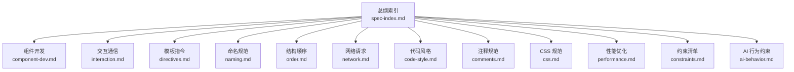
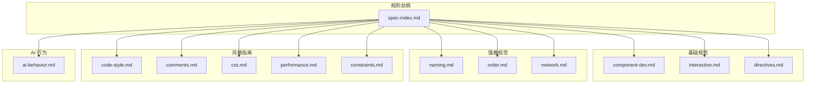
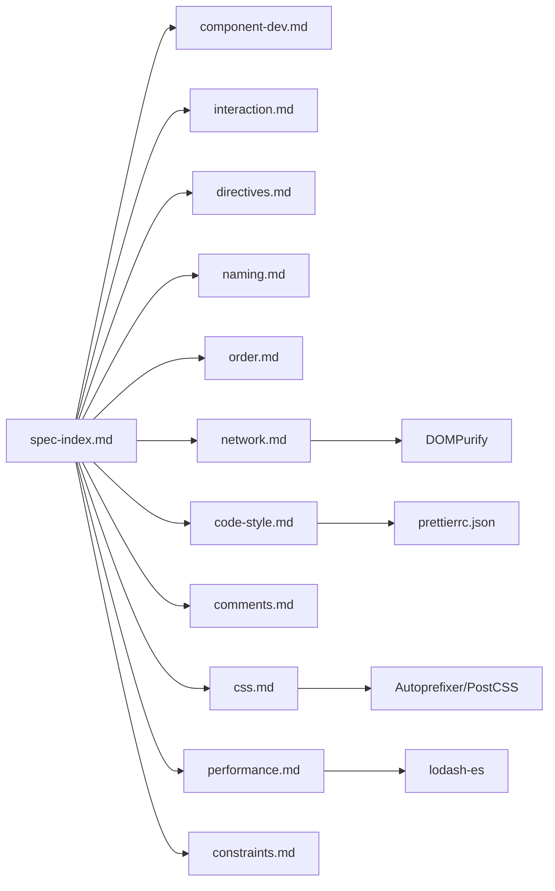

# Vue2 开发规则

<cite>
**本文引用的文件**
- [RULE.md](file://rules/frontend-rules-vue2/RULE.md)
- [rule-prompts-simple.md](file://rules/frontend-rules-vue2/prompts/rule-prompts-simple.md)
- [.prettierrc.json](file://rules/frontend-rules-vue2/assets/.prettierrc.json)
- [ai-behavior.md](file://rules/frontend-rules-vue2/references/ai-behavior.md)
- [code-style.md](file://rules/frontend-rules-vue2/references/code-style.md)
- [component-dev.md](file://rules/frontend-rules-vue2/references/component-dev.md)
- [interaction.md](file://rules/frontend-rules-vue2/references/interaction.md)
- [directives.md](file://rules/frontend-rules-vue2/references/directives.md)
- [naming.md](file://rules/frontend-rules-vue2/references/naming.md)
- [order.md](file://rules/frontend-rules-vue2/references/order.md)
- [network.md](file://rules/frontend-rules-vue2/references/network.md)
- [comments.md](file://rules/frontend-rules-vue2/references/comments.md)
- [css.md](file://rules/frontend-rules-vue2/references/css.md)
- [performance.md](file://rules/frontend-rules-vue2/references/performance.md)
- [constraints.md](file://rules/frontend-rules-vue2/references/constraints.md)
</cite>

## 目录
1. [简介](#简介)
2. [项目结构](#项目结构)
3. [核心组件](#核心组件)
4. [架构总览](#架构总览)
5. [详细组件分析](#详细组件分析)
6. [依赖分析](#依赖分析)
7. [性能考虑](#性能考虑)
8. [故障排查指南](#故障排查指南)
9. [结论](#结论)
10. [附录](#附录)

## 简介
本文件系统化梳理 Vue2 前端开发规则，面向使用 Options API 的单文件组件（SFC）项目，提供从组件开发、交互通信、模板指令、命名与结构顺序、代码风格、注释、CSS、网络请求到性能优化与约束清单的完整规范。同时给出与 Vue3 规则的差异对比与迁移策略建议，帮助团队建立统一的开发标准与最佳实践。

## 项目结构
Vue2 规则体系采用“总纲 + 子模块”的组织方式，便于按需引用与维护：
- 总纲索引：集中列出所有模块与快速导航
- 子模块：按领域划分（组件开发、交互通信、模板指令、命名、结构顺序、网络请求、代码风格、注释、CSS、性能、约束清单、AI 行为约束）
- 提示词：提供简化版规则提示词，便于在工具链中执行与校验

图表来源
- [RULE.md:10-62](file://rules/frontend-rules-vue2/RULE.md#L10-L62)

章节来源
- [RULE.md:1-62](file://rules/frontend-rules-vue2/RULE.md#L1-L62)

## 核心组件
本节概述各规则模块的核心目标与适用范围，帮助快速定位与查阅：

- 组件开发（Options API 风格）：Options API 结构顺序、组件命名、模板属性顺序、v-slot 风格、模板层轻量化、方法职责、页面拆分建议
- 交互通信（Props/Emit/$refs/provide/inject）：Props 定义、Emit 事件白名单、对外暴露、provide/inject 使用边界、禁用 $parent/$children
- 模板指令（v-for/key/v-if/v-html/属性顺序）：v-for 与 key、v-if 与 v-for 冲突、v-html 安全、指令简写、模板属性顺序
- 命名规范：文件/组件/API/事件/常量/布尔值/BEM 命名
- 结构顺序：SFC 块顺序、3 组 import 分组、Options API 内部结构顺序
- 代码风格：Prettier 配置、函数写法偏好（箭头函数优先）
- 注释规范：模板/脚本/样式注释格式、注释保护原则
- CSS 规范：预处理器、scoped 优先、BEM 命名、布局推荐、兼容性指南
- 网络请求规范：async/await、响应解构、错误处理、防重复提交、安全约束
- 性能优化：懒加载、KeepAlive、虚拟滚动、防抖节流、图片优化、模板层轻量化、响应式性能、指令清理、路由守卫清理、过滤器
- 约束清单：绝对禁止、推荐、不推荐、注意事项与 Vue2 响应式陷阱
- AI 行为约束：目录边界、文档生成、修改权限

章节来源
- [RULE.md:18-62](file://rules/frontend-rules-vue2/RULE.md#L18-L62)

## 架构总览
下图展示 Vue2 规则体系的模块关系与依赖，体现“总纲索引”对各子模块的统一指引作用。

图表来源
- [RULE.md:10-62](file://rules/frontend-rules-vue2/RULE.md#L10-L62)

## 详细组件分析

### 组件开发规范（Options API）
- Options API 要求：必须使用 Options API，组件必须声明 name
- 脚本结构顺序：name → components → props → data() → computed → watch → methods → 生命周期钩子
- SFC 块顺序：template → script → style scoped
- 模板属性顺序：is → v-for → v-if/v-else-if/v-else → v-show/v-cloak → id → props/attrs → v-on → v-html/v-text
- v-slot 风格：使用动态风格，禁止静态默认插槽写法
- 模板层轻量化：模板只负责展示，避免复杂表达式与昂贵计算
- 方法职责：init → 网络请求 → 事件处理 → 特殊计算；超过 50 行必须拆分；不要过度封装
- 页面拆分建议：页面组件超过 300 行建议拆分；按功能区块拆分

章节来源
- [component-dev.md:1-92](file://rules/frontend-rules-vue2/references/component-dev.md#L1-L92)
- [order.md:15-100](file://rules/frontend-rules-vue2/references/order.md#L15-L100)
- [directives.md:85-102](file://rules/frontend-rules-vue2/references/directives.md#L85-L102)

### 交互与通信规范（Props/Emit/$refs/provide/inject）
- Props 定义：Options API 写法，明确 type/default/注释；必须 camelCase；禁止修改 Props
- v-model 写法：Vue2 标准 value + emit('input')
- Emit 事件白名单：v-model/input、交互 change/click/select/expand/clear/remove/add、弹窗 open/close/show/hide、操作 cancel/confirm/ok/editSuccess/error
- 对外暴露：基础组件生命周期禁止 emit；父组件通过 $refs 访问子组件方法
- provide/inject：仅用于 3 层以上深层组件传参；兄弟组件通信使用 Vuex/eventBus；保持响应式传递
- 禁用 $parent/$children：禁止链式访问父组件数据

章节来源
- [interaction.md:1-130](file://rules/frontend-rules-vue2/references/interaction.md#L1-L130)

### 模板指令规范（v-for/key/v-if/v-html/属性顺序）
- v-for 与 key：必须使用 key，且必须是唯一 ID，禁止使用 index
- v-if 与 v-for 冲突：禁止同一元素同时使用；可用 template 包裹或 computed 预过滤
- v-html 安全：必须用 DOMPurify 过滤，防止 XSS
- 指令简写：统一使用 :attr/@event/#name 简写
- 模板属性顺序：is → v-for → v-if/v-else-if/v-else → v-show/v-cloak → id → props/attrs → v-on → v-html/v-text
- v-slot 风格：使用动态风格，禁止静态默认插槽

章节来源
- [directives.md:1-116](file://rules/frontend-rules-vue2/references/directives.md#L1-L116)

### 命名规范（文件/组件/API/事件/常量/BEM）
- 文件与组件：组件文件名 PascalCase、目录 kebab-case、组件使用 PascalCase
- 函数命名：API 函数 api + Method + URLPath（小驼峰）、事件函数 on + EventName（小驼峰）
- 变量与常量：常量全大写+下划线；Props/Emits camelCase 并注释；布尔值 isXX/hasXX/showXX 前缀
- CSS 命名（BEM）：Block/Element/Modifier，全小写，__ 连接元素，-- 连接修饰符

章节来源
- [naming.md:1-73](file://rules/frontend-rules-vue2/references/naming.md#L1-L73)

### 结构顺序（SFC 块与 import 分组）
- SFC 块顺序：template → script → style scoped
- Options API 内部结构顺序：name → components → props → data() → computed → watch → methods → 生命周期钩子
- Import 分组（3 组）：外部依赖 → 内部全局（@src/）→ 内部相对（./../），组间空一行，组内按字母顺序

章节来源
- [order.md:1-131](file://rules/frontend-rules-vue2/references/order.md#L1-L131)

### 代码风格与 Prettier 配置
- Prettier 配置：遵循 .prettierrc.json，关键规则包括 2 空格缩进、JS 单引号、HTML 属性双引号、行宽 120、尾随逗号、单参数省略括号、对象括号保留空格
- 函数写法偏好：优先箭头函数，避免 function 声明

章节来源
- [code-style.md:1-63](file://rules/frontend-rules-vue2/references/code-style.md#L1-L63)
- [.prettierrc.json:1-19](file://rules/frontend-rules-vue2/assets/.prettierrc.json#L1-L19)

### 注释规范（模板/脚本/样式/保护原则）
- 模板区注释：组件根节点、循环、条件分支、关键区块、插槽、动态组件
- 脚本区注释：name/prop/data/computed/watch/methods/组件引入/provide/inject
- 样式区注释：模块分组、子模块、响应式、全局样式标注
- 注释保护原则：已有注释正确的只增不改；仅在注释明显错误、业务实质变更、命名变更导致引用失效三种情况下可修改

章节来源
- [comments.md:1-106](file://rules/frontend-rules-vue2/references/comments.md#L1-L106)

### CSS 规范（预处理器、作用域、BEM、布局与兼容性）
- 预处理器：Sass/SCSS 或 Less；格式化 csscomb + prettier；全局样式集中存放 src/styles/
- 作用域：优先 scoped；非 scoped 需标注 /* 全局 */
- 布局推荐：position:relative + z-index:0 创建定位上下文；优先 padding/margin 的 top/left/right 方向
- 兼容性：针对 gap/aspect-ratio/100vh/inset/will-change/content-visibility/subgrid 等属性提供降级方案；使用 Autoprefixer + PostCSS；渐进增强

章节来源
- [css.md:1-63](file://rules/frontend-rules-vue2/references/css.md#L1-L63)

### 网络请求规范（async/await、响应解构、错误处理、防重复提交、安全）
- 异步处理：必须 async/await，统一 try/catch/finally
- 响应处理：单次解构，禁止 ...data.data 连续解构；先判断成功（如 code === 0）再使用业务数据
- 错误处理：禁止空 catch；业务非成功状态码在 else 中 console.warn
- 防重复提交：loading 状态禁用按钮
- 安全规范：v-html 必须 DOMPurify 过滤；敏感数据不在 URL 传 token/密码；不 console.log 用户凭证
- 等于运算符：优先推荐 ==；如将 === 改为 == 需用户手动确认

章节来源
- [network.md:1-180](file://rules/frontend-rules-vue2/references/network.md#L1-L180)

### 性能优化规范（懒加载/KeepAlive/虚拟滚动/防抖节流/图片优化/模板层轻量化/响应式性能/指令清理/路由守卫清理/过滤器）
- 优化速查：组件懒加载、路由懒加载、KeepAlive、虚拟滚动、防抖节流、图片优化、响应式性能、路由守卫清理、指令清理、过滤器
- 组件懒加载：() => import(...)
- KeepAlive：通过 include/exclude 精确控制缓存范围
- 虚拟滚动：长列表（100+ 项）使用虚拟滚动
- 防抖节流：搜索（防抖 300ms）、滚动（节流 100ms）、resize（节流）、按钮点击（防抖/锁）
- 图片优化：WebP 优先、合适尺寸、非首屏 loading="lazy"
- 模板层轻量化：模板只负责展示，避免复杂表达式与昂贵计算
- 响应式性能：computed 派生、大数据 Object.freeze；避免 watch 中同步 DOM 操作
- 指令清理：unbind 钩子清理事件监听与定时器
- 路由守卫清理：beforeRouteLeave 清理定时器、取消未完成请求、关闭弹窗
- 过滤器：优先使用局部 filters，保持纯函数，不修改外部状态
- Vue2 响应式陷阱：新增对象属性、数组索引赋值、数组长度修改必须使用 $set 或 splice

章节来源
- [performance.md:1-179](file://rules/frontend-rules-vue2/references/performance.md#L1-L179)

### 约束清单速查（绝对禁止/推荐/不推荐/注意事项/Vue2 响应式陷阱）
- 绝对禁止：连续数据解构、父改子数据、修改 data 原始类型、修改 props、使用 mixins、无意义命名、$parent.$parent 链式访问、v-for 与 v-if 同元素、index 作为 key、setTimeout 替代 $nextTick
- 推荐：函数 try/catch、async/await、computed 优先、watch 深度/立即监听、computed try/catch、减少 data 冗余
- 不推荐：多层 try/catch 嵌套、生命周期 emit、可选链操作符 `?.`、CSS 嵌套原生写法、:has() 伪类
- 注意事项：未使用变量 ESLint 已关闭检查；v-html 可用但需防范 XSS；props 解构可使用但注意响应式丢失；等于运算符使用 == 不视为问题；注释检查默认忽略；不要过度封装
- Vue2 响应式陷阱：新增对象属性、数组索引赋值、数组长度修改必须使用 $set 或 splice

章节来源
- [constraints.md:1-57](file://rules/frontend-rules-vue2/references/constraints.md#L1-L57)

### AI 行为约束（目录边界、文档生成、修改权限）
- 适用范围：仅 src 目录下的 .vue/.js/.css/.scss/.less 文件
- 行为准则：允许在对话中直接输出文字说明、总结或代码片段；允许修改代码中的注释和 JSDoc；禁止未经用户明确要求创建 README 等文档；仅允许修改 src 目录下的文件

章节来源
- [ai-behavior.md:1-29](file://rules/frontend-rules-vue2/references/ai-behavior.md#L1-L29)

## 依赖分析
- 模块耦合：总纲索引对各子模块具有统一指引作用，子模块之间存在交叉引用（如组件开发引用结构顺序、命名、注释；交互通信引用 Props/Emit；模板指令引用属性顺序等）
- 外部依赖：Prettier 配置、DOMPurify（v-html 安全）、Autoprefixer/PostCSS（CSS 兼容性）、lodash-es（防抖/节流）

图表来源
- [RULE.md:10-62](file://rules/frontend-rules-vue2/RULE.md#L10-L62)
- [code-style.md:9-28](file://rules/frontend-rules-vue2/references/code-style.md#L9-L28)
- [network.md:176-180](file://rules/frontend-rules-vue2/references/network.md#L176-L180)
- [css.md:42-63](file://rules/frontend-rules-vue2/references/css.md#L42-L63)
- [performance.md:86-98](file://rules/frontend-rules-vue2/references/performance.md#L86-L98)

## 性能考虑
- 懒加载与路由懒加载：减少初始包体积，提升首屏性能
- KeepAlive：对不常更新组件进行缓存，结合 include/exclude 精准控制
- 虚拟滚动：长列表渲染优化，仅渲染可视区域
- 防抖节流：高频事件（搜索、滚动、resize、按钮点击）控制触发频率
- 图片优化：WebP 优先、合适尺寸、非首屏懒加载
- 模板层轻量化：避免昂贵计算与复杂表达式，优先使用 computed
- 响应式性能：优先 computed 派生、大数据 Object.freeze；避免 watch 中同步 DOM 操作
- 指令清理与路由守卫清理：unbind 钩子清理事件与定时器；beforeRouteLeave 清理定时器与未完成请求
- 过滤器：保持纯函数，不修改外部状态

章节来源
- [performance.md:1-179](file://rules/frontend-rules-vue2/references/performance.md#L1-L179)

## 故障排查指南
- v-for 与 v-if 冲突：同一元素同时使用会导致渲染异常；解决方案：template 包裹或 computed 预过滤
- v-html 安全：必须使用 DOMPurify 过滤，防止 XSS；避免直接操作未过滤字符串
- Props 修改：禁止在子组件内部直接修改 props；如需修改父级状态，通过 emit 通知父组件
- $parent/$children 链式访问：禁止跨级访问父组件数据，破坏组件独立性
- 等于运算符：优先推荐 ==；如将 === 改为 == 需用户手动确认
- 注释保护：已有注释正确的只增不改；仅在注释明显错误、业务实质变更、命名变更导致引用失效三种情况下可修改
- Vue2 响应式陷阱：新增对象属性、数组索引赋值、数组长度修改必须使用 $set 或 splice

章节来源
- [directives.md:22-40](file://rules/frontend-rules-vue2/references/directives.md#L22-L40)
- [directives.md:43-61](file://rules/frontend-rules-vue2/references/directives.md#L43-L61)
- [interaction.md:37-41](file://rules/frontend-rules-vue2/references/interaction.md#L37-L41)
- [constraints.md:39-57](file://rules/frontend-rules-vue2/references/constraints.md#L39-L57)

## 结论
Vue2 规则体系围绕 Options API 的组件开发与交互通信，形成从结构顺序、命名规范、模板指令、网络请求到性能优化与约束清单的完整闭环。通过统一的 Prettier 配置、注释规范与 CSS 规范，确保代码风格一致性与可维护性。在迁移至 Vue3 时，需重点关注 Composition API、defineExpose、响应式 API、组合式函数替代 mixins 等变化，并结合本规则体系逐步替换实现方式。

## 附录

### Vue2 与 Vue3 规则差异与迁移策略
- 组件开发
  - Vue2：Options API（data/methods/computed/watch/生命周期）
  - Vue3：Composition API（setup、ref/reactive/computed/watchEffect/onMounted 等）
  - 迁移策略：将 Options API 逐步迁移到组合式函数；保留组件结构顺序与命名规范；使用 defineExpose 替代 $refs 对外暴露
- 交互通信
  - Vue2：$parent/$children、provide/inject、eventBus、Vuex
  - Vue3：provide/inject、组合式函数共享状态、Pinia（推荐）
  - 迁移策略：逐步淘汰 eventBus；使用 provide/inject 保持响应式；将 Vuex 模块迁移至 Pinia
- 模板指令
  - Vue2：v-if/v-for/v-show/v-html、指令简写
  - Vue3：保持一致；新增 Suspense、Teleport 等
  - 迁移策略：沿用模板指令规范；新增能力按需使用
- 命名规范
  - Vue2/Vue3：文件/组件/API/事件/常量/BEM 命名保持一致
  - 迁移策略：命名规范不变，仅实现方式调整
- 结构顺序
  - Vue2：SFC 块顺序与 Options API 内部结构顺序
  - Vue3：SFC 块顺序保持；Options API 逐步替换为组合式函数
  - 迁移策略：保留 SFC 块顺序；调整内部结构为组合式函数顺序
- 网络请求与性能
  - Vue2/Vue3：async/await、防抖节流、KeepAlive、虚拟滚动等保持一致
  - 迁移策略：沿用网络请求规范；性能优化策略不变
- 约束清单
  - Vue2：mixins 禁止、$parent/$children 禁止、响应式陷阱
  - Vue3：mixins 仍不推荐；$parent/$children 不再常用；响应式 API 更安全
  - 迁移策略：逐步替换 mixins；避免链式访问父组件数据；使用 ref/reactive/computed

章节来源
- [RULE.md:38-44](file://rules/frontend-rules-vue2/RULE.md#L38-L44)
- [constraints.md:10-16](file://rules/frontend-rules-vue2/references/constraints.md#L10-L16)
- [performance.md:172-179](file://rules/frontend-rules-vue2/references/performance.md#L172-L179)