# 代码风格

<cite>
**本文档引用的文件**
- [.editorconfig](file://.editorconfig)
- [.markdownlint.json](file://.markdownlint.json)
- [package.json](file://package.json)
- [rules/frontend-rules-vue2/assets/.prettierrc.json](file://rules/frontend-rules-vue2/assets/.prettierrc.json)
- [rules/frontend-rules-vue2/references/code-style.md](file://rules/frontend-rules-vue2/references/code-style.md)
- [rules/frontend-rules-vue2/references/order.md](file://rules/frontend-rules-vue2/references/order.md)
- [rules/frontend-rules-vue2/references/naming.md](file://rules/frontend-rules-vue2/references/naming.md)
- [rules/frontend-rules-vue2/references/comments.md](file://rules/frontend-rules-vue2/references/comments.md)
- [rules/frontend-rules-vue2/references/css.md](file://rules/frontend-rules-vue2/references/css.md)
- [rules/frontend-rules-vue2/references/performance.md](file://rules/frontend-rules-vue2/references/performance.md)
- [rules/frontend-rules-vue2/references/constraints.md](file://rules/frontend-rules-vue2/references/constraints.md)
- [rules/frontend-rules-vue2/RULE.md](file://rules/frontend-rules-vue2/RULE.md)
- [skills/yy-frontend-vue2-code-optimization/assets/.prettierrc.json](file://skills/yy-frontend-vue2-code-optimization/assets/.prettierrc.json)
- [skills/yy-frontend-vue2-review/references/code-style.md](file://skills/yy-frontend-vue2-review/references/code-style.md)
- [skills/yy-frontend-vue2-review/rules/code-style.md](file://skills/yy-frontend-vue2-review/rules/code-style.md)
</cite>

## 目录
1. [简介](#简介)
2. [项目结构](#项目结构)
3. [核心组件](#核心组件)
4. [架构概览](#架构概览)
5. [详细组件分析](#详细组件分析)
6. [依赖分析](#依赖分析)
7. [性能考虑](#性能考虑)
8. [故障排查指南](#故障排查指南)
9. [结论](#结论)
10. [附录](#附录)

## 简介
本文件系统化整理 Vue2 代码风格规范与 Prettier 配置，覆盖缩进、空格、换行、括号、引号、分号、行宽、尾随逗号、箭头函数等格式规范；明确导入分组与 SFC 结构顺序；提供命名、注释、CSS、性能与约束清单等最佳实践；并给出团队协作中的风格统一策略与自动化格式化工具配置建议。

## 项目结构
该仓库以“规则模块 + 技能模块”双轨组织：
- 规则模块：集中维护 Vue2 开发规范与 Prettier 配置，便于统一标准与复用。
- 技能模块：面向具体任务（如代码优化、代码审查）的子技能，复用规则模块中的规范与配置。

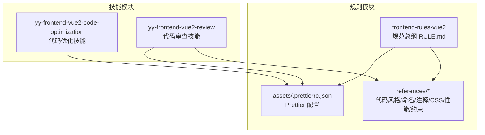

图表来源
- [rules/frontend-rules-vue2/RULE.md:1-62](file://rules/frontend-rules-vue2/RULE.md#L1-L62)
- [rules/frontend-rules-vue2/assets/.prettierrc.json:1-19](file://rules/frontend-rules-vue2/assets/.prettierrc.json#L1-L19)
- [skills/yy-frontend-vue2-code-optimization/assets/.prettierrc.json:1-19](file://skills/yy-frontend-vue2-code-optimization/assets/.prettierrc.json#L1-L19)
- [skills/yy-frontend-vue2-review/references/code-style.md:1-95](file://skills/yy-frontend-vue2-review/references/code-style.md#L1-L95)
- [skills/yy-frontend-vue2-review/rules/code-style.md:1-63](file://skills/yy-frontend-vue2-review/rules/code-style.md#L1-L63)

章节来源
- [rules/frontend-rules-vue2/RULE.md:1-62](file://rules/frontend-rules-vue2/RULE.md#L1-L62)

## 核心组件
- Prettier 配置：统一缩进、引号、分号、行宽、尾随逗号、箭头函数括号、对象花括号空格、HTML 属性引号、脚本样式缩进、空白敏感度等。
- 导入分组与顺序：外部依赖 → 内部全局（@src/）→ 内部相对（./、../），组间空一行，组内字母排序。
- SFC 结构顺序：template → script → scoped style。
- 函数写法偏好：优先箭头函数，单参数可省略括号，多参数或无参保留括号。
- 命名规范：文件/组件 PascalCase、目录 kebab-case、props/emits camelCase、常量全大写下划线、布尔前缀 is/has/show、CSS BEM。
- 注释规范：模板/脚本/样式注释格式与保护原则，JSDoc 关键方法必填。
- CSS 规范：预处理器、作用域（scoped 优先）、BEM 命名、布局与兼容性。
- 性能规范：懒加载、KeepAlive、虚拟滚动、防抖节流、图片优化、模板层轻量化、响应式性能与指令清理。
- 约束清单：绝对禁止、推荐、不推荐与注意事项，以及 Vue2 响应式陷阱。

章节来源
- [rules/frontend-rules-vue2/references/code-style.md:1-63](file://rules/frontend-rules-vue2/references/code-style.md#L1-L63)
- [rules/frontend-rules-vue2/references/order.md:1-131](file://rules/frontend-rules-vue2/references/order.md#L1-L131)
- [rules/frontend-rules-vue2/references/naming.md:1-73](file://rules/frontend-rules-vue2/references/naming.md#L1-L73)
- [rules/frontend-rules-vue2/references/comments.md:1-106](file://rules/frontend-rules-vue2/references/comments.md#L1-L106)
- [rules/frontend-rules-vue2/references/css.md:1-63](file://rules/frontend-rules-vue2/references/css.md#L1-L63)
- [rules/frontend-rules-vue2/references/performance.md:1-179](file://rules/frontend-rules-vue2/references/performance.md#L1-L179)
- [rules/frontend-rules-vue2/references/constraints.md:1-57](file://rules/frontend-rules-vue2/references/constraints.md#L1-L57)

## 架构概览
下图展示“规则模块”与“技能模块”的关系，以及 Prettier 配置在其中的定位与复用。

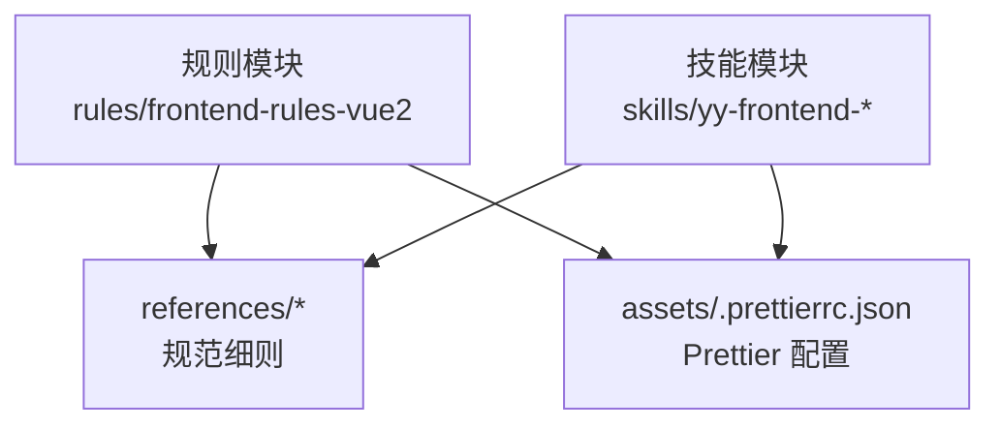

图表来源
- [rules/frontend-rules-vue2/RULE.md:1-62](file://rules/frontend-rules-vue2/RULE.md#L1-L62)
- [rules/frontend-rules-vue2/assets/.prettierrc.json:1-19](file://rules/frontend-rules-vue2/assets/.prettierrc.json#L1-L19)
- [skills/yy-frontend-vue2-code-optimization/assets/.prettierrc.json:1-19](file://skills/yy-frontend-vue2-code-optimization/assets/.prettierrc.json#L1-L19)
- [skills/yy-frontend-vue2-review/references/code-style.md:1-95](file://skills/yy-frontend-vue2-review/references/code-style.md#L1-L95)
- [skills/yy-frontend-vue2-review/rules/code-style.md:1-63](file://skills/yy-frontend-vue2-review/rules/code-style.md#L1-L63)

## 详细组件分析

### Prettier 配置与格式规范
- 缩进：2 空格（tabWidth: 2）
- 引号：JavaScript/TypeScript 使用单引号（singleQuote: true），JSX 属性单引号（jsxSingleQuote: true），Vue 模板属性双引号（vueHtmlAttributes: "double"）
- 分号：语句末尾必须有分号（semi: true）
- 行宽：每行最大 120 字符（printWidth: 120）
- 尾随逗号：多行对象/数组末尾加逗号（trailingComma: "all"）
- 箭头函数：单参数省略括号（arrowParens: "avoid"）
- 对象花括号：保留空格（bracketSpacing: true）
- 换行符：自动检测（endOfLine: "auto"）
- 属性换行：不强制单行单属性（singleAttributePerLine: false）
- Vue 脚本样式缩进：不额外缩进（vueIndentScriptAndStyle: false）
- HTML 空白敏感度：严格处理（htmlWhitespaceSensitivity: "strict"）
- 属性引号类型：仅需要时加引号（quoteProps: "as-needed"）
- 括号同行：不和内容同行（bracketSameLine: false）
- 散文换行：从不换行（proseWrap: "never"）

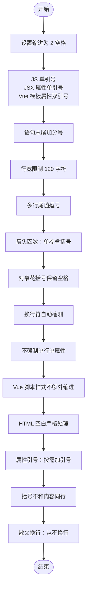

图表来源
- [rules/frontend-rules-vue2/assets/.prettierrc.json:1-19](file://rules/frontend-rules-vue2/assets/.prettierrc.json#L1-L19)
- [rules/frontend-rules-vue2/references/code-style.md:30-51](file://rules/frontend-rules-vue2/references/code-style.md#L30-L51)

章节来源
- [rules/frontend-rules-vue2/assets/.prettierrc.json:1-19](file://rules/frontend-rules-vue2/assets/.prettierrc.json#L1-L19)
- [rules/frontend-rules-vue2/references/code-style.md:5-28](file://rules/frontend-rules-vue2/references/code-style.md#L5-L28)
- [skills/yy-frontend-vue2-code-optimization/assets/.prettierrc.json:1-19](file://skills/yy-frontend-vue2-code-optimization/assets/.prettierrc.json#L1-L19)
- [skills/yy-frontend-vue2-review/references/code-style.md:69-82](file://skills/yy-frontend-vue2-review/references/code-style.md#L69-L82)
- [skills/yy-frontend-vue2-review/rules/code-style.md:5-28](file://skills/yy-frontend-vue2-review/rules/code-style.md#L5-L28)

### 导入分组与 SFC 结构顺序
- 导入分组（3 组）：外部依赖（node_modules）→ 内部全局（@src/）→ 内部相对（./、../），组间空一行，组内按字母顺序排序。
- SFC 结构顺序：template → script → scoped style。
- script 内部选项顺序：name → components → props → data → computed → watch → methods → 生命周期钩子。

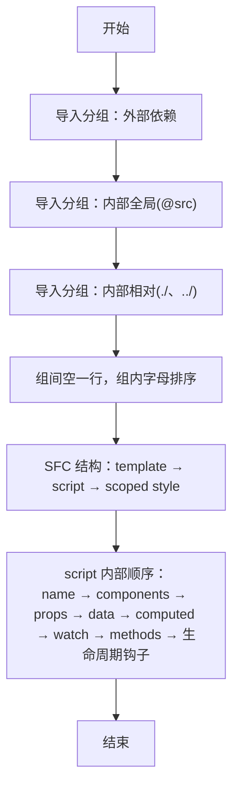

图表来源
- [rules/frontend-rules-vue2/references/order.md:104-131](file://rules/frontend-rules-vue2/references/order.md#L104-L131)

章节来源
- [rules/frontend-rules-vue2/references/order.md:1-131](file://rules/frontend-rules-vue2/references/order.md#L1-L131)

### 函数写法偏好与语句结构
- 优先使用箭头函数：const 函数名 = () => {}
- 单参数可省略括号，多参数或无参保留括号
- 语句结构：保持简洁、可读性强，避免深层嵌套与复杂表达式

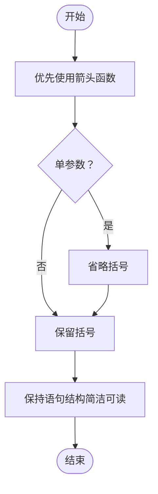

图表来源
- [rules/frontend-rules-vue2/references/code-style.md:53-62](file://rules/frontend-rules-vue2/references/code-style.md#L53-L62)

章节来源
- [rules/frontend-rules-vue2/references/code-style.md:53-62](file://rules/frontend-rules-vue2/references/code-style.md#L53-L62)

### 命名规范
- 文件与组件：组件文件名 PascalCase，目录 kebab-case，组件使用 PascalCase
- 函数命名：API 函数 apiMethodUrl（小驼峰），事件函数 onEventName（小驼峰）
- 变量与常量：常量全大写下划线，props/emits camelCase，布尔值 isXX/hasXX/showXX 前缀
- CSS 命名：BEM 规范（块、元素、修饰符），全小写，__ 连接元素，-- 连接修饰符

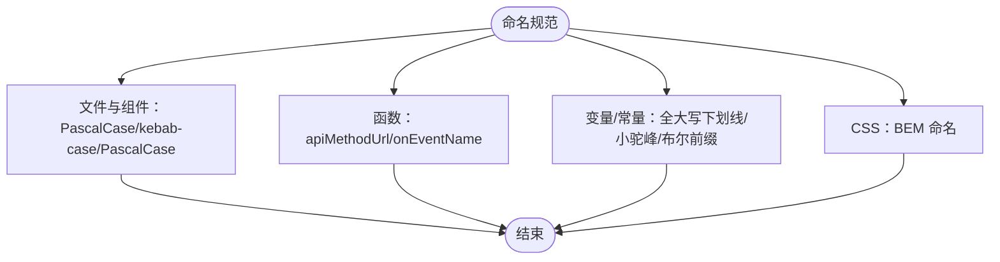

图表来源
- [rules/frontend-rules-vue2/references/naming.md:7-73](file://rules/frontend-rules-vue2/references/naming.md#L7-L73)

章节来源
- [rules/frontend-rules-vue2/references/naming.md:1-73](file://rules/frontend-rules-vue2/references/naming.md#L1-L73)

### 注释规范
- 模板区：根节点、循环、条件分支、区块、插槽、动态组件注释格式
- 脚本区：组件名称、props/data/computed/watch/methods、组件引入、provide/inject 注释
- 样式区：模块分组、子模块、响应式注释
- 注释保护原则：逻辑变更时注释必须同步更新，正确注释只增不改

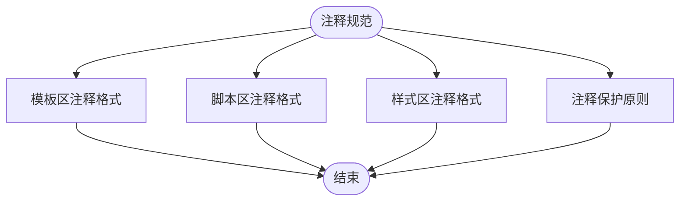

图表来源
- [rules/frontend-rules-vue2/references/comments.md:7-106](file://rules/frontend-rules-vue2/references/comments.md#L7-L106)

章节来源
- [rules/frontend-rules-vue2/references/comments.md:1-106](file://rules/frontend-rules-vue2/references/comments.md#L1-L106)

### CSS 规范与布局
- 处理器：Sass/SCSS、Less
- 作用域：scoped 优先，非 scoped 需标注“全局”
- 布局：优先使用 padding-top/left/right 与 margin-bottom/left/right，避免 margin-top 与 padding-bottom
- 兼容性：提供降级方案，使用 Autoprefixer + PostCSS，渐进增强

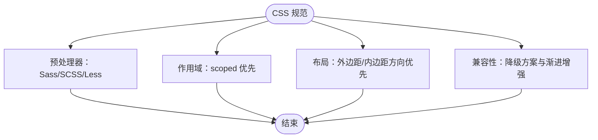

图表来源
- [rules/frontend-rules-vue2/references/css.md:1-63](file://rules/frontend-rules-vue2/references/css.md#L1-L63)

章节来源
- [rules/frontend-rules-vue2/references/css.md:1-63](file://rules/frontend-rules-vue2/references/css.md#L1-L63)

### 性能优化规范
- 组件懒加载、路由懒加载、KeepAlive 缓存、虚拟滚动
- 防抖节流：搜索（防抖 300ms）、滚动（节流 100ms）、resize（节流）、按钮点击（防抖/锁）
- 图片优化：WebP 优先、合适尺寸、非首屏 lazy
- 模板层轻量化：模板只负责展示，避免复杂表达式
- 响应式性能：computed 派生、大数据 freeze、避免 watch 中同步 DOM 操作
- 指令清理：unbind 钩子清理事件监听与定时器
- 路由守卫清理：beforeRouteLeave 清理定时器、取消请求、关闭弹窗

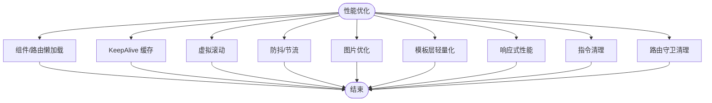

图表来源
- [rules/frontend-rules-vue2/references/performance.md:1-179](file://rules/frontend-rules-vue2/references/performance.md#L1-L179)

章节来源
- [rules/frontend-rules-vue2/references/performance.md:1-179](file://rules/frontend-rules-vue2/references/performance.md#L1-L179)

### 约束清单与 Vue2 响应式陷阱
- 绝对禁止：连续数据解构、父改子数据、修改 data 原始类型、修改 props、使用 mixins、无意义命名、$parent.$parent 链式访问、v-for 与 v-if 同元素、index 作为 key、setTimeout 替代 $nextTick
- 推荐：函数 try/catch、async/await、computed 优先、watch 深度/立即监听、computed try/catch、减少 data 冗余
- 不推荐：多层 try/catch 嵌套、生命周期 emit、可选链操作符、CSS 原生嵌套、:has() 伪类
- Vue2 响应式陷阱：新增对象属性、数组索引赋值、数组长度修改 必须使用 $set 或 splice 替代

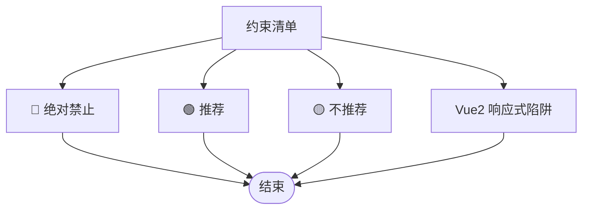

图表来源
- [rules/frontend-rules-vue2/references/constraints.md:1-57](file://rules/frontend-rules-vue2/references/constraints.md#L1-L57)

章节来源
- [rules/frontend-rules-vue2/references/constraints.md:1-57](file://rules/frontend-rules-vue2/references/constraints.md#L1-L57)

## 依赖分析
- 规则模块依赖关系：RULE.md 作为入口，references/* 为细则，assets/.prettierrc.json 为配置基线。
- 技能模块依赖关系：yy-frontend-vue2-code-optimization 与 yy-frontend-vue2-review 均复用规则模块的配置与规范。
- 工程工具：.editorconfig 与 .markdownlint.json 作为编辑器与 Markdown 校验的基础配置；package.json 提供脚本与类型检查。

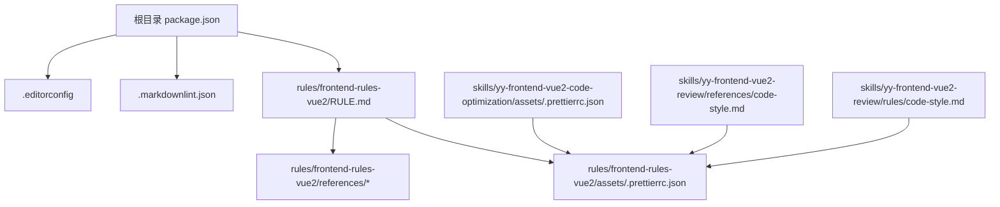

图表来源
- [package.json:1-46](file://package.json#L1-L46)
- [.editorconfig:1-10](file://.editorconfig#L1-L10)
- [.markdownlint.json:1-13](file://.markdownlint.json#L1-L13)
- [rules/frontend-rules-vue2/RULE.md:1-62](file://rules/frontend-rules-vue2/RULE.md#L1-L62)
- [rules/frontend-rules-vue2/assets/.prettierrc.json:1-19](file://rules/frontend-rules-vue2/assets/.prettierrc.json#L1-L19)
- [skills/yy-frontend-vue2-code-optimization/assets/.prettierrc.json:1-19](file://skills/yy-frontend-vue2-code-optimization/assets/.prettierrc.json#L1-L19)
- [skills/yy-frontend-vue2-review/references/code-style.md:1-95](file://skills/yy-frontend-vue2-review/references/code-style.md#L1-L95)
- [skills/yy-frontend-vue2-review/rules/code-style.md:1-63](file://skills/yy-frontend-vue2-review/rules/code-style.md#L1-L63)

章节来源
- [package.json:1-46](file://package.json#L1-L46)
- [.editorconfig:1-10](file://.editorconfig#L1-L10)
- [.markdownlint.json:1-13](file://.markdownlint.json#L1-L13)
- [rules/frontend-rules-vue2/RULE.md:1-62](file://rules/frontend-rules-vue2/RULE.md#L1-L62)

## 性能考虑
- 代码风格本身不直接影响运行时性能，但良好的格式与一致性有助于减少理解成本、降低引入 bug 的概率，间接提升整体质量与可维护性。
- 在团队协作中，统一的 Prettier 配置与导入/结构顺序能显著减少代码审查时间与分歧。

## 故障排查指南
- Prettier 配置不生效
  - 检查是否使用了正确的配置文件路径与键名
  - 确认编辑器/IDE 插件已启用 Prettier 并指向同一配置
  - 参考：[rules/frontend-rules-vue2/assets/.prettierrc.json:1-19](file://rules/frontend-rules-vue2/assets/.prettierrc.json#L1-L19)
- 导入顺序被 ESLint/格式化工具打乱
  - 确保遵循“外部依赖 → 内部全局 → 内部相对”的分组与字母排序
  - 参考：[rules/frontend-rules-vue2/references/order.md:104-131](file://rules/frontend-rules-vue2/references/order.md#L104-L131)
- 注释与代码不一致
  - 遵循注释保护原则：逻辑变更时同步更新注释
  - 参考：[rules/frontend-rules-vue2/references/comments.md:96-106](file://rules/frontend-rules-vue2/references/comments.md#L96-L106)
- Vue2 响应式异常
  - 避免直接新增对象属性、数组索引赋值、修改数组 length；使用 $set 或 splice
  - 参考：[rules/frontend-rules-vue2/references/constraints.md:48-57](file://rules/frontend-rules-vue2/references/constraints.md#L48-L57)

章节来源
- [rules/frontend-rules-vue2/assets/.prettierrc.json:1-19](file://rules/frontend-rules-vue2/assets/.prettierrc.json#L1-L19)
- [rules/frontend-rules-vue2/references/order.md:104-131](file://rules/frontend-rules-vue2/references/order.md#L104-L131)
- [rules/frontend-rules-vue2/references/comments.md:96-106](file://rules/frontend-rules-vue2/references/comments.md#L96-L106)
- [rules/frontend-rules-vue2/references/constraints.md:48-57](file://rules/frontend-rules-vue2/references/constraints.md#L48-L57)

## 结论
通过统一的 Prettier 配置与规范细则，结合导入分组、SFC 结构顺序、命名与注释、CSS 与性能实践，以及约束清单与响应式陷阱规避，团队可在 Vue2 项目中实现风格一致、可读性强、易于维护的代码质量标准。建议在本地与 CI 中同时启用格式化与校验，确保风格统一与持续改进。

## 附录
- 团队协作中的风格统一策略
  - 在本地与 CI 中统一启用 Prettier 与 Markdown 校验
  - 将 Prettier 配置纳入版本控制，确保团队成员共享同一套规则
  - 在 PR 审查中关注格式与命名一致性，必要时使用自动化工具先行修正
  - 参考工程工具配置：[package.json:7-16](file://package.json#L7-L16)，[.editorconfig:1-10](file://.editorconfig#L1-L10)，[.markdownlint.json:1-13](file://.markdownlint.json#L1-L13)

章节来源
- [package.json:7-16](file://package.json#L7-L16)
- [.editorconfig:1-10](file://.editorconfig#L1-L10)
- [.markdownlint.json:1-13](file://.markdownlint.json#L1-L13)