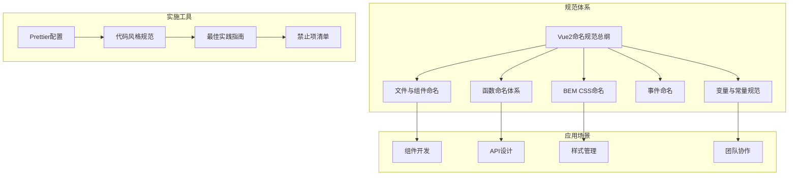
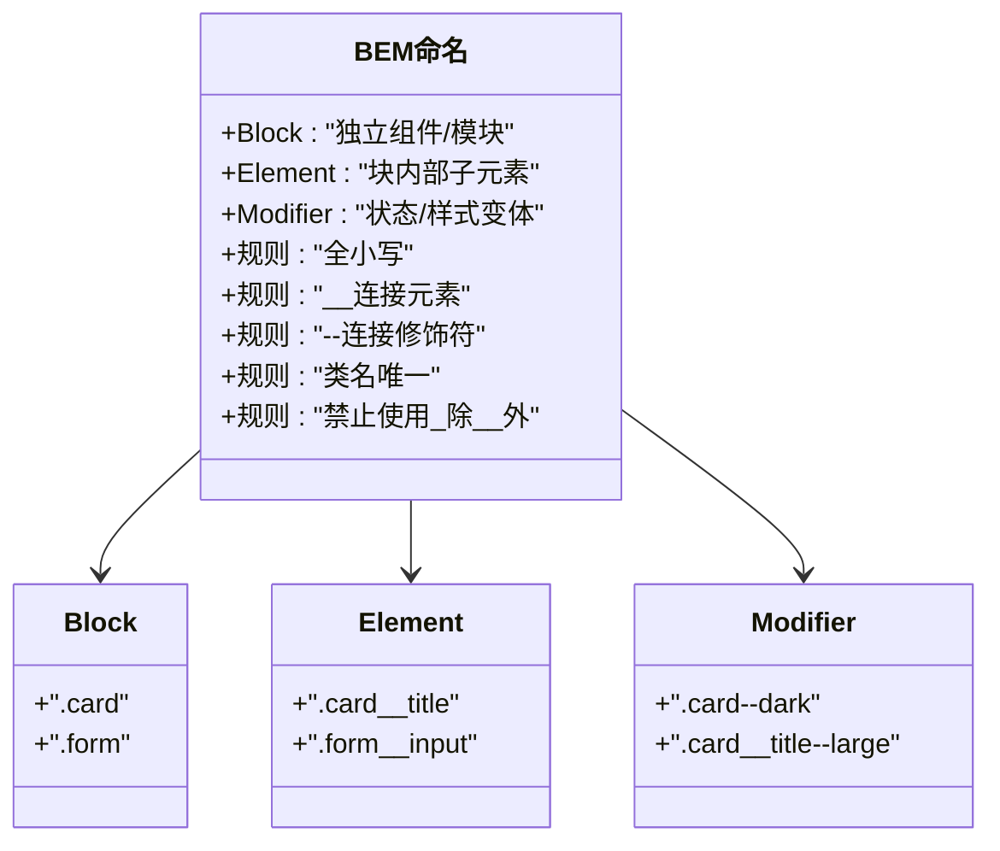
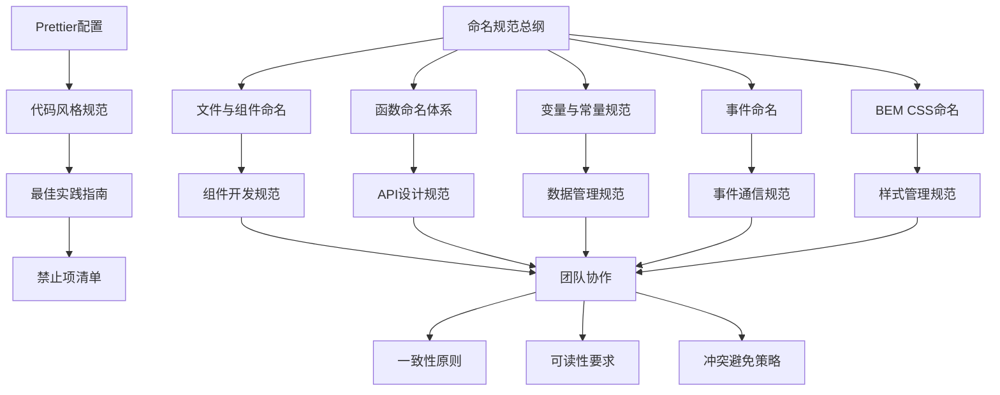
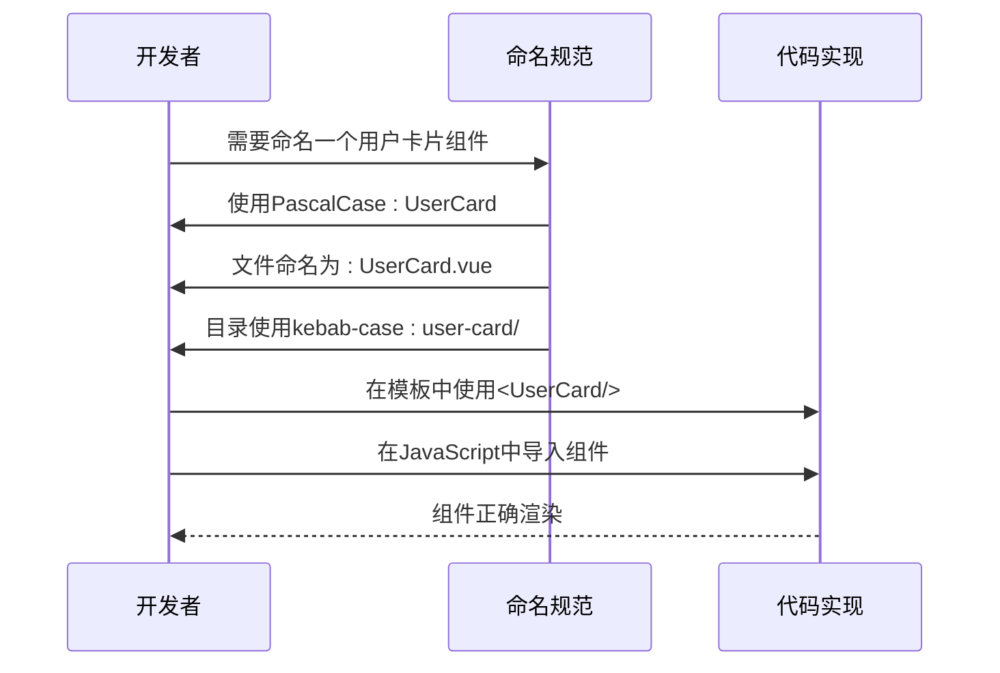
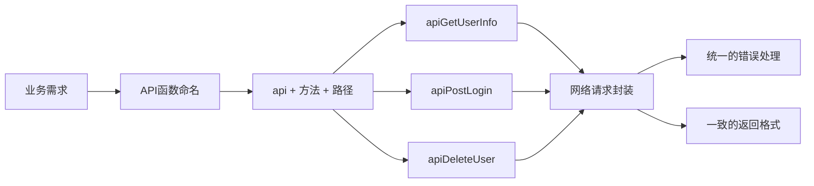
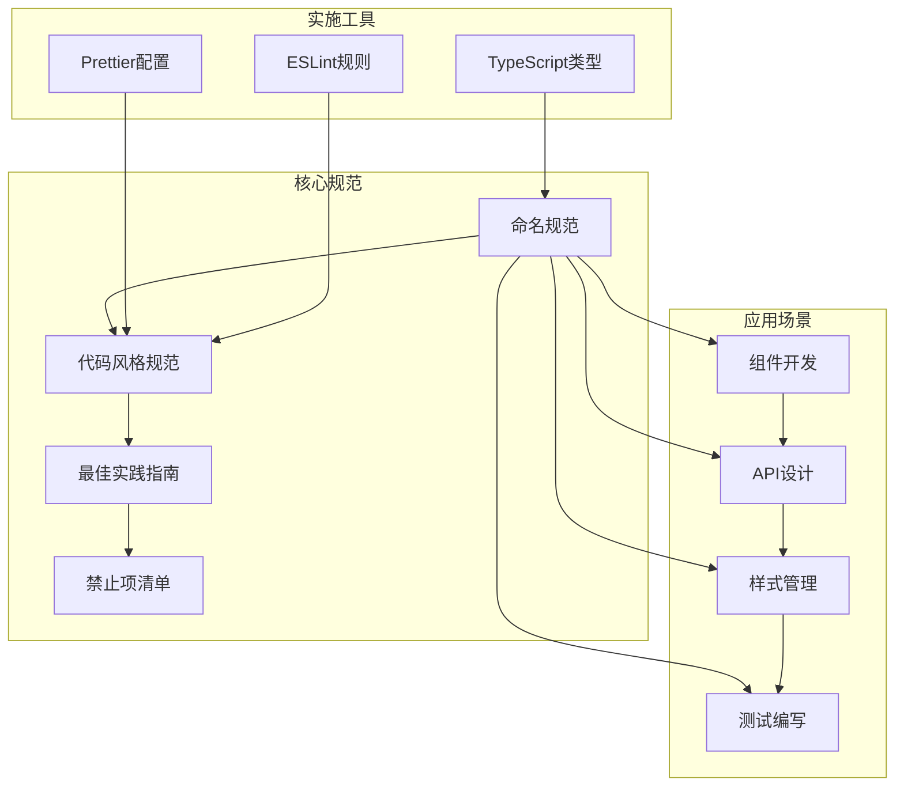
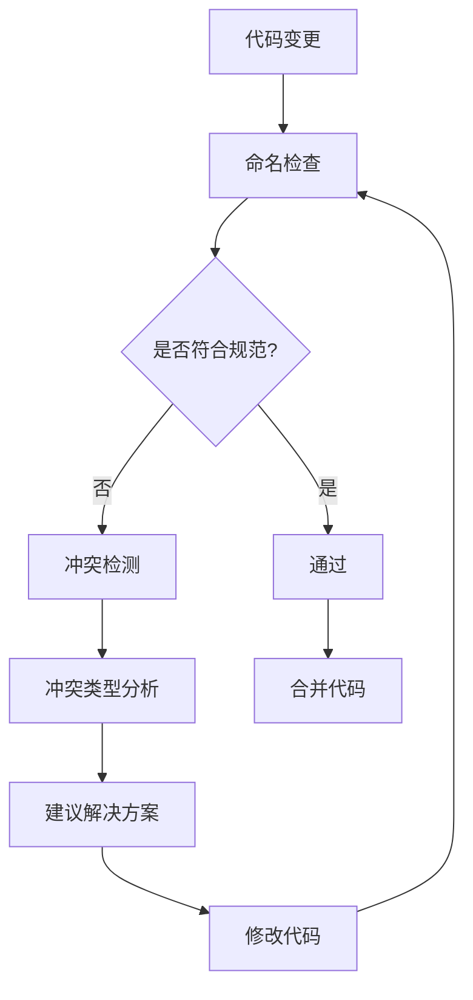

# 命名规范

<cite>
**本文档引用的文件**
- [naming.md](file://rules/frontend-rules-vue2/references/naming.md)
- [naming.md](file://skills/yy-frontend-vue2-review/references/naming.md)
- [naming.md](file://skills/yy-frontend-vue2-code-optimization/rules/naming.md)
- [naming.md](file://skills/yy-frontend-vue2-code-optimization/sub-skills/naming.md)
- [.prettierrc.json](file://rules/frontend-rules-vue2/assets/.prettierrc.json)
- [RULE.md](file://rules/frontend-rules-vue2/RULE.md)
- [code-style.md](file://skills/yy-frontend-vue2-review/references/code-style.md)
- [best-practice.md](file://skills/yy-frontend-vue2-review/references/best-practice.md)
- [forbidden.md](file://skills/yy-frontend-vue2-review/references/forbidden.md)
</cite>

## 目录
1. [简介](#简介)
2. [项目结构](#项目结构)
3. [核心组件](#核心组件)
4. [架构概览](#架构概览)
5. [详细组件分析](#详细组件分析)
6. [依赖关系分析](#依赖关系分析)
7. [性能考虑](#性能考虑)
8. [故障排除指南](#故障排除指南)
9. [结论](#结论)

## 简介

本文件档系统性地阐述了Vue2项目的命名规范，涵盖了文件命名、组件命名、API命名、事件命名、常量命名、布尔值命名以及BEM命名约定等关键方面。该规范旨在确保代码的一致性和可读性，为团队协作提供明确的指导原则。

Vue2作为经典的前端框架，其命名规范直接影响着代码的可维护性和团队开发效率。本规范基于仓库中的多个规则文件，结合实际应用场景，提供了完整的命名策略和最佳实践。

## 项目结构

Vue2命名规范体系由多个层次组成，形成了完整的规范框架：

**图表来源**
- [RULE.md:1-62](file://rules/frontend-rules-vue2/RULE.md#L1-L62)
- [naming.md:1-73](file://rules/frontend-rules-vue2/references/naming.md#L1-L73)

**章节来源**
- [RULE.md:8-62](file://rules/frontend-rules-vue2/RULE.md#L8-L62)

## 核心组件

### 文件与组件命名规范

Vue2项目中的文件和组件命名遵循严格的规范，确保代码结构的清晰性和一致性：

| 类型 | 规范 | 示例 | 说明 |
|------|------|------|------|
| 组件文件名 | 多单词 + PascalCase | `UserList.vue`, `UserCard.vue` | 避免与HTML原生元素冲突 |
| 目录命名 | kebab-case（短横） | `src/components/user-profile/` | 保持URL友好性 |
| 组件使用 | PascalCase | `<UserCard />` | 符合JSX规范 |

**重要注意事项**：组件名应使用多个单词（如 `UserProfile.vue`），避免与HTML原生元素冲突，确保在DOM中具有唯一性。

**章节来源**
- [naming.md:7-16](file://rules/frontend-rules-vue2/references/naming.md#L7-L16)
- [naming.md:7-16](file://skills/yy-frontend-vue2-code-optimization/rules/naming.md#L7-L16)

### 函数命名体系

Vue2项目中的函数命名采用统一的命名模式，便于理解和维护：

| 类型 | 规范 | 示例 | 用途 |
|------|------|------|------|
| API函数 | `api` + Method + URLPath（小驼峰） | `apiGetUserInfo`, `apiPostLogin` | 网络请求封装 |
| 事件函数 | `on` + EventName（小驼峰） | `onClickSubmit`, `onChangeInput` | DOM事件处理 |

这种命名体系确保了函数职责的明确性和调用的一致性。

**章节来源**
- [naming.md:19-25](file://rules/frontend-rules-vue2/references/naming.md#L19-L25)
- [naming.md:19-25](file://skills/yy-frontend-vue2-code-optimization/rules/naming.md#L19-L25)

### 变量与常量规范

变量和常量的命名遵循严格的语义化原则：

| 类型 | 规范 | 示例 | 语义 |
|------|------|------|------|
| 常量 | 全大写 + 下划线 | `MAX_RETRY_COUNT`, `APP_CONFIG` | 不可变配置 |
| Props/Emits | camelCase，必须注释 | `userId`, `userChange` | 组件通信 |
| 布尔值 | `isXX`/`hasXX`/`showXX` 前缀 | `isVisible`, `hasPermission` | 真假状态 |
| 变量/方法 | 有意义的驼峰命名 | 禁止 `data1`, `temp2` | 语义化标识 |

**数据()属性命名特殊规则**：

| 类型 | 规范 | 示例 | 语义 |
|------|------|------|------|
| data属性 | camelCase | `searchQuery`, `dataSource`, `loading` | 实例状态 |
| computed | camelCase | `isSelected`, `totalPage` | 计算属性 |

**章节来源**
- [naming.md:28-43](file://rules/frontend-rules-vue2/references/naming.md#L28-L43)
- [naming.md:28-43](file://skills/yy-frontend-vue2-code-optimization/rules/naming.md#L28-L43)

### 事件命名规范

事件命名采用统一的小驼峰格式，确保跨组件通信的一致性：

- emit事件名使用camelCase：`userChange`
- eventBus事件名使用小驼峰：`userChange`, `formSubmit`

这种规范确保了事件系统的可预测性和易用性。

**章节来源**
- [naming.md:46-50](file://rules/frontend-rules-vue2/references/naming.md#L46-L50)
- [naming.md:46-50](file://skills/yy-frontend-vue2-code-optimization/rules/naming.md#L46-L50)

### CSS BEM命名规范

BEM（Block__Element--Modifier）是Vue2项目中推荐的CSS命名方法论：

| 类型 | 说明 | 示例 |
|------|------|------|
| Block（块） | 独立组件/模块 | `.card`, `.form` |
| Element（元素） | 块内部子元素 | `.card__title`, `.form__input` |
| Modifier（修饰符） | 状态/样式变体 | `.card--dark`, `.card__title--large` |

**BEM规则要点**：
- 全小写
- `__` 连接元素
- `--` 连接修饰符
- 类名唯一
- 禁止使用`_`（除`__`外）

**图表来源**
- [naming.md:53-72](file://rules/frontend-rules-vue2/references/naming.md#L53-L72)

**章节来源**
- [naming.md:53-72](file://rules/frontend-rules-vue2/references/naming.md#L53-L72)
- [naming.md:53-72](file://skills/yy-frontend-vue2-code-optimization/rules/naming.md#L53-L72)

## 架构概览

Vue2命名规范的整体架构体现了从基础到高级的层次化设计：

**图表来源**
- [RULE.md:18-62](file://rules/frontend-rules-vue2/RULE.md#L18-L62)
- [code-style.md:1-95](file://skills/yy-frontend-vue2-review/references/code-style.md#L1-L95)

## 详细组件分析

### 命名一致性原则

Vue2命名规范强调以下一致性原则：

1. **统一性**：同一类型的标识符在整个项目中保持相同的命名模式
2. **可预测性**：命名应该能够预测其用途和行为
3. **可扩展性**：命名应该支持未来的功能扩展
4. **可维护性**：命名应该便于理解和修改

### 可读性要求

为了确保代码的可读性，Vue2命名规范提出了以下要求：

- 使用有意义的名称，避免缩写和简写
- 保持命名的简洁性，但不失准确性
- 遵循领域特定的术语和惯例
- 在复杂场景中使用注释说明命名的意图

### 不同场景下的命名策略

#### 组件命名策略

**图表来源**
- [naming.md:7-16](file://rules/frontend-rules-vue2/references/naming.md#L7-L16)

#### API命名策略

**图表来源**
- [naming.md:23](file://rules/frontend-rules-vue2/references/naming.md#L23)

#### 布尔值命名策略

| 前缀 | 含义 | 示例 | 使用场景 |
|------|------|------|----------|
| `is` | 布尔状态 | `isLoading`, `isValid`, `isDisabled` | 状态检查 |
| `has` | 存在性判断 | `hasData`, `hasPermission`, `hasError` | 权限验证 |
| `visible`/`show` | 可见性 | `isDialogVisible`, `showSidebar` | 显示控制 |
| `formatted`/`parsed` | 数据转换 | `formattedDate`, `parsedJson` | 数据处理 |
| `total`/`count` | 统计数量 | `totalCount`, `filteredCount` | 数量统计 |

**章节来源**
- [naming.md:26-35](file://skills/yy-frontend-vue2-review/references/naming.md#L26-L35)

### 命名冲突避免方法

在大型团队协作中，命名冲突是一个常见问题。Vue2命名规范提供了以下解决方案：

1. **作用域隔离**：使用命名空间或前缀区分不同模块的功能
2. **上下文相关**：在不同的上下文中使用不同的命名方式
3. **版本控制**：通过版本号或时间戳避免命名冲突
4. **自动化检测**：使用工具自动检测和报告潜在的命名冲突

### 团队协作中的命名约定

团队协作中的命名约定需要考虑以下因素：

- **统一培训**：确保所有团队成员都了解并遵守命名规范
- **代码审查**：在代码审查过程中重点关注命名问题
- **工具支持**：使用IDE插件和静态分析工具辅助命名规范的执行
- **持续改进**：根据项目发展和团队反馈不断优化命名规范

**章节来源**
- [naming.md:36-41](file://skills/yy-frontend-vue2-code-optimization/sub-skills/naming.md#L36-L41)

## 依赖关系分析

Vue2命名规范与其他开发规范之间存在密切的依赖关系：

**图表来源**
- [.prettierrc.json:1-19](file://rules/frontend-rules-vue2/assets/.prettierrc.json#L1-L19)
- [code-style.md:69-82](file://skills/yy-frontend-vue2-review/references/code-style.md#L69-L82)

**章节来源**
- [.prettierrc.json:1-19](file://rules/frontend-rules-vue2/assets/.prettierrc.json#L1-L19)
- [code-style.md:69-82](file://skills/yy-frontend-vue2-review/references/code-style.md#L69-L82)

## 性能考虑

虽然命名规范主要关注代码的可读性和一致性，但在某些情况下也会影响性能：

1. **命名长度**：过长的命名会增加代码体积，但通常影响微乎其微
2. **命名复杂度**：过于复杂的命名模式可能增加解析时间
3. **缓存效果**：一致的命名模式有助于JavaScript引擎的优化
4. **调试效率**：清晰的命名可以提高调试效率，间接提升开发性能

## 故障排除指南

在实施Vue2命名规范时，可能会遇到以下常见问题：

### 常见问题及解决方案

| 问题类型 | 症状 | 原因 | 解决方案 |
|----------|------|------|----------|
| 命名不一致 | 同一概念使用不同命名 | 团队成员理解差异 | 制定统一的命名决策流程 |
| 命名过长 | 代码可读性下降 | 过度详细的设计 | 简化命名但仍保持语义清晰 |
| 命名过短 | 含义不明确 | 缺乏上下文信息 | 添加必要的前缀或后缀 |
| 命名冲突 | 编译错误或运行时错误 | 重复定义的标识符 | 使用命名空间或作用域隔离 |

### 冲突检测和解决

**章节来源**
- [forbidden.md:10-35](file://skills/yy-frontend-vue2-review/references/forbidden.md#L10-L35)

## 结论

Vue2命名规范是确保代码质量和团队协作效率的重要基石。通过建立统一的命名体系，可以显著提升代码的可读性、可维护性和可扩展性。

本规范的核心价值在于：

1. **一致性**：为整个项目提供统一的命名标准
2. **可预测性**：使代码的行为和用途更加明确
3. **可扩展性**：支持项目的长期发展和功能演进
4. **团队协作**：减少沟通成本，提高开发效率

实施Vue2命名规范需要团队的共同努力和持续坚持。通过培训、工具支持和代码审查，可以确保规范的有效执行，并在实践中不断完善和发展。

建议团队定期回顾和更新命名规范，以适应技术发展和项目需求的变化，确保规范始终符合实际开发需要。