# 性能优化

<cite>
**本文引用的文件**
- [performance.md（Vue2 规范）](file://rules/frontend-rules-vue2/references/performance.md)
- [performance.md（Vue2 代码优化子技能）](file://skills/yy-frontend-vue2-code-optimization/rules/performance.md)
- [performance.md（Vue2 代码审核子技能）](file://skills/yy-frontend-vue2-review/rules/performance.md)
- [SKILL.md（Vue2 代码优化技能）](file://skills/yy-frontend-vue2-code-optimization/SKILL.md)
- [SKILL.md（Vue2 代码审核技能）](file://skills/yy-frontend-vue2-review/SKILL.md)
- [performance.md（Vue3 规范）](file://rules/frontend-rules-vue3/references/performance.md)
- [performance.md（Vue3 代码优化子技能）](file://skills/yy-frontend-vue3-code-optimization/rules/performance.md)
- [rule-prompts-simple.md（Vue2 规范提示）](file://rules/frontend-rules-vue2/prompts/rule-prompts-simple.md)
</cite>

## 目录
1. [简介](#简介)
2. [项目结构](#项目结构)
3. [核心组件](#核心组件)
4. [架构总览](#架构总览)
5. [详细组件分析](#详细组件分析)
6. [依赖分析](#依赖分析)
7. [性能考量](#性能考量)
8. [故障排查指南](#故障排查指南)
9. [结论](#结论)
10. [附录](#附录)

## 简介
本文件面向 Vue2 项目的性能优化实践，系统梳理并总结了懒加载、KeepAlive 缓存、虚拟滚动、防抖节流、图片优化、模板层轻量化、响应式性能、指令与路由守卫清理、过滤器使用以及 Vue2 响应式陷阱（$set 使用）等关键优化点，并结合仓库中的规范与子技能文档，给出可落地的实现方法、最佳实践与排障建议。同时提供性能监控与测试的通用方法论，帮助团队建立可持续的性能治理能力。

## 项目结构
该仓库围绕 Vue2/Vue3 的开发规范与子技能展开，其中与性能优化直接相关的内容主要分布在以下位置：
- 规范参考：rules/frontend-rules-vue2/references/performance.md
- 子技能规则：skills/yy-frontend-vue2-code-optimization/rules/performance.md
- 子技能说明：skills/yy-frontend-vue2-code-optimization/SKILL.md
- 审核子技能规则：skills/yy-frontend-vue2-review/rules/performance.md
- Vue3 对比参考：rules/frontend-rules-vue3/references/performance.md

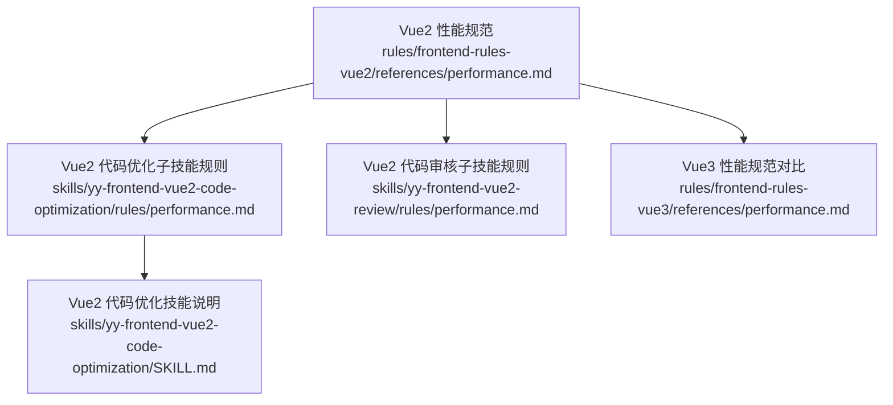

图表来源
- [performance.md（Vue2 规范）:1-179](file://rules/frontend-rules-vue2/references/performance.md#L1-L179)
- [performance.md（Vue2 代码优化子技能）:1-179](file://skills/yy-frontend-vue2-code-optimization/rules/performance.md#L1-L179)
- [SKILL.md（Vue2 代码优化技能）:1-415](file://skills/yy-frontend-vue2-code-optimization/SKILL.md#L1-L415)
- [performance.md（Vue2 代码审核子技能）:1-179](file://skills/yy-frontend-vue2-review/rules/performance.md#L1-L179)
- [performance.md（Vue3 规范）:1-136](file://rules/frontend-rules-vue3/references/performance.md#L1-L136)

章节来源
- [performance.md（Vue2 规范）:1-179](file://rules/frontend-rules-vue2/references/performance.md#L1-L179)
- [SKILL.md（Vue2 代码优化技能）:1-415](file://skills/yy-frontend-vue2-code-optimization/SKILL.md#L1-L415)

## 核心组件
- 懒加载：组件与路由的动态导入，减少初始包体与首屏阻塞。
- KeepAlive 缓存：通过 include/exclude 精准控制缓存范围，避免内存泄漏。
- 虚拟滚动：长列表仅渲染可视区域，显著降低 DOM 数量与重绘成本。
- 防抖/节流：对高频事件（搜索、滚动、resize、按钮点击）进行节流/防抖，降低无效计算与网络请求。
- 图片优化：WebP 优先、合适尺寸、非首屏懒加载，提升加载体验与带宽利用率。
- 模板层轻量化：模板只负责展示，避免昂贵计算，优先使用 computed。
- 响应式性能：优先 computed、大数据 Object.freeze、避免 watch 中同步 DOM 操作。
- 指令与路由守卫清理：unbind/unmounted 钩子清理事件与定时器，beforeRouteLeave 清理资源。
- 过滤器：优先局部 filters，保持纯函数且不修改外部状态。
- Vue2 响应式陷阱：新增属性/数组索引赋值/数组长度修改需使用 $set/splice。

章节来源
- [performance.md（Vue2 规范）:7-21](file://rules/frontend-rules-vue2/references/performance.md#L7-L21)
- [performance.md（Vue2 规范）:172-179](file://rules/frontend-rules-vue2/references/performance.md#L172-L179)
- [performance.md（Vue2 代码优化子技能）:7-21](file://skills/yy-frontend-vue2-code-optimization/rules/performance.md#L7-L21)

## 架构总览
下图展示了 Vue2 性能优化在项目中的落地路径：从规范制定、子技能执行、到审核把关与对比参考（Vue3），形成闭环。

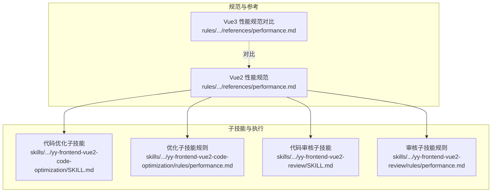

图表来源
- [performance.md（Vue2 规范）:1-179](file://rules/frontend-rules-vue2/references/performance.md#L1-L179)
- [performance.md（Vue3 规范）:1-136](file://rules/frontend-rules-vue3/references/performance.md#L1-L136)
- [SKILL.md（Vue2 代码优化技能）:1-415](file://skills/yy-frontend-vue2-code-optimization/SKILL.md#L1-L415)
- [SKILL.md（Vue2 代码审核技能）:1-167](file://skills/yy-frontend-vue2-review/SKILL.md#L1-L167)

## 详细组件分析

### 懒加载（组件与路由）
- 场景与动机：大组件与页面路由懒加载可显著降低首屏包体与解析时间。
- 实施要点：
  - 组件懒加载：使用动态导入惰性加载。
  - 路由懒加载：页面路由统一使用动态导入，避免全量打包。
- 参考实现位置：
  - [组件懒加载示例:29-40](file://rules/frontend-rules-vue2/references/performance.md#L29-L40)
  - [路由懒加载示例:33-39](file://rules/frontend-rules-vue2/references/performance.md#L33-L39)
  - [Vue2 优化子技能规则中的懒加载条目:11-13](file://skills/yy-frontend-vue2-code-optimization/rules/performance.md#L11-L13)

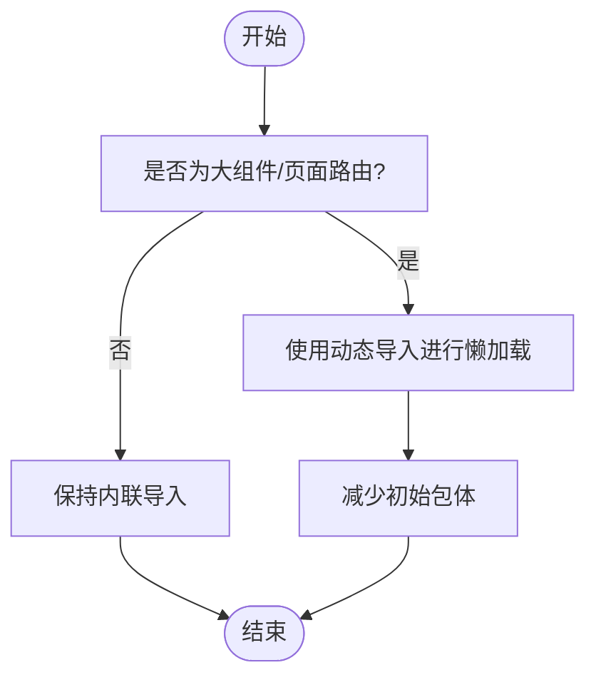

图表来源
- [performance.md（Vue2 规范）:24-40](file://rules/frontend-rules-vue2/references/performance.md#L24-L40)
- [performance.md（Vue2 代码优化子技能）:24-40](file://skills/yy-frontend-vue2-code-optimization/rules/performance.md#L24-L40)

章节来源
- [performance.md（Vue2 规范）:24-40](file://rules/frontend-rules-vue2/references/performance.md#L24-L40)
- [performance.md（Vue2 代码优化子技能）:24-40](file://skills/yy-frontend-vue2-code-optimization/rules/performance.md#L24-L40)

### KeepAlive 缓存
- 场景与动机：对不常更新的组件进行缓存，避免重复渲染与数据拉取。
- 实施要点：
  - 合理使用 <KeepAlive> 缓存不常更新组件。
  - 通过 include/exclude 精确控制缓存范围，避免内存泄漏。
- 参考实现位置：
  - [KeepAlive 示例:49-53](file://rules/frontend-rules-vue2/references/performance.md#L49-L53)
  - [Vue2 优化子技能规则中的 KeepAlive 条目:12-13](file://skills/yy-frontend-vue2-code-optimization/rules/performance.md#L12-L13)

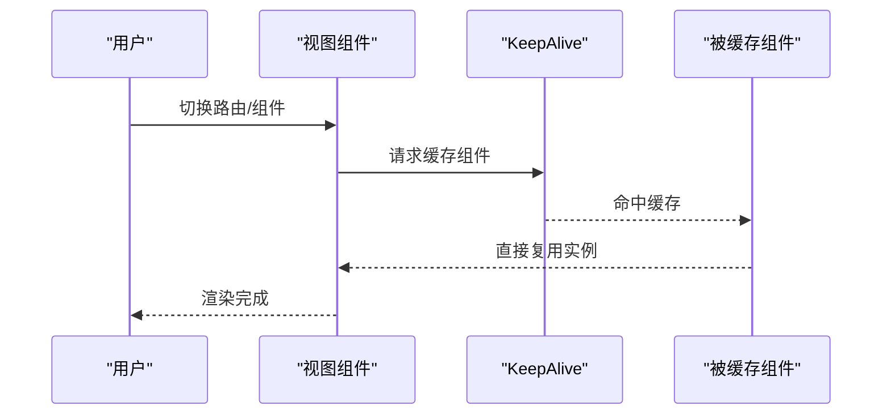

图表来源
- [performance.md（Vue2 规范）:44-53](file://rules/frontend-rules-vue2/references/performance.md#L44-L53)
- [performance.md（Vue2 代码优化子技能）:44-53](file://skills/yy-frontend-vue2-code-optimization/rules/performance.md#L44-L53)

章节来源
- [performance.md（Vue2 规范）:44-53](file://rules/frontend-rules-vue2/references/performance.md#L44-L53)
- [performance.md（Vue2 代码优化子技能）:44-53](file://skills/yy-frontend-vue2-code-optimization/rules/performance.md#L44-L53)

### 虚拟滚动
- 场景与动机：长列表（100+ 项）渲染大量 DOM 元素会导致卡顿与内存占用过高。
- 实施要点：
  - 使用虚拟滚动组件，仅渲染可视区域内的元素。
  - 明确 item-size 与 key-field，slot 透传 item。
- 参考实现位置：
  - [虚拟滚动示例:62-71](file://rules/frontend-rules-vue2/references/performance.md#L62-L71)
  - [Vue2 优化子技能规则中的虚拟滚动条目:14-15](file://skills/yy-frontend-vue2-code-optimization/rules/performance.md#L14-L15)

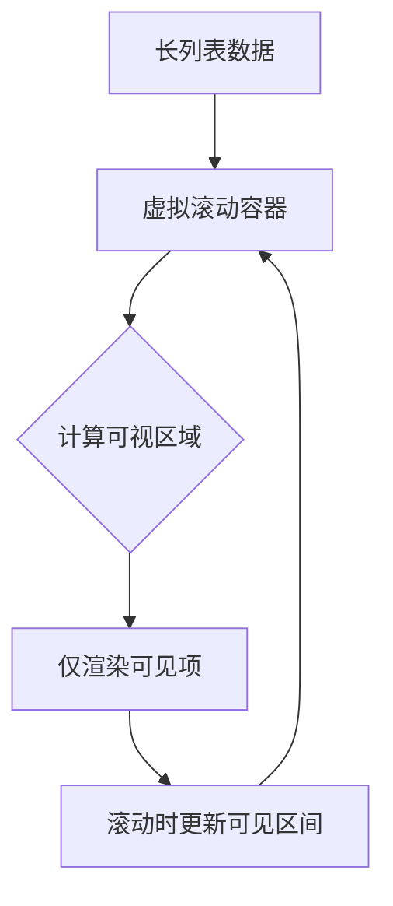

图表来源
- [performance.md（Vue2 规范）:57-71](file://rules/frontend-rules-vue2/references/performance.md#L57-L71)
- [performance.md（Vue2 代码优化子技能）:57-71](file://skills/yy-frontend-vue2-code-optimization/rules/performance.md#L57-L71)

章节来源
- [performance.md（Vue2 规范）:57-71](file://rules/frontend-rules-vue2/references/performance.md#L57-L71)
- [performance.md（Vue2 代码优化子技能）:57-71](file://skills/yy-frontend-vue2-code-optimization/rules/performance.md#L57-L71)

### 防抖与节流
- 场景与动机：高频事件（搜索、滚动、resize、按钮点击）会引发大量计算与网络请求，需进行节流/防抖。
- 实施要点：
  - 搜索：防抖 300ms。
  - 滚动：节流 100ms。
  - resize：节流。
  - 按钮点击：防抖/锁。
- 参考实现位置：
  - [防抖/节流示例:86-98](file://rules/frontend-rules-vue2/references/performance.md#L86-L98)
  - [Vue2 优化子技能规则中的防抖/节流条目:15-16](file://skills/yy-frontend-vue2-code-optimization/rules/performance.md#L15-L16)

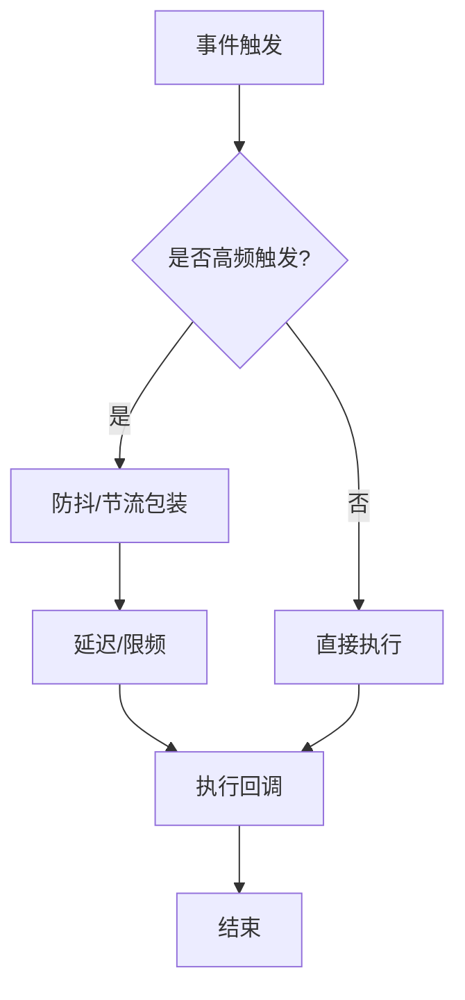

图表来源
- [performance.md（Vue2 规范）:75-98](file://rules/frontend-rules-vue2/references/performance.md#L75-L98)
- [performance.md（Vue2 代码优化子技能）:75-98](file://skills/yy-frontend-vue2-code-optimization/rules/performance.md#L75-L98)

章节来源
- [performance.md（Vue2 规范）:75-98](file://rules/frontend-rules-vue2/references/performance.md#L75-L98)
- [performance.md（Vue2 代码优化子技能）:75-98](file://skills/yy-frontend-vue2-code-optimization/rules/performance.md#L75-L98)

### 图片优化
- 场景与动机：图片体积与加载时机直接影响首屏性能与用户体验。
- 实施要点：
  - 格式：WebP 优先。
  - 尺寸：合适尺寸，避免大图小用。
  - 懒加载：非首屏图片使用 loading="lazy"。
- 参考实现位置：
  - [图片优化示例:108-111](file://rules/frontend-rules-vue2/references/performance.md#L108-L111)
  - [Vue2 优化子技能规则中的图片优化条目:16-16](file://skills/yy-frontend-vue2-code-optimization/rules/performance.md#L16-L16)

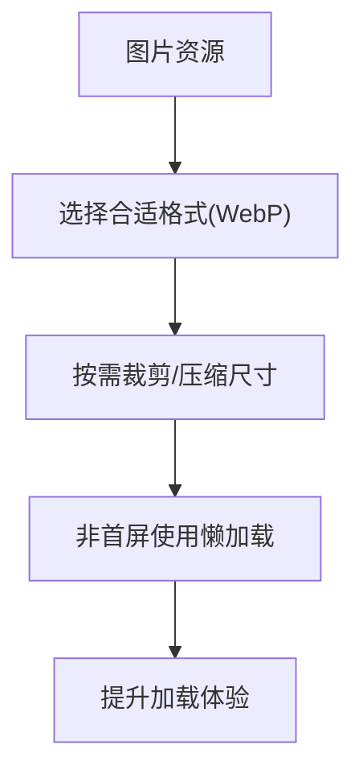

图表来源
- [performance.md（Vue2 规范）:102-111](file://rules/frontend-rules-vue2/references/performance.md#L102-L111)
- [performance.md（Vue2 代码优化子技能）:102-111](file://skills/yy-frontend-vue2-code-optimization/rules/performance.md#L102-L111)

章节来源
- [performance.md（Vue2 规范）:102-111](file://rules/frontend-rules-vue2/references/performance.md#L102-L111)
- [performance.md（Vue2 代码优化子技能）:102-111](file://skills/yy-frontend-vue2-code-optimization/rules/performance.md#L102-L111)

### 模板层轻量化与响应式性能
- 场景与动机：模板中避免昂贵计算，优先使用 computed；大数据使用 Object.freeze 冻结响应式。
- 实施要点：
  - 模板只负责展示，不写复杂表达式与逻辑。
  - 简单逻辑可内联，不过度封装为方法。
  - 避免在 watch 中执行同步 DOM 操作。
- 参考实现位置：
  - [模板层轻量化:115-120](file://rules/frontend-rules-vue2/references/performance.md#L115-L120)
  - [响应式性能:123-128](file://rules/frontend-rules-vue2/references/performance.md#L123-L128)
  - [Vue2 优化子技能规则中的模板与响应式条目:17-17](file://skills/yy-frontend-vue2-code-optimization/rules/performance.md#L17-L17)

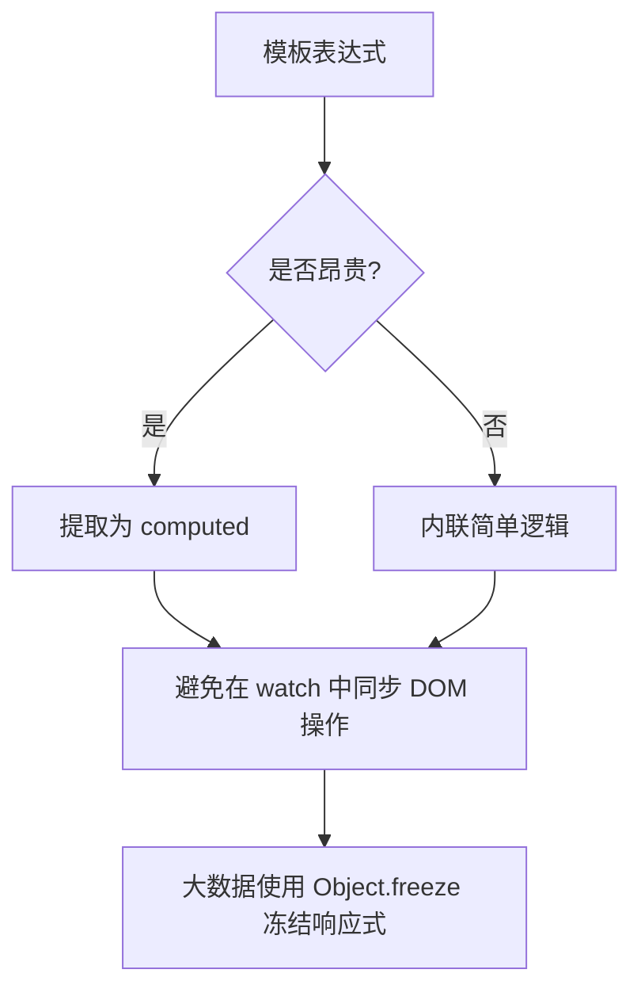

图表来源
- [performance.md（Vue2 规范）:115-128](file://rules/frontend-rules-vue2/references/performance.md#L115-L128)
- [performance.md（Vue2 代码优化子技能）:115-128](file://skills/yy-frontend-vue2-code-optimization/rules/performance.md#L115-L128)

章节来源
- [performance.md（Vue2 规范）:115-128](file://rules/frontend-rules-vue2/references/performance.md#L115-L128)
- [performance.md（Vue2 代码优化子技能）:115-128](file://skills/yy-frontend-vue2-code-optimization/rules/performance.md#L115-L128)

### 指令与路由守卫清理
- 场景与动机：自定义指令与路由切换时，需清理事件监听与定时器，防止内存泄漏。
- 实施要点：
  - 指令：unbind 钩子清理事件监听与定时器。
  - 路由：beforeRouteLeave 清理定时器、取消未完成请求、关闭弹窗。
- 参考实现位置：
  - [指令清理示例:135-144](file://rules/frontend-rules-vue2/references/performance.md#L135-L144)
  - [路由守卫清理:148-152](file://rules/frontend-rules-vue2/references/performance.md#L148-L152)
  - [Vue2 优化子技能规则中的指令与路由守卫条目:18-19](file://skills/yy-frontend-vue2-code-optimization/rules/performance.md#L18-L19)

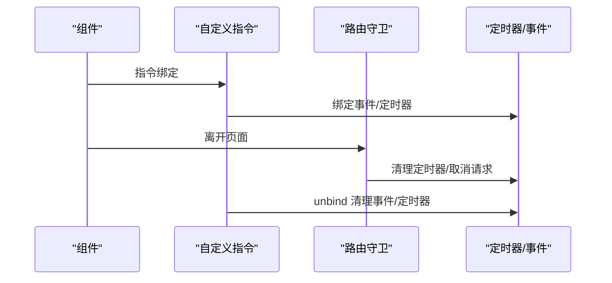

图表来源
- [performance.md（Vue2 规范）:131-152](file://rules/frontend-rules-vue2/references/performance.md#L131-L152)
- [performance.md（Vue2 代码优化子技能）:131-152](file://skills/yy-frontend-vue2-code-optimization/rules/performance.md#L131-L152)

章节来源
- [performance.md（Vue2 规范）:131-152](file://rules/frontend-rules-vue2/references/performance.md#L131-L152)
- [performance.md（Vue2 代码优化子技能）:131-152](file://skills/yy-frontend-vue2-code-optimization/rules/performance.md#L131-L152)

### 过滤器
- 场景与动机：过滤器用于格式化显示，需保持纯函数且不修改外部状态。
- 实施要点：
  - 优先使用局部 filters。
  - 保持纯函数，不修改外部状态。
- 参考实现位置：
  - [过滤器示例:160-168](file://rules/frontend-rules-vue2/references/performance.md#L160-L168)
  - [Vue2 优化子技能规则中的过滤器条目:20-20](file://skills/yy-frontend-vue2-code-optimization/rules/performance.md#L20-L20)

章节来源
- [performance.md（Vue2 规范）:155-168](file://rules/frontend-rules-vue2/references/performance.md#L155-L168)
- [performance.md（Vue2 代码优化子技能）:155-168](file://skills/yy-frontend-vue2-code-optimization/rules/performance.md#L155-L168)

### Vue2 响应式陷阱与 $set 使用
- 场景与动机：Vue2 响应式系统对新增属性与数组索引赋值不敏感，需使用 $set。
- 实施要点：
  - 新增对象属性：使用 $set。
  - 数组索引赋值：使用 $set。
  - 数组长度修改：使用 splice。
- 参考实现位置：
  - [响应式陷阱表格:172-179](file://rules/frontend-rules-vue2/references/performance.md#L172-L179)
  - [Vue2 优化子技能规则中的响应式陷阱条目:179-179](file://skills/yy-frontend-vue2-code-optimization/rules/performance.md#L179-L179)

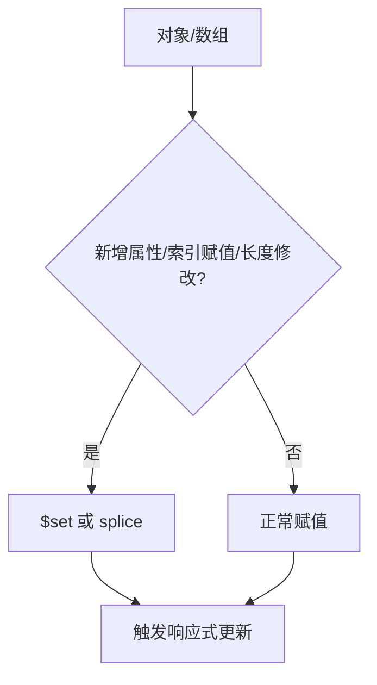

图表来源
- [performance.md（Vue2 规范）:172-179](file://rules/frontend-rules-vue2/references/performance.md#L172-L179)
- [performance.md（Vue2 代码优化子技能）:172-179](file://skills/yy-frontend-vue2-code-optimization/rules/performance.md#L172-L179)

章节来源
- [performance.md（Vue2 规范）:172-179](file://rules/frontend-rules-vue2/references/performance.md#L172-L179)
- [performance.md（Vue2 代码优化子技能）:172-179](file://skills/yy-frontend-vue2-code-optimization/rules/performance.md#L172-L179)

## 依赖分析
- 规范与子技能的耦合关系：Vue2 性能规范作为总纲，分别驱动“代码优化子技能”和“代码审核子技能”的规则与执行。
- 与 Vue3 的对比：Vue3 在指令钩子（unmounted）与响应式 API 上有所演进，但核心优化理念一致。

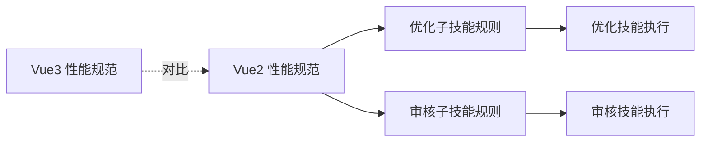

图表来源
- [performance.md（Vue2 规范）:1-179](file://rules/frontend-rules-vue2/references/performance.md#L1-L179)
- [performance.md（Vue2 代码优化子技能）:1-179](file://skills/yy-frontend-vue2-code-optimization/rules/performance.md#L1-L179)
- [performance.md（Vue2 代码审核子技能）:1-179](file://skills/yy-frontend-vue2-review/rules/performance.md#L1-L179)
- [performance.md（Vue3 规范）:1-136](file://rules/frontend-rules-vue3/references/performance.md#L1-L136)

章节来源
- [performance.md（Vue2 规范）:1-179](file://rules/frontend-rules-vue2/references/performance.md#L1-L179)
- [performance.md（Vue3 规范）:1-136](file://rules/frontend-rules-vue3/references/performance.md#L1-L136)

## 性能考量
- 渲染层面：懒加载、KeepAlive、虚拟滚动、模板轻量化。
- 响应式层面：优先 computed、大数据冻结、$set 使用。
- 事件与资源层面：防抖/节流、指令与路由守卫清理。
- 资源层面：图片格式与懒加载。
- 工程化层面：子技能自动/确认执行、风险分级与逐项确认。

章节来源
- [performance.md（Vue2 规范）:7-21](file://rules/frontend-rules-vue2/references/performance.md#L7-L21)
- [SKILL.md（Vue2 代码优化技能）:40-70](file://skills/yy-frontend-vue2-code-optimization/SKILL.md#L40-L70)

## 故障排查指南
- 症状：页面卡顿、首屏慢、内存持续增长。
- 排查步骤：
  - 检查是否存在长列表未使用虚拟滚动。
  - 检查高频事件是否缺少防抖/节流。
  - 检查组件是否滥用 watch 同步 DOM 操作。
  - 检查图片是否未使用懒加载或格式不当。
  - 检查指令与路由守卫是否清理定时器/事件。
  - 检查 Vue2 响应式陷阱（$set 使用）。
- 工具与方法（通用建议）：
  - 使用浏览器性能面板（Performance/Network/Elements）定位瓶颈。
  - 使用 Lighthouse 进行首屏与性能评分。
  - 使用 Vue DevTools 观察组件渲染次数与响应式变化。
  - 使用内存快照排查内存泄漏。

章节来源
- [performance.md（Vue2 规范）:115-152](file://rules/frontend-rules-vue2/references/performance.md#L115-L152)
- [SKILL.md（Vue2 代码优化技能）:167-180](file://skills/yy-frontend-vue2-code-optimization/SKILL.md#L167-L180)

## 结论
本规范与子技能体系围绕 Vue2 的性能关键点提供了从规则到执行再到审核的完整闭环。通过懒加载、KeepAlive、虚拟滚动、防抖节流、图片优化、模板轻量化与响应式优化等手段，配合指令与路由守卫清理、过滤器使用与 $set 使用等细节，可系统性地提升应用性能与稳定性。建议在日常开发中以子技能为执行抓手，以规范为准则，以审核为保障，持续迭代优化。

## 附录
- Vue2 与 Vue3 对比参考：
  - 指令钩子：Vue2 为 unbind，Vue3 为 unmounted。
  - 响应式 API：Vue3 推荐 shallowRef 等以减少深层响应式开销。
- 规范提示（Vue2）：
  - 优化速查与示例可参考提示文件中的性能条目与示例。

章节来源
- [performance.md（Vue3 规范）:115-128](file://rules/frontend-rules-vue3/references/performance.md#L115-L128)
- [rule-prompts-simple.md（Vue2 规范提示）:385-413](file://rules/frontend-rules-vue2/prompts/rule-prompts-simple.md#L385-L413)