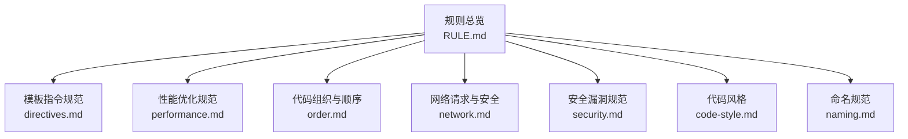
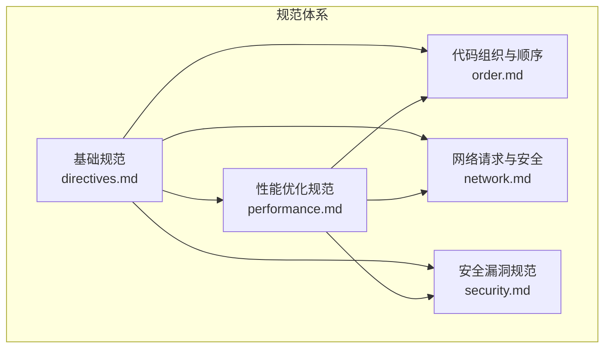
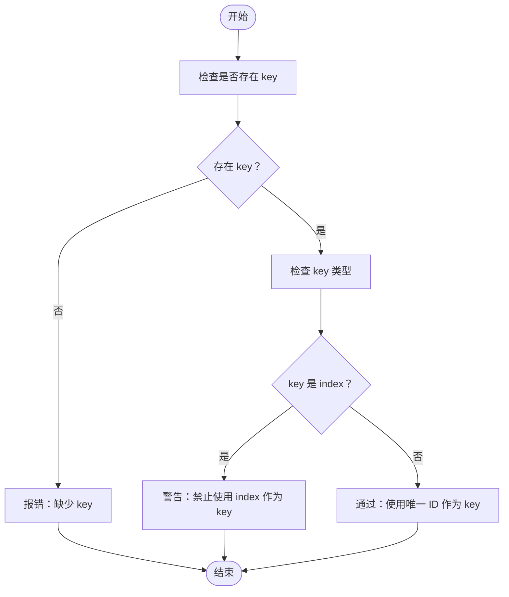
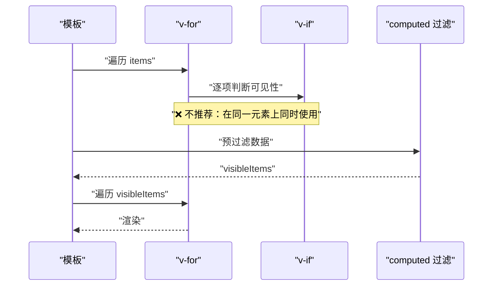
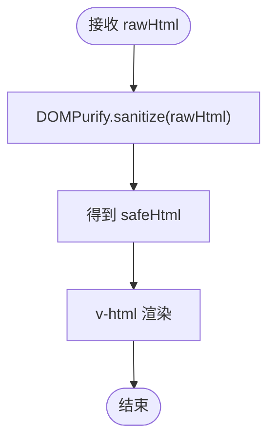
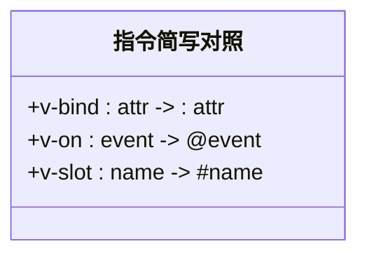
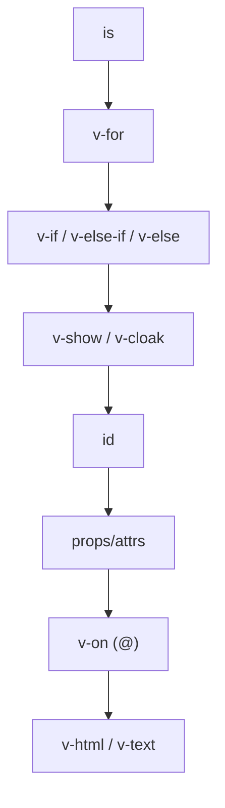
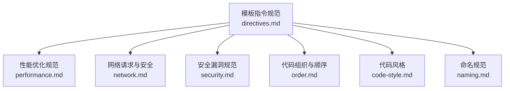

# 模板指令规范

<cite>
**本文档引用的文件**
- [directives.md](file://rules/frontend-rules-vue2/references/directives.md)
- [directives.md](file://skills/yy-frontend-vue2-code-optimization/rules/directives.md)
- [performance.md](file://rules/frontend-rules-vue2/references/performance.md)
- [performance.md](file://skills/yy-frontend-vue2-code-optimization/rules/performance.md)
- [order.md](file://rules/frontend-rules-vue2/references/order.md)
- [network.md](file://rules/frontend-rules-vue2/references/network.md)
- [security.md](file://skills/yy-frontend-vue2-review/references/security.md)
- [code-style.md](file://skills/yy-frontend-vue2-review/references/code-style.md)
- [naming.md](file://skills/yy-frontend-vue2-review/references/naming.md)
- [RULE.md](file://rules/frontend-rules-vue2/RULE.md)
</cite>

## 目录
1. [简介](#简介)
2. [项目结构](#项目结构)
3. [核心组件](#核心组件)
4. [架构概览](#架构概览)
5. [详细组件分析](#详细组件分析)
6. [依赖分析](#依赖分析)
7. [性能考虑](#性能考虑)
8. [故障排查指南](#故障排查指南)
9. [结论](#结论)
10. [附录](#附录)

## 简介
本规范面向 Vue2 单文件组件（SFC）模板区的指令使用，系统化阐述 v-for 与 key 的正确搭配、v-if 与 v-show 的选择策略、v-html 的安全使用、指令简写形式、属性声明顺序等关键主题。同时结合性能优化与安全约束，给出可落地的最佳实践与常见陷阱规避建议，帮助团队在保证可维护性的同时提升运行效率与安全性。

## 项目结构
该仓库将 Vue2 开发规范拆分为多个子模块，其中与模板指令直接相关的内容主要分布在以下位置：
- 规则总览与索引：[RULE.md](file://rules/frontend-rules-vue2/RULE.md)
- 模板指令规范（v-for/key、v-if 冲突、v-html 安全、指令简写、属性顺序、v-slot 风格）：[directives.md](file://rules/frontend-rules-vue2/references/directives.md)、[directives.md](file://skills/yy-frontend-vue2-code-optimization/rules/directives.md)
- 性能优化规范（模板层轻量化、指令清理、响应式陷阱等）：[performance.md](file://rules/frontend-rules-vue2/references/performance.md)、[performance.md](file://skills/yy-frontend-vue2-code-optimization/rules/performance.md)
- 代码组织与顺序（SFC 块顺序、<script> 内部结构顺序、Import 分组）：[order.md](file://rules/frontend-rules-vue2/references/order.md)
- 网络请求与安全（v-html 过滤、敏感数据处理）：[network.md](file://rules/frontend-rules-vue2/references/network.md)
- 安全漏洞规范（XSS 风险、敏感信息泄露）：[security.md](file://skills/yy-frontend-vue2-review/references/security.md)
- 代码风格与 Prettier 配置：[code-style.md](file://skills/yy-frontend-vue2-review/references/code-style.md)
- 命名规范（组件名、事件函数、常量等）：[naming.md](file://skills/yy-frontend-vue2-review/references/naming.md)

**图表来源**
- [RULE.md:1-62](file://rules/frontend-rules-vue2/RULE.md#L1-L62)

**章节来源**
- [RULE.md:1-62](file://rules/frontend-rules-vue2/RULE.md#L1-L62)

## 核心组件
本节聚焦模板指令相关的关键要求与最佳实践，涵盖以下主题：
- v-for 与 key 的正确使用
- v-if 与 v-for 冲突的规避
- v-html 的安全使用与过滤
- 指令简写形式（v-bind/v-on/v-slot）
- 模板属性声明顺序
- v-slot 风格与动态插槽
- v-if 与 v-show 的选择策略（基于性能与行为差异）

**章节来源**
- [directives.md:7-116](file://rules/frontend-rules-vue2/references/directives.md#L7-L116)
- [directives.md:7-116](file://skills/yy-frontend-vue2-code-optimization/rules/directives.md#L7-L116)

## 架构概览
模板指令规范在整体规范体系中的定位如下：
- 作为“基础规范”之一，指导模板区的指令使用与属性排列
- 与“性能优化规范”协同，强调模板层轻量化与指令清理
- 与“网络请求与安全”“安全漏洞规范”联动，确保 v-html 的安全过滤与敏感数据处理
- 与“代码组织与顺序”“命名规范”共同构建一致的开发体验

**图表来源**
- [directives.md:1-116](file://rules/frontend-rules-vue2/references/directives.md#L1-L116)
- [performance.md:1-179](file://rules/frontend-rules-vue2/references/performance.md#L1-L179)
- [order.md:1-131](file://rules/frontend-rules-vue2/references/order.md#L1-L131)
- [network.md:1-180](file://rules/frontend-rules-vue2/references/network.md#L1-L180)
- [security.md:1-32](file://skills/yy-frontend-vue2-review/references/security.md#L1-L32)

## 详细组件分析

### v-for 与 key 的正确使用
- 在组件上必须使用 key 属性配合 v-for，以维护组件内部状态
- key 必须使用唯一 ID，禁止使用 index 作为 key
- 使用唯一 ID 可显著降低 DOM 重建成本，提升列表更新性能

**图表来源**
- [directives.md:9-18](file://rules/frontend-rules-vue2/references/directives.md#L9-L18)

**章节来源**
- [directives.md:9-18](file://rules/frontend-rules-vue2/references/directives.md#L9-L18)

### v-if 与 v-for 冲突的规避
- 禁止在同一元素上同时使用 v-if 与 v-for
- 推荐方案：
  - 使用 <template> 包裹 v-for，将 v-if 放在 template 上
  - 使用 computed 预先过滤数据，再在模板中直接遍历过滤后的数据

**图表来源**
- [directives.md:22-39](file://rules/frontend-rules-vue2/references/directives.md#L22-L39)

**章节来源**
- [directives.md:22-39](file://rules/frontend-rules-vue2/references/directives.md#L22-L39)

### v-html 的安全使用
- 可使用 v-html，但必须用 DOMPurify 过滤 HTML，防止 XSS 攻击
- 避免直接渲染用户输入或不可信来源的内容
- 与网络请求与安全规范、安全漏洞规范形成联动，确保内容安全

**图表来源**
- [directives.md:43-61](file://rules/frontend-rules-vue2/references/directives.md#L43-L61)
- [network.md:176-179](file://rules/frontend-rules-vue2/references/network.md#L176-L179)
- [security.md:9-21](file://skills/yy-frontend-vue2-review/references/security.md#L9-L21)

**章节来源**
- [directives.md:43-61](file://rules/frontend-rules-vue2/references/directives.md#L43-L61)
- [network.md:176-179](file://rules/frontend-rules-vue2/references/network.md#L176-L179)
- [security.md:9-21](file://skills/yy-frontend-vue2-review/references/security.md#L9-L21)

### 指令简写形式
- 统一使用指令简写形式，使模板更简洁：
  - v-bind:attr → :attr
  - v-on:event → @event
  - v-slot:name → #name
- 简写形式提升可读性与一致性

**图表来源**
- [directives.md:65-81](file://rules/frontend-rules-vue2/references/directives.md#L65-L81)

**章节来源**
- [directives.md:65-81](file://rules/frontend-rules-vue2/references/directives.md#L65-L81)

### 模板属性声明顺序
- HTML 元素上的属性顺序应保持统一：
  1) 定义（is）
  2) v-for
  3) v-if / v-else-if / v-else
  4) v-show / v-cloak
  5) id
  6) props/attrs
  7) v-on（@）
  8) v-html / v-text
- 该顺序有助于提升可读性与一致性

**图表来源**
- [directives.md:85-102](file://rules/frontend-rules-vue2/references/directives.md#L85-L102)

**章节来源**
- [directives.md:85-102](file://rules/frontend-rules-vue2/references/directives.md#L85-L102)

### v-slot 风格与动态插槽
- 使用动态风格：v-slot:[name] 或 #[name]（name 为动态变量）
- 禁止静态默认插槽写法，避免不必要的复杂性

**章节来源**
- [directives.md:112-116](file://rules/frontend-rules-vue2/references/directives.md#L112-L116)

### v-if 与 v-show 的选择策略
- v-if：条件为假时不会渲染对应节点，适合切换频率低的场景
- v-show：始终渲染，仅切换 CSS 显示状态，适合频繁切换的场景
- 结合性能优化规范，模板层应尽量保持轻量化，避免在模板中执行昂贵计算

**章节来源**
- [performance.md:115-120](file://rules/frontend-rules-vue2/references/performance.md#L115-L120)

## 依赖分析
模板指令规范与其他模块之间的依赖关系如下：
- 与性能优化规范耦合紧密：模板层轻量化、指令清理、响应式陷阱等
- 与网络请求与安全规范联动：v-html 过滤、敏感数据处理
- 与安全漏洞规范协同：XSS 风险与敏感信息泄露防范
- 与代码组织与顺序规范配合：SFC 块顺序、<script> 内部结构顺序、Import 分组
- 与命名规范协作：组件名、事件函数、常量等命名一致性

**图表来源**
- [directives.md:1-116](file://rules/frontend-rules-vue2/references/directives.md#L1-L116)
- [performance.md:1-179](file://rules/frontend-rules-vue2/references/performance.md#L1-L179)
- [network.md:1-180](file://rules/frontend-rules-vue2/references/network.md#L1-L180)
- [security.md:1-32](file://skills/yy-frontend-vue2-review/references/security.md#L1-L32)
- [order.md:1-131](file://rules/frontend-rules-vue2/references/order.md#L1-L131)
- [code-style.md:1-95](file://skills/yy-frontend-vue2-review/references/code-style.md#L1-L95)
- [naming.md:1-35](file://skills/yy-frontend-vue2-review/references/naming.md#L1-L35)

**章节来源**
- [directives.md:1-116](file://rules/frontend-rules-vue2/references/directives.md#L1-L116)
- [performance.md:1-179](file://rules/frontend-rules-vue2/references/performance.md#L1-L179)
- [network.md:1-180](file://rules/frontend-rules-vue2/references/network.md#L1-L180)
- [security.md:1-32](file://skills/yy-frontend-vue2-review/references/security.md#L1-L32)
- [order.md:1-131](file://rules/frontend-rules-vue2/references/order.md#L1-L131)
- [code-style.md:1-95](file://skills/yy-frontend-vue2-review/references/code-style.md#L1-L95)
- [naming.md:1-35](file://skills/yy-frontend-vue2-review/references/naming.md#L1-L35)

## 性能考虑
- 模板层轻量化：模板只负责展示，不写复杂表达式与逻辑；简单逻辑可内联，不过度封装为方法
- 避免昂贵计算：优先使用 computed 派生状态
- 指令清理：在指令的 unbind 钩子中清理事件监听器和定时器
- 响应式陷阱（Vue2 特有）：新增对象属性、数组索引赋值、数组长度修改需使用 $set 或 splice
- 长列表优化：100+ 项使用虚拟滚动，避免 DOM 过多
- 防抖节流：搜索（防抖300ms）、滚动（节流100ms）、resize（节流）、按钮点击（防抖/锁）

**章节来源**
- [performance.md:7-21](file://rules/frontend-rules-vue2/references/performance.md#L7-L21)
- [performance.md:115-128](file://rules/frontend-rules-vue2/references/performance.md#L115-L128)
- [performance.md:131-144](file://rules/frontend-rules-vue2/references/performance.md#L131-L144)
- [performance.md:172-179](file://rules/frontend-rules-vue2/references/performance.md#L172-L179)

## 故障排查指南
- v-for 缺少 key 或使用 index：导致列表更新异常、组件状态错乱
- v-if 与 v-for 同用：造成不必要的重复计算与渲染
- v-html 未过滤：存在 XSS 风险
- 指令未简写：降低可读性与一致性
- 属性顺序不统一：影响可读性与审查效率
- 指令未清理：内存泄漏与事件冲突
- 响应式陷阱：新增属性或数组变更未使用 $set/splice，导致视图不更新

**章节来源**
- [directives.md:9-18](file://rules/frontend-rules-vue2/references/directives.md#L9-L18)
- [directives.md:22-39](file://rules/frontend-rules-vue2/references/directives.md#L22-L39)
- [directives.md:43-61](file://rules/frontend-rules-vue2/references/directives.md#L43-L61)
- [performance.md:131-144](file://rules/frontend-rules-vue2/references/performance.md#L131-L144)
- [performance.md:172-179](file://rules/frontend-rules-vue2/references/performance.md#L172-L179)

## 结论
通过建立统一的模板指令规范，团队可以在保证可维护性的同时显著提升性能与安全性。建议在日常开发中：
- 严格遵守 v-for 与 key 的搭配、v-if 与 v-show 的选择策略
- 使用 DOMPurify 过滤 v-html 内容，避免 XSS 风险
- 统一指令简写形式与属性声明顺序
- 结合性能优化规范，保持模板层轻量化与指令清理
- 与安全规范协同，杜绝敏感信息泄露

## 附录
- 代码风格与 Prettier 配置参考：[code-style.md:69-82](file://skills/yy-frontend-vue2-review/references/code-style.md#L69-L82)
- 命名规范参考：[naming.md:9-35](file://skills/yy-frontend-vue2-review/references/naming.md#L9-L35)
- 网络请求与安全规范参考：[network.md:1-180](file://rules/frontend-rules-vue2/references/network.md#L1-L180)
- 安全漏洞规范参考：[security.md:1-32](file://skills/yy-frontend-vue2-review/references/security.md#L1-L32)