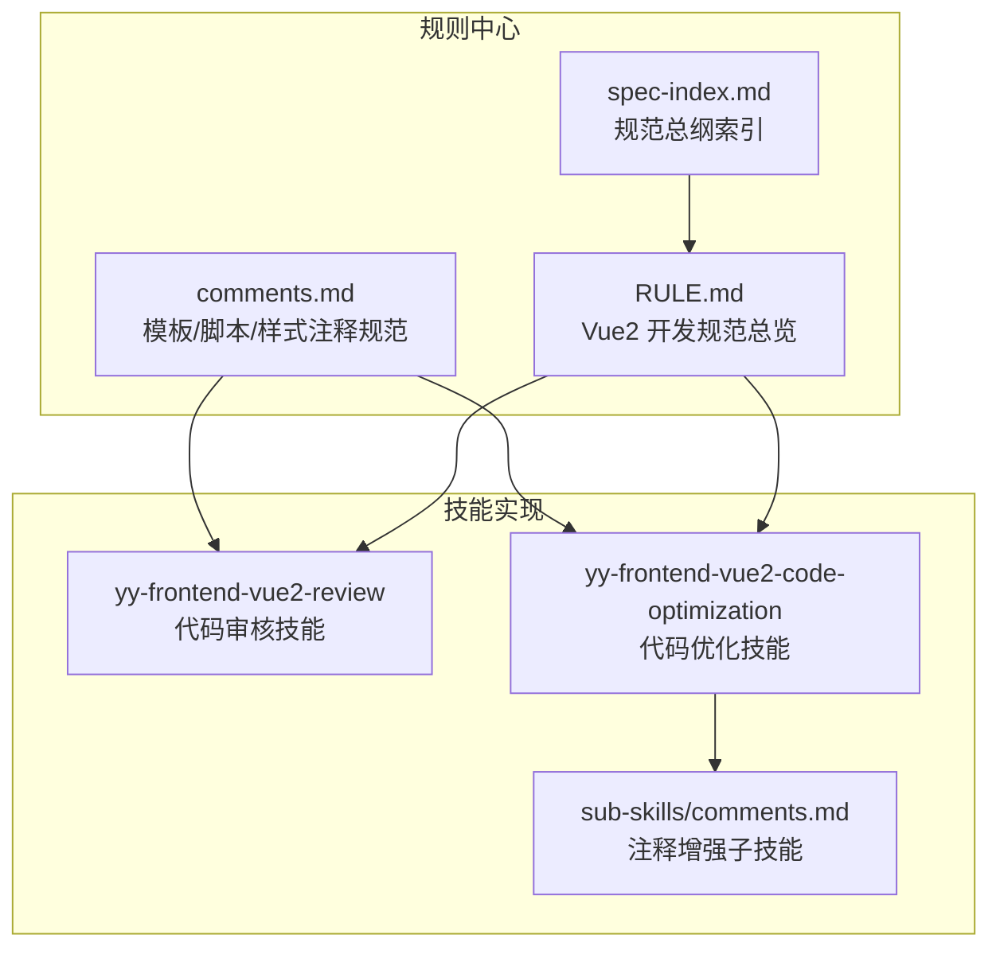
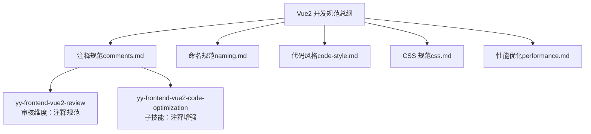
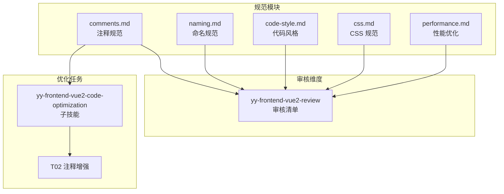

# 注释规范

<cite>
**本文引用的文件**
- [rules/frontend-rules-vue2/references/comments.md](file://rules/frontend-rules-vue2/references/comments.md)
- [skills/yy-frontend-vue2-review/rules/comments.md](file://skills/yy-frontend-vue2-review/rules/comments.md)
- [skills/yy-frontend-vue2-code-optimization/rules/comments.md](file://skills/yy-frontend-vue2-code-optimization/rules/comments.md)
- [skills/yy-frontend-vue2-code-optimization/sub-skills/comments.md](file://skills/yy-frontend-vue2-code-optimization/sub-skills/comments.md)
- [rules/frontend-rules-vue2/RULE.md](file://rules/frontend-rules-vue2/RULE.md)
- [rules/frontend-rules-vue2/references/spec-index.md](file://rules/frontend-rules-vue2/references/spec-index.md)
- [skills/yy-frontend-vue2-review/SKILL.md](file://skills/yy-frontend-vue2-review/SKILL.md)
- [skills/yy-frontend-vue2-code-optimization/SKILL.md](file://skills/yy-frontend-vue2-code-optimization/SKILL.md)
</cite>

## 目录
1. [简介](#简介)
2. [项目结构](#项目结构)
3. [核心组件](#核心组件)
4. [架构概览](#架构概览)
5. [详细组件分析](#详细组件分析)
6. [依赖分析](#依赖分析)
7. [性能考虑](#性能考虑)
8. [故障排除指南](#故障排除指南)
9. [结论](#结论)
10. [附录](#附录)

## 简介
本文件系统性阐述 Vue2 项目的注释规范，涵盖模板区、脚本区、样式区的注释格式要求，以及注释保护原则。规范旨在提升代码可读性、可维护性，降低团队协作成本，并为代码审查提供统一标准。

## 项目结构
Vue2 注释规范相关文件分布于以下位置：
- 规则中心：`rules/frontend-rules-vue2/references/comments.md`
- 技能规则：`skills/yy-frontend-vue2-review/rules/comments.md`、`skills/yy-frontend-vue2-code-optimization/rules/comments.md`
- 子技能：`skills/yy-frontend-vue2-code-optimization/sub-skills/comments.md`
- 总纲索引：`rules/frontend-rules-vue2/RULE.md`、`rules/frontend-rules-vue2/references/spec-index.md`
- 审核技能：`skills/yy-frontend-vue2-review/SKILL.md`
- 优化技能：`skills/yy-frontend-vue2-code-optimization/SKILL.md`

**图表来源**
- [rules/frontend-rules-vue2/references/comments.md:1-106](file://rules/frontend-rules-vue2/references/comments.md#L1-L106)
- [rules/frontend-rules-vue2/RULE.md:1-62](file://rules/frontend-rules-vue2/RULE.md#L1-L62)
- [rules/frontend-rules-vue2/references/spec-index.md:1-61](file://rules/frontend-rules-vue2/references/spec-index.md#L1-L61)
- [skills/yy-frontend-vue2-review/SKILL.md:1-167](file://skills/yy-frontend-vue2-review/SKILL.md#L1-L167)
- [skills/yy-frontend-vue2-code-optimization/SKILL.md:1-415](file://skills/yy-frontend-vue2-code-optimization/SKILL.md#L1-L415)
- [skills/yy-frontend-vue2-code-optimization/sub-skills/comments.md:1-197](file://skills/yy-frontend-vue2-code-optimization/sub-skills/comments.md#L1-L197)

**章节来源**
- [rules/frontend-rules-vue2/RULE.md:1-62](file://rules/frontend-rules-vue2/RULE.md#L1-L62)
- [rules/frontend-rules-vue2/references/spec-index.md:1-61](file://rules/frontend-rules-vue2/references/spec-index.md#L1-L61)

## 核心组件
- 模板区注释：用于标识根节点、循环、条件分支、关键区块、插槽节点、动态组件等，提升模板可读性与可维护性。
- 脚本区注释：包含组件名称、Props、Data、Computed、Watch、Methods、组件引入、provide/inject 等的行内注释，配合顶部 JSDoc 提升方法可读性。
- 样式区注释：模块分组、子模块、响应式区块、全局样式标注，帮助开发者快速定位样式结构。
- 注释保护原则：注释与代码逻辑同步更新，正确注释只增不改，仅在特定情况下允许修改。

**章节来源**
- [rules/frontend-rules-vue2/references/comments.md:7-106](file://rules/frontend-rules-vue2/references/comments.md#L7-L106)
- [skills/yy-frontend-vue2-code-optimization/sub-skills/comments.md:12-35](file://skills/yy-frontend-vue2-code-optimization/sub-skills/comments.md#L12-L35)

## 架构概览
注释规范在整体 Vue2 开发规范体系中的定位如下：
- 作为风格指南模块之一，与命名规范、代码风格、CSS 规范、性能优化等共同构成完整的开发规范框架。
- 在代码审核与代码优化技能中得到具体落地，确保注释质量与一致性。

**图表来源**
- [rules/frontend-rules-vue2/RULE.md:30-36](file://rules/frontend-rules-vue2/RULE.md#L30-L36)
- [rules/frontend-rules-vue2/references/spec-index.md:47-56](file://rules/frontend-rules-vue2/references/spec-index.md#L47-L56)
- [skills/yy-frontend-vue2-review/SKILL.md:70-81](file://skills/yy-frontend-vue2-review/SKILL.md#L70-L81)
- [skills/yy-frontend-vue2-code-optimization/SKILL.md:44-51](file://skills/yy-frontend-vue2-code-optimization/SKILL.md#L44-L51)

## 详细组件分析

### 模板区注释规范
- 根节点注释：使用 `<!-- 组件名称 -->` 标识组件根节点，便于快速定位组件边界。
- 循环节点注释：使用 `<!-- 循环: 描述 -->` 标识 v-for 循环区域，说明循环的数据来源与用途。
- 条件分支注释：使用 `<!-- 条件: 描述 -->` 标识 v-if/v-else-if/v-else 分支，说明判断条件与分支逻辑。
- 关键区块注释：使用 `<!-- 区块名称 -->` 标识重要功能区块，提升模板结构可读性。
- 插槽节点注释：使用 `<!-- 插槽: name -->` 标识具名插槽，说明插槽用途。
- 动态组件注释：使用 `<!-- 动态组件: 描述 -->` 标识动态组件切换区域，说明切换逻辑。

最佳实践：
- 注释应简洁明确，避免冗长描述。
- 与模板结构保持一致，注释位置紧邻对应节点。
- 与业务逻辑保持同步，逻辑变更时及时更新注释。

**章节来源**
- [rules/frontend-rules-vue2/references/comments.md:11-16](file://rules/frontend-rules-vue2/references/comments.md#L11-L16)
- [skills/yy-frontend-vue2-code-optimization/sub-skills/comments.md:36-71](file://skills/yy-frontend-vue2-code-optimization/sub-skills/comments.md#L36-L71)

### 脚本区注释规范
- 组件名称：使用 `// name: 组件名` 标识组件名称，便于快速识别组件职责。
- 组件引入：使用 `// component: 组件名` 标识引入的子组件，说明组件用途。
- Props：使用 `// prop名: 描述` 标识每个 Prop 的含义与用途。
- Data：使用 `// 属性名: 描述` 标识每个数据属性的含义与用途。
- Computed：使用 `// computed: 描述` 标识计算属性的业务含义。
- Watch：使用 `// watch: 描述` 标识监听逻辑的业务含义。
- Methods：使用 `// methods: 描述` 标识方法的业务含义。
- provide/inject：使用 `// 提供的键名: 描述` 或 `// 注入的键名: 描述` 标识依赖注入的键名与用途。

JSDoc 要求：
- 关键方法必须添加 JSDoc，包含方法名称、简要描述、参数类型与描述、返回值类型与描述。
- 中文描述，行内不超过一行，JSDoc 不超过 5 行，无冗余注释。

模板顶部注释更新：
- 每次修改文件时，需在顶部注释中记录改动时间与改动项，采用倒序排列。
- 改动记录格式：`改动时间: YYYY-MM-DD HH:mm:ss`、`改动内容: 具体改动描述`。

最佳实践：
- 注释应与代码逻辑保持同步，逻辑变更时及时更新注释。
- 对于复杂逻辑，优先使用 JSDoc 详细说明方法职责与参数含义。
- 避免重复注释，同一逻辑只需在关键位置添加注释。

**章节来源**
- [rules/frontend-rules-vue2/references/comments.md:24-81](file://rules/frontend-rules-vue2/references/comments.md#L24-L81)
- [skills/yy-frontend-vue2-code-optimization/sub-skills/comments.md:73-152](file://skills/yy-frontend-vue2-code-optimization/sub-skills/comments.md#L73-L152)

### 样式区注释规范
- 模块分组：使用 `/* 模块名称 */` 标识样式模块，说明模块功能与作用范围。
- 子模块：使用 `/* 模块 > 子模块 */` 标识子模块，说明层级关系与功能划分。
- 响应式：使用 `/* 响应式 */` 标识媒体查询区域，说明响应式适配策略。
- 全局样式：非 scoped 样式需标注 `/* 全局 */`，提醒样式影响范围。

最佳实践：
- 注释应与样式结构保持一致，模块化组织样式代码。
- 响应式样式应明确标注，便于后续维护与调试。
- 全局样式需谨慎使用，避免样式污染。

**章节来源**
- [rules/frontend-rules-vue2/references/comments.md:89-92](file://rules/frontend-rules-vue2/references/comments.md#L89-L92)
- [skills/yy-frontend-vue2-code-optimization/sub-skills/comments.md:154-183](file://skills/yy-frontend-vue2-code-optimization/sub-skills/comments.md#L154-L183)

### 注释保护原则
注释与代码逻辑必须同步更新，确保注释的准确性与一致性。保护原则如下：
- 已有注释若正确，只增不改。
- 仅在以下三种情况下可修改注释：
  1) 注释明显错误（与代码实际行为不符）
  2) 业务逻辑已发生实质性变更（旧注释不再适用）
  3) 命名变更导致旧注释引用了不存在的标识符

禁止修改的常见场景：
- 仅因注释风格不同、表述方式有差异但含义一致
- 注释正确但不够详细（应追加而非覆盖）
- 注释中有轻微语法错误但含义清晰的（如错别字但不影响理解）

修改操作规范：
- 属于上述三种情况的修改，仍应保留原有描述的核心含义，仅在原基础上微调
- 不属于上述情况的，一律只增不改——在有注释的代码块附近追加新注释，不触碰旧注释

**章节来源**
- [rules/frontend-rules-vue2/references/comments.md:96-106](file://rules/frontend-rules-vue2/references/comments.md#L96-L106)
- [skills/yy-frontend-vue2-code-optimization/sub-skills/comments.md:12-35](file://skills/yy-frontend-vue2-code-optimization/sub-skills/comments.md#L12-L35)

## 依赖分析
注释规范在整体规范体系中的依赖关系如下：

**图表来源**
- [rules/frontend-rules-vue2/RULE.md:30-36](file://rules/frontend-rules-vue2/RULE.md#L30-L36)
- [skills/yy-frontend-vue2-review/SKILL.md:70-81](file://skills/yy-frontend-vue2-review/SKILL.md#L70-L81)
- [skills/yy-frontend-vue2-code-optimization/SKILL.md:44-51](file://skills/yy-frontend-vue2-code-optimization/SKILL.md#L44-L51)

**章节来源**
- [rules/frontend-rules-vue2/RULE.md:30-36](file://rules/frontend-rules-vue2/RULE.md#L30-L36)
- [skills/yy-frontend-vue2-review/SKILL.md:70-81](file://skills/yy-frontend-vue2-review/SKILL.md#L70-L81)
- [skills/yy-frontend-vue2-code-optimization/SKILL.md:44-51](file://skills/yy-frontend-vue2-code-optimization/SKILL.md#L44-L51)

## 性能考虑
- 注释本身不会直接影响运行时性能，但良好的注释可以提升代码可读性，间接降低维护成本。
- 在大型项目中，规范化的注释有助于快速定位问题，减少调试时间。
- 避免过度注释，保持注释简洁明了，避免冗余信息。

## 故障排除指南
常见问题与解决方案：
- 注释与代码逻辑不一致
  - 现象：注释描述与实际代码行为不符
  - 解决：根据注释保护原则，修改注释以反映真实逻辑
- 注释缺失或过于简单
  - 现象：关键逻辑缺少注释，或注释过于简单
  - 解决：在相应位置添加详细注释，必要时补充 JSDoc
- 注释风格不统一
  - 现象：不同开发者使用不同的注释风格
  - 解决：按照规范统一注释格式，遵循只增不改原则
- 注释维护困难
  - 现象：频繁修改注释导致版本混乱
  - 解决：建立注释更新流程，在代码审查阶段重点关注注释一致性

**章节来源**
- [skills/yy-frontend-vue2-code-optimization/sub-skills/comments.md:12-35](file://skills/yy-frontend-vue2-code-optimization/sub-skills/comments.md#L12-L35)

## 结论
Vue2 注释规范是提升代码质量与团队协作效率的重要保障。通过规范模板区、脚本区、样式区的注释格式，建立严格的注释保护原则，可以有效提升代码可读性、可维护性，并为代码审查与优化提供统一标准。建议团队在日常开发中严格执行本规范，并将其纳入代码审查流程。

## 附录
- 适用范围：所有 src 目录下的 .vue、.js、.css、.scss、.less 文件
- 技术栈：Vue2 单文件组件，使用 Options API
- 相关模块：命名规范、代码风格、CSS 规范、性能优化

**章节来源**
- [rules/frontend-rules-vue2/RULE.md:38-43](file://rules/frontend-rules-vue2/RULE.md#L38-L43)