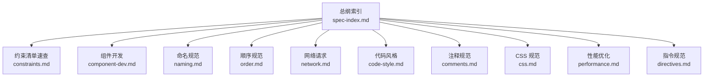
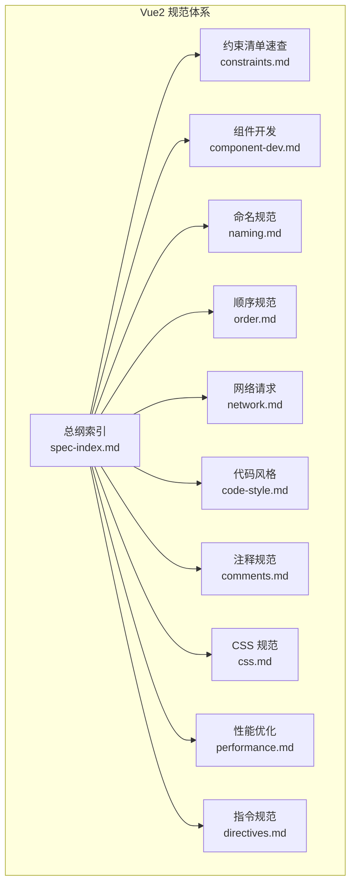
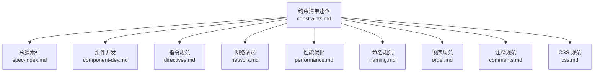

# 约束清单

<cite>
**本文档引用的文件**
- [RULE.md](file://rules/frontend-rules-vue2/RULE.md)
- [constraints.md](file://rules/frontend-rules-vue2/references/constraints.md)
- [spec-index.md](file://rules/frontend-rules-vue2/references/spec-index.md)
- [component-dev.md](file://rules/frontend-rules-vue2/references/component-dev.md)
- [naming.md](file://rules/frontend-rules-vue2/references/naming.md)
- [order.md](file://rules/frontend-rules-vue2/references/order.md)
- [network.md](file://rules/frontend-rules-vue2/references/network.md)
- [code-style.md](file://rules/frontend-rules-vue2/references/code-style.md)
- [comments.md](file://rules/frontend-rules-vue2/references/comments.md)
- [css.md](file://rules/frontend-rules-vue2/references/css.md)
- [performance.md](file://rules/frontend-rules-vue2/references/performance.md)
- [directives.md](file://rules/frontend-rules-vue2/references/directives.md)
- [forbidden.md](file://skills/yy-frontend-vue2-review/references/forbidden.md)
- [constraints.md](file://skills/yy-frontend-vue2-review/rules/constraints.md)
- [constraints.md](file://skills/yy-frontend-vue2-code-optimization/rules/constraints.md)
</cite>

## 目录
1. [简介](#简介)
2. [项目结构](#项目结构)
3. [核心组件](#核心组件)
4. [架构概览](#架构概览)
5. [详细组件分析](#详细组件分析)
6. [依赖分析](#依赖分析)
7. [性能考虑](#性能考虑)
8. [故障排查指南](#故障排查指南)
9. [结论](#结论)
10. [附录](#附录)

## 简介
本文件是 Vue2 约束清单的权威速查与执行指南，面向前端开发者与评审人员，提供“禁止项/推荐项/不推荐项/注意事项”的清晰对照，帮助快速识别规则的强制性与建议性程度，并给出违反后果、例外情况与处理方式。同时提供检查清单与自我审查方法，便于在日常开发与代码评审中高效落地。

## 项目结构
该约束体系由“总纲索引 + 子模块规则”构成，Vue2 约束清单位于总纲索引中的“风格指南”部分，作为“约束清单”模块的入口。核心文件分布如下：
- 总纲索引：定义优先级与模块映射关系
- 约束清单：集中呈现禁止/推荐/不推荐/注意事项
- 相关配套模块：组件开发、命名、顺序、网络、代码风格、注释、CSS、性能、指令等，用于解释约束背景与最佳实践

图表来源
- [spec-index.md:1-61](file://rules/frontend-rules-vue2/references/spec-index.md#L1-L61)
- [constraints.md:1-57](file://rules/frontend-rules-vue2/references/constraints.md#L1-L57)

章节来源
- [RULE.md:1-62](file://rules/frontend-rules-vue2/RULE.md#L1-L62)
- [spec-index.md:1-61](file://rules/frontend-rules-vue2/references/spec-index.md#L1-L61)

## 核心组件
本节聚焦“约束清单速查”，汇总禁止项、推荐项、不推荐项与注意事项，并给出每条规则的强制性等级、具体内容、违反后果、例外与处理方式。

- 禁止项（必须遵守，严重违规）
  - 连续数据解构：禁止深层嵌套解构，避免空指针风险
  - 父组件修改子组件数据：破坏单向数据流，导致状态不可控
  - 修改 data 原始类型：可能引发响应式系统异常
  - 修改 props：违反单向数据流原则
  - 使用 mixins：改用组合式函数或组件组合
  - 无意义命名：禁止无语义的变量名
  - 链式访问 $parent：禁止跨级访问父组件数据
  - v-for 与 v-if 同元素：禁止在同一元素上同时使用
  - index 作为 key：必须使用唯一 ID
  - setTimeout 替代 $nextTick：DOM 更新必须使用 $nextTick

- 推荐项（建议统一，提升一致性）
  - 函数 try/catch：包裹函数内容，catch 中使用警告日志
  - async/await：少用 .then 链式写法
  - computed 优先：能用 computed 解决的不用 data
  - watch 深度/立即监听：按需使用 deep/immediate
  - computed try/catch：必须 try/catch 包裹，避免计算属性报错
  - 减少 data 冗余：优先 computed 派生，减少 data 属性

- 不推荐项（尽量避免，降低复杂度）
  - 多层 try/catch 嵌套：异步操作尽量扁平化
  - 生命周期 emit：不推荐在生命周期中主动向外 emit
  - 可选链操作符 `?.`：不推荐 a?.b?.c，建议使用工具函数替代
  - CSS 嵌套原生写法：不推荐直接使用原生嵌套，需经编译后使用
  - `:has()` 伪类：Safari 15.4-15.6 存在严重渲染 Bug，谨慎使用

- 注意事项
  - 未使用变量：ESLint 已关闭检查，需自行清理无用代码
  - v-html：可使用，但必须防范 XSS 风险
  - props 解构：可以解构（需注意响应式丢失问题）
  - 等于运算符：使用 `==` 不视为问题
  - 注释检查：注释相关问题默认忽略，不进行检查
  - 不要过度封装：简单逻辑直接写在 template 中

- Vue2 响应式陷阱
  - 新增对象属性：使用 $set 或替代方案
  - 数组索引赋值：使用 $set 或替代方案
  - 数组长度修改：使用 splice 或替代方案

章节来源
- [constraints.md:1-57](file://rules/frontend-rules-vue2/references/constraints.md#L1-L57)
- [forbidden.md:1-36](file://skills/yy-frontend-vue2-review/references/forbidden.md#L1-L36)
- [constraints.md:1-57](file://skills/yy-frontend-vue2-review/rules/constraints.md#L1-L57)
- [constraints.md:1-57](file://skills/yy-frontend-vue2-code-optimization/rules/constraints.md#L1-L57)

## 架构概览
约束清单在整体规范中的位置与关联如下：

图表来源
- [spec-index.md:1-61](file://rules/frontend-rules-vue2/references/spec-index.md#L1-L61)
- [constraints.md:1-57](file://rules/frontend-rules-vue2/references/constraints.md#L1-L57)

## 详细组件分析

### 组件开发与交互约束
- Options API 必须使用：data/methods/computed/watch/生命周期钩子
- 组件 name 声明：组件必须声明 name 选项
- v-for 与 key：唯一 ID 作为 key，禁止使用 index
- v-if 与 v-for 冲突：禁止在同一元素上同时使用
- v-html 安全：必须用 DOMPurify 过滤 HTML
- 数据修改限制：禁止修改 props、禁止父组件直接修改子组件内部状态
- 禁止 $parent 链式访问：禁止 $parent.$parent
- Vue2 响应式陷阱：新增对象属性用 $set、数组索引赋值用 $set、数组长度用 splice

章节来源
- [component-dev.md:1-92](file://rules/frontend-rules-vue2/references/component-dev.md#L1-L92)
- [directives.md:1-116](file://rules/frontend-rules-vue2/references/directives.md#L1-L116)
- [spec-index.md:11-25](file://rules/frontend-rules-vue2/references/spec-index.md#L11-L25)

### 命名与结构顺序
- 文件与组件命名：多单词 + PascalCase，目录命名 kebab-case
- 函数命名：API 函数与事件函数采用小驼峰
- 变量与常量：常量全大写 + 下划线，布尔值前缀规范
- SFC 块顺序：template/script/style
- script 内部结构顺序：name/components/props/data/computed/watch/methods/生命周期
- Import 分组：外部依赖/内部全局/内部相对，组内按字母排序

章节来源
- [naming.md:1-73](file://rules/frontend-rules-vue2/references/naming.md#L1-L73)
- [order.md:1-131](file://rules/frontend-rules-vue2/references/order.md#L1-L131)

### 网络请求与安全
- 异步处理：必须使用 async/await，统一 try/catch/finally 结构
- 响应处理：单次解构，禁止连续解构
- 错误处理：禁止空 catch，业务错误在 else 分支记录
- 等于运算符：优先推荐 ==，注释问题默认忽略
- 防止重复提交：loading 状态禁用提交按钮
- 安全规范：v-html 必须 DOMPurify 过滤，敏感数据不在 URL 传 token/密码

章节来源
- [network.md:1-180](file://rules/frontend-rules-vue2/references/network.md#L1-L180)

### 代码风格与注释
- Prettier 配置：统一缩进、引号、分号、行宽、尾随逗号等
- 函数写法偏好：优先箭头函数
- 注释规范：模板/脚本/样式区注释格式与保护原则

章节来源
- [code-style.md:1-63](file://rules/frontend-rules-vue2/references/code-style.md#L1-L63)
- [comments.md:1-106](file://rules/frontend-rules-vue2/references/comments.md#L1-L106)

### CSS 与性能
- CSS 处理：预处理器、格式化、作用域优先 scoped
- CSS 命名：BEM 规范
- 性能优化：组件懒加载、KeepAlive、虚拟滚动、防抖节流、图片优化、模板层轻量化、响应式性能、指令清理、路由守卫清理、过滤器

章节来源
- [css.md:1-63](file://rules/frontend-rules-vue2/references/css.md#L1-L63)
- [performance.md:1-179](file://rules/frontend-rules-vue2/references/performance.md#L1-L179)

### 指令与模板属性顺序
- 指令简写：v-bind → :、v-on → @、v-slot → #
- 模板属性顺序：定义 → v-for → v-if/v-else → v-show → id → props/attrs → v-on → v-html/v-text
- v-model 写法：标准 value + $emit('input')

章节来源
- [directives.md:1-116](file://rules/frontend-rules-vue2/references/directives.md#L1-L116)

## 依赖分析
约束清单与其他模块的耦合关系如下：
- 总纲索引为约束清单提供优先级与模块映射
- 组件开发、指令、网络、性能等模块为约束提供背景与最佳实践支撑
- 命名、顺序、注释、CSS 等模块为约束提供实现细节与落地方法

图表来源
- [constraints.md:1-57](file://rules/frontend-rules-vue2/references/constraints.md#L1-L57)
- [spec-index.md:1-61](file://rules/frontend-rules-vue2/references/spec-index.md#L1-L61)

## 性能考虑
- 响应式陷阱：Vue2 使用 Object.defineProperty，新增属性、数组索引赋值、数组长度修改需使用 $set/splice
- 模板层轻量化：模板只负责展示，避免复杂表达式与昂贵计算
- 防抖节流：搜索（防抖 300ms）、滚动（节流 100ms）、resize（节流）、按钮点击（防抖/锁）
- 虚拟滚动：长列表（100+ 项）使用虚拟滚动，降低渲染开销
- KeepAlive：通过 include/exclude 精确控制缓存范围
- 组件懒加载：大组件与路由页面使用动态导入惰性加载

章节来源
- [performance.md:172-179](file://rules/frontend-rules-vue2/references/performance.md#L172-L179)
- [constraints.md:48-57](file://rules/frontend-rules-vue2/references/constraints.md#L48-L57)

## 故障排查指南
- 违反禁止项的常见症状与处理
  - 连续解构导致空指针：改为单次解构或增加类型守卫
  - 父组件直接修改子组件数据：通过 props 传递或 emit 事件回传
  - 修改 props：改为 data 内部状态或通过计算属性派生
  - v-for 与 v-if 同元素：使用 template 包裹或 computed 预过滤
  - index 作为 key：替换为唯一 ID
  - DOM 更新不生效：使用 $nextTick 包裹

- 推荐项与不推荐项的改进建议
  - try/catch 嵌套：合并为扁平化结构，统一错误处理
  - 生命周期 emit：移至用户交互或业务逻辑中触发
  - 可选链 `?.`：使用工具函数替代，保证兼容性
  - CSS 原生嵌套：使用 PostCSS 编译后再使用
  - `:has()` 伪类：在目标浏览器版本下谨慎使用或提供降级方案

- 注意事项的执行要点
  - v-html：必须使用 DOMPurify 过滤
  - props 解构：注意响应式丢失，必要时在 data 中重建响应式
  - 等于运算符：使用 == 不视为问题，但需明确意图
  - 注释检查：注释与代码同步更新，遵循注释保护原则

章节来源
- [constraints.md:39-47](file://rules/frontend-rules-vue2/references/constraints.md#L39-L47)
- [network.md:157-180](file://rules/frontend-rules-vue2/references/network.md#L157-L180)
- [directives.md:43-61](file://rules/frontend-rules-vue2/references/directives.md#L43-L61)

## 结论
约束清单为 Vue2 开发提供了“禁止/推荐/不推荐/注意事项”的速查与执行依据。结合总纲索引与配套模块，开发者可在日常开发与评审中快速识别风险点、统一代码风格、规避常见陷阱，并通过检查清单与自我审查方法持续改进质量与性能。

## 附录

### 约束执行检查清单
- 开发阶段
  - 是否使用 Options API 并声明 name
  - 是否遵循 SFC 块顺序与 script 内部结构顺序
  - 是否使用正确的 import 分组与模板属性顺序
  - 是否使用 async/await 且统一 try/catch/finally
  - 是否避免连续解构与 props 直接修改
  - 是否正确使用 v-for/key、v-if/v-for 分离、v-html 过滤
  - 是否遵循命名规范（文件/组件/API/事件/常量/布尔值/BEM）
  - 是否使用 computed 优先、watch 深度/立即监听按需使用
  - 是否避免过度封装，模板层轻量化
  - 是否关注响应式陷阱，使用 $set/splice
- 评审阶段
  - 是否满足禁止项要求
  - 是否符合推荐项与不推荐项建议
  - 是否遵循注释规范与注释保护原则
  - 是否满足性能优化建议（懒加载/KeepAlive/虚拟滚动/防抖节流）

### 自我审查方法
- 规则对照：逐条核对约束清单，标记不符合项
- 代码走查：重点检查 props/数据流、v-for/key、v-if/v-for、v-html、命名与结构顺序
- 工具辅助：结合 Prettier、ESLint（注释检查默认忽略）、DOMPurify
- 回归验证：针对响应式陷阱与性能优化进行单元测试与性能测试