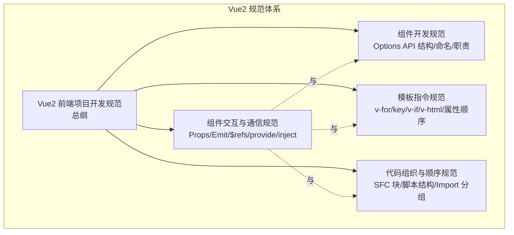
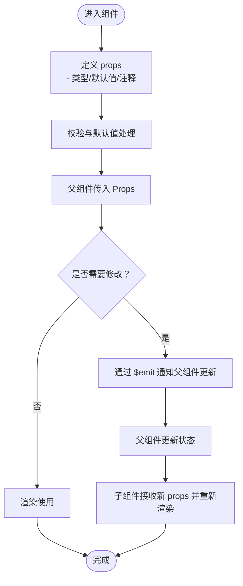
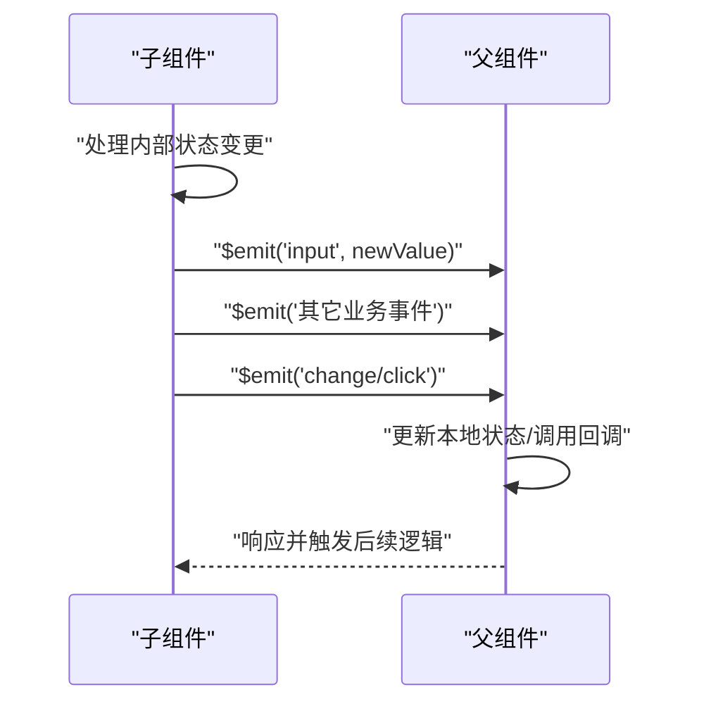
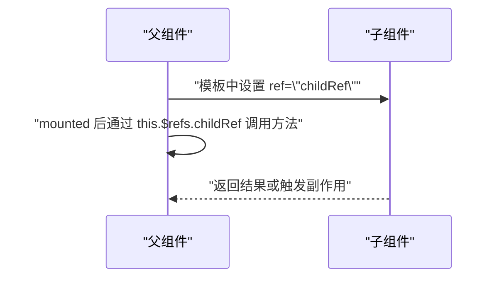
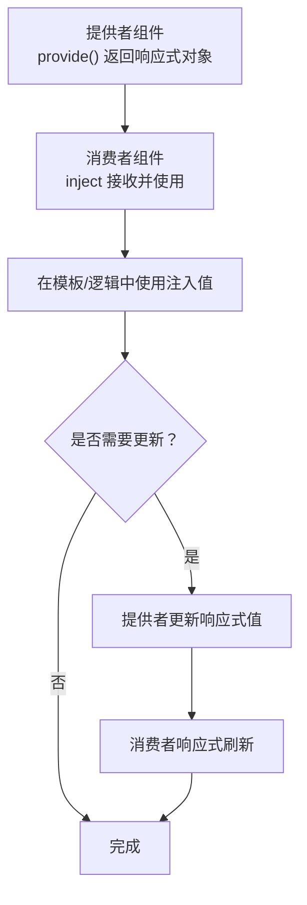
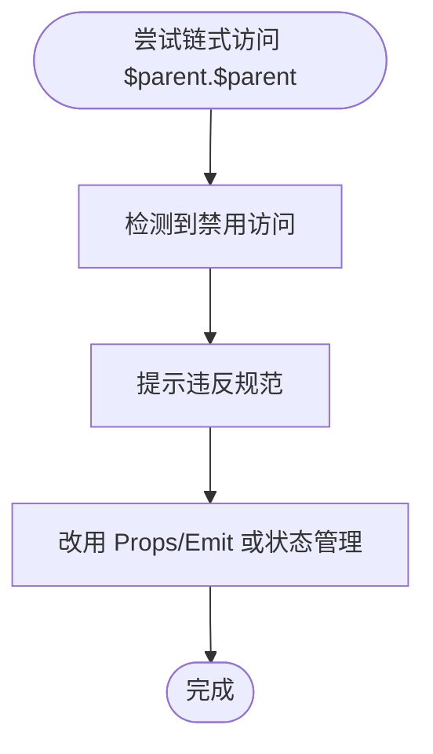
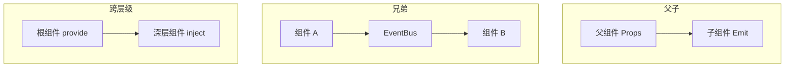
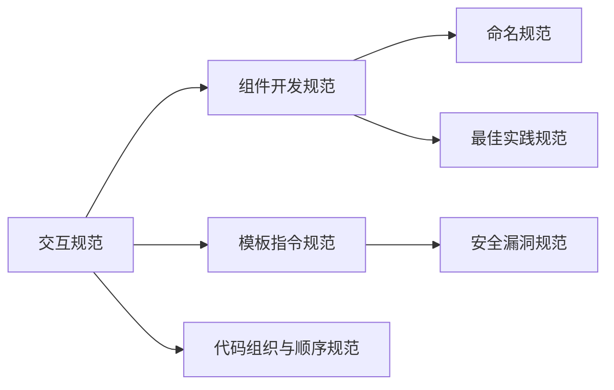

# 组件交互与通信

<cite>
**本文引用的文件**
- [Vue2 组件交互与通信规范](file://rules/frontend-rules-vue2/references/interaction.md)
- [Vue2 组件开发规范](file://rules/frontend-rules-vue2/references/component-dev.md)
- [Vue2 代码组织与顺序规范](file://rules/frontend-rules-vue2/references/order.md)
- [Vue2 模板指令规范](file://rules/frontend-rules-vue2/references/directives.md)
- [Vue2 前端项目开发规范](file://rules/frontend-rules-vue2/RULE.md)
- [Vue2 前端项目开发规范总纲（索引）](file://rules/frontend-rules-vue2/references/spec-index.md)
- [Vue2 组件规范](file://skills/yy-frontend-vue2-review/references/component.md)
- [安全漏洞规范](file://skills/yy-frontend-vue2-review/references/security.md)
- [最佳实践规范](file://skills/yy-frontend-vue2-review/references/best-practice.md)
- [命名规范](file://skills/yy-frontend-vue2-review/references/naming.md)
</cite>

## 目录
1. [简介](#简介)
2. [项目结构](#项目结构)
3. [核心组件](#核心组件)
4. [架构概览](#架构概览)
5. [详细组件分析](#详细组件分析)
6. [依赖分析](#依赖分析)
7. [性能考量](#性能考量)
8. [故障排查指南](#故障排查指南)
9. [结论](#结论)
10. [附录](#附录)

## 简介
本文件系统化梳理 Vue2 组件交互与通信规范，聚焦 Props 定义与验证、Emit 事件白名单、$refs 访问规范、provide/inject 使用场景、$parent 访问限制等关键点，结合父子组件通信、兄弟组件通信、跨层级通信的最佳实践，给出事件处理、状态共享、数据流向的设计模式与安全考虑，帮助团队建立一致、可维护、可扩展的组件交互体系。

## 项目结构
该仓库围绕 Vue2 Options API 风格构建了完善的规范体系，其中“组件交互与通信”作为核心模块之一，与“组件开发规范”“模板指令规范”“代码组织与顺序规范”等协同工作，形成从结构到行为的一致约束。



图表来源
- [Vue2 前端项目开发规范:1-62](file://rules/frontend-rules-vue2/RULE.md#L1-L62)
- [Vue2 组件交互与通信规范:1-130](file://rules/frontend-rules-vue2/references/interaction.md#L1-L130)
- [Vue2 组件开发规范:1-92](file://rules/frontend-rules-vue2/references/component-dev.md#L1-L92)
- [Vue2 模板指令规范:1-116](file://rules/frontend-rules-vue2/references/directives.md#L1-L116)
- [Vue2 代码组织与顺序规范:1-131](file://rules/frontend-rules-vue2/references/order.md#L1-L131)

章节来源
- [Vue2 前端项目开发规范:1-62](file://rules/frontend-rules-vue2/RULE.md#L1-L62)
- [Vue2 前端项目开发规范总纲（索引）:1-61](file://rules/frontend-rules-vue2/references/spec-index.md#L1-L61)

## 核心组件
- Props 定义与验证：明确类型、默认值、注释，保持 camelCase 命名，禁止在子组件内修改 props，确保单向数据流。
- Emit 事件白名单：限定语义化事件名类别与顺序，避免滥用生命周期 emit。
- $refs 访问：父组件通过 $refs 访问子组件公开方法，无需显式暴露。
- provide/inject：仅用于 3 层以上深层传参，避免跨层级滥用；保持响应式传递。
- $parent/$children：禁止链式访问，提升组件独立性，采用 props/emit 或状态管理替代。
- 组件间通信：父子（Props/Emit）、兄弟（Vuex/eventBus）、跨层级（provide/inject）的边界与最佳实践。

章节来源
- [Vue2 组件交互与通信规范:1-130](file://rules/frontend-rules-vue2/references/interaction.md#L1-L130)
- [Vue2 组件开发规范:1-92](file://rules/frontend-rules-vue2/references/component-dev.md#L1-L92)
- [Vue2 组件规范:92-150](file://skills/yy-frontend-vue2-review/references/component.md#L92-L150)

## 架构概览
下图展示 Vue2 组件交互与通信的整体架构，强调 Props 单向数据流、Emit 事件白名单、$refs 父子访问、provide/inject 深层注入以及 $parent 的禁用策略。

```mermaid
graph TB
Parent["父组件"]
Child["子组件"]
Sibling["兄弟组件"]
Store["状态管理Vuex/eventBus"]
Deep["深层组件"]
Parent --> |"Props 输入"| Child
Child --> |"Emit 事件"| Parent
Parent --> |"通过 $refs 访问"| Child
Parent --> |"provide/inject"| Deep
Sibling --> |"Vuex/eventBus"| Sibling
Deep --> |"provide/inject"| Sibling
Parent -.禁用.->|"避免 $parent/$children 链式访问"| Deep
```

图表来源
- [Vue2 组件交互与通信规范:103-130](file://rules/frontend-rules-vue2/references/interaction.md#L103-L130)
- [Vue2 组件开发规范:77-92](file://rules/frontend-rules-vue2/references/component-dev.md#L77-L92)

## 详细组件分析

### Props 定义与验证
- 命名与类型：camelCase 命名，明确 type（String/Number/Boolean/Array/Object/Function），必要时提供默认值；为每个 prop 添加中文注释说明用途。
- 单向数据流：禁止在子组件内修改 props，如需修改父级状态，必须通过 Emit 事件通知父组件。
- 解构注意事项：可对 props 进行解构，但需注意响应式丢失问题，必要时使用计算属性或本地 data 保存派生状态。
- v-model 标准：Vue2 使用 value 配合 input 事件实现双向绑定。



图表来源
- [Vue2 组件交互与通信规范:7-41](file://rules/frontend-rules-vue2/references/interaction.md#L7-L41)
- [Vue2 组件规范:92-128](file://skills/yy-frontend-vue2-review/references/component.md#L92-L128)

章节来源
- [Vue2 组件交互与通信规范:7-41](file://rules/frontend-rules-vue2/references/interaction.md#L7-L41)
- [Vue2 组件规范:92-128](file://skills/yy-frontend-vue2-review/references/component.md#L92-L128)

### Emit 事件白名单与顺序
- 事件白名单：限定 v-model（input）、交互类（change/click/select/expand/clear/remove/add）、弹窗类（open/close/show/hide）、操作类（cancel/confirm/ok/editSuccess/error）等语义化事件名。
- Emit 顺序：建议优先触发 input（v-model 更新），其次业务事件，最后交互反馈事件（change/click）。
- 生命周期限制：基础组件禁止在生命周期中主动 emit；业务组件允许但不推荐在生命周期中 emit。



图表来源
- [Vue2 组件交互与通信规范:44-85](file://rules/frontend-rules-vue2/references/interaction.md#L44-L85)

章节来源
- [Vue2 组件交互与通信规范:44-85](file://rules/frontend-rules-vue2/references/interaction.md#L44-L85)

### $refs 访问规范
- 父组件通过 $refs 访问子组件公开方法，无需子组件显式暴露（与 Vue3 defineExpose 不同）。
- 仅在必要时使用 $refs，优先通过 Props/Emit 实现松耦合通信。
- 避免在模板中过度依赖 $refs，保持模板层轻量化。



图表来源
- [Vue2 组件交互与通信规范:86-99](file://rules/frontend-rules-vue2/references/interaction.md#L86-L99)

章节来源
- [Vue2 组件交互与通信规范:86-99](file://rules/frontend-rules-vue2/references/interaction.md#L86-L99)

### provide/inject 使用场景
- 使用场景：仅用于 3 层以上深层组件传参，避免逐层 props 传递。
- 兄弟组件通信：禁止通过 provide/inject 跨层级滥用，应使用 Vuex 或 eventBus。
- 响应式传递：provide 返回值需保持响应式，避免断开父子组件状态联动。



图表来源
- [Vue2 组件交互与通信规范:105-110](file://rules/frontend-rules-vue2/references/interaction.md#L105-L110)

章节来源
- [Vue2 组件交互与通信规范:105-110](file://rules/frontend-rules-vue2/references/interaction.md#L105-L110)

### $parent/$children 访问限制
- 禁止链式访问父组件数据（如 $parent.$parent），破坏组件独立性。
- 替代方案：使用 Props/Emit 或状态管理（Vuex/eventBus）实现跨层级通信。



图表来源
- [Vue2 组件交互与通信规范:125-130](file://rules/frontend-rules-vue2/references/interaction.md#L125-L130)

章节来源
- [Vue2 组件交互与通信规范:125-130](file://rules/frontend-rules-vue2/references/interaction.md#L125-L130)

### 组件间通信最佳实践
- 父子通信：Props 输入、Emit 输出，保持单向数据流。
- 兄弟通信：使用 Vuex（namespaced:true）或 eventBus，事件名使用小驼峰并在 beforeDestroy 中清理监听器。
- 跨层级通信：provide/inject 仅限 3 层以上深层传参；避免滥用导致耦合度上升。



图表来源
- [Vue2 组件交互与通信规范:103-122](file://rules/frontend-rules-vue2/references/interaction.md#L103-L122)

章节来源
- [Vue2 组件交互与通信规范:103-122](file://rules/frontend-rules-vue2/references/interaction.md#L103-L122)

### 事件处理、状态共享与数据流向设计模式
- 设计模式
  - 父子模式：父组件集中管理状态，子组件通过 Props 接收、Emit 通知，实现单向数据流。
  - 兄弟模式：通过事件总线或状态管理共享状态，避免跨层级耦合。
  - 深层模式：provide/inject 仅用于深层传参，保持响应式与最小暴露面。
- 安全考虑
  - v-html 必须经过安全过滤（如 DOMPurify），避免 XSS。
  - 禁止在前端硬编码敏感信息（密码、密钥、Token、私钥），日志不得输出敏感数据。
  - 避免直接暴露内部接口地址。

章节来源
- [Vue2 模板指令规范:43-61](file://rules/frontend-rules-vue2/references/directives.md#L43-L61)
- [安全漏洞规范:9-32](file://skills/yy-frontend-vue2-review/references/security.md#L9-L32)

## 依赖分析
- 组件交互与通信规范与组件开发规范、模板指令规范、代码组织与顺序规范共同构成 Vue2 开发的“交互—结构—指令—顺序”四维约束。
- 事件总线与状态管理（Vuex/eventBus）在兄弟与跨层级通信中承担重要角色，需配合命名规范与生命周期清理机制。



图表来源
- [Vue2 组件交互与通信规范:1-130](file://rules/frontend-rules-vue2/references/interaction.md#L1-L130)
- [Vue2 组件开发规范:1-92](file://rules/frontend-rules-vue2/references/component-dev.md#L1-L92)
- [Vue2 模板指令规范:1-116](file://rules/frontend-rules-vue2/references/directives.md#L1-L116)
- [Vue2 代码组织与顺序规范:1-131](file://rules/frontend-rules-vue2/references/order.md#L1-L131)
- [命名规范:1-35](file://skills/yy-frontend-vue2-review/references/naming.md#L1-L35)
- [最佳实践规范:1-107](file://skills/yy-frontend-vue2-review/references/best-practice.md#L1-L107)
- [安全漏洞规范:1-32](file://skills/yy-frontend-vue2-review/references/security.md#L1-L32)

章节来源
- [Vue2 前端项目开发规范总纲（索引）:1-61](file://rules/frontend-rules-vue2/references/spec-index.md#L1-L61)

## 性能考量
- 模板层轻量化：模板只负责展示，避免复杂表达式与逻辑，简单逻辑可内联，昂贵计算优先使用 computed。
- 防抖节流：搜索（防抖 300ms）、滚动（节流 100ms）、resize（节流）、按钮点击（防抖/锁）。
- KeepAlive：通过 include/exclude 精确控制缓存范围，避免内存泄漏。
- 虚拟滚动：长列表（100+ 项）使用虚拟滚动，降低渲染开销。
- 响应式性能：优先使用 computed 派生状态，大数据使用 Object.freeze 冻结响应式，避免在 watch 中执行同步 DOM 操作。

章节来源
- [Vue2 性能优化规范:1-179](file://rules/frontend-rules-vue2/references/performance.md#L1-L179)

## 故障排查指南
- 常见问题
  - Props 被子组件修改：检查是否存在直接赋值 props 的代码，改为 Emit 通知父组件更新。
  - 生命周期中滥用 Emit：基础组件禁止在生命周期中主动 Emit；业务组件允许但不推荐。
  - $parent 链式访问：替换为 Props/Emit 或状态管理。
  - v-html 导致 XSS：确保内容经过安全过滤或来自可信来源。
  - 兄弟组件通信泄漏：使用 eventBus 时在 beforeDestroy 中清理监听器。
- 审核要点
  - Props 注释与类型是否齐全。
  - Emit 事件名是否符合白名单与顺序。
  - $refs 使用是否必要且合理。
  - provide/inject 是否仅用于深层传参且保持响应式。
  - 是否存在硬编码敏感信息或日志输出敏感数据。

章节来源
- [Vue2 组件交互与通信规范:1-130](file://rules/frontend-rules-vue2/references/interaction.md#L1-L130)
- [安全漏洞规范:25-32](file://skills/yy-frontend-vue2-review/references/security.md#L25-L32)

## 结论
通过 Props/Emit/$refs/provide/inject/$parent 的规范化使用，结合兄弟与跨层级通信的最佳实践，可有效提升组件的独立性、可维护性与安全性。建议在团队内统一规范执行，配合命名、注释、顺序与性能优化等配套规范，持续提升整体代码质量与协作效率。

## 附录
- 术语
  - Props：父组件向子组件传递的只读属性。
  - Emit：子组件向父组件发出的事件通知。
  - $refs：父组件访问子组件实例的引用。
  - provide/inject：跨层级传递响应式数据。
  - eventBus：组件间事件总线通信。
  - Vuex：集中式状态管理模式与工具。
- 参考文件
  - [Vue2 组件交互与通信规范:1-130](file://rules/frontend-rules-vue2/references/interaction.md#L1-L130)
  - [Vue2 组件开发规范:1-92](file://rules/frontend-rules-vue2/references/component-dev.md#L1-L92)
  - [Vue2 模板指令规范:1-116](file://rules/frontend-rules-vue2/references/directives.md#L1-L116)
  - [Vue2 代码组织与顺序规范:1-131](file://rules/frontend-rules-vue2/references/order.md#L1-L131)
  - [Vue2 前端项目开发规范总纲（索引）:1-61](file://rules/frontend-rules-vue2/references/spec-index.md#L1-L61)
  - [Vue2 组件规范:1-195](file://skills/yy-frontend-vue2-review/references/component.md#L1-L195)
  - [命名规范:1-35](file://skills/yy-frontend-vue2-review/references/naming.md#L1-L35)
  - [最佳实践规范:1-107](file://skills/yy-frontend-vue2-review/references/best-practice.md#L1-L107)
  - [安全漏洞规范:1-32](file://skills/yy-frontend-vue2-review/references/security.md#L1-L32)