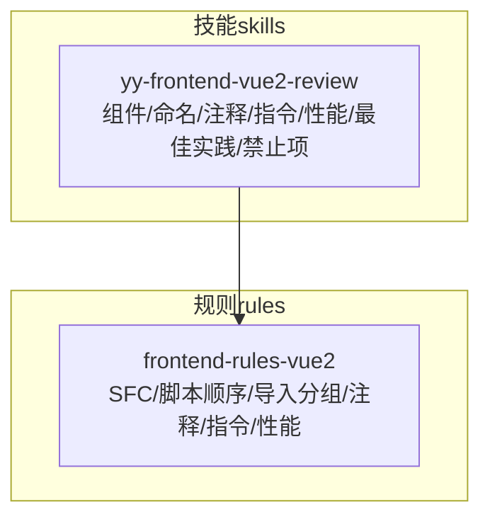
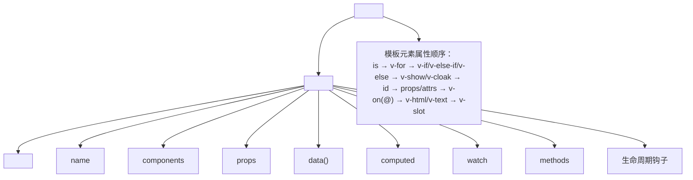
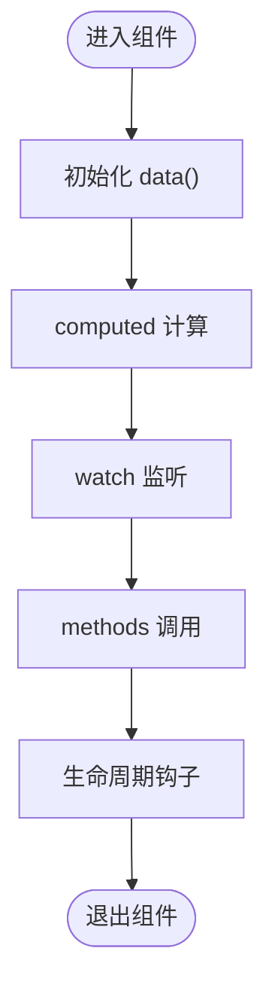
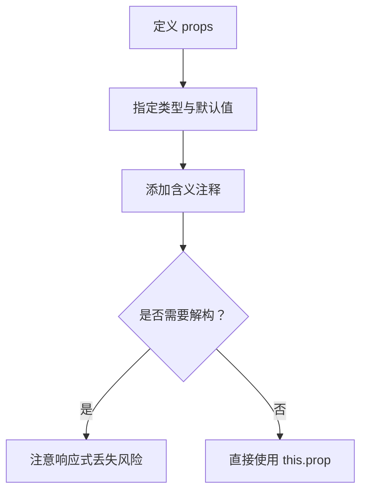
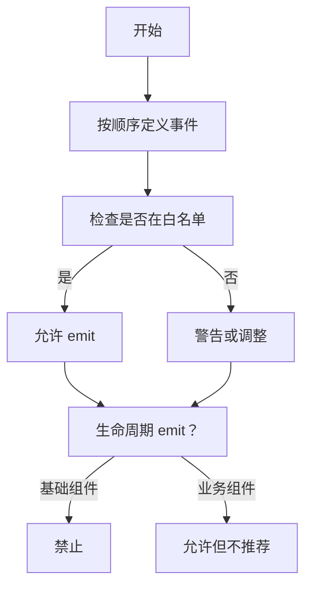
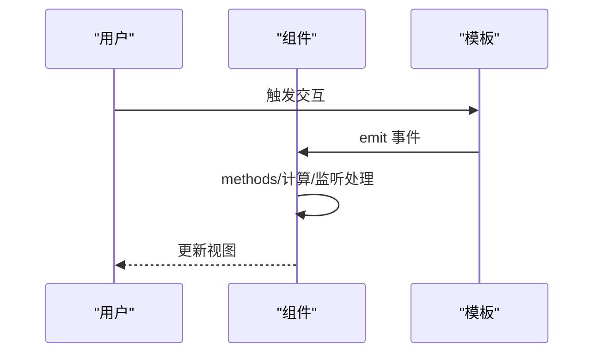
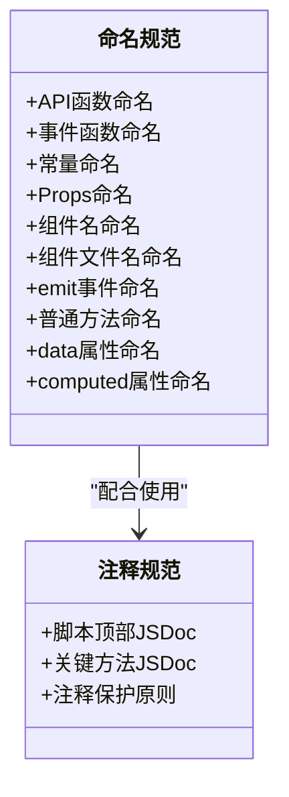
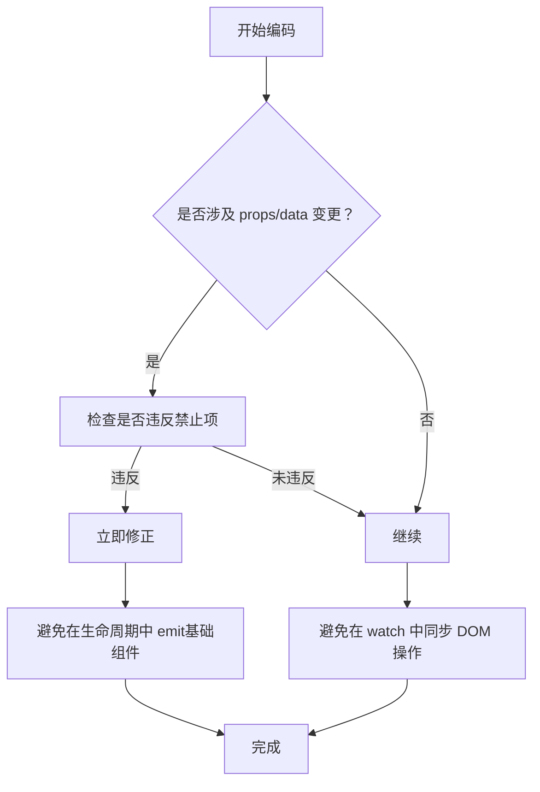
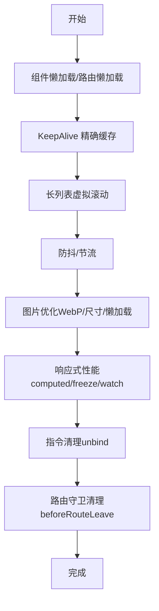

# 组件开发规范

<cite>
**本文档引用的文件**
- [component.md](file://skills/yy-frontend-vue2-review/references/component.md)
- [order.md](file://skills/yy-frontend-vue2-review/rules/order.md)
- [code-style.md](file://skills/yy-frontend-vue2-review/references/code-style.md)
- [naming.md](file://skills/yy-frontend-vue2-review/references/naming.md)
- [computed.md](file://skills/yy-frontend-vue2-review/references/computed.md)
- [best-practice.md](file://skills/yy-frontend-vue2-review/references/best-practice.md)
- [forbidden.md](file://skills/yy-frontend-vue2-review/references/forbidden.md)
- [comments.md](file://rules/frontend-rules-vue2/references/comments.md)
- [directives.md](file://rules/frontend-rules-vue2/references/directives.md)
- [performance.md](file://rules/frontend-rules-vue2/references/performance.md)
</cite>

## 目录
1. [简介](#简介)
2. [项目结构](#项目结构)
3. [核心组件](#核心组件)
4. [架构总览](#架构总览)
5. [详细组件分析](#详细组件分析)
6. [依赖关系分析](#依赖关系分析)
7. [性能考量](#性能考量)
8. [故障排查指南](#故障排查指南)
9. [结论](#结论)
10. [附录](#附录)

## 简介
本规范面向 Vue2 Options API 组件开发，系统阐述组件结构设计、命名与注释、元素排列顺序、职责划分与页面拆分策略，并给出最佳实践与常见反模式的规避方法。规范来源于仓库内“前端 Vue2 审核技能”与“前端 Vue2 规则集”的参考文件，确保团队在大型项目中保持一致性与可维护性。

## 项目结构
本仓库围绕“技能”与“规则”两条主线组织：
- 技能（skills）：提供评审、优化、代码规范等“技能”，其中 Vue2 审核技能包含组件规范、命名规范、注释规范、指令规范、性能规范等参考文件。
- 规则（rules）：提供前端 Vue2 规则集，包含 SFC 块顺序、脚本内部结构顺序、导入分组、注释、指令、性能等参考文件。

## 核心组件
本节聚焦 Options API 的组件结构与职责划分，依据规范文件总结如下要点：

- 组件结构顺序（脚本 export default 内部）：
  1) name
  2) components
  3) props
  4) data()
  5) computed
  6) watch
  7) methods
  8) 生命周期钩子（created/mounted/beforeDestroy/destroyed 等）

- 生命周期标准顺序：
  beforeCreate → created → beforeMount → mounted → beforeUpdate → updated → activated → deactivated → beforeDestroy → destroyed

- 模板元素特性顺序（HTML 元素属性）：
  is → v-for → v-if/v-else-if/v-else → v-show/v-cloak → id → props/attrs → v-on(@) → v-html/v-text → v-slot

- Props 规范：
  - 命名：camelCase（JS 侧），模板中自动转为 kebab-case
  - 类型：必须明确指定（String/Number/Boolean/Array/Object/Function），建议提供默认值（非 required）
  - 注释：必须添加含义注释说明用途

- Emit 事件规范：
  - 顺序：input → 其它自定义事件 → change/click 等交互事件
  - 白名单：交互类（change/click/select/expand/input/clear/remove/add）、弹窗类（open/close/show/hide）、操作类（cancel/confirm/ok/editSuccess/error）
  - 生命周期 emit 限制：基础组件禁止在生命周期中 emit；业务组件允许但不推荐

- v-slot 语法：
  - 使用动态风格（# 或 v-slot:），避免废弃语法（如 slot="header"）

- 组件命名：
  - 模板引用：PascalCase（如 <UserList />）
  - 文件名：多个单词 + PascalCase（如 UserList.vue）

- data/computed 使用原则：
  - 除后端交互与定时器外，尽量使用 computed

- 模块化原则：
  - 单一职责、高内聚低耦合，超过 500 行应考虑拆分

章节来源
- [component.md:11-49](file://skills/yy-frontend-vue2-review/references/component.md#L11-L49)
- [component.md:22-24](file://skills/yy-frontend-vue2-review/references/component.md#L22-L24)
- [component.md:62-88](file://skills/yy-frontend-vue2-review/references/component.md#L62-L88)
- [component.md:92-128](file://skills/yy-frontend-vue2-review/references/component.md#L92-L128)
- [component.md:132-150](file://skills/yy-frontend-vue2-review/references/component.md#L132-L150)
- [component.md:153-176](file://skills/yy-frontend-vue2-review/references/component.md#L153-L176)
- [component.md:179-183](file://skills/yy-frontend-vue2-review/references/component.md#L179-L183)
- [component.md:186-195](file://skills/yy-frontend-vue2-review/references/component.md#L186-L195)

## 架构总览
下图展示一个典型 Vue2 组件从 SFC 块到脚本内部结构的组织方式，以及模板元素属性的排列顺序。

图表来源
- [order.md:7-12](file://skills/yy-frontend-vue2-review/rules/order.md#L7-L12)
- [order.md:15-29](file://skills/yy-frontend-vue2-review/rules/order.md#L15-L29)
- [directives.md:85-102](file://rules/frontend-rules-vue2/references/directives.md#L85-L102)

章节来源
- [order.md:7-12](file://skills/yy-frontend-vue2-review/rules/order.md#L7-L12)
- [order.md:15-29](file://skills/yy-frontend-vue2-review/rules/order.md#L15-L29)
- [directives.md:85-102](file://rules/frontend-rules-vue2/references/directives.md#L85-L102)

## 详细组件分析

### Options API 结构与职责划分
- data()：组件内部状态，应保持最小必要性，避免复杂逻辑。
- computed：派生状态与简单计算，必须使用 try/catch 包裹，失败时返回合理默认值。
- watch：用于副作用与跨字段联动，避免在 watch 中执行同步 DOM 操作。
- methods：封装可复用的业务逻辑与交互处理。
- 生命周期钩子：按标准顺序组织，避免在 created/mounted 中做重型任务，必要时拆分到业务方法中。

图表来源
- [order.md:17-29](file://skills/yy-frontend-vue2-review/rules/order.md#L17-L29)
- [computed.md:9-24](file://skills/yy-frontend-vue2-review/references/computed.md#L9-L24)

章节来源
- [order.md:17-29](file://skills/yy-frontend-vue2-review/rules/order.md#L17-L29)
- [computed.md:9-24](file://skills/yy-frontend-vue2-review/references/computed.md#L9-L24)

### Props 设计与注释规范
- 命名与类型：camelCase + 明确类型 + 默认值（非 required）
- 注释：每个 props 必须添加含义注释，说明用途
- 使用建议：可解构，但需注意响应式丢失问题

图表来源
- [component.md:92-128](file://skills/yy-frontend-vue2-review/references/component.md#L92-L128)
- [best-practice.md:104-107](file://skills/yy-frontend-vue2-review/references/best-practice.md#L104-L107)

章节来源
- [component.md:92-128](file://skills/yy-frontend-vue2-review/references/component.md#L92-L128)
- [best-practice.md:104-107](file://skills/yy-frontend-vue2-review/references/best-practice.md#L104-L107)

### Emit 事件白名单与生命周期限制
- 事件顺序：input → 其它自定义事件 → change/click 等交互事件
- 白名单：交互类、弹窗类、操作类
- 生命周期限制：基础组件禁止在生命周期中 emit；业务组件允许但不推荐

图表来源
- [component.md:132-150](file://skills/yy-frontend-vue2-review/references/component.md#L132-L150)

章节来源
- [component.md:132-150](file://skills/yy-frontend-vue2-review/references/component.md#L132-L150)

### v-slot 语法与模板指令
- v-slot：使用动态风格（# 或 v-slot:），避免废弃语法
- 模板属性顺序：is → v-for → v-if/v-else-if/v-else → v-show/v-cloak → id → props/attrs → v-on(@) → v-html/v-text
- v-for 与 key：必须使用唯一 ID，禁止使用 index
- v-if 与 v-for 冲突：禁止在同一元素上同时使用，可通过 template 包裹或 computed 预过滤
- v-html 安全：必须使用 DOMPurify 过滤 HTML，防止 XSS

图表来源
- [directives.md:85-102](file://rules/frontend-rules-vue2/references/directives.md#L85-L102)
- [directives.md:7-18](file://rules/frontend-rules-vue2/references/directives.md#L7-L18)
- [directives.md:22-40](file://rules/frontend-rules-vue2/references/directives.md#L22-L40)
- [directives.md:43-61](file://rules/frontend-rules-vue2/references/directives.md#L43-L61)

章节来源
- [directives.md:85-102](file://rules/frontend-rules-vue2/references/directives.md#L85-L102)
- [directives.md:7-18](file://rules/frontend-rules-vue2/references/directives.md#L7-L18)
- [directives.md:22-40](file://rules/frontend-rules-vue2/references/directives.md#L22-L40)
- [directives.md:43-61](file://rules/frontend-rules-vue2/references/directives.md#L43-L61)

### 命名与注释规范
- 命名规则表：API 函数、事件函数、常量、Props、组件名、组件文件名、emit 事件、普通方法、data 属性、computed 属性均有明确规范
- computed 属性前缀约定：is/has/visible/show/formatted/parsed/total/count 等
- JSDoc：脚本顶部 JSDoc 与关键方法 JSDoc 必须，中文描述、行内不超过一行、JSDoc 不超过 5 行
- 注释保护原则：逻辑变更时注释必须同步更新；正确注释只增不改

图表来源
- [naming.md:9-35](file://skills/yy-frontend-vue2-review/references/naming.md#L9-L35)
- [comments.md:34-82](file://rules/frontend-rules-vue2/references/comments.md#L34-L82)

章节来源
- [naming.md:9-35](file://skills/yy-frontend-vue2-review/references/naming.md#L9-L35)
- [comments.md:34-82](file://rules/frontend-rules-vue2/references/comments.md#L34-L82)

### 绝对禁止项与常见反模式
- 禁止项清单：连续解构、直接修改子组件数据、修改 data 类型、直接修改 props
- 反模式规避：避免在 watch 中同步 DOM 操作；避免在 created/mounted 中做重型任务；避免在生命周期中 emit（基础组件）

图表来源
- [forbidden.md:9-36](file://skills/yy-frontend-vue2-review/references/forbidden.md#L9-L36)
- [component.md:146-150](file://skills/yy-frontend-vue2-review/references/component.md#L146-L150)

章节来源
- [forbidden.md:9-36](file://skills/yy-frontend-vue2-review/references/forbidden.md#L9-L36)
- [component.md:146-150](file://skills/yy-frontend-vue2-review/references/component.md#L146-L150)

## 依赖关系分析
- SFC 块顺序：template → script → style scoped
- Import 分组（3 组）：外部依赖（node_modules）→ 内部全局（@src/）→ 内部相对（./../）
- 组内按字母顺序排序，组间空一行

图表来源
- [order.md:104-131](file://skills/yy-frontend-vue2-review/rules/order.md#L104-L131)

章节来源
- [order.md:104-131](file://skills/yy-frontend-vue2-review/rules/order.md#L104-L131)

## 性能考量
- 优化速查：组件懒加载、KeepAlive、路由懒加载、虚拟滚动、防抖节流、图片优化、响应式性能、指令清理、过滤器
- 防抖/节流：搜索（防抖 300ms）、滚动（节流 100ms）、resize（节流）、按钮点击（防抖/锁）
- 响应式性能：优先使用 computed、大数据 Object.freeze、避免在 watch 中同步 DOM 操作
- 指令清理：unbind 钩子中清理事件监听与定时器
- 路由守卫清理：beforeRouteLeave 清理定时器、取消未完成请求、关闭弹窗

图表来源
- [performance.md:7-21](file://rules/frontend-rules-vue2/references/performance.md#L7-L21)
- [performance.md:75-99](file://rules/frontend-rules-vue2/references/performance.md#L75-L99)
- [performance.md:123-128](file://rules/frontend-rules-vue2/references/performance.md#L123-L128)
- [performance.md:131-144](file://rules/frontend-rules-vue2/references/performance.md#L131-L144)
- [performance.md:148-152](file://rules/frontend-rules-vue2/references/performance.md#L148-L152)

章节来源
- [performance.md:7-21](file://rules/frontend-rules-vue2/references/performance.md#L7-L21)
- [performance.md:75-99](file://rules/frontend-rules-vue2/references/performance.md#L75-L99)
- [performance.md:123-128](file://rules/frontend-rules-vue2/references/performance.md#L123-L128)
- [performance.md:131-144](file://rules/frontend-rules-vue2/references/performance.md#L131-L144)
- [performance.md:148-152](file://rules/frontend-rules-vue2/references/performance.md#L148-L152)

## 故障排查指南
- 调试代码清理：提交前清理 console.log/debugger/alert；catch 块中的 console.warn 允许保留
- 样式规范：BEM 命名、scoped 作用域、::v-deep 穿透、嵌套不超过 3 层
- CSS 兼容性：使用 Autoprefixer + PostCSS 自动补齐前缀；使用 @supports 渐进增强
- 未使用变量：需自行清理（ESLint 已关闭检查，但审核需指出）
- Props 解构：可解构，注意响应式丢失问题

章节来源
- [best-practice.md:9-20](file://skills/yy-frontend-vue2-review/references/best-practice.md#L9-L20)
- [best-practice.md:23-48](file://skills/yy-frontend-vue2-review/references/best-practice.md#L23-L48)
- [best-practice.md:66-86](file://skills/yy-frontend-vue2-review/references/best-practice.md#L66-L86)
- [best-practice.md:98-107](file://skills/yy-frontend-vue2-review/references/best-practice.md#L98-L107)

## 结论
本规范以 Options API 为核心，围绕组件结构顺序、命名与注释、模板元素属性顺序、Props/Emit 设计、v-slot 语法、性能优化与禁用项等方面形成完整体系。遵循上述规范可显著提升组件的可读性、可维护性与运行效率，建议在团队内作为基线标准执行，并结合项目实际情况持续演进。

## 附录
- 代码风格：缩进 2 空格、单引号、分号、行宽 120 字符、尾随逗号、箭头函数、对象花括号间距、导入分组与排序
- Prettier 配置参考：半角分号、单引号、尾随逗号、箭头函数括号策略、括号间距、打印宽度 120、制表符宽度 2

章节来源
- [code-style.md:9-95](file://skills/yy-frontend-vue2-review/references/code-style.md#L9-L95)