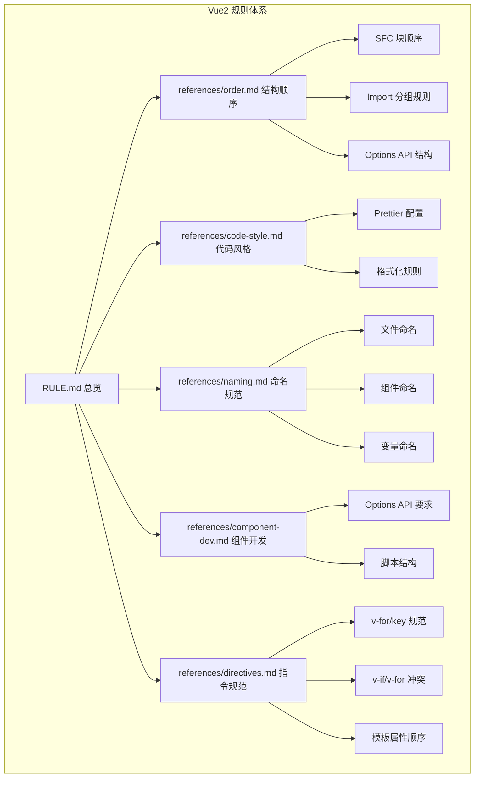
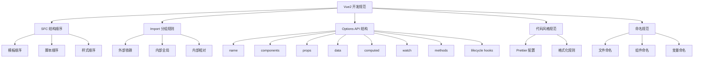
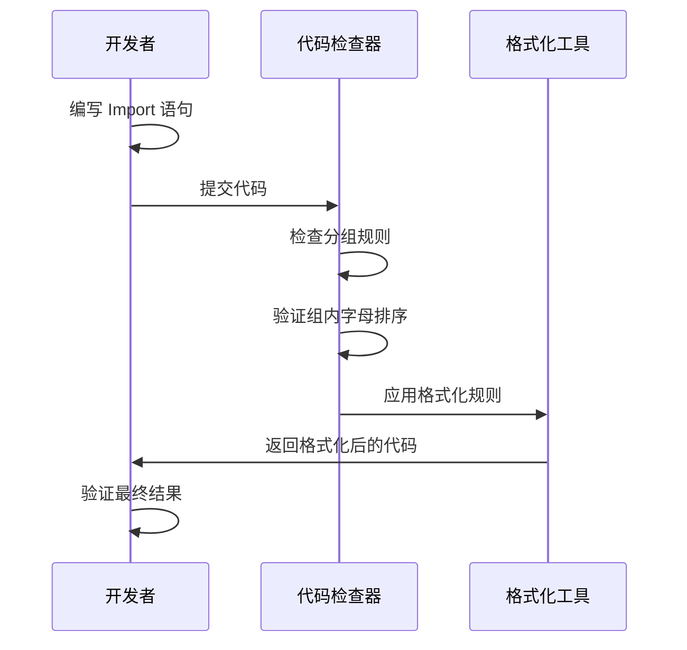
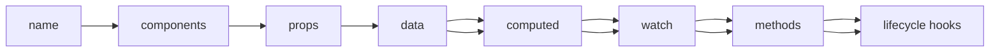
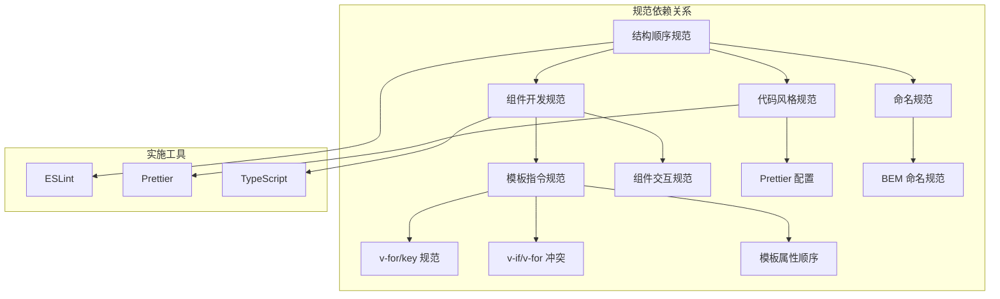

# 结构顺序

<cite>
**本文档引用的文件**
- [rules/frontend-rules-vue2/references/order.md](file://rules/frontend-rules-vue2/references/order.md)
- [rules/frontend-rules-vue2/references/code-style.md](file://rules/frontend-rules-vue2/references/code-style.md)
- [rules/frontend-rules-vue2/references/naming.md](file://rules/frontend-rules-vue2/references/naming.md)
- [rules/frontend-rules-vue2/references/component-dev.md](file://rules/frontend-rules-vue2/references/component-dev.md)
- [rules/frontend-rules-vue2/references/directives.md](file://rules/frontend-rules-vue2/references/directives.md)
- [rules/frontend-rules-vue2/RULE.md](file://rules/frontend-rules-vue2/RULE.md)
- [rules/frontend-rules-vue2/references/spec-index.md](file://rules/frontend-rules-vue2/references/spec-index.md)
</cite>

## 目录
1. [简介](#简介)
2. [项目结构](#项目结构)
3. [核心组件](#核心组件)
4. [架构概览](#架构概览)
5. [详细组件分析](#详细组件分析)
6. [依赖分析](#依赖分析)
7. [性能考虑](#性能考虑)
8. [故障排除指南](#故障排除指南)
9. [结论](#结论)

## 简介

本文档详细阐述了 Vue2 单文件组件（SFC）的结构顺序规范，这是确保代码可维护性、可读性和团队协作效率的关键基础。该规范涵盖了三个核心方面：

- **SFC 块顺序**：模板、脚本、样式的作用域顺序
- **Import 分组**：外部依赖、内部全局、内部相对的三组分组规则
- **Options API 结构顺序**：脚本内部八个选项段的排列规范

这些规范不仅提高了代码的可读性，更重要的是建立了团队协作的统一标准，减少了代码审查中的争议，提升了整体开发效率。

## 项目结构

该项目采用模块化的规则管理结构，专门为 Vue2 前端开发制定了完整的规范体系：



**图表来源**
- [rules/frontend-rules-vue2/RULE.md:1-62](file://rules/frontend-rules-vue2/RULE.md#L1-L62)
- [rules/frontend-rules-vue2/references/spec-index.md:1-61](file://rules/frontend-rules-vue2/references/spec-index.md#L1-L61)

**章节来源**
- [rules/frontend-rules-vue2/RULE.md:1-62](file://rules/frontend-rules-vue2/RULE.md#L1-L62)
- [rules/frontend-rules-vue2/references/spec-index.md:1-61](file://rules/frontend-rules-vue2/references/spec-index.md#L1-L61)

## 核心组件

### SFC 块顺序规范

Vue2 单文件组件的三个主要块必须按照严格的顺序排列：

1. **`<template>`** - 模板区域
2. **`<script>`** - 脚本逻辑区域  
3. **`<style scoped>`** - 作用域样式区域

这种顺序确保了从上到下的逻辑流向，便于开发者快速理解组件的结构和功能。

### Import 分组规则（三组）

Import 语句必须分为三个清晰的组别，每组之间用空行分隔，组内按字母顺序排序：

#### 第一组：外部依赖
- **优先级**：最高
- **包含**：`vue`、`dayjs`、`lodash` 等第三方库
- **特点**：来自 `node_modules` 的包

#### 第二组：内部全局依赖
- **路径前缀**：`@src/` 开头
- **包含**：项目内部的全局模块、API、常量、组件等

#### 第三组：内部相对依赖
- **路径前缀**：`./` 或 `../` 开头
- **包含**：同级或上级目录的本地模块

**排序原则**：外部优先 → 全局在前 → 相对在后 → 组内按字母顺序

**章节来源**
- [rules/frontend-rules-vue2/references/order.md:104-131](file://rules/frontend-rules-vue2/references/order.md#L104-L131)

### Options API 结构顺序（八段）

`<script>` 内部的选项必须按照以下宏观顺序排列：

1. **`name`** - 组件名称声明
2. **`components`** - 局部组件注册
3. **`props`** - 父组件传入属性定义
4. **`data()`** - 组件内部状态
5. **`computed`** - 计算属性
6. **`watch`** - 侦听器
7. **`methods`** - 方法集合
8. **生命周期钩子** - `created`、`mounted`、`beforeDestroy`、`destroyed` 等

这种顺序体现了从基础配置到高级功能的渐进式设计，便于开发者快速定位所需功能。

**章节来源**
- [rules/frontend-rules-vue2/references/order.md:15-100](file://rules/frontend-rules-vue2/references/order.md#L15-L100)
- [rules/frontend-rules-vue2/references/component-dev.md:12-18](file://rules/frontend-rules-vue2/references/component-dev.md#L12-L18)

## 架构概览

整个 Vue2 结构顺序规范体系采用了分层架构设计，确保各个规范模块之间的协调统一：



**图表来源**
- [rules/frontend-rules-vue2/references/order.md:1-131](file://rules/frontend-rules-vue2/references/order.md#L1-L131)
- [rules/frontend-rules-vue2/references/code-style.md:1-63](file://rules/frontend-rules-vue2/references/code-style.md#L1-L63)
- [rules/frontend-rules-vue2/references/naming.md:1-73](file://rules/frontend-rules-vue2/references/naming.md#L1-L73)

## 详细组件分析

### Import 分组实现细节

Import 分组规则的实现需要考虑以下几个关键因素：

#### 分组边界识别
- **外部依赖**：通过包名模式识别，如 `vue`、`lodash`、`dayjs`
- **内部全局**：以 `@src/` 作为路径前缀
- **内部相对**：以 `./` 或 `../` 作为路径前缀

#### 排序算法
1. **组间排序**：外部 > 全局 > 相对
2. **组内排序**：按字母顺序排序
3. **稳定性**：保持相对位置不变

#### 实际应用示例



**图表来源**
- [rules/frontend-rules-vue2/references/order.md:104-131](file://rules/frontend-rules-vue2/references/order.md#L104-L131)

**章节来源**
- [rules/frontend-rules-vue2/references/order.md:104-131](file://rules/frontend-rules-vue2/references/order.md#L104-L131)

### Options API 结构组织

Options API 的结构组织体现了 Vue2 组件开发的最佳实践：

#### 数据流设计


**图表来源**
- [rules/frontend-rules-vue2/references/order.md:17-28](file://rules/frontend-rules-vue2/references/order.md#L17-L28)

#### 生命周期钩子最佳实践
- **created**：初始化数据、订阅事件
- **mounted**：DOM 操作、第三方库集成
- **beforeDestroy**：清理资源、取消订阅
- **destroyed**：最终清理

**章节来源**
- [rules/frontend-rules-vue2/references/order.md:87-99](file://rules/frontend-rules-vue2/references/order.md#L87-L99)

### 代码风格与格式化

代码风格规范确保了团队代码的一致性和可读性：

#### Prettier 配置要点
- **缩进**：2 空格
- **引号**：JS/TS 使用单引号
- **HTML 属性**：双引号
- **行宽**：120 字符
- **尾随逗号**：多行对象/数组末尾加逗号

#### 函数写法偏好
- **优先使用**：`const 函数名 = () => {}` 箭头函数
- **避免使用**：`function` 声明
- **原因**：更好的作用域控制和 this 绑定

**章节来源**
- [rules/frontend-rules-vue2/references/code-style.md:5-51](file://rules/frontend-rules-vue2/references/code-style.md#L5-L51)

### 命名规范体系

命名规范是代码可读性的基础，Vue2 项目建立了完整的命名体系：

#### 文件与组件命名
- **组件文件名**：多单词 + PascalCase（如 `UserList.vue`）
- **目录命名**：kebab-case（如 `user-profile`）
- **组件使用**：PascalCase（如 `<UserCard />`）

#### 变量与常量规范
- **常量**：全大写 + 下划线（如 `MAX_RETRY_COUNT`）
- **Props/Emits**：camelCase，必须注释
- **布尔值**：`isXX`/`hasXX`/`showXX` 前缀
- **变量/方法**：有意义的驼峰命名

**章节来源**
- [rules/frontend-rules-vue2/references/naming.md:7-43](file://rules/frontend-rules-vue2/references/naming.md#L7-L43)

## 依赖分析

Vue2 结构顺序规范与其他规范模块之间存在密切的依赖关系：



**图表来源**
- [rules/frontend-rules-vue2/references/spec-index.md:11-56](file://rules/frontend-rules-vue2/references/spec-index.md#L11-L56)

### 规范间的耦合度分析

| 规范模块 | 耦合度 | 影响范围 | 依赖关系 |
|---------|--------|----------|----------|
| 结构顺序规范 | 高 | 所有 Vue2 组件 | 组件开发、代码风格、命名 |
| 组件开发规范 | 中高 | 组件实现 | 结构顺序、模板指令 |
| 代码风格规范 | 中 | 代码格式 | 结构顺序、组件开发 |
| 命名规范 | 中 | 标识符一致性 | 所有规范模块 |

**章节来源**
- [rules/frontend-rules-vue2/references/spec-index.md:11-56](file://rules/frontend-rules-vue2/references/spec-index.md#L11-L56)

## 性能考虑

合理的结构顺序规范对性能有积极影响：

### 加载性能优化
- **Import 分组**：将外部依赖放在前面，有利于打包工具进行代码分割
- **局部组件注册**：`components` 选项中只注册必要的子组件
- **延迟加载**：对于大型组件使用动态导入

### 运行时性能
- **计算属性缓存**：合理使用 `computed` 减少重复计算
- **侦听器优化**：避免不必要的深度监听
- **生命周期钩子**：在合适的时机执行昂贵操作

### 开发体验优化
- **代码组织**：清晰的结构顺序提高代码可读性
- **工具支持**：IDE 可以更好地提供智能提示
- **团队协作**：统一规范减少沟通成本

## 故障排除指南

### 常见问题及解决方案

#### Import 分组违规
**问题**：Import 语句没有按照三组分组规则排列
**解决方案**：
1. 按照外部依赖、内部全局、内部相对的顺序重新排列
2. 确保组间有空行分隔
3. 组内按字母顺序排序

#### Options API 结构错误
**问题**：`<script>` 内部选项没有按照八段顺序排列
**解决方案**：
1. 检查 `name` 选项是否在最前面
2. 确认 `components`、`props`、`data()`、`computed`、`watch`、`methods` 的正确顺序
3. 将生命周期钩子放在最后

#### 代码风格问题
**问题**：代码不符合 Prettier 配置要求
**解决方案**：
1. 运行 `npm run format` 或 `yarn format`
2. 配置 IDE 自动格式化
3. 设置 Git Hooks 自动格式化

### 调试技巧

#### 结构顺序验证
```bash
# 使用 ESLint 检查结构顺序
npm run lint -- --fix

# 检查特定文件
npm run lint src/components/UserList.vue
```

#### 格式化检查
```bash
# 检查格式化问题
npm run prettier -- --check .

# 修复格式化问题
npm run prettier -- --write .
```

**章节来源**
- [rules/frontend-rules-vue2/references/code-style.md:5-51](file://rules/frontend-rules-vue2/references/code-style.md#L5-L51)

## 结论

Vue2 结构顺序规范是构建高质量前端项目的基石。通过建立统一的 SFC 块顺序、Import 分组规则和 Options API 结构，我们实现了以下目标：

### 主要收益

1. **提升可读性**：清晰的结构顺序让代码更容易理解和维护
2. **增强团队协作**：统一的规范减少了代码审查中的争议
3. **改善开发体验**：标准化的格式化和命名约定提高了开发效率
4. **降低维护成本**：良好的代码组织结构减少了重构和bug修复的成本

### 最佳实践建议

1. **严格执行**：将结构顺序规范纳入 CI/CD 流程
2. **持续改进**：根据项目实际需求调整规范细节
3. **培训推广**：定期对团队成员进行规范培训
4. **工具支持**：配置合适的编辑器和工具链支持

### 未来发展方向

随着 Vue 生态系统的不断发展，结构顺序规范也需要持续演进，以适应新的开发模式和技术趋势。建议关注：

- Vue3 组件开发的新规范
- TypeScript 在 Vue2 中的应用
- 组件库开发的最佳实践
- 性能优化的新技术和新方法

通过坚持这些规范，我们可以构建出更加健壮、可维护、高性能的 Vue2 应用程序。