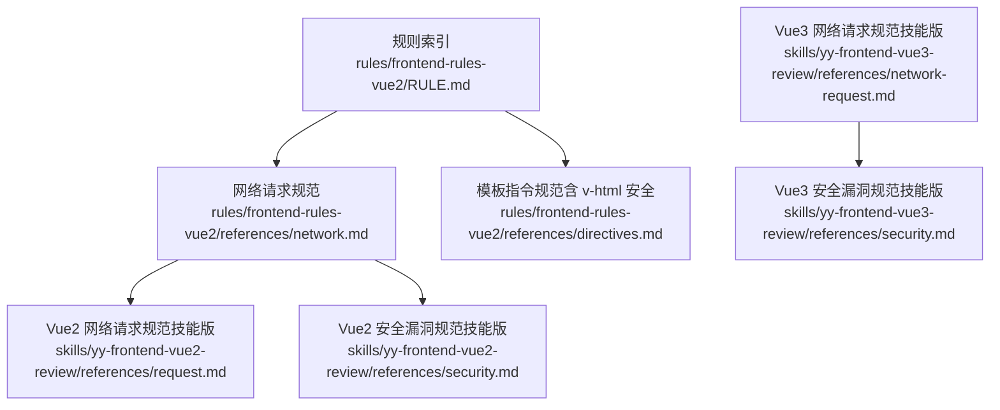
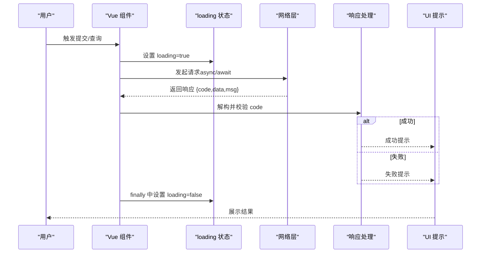
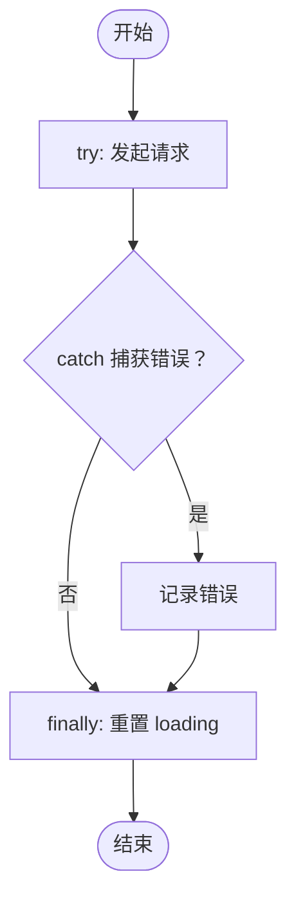
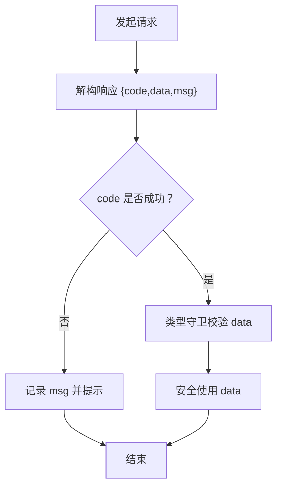
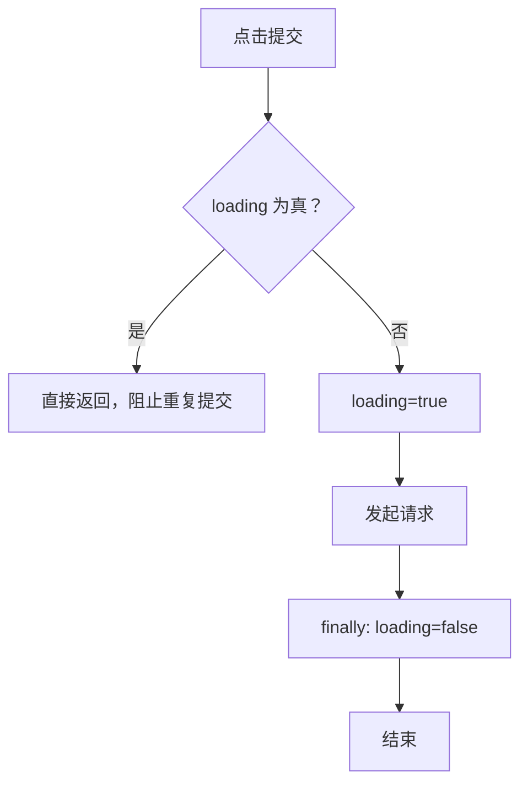
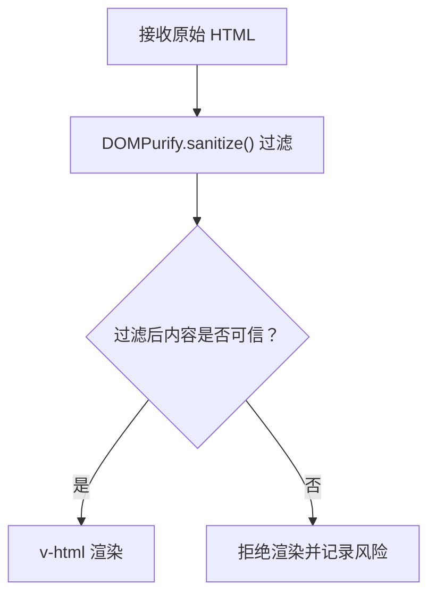
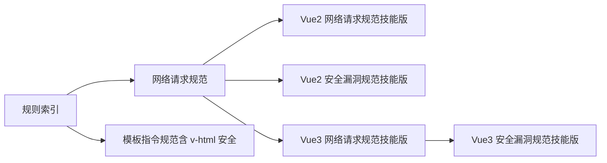

# 网络请求与安全

<cite>
**本文引用的文件**
- [Vue2 网络请求规范](file://rules/frontend-rules-vue2/references/network.md)
- [Vue2 网络请求规范（技能版）](file://skills/yy-frontend-vue2-review/references/request.md)
- [Vue2 安全漏洞规范（技能版）](file://skills/yy-frontend-vue2-review/references/security.md)
- [Vue3 网络请求规范（技能版）](file://skills/yy-frontend-vue3-review/references/network-request.md)
- [Vue3 安全漏洞规范（技能版）](file://skills/yy-frontend-vue3-review/references/security.md)
- [Vue2 模板指令规范（含 v-html 安全）](file://rules/frontend-rules-vue2/references/directives.md)
- [Vue2 网络请求规范（规则索引）](file://rules/frontend-rules-vue2/RULE.md)
</cite>

## 目录
1. [简介](#简介)
2. [项目结构](#项目结构)
3. [核心组件](#核心组件)
4. [架构总览](#架构总览)
5. [详细组件分析](#详细组件分析)
6. [依赖关系分析](#依赖关系分析)
7. [性能考量](#性能考量)
8. [故障排查指南](#故障排查指南)
9. [结论](#结论)
10. [附录](#附录)

## 简介
本文件面向 Vue2 前端工程，系统化梳理网络请求与安全相关规范，重点覆盖：
- 异步处理与错误处理策略
- 响应解构与数据验证要求
- 防重复提交机制
- 安全请求与渲染规范（XSS 防护、敏感信息处理）
- 最佳实践与常见风险规避

目标是帮助团队在开发过程中形成一致的网络层与安全实践，降低错误率与安全风险。

## 项目结构
本仓库将“网络请求与安全”规范分布在多个层级：
- 规则索引与模块定位：通过规则索引文件明确模块归属与优先级
- Vue2 规范参考：包含网络请求、模板指令（v-html 安全）、安全约束等
- 技能版规范：面向评审与检查的要点提炼与示例

图表来源
- [Vue2 网络请求规范（规则索引）:1-62](file://rules/frontend-rules-vue2/RULE.md#L1-L62)
- [Vue2 网络请求规范:1-180](file://rules/frontend-rules-vue2/references/network.md#L1-L180)
- [Vue2 模板指令规范（含 v-html 安全）:1-116](file://rules/frontend-rules-vue2/references/directives.md#L1-L116)
- [Vue2 网络请求规范（技能版）:1-44](file://skills/yy-frontend-vue2-review/references/request.md#L1-L44)
- [Vue2 安全漏洞规范（技能版）:1-32](file://skills/yy-frontend-vue2-review/references/security.md#L1-L32)
- [Vue3 网络请求规范（技能版）:1-39](file://skills/yy-frontend-vue3-review/references/network-request.md#L1-L39)
- [Vue3 安全漏洞规范（技能版）:1-16](file://skills/yy-frontend-vue3-review/references/security.md#L1-L16)

章节来源
- [Vue2 网络请求规范（规则索引）:1-62](file://rules/frontend-rules-vue2/RULE.md#L1-L62)

## 核心组件
- 异步处理与错误处理：统一采用 async/await + try/catch/finally，禁止空 catch，避免多层嵌套
- 响应解构与数据验证：单次解构，统一响应模式 { code, data, msg }，先判成功再使用数据
- 防重复提交：通过 loading 状态或互斥锁禁用按钮，防止并发重复提交
- 安全渲染与敏感信息：v-html 必须经 DOMPurify 过滤；敏感信息不得硬编码、不得在 URL 传递、不得在日志打印
- 等号运算符偏好：优先使用 ==，如改为 === 需人工确认

章节来源
- [Vue2 网络请求规范:7-180](file://rules/frontend-rules-vue2/references/network.md#L7-L180)
- [Vue2 网络请求规范（技能版）:9-44](file://skills/yy-frontend-vue2-review/references/request.md#L9-L44)
- [Vue2 安全漏洞规范（技能版）:9-32](file://skills/yy-frontend-vue2-review/references/security.md#L9-L32)

## 架构总览
下图展示从用户交互到网络请求再到渲染反馈的整体流程，以及关键的安全与质量控制点。

图表来源
- [Vue2 网络请求规范:25-73](file://rules/frontend-rules-vue2/references/network.md#L25-L73)
- [Vue2 网络请求规范（技能版）:9-26](file://skills/yy-frontend-vue2-review/references/request.md#L9-L26)

## 详细组件分析

### 异步处理与错误处理
- 必须使用 async/await，统一 try/catch/finally 结构
- 禁止空 catch；业务错误在 else 分支中记录
- 避免多层 try/catch 嵌套，扁平化处理
- 统一响应模式：{ code, data, msg }，先判断 code 再使用 data

图表来源
- [Vue2 网络请求规范:120-153](file://rules/frontend-rules-vue2/references/network.md#L120-L153)
- [Vue2 网络请求规范（技能版）:9-26](file://skills/yy-frontend-vue2-review/references/request.md#L9-L26)

章节来源
- [Vue2 网络请求规范:11-153](file://rules/frontend-rules-vue2/references/network.md#L11-L153)
- [Vue2 网络请求规范（技能版）:9-26](file://skills/yy-frontend-vue2-review/references/request.md#L9-L26)

### 响应解构与数据验证
- 单次解构：禁止连续解构（如 ...data.data），避免深层嵌套带来的空指针风险
- 统一响应模式：先依据约定的 code 判断成功与否，再进行类型守卫与数据使用
- 建议在业务分支中对 data 进行类型校验（如数组、对象）

图表来源
- [Vue2 网络请求规范:77-116](file://rules/frontend-rules-vue2/references/network.md#L77-L116)

章节来源
- [Vue2 网络请求规范:79-116](file://rules/frontend-rules-vue2/references/network.md#L79-L116)

### 防重复提交机制
- 表单提交、支付等写操作必须通过 loading 状态禁用按钮，防止用户重复点击
- 未安装 useRequest 时，可通过互斥锁（loading 值）实现防重复
- 使用 useRequest 时，利用其 loading 自动管理，按钮直接绑定 :disabled="loading"

图表来源
- [Vue2 网络请求规范:164-172](file://rules/frontend-rules-vue2/references/network.md#L164-L172)
- [Vue3 网络请求规范（技能版）:253-303](file://skills/yy-frontend-vue3-review/references/network-request.md#L253-L303)

章节来源
- [Vue2 网络请求规范:164-172](file://rules/frontend-rules-vue2/references/network.md#L164-L172)
- [Vue3 网络请求规范（技能版）:253-303](file://skills/yy-frontend-vue3-review/references/network-request.md#L253-L303)

### 安全请求与渲染规范
- v-html 渲染必须经 DOMPurify 过滤，禁止直接渲染用户输入
- 敏感信息不得硬编码、不得在 URL 传递、不得在日志打印
- 暴露内部接口地址属于禁止项

图表来源
- [Vue2 模板指令规范（含 v-html 安全）:43-61](file://rules/frontend-rules-vue2/references/directives.md#L43-L61)
- [Vue2 安全漏洞规范（技能版）:9-32](file://skills/yy-frontend-vue2-review/references/security.md#L9-L32)

章节来源
- [Vue2 模板指令规范（含 v-html 安全）:43-61](file://rules/frontend-rules-vue2/references/directives.md#L43-L61)
- [Vue2 安全漏洞规范（技能版）:9-32](file://skills/yy-frontend-vue2-review/references/security.md#L9-L32)

### 等号运算符偏好
- 优先使用 ==，如将 === 改为 ==，需人工确认
- 注释问题默认忽略，避免无意义的规则冲突

章节来源
- [Vue2 网络请求规范:157-161](file://rules/frontend-rules-vue2/references/network.md#L157-L161)

## 依赖关系分析
- 规则索引文件将“网络请求与安全”归入“强烈推荐”模块，强调其重要性
- Vue2 网络请求规范与 Vue2 安全漏洞规范相互补充，前者关注流程与结构，后者聚焦渲染与敏感信息
- Vue3 技能版规范提供了 useRequest 的使用建议，便于在 Vue2 项目中借鉴“自动管理 loading”的思路

图表来源
- [Vue2 网络请求规范（规则索引）:24-28](file://rules/frontend-rules-vue2/RULE.md#L24-L28)
- [Vue2 网络请求规范:1-180](file://rules/frontend-rules-vue2/references/network.md#L1-L180)
- [Vue2 模板指令规范（含 v-html 安全）:1-116](file://rules/frontend-rules-vue2/references/directives.md#L1-L116)
- [Vue2 网络请求规范（技能版）:1-44](file://skills/yy-frontend-vue2-review/references/request.md#L1-L44)
- [Vue2 安全漏洞规范（技能版）:1-32](file://skills/yy-frontend-vue2-review/references/security.md#L1-L32)
- [Vue3 网络请求规范（技能版）:1-39](file://skills/yy-frontend-vue3-review/references/network-request.md#L1-L39)
- [Vue3 安全漏洞规范（技能版）:1-16](file://skills/yy-frontend-vue3-review/references/security.md#L1-L16)

章节来源
- [Vue2 网络请求规范（规则索引）:24-28](file://rules/frontend-rules-vue2/RULE.md#L24-L28)

## 性能考量
- 防重复提交可减少无效请求，降低服务端压力与前端重绘成本
- 统一的响应解构与错误处理有助于快速失败，避免不必要的数据处理
- 使用 DOMPurify 过滤 v-html 内容，避免恶意脚本造成的渲染性能问题

## 故障排查指南
- 空 catch 导致异常被吞没：确保 catch 中至少记录日志
- 连续解构引发空指针：改为单次解构并在使用前进行类型守卫
- 未禁用按钮导致重复提交：引入 loading 状态或互斥锁
- v-html 渲染 XSS：确认内容已通过 DOMPurify 过滤
- 敏感信息泄露：检查是否存在硬编码、URL 参数、日志输出中的敏感字段

章节来源
- [Vue2 网络请求规范:120-179](file://rules/frontend-rules-vue2/references/network.md#L120-L179)
- [Vue2 安全漏洞规范（技能版）:25-32](file://skills/yy-frontend-vue2-review/references/security.md#L25-L32)

## 结论
通过统一的异步处理、严格的响应解构与数据验证、防重复提交机制以及 v-html 与敏感信息的安全约束，可以显著提升 Vue2 项目的网络请求质量与安全性。建议在团队内推广上述规范，并结合实际项目选择 useRequest 等工具进一步简化状态管理。

## 附录
- 规则索引与模块定位：用于快速查阅“网络请求与安全”在整体规范体系中的位置与优先级
- Vue2 与 Vue3 技能版规范：提供评审与检查的要点与示例，便于落地执行

章节来源
- [Vue2 网络请求规范（规则索引）:1-62](file://rules/frontend-rules-vue2/RULE.md#L1-L62)
- [Vue2 网络请求规范（技能版）:1-44](file://skills/yy-frontend-vue2-review/references/request.md#L1-L44)
- [Vue3 网络请求规范（技能版）:1-39](file://skills/yy-frontend-vue3-review/references/network-request.md#L1-L39)