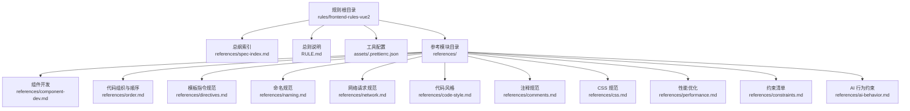
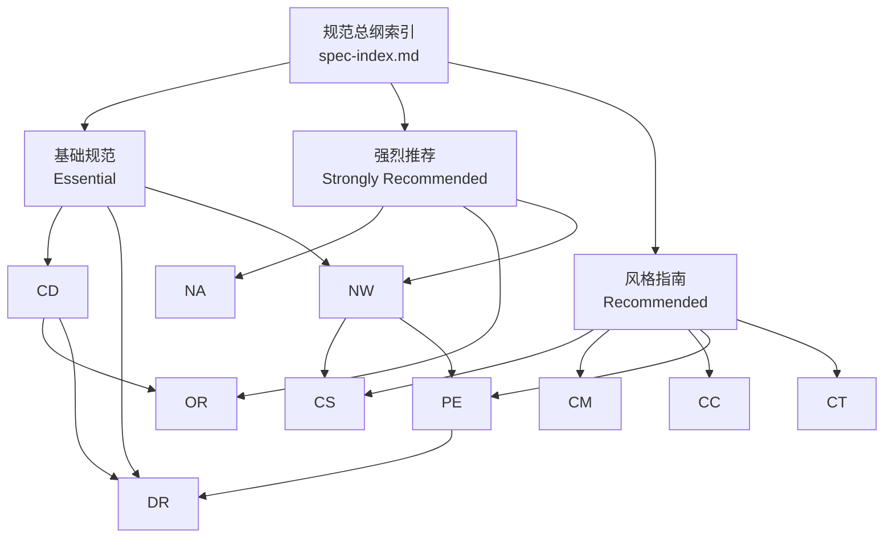
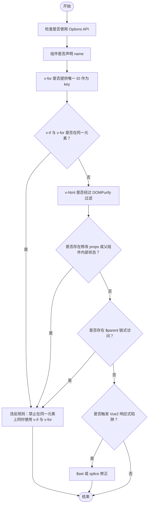
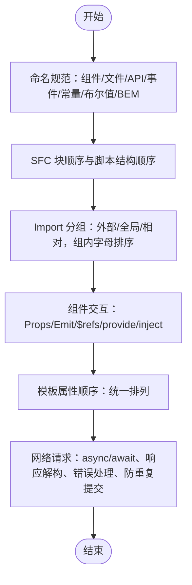
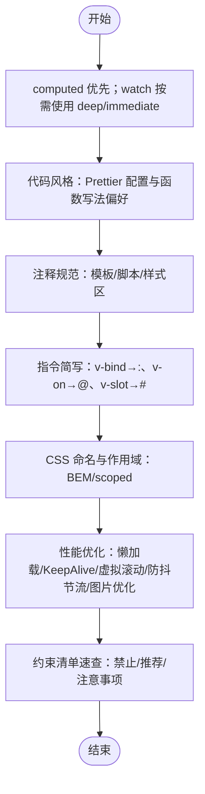
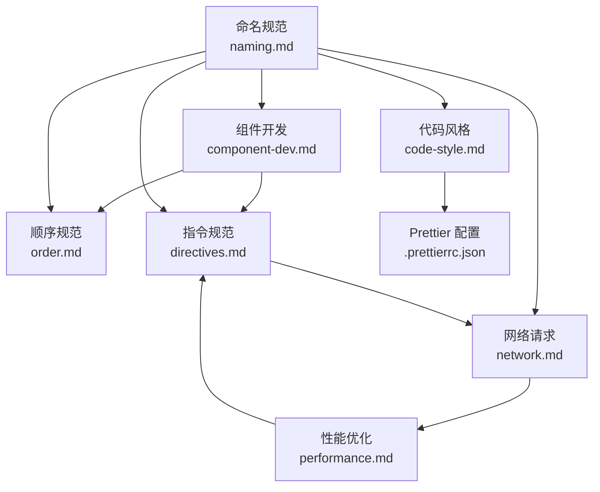

# 规范总纲

<cite>
**本文引用的文件**
- [RULE.md](file://rules/frontend-rules-vue2/RULE.md)
- [spec-index.md](file://rules/frontend-rules-vue2/references/spec-index.md)
- [component-dev.md](file://rules/frontend-rules-vue2/references/component-dev.md)
- [order.md](file://rules/frontend-rules-vue2/references/order.md)
- [directives.md](file://rules/frontend-rules-vue2/references/directives.md)
- [naming.md](file://rules/frontend-rules-vue2/references/naming.md)
- [network.md](file://rules/frontend-rules-vue2/references/network.md)
- [code-style.md](file://rules/frontend-rules-vue2/references/code-style.md)
- [comments.md](file://rules/frontend-rules-vue2/references/comments.md)
- [css.md](file://rules/frontend-rules-vue2/references/css.md)
- [performance.md](file://rules/frontend-rules-vue2/references/performance.md)
- [constraints.md](file://rules/frontend-rules-vue2/references/constraints.md)
- [ai-behavior.md](file://rules/frontend-rules-vue2/references/ai-behavior.md)
- [.prettierrc.json](file://rules/frontend-rules-vue2/assets/.prettierrc.json)
</cite>

## 目录
1. [简介](#简介)
2. [项目结构](#项目结构)
3. [核心组件](#核心组件)
4. [架构总览](#架构总览)
5. [详细组件分析](#详细组件分析)
6. [依赖分析](#依赖分析)
7. [性能考虑](#性能考虑)
8. [故障排查指南](#故障排查指南)
9. [结论](#结论)
10. [附录](#附录)

## 简介
本文件是 Vue2 前端项目开发规范的“总纲”，用于统一团队在 Options API 风格下的开发行为与质量标准。总纲采用三层优先级分级体系：
- Essential（必要的）：规避错误与潜在缺陷，必须遵守
- Strongly Recommended（强烈推荐）：提升可读性与开发体验，应尽可能遵守
- Recommended（推荐）：在多种可行实践之间保持一致，统一风格

总纲还提供规范索引与查阅路径，帮助开发者快速定位到具体规则模块；并给出执行优先级建议与最佳实践。

## 项目结构
Vue2 规范体系以“总纲 + 子模块”的方式组织，核心入口位于前端规则仓库的总则文件，子模块按主题拆分，便于独立维护与引用。

图表来源
- [RULE.md:1-62](file://rules/frontend-rules-vue2/RULE.md#L1-L62)
- [spec-index.md:1-61](file://rules/frontend-rules-vue2/references/spec-index.md#L1-L61)

章节来源
- [RULE.md:1-62](file://rules/frontend-rules-vue2/RULE.md#L1-L62)

## 核心组件
本规范围绕三大类规则展开：基础规范（Essential）、强烈推荐（Strongly Recommended）、风格指南（Recommended）。每类规则均对应若干子模块，覆盖组件开发、交互通信、模板指令、命名与导入顺序、网络请求、代码风格、注释、CSS、性能与约束等主题。

- Essential（必要的）
  - 必须使用 Options API，组件必须声明 name
  - v-for 与 key、v-if 与 v-for 冲突、v-html 安全
  - 数据修改限制、禁止 $parent 链式访问
  - Vue2 响应式陷阱（新增对象属性、数组索引赋值、数组长度修改）

- Strongly Recommended（强烈推荐）
  - 文件与标识符命名（组件/文件/API/事件/常量/布尔值/BEM）
  - SFC 块顺序与脚本结构顺序（8 段 Options 结构）
  - Import 分组（3 组）与模板属性顺序
  - 组件交互与通信（Props/Emit/$refs/provide/inject）
  - 网络请求规范（async/await、响应解构、错误处理、防重复提交）

- Recommended（推荐）
  - computed 优先、watch 按需使用 deep/immediate
  - Prettier 配置与函数写法偏好
  - 注释规范（模板/脚本/样式区）
  - 指令简写（:/@/#）
  - 样式命名与作用域（BEM/scoped）
  - 性能优化（懒加载/KeepAlive/虚拟滚动/防抖节流/图片优化）
  - 约束清单速查

章节来源
- [spec-index.md:11-56](file://rules/frontend-rules-vue2/references/spec-index.md#L11-L56)
- [RULE.md:18-36](file://rules/frontend-rules-vue2/RULE.md#L18-L36)

## 架构总览
下图展示了 Vue2 规范总纲与各子模块之间的关系，以及它们在开发流程中的位置与作用。

图表来源
- [spec-index.md:1-61](file://rules/frontend-rules-vue2/references/spec-index.md#L1-L61)
- [component-dev.md:1-92](file://rules/frontend-rules-vue2/references/component-dev.md#L1-L92)
- [order.md:1-131](file://rules/frontend-rules-vue2/references/order.md#L1-L131)
- [directives.md:1-116](file://rules/frontend-rules-vue2/references/directives.md#L1-L116)
- [naming.md:1-73](file://rules/frontend-rules-vue2/references/naming.md#L1-L73)
- [network.md:1-180](file://rules/frontend-rules-vue2/references/network.md#L1-L180)
- [code-style.md:1-63](file://rules/frontend-rules-vue2/references/code-style.md#L1-L63)
- [comments.md:1-106](file://rules/frontend-rules-vue2/references/comments.md#L1-L106)
- [css.md:1-63](file://rules/frontend-rules-vue2/references/css.md#L1-L63)
- [performance.md:1-179](file://rules/frontend-rules-vue2/references/performance.md#L1-L179)
- [constraints.md:1-57](file://rules/frontend-rules-vue2/references/constraints.md#L1-L57)

## 详细组件分析

### 基础规范（Essential）执行流程

图表来源
- [spec-index.md:11-25](file://rules/frontend-rules-vue2/references/spec-index.md#L11-L25)
- [directives.md:7-46](file://rules/frontend-rules-vue2/references/directives.md#L7-L46)
- [network.md:164-180](file://rules/frontend-rules-vue2/references/network.md#L164-L180)

章节来源
- [spec-index.md:11-25](file://rules/frontend-rules-vue2/references/spec-index.md#L11-L25)
- [directives.md:7-46](file://rules/frontend-rules-vue2/references/directives.md#L7-L46)
- [network.md:164-180](file://rules/frontend-rules-vue2/references/network.md#L164-L180)

### 强烈推荐（Strongly Recommended）执行流程

图表来源
- [naming.md:7-73](file://rules/frontend-rules-vue2/references/naming.md#L7-L73)
- [order.md:7-131](file://rules/frontend-rules-vue2/references/order.md#L7-L131)
- [directives.md:85-102](file://rules/frontend-rules-vue2/references/directives.md#L85-L102)
- [network.md:7-180](file://rules/frontend-rules-vue2/references/network.md#L7-L180)

章节来源
- [naming.md:7-73](file://rules/frontend-rules-vue2/references/naming.md#L7-L73)
- [order.md:7-131](file://rules/frontend-rules-vue2/references/order.md#L7-L131)
- [directives.md:85-102](file://rules/frontend-rules-vue2/references/directives.md#L85-L102)
- [network.md:7-180](file://rules/frontend-rules-vue2/references/network.md#L7-L180)

### 风格指南（Recommended）执行流程

图表来源
- [spec-index.md:43-56](file://rules/frontend-rules-vue2/references/spec-index.md#L43-L56)
- [code-style.md:1-63](file://rules/frontend-rules-vue2/references/code-style.md#L1-L63)
- [comments.md:1-106](file://rules/frontend-rules-vue2/references/comments.md#L1-L106)
- [directives.md:65-82](file://rules/frontend-rules-vue2/references/directives.md#L65-L82)
- [css.md:1-63](file://rules/frontend-rules-vue2/references/css.md#L1-L63)
- [performance.md:1-179](file://rules/frontend-rules-vue2/references/performance.md#L1-L179)
- [constraints.md:1-57](file://rules/frontend-rules-vue2/references/constraints.md#L1-L57)

章节来源
- [spec-index.md:43-56](file://rules/frontend-rules-vue2/references/spec-index.md#L43-L56)
- [code-style.md:1-63](file://rules/frontend-rules-vue2/references/code-style.md#L1-L63)
- [comments.md:1-106](file://rules/frontend-rules-vue2/references/comments.md#L1-L106)
- [directives.md:65-82](file://rules/frontend-rules-vue2/references/directives.md#L65-L82)
- [css.md:1-63](file://rules/frontend-rules-vue2/references/css.md#L1-L63)
- [performance.md:1-179](file://rules/frontend-rules-vue2/references/performance.md#L1-L179)
- [constraints.md:1-57](file://rules/frontend-rules-vue2/references/constraints.md#L1-L57)

### 规范索引与查阅方式
- 总纲索引：通过“规范总纲”快速定位到三层优先级与各模块链接
- 快速导航：通过“快速导航”表格快速检索模块核心内容
- 子模块直达：每个优先级下的模块均有独立文件，可直接打开查阅

章节来源
- [RULE.md:10-62](file://rules/frontend-rules-vue2/RULE.md#L10-L62)
- [spec-index.md:1-61](file://rules/frontend-rules-vue2/references/spec-index.md#L1-L61)

### 规范执行优先级建议与最佳实践
- 优先执行 Essential：先保证正确性与安全性，再追求可读性与一致性
- 逐步推广 Strongly Recommended：在团队内形成统一的结构与交互习惯
- 统一 Recommended：在风格层面保持一致，减少认知负担
- 工具链落地：结合 Prettier 配置与注释规范，自动化与人工审核并重
- AI 行为约束：仅在 src 目录内修改注释与 JSDoc，避免无授权的文件生成

章节来源
- [RULE.md:38-62](file://rules/frontend-rules-vue2/RULE.md#L38-L62)
- [ai-behavior.md:1-29](file://rules/frontend-rules-vue2/references/ai-behavior.md#L1-L29)
- [.prettierrc.json:1-19](file://rules/frontend-rules-vue2/assets/.prettierrc.json#L1-L19)

## 依赖分析
- 模块耦合
  - 组件开发（component-dev）依赖顺序（order）与指令（directives）
  - 网络请求（network）与性能（performance）相互补充
  - 命名（naming）贯穿文件、组件、API、事件、常量与 CSS
- 外部依赖
  - Prettier 配置（.prettierrc.json）统一风格
  - DOMPurify 保障 v-html 安全
  - Lodash 提供防抖节流等工具

图表来源
- [component-dev.md:1-92](file://rules/frontend-rules-vue2/references/component-dev.md#L1-L92)
- [order.md:1-131](file://rules/frontend-rules-vue2/references/order.md#L1-L131)
- [directives.md:1-116](file://rules/frontend-rules-vue2/references/directives.md#L1-L116)
- [network.md:1-180](file://rules/frontend-rules-vue2/references/network.md#L1-L180)
- [naming.md:1-73](file://rules/frontend-rules-vue2/references/naming.md#L1-L73)
- [code-style.md:1-63](file://rules/frontend-rules-vue2/references/code-style.md#L1-L63)
- [.prettierrc.json:1-19](file://rules/frontend-rules-vue2/assets/.prettierrc.json#L1-L19)

章节来源
- [component-dev.md:1-92](file://rules/frontend-rules-vue2/references/component-dev.md#L1-L92)
- [order.md:1-131](file://rules/frontend-rules-vue2/references/order.md#L1-L131)
- [directives.md:1-116](file://rules/frontend-rules-vue2/references/directives.md#L1-L116)
- [network.md:1-180](file://rules/frontend-rules-vue2/references/network.md#L1-L180)
- [naming.md:1-73](file://rules/frontend-rules-vue2/references/naming.md#L1-L73)
- [code-style.md:1-63](file://rules/frontend-rules-vue2/references/code-style.md#L1-L63)
- [.prettierrc.json:1-19](file://rules/frontend-rules-vue2/assets/.prettierrc.json#L1-L19)

## 性能考虑
- 懒加载与路由懒加载：减少首屏包体，提升启动速度
- KeepAlive 缓存：对不常更新组件进行精确缓存，避免内存泄漏
- 虚拟滚动：长列表仅渲染可视区域，降低 DOM 压力
- 防抖节流：高频事件控制触发频率，避免过度渲染
- 图片优化：WebP 优先、合适尺寸、非首屏懒加载
- 模板层轻量化：模板只负责展示，复杂逻辑移至 computed/methods
- 响应式性能：优先 computed、大数据 freeze、避免 watch 同步 DOM 操作

章节来源
- [performance.md:1-179](file://rules/frontend-rules-vue2/references/performance.md#L1-L179)

## 故障排查指南
- 常见违规与修复
  - 连续数据解构：改为单次解构
  - 父组件修改子组件数据：通过 props 与 emit 正确通信
  - 修改 props：只读访问，必要时通过本地 data/computed 转换
  - 使用 mixins：改用组合式函数或组件组合
  - 无意义命名：使用语义化命名
  - $parent 链式访问：避免跨级访问
  - v-for 与 v-if 同元素：使用 template 包裹或 computed 过滤
  - index 作为 key：必须使用唯一 ID
  - setTimeout 替代 $nextTick：DOM 更新必须用 $nextTick
- 响应式陷阱
  - 新增对象属性：使用 $set
  - 数组索引赋值：使用 $set
  - 数组长度修改：使用 splice

章节来源
- [constraints.md:3-57](file://rules/frontend-rules-vue2/references/constraints.md#L3-L57)
- [network.md:77-116](file://rules/frontend-rules-vue2/references/network.md#L77-L116)
- [directives.md:22-46](file://rules/frontend-rules-vue2/references/directives.md#L22-L46)

## 结论
Vue2 规范总纲通过三层优先级体系，将“正确性—可读性—一致性”逐层递进，既保证开发质量，又兼顾团队协作效率。建议团队以 Essential 为基础，逐步推广 Strongly Recommended 与 Recommended，配合工具链与约束清单，持续提升代码质量与可维护性。

## 附录
- 适用范围与技术栈
  - 适用文件：src 目录下的 .vue/.js/.css/.scss/.less
  - 技术栈：Vue2 单文件组件，Options API（data/methods/computed/watch/生命周期钩子）
- 快速导航（模块与核心内容）
  - 规范总纲：三级优先级索引
  - 组件开发：Options API 结构、name 声明、JSDoc、元素顺序、方法职责、页面拆分
  - 交互通信：Props 定义、Emit 白名单、$refs 访问、provide/inject、禁用 $parent
  - 模板指令：v-for/key、v-if 冲突、v-html 安全、指令简写、属性顺序
  - 结构顺序：3 组 import 排序、<script> 内部 8 段 Options 结构
  - 命名规范：文件/组件/API/事件/常量/布尔值/BEM
  - 网络请求：async/await、单次解构、防重复提交、安全规范
  - 代码风格：Prettier 配置、箭头函数优先
  - 注释规范：模板/脚本/样式区注释格式、注释保护原则
  - CSS 样式：BEM 命名、scoped 优先、全局样式标注
  - 性能优化：懒加载/KeepAlive/虚拟滚动/防抖节流、$set 响应式陷阱
  - 约束清单：禁止项/推荐项/注意事项速查表
  - AI 行为约束：修改权限红线、文档生成约束

章节来源
- [RULE.md:38-62](file://rules/frontend-rules-vue2/RULE.md#L38-L62)
- [spec-index.md:1-61](file://rules/frontend-rules-vue2/references/spec-index.md#L1-L61)