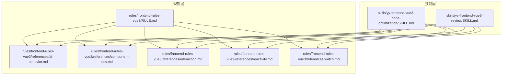
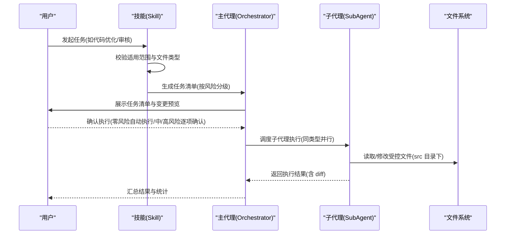
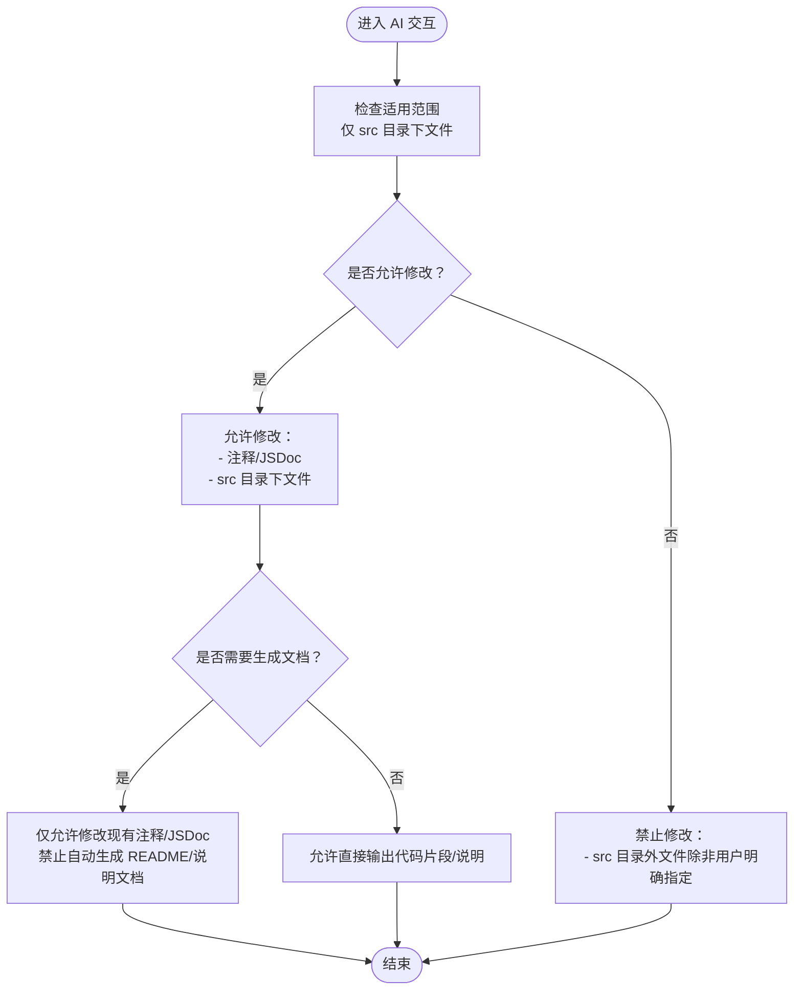
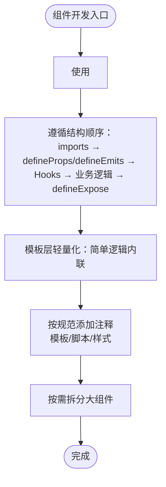
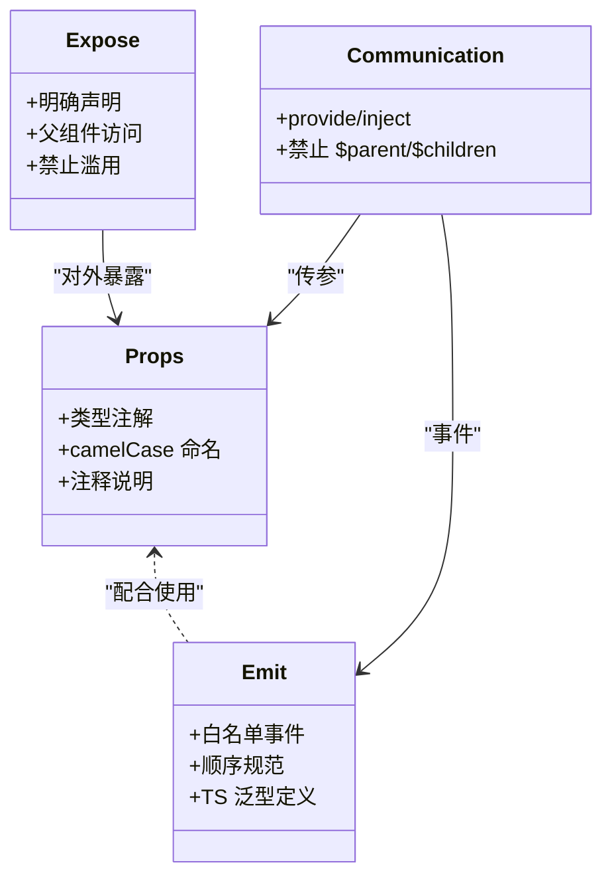
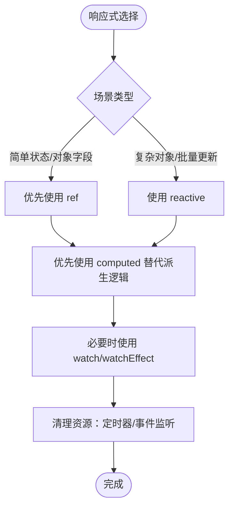
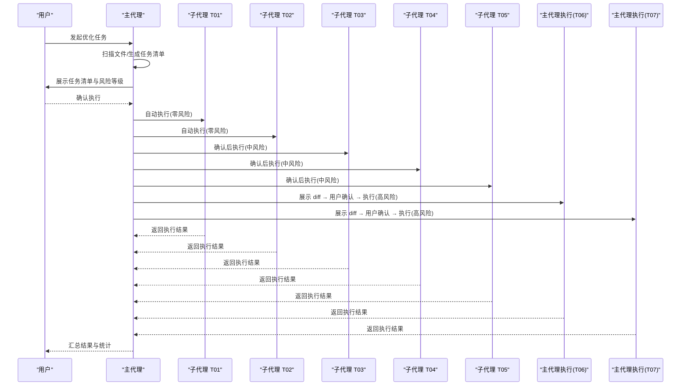
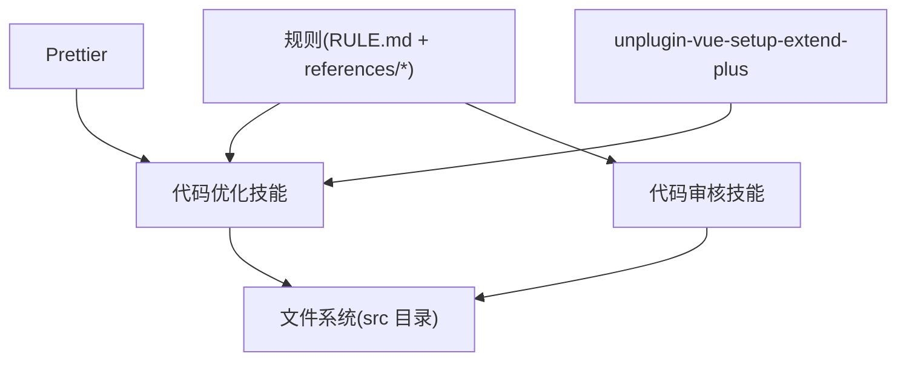

# AI 行为约束

<cite>
**本文引用的文件**
- [README.md](file://README.md)
- [RULE.md](file://rules/frontend-rules-vue3/RULE.md)
- [ai-behavior.md](file://rules/frontend-rules-vue3/references/ai-behavior.md)
- [ai-behavior.md](file://skills/yy-frontend-vue3-code-optimization/rules/ai-behavior.md)
- [ai-behavior.md](file://skills/yy-frontend-vue3-review/rules/ai-behavior.md)
- [SKILL.md](file://skills/yy-frontend-vue3-code-optimization/SKILL.md)
- [SKILL.md](file://skills/yy-frontend-vue3-review/SKILL.md)
- [component-dev.md](file://rules/frontend-rules-vue3/references/component-dev.md)
- [interaction.md](file://rules/frontend-rules-vue3/references/interaction.md)
- [reactivity.md](file://rules/frontend-rules-vue3/references/reactivity.md)
- [watch.md](file://rules/frontend-rules-vue3/references/watch.md)
</cite>

## 目录
1. [简介](#简介)
2. [项目结构](#项目结构)
3. [核心组件](#核心组件)
4. [架构总览](#架构总览)
5. [详细组件分析](#详细组件分析)
6. [依赖分析](#依赖分析)
7. [性能考量](#性能考量)
8. [故障排查指南](#故障排查指南)
9. [结论](#结论)
10. [附录](#附录)

## 简介
本文件系统性阐述 Vue3 项目中 AI 行为约束与交互规则，重点覆盖：
- AI 在对话与文件操作中的“红线”与“行为模式”
- 修改权限的控制机制与文档生成的约束规则
- 直接输出规则的重要性和应用场景
- AI 辅助开发时的安全考虑与最佳实践
- 具体使用示例，展示如何在 Vue3 项目中正确使用 AI 工具进行代码生成与优化

## 项目结构
本仓库围绕“规则 + 技能”的双轨体系构建：
- 规则层：集中定义 Vue3 开发规范与 AI 行为约束，确保 AI 的修改范围与输出行为可控
- 技能层：面向具体任务（如代码优化、代码审核）落地执行，严格遵循规则层约束

图表来源
- [RULE.md:1-68](file://rules/frontend-rules-vue3/RULE.md#L1-L68)
- [ai-behavior.md:1-29](file://rules/frontend-rules-vue3/references/ai-behavior.md#L1-L29)
- [component-dev.md:1-81](file://rules/frontend-rules-vue3/references/component-dev.md#L1-L81)
- [interaction.md:1-125](file://rules/frontend-rules-vue3/references/interaction.md#L1-L125)
- [reactivity.md:1-227](file://rules/frontend-rules-vue3/references/reactivity.md#L1-L227)
- [watch.md:1-154](file://rules/frontend-rules-vue3/references/watch.md#L1-L154)
- [SKILL.md:1-464](file://skills/yy-frontend-vue3-code-optimization/SKILL.md#L1-L464)
- [SKILL.md:1-206](file://skills/yy-frontend-vue3-review/SKILL.md#L1-L206)

章节来源
- [README.md:1-104](file://README.md#L1-L104)
- [RULE.md:1-68](file://rules/frontend-rules-vue3/RULE.md#L1-L68)

## 核心组件
- AI 行为与交互约束：定义适用范围、直接输出、文档生成、修改权限等行为准则
- Vue3 组件开发规范：统一 `<script setup>` 结构、Props/Emit/Expose、组件通信、注释规范
- 响应式与监听规范：ref/reactive/computed 选择与转换、watch/watchEffect 使用与清理
- 代码优化与审核技能：以“零/中/高风险”分级的执行流程与用户确认机制

章节来源
- [ai-behavior.md:1-29](file://rules/frontend-rules-vue3/references/ai-behavior.md#L1-L29)
- [component-dev.md:1-81](file://rules/frontend-rules-vue3/references/component-dev.md#L1-L81)
- [reactivity.md:1-227](file://rules/frontend-rules-vue3/references/reactivity.md#L1-L227)
- [watch.md:1-154](file://rules/frontend-rules-vue3/references/watch.md#L1-L154)
- [SKILL.md:1-464](file://skills/yy-frontend-vue3-code-optimization/SKILL.md#L1-L464)
- [SKILL.md:1-206](file://skills/yy-frontend-vue3-review/SKILL.md#L1-L206)

## 架构总览
AI 在 Vue3 项目中的行为与执行遵循“规则先行、技能落地、用户确认”的闭环：

图表来源
- [SKILL.md:81-129](file://skills/yy-frontend-vue3-code-optimization/SKILL.md#L81-L129)
- [SKILL.md:141-165](file://skills/yy-frontend-vue3-code-optimization/SKILL.md#L141-L165)
- [ai-behavior.md:5-29](file://rules/frontend-rules-vue3/references/ai-behavior.md#L5-L29)

## 详细组件分析

### AI 行为与交互约束
- 适用范围：仅允许操作 `src` 目录下的 `.vue`、`.ts`、`.js`、`.css`、`.scss`、`.less` 文件
- 直接输出：允许在对话中直接输出文字说明、总结或代码片段，无需总是生成文件
- 文档生成：允许修改代码中的注释和 JSDoc；禁止未经用户明确要求就创建 README、说明文档等
- 修改权限：允许修改代码中的注释/JSDoc 与 `src` 目录下的文件；禁止修改 `src` 目录之外的任何文件（除非用户明确指定）

图表来源
- [ai-behavior.md:5-29](file://rules/frontend-rules-vue3/references/ai-behavior.md#L5-L29)

章节来源
- [ai-behavior.md:1-29](file://rules/frontend-rules-vue3/references/ai-behavior.md#L1-L29)
- [ai-behavior.md:1-29](file://skills/yy-frontend-vue3-code-optimization/rules/ai-behavior.md#L1-L29)
- [ai-behavior.md:1-29](file://skills/yy-frontend-vue3-review/rules/ai-behavior.md#L1-L29)

### Vue3 组件开发规范
- `<script setup>` 要求：必须使用 `<script setup>` 语法，禁止 Options API 写法与 `this`
- 脚本结构顺序：imports → defineProps/defineEmits → Hooks → 业务逻辑 → defineExpose
- 模板层轻量化：模板职责分离、简单逻辑内联
- 注释规范：模板/脚本/样式注释格式与保护原则
- 页面拆分建议：组件超过一定规模按功能区块拆分

图表来源
- [component-dev.md:7-69](file://rules/frontend-rules-vue3/references/component-dev.md#L7-L69)

章节来源
- [component-dev.md:1-81](file://rules/frontend-rules-vue3/references/component-dev.md#L1-L81)

### 组件交互与通信规范
- Props 定义：必须使用 TypeScript 类型注解，命名 camelCase，必须添加注释
- Emit 事件：使用白名单事件名，遵循 update:modelValue/value → 其他业务事件 → change/click 的顺序
- DefineExpose：仅暴露父组件业务必须调用的方法，禁止滥用
- 组件间通信：provide/inject 仅用于深层传参，禁止通过 $parent/$children 链式访问

图表来源
- [interaction.md:7-125](file://rules/frontend-rules-vue3/references/interaction.md#L7-L125)

章节来源
- [interaction.md:1-125](file://rules/frontend-rules-vue3/references/interaction.md#L1-L125)

### 响应式与监听规范
- 选择原则：优先使用 ref，尽可能少用 reactive；computed 优先替代 watch 中的派生逻辑
- Reactive 转 Ref：在简单状态与对象数据场景下优先 ref，避免解构丢失响应式
- watch/watchEffect：深度监听需声明 deep，立即执行需 immediate；定时器/事件监听需在卸载时清理

图表来源
- [reactivity.md:7-107](file://rules/frontend-rules-vue3/references/reactivity.md#L7-L107)
- [watch.md:7-154](file://rules/frontend-rules-vue3/references/watch.md#L7-L154)

章节来源
- [reactivity.md:1-227](file://rules/frontend-rules-vue3/references/reactivity.md#L1-L227)
- [watch.md:1-154](file://rules/frontend-rules-vue3/references/watch.md#L1-L154)

### 代码优化与审核技能
- 风险分级与执行规则：
  - 零风险：自动执行（如业务逻辑梳理、注释增强）
  - 中风险：用户确认后执行（如代码风格清洗、CSS/BEM 规范、语义化命名）
  - 高风险：逐项展示 diff → 用户确认 → 执行（如逻辑深度优化、无效代码清理）
- 子代理调度：按任务类型分配独立子代理，实现职责单一、并行执行、故障隔离
- 输出契约：统一输出格式，关键变更提供 diff 对比，汇总统计信息

图表来源
- [SKILL.md:48-129](file://skills/yy-frontend-vue3-code-optimization/SKILL.md#L48-L129)
- [SKILL.md:141-174](file://skills/yy-frontend-vue3-code-optimization/SKILL.md#L141-L174)

章节来源
- [SKILL.md:1-464](file://skills/yy-frontend-vue3-code-optimization/SKILL.md#L1-L464)

### 审核技能要点
- 适用范围：默认扫描 `src` 目录下变动文件，支持指定范围与无匹配文件提示
- 维度清单：代码风格、最佳实践、组件规范、命名规范、网络请求、computed 规范、逻辑错误、安全漏洞、绝对禁止项
- 执行规则：严重/中等问题必须修复，轻微问题不影响通过
- 输出格式：统一“通过/不通过”结论与问题统计，按严重程度分组输出详情与修复建议

章节来源
- [SKILL.md:1-206](file://skills/yy-frontend-vue3-review/SKILL.md#L1-L206)

## 依赖分析
- 规则与技能的耦合关系：技能执行严格依赖规则层的约束与规范，确保 AI 的行为与输出在可控范围内
- 外部依赖：技能执行依赖项目结构（src 目录、SFC/TSX 文件类型）与工具链（如 Prettier、unplugin-vue-setup-extend-plus 等）

图表来源
- [RULE.md:1-68](file://rules/frontend-rules-vue3/RULE.md#L1-L68)
- [SKILL.md:141-148](file://skills/yy-frontend-vue3-code-optimization/SKILL.md#L141-L148)

章节来源
- [RULE.md:1-68](file://rules/frontend-rules-vue3/RULE.md#L1-L68)
- [SKILL.md:141-148](file://skills/yy-frontend-vue3-code-optimization/SKILL.md#L141-L148)

## 性能考量
- 零/中风险任务可并行处理，缩短整体耗时
- 高风险任务逐项确认并展示 diff，避免大规模不可逆变更
- 大型文件建议分批处理，避免单次任务过长
- 模板层轻量化与 computed 优先有助于减少重渲染与计算开销

## 故障排查指南
- 未命中 src 目录：确认项目结构与文件路径，确保仅操作 src 下文件
- 风险任务未执行：检查用户确认状态与风险等级，零风险自动执行，中/高风险需确认
- 无效代码清理误删：关注“逐项确认”与“谨慎判断”规则，保留可能动态使用的代码
- 审核不通过：优先修复严重与中等问题，按文件分组与严重程度排序查看详情

章节来源
- [SKILL.md:141-174](file://skills/yy-frontend-vue3-code-optimization/SKILL.md#L141-L174)
- [SKILL.md:148-161](file://skills/yy-frontend-vue3-review/SKILL.md#L148-L161)

## 结论
通过“规则先行、技能落地、用户确认”的闭环，Vue3 项目中的 AI 行为被有效约束与引导。AI 可直接输出说明与代码片段，允许修改注释与 src 目录下的文件，但严禁越权修改项目其他区域。代码优化与审核技能以风险分级与子代理并行执行的方式，在保障安全的同时提升效率。遵循本文档的最佳实践，可在 Vue3 项目中安全、高效地使用 AI 工具进行代码生成与优化。

## 附录
- 使用示例（概念性说明）
  - 代码优化：在对话中请求“优化当前 git 变动的 Vue3 组件”，AI 将扫描 src 下变动文件，生成任务清单，零风险自动执行，中/高风险逐项确认后执行
  - 代码审核：在对话中请求“审核 src/views 下的改动文件”，AI 将按维度清单逐项检查并输出审核结果与修复建议
  - 直接输出：在对话中请求“解释某段代码的作用”，AI 可直接输出说明与代码片段，无需生成文件